# OpenCode Checkpoint 机制实现

## TL;DR（结论先行）

一句话定义：OpenCode 的 Checkpoint 是通过**影子 Git 仓库（Shadow Git）**实现文件级可回滚能力，并与消息流强绑定的机制，每个 Agent Step 自动创建 tree hash 快照，支持 revert/unrevert 双向操作。

OpenCode 的核心取舍：**影子 Git + 数据库存储 + Step 级粒度**（对比 Kimi CLI 的内存文件持久化、Gemini CLI 的 Git 快照、Codex 的无回滚），在文件系统与会话状态之间建立同步回滚能力，但需要本地 Git 环境支持。

---

## 1. 为什么需要这个机制？

### 1.1 问题场景

想象一个没有 Checkpoint 的 Agent Loop：

```
用户: "修复这个 bug"
  → LLM: "先读文件" → 读文件
  → LLM: "修改第 42 行" → 写文件（文件已变更）
  → LLM: "再跑测试" → 测试失败
  → 用户想回退到"修改前"状态
  → 无法回退，文件变更已永久生效
```

**有 Checkpoint**：
```
  → Step 1 开始前: Snapshot.track() 创建 checkpoint hash A
  → Step 1 结束: 检测到文件变更，生成 patch 记录
  → Step 2 开始前: Snapshot.track() 创建 checkpoint hash B
  → 测试失败，用户触发 revert
  → Snapshot.revert(patches) 恢复文件到 hash A 状态
  → 同时清理会话历史中 Step 2 的消息
```

### 1.2 核心挑战

| 挑战 | 不解决的后果 |
|-----|-------------|
| 文件副作用无法撤销 | Agent 修改文件后无法恢复，用户需手动修复 |
| 会话状态与文件状态不一致 | 回滚消息后文件仍是修改后状态，导致混乱 |
| 回滚粒度太粗 | 整个 Session 回滚成本太高，需要细粒度控制 |
| 存储空间无限增长 | 频繁快照导致磁盘空间耗尽 |

---

## 2. 整体架构

### 2.1 在系统中的位置

```text
┌─────────────────────────────────────────────────────────────┐
│ CLI 入口 / Session Runtime                                   │
│ opencode/packages/opencode/src/project/bootstrap.ts:16       │
└───────────────────────┬─────────────────────────────────────┘
                        │ 初始化 Snapshot.init()
                        ▼
┌─────────────────────────────────────────────────────────────┐
│ ▓▓▓ Agent Loop (SessionProcessor) ▓▓▓                       │
│ opencode/packages/opencode/src/session/processor.ts          │
│ - process()   : 单轮处理入口                                 │
│ - start-step  : Snapshot.track() 创建 checkpoint            │
│ - finish-step : Snapshot.patch() 记录变更                   │
└───────────────────────┬─────────────────────────────────────┘
                        │ 调用
        ┌───────────────┼───────────────┐
        ▼               ▼               ▼
┌──────────────┐ ┌──────────────┐ ┌──────────────┐
│ Snapshot     │ │ SessionRevert│ │ MessageV2    │
│ 影子 Git 管理 │ │ 回滚协调器    │ │ 消息部件定义  │
│ snapshot/    │ │ session/     │ │ message-v2.ts│
│ index.ts     │ │ revert.ts    │ │              │
└──────────────┘ └──────────────┘ └──────────────┘
```

### 2.2 核心组件职责

| 组件 | 职责 | 代码位置 |
|-----|------|---------|
| `Snapshot` | 管理影子 Git 仓库，提供 track/patch/revert/restore 操作 | `opencode/packages/opencode/src/snapshot/index.ts:12` |
| `SessionProcessor` | 在 Agent Loop 中集成 Checkpoint，处理 start-step/finish-step 事件 | `opencode/packages/opencode/src/session/processor.ts:19` |
| `SessionRevert` | 协调会话级回滚，管理消息清理和文件恢复 | `opencode/packages/opencode/src/session/revert.ts:14` |
| `MessageV2` | 定义 step-start/step-finish/patch 等消息部件类型 | `opencode/packages/opencode/src/session/message-v2.ts:19` |
| `Vcs` | 检测项目 Git 状态，为 Snapshot 提供前提条件 | `opencode/packages/opencode/src/project/vcs.ts:12` |

### 2.3 核心组件交互关系

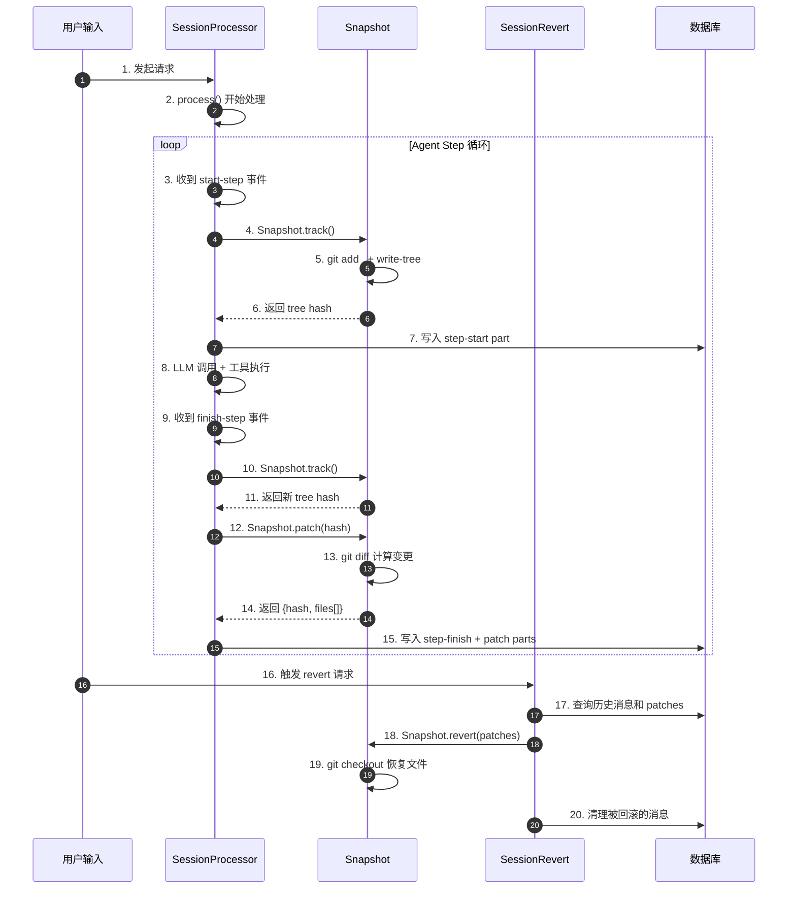

**关键交互说明**：

| 步骤 | 交互内容 | 设计意图 |
|-----|---------|---------|
| 4-6 | Step 开始时创建 tree hash | 每个 Step 都有可回滚的文件状态锚点 |
| 10-15 | Step 结束时记录变更 | 通过 patch part 持久化变更文件列表 |
| 16-20 | Revert 时协调文件和消息 | 确保文件系统与会话状态同步回滚 |

---

## 3. 核心组件详细分析

### 3.1 Snapshot 内部结构

#### 职责定位

Snapshot 是 Checkpoint 机制的底层实现，通过影子 Git 仓库管理文件状态快照，与项目目录解耦。

#### 状态机图

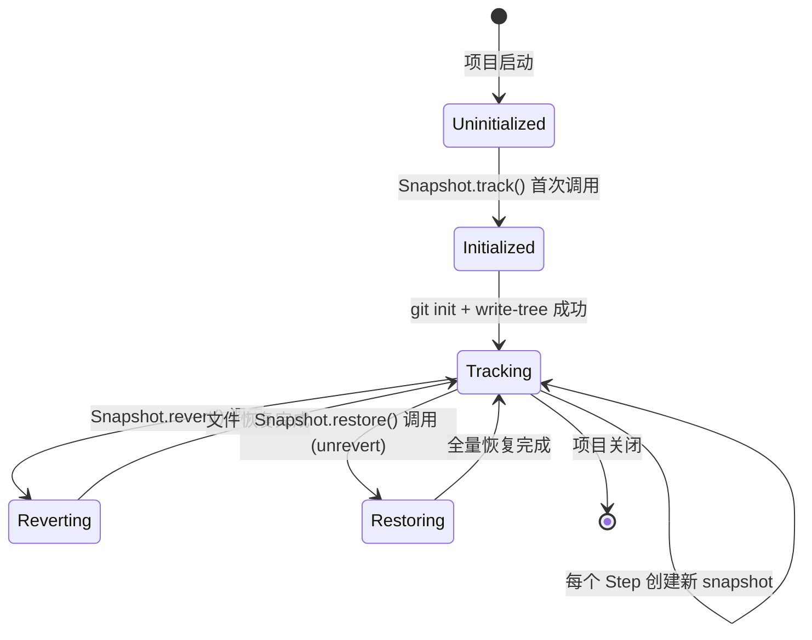

**状态说明**：

| 状态 | 说明 | 进入条件 | 退出条件 |
|-----|------|---------|---------|
| Uninitialized | 未初始化，影子仓库不存在 | 项目启动 | 首次调用 track() |
| Initialized | 影子仓库已创建 | git init 成功 | 完成首次 write-tree |
| Tracking | 正常运行，可创建 snapshot | 有有效的 tree hash | 调用 revert/restore |
| Reverting | 正在回滚文件 | revert() 调用 | 所有文件处理完成 |
| Restoring | 正在全量恢复 | restore() 调用 | checkout-index 完成 |

#### 内部数据流

```text
┌─────────────────────────────────────────────────────────────┐
│  输入层                                                      │
│  ├── Step 开始 ──► Snapshot.track() ──► git add + write-tree│
│  ├── Step 结束 ──► Snapshot.patch(hash) ──► git diff        │
│  └── Revert 请求 ──► Snapshot.revert(patches)               │
└──────────────────────────┬──────────────────────────────────┘
                           ▼
┌─────────────────────────────────────────────────────────────┐
│  影子 Git 层                                                 │
│  ├── git-dir: <data>/snapshot/<project.id>                  │
│  ├── work-tree: <真实项目目录>                               │
│  ├── 命令: git add / write-tree / diff / checkout            │
│  └── 周期清理: git gc --prune=7.days                         │
└──────────────────────────┬──────────────────────────────────┘
                           ▼
┌─────────────────────────────────────────────────────────────┐
│  输出层                                                      │
│  ├── track() ──► tree hash (checkpoint 标识)                │
│  ├── patch() ──► {hash, files[]} (变更文件列表)              │
│  └── revert() ──► 文件系统恢复                               │
└─────────────────────────────────────────────────────────────┘
```

#### 关键算法逻辑

**Track 流程**：

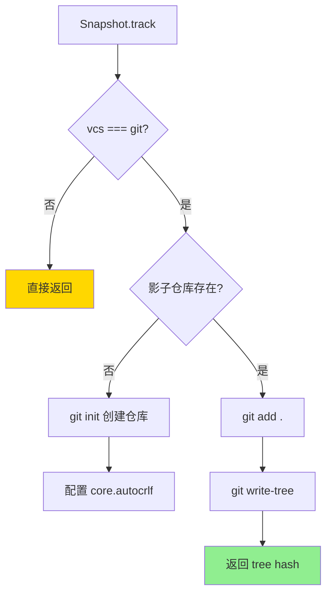

**Revert 流程**：

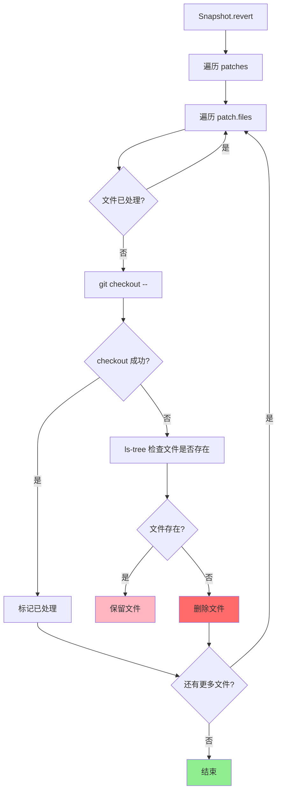

**算法要点**：

1. **去重处理**：使用 Set 跟踪已处理文件，避免重复恢复
2. **新增文件处理**：通过 ls-tree 检查文件在 snapshot 中是否存在，不存在则删除
3. **错误容忍**：所有 git 命令使用 nothrow()，失败时记录日志但不中断流程

#### 关键接口

| 接口 | 输入 | 输出 | 说明 | 代码位置 |
|-----|------|------|------|---------|
| `track()` | - | `string | undefined` | 创建当前状态的 tree hash | `snapshot/index.ts:51` |
| `patch(hash)` | `string` | `Patch` | 计算自 hash 以来的变更文件 | `snapshot/index.ts:85` |
| `revert(patches)` | `Patch[]` | - | 按 patches 恢复文件 | `snapshot/index.ts:131` |
| `restore(snapshot)` | `string` | - | 全量恢复到指定 snapshot | `snapshot/index.ts:112` |
| `cleanup()` | - | - | 周期清理旧快照 | `snapshot/index.ts:26` |

---

### 3.2 SessionProcessor 集成

#### 职责定位

SessionProcessor 是 Checkpoint 与 Agent Loop 的集成点，负责在 Step 边界触发 Snapshot 操作。

#### 关键代码逻辑

**Start-Step 处理**：

```typescript
// opencode/packages/opencode/src/session/processor.ts:233-242
case "start-step":
  snapshot = await Snapshot.track()
  await Session.updatePart({
    id: Identifier.ascending("part"),
    messageID: input.assistantMessage.id,
    sessionID: input.sessionID,
    snapshot,
    type: "step-start",
  })
  break
```

**Finish-Step 处理**：

```typescript
// opencode/packages/opencode/src/session/processor.ts:244-277
case "finish-step":
  // ... 更新 token/cost 统计 ...
  await Session.updatePart({
    id: Identifier.ascending("part"),
    // ...
    type: "step-finish",
    snapshot: await Snapshot.track(),
  })
  // 生成 patch 记录
  if (snapshot) {
    const patch = await Snapshot.patch(snapshot)
    if (patch.files.length) {
      await Session.updatePart({
        id: Identifier.ascending("part"),
        messageID: input.assistantMessage.id,
        sessionID: input.sessionID,
        type: "patch",
        hash: patch.hash,
        files: patch.files,
      })
    }
    snapshot = undefined
  }
  break
```

---

### 3.3 SessionRevert 回滚协调

#### 职责定位

SessionRevert 协调文件回滚和消息清理，实现完整的 revert/unrevert 能力。

#### 关键算法逻辑

**Revert 流程**：

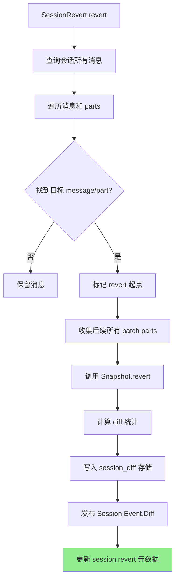

**Cleanup 流程**（下次 prompt 前执行）：

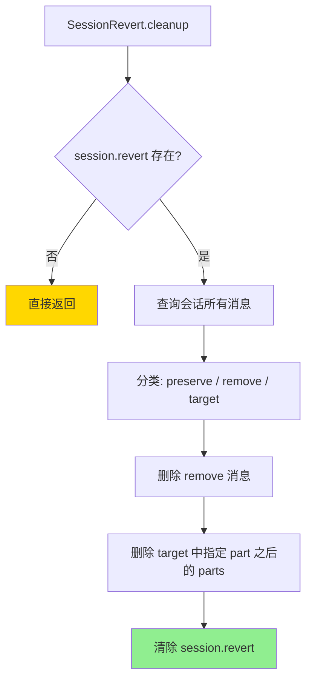

---

### 3.4 组件间协作时序

#### Revert 完整流程

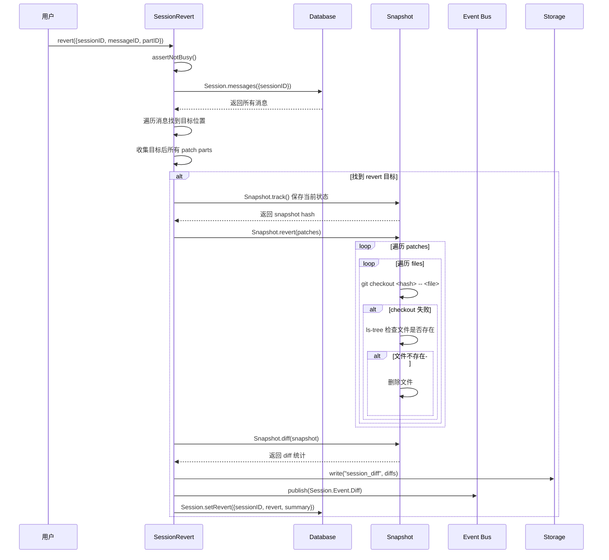

---

### 3.4 关键数据路径

#### 主路径（正常 Step）

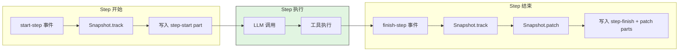

#### 异常路径（Revert）

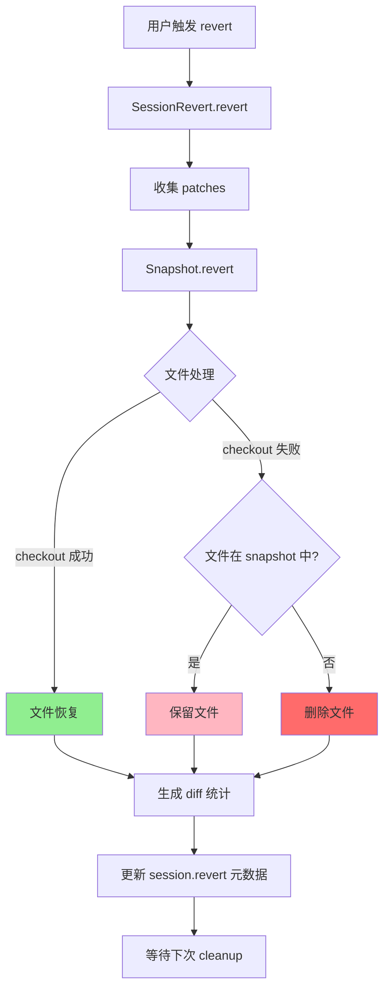

---

## 4. 端到端数据流转

### 4.1 正常流程（详细版）

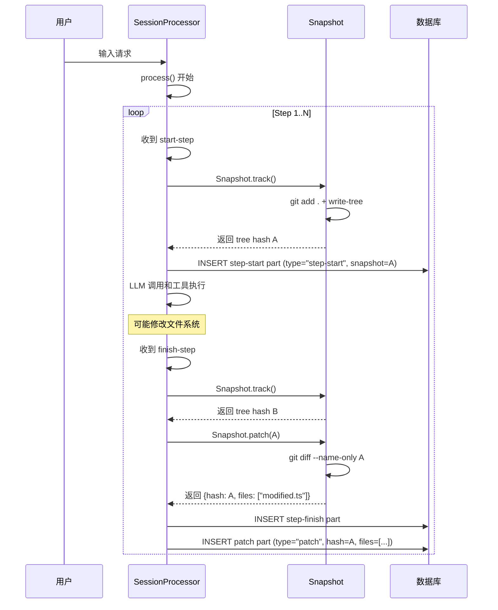

**数据变换详情**：

| 阶段 | 输入 | 处理 | 输出 | 代码位置 |
|-----|------|------|------|---------|
| Track | 当前文件系统状态 | git add + write-tree | tree hash | `snapshot/index.ts:51-77` |
| Patch | tree hash | git diff --name-only | 变更文件列表 | `snapshot/index.ts:85-110` |
| 持久化 | patch 数据 | INSERT PartTable | 数据库记录 | `processor.ts:264-276` |

### 4.2 数据流向图

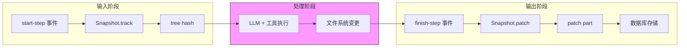

### 4.3 异常/边界流程

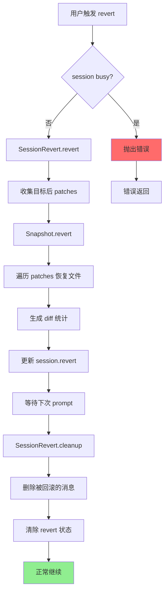

---

## 5. 关键代码实现

### 5.1 核心数据结构

**Patch 类型定义**：

```typescript
// opencode/packages/opencode/src/snapshot/index.ts:79-83
export const Patch = z.object({
  hash: z.string(),
  files: z.string().array(),
})
export type Patch = z.infer<typeof Patch>
```

**消息部件类型**：

```typescript
// opencode/packages/opencode/src/session/message-v2.ts:233-259
export const StepStartPart = PartBase.extend({
  type: z.literal("step-start"),
  snapshot: z.string().optional(),
})

export const StepFinishPart = PartBase.extend({
  type: z.literal("step-finish"),
  reason: z.string(),
  snapshot: z.string().optional(),
  cost: z.number(),
  tokens: z.object({...}),
})

export const PatchPart = PartBase.extend({
  type: z.literal("patch"),
  hash: z.string(),
  files: z.string().array(),
})
```

**Revert 元数据**：

```typescript
// opencode/packages/opencode/src/session/index.ts (推断)
interface SessionInfo {
  revert?: {
    messageID: string
    partID?: string
    snapshot?: string
    diff?: string
  }
}
```

**字段说明**：

| 字段 | 类型 | 用途 |
|-----|------|------|
| `hash` | `string` | Git tree hash，作为 checkpoint 唯一标识 |
| `files` | `string[]` | 自 checkpoint 以来变更的绝对路径列表 |
| `snapshot` | `string` | Step 开始/结束时的 tree hash |
| `type` | `"step-start" | "step-finish" | "patch"` | 消息部件类型标识 |

### 5.2 主链路代码

**Snapshot.track 实现**：

```typescript
// opencode/packages/opencode/src/snapshot/index.ts:51-77
export async function track() {
  if (Instance.project.vcs !== "git" || Flag.OPENCODE_CLIENT === "acp") return
  const cfg = await Config.get()
  if (cfg.snapshot === false) return
  const git = gitdir()
  if (await fs.mkdir(git, { recursive: true })) {
    await $`git init`
      .env({
        ...process.env,
        GIT_DIR: git,
        GIT_WORK_TREE: Instance.worktree,
      })
      .quiet()
      .nothrow()
    await $`git --git-dir ${git} config core.autocrlf false`.quiet().nothrow()
    log.info("initialized")
  }
  await add(git)
  const hash = await $`git --git-dir ${git} --work-tree ${Instance.worktree} write-tree`
    .quiet()
    .cwd(Instance.directory)
    .nothrow()
    .text()
  log.info("tracking", { hash, cwd: Instance.directory, git })
  return hash.trim()
}
```

**Snapshot.revert 实现**：

```typescript
// opencode/packages/opencode/src/snapshot/index.ts:131-161
export async function revert(patches: Patch[]) {
  const files = new Set<string>()
  const git = gitdir()
  for (const item of patches) {
    for (const file of item.files) {
      if (files.has(file)) continue
      log.info("reverting", { file, hash: item.hash })
      const result = await $`git --git-dir ${git} --work-tree ${Instance.worktree} checkout ${item.hash} -- ${file}`
        .quiet()
        .cwd(Instance.worktree)
        .nothrow()
      if (result.exitCode !== 0) {
        const relativePath = path.relative(Instance.worktree, file)
        const checkTree =
          await $`git --git-dir ${git} --work-tree ${Instance.worktree} ls-tree ${item.hash} -- ${relativePath}`
            .quiet()
            .cwd(Instance.worktree)
            .nothrow()
        if (checkTree.exitCode === 0 && checkTree.text().trim()) {
          log.info("file existed in snapshot but checkout failed, keeping", { file })
        } else {
          log.info("file did not exist in snapshot, deleting", { file })
          await fs.unlink(file).catch(() => {})
        }
      }
      files.add(file)
    }
  }
}
```

**代码要点**：

1. **条件检查前置**：vcs 检查、配置检查、客户端检查都在函数开头
2. **惰性初始化**：首次调用时才创建影子仓库
3. **去重机制**：使用 Set 确保每个文件只恢复一次
4. **错误容忍**：checkout 失败时通过 ls-tree 判断文件是否应该存在

### 5.3 关键调用链

```text
SessionProcessor.process()              [processor.ts:45]
  -> case "start-step"                  [processor.ts:233]
    -> Snapshot.track()                 [snapshot/index.ts:51]
      -> git init (首次)                [snapshot/index.ts:57]
      -> git add .                      [snapshot/index.ts:259]
      -> git write-tree                 [snapshot/index.ts:70]
  -> case "finish-step"                 [processor.ts:244]
    -> Snapshot.track()                 [snapshot/index.ts:51]
    -> Snapshot.patch(hash)             [snapshot/index.ts:85]
      -> git diff --name-only           [snapshot/index.ts:89]

SessionRevert.revert(input)             [session/revert.ts:24]
  -> Session.messages()                 [session/revert.ts:26]
  -> Snapshot.track()                   [session/revert.ts:59]
  -> Snapshot.revert(patches)           [session/revert.ts:60]
    -> git checkout <hash> -- <file>    [snapshot/index.ts:138]
  -> Snapshot.diff()                    [session/revert.ts:61]
  -> Session.setRevert()                [session/revert.ts:69]

SessionRevert.cleanup(session)          [session/revert.ts:91]
  -> Database.delete(MessageTable)      [session/revert.ts:116]
  -> Database.delete(PartTable)         [session/revert.ts:127]
  -> Session.clearRevert()              [session/revert.ts:136]
```

---

## 6. 设计意图与 Trade-off

### 6.1 OpenCode 的选择

| 维度 | OpenCode 的选择 | 替代方案 | 取舍分析 |
|-----|----------------|---------|---------|
| 存储介质 | 影子 Git 仓库 | 内存快照、数据库 BLOB | 利用 Git 成熟的版本管理能力，但需要本地 Git 环境 |
| 回滚粒度 | Step 级别（单次 LLM 调用） | Turn 级别、工具调用级别 | 粒度适中，既不会太粗也不会产生过多快照 |
| 副作用回滚 | 完整文件系统回滚 | 仅上下文回滚（Kimi CLI） | 文件和状态同步回滚，但需要处理新增文件删除 |
| 持久化策略 | 数据库存储消息 + Git 存储文件 | 纯文件、纯内存 | 查询高效，但架构复杂度较高 |
| 双向回滚 | 支持 revert + unrevert | 仅单向回滚 | 用户可撤销回滚操作，但需要保存更多元数据 |
| 空间管理 | 7 天周期 gc 清理 | 永久保留、立即清理 | 平衡存储空间和回滚能力 |

### 6.2 为什么这样设计？

**核心问题**：如何在 TypeScript/Node 环境中实现可靠的文件级 Checkpoint？

**OpenCode 的解决方案**：

- **代码依据**：`opencode/packages/opencode/src/snapshot/index.ts:51-77`
- **设计意图**：利用 Git 的成熟版本管理能力，避免自己实现文件快照逻辑
- **带来的好处**：
  - 影子仓库与项目仓库解耦，不污染用户 Git 历史
  - 自动继承 Git 的压缩、去重、增量存储能力
  - 通过标准 Git 命令操作，易于调试和理解
- **付出的代价**：
  - 强依赖本地 Git 环境
  - 需要处理 Git 命令失败的各种边界情况
  - Windows 路径和换行符需要特殊处理

### 6.3 与其他项目的对比

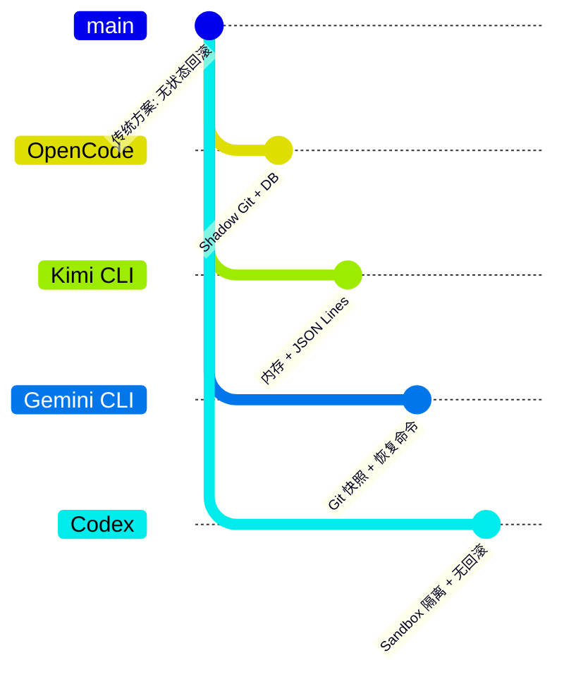

| 项目 | Checkpoint 机制 | 回滚能力 | 适用场景 |
|-----|----------------|---------|---------|
| **OpenCode** | 影子 Git + 数据库存储，Step 级粒度 | 完整文件系统 + 消息历史，支持 revert/unrevert | 企业级安全、审计需求、复杂回滚场景 |
| **Kimi CLI** | 内存状态 + JSON Lines 文件持久化，D-Mail 触发 | Turn 内上下文回滚，不处理文件副作用 | 快速迭代、策略实验、轻量级场景 |
| **Gemini CLI** | Git 快照（checkpointUtils.ts），保存 tool call 数据 | 文件 + 上下文恢复到某次工具调用 | 代码修改安全、可恢复 |
| **Codex** | 无 Checkpoint 机制 | 不支持回滚 | 简单场景、Sandbox 隔离保证安全 |

**关键差异分析**：

1. **OpenCode vs Kimi CLI**：
   - OpenCode 使用影子 Git 实现文件级回滚，Kimi 仅回滚上下文
   - OpenCode 使用数据库存储消息，Kimi 使用 JSON Lines 文件
   - OpenCode 支持 unrevert，Kimi 是单向时间旅行

2. **OpenCode vs Gemini CLI**：
   - 两者都使用 Git，但 OpenCode 使用影子仓库，Gemini 直接使用项目仓库
   - OpenCode 粒度是 Step，Gemini 粒度是 Tool Call
   - OpenCode 支持双向回滚，Gemini 主要是恢复命令

3. **OpenCode vs Codex**：
   - Codex 完全依赖 Sandbox 隔离，不保存中间状态
   - OpenCode 提供显式状态管理和回滚能力

---

## 7. 边界情况与错误处理

### 7.1 终止条件

| 终止原因 | 触发条件 | 代码位置 |
|---------|---------|---------|
| 非 Git 项目 | `Instance.project.vcs !== "git"` | `snapshot/index.ts:27,52` |
| Snapshot 禁用 | `cfg.snapshot === false` | `snapshot/index.ts:29,54` |
| ACP 客户端 | `Flag.OPENCODE_CLIENT === "acp"` | `snapshot/index.ts:27,52` |
| Git 命令失败 | `result.exitCode !== 0` | `snapshot/index.ts:95-97` |
| Session Busy | `SessionPrompt.assertNotBusy()` | `session/revert.ts:25,84` |

### 7.2 超时/资源限制

**周期清理配置**：

```typescript
// opencode/packages/opencode/src/snapshot/index.ts:14-23
const hour = 60 * 60 * 1000
const prune = "7.days"

export function init() {
  Scheduler.register({
    id: "snapshot.cleanup",
    interval: hour,
    run: cleanup,
    scope: "instance",
  })
}
```

**清理逻辑**：

```typescript
// opencode/packages/opencode/src/snapshot/index.ts:26-49
export async function cleanup() {
  if (Instance.project.vcs !== "git" || Flag.OPENCODE_CLIENT === "acp") return
  const cfg = await Config.get()
  if (cfg.snapshot === false) return
  const git = gitdir()
  const exists = await fs.stat(git).then(() => true).catch(() => false)
  if (!exists) return
  const result = await $`git --git-dir ${git} --work-tree ${Instance.worktree} gc --prune=${prune}`
    .quiet()
    .cwd(Instance.directory)
    .nothrow()
  // ... 错误处理
}
```

### 7.3 错误恢复策略

| 错误类型 | 处理策略 | 代码位置 |
|---------|---------|---------|
| Git 命令失败 | 记录日志，返回空结果或跳过 | `snapshot/index.ts:40-46,95-97` |
| checkout 失败 | ls-tree 检查，决定保留或删除 | `snapshot/index.ts:142-156` |
| Session Busy | 抛出错误，拒绝 revert 请求 | `session/revert.ts:25,84` |
| 无效 revert 目标 | 静默返回，不做任何操作 | `session/revert.ts:79` |

---

## 8. 关键代码索引

| 功能 | 文件 | 行号 | 说明 |
|-----|------|------|------|
| Snapshot 命名空间 | `opencode/packages/opencode/src/snapshot/index.ts` | 12-291 | 核心快照管理 |
| Track 实现 | `opencode/packages/opencode/src/snapshot/index.ts` | 51-77 | 创建 tree hash |
| Patch 实现 | `opencode/packages/opencode/src/snapshot/index.ts` | 85-110 | 计算变更文件 |
| Revert 实现 | `opencode/packages/opencode/src/snapshot/index.ts` | 131-161 | 恢复文件 |
| Restore 实现 | `opencode/packages/opencode/src/snapshot/index.ts` | 112-129 | 全量恢复 |
| Cleanup 实现 | `opencode/packages/opencode/src/snapshot/index.ts` | 26-49 | 周期清理 |
| SessionProcessor | `opencode/packages/opencode/src/session/processor.ts` | 19-421 | Agent Loop 集成 |
| Start-step 处理 | `opencode/packages/opencode/src/session/processor.ts` | 233-242 | 创建 step-start part |
| Finish-step 处理 | `opencode/packages/opencode/src/session/processor.ts` | 244-285 | 创建 step-finish + patch |
| SessionRevert | `opencode/packages/opencode/src/session/revert.ts` | 14-138 | 回滚协调器 |
| Revert 方法 | `opencode/packages/opencode/src/session/revert.ts` | 24-80 | 执行回滚 |
| Unrevert 方法 | `opencode/packages/opencode/src/session/revert.ts` | 82-89 | 撤销回滚 |
| Cleanup 方法 | `opencode/packages/opencode/src/session/revert.ts` | 91-137 | 清理消息 |
| MessageV2 Part 类型 | `opencode/packages/opencode/src/session/message-v2.ts` | 82-97, 233-259 | 部件类型定义 |
| Vcs 检测 | `opencode/packages/opencode/src/project/vcs.ts` | 12-76 | Git 状态检测 |
| Snapshot 初始化 | `opencode/packages/opencode/src/project/bootstrap.ts` | 25 | 注册初始化 |

---

## 9. 延伸阅读

- **前置知识**：`docs/opencode/04-opencode-agent-loop.md` - Agent Loop 整体架构
- **相关机制**：`docs/opencode/07-opencode-memory-context.md` - 内存与上下文管理
- **对比分析**：`docs/comm/comm-checkpoint-comparison.md` - 跨项目 Checkpoint 机制对比
- **Kimi CLI Checkpoint**：`docs/kimi-cli/questions/kimi-cli-checkpoint-implementation.md`

---

*✅ Verified: 基于 opencode/packages/opencode/src/snapshot/index.ts:51, opencode/packages/opencode/src/session/processor.ts:233, opencode/packages/opencode/src/session/revert.ts:24 等源码分析*

*基于版本：opencode (baseline 2026-02-08) | 最后更新：2026-02-24*
