# OpenCode 上下文压缩机制

## TL;DR（结论先行）

一句话定义：Context Compaction 是 OpenCode 解决长对话上下文超限问题的双重机制，通过专用 Agent 生成结构化摘要（Compaction）+ Part 级别裁剪（Prune）实现上下文空间回收。

OpenCode 的核心取舍：**专用 Compaction Agent + Part 级 Prune 双重机制**（对比 Kimi CLI 的 Checkpoint 回滚、Codex 的 LLM 摘要 + 截断）

---

## 1. 为什么需要这个机制？（解决什么问题）

### 1.1 问题场景

没有 Compaction：用户与 Agent 进行 50+ 轮对话后，上下文 token 数超过模型限制（如 Claude 的 200K）→ API 报错 → 对话无法继续

有 Compaction：
- Token 接近上限 → 触发 Compaction → 专用 Agent 生成结构化摘要
- 同时 Prune 机制清理旧工具输出 → 释放空间 → 对话继续

### 1.2 核心挑战

| 挑战 | 不解决的后果 |
|-----|-------------|
| Token 上限硬限制 | 长任务无法完成，API 调用失败 |
| 摘要质量不稳定 | 丢失关键上下文，Agent 行为不一致 |
| 工具输出膨胀 | 大量历史输出占用空间，影响有效上下文 |
| 技能输出丢失 | Skill 工具结果被破坏，影响后续推理 |

---

## 2. 整体架构（ASCII 图）

### 2.1 在系统中的位置

```text
┌─────────────────────────────────────────────────────────────┐
│ Session Processor / Agent Loop                               │
│ opencode/packages/opencode/src/session/processor.ts:282     │
└───────────────────────┬─────────────────────────────────────┘
                        │ 检测到 Token 溢出
                        ▼
┌─────────────────────────────────────────────────────────────┐
│ ▓▓▓ Context Compaction ▓▓▓                                  │
│ opencode/packages/opencode/src/session/compaction.ts        │
│ - isOverflow(): Token 溢出检测                              │
│ - process(): Compaction 主流程                              │
│ - prune(): Part 级别裁剪                                    │
└───────────────────────┬─────────────────────────────────────┘
                        │
        ┌───────────────┼───────────────┐
        ▼               ▼               ▼
┌──────────────┐ ┌──────────────┐ ┌──────────────┐
│ Compaction   │ │ Session      │ │ Plugin       │
│ Agent        │ │ Storage      │ │ System       │
│ (专用 Agent) │ │ (SQLite)     │ │ (扩展点)     │
└──────────────┘ └──────────────┘ └──────────────┘
```

### 2.2 核心组件职责

| 组件 | 职责 | 代码位置 |
|-----|------|---------|
| `isOverflow` | 检测 Token 是否超过可用上下文阈值 | `opencode/packages/opencode/src/session/compaction.ts:32` |
| `process` | 执行 Compaction：创建摘要消息、调用专用 Agent | `opencode/packages/opencode/src/session/compaction.ts:101` |
| `prune` | Part 级别裁剪：清理旧工具输出，保护最近 40K | `opencode/packages/opencode/src/session/compaction.ts:58` |
| `CompactionAgent` | 专用 Agent 配置，使用结构化 Prompt | `opencode/packages/opencode/src/agent/agent.ts:157` |
| `SessionProcessor` | 检测溢出并触发 Compaction | `opencode/packages/opencode/src/session/processor.ts:282` |

### 2.3 核心组件交互关系

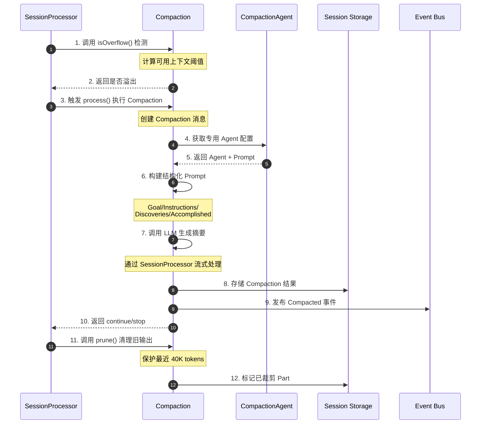

**关键交互说明**：

| 步骤 | 交互内容 | 设计意图 |
|-----|---------|---------|
| 1-2 | 溢出检测 | 在每次 Step 结束时检查，避免调用失败 |
| 3 | 触发 Compaction | 解耦检测与执行，支持手动/自动触发 |
| 4-5 | 专用 Agent | 使用预配置 Agent，确保摘要质量一致 |
| 6-7 | 结构化 Prompt | 强制输出格式，便于下游解析 |
| 8-9 | 持久化 + 事件 | 支持审计和 UI 更新 |
| 11-12 | Prune 清理 | 在 Compaction 后执行，双重保障 |

---

## 3. 核心组件详细分析

### 3.1 Token 溢出检测（isOverflow）

#### 职责定位

检测当前会话的 Token 使用是否超过可用上下文阈值，是触发 Compaction 的前置条件。

#### 算法逻辑

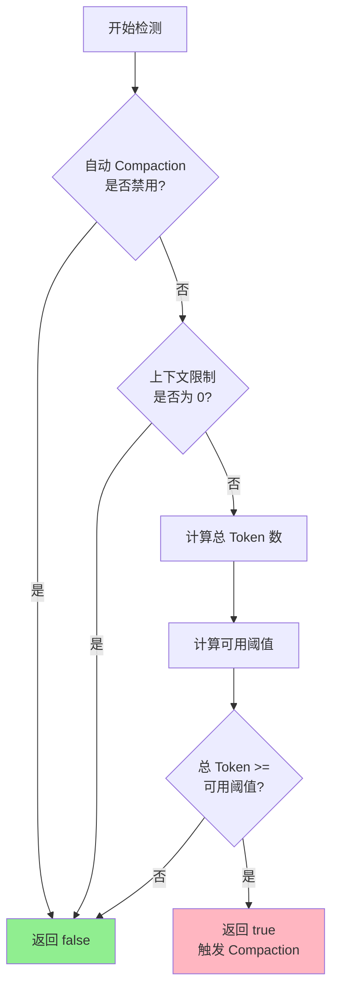

**算法要点**：

1. **可配置开关**：支持通过配置禁用自动 Compaction
2. **保留缓冲区**：默认保留 20K token 缓冲区，避免在 Compaction 过程中溢出
3. **模型感知**：根据模型限制动态计算可用上下文

#### 关键接口

| 接口 | 输入 | 输出 | 说明 | 代码位置 |
|-----|------|------|------|---------|
| `isOverflow` | tokens, model | boolean | 检测是否溢出 | `compaction.ts:32` |

---

### 3.2 Compaction 主流程（process）

#### 职责定位

创建专用 Compaction 消息，调用 LLM 生成结构化摘要，并将摘要存储为新消息。

#### 状态机图

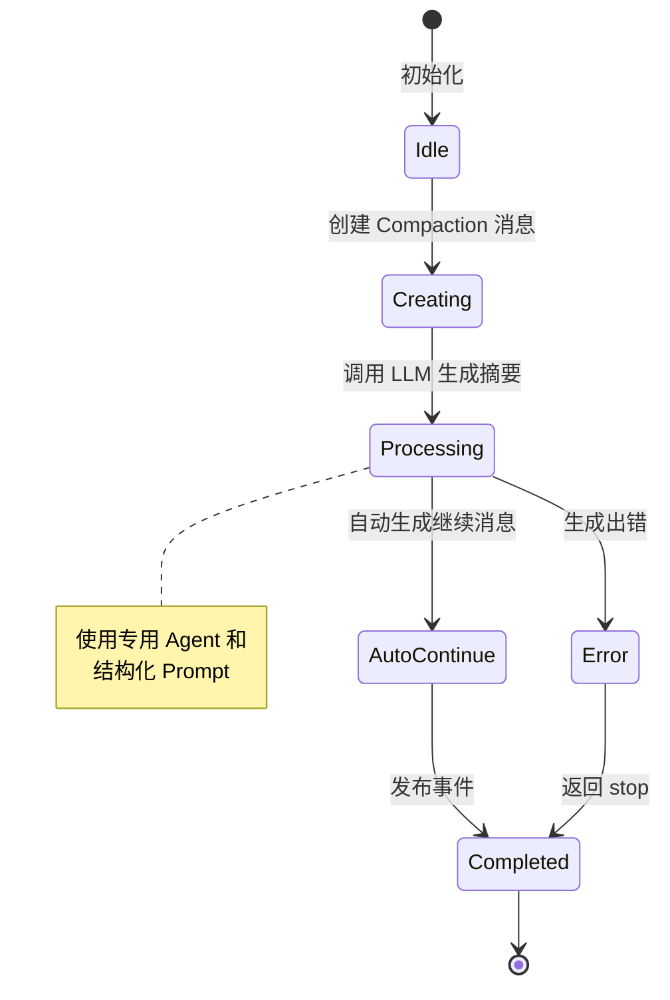

**状态说明**：

| 状态 | 说明 | 进入条件 | 退出条件 |
|-----|------|---------|---------|
| Idle | 等待触发 | 初始化完成 | 收到 process 调用 |
| Creating | 创建消息 | 开始 Compaction | 消息创建完成 |
| Processing | LLM 处理 | 消息创建完成 | 摘要生成完成 |
| AutoContinue | 自动继续 | auto=true 且结果为 continue | 创建继续消息 |
| Error | 处理错误 | LLM 调用失败 | 记录错误 |
| Completed | 完成 | 处理结束 | 返回结果 |

#### 内部数据流

```text
┌─────────────────────────────────────────────────────────────┐
│  输入层                                                      │
│  ├── 会话历史消息 ──► 转换为 Model Messages                   │
│  └── 结构化 Prompt ──► 包含 Goal/Instructions 等模板          │
└──────────────────────────┬──────────────────────────────────┘
                           ▼
┌─────────────────────────────────────────────────────────────┐
│  处理层                                                      │
│  ├── 创建 Compaction 消息（mode=compaction）                 │
│  ├── 调用 SessionProcessor 流式处理                          │
│  │   └── LLM 生成结构化摘要                                  │
│  └── 插件扩展点：experimental.session.compacting             │
│      └── 允许插件注入上下文或替换 Prompt                      │
└──────────────────────────┬──────────────────────────────────┘
                           ▼
┌─────────────────────────────────────────────────────────────┐
│  输出层                                                      │
│  ├── 存储 Assistant 消息（包含摘要）                          │
│  ├── 可选：创建自动继续 User 消息                             │
│  ├── 发布 session.compacted 事件                            │
│  └── 返回 continue/stop 控制流程                             │
└─────────────────────────────────────────────────────────────┘
```

#### 关键算法逻辑

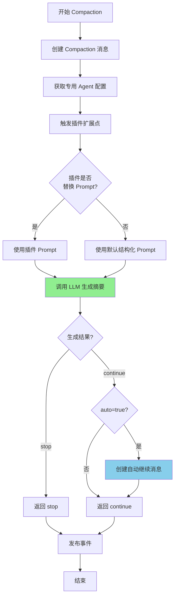

**算法要点**：

1. **插件扩展**：通过 `experimental.session.compacting` 钩子允许插件注入上下文或替换 Prompt
2. **结构化输出**：强制使用模板格式（Goal/Instructions/Discoveries/Accomplished/Relevant files）
3. **自动继续**：当 `auto=true` 时自动生成继续消息，实现无缝对话

---

### 3.3 Prune 裁剪机制

#### 职责定位

在 Part 级别清理旧工具输出，释放 token 空间，同时保护最近交互和关键内容。

#### 关键算法逻辑

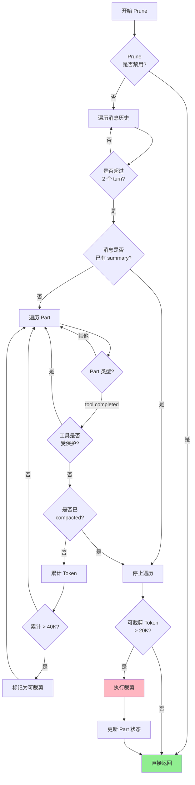

**算法要点**：

1. **Turn 保护**：保留最近 2 个 turn 的所有内容
2. **Summary 边界**：遇到已有 summary 的消息停止遍历，避免重复处理
3. **Skill 保护**：`skill` 工具输出受特殊保护，不被裁剪
4. **渐进裁剪**：只裁剪超过 40K 保护窗口的旧内容
5. **最小阈值**：只有可裁剪 token 超过 20K 才执行，避免频繁小裁剪

#### 保护策略

| 保护对象 | 保护方式 | 代码位置 |
|---------|---------|---------|
| 最近 2 turns | 完全跳过 | `compaction.ts:70` |
| 已 summary 消息 | 停止遍历 | `compaction.ts:72` |
| skill 工具 | 跳过不处理 | `compaction.ts:77` |
| 最近 40K tokens | 不标记裁剪 | `compaction.ts:82` |
| 已 compacted | 停止遍历 | `compaction.ts:79` |

---

### 3.4 组件间协作时序

展示 Compaction 和 Prune 如何协作完成上下文压缩。

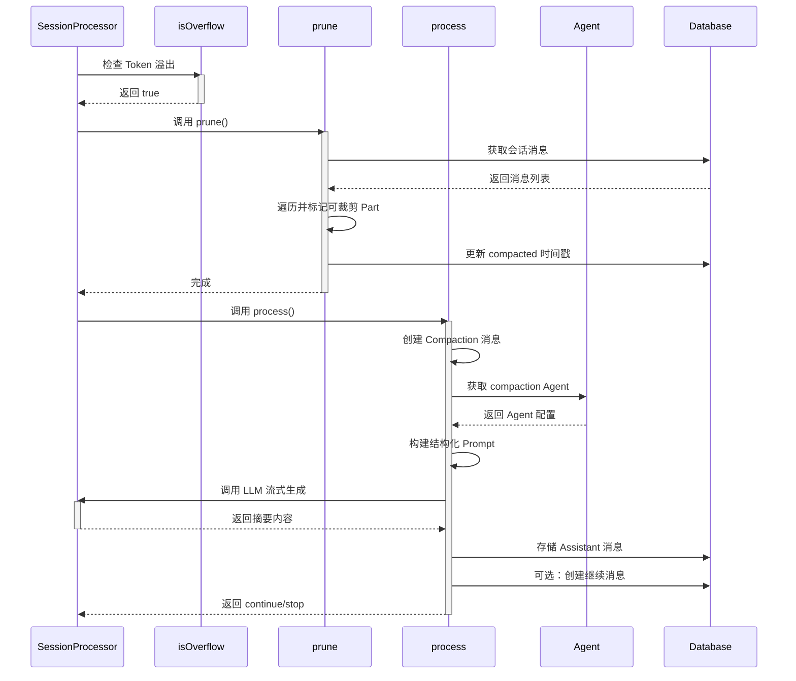

**协作要点**：

1. **先 Prune 后 Compaction**：先清理旧工具输出，再生成摘要，最大化空间回收
2. **Part 级更新**：Prune 只更新时间戳，不删除数据，支持审计和恢复
3. **流式生成**：Compaction 使用 SessionProcessor 的流式处理能力

---

### 3.5 关键数据路径

#### 主路径（正常流程）

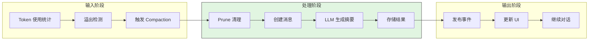

#### 异常路径（错误恢复）

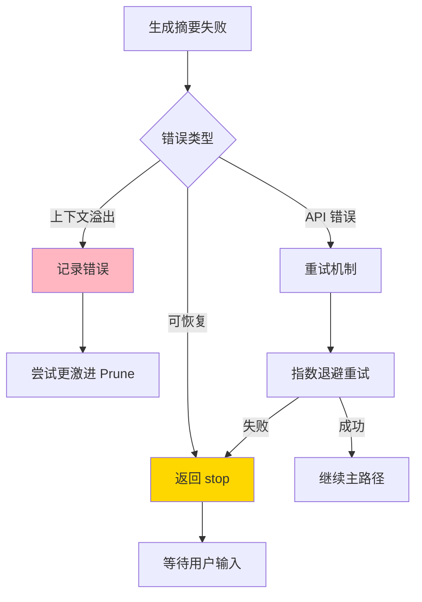

---

## 4. 端到端数据流转

### 4.1 正常流程（详细版）

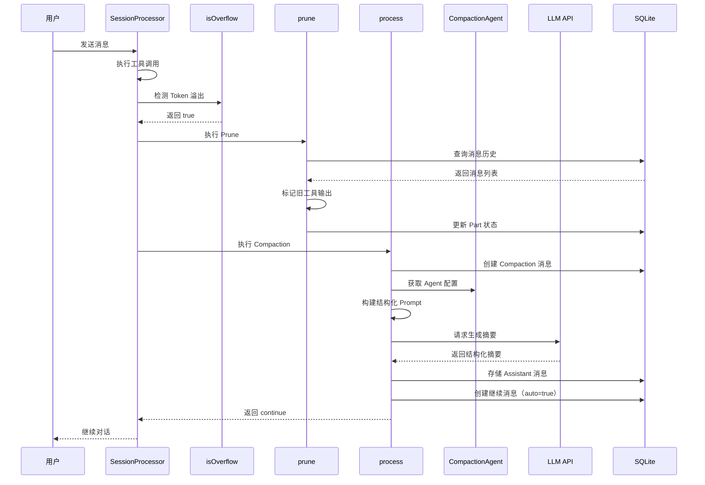

**数据变换详情**：

| 阶段 | 输入 | 处理 | 输出 | 代码位置 |
|-----|------|------|------|---------|
| 检测 | Token 统计 | 计算可用阈值 | 是否溢出 | `compaction.ts:32` |
| Prune | 消息历史 | 遍历标记 | 更新的 Part 状态 | `compaction.ts:58` |
| Compaction | 历史消息 + Prompt | LLM 生成 | 结构化摘要 | `compaction.ts:101` |
| 存储 | 摘要内容 | 序列化 | 数据库记录 | `session/index.ts:670` |

### 4.2 数据流向图

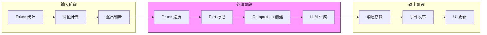

### 4.3 异常/边界流程

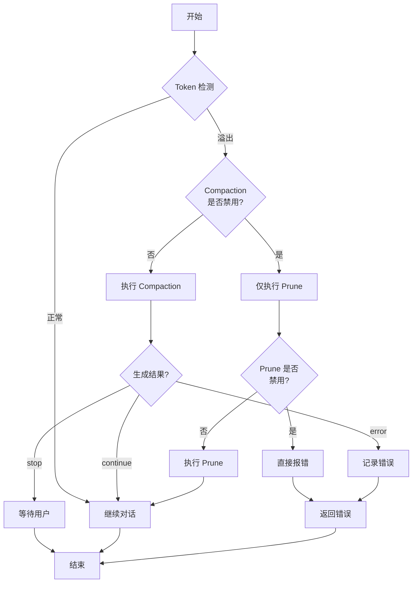

---

## 5. 关键代码实现

### 5.1 核心数据结构

#### CompactionPart 类型定义

```typescript
// opencode/packages/opencode/src/session/message-v2.ts:196
export const CompactionPart = PartBase.extend({
  type: z.literal("compaction"),
  auto: z.boolean(),
})
```

**字段说明**：

| 字段 | 类型 | 用途 |
|-----|------|------|
| `type` | `"compaction"` | 标识 Part 类型为 Compaction |
| `auto` | `boolean` | 标记是否为自动触发的 Compaction |

#### ToolState 时间戳（支持 Prune 标记）

```typescript
// opencode/packages/opencode/src/session/message-v2.ts:288-301
export const ToolStateCompleted = z.object({
  status: z.literal("completed"),
  // ... 其他字段
  time: z.object({
    start: z.number(),
    end: z.number(),
    compacted: z.number().optional(),  // Prune 标记时间戳
  }),
  // ...
})
```

### 5.2 主链路代码

#### Token 溢出检测

```typescript
// opencode/packages/opencode/src/session/compaction.ts:32-48
export async function isOverflow(input: { tokens: MessageV2.Assistant["tokens"]; model: Provider.Model }) {
  const config = await Config.get()
  if (config.compaction?.auto === false) return false
  const context = input.model.limit.context
  if (context === 0) return false

  const count =
    input.tokens.total ||
    input.tokens.input + input.tokens.output + input.tokens.cache.read + input.tokens.cache.write

  const reserved =
    config.compaction?.reserved ?? Math.min(COMPACTION_BUFFER, ProviderTransform.maxOutputTokens(input.model))
  const usable = input.model.limit.input
    ? input.model.limit.input - reserved
    : context - ProviderTransform.maxOutputTokens(input.model)
  return count >= usable
}
```

**代码要点**：

1. **可配置开关**：`config.compaction?.auto` 支持禁用自动 Compaction
2. **保留缓冲区**：`COMPACTION_BUFFER = 20_000` 避免在 Compaction 过程中溢出
3. **模型感知**：根据 `model.limit` 动态计算可用上下文

#### Prune 核心逻辑

```typescript
// opencode/packages/opencode/src/session/compaction.ts:58-99
export async function prune(input: { sessionID: string }) {
  const config = await Config.get()
  if (config.compaction?.prune === false) return
  // ...
  loop: for (let msgIndex = msgs.length - 1; msgIndex >= 0; msgIndex--) {
    const msg = msgs[msgIndex]
    if (msg.info.role === "user") turns++
    if (turns < 2) continue  // 保护最近 2 turns
    if (msg.info.role === "assistant" && msg.info.summary) break loop  // 遇到 summary 停止
    for (let partIndex = msg.parts.length - 1; partIndex >= 0; partIndex--) {
      const part = msg.parts[partIndex]
      if (part.type === "tool")
        if (part.state.status === "completed") {
          if (PRUNE_PROTECTED_TOOLS.includes(part.tool)) continue  // 保护 skill
          if (part.state.time.compacted) break loop  // 已 compacted 停止
          // ... 累计 token 并标记
        }
    }
  }
  // ...
}
```

**代码要点**：

1. **Turn 保护**：`turns < 2` 保留最近 2 个 turn
2. **Skill 保护**：`PRUNE_PROTECTED_TOOLS = ["skill"]`
3. **渐进裁剪**：只处理超过 40K 保护窗口的内容
4. **最小阈值**：`PRUNE_MINIMUM = 20_000` 避免频繁小裁剪

#### Compaction 主流程

```typescript
// opencode/packages/opencode/src/session/compaction.ts:101-145
export async function process(input: {
  parentID: string
  messages: MessageV2.WithParts[]
  sessionID: string
  abort: AbortSignal
  auto: boolean
}) {
  // 创建 Compaction 消息
  const msg = (await Session.updateMessage({
    // ... 消息配置
    mode: "compaction",
    agent: "compaction",
    summary: true,
    // ...
  })) as MessageV2.Assistant

  // 允许插件注入上下文或替换 Prompt
  const compacting = await Plugin.trigger(
    "experimental.session.compacting",
    { sessionID: input.sessionID },
    { context: [], prompt: undefined },
  )

  // 构建 Prompt 并处理
  const promptText = compacting.prompt ?? [defaultPrompt, ...compacting.context].join("\n\n")
  const result = await processor.process({
    // ... 处理参数
    messages: [
      ...MessageV2.toModelMessages(input.messages, model),
      { role: "user", content: [{ type: "text", text: promptText }] },
    ],
  })
  // ...
}
```

**代码要点**：

1. **专用 Agent**：`agent: "compaction"` 使用预配置 Agent
2. **插件扩展**：`experimental.session.compacting` 钩子支持扩展
3. **结构化 Prompt**：强制使用 Goal/Instructions/Discoveries/Accomplished 模板

### 5.3 关键调用链

```text
SessionProcessor.process()     [processor.ts:45]
  -> isOverflow()              [compaction.ts:32]
    - 计算 Token 使用
    - 判断是否超过阈值
  -> prune()                   [compaction.ts:58]
    - 遍历消息历史
    - 标记可裁剪 Part
  -> process()                 [compaction.ts:101]
    - 创建 Compaction 消息
    - 调用 Agent 生成摘要
    - 存储结果
```

---

## 6. 设计意图与 Trade-off

### 6.1 OpenCode 的选择

| 维度 | OpenCode 的选择 | 替代方案 | 取舍分析 |
|-----|----------------|---------|---------|
| 压缩机制 | Compaction + Prune 双重机制 | 仅 Compaction / 仅 Prune | 双重保障更全面，但复杂度更高 |
| Compaction Agent | 专用预配置 Agent | 复用主 Agent | 摘要质量更稳定，但需维护额外配置 |
| 输出格式 | 结构化模板（Goal/Instructions/...） | 自由文本 | 下游解析更可靠，但限制灵活性 |
| Prune 粒度 | Part 级别（工具输出） | Message 级别 | 更细粒度控制，但实现更复杂 |
| 保护策略 | 最近 40K + Skill 工具 | 固定消息数 | 更智能保护，但阈值固定 |
| 触发时机 | Token 阈值检测 | 固定步数 | 按需触发更高效，但需实时计算 |

### 6.2 为什么这样设计？

**核心问题**：如何在保证摘要质量的同时，最大化上下文空间回收？

**OpenCode 的解决方案**：

- **代码依据**：`opencode/packages/opencode/src/session/compaction.ts:58-99`
- **设计意图**：通过 Compaction 生成高质量结构化摘要，通过 Prune 清理低价值工具输出，两者互补
- **带来的好处**：
  - Compaction 保留语义完整性，Prune 快速释放空间
  - 结构化摘要便于下游解析和 UI 展示
  - Part 级裁剪保护关键内容（如 Skill 输出）
- **付出的代价**：
  - 需要维护两种机制，代码复杂度增加
  - 固定阈值（40K/20K）可能不适合所有场景
  - Compaction Agent 调用增加 API 成本

### 6.3 与其他项目的对比

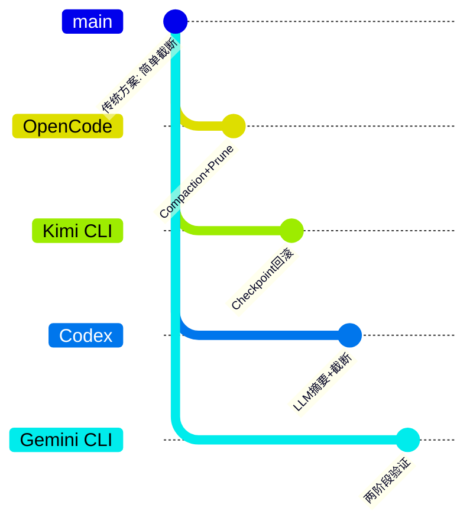

| 项目 | 核心差异 | 适用场景 |
|-----|---------|---------|
| OpenCode | Compaction + Prune 双重机制，专用 Agent，Part 级裁剪 | 频繁使用 Skill 的长任务，需要结构化摘要 |
| Kimi CLI | Checkpoint 回滚机制，支持对话回退 | 需要状态回滚的交互式场景 |
| Codex | LLM 摘要 + Message 级截断 | 简单对话，追求实现简洁 |
| Gemini CLI | 两阶段验证 + 分层内存 | 复杂多轮对话，需要严格验证 |

**关键差异分析**：

1. **vs Kimi CLI**：Kimi 通过 Checkpoint 支持状态回滚，OpenCode 通过 Compaction 生成摘要，两者解决不同问题（回滚 vs 压缩）
2. **vs Codex**：Codex 使用 LLM 生成自由文本摘要后截断，OpenCode 使用结构化模板，更便于下游处理
3. **vs Gemini CLI**：Gemini 采用两阶段验证确保摘要质量，OpenCode 依赖专用 Agent 和结构化 Prompt

---

## 7. 边界情况与错误处理

### 7.1 终止条件

| 终止原因 | 触发条件 | 代码位置 |
|---------|---------|---------|
| Compaction 完成 | LLM 成功生成摘要并存储 | `compaction.ts:227` |
| 生成失败 | LLM 调用出错 | `processor.ts:356` |
| 用户中断 | AbortSignal 触发 | `processor.ts:56` |
| 上下文溢出 | Token 超过硬限制 | `processor.ts:356` |

### 7.2 配置选项

```typescript
// opencode/packages/opencode/src/config/config.ts:1173-1182
compaction: z
  .object({
    auto: z.boolean().optional().describe("Enable automatic compaction when context is full (default: true)"),
    prune: z.boolean().optional().describe("Enable pruning of old tool outputs (default: true)"),
    reserved: z
      .number()
      .int()
      .min(0)
      .optional()
      .describe("Token buffer for compaction. Leaves enough window to avoid overflow during compaction."),
  })
  .optional()
```

### 7.3 错误恢复策略

| 错误类型 | 处理策略 | 代码位置 |
|---------|---------|---------|
| API 错误 | 重试机制（指数退避） | `session/retry.ts` |
| 上下文溢出 | 标记错误，等待处理 | `processor.ts:356` |
| 权限拒绝 | 返回 stop，等待用户 | `processor.ts:413` |
| 工具执行中断 | 标记 Part 为 error 状态 | `processor.ts:396` |

---

## 8. 关键代码索引

| 功能 | 文件 | 行号 | 说明 |
|-----|------|------|------|
| Token 溢出检测 | `opencode/packages/opencode/src/session/compaction.ts` | 32-48 | 判断是否触发 Compaction |
| Prune 裁剪 | `opencode/packages/opencode/src/session/compaction.ts` | 58-99 | Part 级别清理旧工具输出 |
| Compaction 主流程 | `opencode/packages/opencode/src/session/compaction.ts` | 101-229 | 创建消息、生成摘要、存储结果 |
| 触发检测 | `opencode/packages/opencode/src/session/processor.ts` | 282-284 | Step 结束时检查溢出 |
| Compaction Agent 配置 | `opencode/packages/opencode/src/agent/agent.ts` | 157-171 | 专用 Agent 定义 |
| Compaction Prompt | `opencode/packages/opencode/src/agent/prompt/compaction.txt` | 1-15 | 结构化摘要模板 |
| Part 类型定义 | `opencode/packages/opencode/src/session/message-v2.ts` | 196-202 | CompactionPart 结构 |
| ToolState 时间戳 | `opencode/packages/opencode/src/session/message-v2.ts` | 298 | compacted 标记字段 |
| 配置选项 | `opencode/packages/opencode/src/config/config.ts` | 1173-1182 | compaction 配置 Schema |
| Token 估算 | `opencode/packages/opencode/src/util/token.ts` | 1-7 | 字符数转 Token 数 |

---

## 9. 延伸阅读

- 前置知识：`docs/opencode/04-opencode-agent-loop.md`
- 相关机制：`docs/opencode/07-opencode-memory-context.md`
- 深度分析：`docs/comm/comm-context-compaction.md`
- 对比项目：
  - `docs/kimi-cli/questions/kimi-cli-checkpoint-implementation.md`
  - `docs/codex/07-codex-memory-context.md`

---

*✅ Verified: 基于 opencode/packages/opencode/src/session/compaction.ts:32 等源码分析*
*基于版本：2026-02-08 | 最后更新：2026-02-24*
