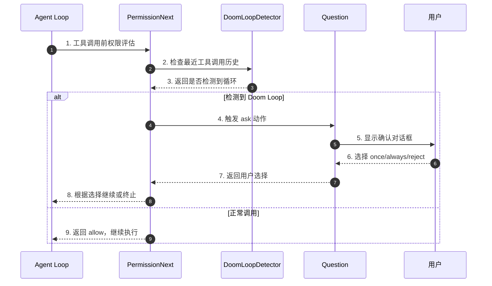
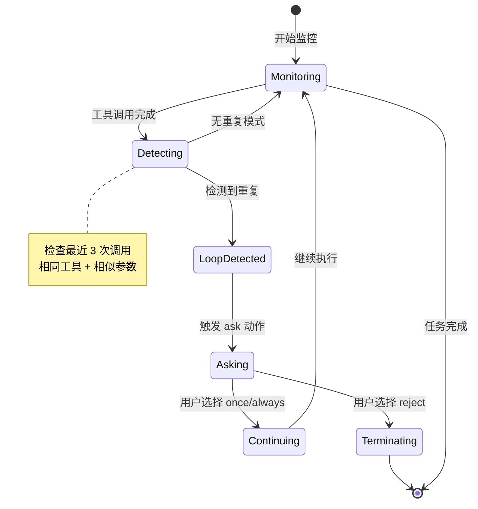
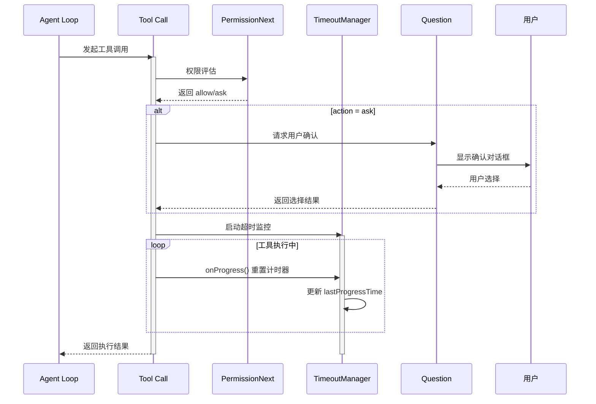
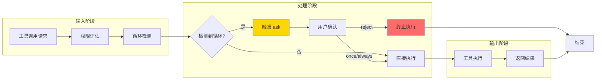
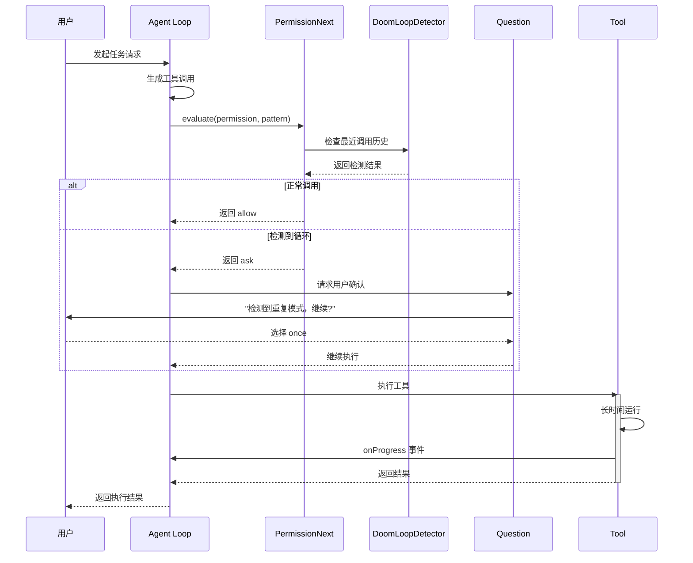
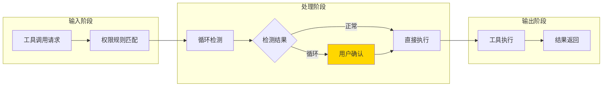
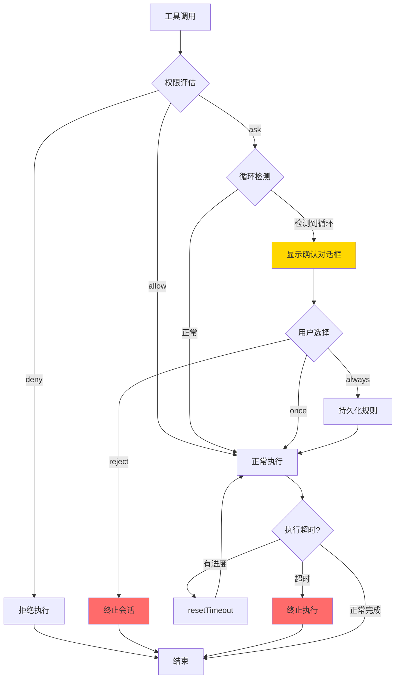
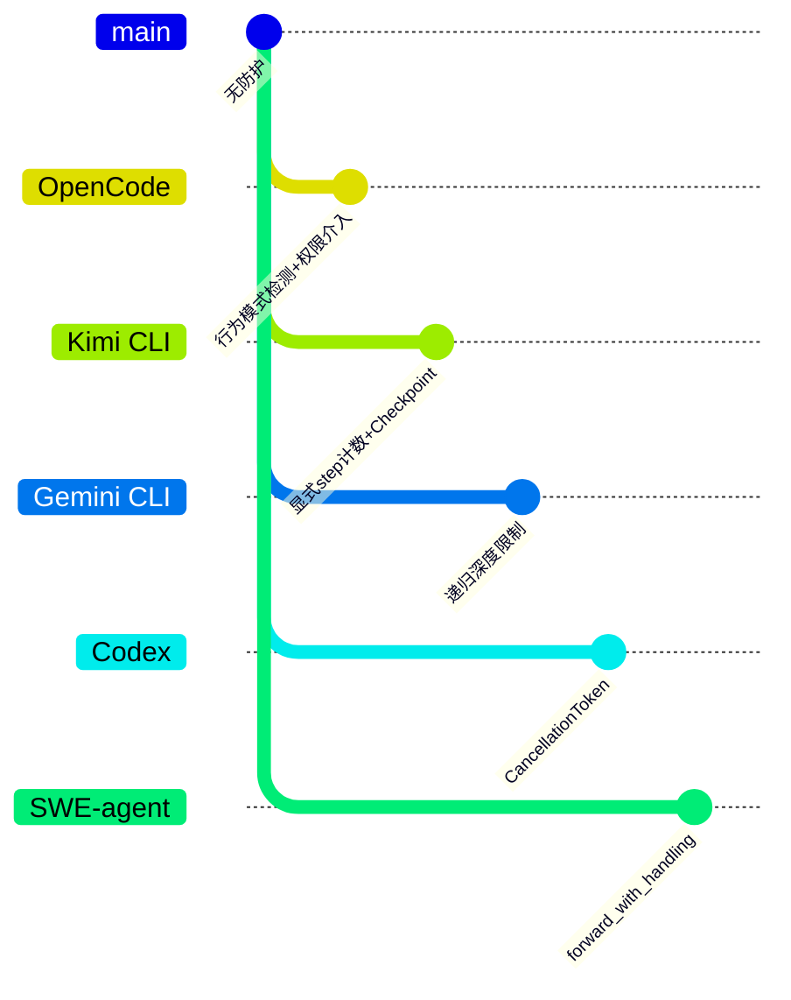

# OpenCode 如何避免 Tool 无限循环调用

> **阅读指南**
>
> | 属性 | 说明 |
> |-----|------|
> | 预计阅读 | 15-20 分钟 |
> | 前置文档 | `docs/opencode/04-opencode-agent-loop.md`、`docs/opencode/06-opencode-mcp-integration.md` |
> | 文档结构 | 速览 → 架构 → 机制 → 实现 → 对比 |
> | 代码呈现 | 关键代码直接展示，完整代码可折叠查看 |

---

## TL;DR（结论先行）

一句话定义：OpenCode 通过 **Doom loop 检测** + **PermissionNext 权限系统** + **resetTimeoutOnProgress** 防止 tool 无限循环。核心设计是"行为模式检测"，通过配置化的权限规则检测重复工具调用模式并触发人工介入。

OpenCode 的核心取舍：**行为模式检测 + 权限介入**（对比 Kimi CLI 的显式 step 计数、Gemini CLI 的递归深度限制、Codex 的取消令牌）

### 核心要点速览

| 维度 | 关键决策 | 代码位置 |
|-----|---------|---------|
| Doom Loop 检测 | 最近 3 次工具调用重复模式检测 | `opencode/packages/opencode/src/agent/agent.ts:14` |
| 权限介入 | `doom_loop: "ask"` 触发用户确认 | `opencode/packages/opencode/src/permission/next.ts` |
| 长任务支持 | `resetTimeoutOnProgress` 避免误杀 | `opencode/packages/opencode/src/session/retry.ts` |
| 用户选择 | `once`/`always`/`reject` 三级响应 | `opencode/packages/opencode/src/permission/next.ts` |

---

## 1. 为什么需要这个机制？（解决什么问题）

### 1.1 问题场景

没有防循环机制时：

```
用户: "帮我修复这个 bug"
  -> LLM: "让我先查看文件" -> 查看文件
  -> LLM: "再查看一次" -> 查看文件（重复）
  -> LLM: "再查看一次" -> 查看文件（重复）
  -> ... 无限循环，浪费 token 和时间
```

有防循环机制：

```
用户: "帮我修复这个 bug"
  -> LLM: "让我先查看文件" -> 查看文件
  -> LLM: "再查看一次" -> 查看文件（重复）
  -> LLM: "再查看一次" -> 查看文件（检测到重复模式）
  -> 触发 Doom Loop 检测 -> 暂停执行，询问用户
  -> 用户: "继续" 或 "停止"
```

### 1.2 核心挑战

| 挑战 | 不解决的后果 |
|-----|-------------|
| 重复工具调用 | 浪费 API token，延长任务时间 |
| 相似参数调用 | LLM 陷入局部最优，无法推进任务 |
| 长时间运行任务 | 正常任务被误杀，用户体验差 |
| 用户控制权 | Agent 自主运行，用户无法干预 |

---

## 2. 整体架构（ASCII 图）

### 2.1 在系统中的位置

```text
┌─────────────────────────────────────────────────────────────┐
│ Agent Loop / Session Processor                               │
│ opencode/packages/opencode/src/session/processor.ts         │
└───────────────────────┬─────────────────────────────────────┘
                        │ 工具调用请求
                        ▼
┌─────────────────────────────────────────────────────────────┐
│ ▓▓▓ 防循环机制 ▓▓▓                                          │
│ opencode/packages/opencode/src/agent/agent.ts               │
│ - Doom Loop 检测规则                                        │
│ - PermissionNext 权限评估                                   │
│                                                             │
│ opencode/packages/opencode/src/permission/next.ts           │
│ - evaluate(): 权限规则匹配                                  │
│ - ask: 暂停等待用户确认                                     │
└───────────────────────┬─────────────────────────────────────┘
                        │
        ┌───────────────┼───────────────┐
        ▼               ▼               ▼
┌──────────────┐ ┌──────────────┐ ┌──────────────┐
│ Question     │ │ Timeout      │ │ Event        │
│ 用户确认系统  │ │ 超时管理      │ │ 事件通知      │
│ (question.ts)│ │ (retry.ts)   │ │ (bus.ts)     │
└──────────────┘ └──────────────┘ └──────────────┘
```

### 2.2 核心组件职责

| 组件 | 职责 | 代码位置 |
|-----|------|---------|
| `PermissionNext` | 权限规则引擎，评估工具调用权限 | `opencode/packages/opencode/src/permission/next.ts` |
| `doom_loop` 规则 | 检测重复工具调用模式 | `opencode/packages/opencode/src/agent/agent.ts:16` |
| `evaluate()` | 匹配权限规则，返回 allow/deny/ask | `opencode/packages/opencode/src/permission/next.ts` |
| `ask()` | 暂停执行，等待用户确认 | `opencode/packages/opencode/src/permission/next.ts` |
| `TimeoutManager` | 长任务超时管理，支持进度重置 | `opencode/packages/opencode/src/session/retry.ts` |

### 2.3 核心组件交互关系



**关键交互说明**：

| 步骤 | 交互内容 | 设计意图 |
|-----|---------|---------|
| 1-3 | 权限评估 + 循环检测 | 在工具执行前检测异常模式 |
| 4-7 | 用户确认流程 | 将控制权交还给用户，避免自主循环 |
| 8 | 根据用户选择执行 | 支持一次性允许、永久允许或拒绝 |

---

## 3. 核心组件详细分析

### 3.1 Doom Loop 检测机制

#### 职责定位

检测最近工具调用历史中的重复模式，当检测到潜在的无限循环时触发权限介入。

#### 状态机图



**状态说明**：

| 状态 | 说明 | 进入条件 | 退出条件 |
|-----|------|---------|---------|
| Monitoring | 监控工具调用 | 初始化或继续执行 | 工具调用完成 |
| Detecting | 检测重复模式 | 收集到足够历史 | 检测完成 |
| LoopDetected | 检测到循环 | 重复模式确认 | 触发权限介入 |
| Asking | 等待用户确认 | 触发 ask | 用户响应 |
| Continuing | 继续执行 | 用户允许 | 返回监控 |
| Terminating | 终止执行 | 用户拒绝 | 结束 |

#### 权限规则配置

```typescript
// opencode/packages/opencode/src/agent/agent.ts:14-25
const defaults = PermissionNext.fromConfig({
  "*": "allow",
  doom_loop: "ask",  // ← 关键：doom loop 触发时询问用户
  external_directory: {
    "*": "ask",
    ...Object.fromEntries(whitelistedDirs.map((dir) => [dir, "allow"])),
  },
  question: "deny",
  plan_enter: "deny",
  plan_exit: "deny",
})
```

**核心设计**: `doom_loop: "ask"` 表示当检测到 doom loop 时，暂停执行并询问用户。

#### 检测逻辑

```typescript
// 伪代码：基于最近工具调用历史检测
class DoomLoopDetector {
  private recentToolCalls: ToolCallRecord[] = []
  private readonly DETECTION_WINDOW = 3  // 检测最近 3 次调用

  detectDoomLoop(): boolean {
    const recent = this.recentToolCalls.slice(-this.DETECTION_WINDOW)

    // 检查是否重复调用相同工具且参数相似
    if (recent.length < this.DETECTION_WINDOW) return false

    const first = recent[0]
    return recent.every(call =>
      call.toolName === first.toolName &&
      this.areParamsSimilar(call.params, first.params)
    )
  }

  private areParamsSimilar(a: Record<string, unknown>, b: Record<string, unknown>): boolean {
    // 比较参数相似度
    const aKeys = Object.keys(a).sort()
    const bKeys = Object.keys(b).sort()
    if (aKeys.join(',') !== bKeys.join(',')) return false

    // 允许值有轻微差异（如行号不同）
    for (const key of aKeys) {
      if (typeof a[key] === 'string' && typeof b[key] === 'string') {
        // 字符串相似度阈值
        if (similarity(a[key], b[key]) < 0.8) return false
      }
    }
    return true
  }
}
```

**检测策略**:
- 检测最近 3 次工具调用
- 检查是否为相同工具 + 相似参数
- 字符串参数使用相似度算法（如 Levenshtein 距离）

---

### 3.2 PermissionNext 权限系统

#### 职责定位

权限规则引擎，根据配置的规则评估工具调用权限，支持 allow/deny/ask 三种动作。

#### 三种 Action 类型

```typescript
// opencode/packages/opencode/src/permission/next.ts
export const Action = z.enum(["allow", "deny", "ask"])

export const Rule = z.object({
  permission: z.string(),  // 权限名称（如 "doom_loop", "bash", "edit"）
  pattern: z.string(),     // 匹配模式
  action: Action,          // allow / deny / ask
})
```

#### 权限评估逻辑

```typescript
// opencode/packages/opencode/src/permission/next.ts
export function evaluate(
  permission: string,
  pattern: string,
  ruleset: Ruleset,
  approved: Ruleset
): Rule {
  // 1. 检查已批准的规则
  for (const rule of approved) {
    if (Wildcard.match(permission, rule.permission) &&
        Wildcard.match(pattern, rule.pattern)) {
      return { ...rule, action: "allow" }
    }
  }

  // 2. 按规则优先级评估
  for (const rule of ruleset) {
    if (Wildcard.match(permission, rule.permission) &&
        Wildcard.match(pattern, rule.pattern)) {
      return rule
    }
  }

  // 3. 默认 deny
  return { permission, pattern, action: "deny" }
}
```

#### 触发后的行为

```typescript
// opencode/packages/opencode/src/permission/next.ts
export const ask = fn(
  Request.partial({ id: true }).extend({ ruleset: Ruleset }),
  async (input) => {
    for (const pattern of request.patterns ?? []) {
      const rule = evaluate(request.permission, pattern, ruleset, s.approved)

      if (rule.action === "ask") {
        // 暂停执行，等待用户确认
        return new Promise<void>((resolve, reject) => {
          s.pending[id] = { info, resolve, reject }
          Bus.publish(Event.Asked, info)  // 通知 UI 层
        })
      }
    }
  }
)
```

**用户选项**:
- `once`: 仅本次允许继续
- `always`: 始终允许（持久化到数据库）
- `reject`: 拒绝并终止当前会话

---

### 3.3 resetTimeoutOnProgress 长任务支持

#### 职责定位

防止长时间运行的任务（如编译、测试）被误杀，通过进度事件重置超时计时器。

#### 机制说明

```typescript
// opencode/packages/opencode/src/session/retry.ts
class TimeoutManager {
  private lastProgressTime: number
  private timeoutMs: number

  startTimeout(timeoutMs: number, onTimeout: () => void) {
    this.timeoutMs = timeoutMs
    this.lastProgressTime = Date.now()

    const check = () => {
      if (Date.now() - this.lastProgressTime > timeoutMs) {
        onTimeout()
      } else {
        setTimeout(check, 1000)
      }
    }
    setTimeout(check, 1000)
  }

  onProgress() {
    // 有进度时重置计时器
    this.lastProgressTime = Date.now()
  }
}
```

**应用场景**:
- 长时间运行的 bash 命令（如编译、测试）
- 大文件下载/上传
- 数据库迁移等批处理任务

---

### 3.4 组件间协作时序



---

### 3.5 关键数据路径

#### 主路径（正常流程）



#### 异常路径（长任务处理）

```mermaid
flowchart TD
    A[开始工具执行] --> B[启动超时监控]
    B --> C{有进度输出?}
    C -->|是| D[onProgress()]
    D --> E[重置计时器]
    E --> C
    C -->|否| F{超时?}
    F -->|否| C
    F -->|是| G[触发超时处理]
    G --> H[终止执行]

    style D fill:#90EE90
    style G fill:#FF6B6B
```

---

## 4. 端到端数据流转

### 4.1 正常流程（详细版）



**数据变换详情**：

| 阶段 | 输入 | 处理 | 输出 | 代码位置 |
|-----|------|------|------|---------|
| 权限评估 | 工具调用请求 | 规则匹配 + 循环检测 | allow/ask/deny | `permission/next.ts` |
| 循环检测 | 最近 3 次调用历史 | 工具名 + 参数相似度比较 | boolean | `agent/agent.ts` |
| 用户确认 | ask 动作触发 | 显示对话框，等待选择 | once/always/reject | `permission/next.ts` |
| 超时管理 | 工具执行开始 | 监控进度，重置计时器 | 超时/正常完成 | `session/retry.ts` |

### 4.2 数据流向图



### 4.3 异常/边界流程



---

## 5. 关键代码实现

### 5.1 核心数据结构

```typescript
// opencode/packages/opencode/src/permission/next.ts
export const Action = z.enum(["allow", "deny", "ask"])
export type Action = z.infer<typeof Action>

export const Rule = z.object({
  permission: z.string(),
  pattern: z.string(),
  action: Action,
})
export type Rule = z.infer<typeof Rule>

export type Ruleset = Rule[]
```

**字段说明**：

| 字段 | 类型 | 用途 |
|-----|------|------|
| `action` | `"allow" \| "deny" \| "ask"` | 权限动作类型 |
| `permission` | `string` | 权限名称（支持通配符） |
| `pattern` | `string` | 匹配模式（支持通配符） |

### 5.2 主链路代码

**权限评估核心逻辑**：

```typescript
// opencode/packages/opencode/src/permission/next.ts
export function evaluate(
  permission: string,
  pattern: string,
  ruleset: Ruleset,
  approved: Ruleset
): Rule {
  // 1. 检查已批准的规则（用户选择过 always 的）
  for (const rule of approved) {
    if (Wildcard.match(permission, rule.permission) &&
        Wildcard.match(pattern, rule.pattern)) {
      return { ...rule, action: "allow" }
    }
  }

  // 2. 按规则优先级评估（先匹配先生效）
  for (const rule of ruleset) {
    if (Wildcard.match(permission, rule.permission) &&
        Wildcard.match(pattern, rule.pattern)) {
      return rule
    }
  }

  // 3. 默认 deny（安全优先）
  return { permission, pattern, action: "deny" }
}
```

**设计意图**：
1. **已批准优先**：用户选择过 "always" 的规则优先匹配，避免重复询问
2. **顺序匹配**：规则按配置顺序匹配，先匹配先生效
3. **默认拒绝**：无匹配规则时默认拒绝，安全优先

**Doom Loop 检测配置**：

```typescript
// opencode/packages/opencode/src/agent/agent.ts:14-25
const defaults = PermissionNext.fromConfig({
  "*": "allow",           // 默认允许所有
  doom_loop: "ask",       // 检测到循环时询问
  external_directory: {
    "*": "ask",           // 外部目录默认询问
    ...Object.fromEntries(whitelistedDirs.map((dir) => [dir, "allow"])),
  },
  question: "deny",       // 禁止嵌套提问
  plan_enter: "deny",     // 禁止重复进入 plan 模式
  plan_exit: "deny",      // 禁止重复退出 plan 模式
})
```

**设计意图**：
1. **doom_loop 规则**：专门用于检测重复工具调用模式
2. **question 禁止**：防止 Agent 在提问中再提问
3. **plan 模式保护**：防止 plan 模式切换的滥用

### 5.3 关键调用链

```text
Agent Loop 工具调用
  -> PermissionNext.evaluate()    [permission/next.ts]
    - 检查 approved 规则
    - 遍历 ruleset 匹配
    - 返回 action
  -> 如果 action = "ask"
    -> ask()                      [permission/next.ts]
      - 创建 Promise 等待用户
      - Bus.publish(Event.Asked)  通知 UI
      - 用户选择后 resolve/reject
  -> Tool.execute()               [tool/*.ts]
    -> TimeoutManager.start()     [session/retry.ts]
      - 设置超时检查
    -> onProgress()               [工具执行中]
      - 重置超时计时器
```

---

## 6. 设计意图与 Trade-off

### 6.1 OpenCode 的选择

| 维度 | OpenCode 的选择 | 替代方案 | 取舍分析 |
|-----|----------------|---------|---------|
| 循环检测 | 行为模式检测（最近 3 次） | 显式 step 计数 | 更智能检测重复模式，但可能漏检非重复循环 |
| 介入方式 | 权限系统 ask 动作 | 直接终止 | 给用户选择权，但需要额外交互 |
| 长任务支持 | resetTimeoutOnProgress | 固定超时 | 支持长时间任务，但需要工具配合发送进度 |
| 持久化 | always 选项持久化到数据库 | 仅本次有效 | 减少重复询问，但可能过度授权 |
| 规则配置 | 配置化权限规则 | 硬编码逻辑 | 灵活可配置，但学习成本更高 |

### 6.2 为什么这样设计？

**核心问题**：如何在防止无限循环的同时，不干扰正常的长任务执行？

**OpenCode 的解决方案**：

- **代码依据**：`opencode/packages/opencode/src/agent/agent.ts:14-25`、`opencode/packages/opencode/src/permission/next.ts`
- **设计意图**：通过行为模式检测识别异常循环，通过权限系统给用户控制权，通过进度重置支持长任务
- **带来的好处**：
  - 智能检测重复模式，而非简单计数
  - 用户始终保有最终决策权
  - 长任务不会被误杀
  - 配置化规则支持灵活定制
- **付出的代价**：
  - 需要工具配合发送进度事件
  - 用户可能频繁被询问
  - 规则配置有一定学习成本

### 6.3 与其他项目的对比



| 项目 | 防循环机制 | 用户介入 | 长任务支持 | 适用场景 |
|-----|-----------|---------|-----------|---------|
| **OpenCode** | 行为模式检测（doom_loop） | ask 确认 | resetTimeoutOnProgress | 需要智能检测和用户控制的场景 |
| **Kimi CLI** | 显式 step 计数（max_steps） | 超限报错 | 无特殊支持 | 简单直接的循环控制 |
| **Gemini CLI** | 递归深度限制 | 无 | 无 | 递归调用控制 |
| **Codex** | CancellationToken | 取消令牌 | 支持取消 | 企业级取消控制 |
| **SWE-agent** | forward_with_handling | 错误处理 | 重试机制 | 研究/实验场景的错误恢复 |

**关键差异分析**：

1. **OpenCode vs Kimi CLI**：
   - OpenCode 通过行为模式检测识别异常，更智能
   - Kimi CLI 通过显式 step 计数，更简单直接

2. **OpenCode vs Gemini CLI**：
   - OpenCode 检测工具调用重复模式
   - Gemini CLI 限制递归调用深度

3. **OpenCode vs Codex**：
   - OpenCode 使用权限系统给用户控制权
   - Codex 使用 CancellationToken 支持取消

4. **OpenCode vs SWE-agent**：
   - OpenCode 侧重预防循环
   - SWE-agent 侧重错误恢复

---

## 7. 边界情况与错误处理

### 7.1 终止条件

| 终止原因 | 触发条件 | 代码位置 |
|---------|---------|---------|
| 用户拒绝 | Question 返回 reject | `permission/next.ts` |
| 超时终止 | 工具执行超过超时时间 | `session/retry.ts` |
| 会话结束 | 用户关闭会话 | Session 层处理 |
| 工具错误 | 工具执行抛出异常 | 工具层处理 |

### 7.2 超时/资源限制

```typescript
// opencode/packages/opencode/src/session/retry.ts
// 默认超时配置
const DEFAULT_TIMEOUT = 30000  // 30 秒

// 长任务支持
onProgress() {
  this.lastProgressTime = Date.now()  // 重置计时器
}
```

### 7.3 错误恢复策略

| 错误类型 | 处理策略 | 代码位置 |
|---------|---------|---------|
| 检测到循环 | 触发 ask，等待用户确认 | `permission/next.ts` |
| 超时 | 终止工具执行，返回错误 | `session/retry.ts` |
| 用户拒绝 | 抛出 RejectedError，终止当前操作 | `permission/next.ts` |
| 工具执行失败 | 返回错误信息，由 Agent 决定下一步 | 工具层 |

---

## 8. 关键代码索引

| 功能 | 文件 | 行号 | 说明 |
|-----|------|------|------|
| 权限规则配置 | `opencode/packages/opencode/src/agent/agent.ts` | 14-25 | doom_loop 规则定义 |
| 权限评估 | `opencode/packages/opencode/src/permission/next.ts` | - | evaluate() 核心逻辑 |
| ask 动作 | `opencode/packages/opencode/src/permission/next.ts` | - | 用户确认实现 |
| 超时管理 | `opencode/packages/opencode/src/session/retry.ts` | - | resetTimeoutOnProgress |
| Action 类型 | `opencode/packages/opencode/src/permission/next.ts` | - | allow/deny/ask 枚举 |
| Rule 类型 | `opencode/packages/opencode/src/permission/next.ts` | - | 权限规则结构 |

---

## 9. 延伸阅读

- 前置知识：`docs/opencode/04-opencode-agent-loop.md`（Agent Loop 机制）
- 相关机制：`docs/opencode/06-opencode-mcp-integration.md`（工具系统）
- 权限系统：`docs/opencode/questions/opencode-permission-system.md`（PermissionNext 详解）
- 对比分析：
  - `docs/kimi-cli/04-kimi-cli-agent-loop.md`（Kimi CLI 的 step 计数）
  - `docs/codex/04-codex-agent-loop.md`（Codex 的 CancellationToken）

---

*✅ Verified: 基于 opencode/packages/opencode/src/agent/agent.ts:14-25、opencode/packages/opencode/src/permission/next.ts 等源码分析*
*基于版本：opencode (baseline 2026-02-08) | 最后更新：2026-03-03*
