# OpenCode Plan and Execute 模式

## TL;DR（结论先行）

一句话定义：Plan and Execute 是一种**双 Agent 架构模式**，通过权限隔离将"规划阶段"与"执行阶段"分离，确保在充分理解需求并制定详细计划后再进行修改。

OpenCode 的核心取舍：**显式模式切换 + 权限强制隔离**（对比其他项目的隐式规划或单 Agent 模式）

---

## 1. 为什么需要这个机制？（解决什么问题）

### 1.1 问题场景

没有 Plan and Execute 模式时：

```
用户: "帮我重构这个模块"
  -> LLM 直接开始修改文件
  -> 改到一半发现理解有误
  -> 需要回滚，造成代码损坏
  -> 用户不满意，需要重新开始
```

有 Plan and Execute 模式：

```
用户: "帮我重构这个模块"
  -> Plan Agent: "先让我理解需求，制定计划"
  -> Phase 1: 探索代码（并行 3 个 agents）
  -> Phase 2: 设计方案
  -> Phase 3: 审查计划
  -> Phase 4: 写入计划文件
  -> 用户确认计划
  -> Build Agent: 按计划执行
  -> 成功完成重构
```

### 1.2 核心挑战

| 挑战 | 不解决的后果 |
|-----|-------------|
| 需求理解不充分 | 实现与用户预期不符，返工成本高 |
| 过早修改代码 | 发现设计问题时已造成不可逆修改 |
| 缺乏结构化规划 | 大型任务容易遗漏关键步骤 |
| 用户参与度低 | 最终交付不符合用户期望 |

---

## 2. 整体架构（ASCII 图）

### 2.1 在系统中的位置

```text
┌─────────────────────────────────────────────────────────────┐
│ CLI 入口 / Session Runtime                                   │
│ opencode/packages/opencode/src/session/prompt.ts            │
└───────────────────────┬─────────────────────────────────────┘
                        │ 用户输入 / 工具调用
                        ▼
┌─────────────────────────────────────────────────────────────┐
│ ▓▓▓ Plan and Execute 核心 ▓▓▓                               │
│ opencode/packages/opencode/src/agent/agent.ts               │
│ - build Agent: 执行模式（完整权限）                          │
│ - plan Agent: 只读模式（仅可编辑计划文件）                    │
│                                                             │
│ opencode/packages/opencode/src/tool/plan.ts                 │
│ - PlanEnterTool: 进入 plan 模式                             │
│ - PlanExitTool: 退出 plan 模式                              │
└───────────────────────┬─────────────────────────────────────┘
                        │
        ┌───────────────┼───────────────┐
        ▼               ▼               ▼
┌──────────────┐ ┌──────────────┐ ┌──────────────┐
│ Permission   │ │ Plan File    │ │ Subagents    │
│ 权限系统      │ │ 计划文件存储  │ │ 子代理系统    │
│ (next.ts)    │ │ (plans/*.md) │ │ (explore/   │
│              │ │              │ │  general)    │
└──────────────┘ └──────────────┘ └──────────────┘
```

### 2.2 核心组件职责

| 组件 | 职责 | 代码位置 |
|-----|------|---------|
| `build Agent` | 执行模式 Agent，拥有完整工具访问权限 | `opencode/packages/opencode/src/agent/agent.ts:77-91` |
| `plan Agent` | 计划模式 Agent，只读（除计划文件外） | `opencode/packages/opencode/src/agent/agent.ts:92-114` |
| `PlanEnterTool` | 触发模式切换到 plan，请求用户确认 | `opencode/packages/opencode/src/tool/plan.ts:75-130` |
| `PlanExitTool` | 触发模式切换到 build，请求用户确认 | `opencode/packages/opencode/src/tool/plan.ts:20-73` |
| `PermissionNext` | 权限规则引擎，控制工具访问 | `opencode/packages/opencode/src/permission/next.ts` |

### 2.3 核心组件交互关系

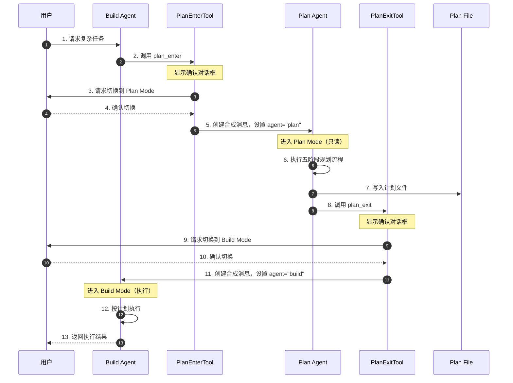

**关键交互说明**：

| 步骤 | 交互内容 | 设计意图 |
|-----|---------|---------|
| 1 | 用户向 Build Agent 发起复杂任务 | Build Agent 是默认入口 |
| 2 | Build Agent 调用 plan_enter 工具 | 显式触发模式切换 |
| 3-4 | 请求用户确认 | 防止意外切换，确保用户知情 |
| 5 | 创建合成消息切换 Agent | 通过消息系统中的 agent 字段实现模式切换 |
| 6 | Plan Agent 执行五阶段规划 | 结构化规划流程 |
| 7 | 写入计划文件 | 持久化计划，支持版本控制 |
| 8-10 | 请求用户确认退出 Plan Mode | 确保用户对计划满意 |
| 11 | 切换回 Build Agent | 恢复执行权限 |
| 12-13 | 按计划执行并返回结果 | 基于详细计划进行实现 |

---

## 3. 核心组件详细分析

### 3.1 Agent 定义与权限系统

#### 职责定位

Agent 定义是 Plan and Execute 模式的核心，通过权限配置实现严格的模式隔离。

#### 状态机图

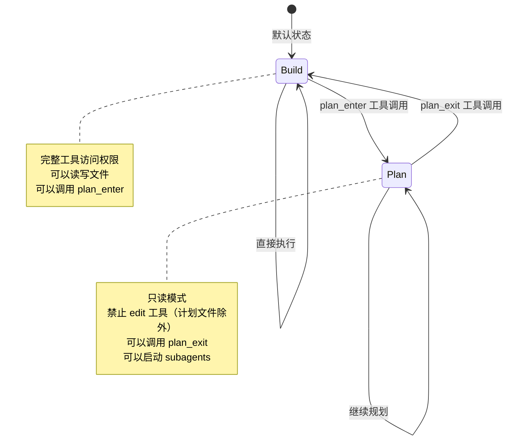

**状态说明**：

| 状态 | 说明 | 进入条件 | 退出条件 |
|-----|------|---------|---------|
| Build | 执行模式 | 默认状态或 plan_exit 后 | 调用 plan_enter 且用户确认 |
| Plan | 计划模式 | 调用 plan_enter 且用户确认 | 调用 plan_exit 且用户确认 |

#### 内部数据流

```text
┌─────────────────────────────────────────────────────────────┐
│  输入层                                                      │
│  ├── 用户请求 ──► 意图识别 ──► 任务复杂度评估                 │
│  └── 工具调用 ──► plan_enter/plan_exit                      │
└──────────────────────────┬──────────────────────────────────┘
                           ▼
┌─────────────────────────────────────────────────────────────┐
│  权限检查层                                                  │
│  ├── Agent 类型判断 (build/plan)                             │
│  ├── 权限规则匹配 (PermissionNext.merge)                     │
│  └── 工具访问控制 (allow/deny/ask)                           │
└──────────────────────────┬──────────────────────────────────┘
                           ▼
┌─────────────────────────────────────────────────────────────┐
│  执行层                                                      │
│  ├── Build Mode: 完整工具访问                                │
│  └── Plan Mode: 受限访问（仅读 + 计划文件写）                 │
└─────────────────────────────────────────────────────────────┘
```

#### 关键算法逻辑

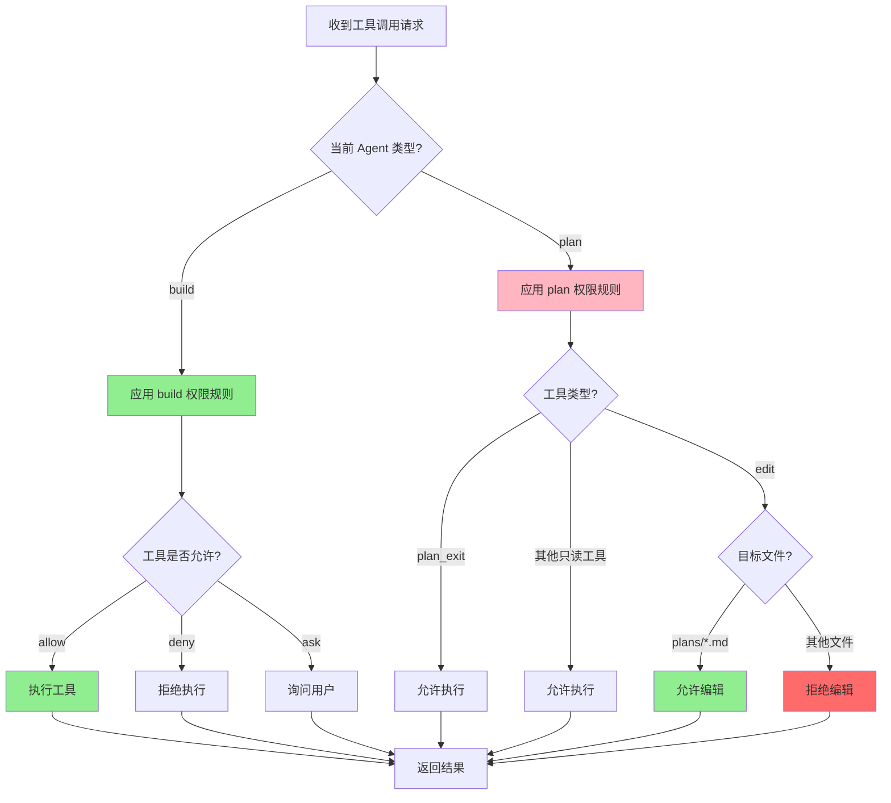

**算法要点**：

1. **权限合并逻辑**：默认权限 + Agent 特定权限 + 用户自定义权限三层合并
2. **Plan Agent 特殊处理**：edit 工具默认 deny，仅对计划文件路径 allow
3. **模式切换验证**：通过 question 工具获取用户显式确认

#### 关键接口

| 接口 | 输入 | 输出 | 说明 | 代码位置 |
|-----|------|------|------|---------|
| `Agent.get()` | agent 名称 | Agent.Info | 获取 Agent 配置 | `opencode/packages/opencode/src/agent/agent.ts:253-255` |
| `PermissionNext.merge()` | 多个 Ruleset | 合并后的 Ruleset | 合并权限规则 | `opencode/packages/opencode/src/permission/next.ts` |
| `PermissionNext.fromConfig()` | 配置对象 | Ruleset | 从配置创建权限 | `opencode/packages/opencode/src/permission/next.ts` |

---

### 3.2 Plan 工具实现

#### 职责定位

PlanEnterTool 和 PlanExitTool 是模式切换的触发器，负责用户确认和状态转换。

#### 状态机图

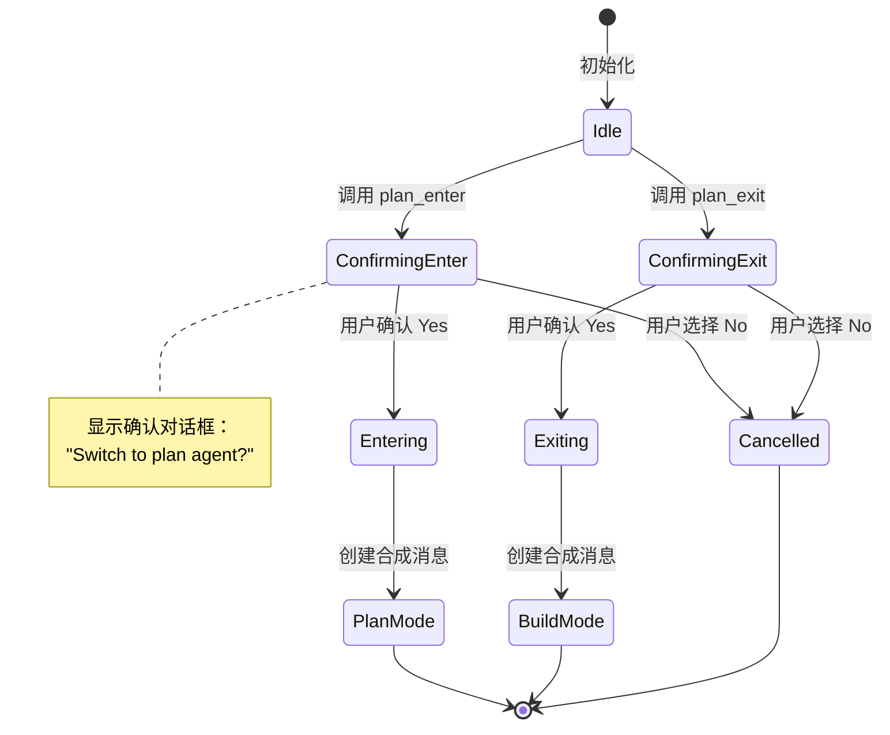

#### 关键数据路径

**PlanEnterTool 执行流程**：

```mermaid
flowchart LR
    subgraph Input["输入阶段"]
        I1[execute 调用] --> I2[获取 session]
        I2 --> I3[计算 plan 文件路径]
    end

    subgraph Process["处理阶段"]
        P1[显示确认对话框] --> P2{用户确认?}
        P2 -->|Yes| P3[创建合成用户消息]
        P2 -->|No| P4[抛出 RejectedError]
        P3 --> P5[设置 agent="plan"]
        P5 --> P6[添加系统提示]
    end

    subgraph Output["输出阶段"]
        O1[保存消息到数据库] --> O2[返回切换结果]
    end

    I3 --> P1
    P6 --> O1
    P4 --> End[结束]
    O2 --> End

    style P3 fill:#90EE90
    style P4 fill:#FF6B6B
```

**PlanExitTool 执行流程**：

```mermaid
flowchart LR
    subgraph Input["输入阶段"]
        I1[execute 调用] --> I2[获取 session]
        I2 --> I3[计算 plan 文件路径]
    end

    subgraph Process["处理阶段"]
        P1[显示确认对话框] --> P2{用户确认?}
        P2 -->|Yes| P3[创建合成用户消息]
        P2 -->|No| P4[抛出 RejectedError]
        P3 --> P5[设置 agent="build"]
        P5 --> P6[添加 Build Switch 提示]
    end

    subgraph Output["输出阶段"]
        O1[保存消息到数据库] --> O2[返回切换结果]
    end

    I3 --> P1
    P6 --> O1
    P4 --> End[结束]
    O2 --> End

    style P3 fill:#90EE90
    style P4 fill:#FF6B6B
```

---

### 3.3 组件间协作时序

展示 Plan and Execute 模式中的完整协作流程。

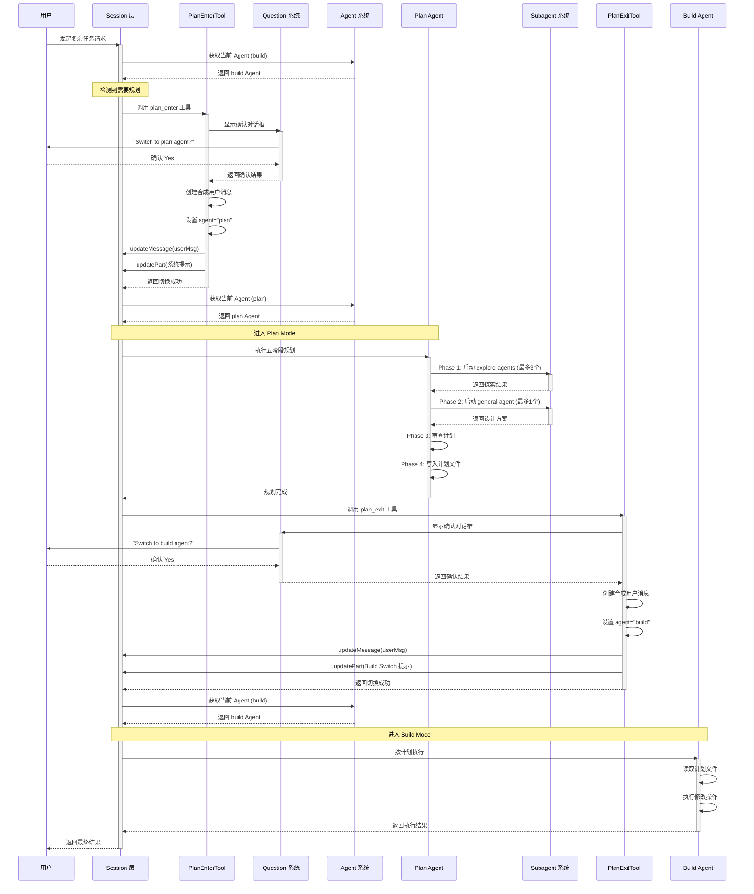

**协作要点**：

1. **Session 层协调**：作为中央协调器，管理 Agent 切换和消息流转
2. **Question 系统**：提供用户确认机制，确保模式切换是显式的
3. **Subagent 系统**：在 Plan Mode 中用于并行探索和设计方案
4. **合成消息机制**：通过创建带有 agent 字段的用户消息实现模式切换

---

### 3.4 关键数据路径

#### 主路径（正常流程）

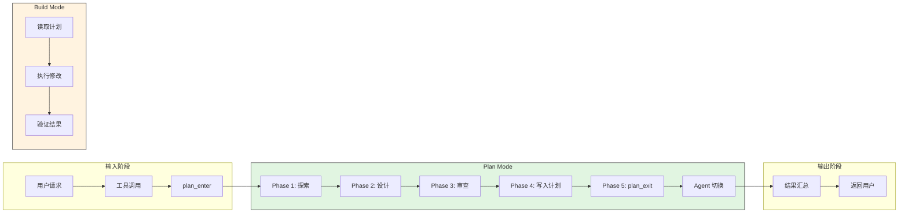

#### 异常路径（错误恢复）

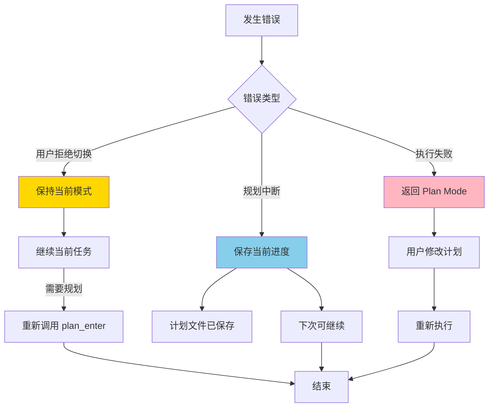

---

## 4. 端到端数据流转

### 4.1 正常流程（详细版）

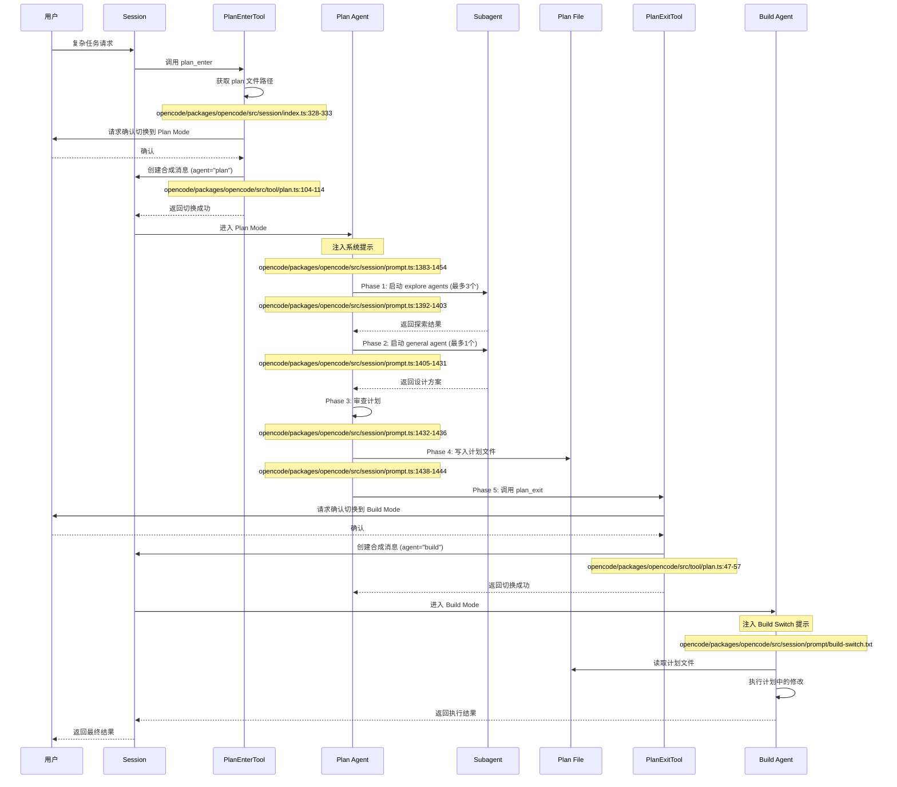

**数据变换详情**：

| 阶段 | 输入 | 处理 | 输出 | 代码位置 |
|-----|------|------|------|---------|
| 触发 Plan Mode | 用户请求 | 调用 plan_enter 工具 | 确认对话框 | `opencode/packages/opencode/src/tool/plan.ts:78-96` |
| 模式切换 | 用户确认 | 创建合成消息，设置 agent="plan" | 新消息写入数据库 | `opencode/packages/opencode/src/tool/plan.ts:104-122` |
| Phase 1 | 用户请求 | 启动 explore subagents | 代码探索结果 | `opencode/packages/opencode/src/session/prompt.ts:1392-1403` |
| Phase 2 | 探索结果 | 启动 general subagent | 设计方案 | `opencode/packages/opencode/src/session/prompt.ts:1405-1431` |
| Phase 4 | 设计方案 | 格式化并写入 | Plan 文件 | `opencode/packages/opencode/src/session/prompt.ts:1438-1444` |
| 退出 Plan Mode | plan_exit 调用 | 用户确认，创建合成消息 | 切换到 build | `opencode/packages/opencode/src/tool/plan.ts:23-66` |

### 4.2 数据流向图

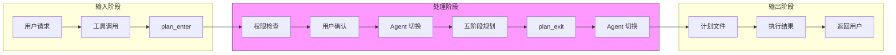

### 4.3 异常/边界流程

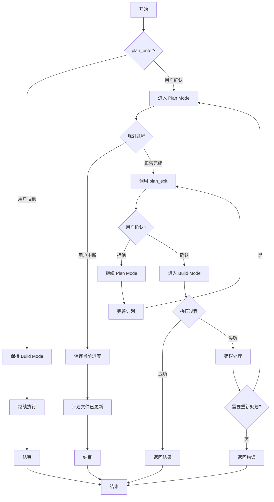

---

## 5. 关键代码实现

### 5.1 核心数据结构

**Agent.Info 定义**：

```typescript
// opencode/packages/opencode/src/agent/agent.ts:24-49
export const Info = z
  .object({
    name: z.string(),
    description: z.string().optional(),
    mode: z.enum(["subagent", "primary", "all"]),
    native: z.boolean().optional(),
    hidden: z.boolean().optional(),
    topP: z.number().optional(),
    temperature: z.number().optional(),
    color: z.string().optional(),
    permission: PermissionNext.Ruleset,  // 权限规则
    model: z.object({
      modelID: z.string(),
      providerID: z.string(),
    }).optional(),
    variant: z.string().optional(),
    prompt: z.string().optional(),
    options: z.record(z.string(), z.any()),
    steps: z.number().int().positive().optional(),
  })
```

**字段说明**：

| 字段 | 类型 | 用途 |
|-----|------|------|
| `name` | `string` | Agent 标识符 ("build", "plan") |
| `permission` | `Ruleset` | 权限规则列表，控制工具访问 |
| `mode` | `enum` | Agent 模式 (primary/subagent/all) |
| `native` | `boolean` | 是否内置 Agent |
| `prompt` | `string` | 系统提示词（可选） |

### 5.2 主链路代码

**Plan Agent 定义（权限隔离核心）**：

```typescript
// opencode/packages/opencode/src/agent/agent.ts:92-114
plan: {
  name: "plan",
  description: "Plan mode. Disallows all edit tools.",
  permission: PermissionNext.merge(
    defaults,
    PermissionNext.fromConfig({
      question: "allow",
      plan_exit: "allow",
      external_directory: {
        [path.join(Global.Path.data, "plans", "*")]: "allow",
      },
      edit: {
        "*": "deny",  // 禁止所有编辑
        // 仅允许编辑计划文件
        [path.join(".opencode", "plans", "*.md")]: "allow",
        [path.relative(Instance.worktree, path.join(Global.Path.data,
          path.join("plans", "*.md")))]: "allow",
      },
    }),
    user,
  ),
  mode: "primary",
  native: true,
},
```

**代码要点**：
1. **权限分层设计**：默认权限 + Plan 特定权限 + 用户自定义权限三层合并
2. **严格编辑限制**：edit 工具默认 deny，仅对计划文件路径显式 allow
3. **外部目录访问**：允许访问 plans 目录用于文件存储

**PlanEnterTool 执行逻辑**：

```typescript
// opencode/packages/opencode/src/tool/plan.ts:75-130
export const PlanEnterTool = Tool.define("plan_enter", {
  description: ENTER_DESCRIPTION,
  parameters: z.object({}),
  async execute(_params, ctx) {
    const session = await Session.get(ctx.sessionID)
    const plan = path.relative(Instance.worktree, Session.plan(session))

    // 1. 请求用户确认
    const answers = await Question.ask({
      sessionID: ctx.sessionID,
      questions: [{
        question: `Would you like to switch to the plan agent...?`,
        header: "Plan Mode",
        options: [
          { label: "Yes", description: "Switch to plan agent..." },
          { label: "No", description: "Stay with build agent..." },
        ],
      }],
    })

    const answer = answers[0]?.[0]
    if (answer === "No") throw new Question.RejectedError()

    // 2. 创建合成消息，设置 agent="plan"
    const model = await getLastModel(ctx.sessionID)
    const userMsg: MessageV2.User = {
      id: Identifier.ascending("message"),
      sessionID: ctx.sessionID,
      role: "user",
      time: { created: Date.now() },
      agent: "plan",  // 关键：设置 Agent 为 plan
      model,
    }
    await Session.updateMessage(userMsg)

    // 3. 添加系统提示（包含五阶段工作流）
    await Session.updatePart({
      id: Identifier.ascending("part"),
      messageID: userMsg.id,
      sessionID: ctx.sessionID,
      type: "text",
      text: "User has requested to enter plan mode...",
      synthetic: true,
    })

    return {
      title: "Switching to plan agent",
      output: `User confirmed to switch to plan mode...`,
      metadata: {},
    }
  },
})
```

**代码要点**：
1. **显式用户确认**：通过 Question.ask 获取用户明确同意
2. **合成消息机制**：创建带有 agent="plan" 的用户消息触发模式切换
3. **系统提示注入**：通过 synthetic 消息注入五阶段工作流提示

### 5.3 关键调用链

```text
SessionPrompt.prompt()    [opencode/packages/opencode/src/session/prompt.ts:158-185]
  -> loop()               [opencode/packages/opencode/src/session/prompt.ts:...]
    -> Agent.get(agent)   [opencode/packages/opencode/src/agent/agent.ts:253-255]
      - 根据消息中的 agent 字段获取对应 Agent 配置
    -> ToolRegistry.tools() [opencode/packages/opencode/src/tool/registry.ts:129-170]
      - 根据 Agent.permission 过滤可用工具
    -> PlanEnterTool.execute() [opencode/packages/opencode/src/tool/plan.ts:78-130]
      - Question.ask() 请求用户确认
      - Session.updateMessage() 创建合成消息
      - Session.updatePart() 添加系统提示
    -> PlanExitTool.execute() [opencode/packages/opencode/src/tool/plan.ts:23-73]
      - 类似流程，切换到 build Agent
```

---

## 6. 设计意图与 Trade-off

### 6.1 OpenCode 的选择

| 维度 | OpenCode 的选择 | 替代方案 | 取舍分析 |
|-----|-----------------|---------|---------|
| 模式实现 | 双 Agent + 权限隔离 | 单 Agent + 提示词控制 | 强制隔离更可靠，但实现更复杂 |
| 切换机制 | 显式工具调用 + 用户确认 | 自动检测切换 | 用户可控性高，但需要额外交互 |
| 计划存储 | 文件系统 (Markdown) | 数据库存储 | 支持版本控制，但需要文件权限 |
| 子代理并行 | Phase 1 最多 3 个 explore | 单代理串行 | 探索效率更高，但资源消耗更大 |
| 功能状态 | 实验性功能（需显式启用） | 默认启用 | 降低风险，但发现度低 |

### 6.2 为什么这样设计？

**核心问题**：如何确保 LLM 在充分理解需求后再进行修改？

**OpenCode 的解决方案**：

- **代码依据**：`opencode/packages/opencode/src/agent/agent.ts:92-114`（Plan Agent 权限定义）
- **设计意图**：通过权限系统的强制隔离，从机制上防止 Plan Mode 下的意外修改
- **带来的好处**：
  - 规划阶段绝对安全，不会修改代码
  - 强制结构化思考（五阶段工作流）
  - 计划可持久化、可审查、可版本控制
  - 用户始终掌控模式切换决策
- **付出的代价**：
  - 需要额外的用户确认交互
  - 功能目前为实验性，需要显式启用
  - 仅 CLI 客户端支持

### 6.3 与其他项目的对比

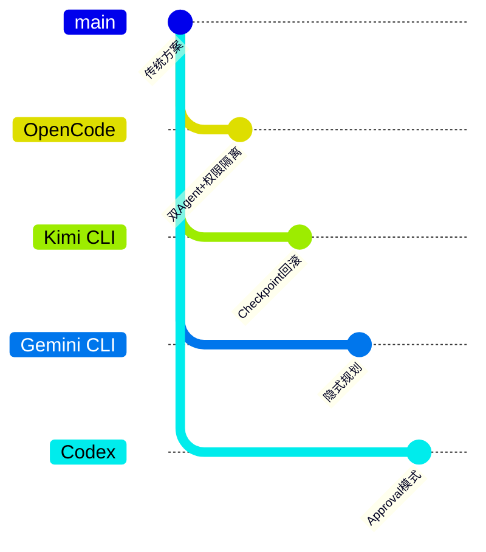

| 项目 | 核心差异 | 适用场景 |
|-----|---------|---------|
| OpenCode | 显式双 Agent + 权限强制隔离 + 五阶段工作流 | 需要严格规划的大型重构任务 |
| Kimi CLI | Checkpoint 文件系统回滚，无显式 Plan Mode | 需要频繁试错和回滚的场景 |
| Gemini CLI | 隐式规划，通过提示词引导 | 快速迭代、轻量级规划 |
| Codex | 基于审批的模式（ask/allow） | 企业安全环境，人工审批流程 |

**关键差异分析**：

1. **OpenCode vs Kimi CLI**：
   - OpenCode 强调"事前规划"，通过权限隔离防止未规划的修改
   - Kimi CLI 强调"事后回滚"，允许自由修改但可恢复到之前状态

2. **OpenCode vs Gemini CLI**：
   - OpenCode 是显式模式切换，用户明确知道当前处于规划还是执行阶段
   - Gemini CLI 是隐式规划，通过提示词引导 LLM 自行决定何时规划

3. **OpenCode vs Codex**：
   - OpenCode 的权限控制是 Agent 级别的（Plan Agent 完全禁止编辑）
   - Codex 的权限控制是操作级别的（每个操作可配置 ask/allow/deny）

---

## 7. 边界情况与错误处理

### 7.1 终止条件

| 终止原因 | 触发条件 | 代码位置 |
|---------|---------|---------|
| 用户拒绝切换 | Question.ask 返回 "No" | `opencode/packages/opencode/src/tool/plan.ts:100` |
| 规划完成 | 调用 plan_exit 且用户确认 | `opencode/packages/opencode/src/tool/plan.ts:42-66` |
| 会话结束 | 用户关闭会话 | Session 层处理 |

### 7.2 超时/资源限制

```typescript
// opencode/packages/opencode/src/session/prompt.ts:1397
// Phase 1: 最多启动 3 个 explore agents
Launch up to 3 explore agents IN PARALLEL

// opencode/packages/opencode/src/session/prompt.ts:1410
// Phase 2: 最多启动 1 个 general agent
You can launch up to 1 agent(s) in parallel
```

### 7.3 错误恢复策略

| 错误类型 | 处理策略 | 代码位置 |
|---------|---------|---------|
| 用户拒绝进入 Plan Mode | 抛出 RejectedError，保持 Build Mode | `opencode/packages/opencode/src/tool/plan.ts:100` |
| 用户拒绝退出 Plan Mode | 抛出 RejectedError，保持 Plan Mode | `opencode/packages/opencode/src/tool/plan.ts:43` |
| 计划文件写入失败 | 标准文件系统错误处理 | 文件系统层 |

---

## 8. 关键代码索引

| 功能 | 文件 | 行号 | 说明 |
|-----|------|------|------|
| Build Agent 定义 | `opencode/packages/opencode/src/agent/agent.ts` | 77-91 | 执行模式 Agent 配置 |
| Plan Agent 定义 | `opencode/packages/opencode/src/agent/agent.ts` | 92-114 | 计划模式 Agent 配置（权限隔离核心） |
| PlanEnterTool | `opencode/packages/opencode/src/tool/plan.ts` | 75-130 | 进入 Plan Mode 的工具实现 |
| PlanExitTool | `opencode/packages/opencode/src/tool/plan.ts` | 20-73 | 退出 Plan Mode 的工具实现 |
| 功能标志 | `opencode/packages/opencode/src/flag/flag.ts` | 53 | OPENCODE_EXPERIMENTAL_PLAN_MODE |
| 工具注册条件 | `opencode/packages/opencode/src/tool/registry.ts` | 120 | 条件注册 Plan 工具 |
| Plan 文件路径 | `opencode/packages/opencode/src/session/index.ts` | 328-333 | 生成计划文件路径 |
| 五阶段工作流 | `opencode/packages/opencode/src/session/prompt.ts` | 1392-1452 | Plan Mode 系统提示 |
| Build Switch 提示 | `opencode/packages/opencode/src/session/prompt/build-switch.txt` | 1-6 | 切换到 Build Mode 的系统提示 |
| Plan Mode 提示 | `opencode/packages/opencode/src/session/prompt/plan.txt` | 1-27 | Plan Mode 系统提示模板 |

---

## 9. 延伸阅读

- 前置知识：`docs/opencode/04-opencode-agent-loop.md`（Agent Loop 机制）
- 相关机制：`docs/opencode/06-opencode-mcp-integration.md`（Subagent 系统）
- 对比分析：`docs/comm/comm-plan-and-execute.md`（跨项目 Plan and Execute 对比）
- 权限系统：`docs/opencode/questions/opencode-permission-system.md`（PermissionNext 详解）

---

*✅ Verified: 基于 opencode/packages/opencode/src/agent/agent.ts:77-114、opencode/packages/opencode/src/tool/plan.ts:20-130 等源码分析*
*基于版本：opencode (baseline 2026-02-08) | 最后更新：2026-02-24*
