# OpenCode：使用 revert 回滚时，用户已编辑与源文件冲突怎么处理？

## TL;DR（结论先行）

一句话定义：**OpenCode 的 revert 机制不做"用户已编辑"的冲突检测，直接使用 `git checkout <hash> -- <file>` 按 checkpoint 的 tree hash 强制覆盖工作区文件。**

OpenCode 的核心取舍：**强制覆盖工作区文件**（对比 Kimi CLI 的仅上下文回滚、Gemini CLI 的 Git 快照恢复），在提供完整文件级回滚能力的同时，将用户编辑冲突的风险外推给用户自行管理。

---

## 1. 为什么需要这个机制？（解决什么问题）

### 1.1 问题场景

想象一个 AI Coding Agent 中的 revert 场景：

```
场景：用户让 Agent 修改代码，但结果不满意，想要回滚

有冲突检测的 revert：
  → 用户："回滚到修改前"
  → Agent：检测到用户在此期间手动编辑了文件
  → Agent：提示冲突，让用户选择保留哪一方修改

无冲突检测的 revert（OpenCode 现状）：
  → 用户："回滚到修改前"
  → Agent：直接执行 git checkout 覆盖文件
  → 结果：用户的编辑被静默覆盖，无提示无协商
```

### 1.2 核心挑战

| 挑战 | 不解决的后果 |
|-----|-------------|
| 文件状态追踪 | 无法确定回滚目标状态 |
| 冲突检测 | 用户编辑与回滚目标可能产生冲突 |
| 冲突协商 | 需要用户介入决定保留哪些修改 |
| 数据丢失风险 | 用户编辑被静默覆盖，造成意外损失 |

---

## 2. 整体架构（ASCII 图）

### 2.1 在系统中的位置

```text
┌─────────────────────────────────────────────────────────────┐
│ 用户交互层 (CLI / Web UI)                                    │
│ opencode/packages/app/src/pages/session.tsx                 │
└───────────────────────┬─────────────────────────────────────┘
                        │ 触发 revert 请求
                        ▼
┌─────────────────────────────────────────────────────────────┐
│ ▓▓▓ Session Revert 模块 ▓▓▓                                 │
│ opencode/packages/opencode/src/session/revert.ts            │
│ - revert()   : 会话级回滚入口                               │
│ - unrevert() : 撤销回滚                                     │
│ - cleanup()  : 清理回滚区间消息                             │
└───────────────────────┬─────────────────────────────────────┘
                        │ 调用
                        ▼
┌─────────────────────────────────────────────────────────────┐
│ ▓▓▓ Snapshot 模块 ▓▓▓                                       │
│ opencode/packages/opencode/src/snapshot/index.ts            │
│ - track()    : 创建 checkpoint                              │
│ - patch()    : 计算变更文件                                 │
│ - revert()   : 文件级回滚（强制覆盖）                       │
│ - restore()  : 全量恢复                                     │
└───────────────────────┬─────────────────────────────────────┘
                        │ 执行 git checkout
                        ▼
┌─────────────────────────────────────────────────────────────┐
│ Shadow Git 仓库                                             │
│ <data>/snapshot/<project.id>                                │
│ - gitdir()   : 影子仓库路径                                 │
│ - 独立 git 操作，不污染用户项目 .git                        │
└───────────────────────┬─────────────────────────────────────┘
                        │ 修改工作区文件
                        ▼
┌─────────────────────────────────────────────────────────────┐
│ 工作区文件（用户项目目录）                                   │
│ （用户编辑可能被覆盖，无冲突检测）                           │
└─────────────────────────────────────────────────────────────┘
```

### 2.2 核心组件职责

| 组件 | 职责 | 代码位置 |
|-----|------|---------|
| `SessionRevert` | 会话级回滚协调，收集 patches，调用 Snapshot | `opencode/packages/opencode/src/session/revert.ts:14` |
| `SessionRevert.revert()` | 找到目标 message/part，执行回滚流程 | `opencode/packages/opencode/src/session/revert.ts:24` |
| `Snapshot.revert()` | 文件级回滚，执行 `git checkout` 强制覆盖 | `opencode/packages/opencode/src/snapshot/index.ts:131` |
| `Snapshot.restore()` | 全量恢复，用于 unrevert 场景 | `opencode/packages/opencode/src/snapshot/index.ts:112` |
| `Snapshot.track()` | 创建 checkpoint，记录 tree hash | `opencode/packages/opencode/src/snapshot/index.ts:51` |
| `Snapshot.patch()` | 计算自 checkpoint 以来的变更文件 | `opencode/packages/opencode/src/snapshot/index.ts:85` |

### 2.3 核心组件交互关系

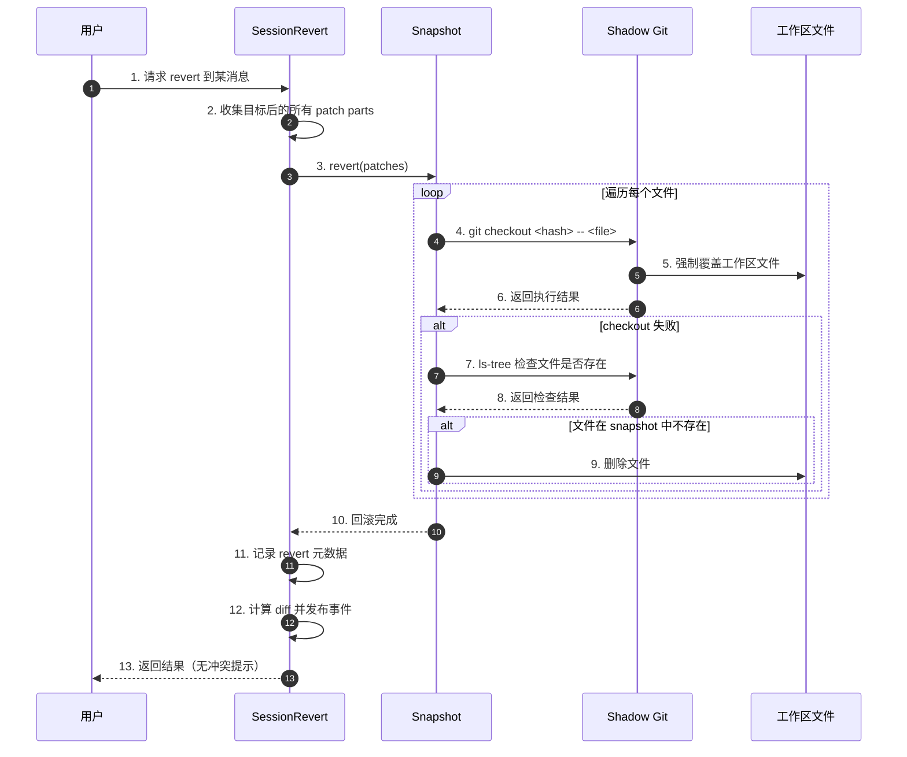

**关键交互说明**：

| 步骤 | 交互内容 | 设计意图 |
|-----|---------|---------|
| 2 | 收集目标后的所有 patches | 确定需要回滚的文件范围 |
| 4 | 执行 git checkout | 使用 git 命令强制恢复文件状态 |
| 5 | 直接覆盖工作区文件 | **无冲突检测，直接覆盖** |
| 7-9 | 处理新增文件回滚 | 若文件在 snapshot 中不存在则删除 |
| 12 | 发布 diff 事件 | 供 UI 展示回滚后的变更统计 |

---

## 3. 核心组件详细分析

### 3.1 Snapshot.revert() 内部结构

#### 职责定位

`Snapshot.revert()` 是文件级回滚的核心实现，负责将工作区文件恢复到指定 checkpoint 状态。其关键设计是**直接使用 `git checkout` 强制覆盖，不做任何冲突检测**。

#### 状态机图

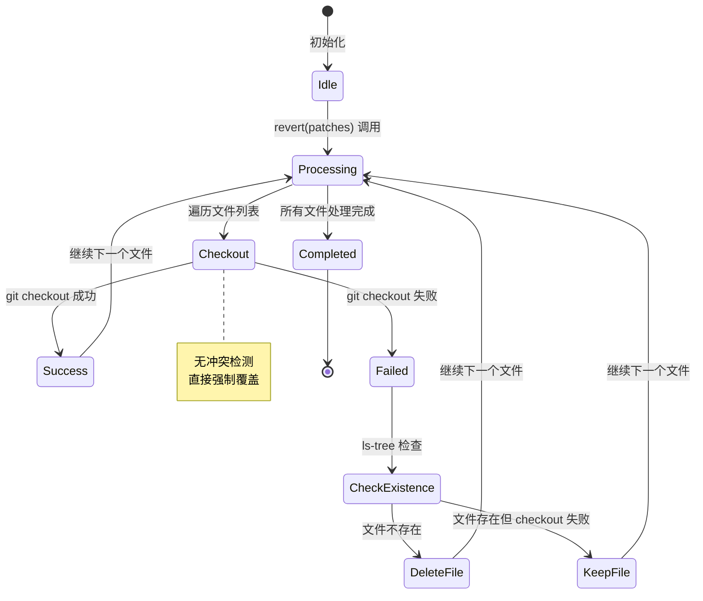

**状态说明**：

| 状态 | 说明 | 操作对象 |
|-----|------|---------|
| Idle | 空闲等待 | - |
| Processing | 遍历 patches 和文件 | patches[] |
| Checkout | 执行 git checkout | 单个文件 |
| Success | checkout 成功 | 工作区文件已覆盖 |
| Failed | checkout 失败 | 需要进一步判断 |
| CheckExistence | 检查文件是否在 snapshot 中 | shadow git |
| DeleteFile | 删除文件（处理新增文件回滚） | 工作区文件 |
| KeepFile | 保留文件（checkout 失败但文件存在） | 工作区文件 |
| Completed | 回滚完成 | - |

#### 内部数据流

```text
┌─────────────────────────────────────────────────────────────┐
│  输入层                                                      │
│  ├── patches[] ──► 遍历每个 patch                           │
│  └── patch.files ──► 遍历每个文件                           │
└──────────────────────────┬──────────────────────────────────┘
                           ▼
┌─────────────────────────────────────────────────────────────┐
│  处理层（无冲突检测）                                         │
│  ├── 去重检查: files.has(file)                              │
│  ├── git checkout <hash> -- <file>                          │
│  │   └── 强制覆盖工作区文件（无提示）                        │
│  └── 失败处理:                                              │
│      ├── ls-tree 检查文件是否存在                            │
│      ├── 存在: 保留文件（记录日志）                          │
│      └── 不存在: 删除文件（新增文件回滚）                    │
└──────────────────────────┬──────────────────────────────────┘
                           ▼
┌─────────────────────────────────────────────────────────────┐
│  输出层                                                      │
│  └── 工作区文件已按 snapshot 状态恢复                        │
│      （用户编辑被覆盖，无冲突提示）                          │
└─────────────────────────────────────────────────────────────┘
```

#### 关键算法逻辑

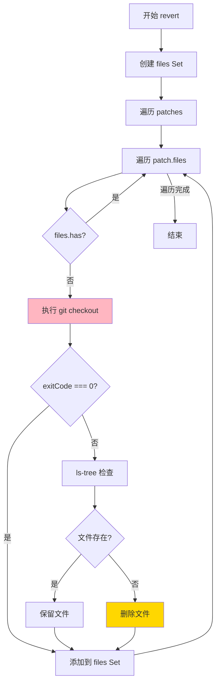

**算法要点**：

1. **去重机制**：使用 Set 避免同一文件被多次 checkout
2. **强制覆盖**：直接执行 `git checkout`，无冲突检测
3. **失败处理**：checkout 失败时检查文件是否存在，决定保留或删除
4. **无用户介入**：整个流程无用户确认或冲突协商

#### 关键接口

| 接口 | 输入 | 输出 | 说明 | 代码位置 |
|-----|------|------|------|---------|
| `revert()` | `patches: Patch[]` | `Promise<void>` | 文件级回滚，强制覆盖 | `snapshot/index.ts:131` |
| `restore()` | `snapshot: string` | `Promise<void>` | 全量恢复，用于 unrevert | `snapshot/index.ts:112` |
| `track()` | - | `Promise<string>` | 创建 checkpoint | `snapshot/index.ts:51` |
| `patch()` | `hash: string` | `Promise<Patch>` | 计算变更文件 | `snapshot/index.ts:85` |

---

### 3.2 SessionRevert.revert() 内部结构

#### 职责定位

`SessionRevert.revert()` 是会话级回滚的入口，负责协调消息历史回滚和文件回滚。它收集目标 message/part 之后的所有 patches，然后调用 `Snapshot.revert()` 执行文件恢复。

#### 关键算法逻辑

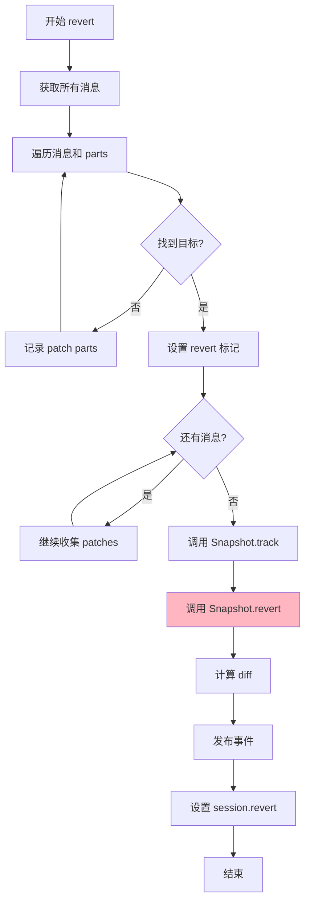

**算法要点**：

1. **目标定位**：找到目标 messageID/partID，记录 revert 点
2. **Patch 收集**：收集目标之后的所有 patch parts
3. **文件回滚**：调用 `Snapshot.revert()` 强制恢复文件
4. **消息清理**：cleanup 阶段删除被回滚区间的消息

---

### 3.3 组件间协作时序

#### Revert 完整流程

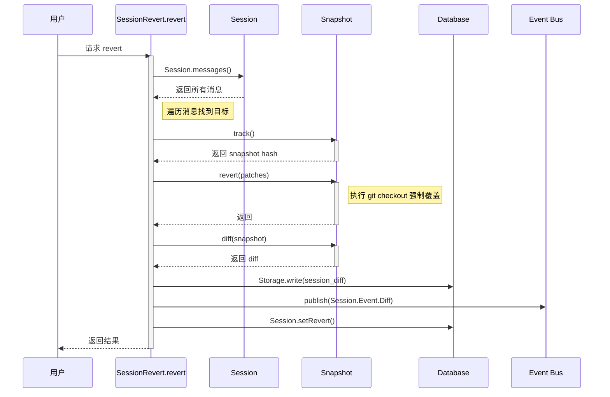

**协作要点**：

1. **消息遍历**：遍历所有消息找到目标 revert 点
2. **Snapshot 协调**：track -> revert -> diff 的顺序调用
3. **事件发布**：发布 diff 事件供 UI 更新
4. **元数据记录**：记录 revert 状态到数据库

---

### 3.4 关键数据路径

#### 主路径（正常 revert）

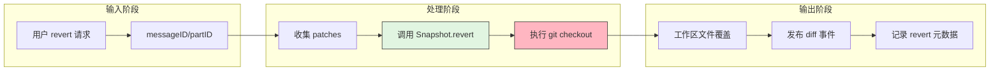

#### 异常路径（用户编辑被覆盖）

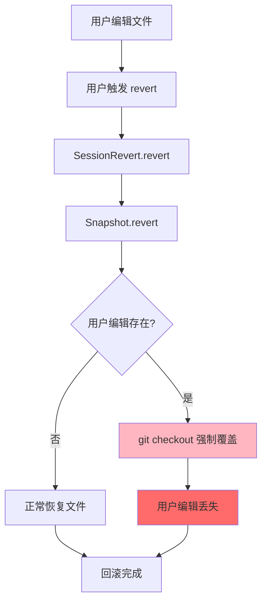

---

## 4. 端到端数据流转

### 4.1 正常流程（详细版）

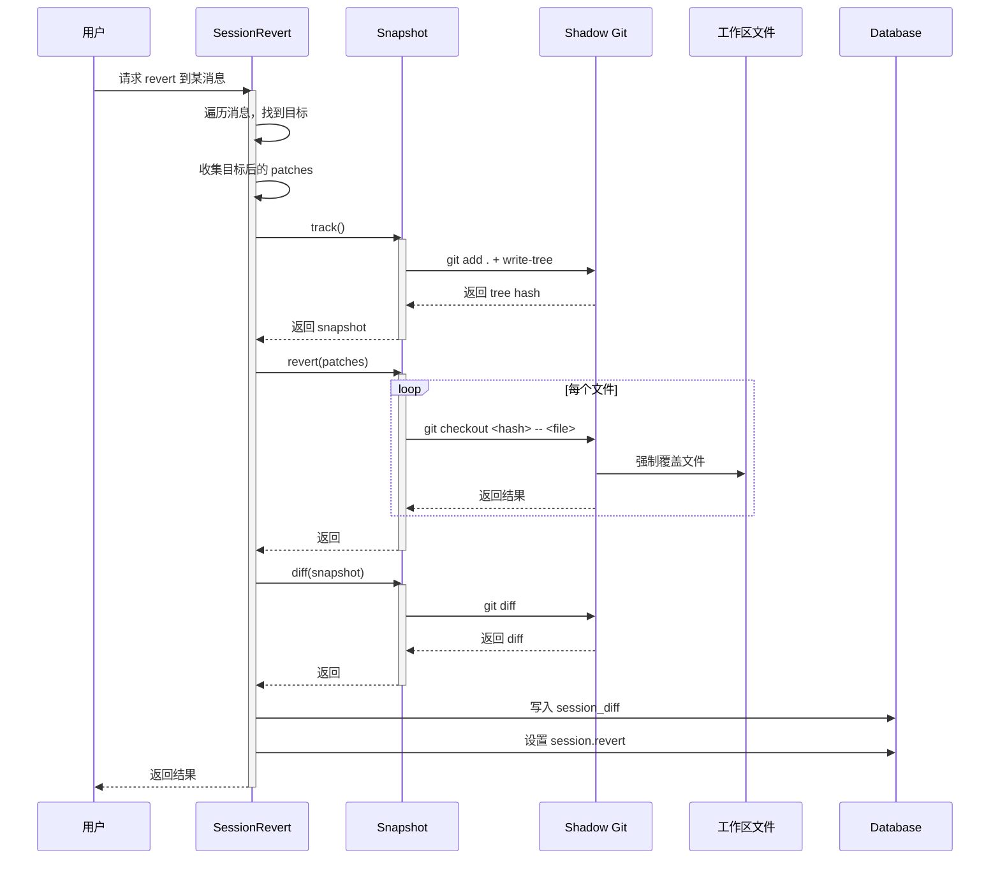

**数据变换详情**：

| 阶段 | 输入 | 处理 | 输出 | 代码位置 |
|-----|------|------|------|---------|
| 目标定位 | messageID/partID | 遍历消息历史 | revert 目标点 | `revert.ts:32-55` |
| Patch 收集 | 消息列表 | 筛选 patch 类型 parts | patches[] | `revert.ts:36-41` |
| 文件回滚 | patches[] | git checkout 强制覆盖 | 工作区文件恢复 | `snapshot/index.ts:131-161` |
| Diff 计算 | snapshot hash | git diff | 变更统计 | `snapshot/index.ts:163-183` |
| 元数据记录 | diff 结果 | 写入数据库 | session.revert | `revert.ts:69-77` |

### 4.2 数据流向图

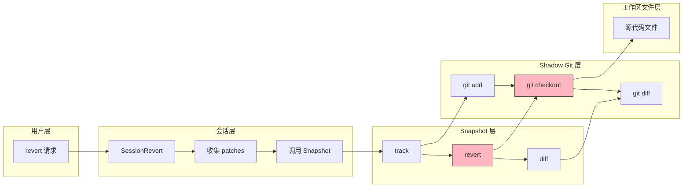

### 4.3 异常/边界流程

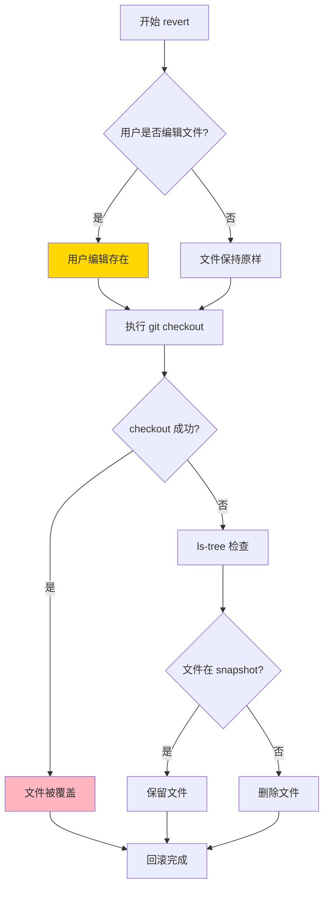

---

## 5. 关键代码实现

### 5.1 核心数据结构

```typescript
// opencode/packages/opencode/src/snapshot/index.ts:79-83
export const Patch = z.object({
  hash: z.string(),
  files: z.string().array(),
})
export type Patch = z.infer<typeof Patch>
```

```typescript
// opencode/packages/opencode/src/session/revert.ts:17-22
export const RevertInput = z.object({
  sessionID: Identifier.schema("session"),
  messageID: Identifier.schema("message"),
  partID: Identifier.schema("part").optional(),
})
export type RevertInput = z.infer<typeof RevertInput>
```

**字段说明**：

| 字段 | 类型 | 用途 |
|-----|------|------|
| `hash` | `string` | checkpoint 的 tree hash |
| `files` | `string[]` | 该 patch 涉及的文件列表 |
| `sessionID` | `string` | 会话标识 |
| `messageID` | `string` | 回滚目标消息标识 |
| `partID` | `string?` | 回滚目标 part 标识（可选） |

### 5.2 主链路代码

#### Snapshot.revert() 实现（强制覆盖）

```typescript
// opencode/packages/opencode/src/snapshot/index.ts:131-161
export async function revert(patches: Patch[]) {
  const files = new Set<string>()
  const git = gitdir()
  for (const item of patches) {
    for (const file of item.files) {
      if (files.has(file)) continue
      log.info("reverting", { file, hash: item.hash })
      const result = await $`git --git-dir ${git} --work-tree ${Instance.worktree} checkout ${item.hash} -- ${file}`
        .quiet()
        .cwd(Instance.worktree)
        .nothrow()
      if (result.exitCode !== 0) {
        const relativePath = path.relative(Instance.worktree, file)
        const checkTree =
          await $`git --git-dir ${git} --work-tree ${Instance.worktree} ls-tree ${item.hash} -- ${relativePath}`
            .quiet()
            .cwd(Instance.worktree)
            .nothrow()
        if (checkTree.exitCode === 0 && checkTree.text().trim()) {
          log.info("file existed in snapshot but checkout failed, keeping", { file })
        } else {
          log.info("file did not exist in snapshot, deleting", { file })
          await fs.unlink(file).catch(() => {})
        }
      }
      files.add(file)
    }
  }
}
```

**代码要点**：

1. **强制覆盖**：直接执行 `git checkout <hash> -- <file>`，无冲突检测
2. **去重机制**：使用 Set 避免重复 checkout 同一文件
3. **失败处理**：checkout 失败时检查文件是否存在于 snapshot
4. **新增文件处理**：若文件在 snapshot 中不存在则删除

#### SessionRevert.revert() 实现

```typescript
// opencode/packages/opencode/src/session/revert.ts:24-80
export async function revert(input: RevertInput) {
  SessionPrompt.assertNotBusy(input.sessionID)
  const all = await Session.messages({ sessionID: input.sessionID })
  let lastUser: MessageV2.User | undefined
  const session = await Session.get(input.sessionID)

  let revert: Session.Info["revert"]
  const patches: Snapshot.Patch[] = []
  for (const msg of all) {
    if (msg.info.role === "user") lastUser = msg.info
    const remaining = []
    for (const part of msg.parts) {
      if (revert) {
        if (part.type === "patch") {
          patches.push(part)
        }
        continue
      }
      // ... 找到目标 message/part
    }
  }

  if (revert) {
    const session = await Session.get(input.sessionID)
    revert.snapshot = session.revert?.snapshot ?? (await Snapshot.track())
    await Snapshot.revert(patches)  // 调用文件级回滚
    if (revert.snapshot) revert.diff = await Snapshot.diff(revert.snapshot)
    // ... 计算 diff 并发布事件
    return Session.setRevert({
      sessionID: input.sessionID,
      revert,
      summary: { /* ... */ },
    })
  }
  return session
}
```

**代码要点**：

1. **目标定位**：遍历消息找到目标 messageID/partID
2. **Patch 收集**：收集目标之后的所有 patch parts
3. **Snapshot 协调**：track -> revert -> diff 的顺序调用
4. **无冲突处理**：代码中无任何冲突检测或用户确认逻辑

### 5.3 关键调用链

```text
SessionRevert.revert()              [revert.ts:24]
  -> Session.messages()             [session/index.ts]
  -> Snapshot.track()               [snapshot/index.ts:51]
  -> Snapshot.revert(patches)       [snapshot/index.ts:131]
    - git checkout <hash> -- <file> [snapshot/index.ts:138]
    - ls-tree 检查（失败时）        [snapshot/index.ts:145]
    - fs.unlink() 删除文件          [snapshot/index.ts:155]
  -> Snapshot.diff()                [snapshot/index.ts:163]
  -> Session.setRevert()            [session/index.ts]
```

---

## 6. 设计意图与 Trade-off

### 6.1 OpenCode 的选择

| 维度 | OpenCode 的选择 | 替代方案 | 取舍分析 |
|-----|----------------|---------|---------|
| 回滚范围 | 文件级回滚（工作区文件） | Kimi CLI 的仅上下文回滚 | 提供完整恢复能力，但可能覆盖用户编辑 |
| 冲突检测 | 无 | 内置冲突检测与协商 | 简化实现，但用户需自行管理冲突风险 |
| 回滚粒度 | Step 级别（每个推理 step） | Session 级别 | 细粒度控制，但 patches 数量可能较多 |
| 存储方式 | Shadow Git（独立 git 仓库） | 数据库快照、内存状态 | 利用 git 能力，不污染用户项目 |
| 回滚方向 | 支持 revert/unrevert | 仅单向回滚 | 可撤销回滚，更灵活 |

### 6.2 为什么这样设计？

**核心问题**：如何在提供文件级回滚能力的同时保持实现简洁？

**OpenCode 的解决方案**：

- **代码依据**：`opencode/packages/opencode/src/snapshot/index.ts:131-161`
- **设计意图**：利用 Shadow Git 机制，直接复用 `git checkout` 的文件恢复能力，不做额外的冲突检测层
- **带来的好处**：
  - 实现简洁，依赖成熟的 git 命令
  - 回滚语义清晰：恢复到指定 checkpoint 的精确状态
  - Shadow Git 不污染用户项目的 git 历史
  - 支持 revert/unrevert 双向操作
- **付出的代价**：
  - 用户编辑可能被静默覆盖，无冲突提示
  - 需要用户自行在 revert 前备份重要修改
  - 依赖本地 git 环境，无 git 时功能不可用

### 6.3 与其他项目的对比

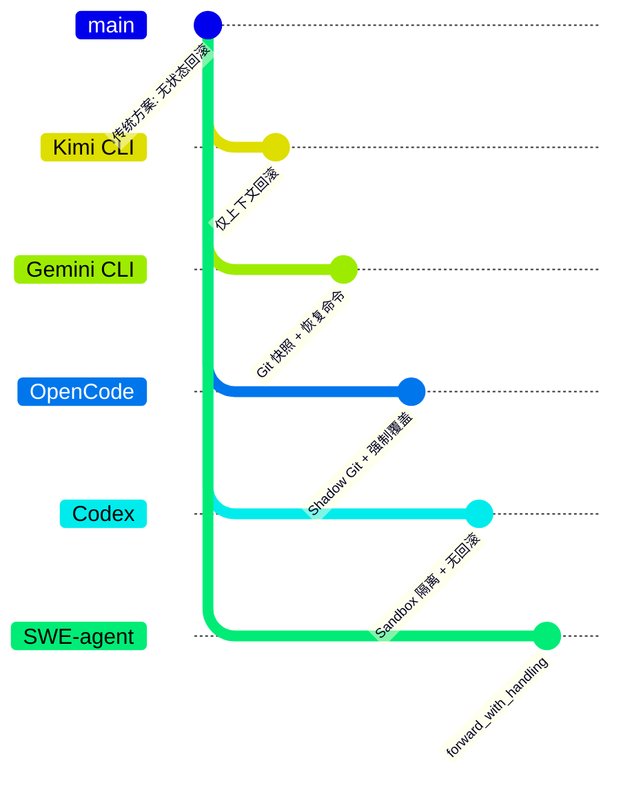

| 项目 | 回滚机制 | 用户编辑冲突处理 | 适用场景 |
|-----|---------|-----------------|---------|
| **OpenCode** | Shadow Git + 文件级强制覆盖 | **无冲突检测，强制覆盖** | 企业级安全、完整审计需求，但需用户自行管理冲突 |
| **Kimi CLI** | 仅上下文回滚（Context.revert_to） | 不涉及（无文件回滚） | 快速迭代、策略实验、用户主导文件管理 |
| **Gemini CLI** | Git 快照（checkpointUtils.ts） | 通过 Git 恢复工作区 | 代码修改安全、可恢复到任意工具调用点 |
| **Codex** | 无 Checkpoint 机制 | 无回滚能力 | 简单场景、Sandbox 隔离保证安全 |
| **SWE-agent** | 无自动回滚 | 通过 `forward_with_handling` 手动恢复 | 研究/实验场景、细粒度控制 |

**关键差异分析**：

1. **OpenCode vs Kimi CLI**：
   - OpenCode 提供文件级回滚，但强制覆盖无冲突检测
   - Kimi CLI 仅回滚上下文，文件状态始终保留，无冲突风险

2. **OpenCode vs Gemini CLI**：
   - 两者都使用 Git 机制，但 OpenCode 使用 Shadow Git 不污染用户项目
   - Gemini CLI 可能通过 Git 命令恢复工作区，OpenCode 直接强制覆盖

3. **OpenCode vs Codex**：
   - Codex 完全依赖 Sandbox 隔离，不保存中间状态
   - OpenCode 提供显式的 checkpoint 和 revert 能力，但无冲突协商

---

## 7. 边界情况与错误处理

### 7.1 终止条件

| 终止原因 | 触发条件 | 代码位置 |
|---------|---------|---------|
| 目标未找到 | messageID/partID 不存在 | `revert.ts:57-79` |
| git checkout 失败 | 文件权限、磁盘空间等 | `snapshot/index.ts:142` |
| 文件不存在 | snapshot 中无该文件记录 | `snapshot/index.ts:149-156` |
| Session 忙 | 有正在进行的 prompt | `revert.ts:25` |

### 7.2 用户编辑冲突场景

```
场景 1: 用户编辑后触发 revert
- 行为: git checkout 强制覆盖，用户编辑丢失
- 结果: 无提示、无协商、无备份
- 建议: 用户在 revert 前自行备份或提交

场景 2: 用户编辑与 Agent 修改同一文件
- 行为: 文件恢复到 checkpoint 状态，两者修改都丢失
- 结果: 仅保留 checkpoint 时的文件状态
- 建议: 使用项目自身的 git 管理版本

场景 3: revert 后用户想恢复编辑
- 行为: 可调用 unrevert 恢复到 revert 前状态
- 结果: 通过 Snapshot.restore() 全量恢复
- 限制: 必须在 cleanup 前调用 unrevert
```

### 7.3 错误恢复策略

| 错误类型 | 处理策略 | 代码位置 |
|---------|---------|---------|
| git checkout 失败 | ls-tree 检查，保留或删除 | `snapshot/index.ts:144-157` |
| Session 忙 | 抛出错误，拒绝 revert | `revert.ts:25` |
| 目标未找到 | 返回原 session，无操作 | `revert.ts:79` |
| 文件删除失败 | catch 忽略，继续处理 | `snapshot/index.ts:155` |

---

## 8. 关键代码索引

| 功能 | 文件 | 行号 | 说明 |
|-----|------|------|------|
| 会话级 revert | `opencode/packages/opencode/src/session/revert.ts` | 24-80 | 核心回滚入口 |
| 文件级 revert | `opencode/packages/opencode/src/snapshot/index.ts` | 131-161 | 强制覆盖实现 |
| 全量恢复 | `opencode/packages/opencode/src/snapshot/index.ts` | 112-129 | unrevert 使用 |
| 创建 checkpoint | `opencode/packages/opencode/src/snapshot/index.ts` | 51-77 | track() 方法 |
| 计算变更 | `opencode/packages/opencode/src/snapshot/index.ts` | 85-110 | patch() 方法 |
| unrevert | `opencode/packages/opencode/src/session/revert.ts` | 82-89 | 撤销回滚 |
| cleanup | `opencode/packages/opencode/src/session/revert.ts` | 91-137 | 清理回滚区间消息 |
| Patch 类型定义 | `opencode/packages/opencode/src/snapshot/index.ts` | 79-83 | 数据结构 |
| RevertInput 定义 | `opencode/packages/opencode/src/session/revert.ts` | 17-22 | 输入参数 |
| gitdir 辅助函数 | `opencode/packages/opencode/src/snapshot/index.ts` | 252-255 | Shadow Git 路径 |

---

## 9. 延伸阅读

- **前置知识**：`docs/opencode/questions/opencode-checkpoint-implementation.md` - Checkpoint 机制完整实现
- **对比分析**：`docs/kimi-cli/questions/kimi-cli-revert-user-edit-conflict.md` - Kimi CLI 的仅上下文回滚设计
- **对比分析**：`docs/gemini-cli/questions/gemini-cli-revert-user-edit-conflict.md` - Gemini CLI 的 Git 快照恢复
- **会话管理**：`docs/opencode/02-opencode-session-management.md` - OpenCode 会话管理架构
- **内存上下文**：`docs/opencode/07-opencode-memory-context.md` - OpenCode 内存与上下文设计

---

*✅ Verified: 基于 opencode/packages/opencode/src/session/revert.ts:24, opencode/packages/opencode/src/snapshot/index.ts:131 等源码分析*

*⚠️ Inferred: 冲突处理行为基于代码中无冲突检测逻辑的推断*

*基于版本：opencode (baseline 2026-02-08) | 最后更新：2026-02-24*
