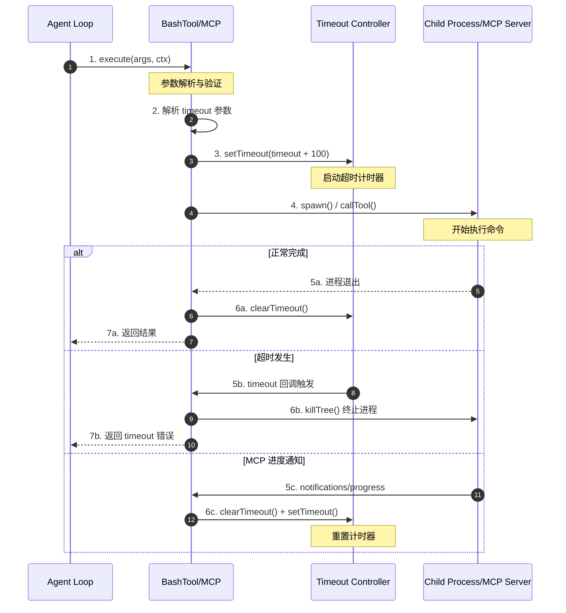
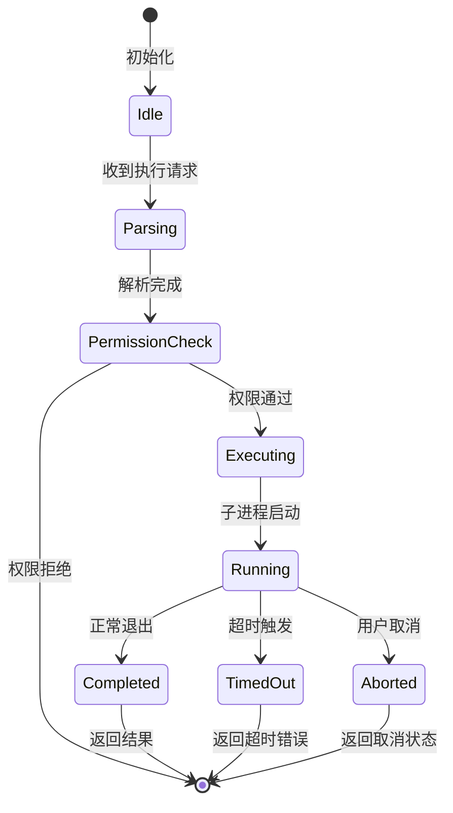
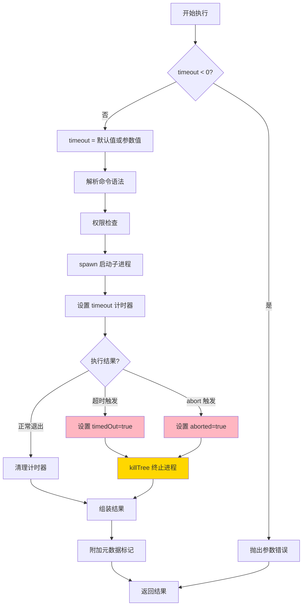
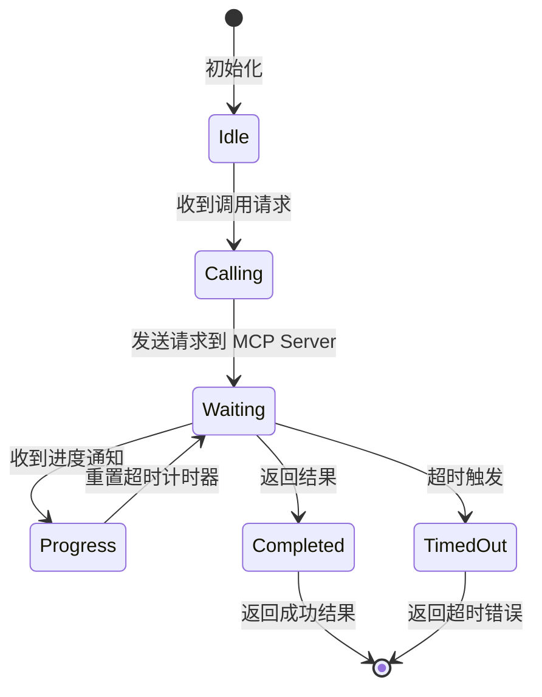
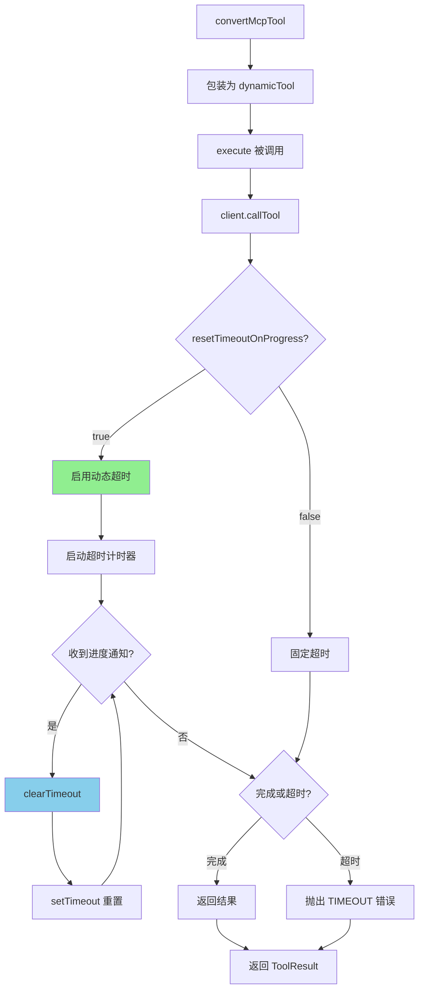
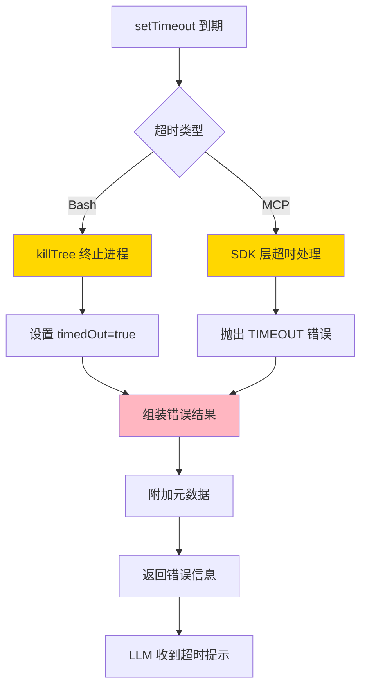
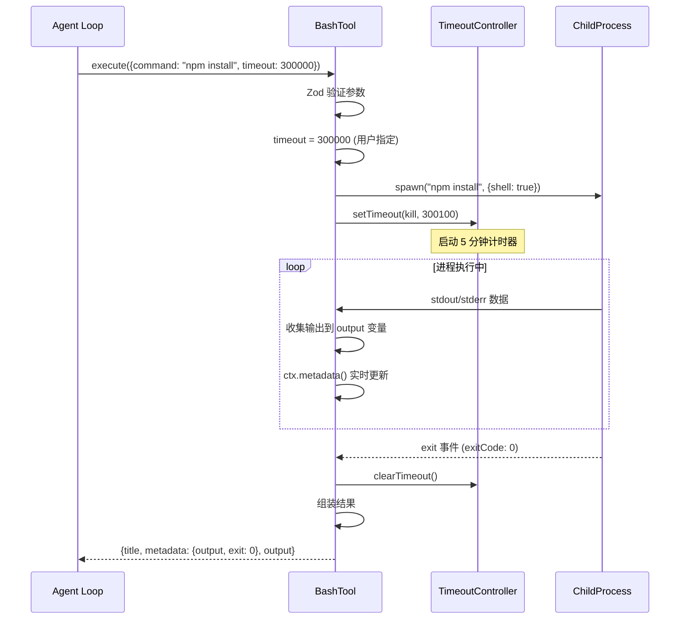
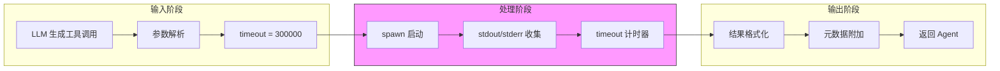
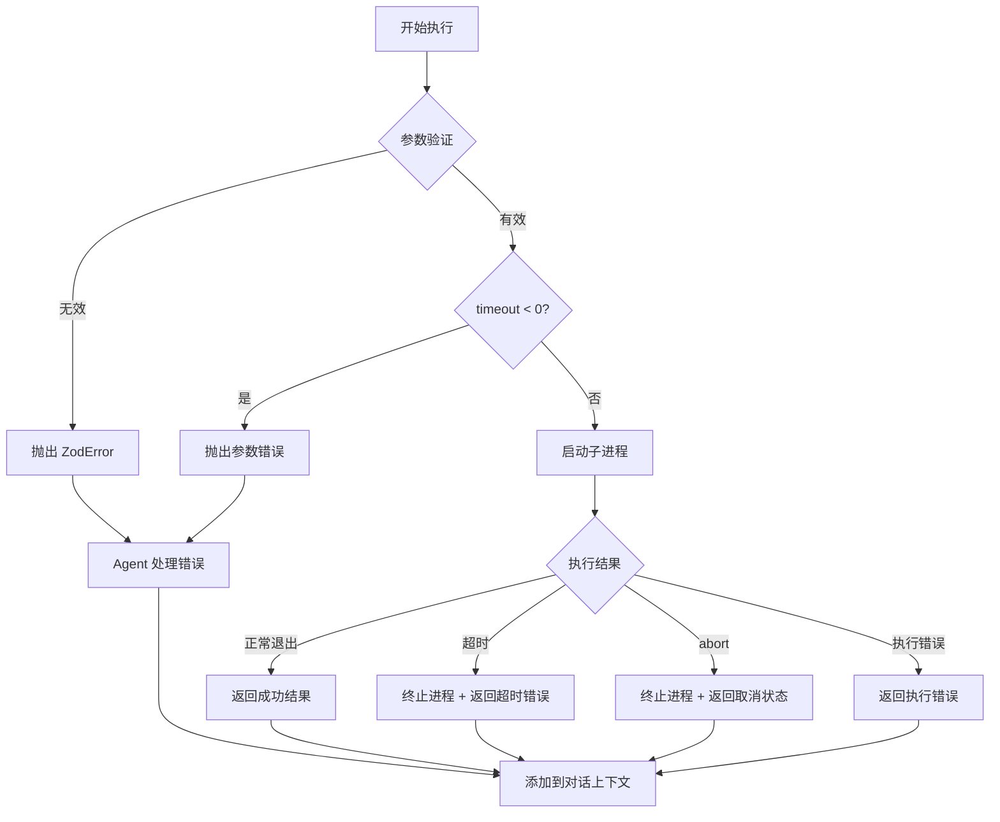
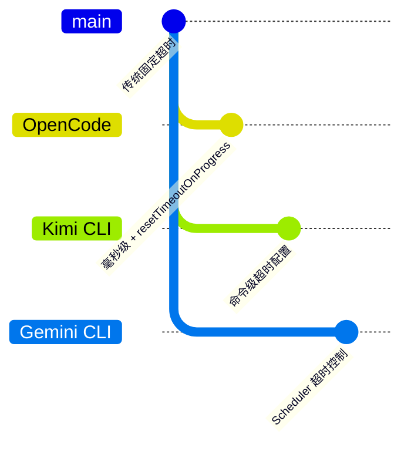

# OpenCode Skill 执行超时机制

## TL;DR（结论先行）

一句话定义：Skill 执行超时机制是 OpenCode 中用于控制工具执行时长的核心机制，通过**毫秒级超时参数**和**动态超时重置**确保长时间运行的任务不会被误判为超时。

OpenCode 的核心取舍：**毫秒级精度 + resetTimeoutOnProgress 动态重置**（对比其他项目的秒级固定超时）

---

## 1. 为什么需要这个机制？（解决什么问题）

### 1.1 问题场景

没有超时机制时：
- LLM 调用 `npm install` → 网络缓慢导致命令挂死 → Agent 无限等待 → 用户体验极差
- LLM 调用文件索引工具 → 大项目索引耗时 30 分钟 → 固定 10 分钟超时 → 任务被误杀

有超时机制后：
- 命令执行超过阈值 → 自动终止 → 返回超时错误 → LLM 可调整策略重试
- 长时间任务持续上报进度 → 超时计时器动态重置 → 任务正常完成

### 1.2 核心挑战

| 挑战 | 不解决的后果 |
|-----|-------------|
| 命令无限期挂死 | Agent 卡住，用户无法继续操作 |
| 固定超时误判 | 正常长任务被中断，需要反复重试 |
| 超时后无反馈 | LLM 不知道发生了什么，无法自我纠正 |
| 不同工具需要不同超时 | 一刀切导致部分工具无法正常工作 |

---

## 2. 整体架构（ASCII 图）

### 2.1 在系统中的位置

```text
┌─────────────────────────────────────────────────────────────┐
│ Agent Loop / Session Runtime                                 │
│ packages/opencode/src/agent/agent.ts                         │
└───────────────────────┬─────────────────────────────────────┘
                        │ 调用工具
                        ▼
┌─────────────────────────────────────────────────────────────┐
│ ▓▓▓ Skill/Tool 执行层 ▓▓▓                                    │
│ packages/opencode/src/tool/bash.ts                           │
│ packages/opencode/src/mcp/index.ts                           │
│ - BashTool.execute() : 本地命令执行 + 超时控制               │
│ - MCP.convertMcpTool() : MCP 工具封装 + 动态超时             │
└───────────────────────┬─────────────────────────────────────┘
                        │ 依赖/调用
        ┌───────────────┼───────────────┐
        ▼               ▼               ▼
┌──────────────┐ ┌──────────────┐ ┌──────────────┐
│ 子进程执行    │ │ MCP SDK      │ │ 超时工具     │
│ child_process│ │ @modelcontext│ │ withTimeout  │
│ spawn        │ │ protocol/sdk │ │              │
└──────────────┘ └──────────────┘ └──────────────┘
```

### 2.2 核心组件职责

| 组件 | 职责 | 代码位置 |
|-----|------|---------|
| `BashTool` | 本地命令执行与超时控制 | `packages/opencode/src/tool/bash.ts:78-274` |
| `MCP.convertMcpTool` | MCP 工具封装与动态超时 | `packages/opencode/src/mcp/index.ts:120-148` |
| `withTimeout` | 通用超时包装器 | `packages/opencode/src/util/timeout.ts:1-14` |
| `Flag` | 环境变量配置（默认超时） | `packages/opencode/src/flag/flag.ts:47` |

### 2.3 核心组件交互关系



**关键交互说明**：

| 步骤 | 交互内容 | 设计意图 |
|-----|---------|---------|
| 1 | Agent 调用工具执行 | 解耦业务逻辑与工具执行 |
| 2 | 解析 timeout 参数（默认 2 分钟） | 支持工具级超时配置 |
| 3 | 设置超时计时器（+100ms 缓冲） | 防止边界条件导致的误判 |
| 4 | 启动子进程或 MCP 调用 | 实际执行命令 |
| 5a/b/c | 三种执行结果分支 | 覆盖正常、超时、进度三种场景 |
| 6b | 超时后强制终止进程树 | 确保资源释放 |
| 6c | MCP 进度通知重置计时器 | 支持长时间运行任务 |

---

## 3. 核心组件详细分析

### 3.1 BashTool 内部结构

#### 职责定位

BashTool 是 OpenCode 中执行本地 shell 命令的核心组件，负责命令解析、权限检查、进程管理和超时控制。

#### 状态机图



**状态说明**：

| 状态 | 说明 | 进入条件 | 退出条件 |
|-----|------|---------|---------|
| Idle | 空闲等待 | 工具初始化 | 收到执行请求 |
| Parsing | 命令解析 | 需要解析命令结构 | 解析完成 |
| PermissionCheck | 权限检查 | 解析完成 | 用户授权或拒绝 |
| Executing | 准备执行 | 权限通过 | 子进程启动 |
| Running | 执行中 | 子进程启动 | 完成/超时/取消 |
| Completed | 完成 | 进程正常退出 | 返回结果 |
| TimedOut | 超时 | 超时计时器触发 | 终止进程后返回 |
| Aborted | 取消 | 用户触发 abort | 终止进程后返回 |

#### 内部数据流

```text
┌─────────────────────────────────────────────────────────────┐
│  输入层                                                      │
│  ├── 原始输入 ──► Zod 验证 ──► {command, timeout, workdir}   │
│  └── 默认值处理: timeout = params.timeout ?? DEFAULT_TIMEOUT │
└──────────────────────────┬──────────────────────────────────┘
                           ▼
┌─────────────────────────────────────────────────────────────┐
│  处理层                                                      │
│  ├── 命令解析: tree-sitter 解析 bash 语法                    │
│  ├── 权限检查: 外部目录访问、敏感命令                         │
│  ├── 进程管理: spawn() 启动子进程                            │
│  │   ├── stdout/stderr 数据收集                             │
│  │   ├── timeout 计时器设置                                 │
│  │   └── abort 信号监听                                     │
│  └── 超时处理: killTree() 终止进程树                        │
└──────────────────────────┬──────────────────────────────────┘
                           ▼
┌─────────────────────────────────────────────────────────────┐
│  输出层                                                      │
│  ├── 结果格式化: {title, metadata, output}                   │
│  ├── 超时标记: <bash_metadata> 标签附加状态信息              │
│  └── 元数据更新: ctx.metadata() 实时更新                     │
└─────────────────────────────────────────────────────────────┘
```

#### 关键算法逻辑



**算法要点**：

1. **超时缓冲设计**：实际超时时间为 `timeout + 100ms`，避免边界条件误判
2. **进程树终止**：使用 `Shell.killTree()` 确保子进程及其所有子进程都被终止
3. **元数据标记**：超时/取消状态通过 `<bash_metadata>` 标签附加到输出中

#### 关键接口

| 接口 | 输入 | 输出 | 说明 | 代码位置 |
|-----|------|------|------|---------|
| `BashTool.execute()` | `{command, timeout?, workdir?, description}` | `{title, metadata, output}` | 核心执行方法 | `bash.ts:78` |
| `Shell.killTree()` | `proc, {exited}` | `Promise<void>` | 终止进程树 | `shell/shell.ts` |
| `parser()` | bash 命令 | AST 语法树 | 命令解析 | `bash.ts:33-52` |

---

### 3.2 MCP 工具超时机制

#### 职责定位

MCP 工具通过 `resetTimeoutOnProgress` 机制支持动态超时重置，适用于长时间运行但需要持续上报进度的任务。

#### 状态机图



**状态说明**：

| 状态 | 说明 | 进入条件 | 退出条件 |
|-----|------|---------|---------|
| Calling | 准备调用 | 收到执行请求 | 发送请求 |
| Waiting | 等待响应 | 请求已发送 | 收到结果/进度/超时 |
| Progress | 进度通知 | 收到 notifications/progress | 重置计时器后返回 Waiting |

#### 关键算法逻辑



**算法要点**：

1. **dynamicTool 包装**：MCP 工具通过 `dynamicTool` 包装为 AI SDK 兼容格式
2. **resetTimeoutOnProgress**：SDK 层支持，收到 `notifications/progress` 时自动重置
3. **超时配置**：支持全局默认超时和单个 MCP 服务器配置

---

### 3.3 组件间协作时序

展示 BashTool 和 MCP 工具如何与超时控制器协作。

```mermaid
sequenceDiagram
    participant U as Agent Loop
    participant A as BashTool
    participant B as TimeoutController
    participant C as ChildProcess
    participant S as Shell.killTree

    U->>A: execute(params, ctx)
    activate A

    A->>A: 参数验证 (Zod)
    Note right of A: timeout = params.timeout ?? DEFAULT_TIMEOUT

    A->>C: spawn(command, {shell, cwd})
    activate C

    A->>B: setTimeout(kill, timeout + 100)
    activate B

    alt 正常完成
        C->>C: 进程执行完成
        C-->>A: exit 事件
        deactivate C
        A->>B: clearTimeout()
        deactivate B
        A-->>U: 返回 {output, exitCode}
    else 超时
        B->>B: 计时器到期
        B->>A: timeout 回调
        A->>S: killTree(proc)
        S->>C: 终止进程树
        deactivate C
        A-->>U: 返回 timeout 错误
    end
    deactivate A
```

**协作要点**：

1. **Agent 与 BashTool**：通过 `Tool.Context` 传递 `abort` 信号和 `metadata` 回调
2. **超时与进程**：超时触发后必须调用 `killTree` 确保资源释放
3. **清理逻辑**：无论成功或超时，都需要清理计时器和事件监听器

---

### 3.4 关键数据路径

#### 主路径（正常流程）


#### 异常路径（超时处理）



---

## 4. 端到端数据流转

### 4.1 正常流程（详细版）



**数据变换详情**：

| 阶段 | 输入 | 处理 | 输出 | 代码位置 |
|-----|------|------|------|---------|
| 接收 | `{command, timeout?}` | Zod schema 验证 | 结构化参数 | `bash.ts:63-77` |
| 处理 | 命令字符串 | spawn 启动子进程 | ChildProcess 实例 | `bash.ts:172-181` |
| 超时控制 | timeout (ms) | setTimeout + killTree | 超时状态标记 | `bash.ts:225-228` |
| 输出 | 进程输出流 | 收集 + 截断处理 | 字符串 output | `bash.ts:183-206` |
| 结果组装 | output + metadata | 附加超时/取消标记 | ToolResult | `bash.ts:249-271` |

### 4.2 数据流向图



### 4.3 异常/边界流程



---

## 5. 关键代码实现

### 5.1 核心数据结构

**Bash 工具参数 Schema**（`packages/opencode/src/tool/bash.ts:63-77`）

```typescript
parameters: z.object({
  command: z.string().describe("The command to execute"),
  timeout: z.number().describe("Optional timeout in milliseconds").optional(),
  workdir: z
    .string()
    .describe(
      `The working directory to run the command in. Defaults to ${Instance.directory}. Use this instead of 'cd' commands.`,
    )
    .optional(),
  description: z.string().describe("Clear, concise description of what this command does in 5-10 words"),
}),
```

**字段说明**：

| 字段 | 类型 | 用途 |
|-----|------|------|
| `command` | `string` | 要执行的 shell 命令 |
| `timeout` | `number?` | 超时时间（毫秒），可选 |
| `workdir` | `string?` | 工作目录，可选 |
| `description` | `string` | 命令描述，用于 UI 展示 |

**默认超时配置**（`packages/opencode/src/tool/bash.ts:22`）

```typescript
const DEFAULT_TIMEOUT = Flag.OPENCODE_EXPERIMENTAL_BASH_DEFAULT_TIMEOUT_MS || 2 * 60 * 1000
```

### 5.2 主链路代码

**Bash 工具执行核心**（`packages/opencode/src/tool/bash.ts:78-110, 207-262`）

```typescript
async execute(params, ctx) {
  const cwd = params.workdir || Instance.directory
  if (params.timeout !== undefined && params.timeout < 0) {
    throw new Error(`Invalid timeout value: ${params.timeout}. Timeout must be a positive number.`)
  }
  const timeout = params.timeout ?? DEFAULT_TIMEOUT
  // ... 权限检查 ...

  const proc = spawn(params.command, {
    shell,
    cwd,
    env: { ...process.env, ...shellEnv.env },
    stdio: ["ignore", "pipe", "pipe"],
    detached: process.platform !== "win32",
  })

  let output = ""
  let timedOut = false
  let aborted = false
  let exited = false

  const kill = () => Shell.killTree(proc, { exited: () => exited })

  // 超时计时器（+100ms 缓冲）
  const timeoutTimer = setTimeout(() => {
    timedOut = true
    void kill()
  }, timeout + 100)

  await new Promise<void>((resolve, reject) => {
    const cleanup = () => {
      clearTimeout(timeoutTimer)
      ctx.abort.removeEventListener("abort", abortHandler)
    }

    proc.once("exit", () => {
      exited = true
      cleanup()
      resolve()
    })

    proc.once("error", (error) => {
      exited = true
      cleanup()
      reject(error)
    })
  })

  // 附加超时/取消标记
  const resultMetadata: string[] = []
  if (timedOut) {
    resultMetadata.push(`bash tool terminated command after exceeding timeout ${timeout} ms`)
  }
  if (aborted) {
    resultMetadata.push("User aborted the command")
  }
  if (resultMetadata.length > 0) {
    output += "\n\n<bash_metadata>\n" + resultMetadata.join("\n") + "\n</bash_metadata>"
  }

  return { title: params.description, metadata: { output, exit: proc.exitCode }, output }
}
```

**代码要点**：

1. **超时缓冲设计**：`timeout + 100` 避免边界条件导致的误判
2. **进程树终止**：`Shell.killTree()` 确保子进程及其所有子进程都被终止
3. **元数据标记**：超时/取消状态通过 `<bash_metadata>` 标签附加到输出中，便于 LLM 理解

### 5.3 关键调用链

```text
Agent.executeTool()        [packages/opencode/src/agent/agent.ts]
  -> Tool.define() wrapper [tool/tool.ts:48-88]
    -> BashTool.execute()  [tool/bash.ts:78]
      - 参数验证 (Zod)
      - timeout 解析 (line 83)
      - spawn 启动子进程 (line 172-181)
      - setTimeout 设置超时 (line 225-228)
      - Promise.race 等待结果 (line 230-247)
      - 超时处理: killTree() (line 211, 227)
      - 结果组装 (line 249-271)
```

---

## 6. 设计意图与 Trade-off

### 6.1 OpenCode 的选择

| 维度 | OpenCode 的选择 | 替代方案 | 取舍分析 |
|-----|-----------------|---------|---------|
| 超时精度 | 毫秒级 | 秒级（其他项目） | 更精细控制，但参数值较大 |
| 超时重置 | resetTimeoutOnProgress | 固定超时 | 支持长任务，但依赖 MCP Server 上报进度 |
| 进程终止 | killTree 终止整个进程树 | 仅终止主进程 | 确保资源释放，但可能影响其他进程 |
| 超时缓冲 | +100ms 缓冲 | 精确超时 | 避免边界误判，但略微延长实际超时 |
| 默认超时 | 2 分钟（可配置） | 5 分钟或 10 分钟 | 平衡响应速度和任务完成率 |

### 6.2 为什么这样设计？

**核心问题**：如何在保证用户体验的同时，支持各种时长的工具执行？

**OpenCode 的解决方案**：

- **代码依据**：`packages/opencode/src/tool/bash.ts:225-228`
- **设计意图**：通过 `timeout + 100` 的缓冲设计，避免由于计时器精度问题导致的误判
- **带来的好处**：
  - 毫秒级精度满足精细控制需求
  - 动态超时重置支持长时间运行的 MCP 工具
  - 进程树终止确保资源完全释放
- **付出的代价**：
  - 实际超时时间可能比配置值长 100ms
  - MCP 工具需要主动上报进度才能触发重置

### 6.3 与其他项目的对比



| 项目 | 核心差异 | 适用场景 |
|-----|---------|---------|
| OpenCode | 毫秒级精度 + resetTimeoutOnProgress 动态重置 | 需要精细控制 + 长时间 MCP 任务 |
| Kimi CLI | 命令级超时配置，通过参数传递 | 灵活配置单个命令超时 |
| Gemini CLI | Scheduler 层统一超时控制 | 集中管理所有工具超时 |
| Codex | 基于 Rust 的异步超时 | 高性能 + 系统级资源控制 |

**对比分析**：

- **vs Kimi CLI**：Kimi 通过命令参数配置超时，OpenCode 通过 Schema 定义，两者都支持工具级配置，但 OpenCode 额外支持动态重置
- **vs Gemini CLI**：Gemini 在 Scheduler 层统一控制，OpenCode 在工具层控制，更灵活但需要每个工具自行实现
- **vs Codex**：Codex 使用 Rust 的异步运行时处理超时，性能更好但灵活性较低

---

## 7. 边界情况与错误处理

### 7.1 终止条件

| 终止原因 | 触发条件 | 代码位置 |
|---------|---------|---------|
| 正常完成 | 子进程正常退出 | `bash.ts:236-239` |
| 超时 | setTimeout 到期 | `bash.ts:225-228` |
| 用户取消 | ctx.abort 信号触发 | `bash.ts:213-223` |
| 执行错误 | spawn 失败或进程报错 | `bash.ts:242-246` |

### 7.2 超时/资源限制

**默认超时配置**（`packages/opencode/src/tool/bash.ts:22`）

```typescript
const DEFAULT_TIMEOUT = Flag.OPENCODE_EXPERIMENTAL_BASH_DEFAULT_TIMEOUT_MS || 2 * 60 * 1000
```

**环境变量配置**（`packages/opencode/src/flag/flag.ts:47`）

```typescript
export const OPENCODE_EXPERIMENTAL_BASH_DEFAULT_TIMEOUT_MS = number("OPENCODE_EXPERIMENTAL_BASH_DEFAULT_TIMEOUT_MS")
```

**MCP 默认超时**（`packages/opencode/src/mcp/index.ts:29`）

```typescript
const DEFAULT_TIMEOUT = 30_000  // 30 秒
```

### 7.3 错误恢复策略

| 错误类型 | 处理策略 | 代码位置 |
|---------|---------|---------|
| 参数无效（timeout < 0） | 抛出 Error，终止执行 | `bash.ts:80-82` |
| 超时 | 终止进程，返回带标记的输出 | `bash.ts:225-228, 251-253` |
| 用户取消 | 终止进程，返回取消标记 | `bash.ts:213-223, 255-257` |
| 执行错误 | 抛出 Error，由上层处理 | `bash.ts:242-246` |

---

## 8. 关键代码索引

| 功能 | 文件 | 行号 | 说明 |
|-----|------|------|------|
| 入口 | `packages/opencode/src/tool/bash.ts` | 78 | BashTool.execute() 主入口 |
| 核心 | `packages/opencode/src/tool/bash.ts` | 225-228 | 超时计时器设置与处理 |
| 核心 | `packages/opencode/src/tool/bash.ts` | 211 | killTree 终止进程树 |
| MCP 超时 | `packages/opencode/src/mcp/index.ts` | 142-143 | resetTimeoutOnProgress 配置 |
| MCP 超时 | `packages/opencode/src/mcp/index.ts` | 29 | MCP 默认超时 30 秒 |
| 工具包装 | `packages/opencode/src/tool/tool.ts` | 48-88 | Tool.define() 通用包装器 |
| 超时工具 | `packages/opencode/src/util/timeout.ts` | 1-14 | withTimeout 通用超时包装 |
| 配置 | `packages/opencode/src/flag/flag.ts` | 47 | 环境变量配置默认超时 |
| 测试 | `packages/opencode/test/tool/bash.test.ts` | - | Bash 工具单元测试 |

---

## 9. 延伸阅读

- 前置知识：`docs/opencode/04-opencode-agent-loop.md`
- 相关机制：`docs/opencode/06-opencode-mcp-integration.md`
- 深度分析：`docs/opencode/questions/opencode-tool-system.md`
- 其他项目对比：
  - `docs/kimi-cli/questions/kimi-cli-tool-execution.md`
  - `docs/gemini-cli/questions/gemini-cli-scheduler.md`

---

*✅ Verified: 基于 opencode/packages/opencode/src/tool/bash.ts:78-274 等源码分析*
*基于版本：2026-02-08 | 最后更新：2026-02-24*
