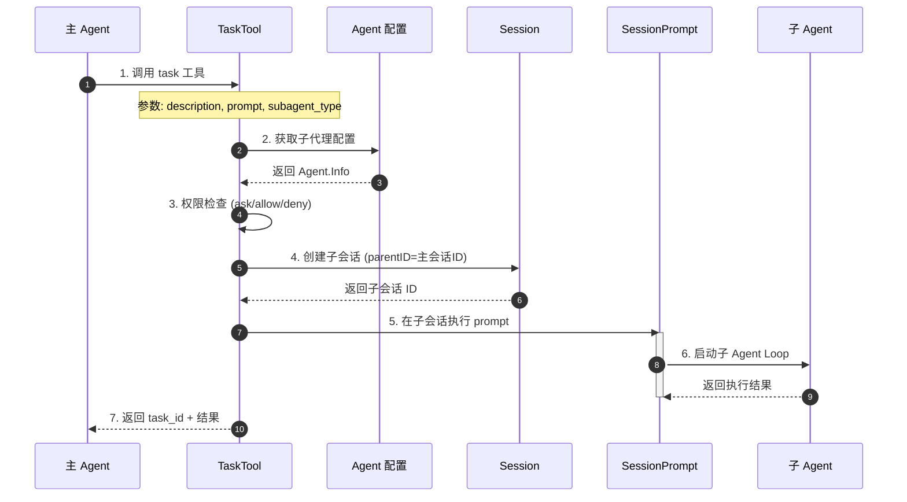
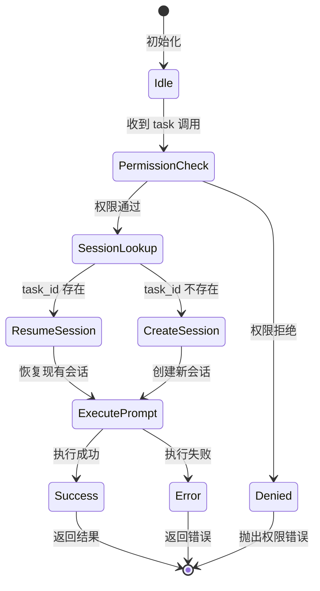
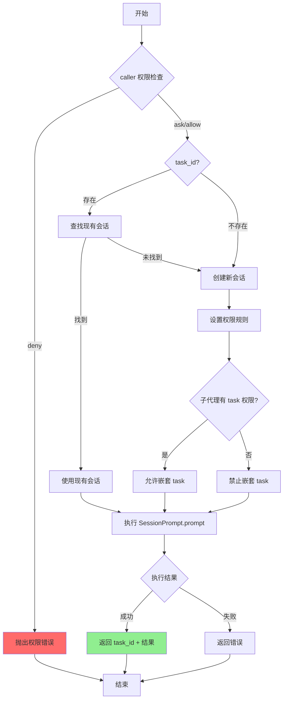
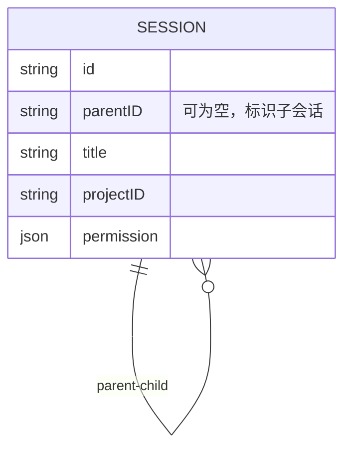
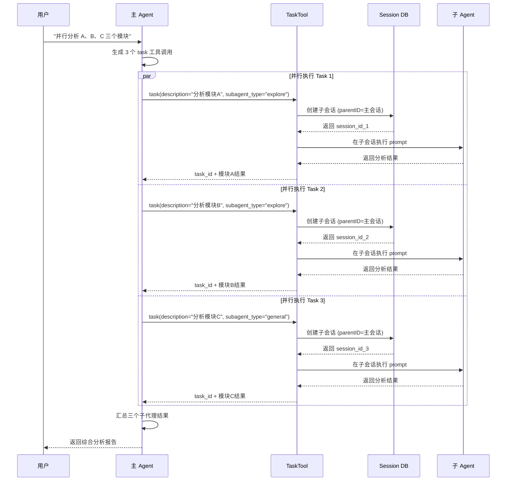
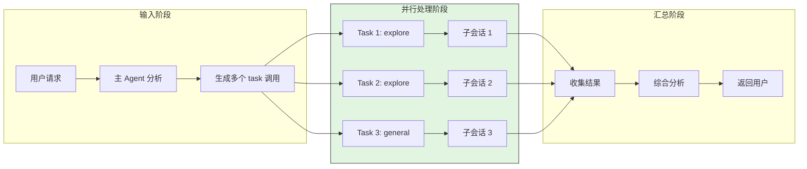
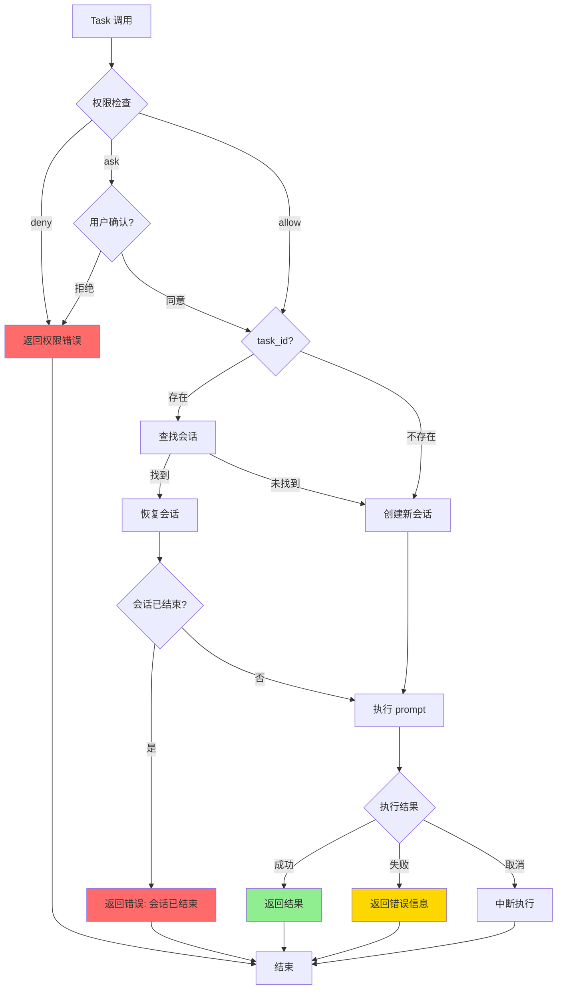

# OpenCode Subagent/Task Implementation

## TL;DR（结论先行）

OpenCode 通过 **`task` 工具** 实现子代理（Subagent）功能，允许主代理动态创建具有独立会话、权限和工具集的子代理来并行处理复杂任务；核心设计取舍是**会话级隔离 + 权限继承控制**（对比 Kimi CLI 的 Checkpoint 回滚、Gemini CLI 的递归 continuation）。

---

## 1. 为什么需要这个机制？（解决什么问题）

### 1.1 问题场景

没有子代理功能时，主代理处理复杂任务面临以下限制：

```
用户: "分析这个大型代码库，找出所有 API 端点并检查安全问题"

无子代理:
  → 主代理单线程顺序执行
  → 搜索文件 → 读文件 → 分析 → 再搜索 → ...（耗时极长）
  → 上下文被中间结果填满，容易丢失关键信息
  → 无法并行探索不同代码路径

有子代理:
  → 主代理同时启动多个 explore 子代理
  → 子代理 A: 搜索路由定义
  → 子代理 B: 搜索控制器实现
  → 子代理 C: 搜索中间件
  → 并行收集结果，主代理统一汇总
```

### 1.2 核心挑战

| 挑战 | 不解决的后果 |
|-----|-------------|
| 任务并行化 | 复杂任务只能顺序执行，效率低下 |
| 上下文隔离 | 子任务中间结果污染主会话上下文 |
| 权限控制 | 子代理可能越权执行危险操作 |
| 结果汇总 | 多子代理结果难以统一整合 |

---

## 2. 整体架构（ASCII 图）

### 2.1 在系统中的位置

```text
┌─────────────────────────────────────────────────────────────┐
│ 主 Agent Loop / Session Prompt                               │
│ packages/opencode/src/session/prompt.ts                      │
└───────────────────────┬─────────────────────────────────────┘
                        │ 调用 Task 工具
                        ▼
┌─────────────────────────────────────────────────────────────┐
│ ▓▓▓ Task Tool (task.ts) ▓▓▓                                 │
│ packages/opencode/src/tool/task.ts                           │
│ - execute(): 创建子代理会话                                  │
│ - 权限过滤: 基于 caller 权限筛选可用 agents                   │
│ - 会话创建: 带 parentID 关联父会话                           │
└───────────────────────┬─────────────────────────────────────┘
                        │ 创建/恢复子会话
                        ▼
┌───────────────────────┬─────────────────────────────────────┐
│ 子 Agent Session      │ 子 Agent Session      │ ...         │
│ (general subagent)    │ (explore subagent)    │             │
│ 独立消息历史          │ 独立消息历史          │             │
│ 受限工具集            │ 只读工具集            │             │
└───────────────────────┴───────────────────────┴─────────────┘
```

### 2.2 核心组件职责

| 组件 | 职责 | 代码位置 |
|-----|------|---------|
| `TaskTool` | 定义 task 工具的参数和执行逻辑 | `packages/opencode/src/tool/task.ts:27-165` |
| `Agent.list()` | 返回可用子代理列表（过滤 primary） | `packages/opencode/src/agent/agent.ts:257-264` |
| `Session.create()` | 创建带 parentID 的子会话 | `packages/opencode/src/session/index.ts:212-228` |
| `SessionPrompt.prompt()` | 在子会话中执行提示 | `packages/opencode/src/session/prompt.ts` |
| `PermissionNext.evaluate()` | 评估子代理调用权限 | `packages/opencode/src/permission/next.ts` |

### 2.3 核心组件交互关系



**关键交互说明**：

| 步骤 | 交互内容 | 设计意图 |
|-----|---------|---------|
| 1 | 主 Agent 通过 tool call 触发 | 与标准工具统一接口 |
| 3 | 运行时权限评估 | 细粒度控制不同子代理的调用权限 |
| 4 | parentID 关联父子会话 | 建立会话层级关系，支持级联删除 |
| 5 | 独立 SessionPrompt 执行 | 子代理拥有完整但隔离的执行环境 |
| 7 | 返回 task_id 支持恢复 | 可重新连接之前的子会话 |

---

## 3. 核心组件详细分析

### 3.1 TaskTool 内部结构

#### 职责定位

TaskTool 是连接主代理和子代理的桥梁，负责：子代理发现、权限校验、会话生命周期管理、结果传递。

#### 状态机图



#### 内部数据流

```text
┌─────────────────────────────────────────────────────────────┐
│  输入层                                                      │
│  ├── description: 任务描述 (3-5 词)                          │
│  ├── prompt: 具体任务内容                                    │
│  ├── subagent_type: 子代理类型                               │
│  └── task_id?: 可选，用于恢复会话                            │
└──────────────────────────┬──────────────────────────────────┘
                           ▼
┌─────────────────────────────────────────────────────────────┐
│  权限层                                                      │
│  ├── 检查 caller 是否有 task 权限                            │
│  ├── 评估 subagent_type 是否被允许                           │
│  └── 支持 wildcard: * 匹配所有                               │
└──────────────────────────┬──────────────────────────────────┘
                           ▼
┌─────────────────────────────────────────────────────────────┐
│  会话层                                                      │
│  ├── 有 task_id: 查找现有会话                                │
│  ├── 无 task_id: 创建新会话 (parentID=caller session)        │
│  └── 设置权限: 继承 caller 权限 + 子代理特定限制             │
└──────────────────────────┬──────────────────────────────────┘
                           ▼
┌─────────────────────────────────────────────────────────────┐
│  执行层                                                      │
│  ├── SessionPrompt.prompt() 在子会话执行                     │
│  ├── 监听 abort 信号支持取消                                 │
│  └── 收集文本结果                                            │
└──────────────────────────┬──────────────────────────────────┘
                           ▼
┌─────────────────────────────────────────────────────────────┐
│  输出层                                                      │
│  ├── task_id: 会话 ID (用于后续恢复)                         │
│  ├── <task_result>: 执行结果文本                             │
│  └── metadata: 会话和模型信息                                │
└─────────────────────────────────────────────────────────────┘
```

#### 关键算法逻辑



**算法要点**：

1. **权限继承逻辑**：子代理默认禁止 `todowrite`/`todoread`，若子代理本身无 `task` 权限则禁止嵌套 task
2. **会话恢复机制**：通过 `task_id` 可重新连接之前的子会话，保持上下文连续性
3. **取消传播**：主会话的 abort 信号会传播到子会话，支持级联取消

#### 关键接口

| 接口 | 输入 | 输出 | 说明 | 代码位置 |
|-----|------|------|------|---------|
| `execute()` | task 参数 + context | 执行结果 | 核心执行方法 | `task.ts:45-163` |
| `Agent.list()` | - | Agent[] | 获取可用子代理 | `agent.ts:257` |
| `Session.create()` | parentID, title, permission | Session | 创建子会话 | `session/index.ts:212` |
| `SessionPrompt.prompt()` | sessionID, model, parts | 消息结果 | 子会话执行 | `prompt.ts` |

---

### 3.2 Agent 配置系统

#### 职责定位

定义子代理的类型、权限、模型和行为特征。

#### 内置子代理类型

```typescript
// packages/opencode/src/agent/agent.ts:76-203
const result: Record<string, Info> = {
  build: {
    name: "build",
    mode: "primary",      // 主代理，可被用户直接调用
    permission: /* 全功能权限 */,
  },
  general: {
    name: "general",
    mode: "subagent",     // 子代理，只能通过 task 工具调用
    description: "General-purpose agent for researching complex questions...",
    permission: /* 禁止 todo 工具 */,
  },
  explore: {
    name: "explore",
    mode: "subagent",
    description: "Fast agent specialized for exploring codebases",
    permission: /* 只读工具权限 */,
  },
  // ... compaction, title, summary 等隐藏代理
}
```

#### Agent 模式定义

| 模式 | 说明 | 使用场景 |
|-----|------|---------|
| `primary` | 主代理，用户可直接交互 | build, plan |
| `subagent` | 子代理，只能通过 task 调用 | general, explore |
| `all` | 既可主交互也可被 task 调用 | 自定义代理 |

---

### 3.3 会话层级关系

#### 父子会话关联



#### 级联删除

```typescript
// packages/opencode/src/session/index.ts:648-668
export const remove = fn(Identifier.schema("session"), async (sessionID) => {
  const session = await get(sessionID)
  // 递归删除所有子会话
  for (const child of await children(sessionID)) {
    await remove(child.id)
  }
  // 删除当前会话
  Database.use((db) => {
    db.delete(SessionTable).where(eq(SessionTable.id, sessionID)).run()
  })
})
```

---

## 4. 端到端数据流转

### 4.1 正常流程（详细版）



**数据变换详情**：

| 阶段 | 输入 | 处理 | 输出 | 代码位置 |
|-----|------|------|------|---------|
| 接收 | task 工具参数 | 验证参数合法性 | 结构化参数 | `task.ts:45` |
| 权限 | subagent_type + caller 权限 | PermissionNext.evaluate | allow/ask/deny | `task.ts:31-34` |
| 会话 | parentID + title + permission | Session.create | 子会话 Info | `task.ts:66-102` |
| 执行 | prompt + model + tools | SessionPrompt.prompt | 消息 parts | `task.ts:128-143` |
| 输出 | 子代理返回 parts | 提取最后文本 | task_id + 结果 | `task.ts:145-162` |

### 4.2 数据流向图



### 4.3 异常/边界流程



---

## 5. 关键代码实现

### 5.1 核心数据结构

```typescript
// packages/opencode/src/tool/task.ts:14-25
const parameters = z.object({
  description: z.string().describe("A short (3-5 words) description of the task"),
  prompt: z.string().describe("The task for the agent to perform"),
  subagent_type: z.string().describe("The type of specialized agent to use"),
  task_id: z.string().optional().describe(
    "Resume a previous task (continues the same subagent session)"
  ),
  command: z.string().optional(),
})
```

**字段说明**：

| 字段 | 类型 | 用途 |
|-----|------|------|
| `description` | string | 任务简短描述，用于 UI 展示 |
| `prompt` | string | 发送给子代理的具体指令 |
| `subagent_type` | string | 子代理类型，如 "general", "explore" |
| `task_id` | string? | 可选，用于恢复之前的子会话 |
| `command` | string? | 触发此 task 的命令 |

### 5.2 主链路代码

```typescript
// packages/opencode/src/tool/task.ts:45-102
async execute(params, ctx) {
  // 1. 权限检查
  if (!ctx.extra?.bypassAgentCheck) {
    await ctx.ask({
      permission: "task",
      patterns: [params.subagent_type],
      always: ["*"],
    })
  }

  // 2. 获取子代理配置
  const agent = await Agent.get(params.subagent_type)
  if (!agent) throw new Error(`Unknown agent type: ${params.subagent_type}`)

  // 3. 创建或恢复会话
  const session = await iife(async () => {
    if (params.task_id) {
      const found = await Session.get(params.task_id).catch(() => {})
      if (found) return found
    }
    return await Session.create({
      parentID: ctx.sessionID,  // 关键：建立父子关系
      title: params.description + ` (@${agent.name} subagent)`,
      permission: [
        { permission: "todowrite", pattern: "*", action: "deny" },
        { permission: "todoread", pattern: "*", action: "deny" },
        // 禁止嵌套 task（除非子代理有 task 权限）
        ...(hasTaskPermission ? [] : [{ permission: "task", pattern: "*", action: "deny" }]),
      ],
    })
  })

  // 4. 在子会话执行
  const result = await SessionPrompt.prompt({
    sessionID: session.id,
    model: { modelID, providerID },
    agent: agent.name,
    tools: { todowrite: false, todoread: false, ...(hasTaskPermission ? {} : { task: false }) },
    parts: promptParts,
  })

  // 5. 返回结果
  return {
    output: `task_id: ${session.id}\n\n<task_result>${text}</task_result>`,
    metadata: { sessionId: session.id, model },
  }
}
```

**代码要点**：

1. **父子会话关联**：通过 `parentID: ctx.sessionID` 建立层级，支持级联删除
2. **权限继承控制**：子代理默认禁止 todo 工具，可选禁止嵌套 task
3. **会话恢复机制**：通过 `task_id` 参数可重新连接之前的子会话

### 5.3 关键调用链

```text
SessionPrompt.loop()           [prompt.ts:350]
  -> 处理 tool call
    -> taskTool.execute()      [task.ts:45]
      -> Agent.get()           [agent.ts:253]
      -> Session.create()      [session/index.ts:212]
        - 设置 parentID
        - 设置权限规则
      -> SessionPrompt.prompt() [prompt.ts:1200+]
        - 在子会话执行完整 Agent Loop
      - 收集并返回结果
```

---

## 6. 设计意图与 Trade-off

### 6.1 OpenCode 的选择

| 维度 | OpenCode 的选择 | 替代方案 | 取舍分析 |
|-----|----------------|---------|---------|
| 子代理模型 | 会话级隔离（独立 Session） | 线程级隔离（Codex）/ 递归 continuation（Gemini） | 完全隔离确保安全性，但内存占用较高 |
| 权限控制 | 运行时 PermissionNext.evaluate | 静态配置 / 无权限控制 | 支持动态 wildcard 匹配，但运行时开销 |
| 嵌套层级 | 可选禁止（默认禁止无 task 权限的子代理） | 完全禁止 / 无限制 | 防止无限递归，但需显式配置 |
| 并发执行 | 依赖 LLM 的并行 tool calls | 显式线程池（Kimi） | 实现简单，但并发度受 LLM 限制 |
| 结果传递 | 文本结果返回 | 共享内存 / 消息队列 | 简单可靠，但大数据量需截断 |

### 6.2 为什么这样设计？

**核心问题**：如何在保证安全性的前提下，让主代理灵活地委派任务给子代理？

**OpenCode 的解决方案**：

- 代码依据：`packages/opencode/src/tool/task.ts:66-102`
- 设计意图：通过数据库级会话隔离 + 权限继承，实现"沙盒子代理"
- 带来的好处：
  - 子代理崩溃不影响主代理
  - 子代理权限可被严格限制（如 explore 只有只读权限）
  - 父子关系清晰，支持级联操作
- 付出的代价：
  - 每个子代理需要独立的数据库会话
  - 结果传递通过文本，大数据量需截断处理

### 6.3 与其他项目的对比


| 项目 | 核心差异 | 适用场景 |
|-----|---------|---------|
| OpenCode | Task 工具创建独立 Session，权限可配置 | 需要细粒度权限控制的多代理协作 |
| Kimi CLI | Checkpoint 回滚机制，D-Mail 状态传递 | 需要状态回滚的复杂任务 |
| Gemini CLI | 递归 continuation，单层架构 | 状态管理简单，偏好函数式风格 |
| Codex | Rust 沙箱 + TypeScript Agent | 企业级安全要求 |

---

## 7. 边界情况与错误处理

### 7.1 终止条件

| 终止原因 | 触发条件 | 代码位置 |
|---------|---------|---------|
| 子代理完成 | 子会话 LLM 返回无 tool calls | `prompt.ts` Agent Loop 结束条件 |
| 权限拒绝 | PermissionNext.evaluate 返回 deny | `task.ts:50-58` |
| 会话未找到 | task_id 指定但会话不存在 | `task.ts:67-70` |
| 取消信号 | 主会话收到 abort 信号 | `task.ts:121-125` |
| 执行错误 | SessionPrompt.prompt 抛出异常 | `task.ts:443-447` |

### 7.2 超时/资源限制

```typescript
// packages/opencode/src/agent/agent.ts:44
steps: z.number().int().positive().optional(),  // 子代理最大步数

// 子代理默认继承主代理的 steps 限制
// 可在配置中为特定子代理设置 steps
```

### 7.3 错误恢复策略

| 错误类型 | 处理策略 | 代码位置 |
|---------|---------|---------|
| 权限拒绝 | 抛出 PermissionNext.RejectedError | `task.ts:50-58` |
| 未知代理 | 抛出 Error: "Unknown agent type" | `task.ts:61-62` |
| 执行失败 | 返回 undefined，记录 error log | `task.ts:443-447` |
| 会话创建失败 | 抛出异常，由上层处理 | `session/index.ts:212` |

---

## 8. 关键代码索引

| 功能 | 文件 | 行号 | 说明 |
|-----|------|------|------|
| Task 工具定义 | `packages/opencode/src/tool/task.ts` | 27-165 | 核心子代理实现 |
| Task 工具提示词 | `packages/opencode/src/tool/task.txt` | 1-61 | LLM 使用的 task 工具说明 |
| Agent 配置 | `packages/opencode/src/agent/agent.ts` | 23-339 | 子代理类型定义 |
| 会话创建 | `packages/opencode/src/session/index.ts` | 212-228 | 带 parentID 的会话创建 |
| 会话删除 | `packages/opencode/src/session/index.ts` | 648-668 | 级联删除子会话 |
| 权限评估 | `packages/opencode/test/permission-task.test.ts` | 1-320 | task 权限测试用例 |
| Agent 测试 | `packages/opencode/test/agent/agent.test.ts` | 1-690 | 子代理配置测试 |
| 工具注册 | `packages/opencode/src/tool/registry.ts` | 110 | TaskTool 注册位置 |

---

## 9. 延伸阅读

- 前置知识：`docs/opencode/04-opencode-agent-loop.md`
- 相关机制：`docs/opencode/07-opencode-memory-context.md`
- 深度分析：`docs/opencode/questions/opencode-permission-system.md`
- 跨项目对比：`docs/comm/comm-subagent-comparison.md` (如存在)

---

*✅ Verified: 基于 opencode/packages/opencode/src/tool/task.ts:27-165 等源码分析*
*基于版本：2026-02-08 baseline | 最后更新：2026-02-24*
