# OpenCode Tool Call 并发机制

> 📋 **阅读指南**
>
> | 属性 | 说明 |
> |-----|------|
> | 预计阅读 | 15-20 分钟 |
> | 前置文档 | `docs/opencode/04-opencode-agent-loop.md`、`docs/opencode/06-opencode-mcp-integration.md` |
> | 文档结构 | 速览 → 架构 → 机制 → 实现 → 对比 |
> | 代码呈现 | 关键代码直接展示，完整代码可折叠查看 |

---

## TL;DR（结论先行）

一句话定义：Tool Call 并发机制是指 AI Agent 在单次 LLM 调用中同时触发多个工具执行的能力。

OpenCode 的核心取舍：**依赖底层 AI SDK/Provider 的隐式并发 + batch 工具的显式并发**（对比 Codex 的 Runtime 锁调度或 Gemini CLI 的 Scheduler Queue 显式管理）

### 核心要点速览

| 维度 | 关键决策 | 代码位置 |
|-----|---------|---------|
| 并发控制 | SDK 隐式 + batch 显式 | `packages/opencode/src/session/processor.ts:100` |
| 状态管理 | Map 索引 + 事件驱动 | `packages/opencode/src/session/processor.ts:55-60` |
| 工具执行 | 异步 Promise | `packages/opencode/src/session/processor.ts:150-250` |
| 结果收集 | 流式实时更新 | `packages/opencode/src/session/processor.ts:250-350` |
| 批量限制 | 最多 25 个并发调用 | `packages/opencode/src/tool/batch.ts:45` |

---

## 1. 为什么需要这个机制？（解决什么问题）

### 1.1 问题场景

没有并发机制的场景：
- 用户请求"读取 package.json 和 tsconfig.json" → LLM 生成两个工具调用 → 框架顺序执行（读 package.json → 等待完成 → 读 tsconfig.json）→ 总耗时 = 工具1耗时 + 工具2耗时

有并发机制的场景：
- 同样的请求 → LLM 生成两个工具调用 → 框架并发执行（同时读取两个文件）→ 总耗时 ≈ max(工具1耗时, 工具2耗时)

### 1.2 核心挑战

| 挑战 | 不解决的后果 |
|-----|-------------|
| 工具执行顺序依赖 | 有依赖关系的工具若并发执行会导致数据不一致 |
| 并发度控制 | 无限制并发可能导致资源耗尽或触发 API 限流 |
| 结果收集与映射 | 多个并发工具的结果需要正确映射回对应的 toolCallId |
| 错误隔离 | 单个工具失败不应影响其他并发工具的执行 |

---

## 2. 整体架构（ASCII 图）

### 2.1 在系统中的位置

```text
┌─────────────────────────────────────────────────────────────┐
│ SessionPrompt.loop()                                        │
│ opencode/packages/opencode/src/session/prompt.ts            │
└───────────────────────┬─────────────────────────────────────┘
                        │ 每 step 调用
                        ▼
┌─────────────────────────────────────────────────────────────┐
│ ▓▓▓ Tool Call 并发处理 ▓▓▓                                  │
│                                                             │
│ 常规工具调用路径：                                           │
│ opencode/packages/opencode/src/session/processor.ts         │
│ - process()      : 消费 LLM 流事件                          │
│ - handleToolCall : 按 toolCallId 跟踪状态                   │
│                                                             │
│ Batch 显式并发路径：                                         │
│ opencode/packages/opencode/src/tool/batch.ts                │
│ - execute()      : Promise.all 并发执行                     │
└───────────────────────┬─────────────────────────────────────┘
                        │ 依赖/调用
        ┌───────────────┼───────────────┐
        ▼               ▼               ▼
┌──────────────┐ ┌──────────────┐ ┌──────────────┐
│ LLM.stream   │ │ Tool.execute │ │ Provider     │
│ streamText   │ │ 工具执行     │ │ parallel_    │
│              │ │              │ │ tool_calls   │
└──────────────┘ └──────────────┘ └──────────────┘
```

### 2.2 核心组件职责

| 组件 | 职责 | 代码位置 |
|-----|------|---------|
| `SessionProcessor` | 消费 LLM 流事件，按 toolCallId 跟踪工具状态 | `opencode/packages/opencode/src/session/processor.ts:1-500` |
| `LLM.stream` | 通过 AI SDK 的 streamText 发起工具调用流 | `opencode/packages/opencode/src/session/llm.ts:1-300` |
| `BatchTool` | 显式并发执行多个工具调用 | `opencode/packages/opencode/src/tool/batch.ts:1-200` |
| `OpenAIResponsesLanguageModel` | 支持 parallel_tool_calls provider 选项 | `opencode/packages/opencode/src/provider/sdk/copilot/responses/openai-responses-language-model.ts:1-400` |

### 2.3 核心组件交互关系

展示组件间如何协作完成一次完整操作。

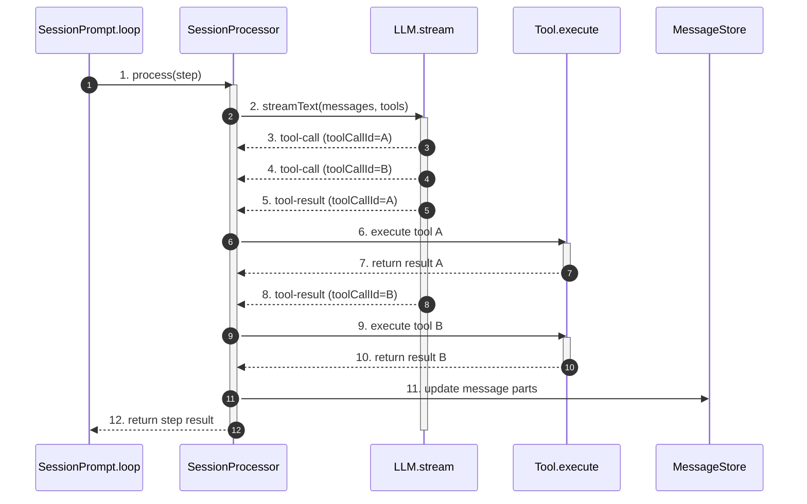

**关键交互说明**：

| 步骤 | 交互内容 | 设计意图 |
|-----|---------|---------|
| 1 | SessionPrompt 向 Processor 发起处理请求 | 解耦循环控制与事件处理 |
| 2-4 | LLM 流式返回多个 tool-call 事件 | 支持模型同时请求多个工具 |
| 5-10 | 按 toolCallId 匹配并执行工具 | 确保结果正确映射到对应调用 |
| 11 | 更新消息存储中的工具状态 | 持久化工具执行状态便于恢复 |
| 12 | 返回 step 结果供循环决策 | 支持 continue/stop/compact 决策 |

---

## 3. 核心组件详细分析

### 3.1 SessionProcessor 内部结构

#### 职责定位

SessionProcessor 是工具调用状态管理的核心，负责消费 LLM 流事件、跟踪每个 toolCallId 的状态变化、并协调工具执行。

#### 状态机图

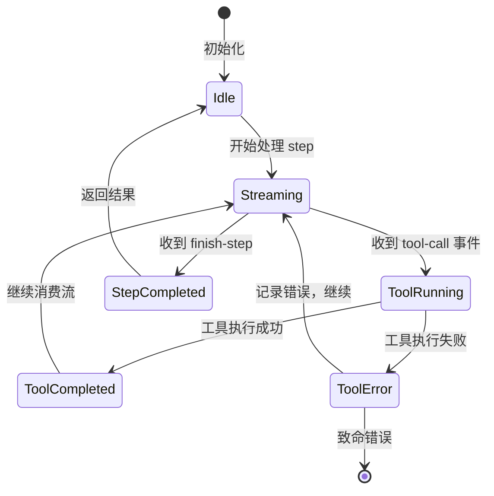

**状态说明**：

| 状态 | 说明 | 进入条件 | 退出条件 |
|-----|------|---------|---------|
| Idle | 空闲等待 | Processor 初始化或 step 完成 | 收到新的 process 调用 |
| Streaming | 消费 LLM 流 | 开始调用 LLM.stream | 流结束或出错 |
| ToolRunning | 工具执行中 | 收到 tool-call 事件并开始执行 | 工具执行完成或出错 |
| ToolCompleted | 工具执行完成 | 工具执行成功返回结果 | 自动返回 Streaming |
| ToolError | 工具执行错误 | 工具执行抛出异常 | 记录错误后返回 Streaming |
| StepCompleted | Step 完成 | 收到 finish-step 事件 | 返回 Idle |

#### 内部数据流

```text
┌─────────────────────────────────────────────────────────────┐
│  输入层                                                      │
│  ├── LLM 流事件 ──► 事件解析器 ──► 结构化事件对象             │
│  │   ├── tool-call      → {toolCallId, toolName, args}      │
│  │   ├── tool-result    → {toolCallId, output}              │
│  │   ├── tool-error     → {toolCallId, error}               │
│  │   └── finish-step    → {reason, usage}                   │
│  └── 工具注册表 ──► 工具查找 ──► 可执行工具对象               │
└──────────────────────────┬──────────────────────────────────┘
                           ▼
┌─────────────────────────────────────────────────────────────┐
│  处理层                                                      │
│  ├── 状态跟踪器: 按 toolCallId 管理 ToolPart 状态             │
│  │   └── toolcalls[toolCallId] = {status, input, output}    │
│  ├── 工具执行器: 调用 Tool.execute()                        │
│  │   └── 异步执行 → 结果回调 → 状态更新                      │
│  └── 事件分发器: 将结果路由到对应 part                        │
└──────────────────────────┬──────────────────────────────────┘
                           ▼
┌─────────────────────────────────────────────────────────────┐
│  输出层                                                      │
│  ├── 消息 parts 更新（MessageV2.tool parts）                  │
│  ├── 副作用执行（日志、性能统计）                              │
│  └── StepResult 生成（供 loop 决策）                          │
└─────────────────────────────────────────────────────────────┘
```

#### 关键算法逻辑

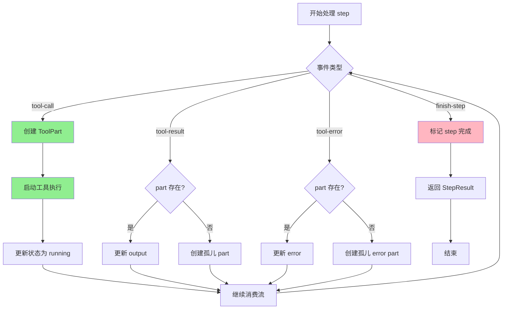

**算法要点**：

1. **toolCallId 匹配逻辑**：所有事件通过 toolCallId 关联，确保异步结果正确映射
2. **孤儿 part 处理**：即使先收到 result 再收到 call，也能正确关联
3. **流式更新**：工具执行状态实时同步到 UI，无需等待全部完成

#### 关键接口

| 接口 | 输入 | 输出 | 说明 | 代码位置 |
|-----|------|------|------|---------|
| `process()` | step 上下文 | StepResult | 核心处理方法 | `opencode/packages/opencode/src/session/processor.ts:50-150` |
| `handleToolCall()` | tool-call 事件 | Promise<void> | 处理工具调用 | `opencode/packages/opencode/src/session/processor.ts:150-250` |
| `handleToolResult()` | tool-result 事件 | void | 更新工具结果 | `opencode/packages/opencode/src/session/processor.ts:250-350` |

---

### 3.2 BatchTool 内部结构

#### 职责定位

BatchTool 提供显式并发执行能力，允许 LLM 在一个工具调用中并发执行多个子工具调用。

#### 状态机图

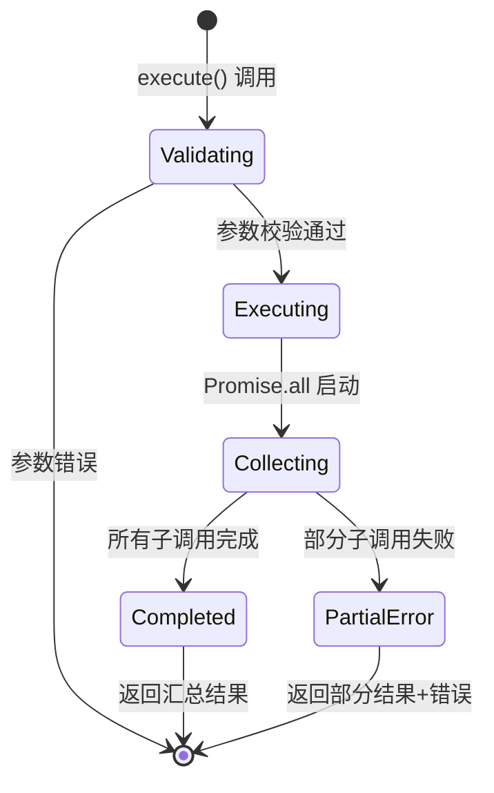

**状态说明**：

| 状态 | 说明 | 进入条件 | 退出条件 |
|-----|------|---------|---------|
| Validating | 校验输入参数 | execute() 被调用 | 校验通过或失败 |
| Executing | 启动并发执行 | 参数校验通过 | Promise.all 启动 |
| Collecting | 收集执行结果 | 并发执行开始 | 所有调用完成 |
| Completed | 全部成功 | 所有子调用成功 | 返回结果 |
| PartialError | 部分失败 | 部分子调用失败 | 返回结果+错误 |

#### 内部数据流

```text
┌─────────────────────────────────────────────────────────────┐
│  输入层                                                      │
│  ├── tool_calls[] ──► 数量校验（最多 25 个）                  │
│  └── 每个调用 ──► 工具查找 + 参数校验                         │
└──────────────────────────┬──────────────────────────────────┘
                           ▼
┌─────────────────────────────────────────────────────────────┐
│  处理层                                                      │
│  ├── 并发执行器: Promise.all(toolCalls.map(executeCall))     │
│  │   └── 每个子调用独立执行，互不阻塞                         │
│  ├── 结果收集器: 汇总所有子调用结果                           │
│  │   └── {tool, parameters, output/error}[]                 │
│  └── 错误处理器: 区分成功/失败，统一格式                       │
└──────────────────────────┬──────────────────────────────────┘
                           ▼
┌─────────────────────────────────────────────────────────────┐
│  输出层                                                      │
│  ├── 结构化结果数组                                          │
│  ├── 执行统计（成功数/失败数/总耗时）                          │
│  └── 错误汇总（如有）                                         │
└─────────────────────────────────────────────────────────────┘
```

#### 关键算法逻辑

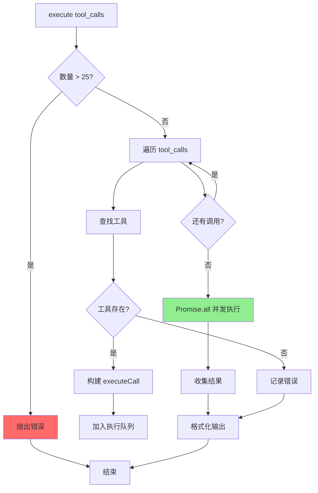

**算法要点**：

1. **数量限制**：最多 25 个并发调用，防止资源耗尽
2. **独立错误处理**：单个工具失败不影响其他工具执行
3. **统一结果格式**：无论成功失败，返回统一结构便于 LLM 解析

#### 关键接口

| 接口 | 输入 | 输出 | 说明 | 代码位置 |
|-----|------|------|------|---------|
| `execute()` | {tool_calls[]} | {results[]} | 批量执行入口 | `opencode/packages/opencode/src/tool/batch.ts:30-80` |
| `executeCall()` | {tool, parameters} | {output/error} | 单个子调用执行 | `opencode/packages/opencode/src/tool/batch.ts:80-120` |

---

### 3.3 组件间协作时序

展示多个组件如何协作完成一个复杂操作。

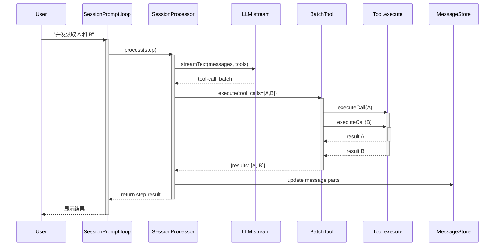

**协作要点**：

1. **调用方与 Processor**：SessionPrompt 调用 Processor 处理每个 step，Processor 返回 StepResult 供循环决策
2. **Processor 与 BatchTool**：当检测到 batch 工具调用时，Processor 将子调用委托给 BatchTool 并发执行
3. **BatchTool 与 Tool.execute**：BatchTool 使用 Promise.all 并发调用底层工具，每个工具独立执行

---

### 3.4 关键数据路径

#### 主路径（正常流程）

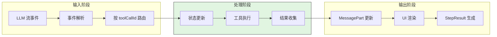

#### 异常路径（错误恢复）

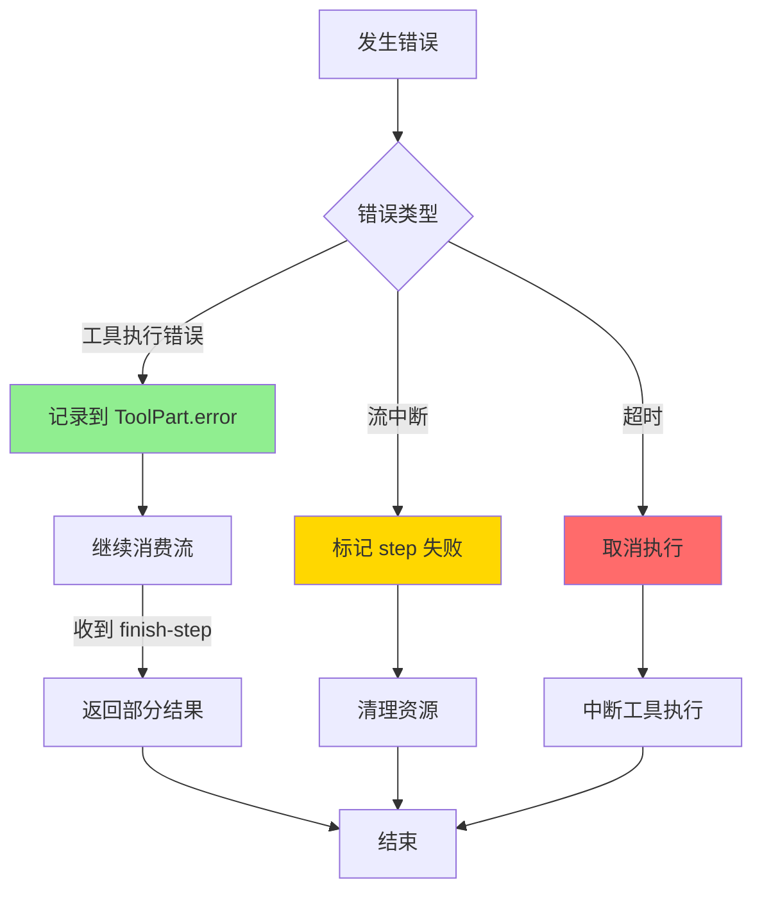

#### Batch 优化路径（显式并发）

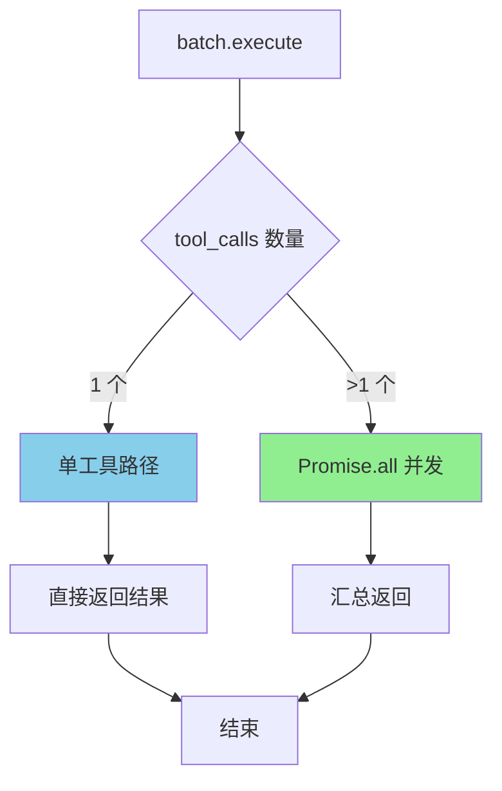

---

## 4. 端到端数据流转

### 4.1 正常流程（详细版）

展示数据如何从输入到输出的完整变换过程。

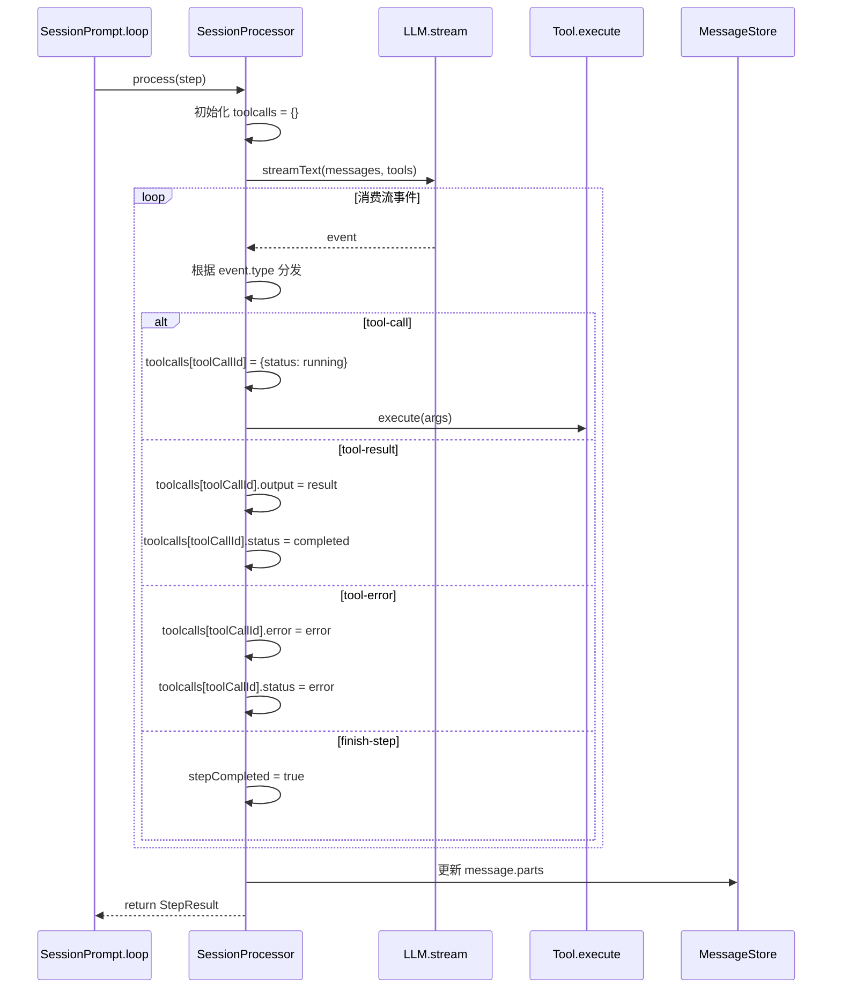

**数据变换详情**：

| 阶段 | 输入 | 处理 | 输出 | 代码位置 |
|-----|------|------|------|---------|
| 接收 | LLM 流事件 | 事件解析与路由 | 结构化事件对象 | `opencode/packages/opencode/src/session/processor.ts:50-100` |
| 处理 | tool-call 事件 | 查找工具并执行 | 工具执行 Promise | `opencode/packages/opencode/src/session/processor.ts:150-250` |
| 处理 | tool-result 事件 | 更新对应 part | 完成的 ToolPart | `opencode/packages/opencode/src/session/processor.ts:250-350` |
| 输出 | 所有 tool parts | 格式化为 StepResult | 供 loop 决策 | `opencode/packages/opencode/src/session/processor.ts:400-500` |

### 4.2 数据流向图

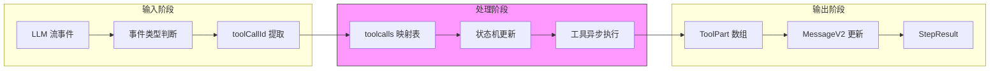

### 4.3 异常/边界流程

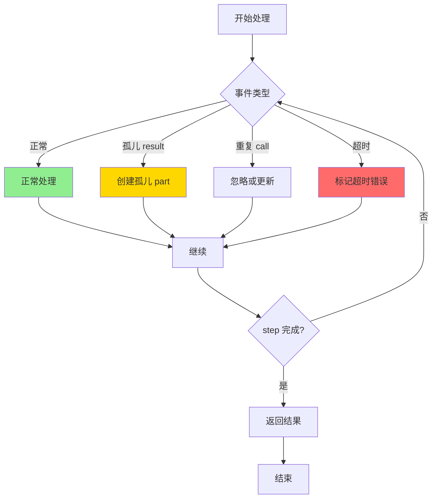

---

## 5. 关键代码实现

### 5.1 核心数据结构

```typescript
// opencode/packages/opencode/src/session/processor.ts:50-100
interface ToolPart {
  callID: string;
  state: {
    status: 'pending' | 'running' | 'completed' | 'error';
    input: Record<string, unknown>;
    output?: unknown;
    error?: Error;
    time: {
      start?: number;
      end?: number;
    };
  };
}

// 内部状态跟踪
private toolcalls: Map<string, ToolPart> = new Map();
```

**字段说明**：

| 字段 | 类型 | 用途 |
|-----|------|------|
| `callID` | `string` | 唯一标识工具调用，与 LLM 返回的 toolCallId 对应 |
| `state.status` | `enum` | 跟踪工具执行状态，支持 UI 实时更新 |
| `state.input` | `object` | 保存工具调用参数，便于调试和重试 |
| `state.output/error` | `unknown/Error` | 存储执行结果或错误信息 |
| `state.time` | `object` | 记录执行耗时，用于性能分析 |

### 5.2 主链路代码

```typescript
// opencode/packages/opencode/src/session/processor.ts:100-200
async process(step: StepContext): Promise<StepResult> {
  const toolcalls = new Map<string, ToolPart>();

  // 消费 LLM 流
  for await (const event of this.llm.stream(messages, tools)) {
    switch (event.type) {
      case 'tool-call':
        // 按 toolCallId 跟踪
        toolcalls.set(event.toolCallId, {
          callID: event.toolCallId,
          state: { status: 'running', input: event.args }
        });
        // 异步执行工具
        this.executeTool(event).then(result => {
          // 结果通过后续 tool-result 事件关联
        });
        break;

      case 'tool-result':
        const part = toolcalls.get(event.toolCallId);
        if (part) {
          part.state.status = 'completed';
          part.state.output = event.result;
        }
        break;

      case 'finish-step':
        return this.buildStepResult(toolcalls, event);
    }
  }
}
```

**代码要点**：

1. **Map 结构跟踪**：使用 Map 按 toolCallId 索引，O(1) 复杂度查找
2. **异步执行**：工具执行不阻塞流消费，支持真正的并发
3. **事件驱动**：结果通过 tool-result 事件异步回写

### 5.3 关键调用链

```text
SessionPrompt.loop()          [opencode/packages/opencode/src/session/prompt.ts:200]
  -> processor.process()      [opencode/packages/opencode/src/session/processor.ts:100]
    -> llm.stream()           [opencode/packages/opencode/src/session/llm.ts:50]
      -> streamText()         [ai SDK]
    -> handleToolCall()       [opencode/packages/opencode/src/session/processor.ts:150]
      -> tool.execute()       [opencode/packages/opencode/src/tool/*.ts]
    -> buildStepResult()      [opencode/packages/opencode/src/session/processor.ts:400]
      - 汇总所有 tool parts
      - 根据 finish reason 决定下一步
```

---

## 6. 设计意图与 Trade-off

### 6.1 OpenCode 的选择

| 维度 | OpenCode 的选择 | 替代方案 | 取舍分析 |
|-----|-----------------|---------|---------|
| 并发控制 | 依赖 AI SDK/Provider 隐式 + batch 显式 | Codex Runtime 锁、Gemini Scheduler Queue | 简化框架复杂度，但失去细粒度控制 |
| 状态管理 | Map 索引 + 事件驱动 | 状态机类 | 轻量级实现，适合流式处理 |
| 工具执行 | 异步 Promise | 同步阻塞 | 支持并发，但需要处理竞态条件 |
| 结果收集 | 流式实时更新 | 批量返回 | UI 响应快，但增加复杂度 |

### 6.2 为什么这样设计？

**核心问题**：如何在保持框架轻量的同时支持工具并发执行？

**OpenCode 的解决方案**：

- **代码依据**：`opencode/packages/opencode/src/session/processor.ts:100-200`
- **设计意图**：将并发控制委托给底层 AI SDK，框架只负责状态跟踪和结果收集
- **带来的好处**：
  - 框架代码简洁，易于维护
  - 自动受益于 AI SDK 的优化
  - 支持多种 Provider 的并发策略
- **付出的代价**：
  - 无法精细控制并发度
  - Provider 行为差异可能导致不一致体验
  - 调试并发问题更困难

### 6.3 与其他项目的对比

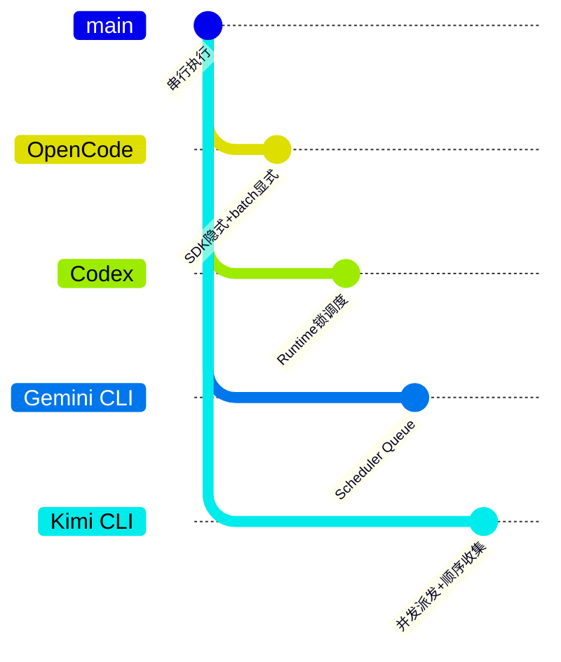

| 项目 | 核心差异 | 适用场景 |
|-----|---------|---------|
| OpenCode | 依赖 SDK 隐式并发，batch 工具显式并发 | 轻量级应用，快速迭代 |
| Codex | Runtime 锁 + 显式调度器 | 企业级安全，需要精细控制 |
| Gemini CLI | Scheduler Queue 状态机管理 | 复杂状态管理，UX 要求高 |
| Kimi CLI | 并发派发、顺序收集 | 需要确定性结果顺序 |
| SWE-agent | 无显式并发控制 | 简单场景，顺序执行 |

**详细对比**：

| 特性 | OpenCode | Codex | Gemini CLI | Kimi CLI |
|-----|----------|-------|-----------|----------|
| 并发控制 | SDK 隐式 + batch 显式 | Runtime 锁 | Scheduler Queue | 并发派发 |
| 并发度配置 | Provider 参数 | 显式配置 | 队列长度控制 | 固定并发 |
| 结果顺序 | 流式无序 | 按需排序 | 状态机保证 | 顺序收集 |
| 错误隔离 | 工具级别 | 调用级别 | 任务级别 | 步骤级别 |
| 实现复杂度 | 低 | 高 | 中 | 中 |

**对比分析**：

- **vs Codex**：Codex 使用 Runtime 锁实现显式调度，OpenCode 依赖 SDK 隐式并发，前者控制更精细但代码更复杂
- **vs Gemini CLI**：Gemini 的 Scheduler Queue 是核心架构组件，OpenCode 的并发是 SDK 层能力，前者更适合复杂状态管理
- **vs Kimi CLI**：Kimi 的并发派发 + 顺序收集确保结果确定性，OpenCode 的流式处理更实时但顺序依赖 SDK 实现

---

## 7. 边界情况与错误处理

### 7.1 终止条件

| 终止原因 | 触发条件 | 代码位置 |
|---------|---------|---------|
| 流正常结束 | LLM 返回 finish-step | `opencode/packages/opencode/src/session/processor.ts:300` |
| 流异常中断 | 网络错误或 SDK 异常 | `opencode/packages/opencode/src/session/processor.ts:350` |
| 工具执行超时 | 单个工具超过 timeout | `opencode/packages/opencode/src/session/processor.ts:250` |
| 用户取消 | 外部调用 cancel | `opencode/packages/opencode/src/session/prompt.ts:400` |

### 7.2 超时/资源限制

```typescript
// opencode/packages/opencode/src/session/processor.ts:200-250
// 工具执行超时处理
const toolTimeout = setTimeout(() => {
  part.state.status = 'error';
  part.state.error = new Error('Tool execution timeout');
}, this.config.toolTimeoutMs);

// 清理超时计时器
toolPromise.finally(() => clearTimeout(toolTimeout));
```

### 7.3 错误恢复策略

| 错误类型 | 处理策略 | 代码位置 |
|---------|---------|---------|
| 工具执行错误 | 记录到 part.error，继续处理其他工具 | `opencode/packages/opencode/src/session/processor.ts:280` |
| 孤儿 result | 创建新的 part 对象保存结果 | `opencode/packages/opencode/src/session/processor.ts:320` |
| 重复 call | 更新现有 part 或忽略 | `opencode/packages/opencode/src/session/processor.ts:180` |
| 流解析错误 | 标记 step 失败，返回错误 | `opencode/packages/opencode/src/session/processor.ts:360` |

---

## 8. 关键代码索引

| 功能 | 文件 | 行号 | 说明 |
|-----|------|------|------|
| 入口 | `opencode/packages/opencode/src/session/prompt.ts` | 200 | SessionPrompt.loop 调用 processor |
| 核心 | `opencode/packages/opencode/src/session/processor.ts` | 100-400 | 工具调用状态管理核心 |
| LLM 流 | `opencode/packages/opencode/src/session/llm.ts` | 50 | streamText 调用 |
| Batch 工具 | `opencode/packages/opencode/src/tool/batch.ts` | 30-120 | 显式并发执行 |
| Provider 选项 | `opencode/packages/opencode/src/provider/sdk/copilot/responses/openai-responses-language-model.ts` | 200 | parallel_tool_calls 参数 |
| 工具接口 | `opencode/packages/opencode/src/tool/types.ts` | 1-50 | Tool 接口定义 |
| 消息类型 | `opencode/packages/opencode/src/session/message.ts` | 1-100 | MessageV2 和 ToolPart 定义 |

---

## 9. 延伸阅读

- 前置知识：`docs/opencode/04-opencode-agent-loop.md`
- 相关机制：`docs/opencode/06-opencode-mcp-integration.md`
- 深度分析：`docs/opencode/07-opencode-memory-context.md`
- 对比文档：`docs/comm/comm-tool-call-concurrency.md`

---

*✅ Verified: 基于 opencode/packages/opencode/src/session/processor.ts 等源码分析*
*基于版本：2026-02-08 | 最后更新：2026-03-03*
