# OpenCode 工具调用错误处理机制

> 📋 **阅读指南**
>
> | 属性 | 说明 |
> |-----|------|
> | 预计阅读 | 20-25 分钟 |
> | 前置文档 | `docs/opencode/04-opencode-agent-loop.md`、`docs/opencode/06-opencode-mcp-integration.md` |
> | 文档结构 | 速览 → 架构 → 机制 → 实现 → 对比 |
> | 代码呈现 | 关键代码直接展示，完整代码可折叠查看 |

---

## TL;DR（结论先行）

一句话定义：OpenCode 的工具错误处理机制是一套**多层级、Provider 感知的错误解析与恢复系统**，涵盖 API 错误、上下文溢出、权限拒绝、重复调用检测等多种场景。

OpenCode 的核心取舍：**Provider-specific 错误解析 + Doom loop 检测 + resetTimeoutOnProgress**（对比 Codex 的 CancellationToken 取消机制、Kimi CLI 的 Checkpoint 回滚方案）

### 核心要点速览

| 维度 | 关键决策 | 代码位置 |
|-----|---------|---------|
| 错误解析 | Provider-specific 正则匹配 | `opencode/packages/opencode/src/provider/error.ts:14-27` |
| 溢出检测 | OVERFLOW_PATTERNS 12+ 模式 | `opencode/packages/opencode/src/provider/error.ts:16-27` |
| 重试策略 | Retry-After 三种格式 + 指数退避 | `opencode/packages/opencode/src/session/retry.ts:110-139` |
| 循环检测 | Doom Loop（最近 3 次调用） | `opencode/packages/opencode/src/session/processor.ts:151-176` |
| 权限控制 | 规则引擎 + 用户确认 | `opencode/packages/opencode/src/permission/next.ts:226-291` |

---

## 1. 为什么需要这个机制？（解决什么问题）

### 1.1 问题场景

没有统一错误处理：不同 Provider 返回的错误格式各异，Agent 无法统一识别和处理
- OpenAI 返回 `context_length_exceeded`
- Anthropic 返回 `prompt is too long`
- Google 返回 `input token count exceeds the maximum`

没有 Doom loop 检测：LLM 可能陷入重复调用相同工具的无效循环，浪费 token 和时间

没有进度感知超时：长时间运行的任务（如编译、下载）可能被误杀

### 1.2 核心挑战

| 挑战 | 不解决的后果 |
|-----|-------------|
| 多 Provider 错误格式不统一 | 无法统一处理上下文溢出，导致重复尝试或错误提示 |
| LLM 陷入无效循环 | 浪费大量 token，用户体验差 |
| 长时间任务被中断 | 编译、大数据处理等任务无法正常完成 |
| 权限控制粒度不足 | 敏感操作（如读取 .env）缺乏有效管控 |

---

## 2. 整体架构（ASCII 图）

### 2.1 在系统中的位置

```text
┌─────────────────────────────────────────────────────────────┐
│ Session Processor / Agent Loop                               │
│ opencode/packages/opencode/src/session/processor.ts          │
└───────────────────────┬─────────────────────────────────────┘
                        │ 调用
                        ▼
┌─────────────────────────────────────────────────────────────┐
│ ▓▓▓ 工具调用错误处理机制 ▓▓▓                                 │
│                                                              │
│ ┌─────────────────────────────────────────────────────────┐ │
│ │ Provider Error Parser                                   │ │
│ │ opencode/packages/opencode/src/provider/error.ts        │ │
│ │ - parseAPICallError(): 统一错误解析                     │ │
│ │ - OVERFLOW_PATTERNS: 12+ Provider 溢出检测              │ │
│ └─────────────────────────┬───────────────────────────────┘ │
│                           │                                 │
│ ┌─────────────────────────▼───────────────────────────────┐ │
│ │ Session Retry                                           │ │
│ │ opencode/packages/opencode/src/session/retry.ts         │ │
│ │ - delay(): 支持 Retry-After 三种格式                    │ │
│ │ - retryable(): 可重试判定                               │ │
│ └─────────────────────────┬───────────────────────────────┘ │
│                           │                                 │
│ ┌─────────────────────────▼───────────────────────────────┐ │
│ │ PermissionNext 规则引擎                                  │ │
│ │ opencode/packages/opencode/src/permission/next.ts       │ │
│ │ - ask(): 权限审批流程                                   │ │
│ │ - doom_loop: 重复调用检测                               │ │
│ └─────────────────────────────────────────────────────────┘ │
└───────────────────────┬─────────────────────────────────────┘
                        │ 依赖/调用
        ┌───────────────┼───────────────┐
        ▼               ▼               ▼
┌──────────────┐ ┌──────────────┐ ┌──────────────┐
│ LLM Provider │ │ MCP Server   │ │ User UI      │
│ 错误响应     │ │ 工具执行     │ │ 权限确认     │
└──────────────┘ └──────────────┘ └──────────────┘
```

### 2.2 核心组件职责

| 组件 | 职责 | 代码位置 |
|-----|------|---------|
| `ProviderError` | 多 Provider 错误统一解析，上下文溢出检测 | `opencode/packages/opencode/src/provider/error.ts:14-48` |
| `SessionRetry` | 重试延迟计算，支持 Retry-After 三种格式 | `opencode/packages/opencode/src/session/retry.ts:86-139` |
| `PermissionNext` | 规则引擎，权限审批流程 | `opencode/packages/opencode/src/permission/next.ts:191-291` |
| `SessionProcessor` | Doom loop 检测，工具调用处理 | `opencode/packages/opencode/src/session/processor.ts:20-176` |
| `MCP` | 工具执行，resetTimeoutOnProgress | `opencode/packages/opencode/src/mcp/index.ts:119-148` |

### 2.3 核心组件交互关系

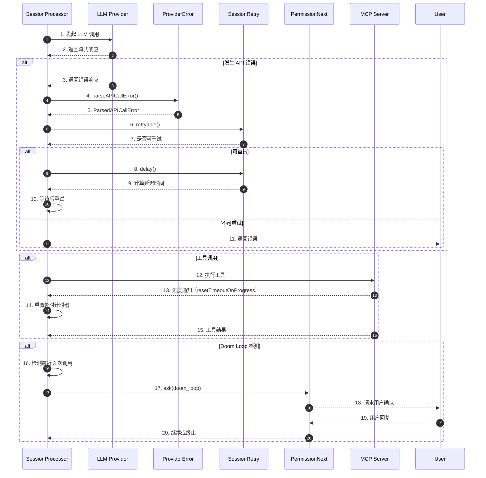

**关键交互说明**：

| 步骤 | 交互内容 | 设计意图 |
|-----|---------|---------|
| 1-2 | SessionProcessor 与 LLM 交互 | 流式处理，实时获取响应 |
| 4-5 | 统一错误解析 | 屏蔽 Provider 差异，统一处理 |
| 6-7 | 可重试判定 | 避免对不可恢复错误无效重试 |
| 8-9 | Retry-After 支持 | 尊重 Provider 的限流提示 |
| 12-15 | MCP 工具执行 | resetTimeoutOnProgress 防止长任务被中断 |
| 16-20 | Doom loop 检测 | 用户介入防止无效循环 |

---

## 3. 核心组件详细分析

### 3.1 ProviderError 内部结构

#### 职责定位

ProviderError 负责将不同 LLM Provider 的错误响应统一解析为标准格式，特别是上下文溢出检测。

#### 状态机图

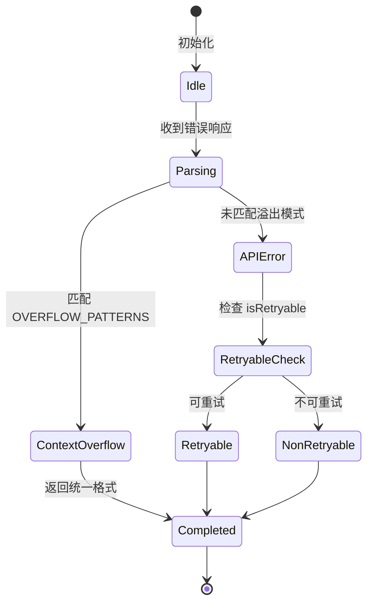

**状态说明**：

| 状态 | 说明 | 进入条件 | 退出条件 |
|-----|------|---------|---------|
| Idle | 空闲等待 | 初始化完成 | 收到错误响应 |
| Parsing | 解析错误 | 收到错误响应 | 匹配到模式或判定为 API 错误 |
| ContextOverflow | 上下文溢出 | 匹配 OVERFLOW_PATTERNS | 返回溢出错误对象 |
| APIError | API 错误 | 未匹配溢出模式 | 检查可重试性 |
| Completed | 完成 | 解析完成 | 返回结果 |

#### 内部数据流

```text
┌─────────────────────────────────────────────────────────────┐
│  输入层                                                      │
│  ├── Provider ID ──► 选择解析策略                           │
│  ├── Error Message ──► 正则匹配 ──► 溢出检测                │
│  └── Response Headers ──► 提取 Retry-After                  │
└──────────────────────────┬──────────────────────────────────┘
                           ▼
┌─────────────────────────────────────────────────────────────┐
│  处理层                                                      │
│  ├── 溢出检测: OVERFLOW_PATTERNS 遍历匹配                   │
│  ├── OpenAI 特殊处理: isOpenAiErrorRetryable()              │
│  └── 元数据提取: statusCode, headers, body                  │
└──────────────────────────┬──────────────────────────────────┘
                           ▼
┌─────────────────────────────────────────────────────────────┐
│  输出层                                                      │
│  ├── ParsedAPICallError 对象                                │
│  │   ├── type: "context_overflow" | "api_error"             │
│  │   ├── message: 统一错误信息                              │
│  │   └── isRetryable: 是否可重试                            │
│  └── ParsedStreamError 对象（流式场景）                     │
└─────────────────────────────────────────────────────────────┘
```

#### 关键算法逻辑

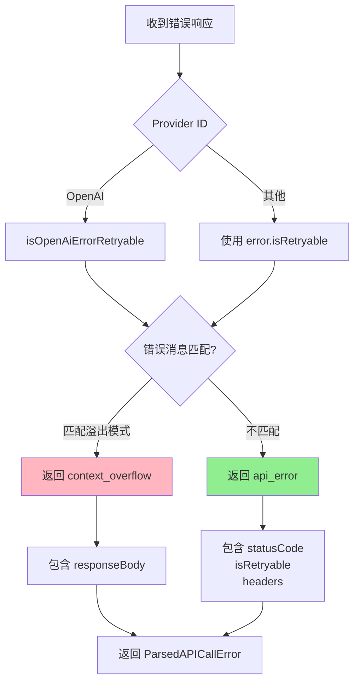

**算法要点**：

1. **分支选择逻辑**：根据 Provider ID 选择不同的可重试判定逻辑，OpenAI 有特殊处理
2. **溢出检测**：12+ 种正则模式覆盖主流 Provider 的溢出错误描述
3. **元数据保留**：保留原始响应信息供上层决策

#### 关键接口

| 接口 | 输入 | 输出 | 说明 | 代码位置 |
|-----|------|------|------|---------|
| `parseAPICallError()` | `{providerID, error}` | `ParsedAPICallError` | 统一错误解析 | `provider/error.ts:33-47` |
| `parseStreamError()` | `unknown` | `ParsedStreamError \| undefined` | 流式错误解析 | `provider/error.ts:58-73` |
| `isOverflow()` | `string` | `boolean` | 溢出模式匹配 | `provider/error.ts`（内部） |

---

### 3.2 SessionRetry 内部结构

#### 职责定位

SessionRetry 负责计算重试延迟时间，支持 Retry-After 响应头的三种格式解析。

#### 状态机图

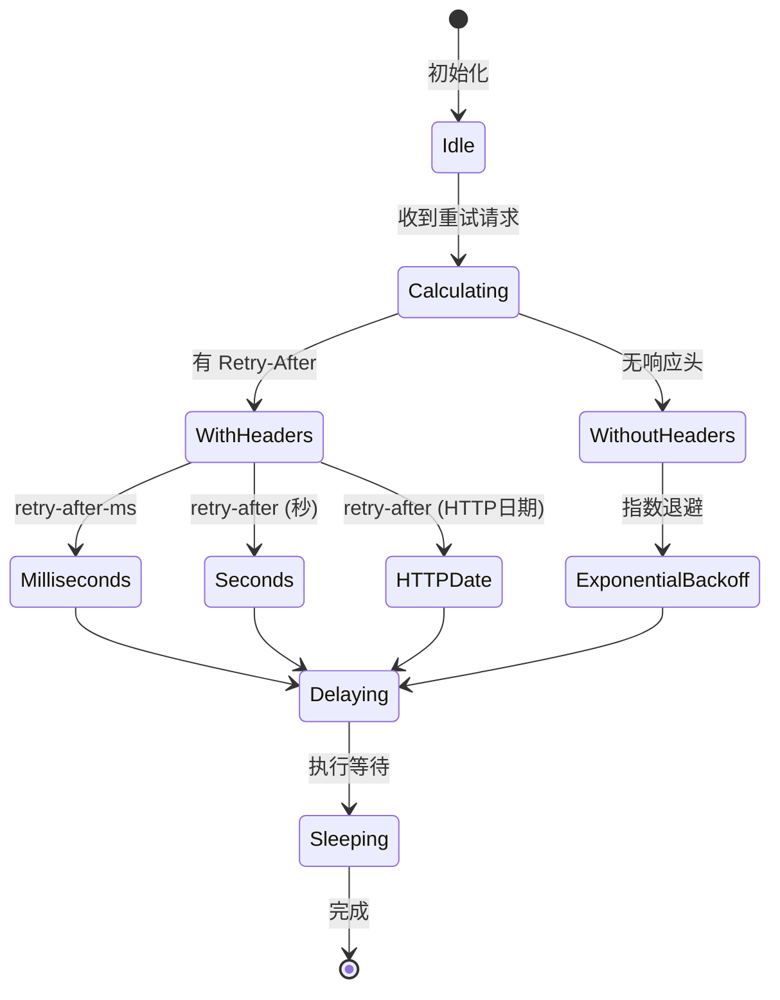

#### 关键算法逻辑

```mermaid
flowchart TD
    A[计算延迟] --> B{有 error?}
    B -->|是| C{有 responseHeaders?}
    B -->|否| D[指数退避]
    C -->|是| E{retry-after-ms?}
    C -->|否| D
    E -->|是| F[解析为毫秒]
    E -->|否| G{retry-after?}
    G -->|是| H{可解析为秒?}
    H -->|是| I[秒 * 1000]
    H -->|否| J[解析为 HTTP 日期]
    J --> K[日期差值]
    G -->|否| D
    D --> L[RETRY_INITIAL_DELAY * 2^(attempt-1)]
    D --> M[上限 30 秒]
    F --> N[返回延迟]
    I --> N
    K --> N
    L --> N

    style F fill:#90EE90
    style I fill:#90EE90
    style K fill:#90EE90
    style L fill:#FFD700
```

**算法要点**：

1. **优先级**：retry-after-ms > retry-after（秒）> retry-after（HTTP日期）> 指数退避
2. **指数退避**：初始 2 秒，每次翻倍，上限 30 秒
3. **最大延迟**：有响应头时支持最大 32 位有符号整数（约 24 天）

---

### 3.3 PermissionNext 规则引擎

#### 职责定位

PermissionNext 是细粒度权限控制系统，支持 allow/deny/ask 三种动作，以及 once/always/reject 三种用户回复。

#### 状态机图

```mermaid
stateDiagram-v2
    [*] --> Idle: 初始化
    Idle --> Evaluating: 收到权限请求
    Evaluating --> Matched: 匹配规则
    Evaluating --> Default: 无匹配规则
    Matched --> Allow: action = allow
    Matched --> Deny: action = deny
    Matched --> Ask: action = ask
    Default --> Allow: 默认 allow
    Allow --> [*]: 继续执行
    Deny --> [*]: 抛出 DeniedError
    Ask --> Waiting: 等待用户回复
    Waiting --> Once: reply = once
    Waiting --> Always: reply = always
    Waiting --> Reject: reply = reject
    Once --> [*]: 本次允许
    Always --> [*]: 持久化后允许
    Reject --> RejectAll: 拒绝同会话所有待处理
    RejectAll --> [*]: 抛出 RejectedError
```

#### 内部数据流

```text
┌─────────────────────────────────────────────────────────────┐
│  规则定义层                                                  │
│  ├── fromConfig(): 解析配置为规则集                         │
│  └── 规则格式: {permission, pattern, action}                │
└──────────────────────────┬──────────────────────────────────┘
                           ▼
┌─────────────────────────────────────────────────────────────┐
│  规则评估层                                                  │
│  ├── evaluate(): 匹配 permission 和 pattern                 │
│  ├── 通配符支持: * 匹配任意                                 │
│  └── 优先级: 具体规则 > 通配规则                            │
└──────────────────────────┬──────────────────────────────────┘
                           ▼
┌─────────────────────────────────────────────────────────────┐
│  执行层                                                      │
│  ├── allow: 直接继续                                        │
│  ├── deny: 抛出 DeniedError                                 │
│  └── ask: 创建 Promise，等待用户回复                        │
└─────────────────────────────────────────────────────────────┘
```

---

### 3.4 Doom Loop 检测机制

#### 职责定位

检测 LLM 是否陷入重复调用相同工具的无效循环，触发权限询问让用户介入。

#### 检测算法

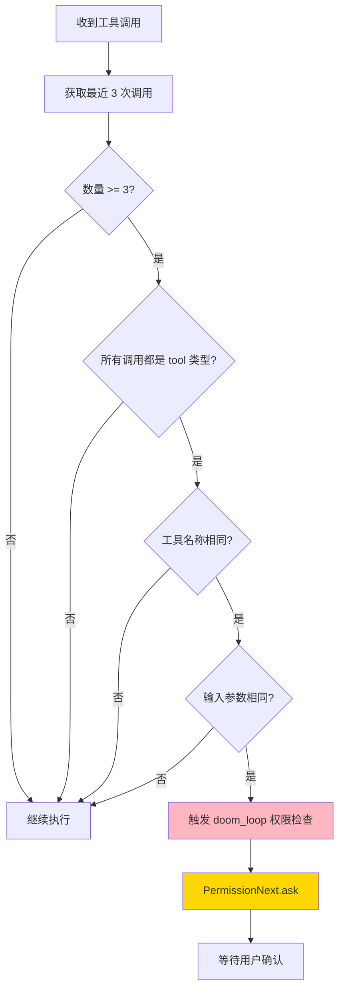

**检测条件**（需同时满足）：
1. 最近 3 次调用
2. 都是 tool 类型
3. 工具名称相同
4. 输入参数相同（JSON 序列化比较）

---

### 3.5 组件间协作时序

展示错误处理各组件如何协作完成一次完整的错误恢复流程。

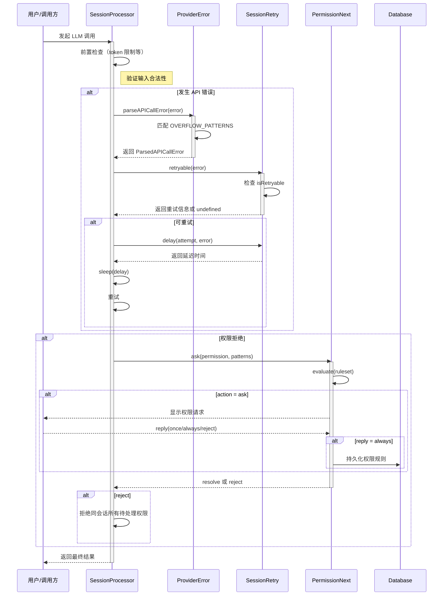

**协作要点**：

1. **SessionProcessor 与 ProviderError**：统一错误解析，屏蔽 Provider 差异
2. **SessionProcessor 与 SessionRetry**：智能重试，尊重 Provider 限流提示
3. **PermissionNext 与 Database**：持久化用户选择的 "always" 权限
4. **拒绝级联**：拒绝时取消同一会话的所有待处理权限请求

---

### 3.6 关键数据路径

#### 主路径（正常流程）

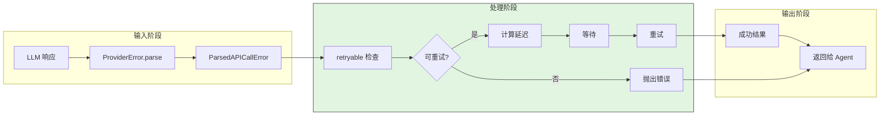

#### 异常路径（错误恢复）

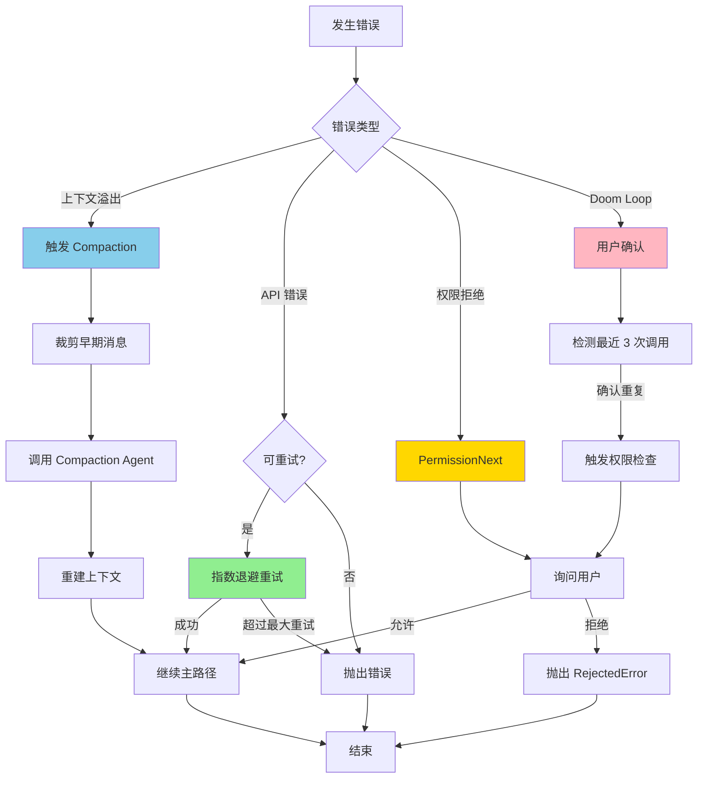

---

## 4. 端到端数据流转

### 4.1 正常流程（详细版）

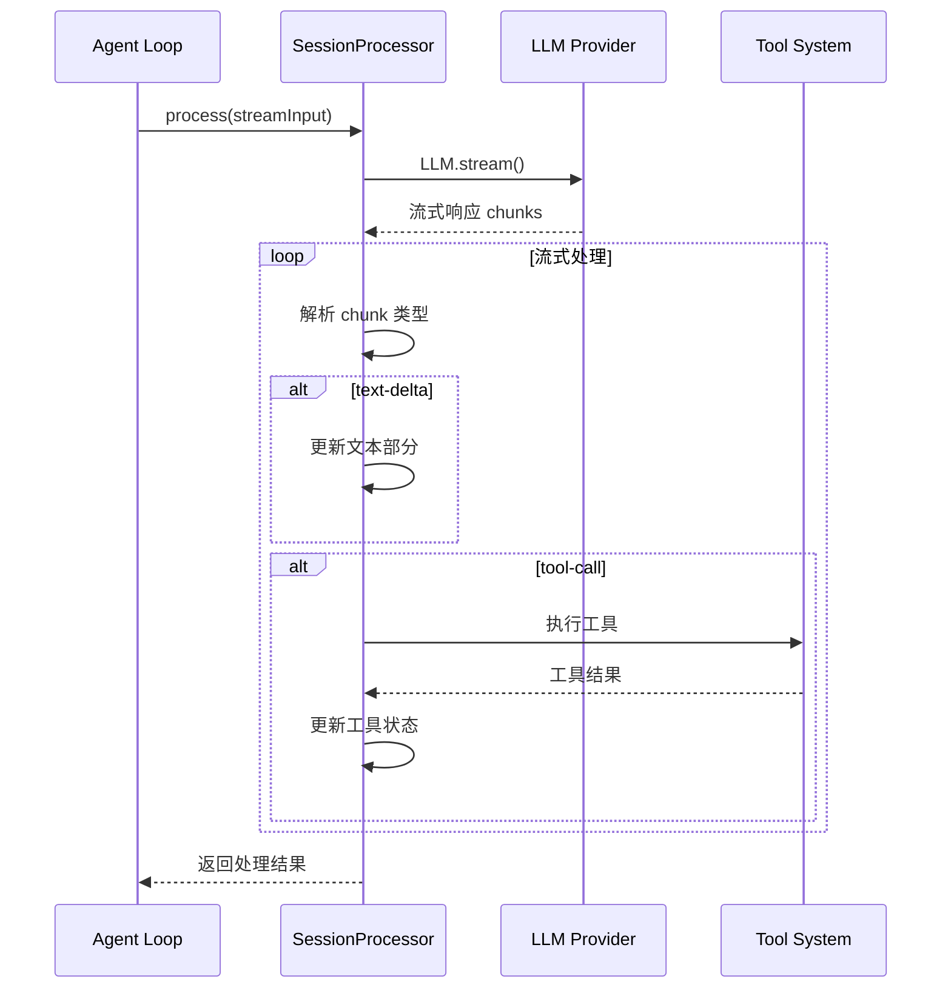

**数据变换详情**：

| 阶段 | 输入 | 处理 | 输出 | 代码位置 |
|-----|------|------|------|---------|
| 接收 | LLM 流式响应 | 解析 chunk 类型 | 结构化事件 | `session/processor.ts:55-60` |
| 处理 | tool-call 事件 | Doom loop 检测 | 权限检查或继续 | `session/processor.ts:134-178` |
| 输出 | 工具执行结果 | 更新消息状态 | 完整消息 | `session/processor.ts:180-228` |

### 4.2 错误恢复流程

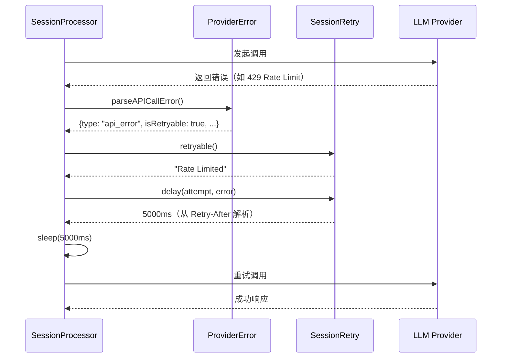

### 4.3 异常/边界流程

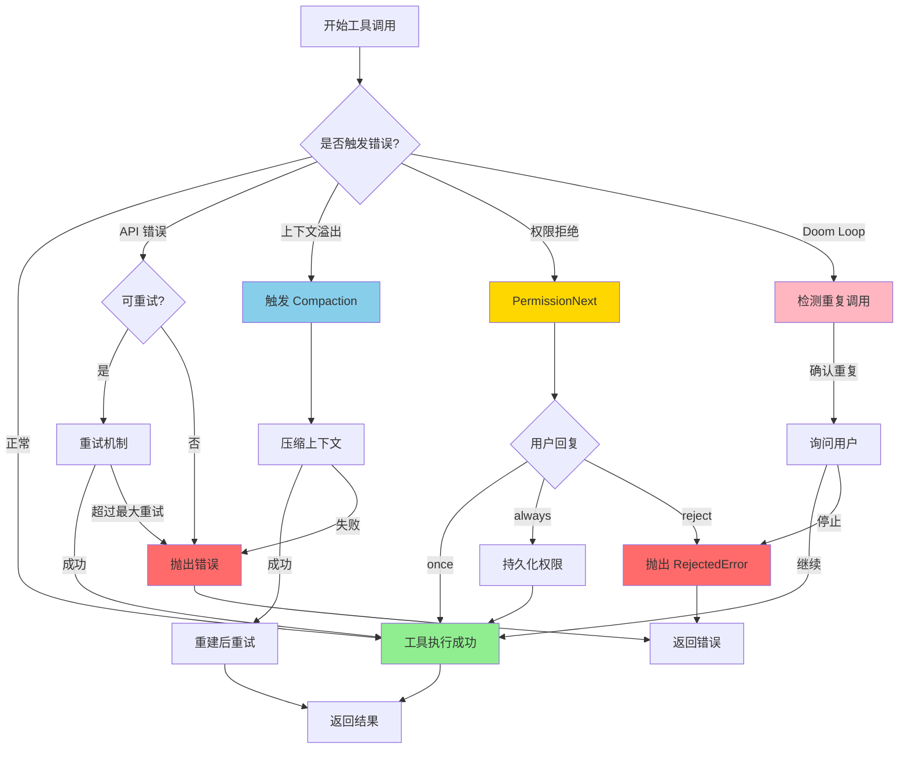

---

## 5. 关键代码实现

### 5.1 核心数据结构

```typescript
// opencode/packages/opencode/src/provider/error.ts:29-31
export type ParsedAPICallError =
  | { type: "context_overflow"; message: string; responseBody?: string }
  | { type: "api_error"; message: string; statusCode?: number; isRetryable: boolean; responseHeaders?: Record<string, string>; responseBody?: string; metadata?: Record<string, string> }
```

**字段说明**：

| 字段 | 类型 | 用途 |
|-----|------|------|
| `type` | `"context_overflow" \| "api_error"` | 错误类型区分 |
| `isRetryable` | `boolean` | 是否可重试 |
| `responseHeaders` | `Record<string, string>` | 包含 Retry-After 信息 |
| `responseBody` | `string` | 原始响应体 |

### 5.2 主链路代码

```typescript
// opencode/packages/opencode/src/session/processor.ts:151-176
const parts = await MessageV2.parts(input.assistantMessage.id)
const lastThree = parts.slice(-DOOM_LOOP_THRESHOLD)

if (
  lastThree.length === DOOM_LOOP_THRESHOLD &&
  lastThree.every(
    (p) =>
      p.type === "tool" &&
      p.tool === value.toolName &&
      p.state.status !== "pending" &&
      JSON.stringify(p.state.input) === JSON.stringify(value.input),
  )
) {
  const agent = await Agent.get(input.assistantMessage.agent)
  await PermissionNext.ask({
    permission: "doom_loop",
    patterns: [value.toolName],
    sessionID: input.assistantMessage.sessionID,
    metadata: {
      tool: value.toolName,
      input: value.input,
    },
    always: [value.toolName],
    ruleset: agent.permission,
  })
}
```

**代码要点**：

1. **检测窗口**：固定最近 3 次调用（DOOM_LOOP_THRESHOLD = 3）
2. **严格匹配**：工具名称和输入参数必须完全相同
3. **用户介入**：通过 PermissionNext.ask 让用户决定是否继续

### 5.3 关键调用链

```text
SessionProcessor.process()    [session/processor.ts:45]
  -> LLM.stream()             [session/llm.ts]
    -> for await (stream)     [session/processor.ts:55]
      -> case "tool-call"     [session/processor.ts:134]
        - Doom loop 检测      [session/processor.ts:151-176]
        - PermissionNext.ask  [permission/next.ts:226]
      -> case "tool-error"    [session/processor.ts:204]
        - 更新错误状态        [session/processor.ts:207-218]
        - 检查 RejectedError  [session/processor.ts:220-225]
      -> case "error"         [session/processor.ts:230-231]
        - 抛出错误            [session/processor.ts:231]
```

---

## 6. 设计意图与 Trade-off

### 6.1 OpenCode 的选择

| 维度 | OpenCode 的选择 | 替代方案 | 取舍分析 |
|-----|----------------|---------|---------|
| 错误解析 | Provider-specific 正则匹配 | 统一错误码 | 精准识别各 Provider 错误，但需维护 12+ 种模式 |
| 重试策略 | Retry-After 三种格式 + 指数退避 | 固定间隔重试 | 尊重 Provider 限流提示，但实现复杂 |
| 权限控制 | 规则引擎 + 用户确认 | 预定义白名单 | 灵活细粒度控制，但增加用户交互 |
| 循环检测 | Doom loop（最近 3 次） | 无检测 | 防止无效循环，但可能误报 |
| 超时处理 | resetTimeoutOnProgress | 固定超时 | 支持长任务，但需依赖进度通知 |

### 6.2 为什么这样设计？

**核心问题**：如何在多 Provider 环境下统一处理错误，同时保持灵活性和用户体验？

**OpenCode 的解决方案**：
- **代码依据**：`provider/error.ts:14-27`
- **设计意图**：通过正则模式覆盖主流 Provider 的溢出错误，避免硬编码 Provider 特定逻辑
- **带来的好处**：
  - 新增 Provider 只需添加正则模式
  - 统一错误类型便于上层处理
  - 保留原始响应供调试
- **付出的代价**：
  - 正则模式需要持续维护
  - 可能无法覆盖所有边缘情况

### 6.3 与其他项目的对比

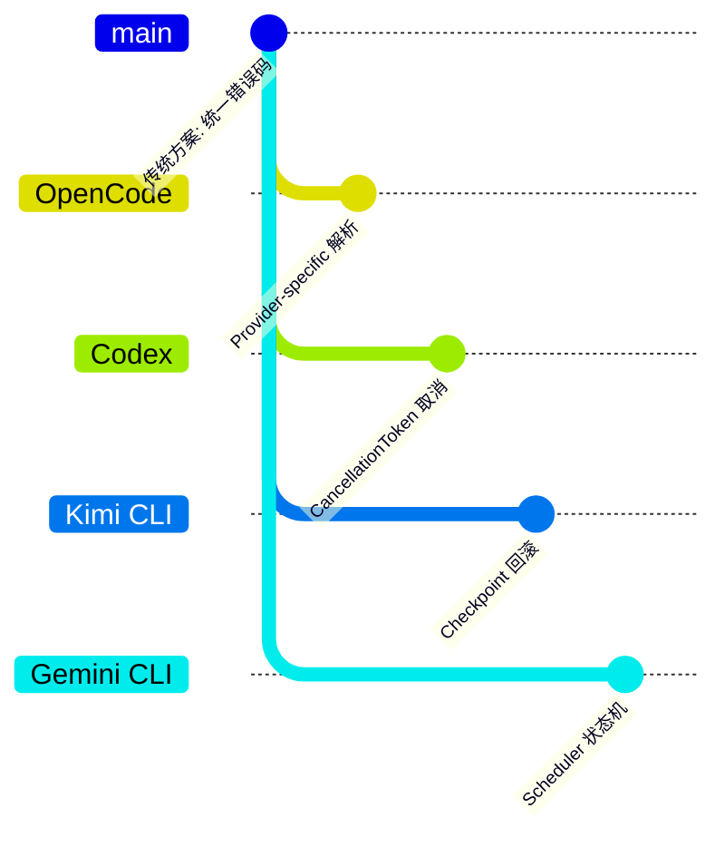

| 项目 | 核心差异 | 适用场景 |
|-----|---------|---------|
| OpenCode | Provider-specific 解析 + Doom loop + 进度感知超时 | 多 Provider 环境，长任务处理 |
| Codex | CancellationToken 取消 + 原生沙箱 | 企业安全场景，需要强制取消 |
| Kimi CLI | Checkpoint 文件回滚 + D-Mail 恢复 | 需要对话状态回滚的场景 |
| Gemini CLI | Scheduler 状态机 + 递归 continuation | 复杂状态管理，UX 优先 |
| SWE-agent | forward_with_handling() + autosubmit | 错误恢复，自动重试 |

**详细对比**：

| 特性 | OpenCode | Codex | Kimi CLI | Gemini CLI |
|-----|----------|-------|----------|-----------|
| 错误解析 | Provider 正则匹配 | 统一错误类型 | 简单错误判断 | 状态机处理 |
| 重试机制 | Retry-After + 指数退避 | CancellationToken | Checkpoint 回滚 | Scheduler 重试 |
| 循环检测 | Doom Loop (3次) | 无 | 无 | 无 |
| 权限控制 | 规则引擎 | 沙箱隔离 | 配置文件 | 无显式控制 |
| 超时处理 | resetTimeoutOnProgress | 固定超时 | 命令超时 | Scheduler 超时 |

**对比分析**：

- **vs Codex**：Codex 使用 Rust 的 CancellationToken 实现强制取消，OpenCode 使用 JavaScript 的异步超时，前者更可靠但平台受限
- **vs Kimi CLI**：Kimi 的 Checkpoint 回滚是状态级恢复，OpenCode 的错误处理是调用级恢复，两者互补
- **vs Gemini CLI**：Gemini 的 Scheduler 状态机集中管理错误，OpenCode 的组件分散处理，前者适合复杂状态，后者更灵活

---

## 7. 边界情况与错误处理

### 7.1 终止条件

| 终止原因 | 触发条件 | 代码位置 |
|---------|---------|---------|
| 最大重试次数 | 超过配置的 maxRetries | `session/retry.ts` |
| 上下文溢出 | 匹配 OVERFLOW_PATTERNS | `provider/error.ts:35-36` |
| 权限拒绝 | 用户选择 reject | `permission/next.ts:266-275` |
| Doom loop | 连续 3 次相同调用 | `session/processor.ts:154-163` |
| 用户取消 | AbortSignal 触发 | `session/processor.ts:56` |

### 7.2 超时/资源限制

```typescript
// opencode/packages/opencode/src/mcp/index.ts:142
return client.callTool(
  {
    name: mcpTool.name,
    arguments: (args || {}) as Record<string, unknown>,
  },
  CallToolResultSchema,
  {
    resetTimeoutOnProgress: true,  // 关键：有进度时重置超时
    timeout,
  },
)
```

### 7.3 错误恢复策略

| 错误类型 | 处理策略 | 代码位置 |
|---------|---------|---------|
| 上下文溢出 | 触发 Compaction Agent 压缩 | `session/compaction.ts` |
| 429 Rate Limit | 按 Retry-After 等待后重试 | `session/retry.ts:110-131` |
| 权限拒绝 | 询问用户，支持 once/always/reject | `permission/next.ts:226-291` |
| Doom loop | 检测后询问用户是否继续 | `session/processor.ts:164-176` |
| 工具执行错误 | 更新状态为 error，继续或终止 | `session/processor.ts:204-228` |

---

## 8. 关键代码索引

| 功能 | 文件 | 行号 | 说明 |
|-----|------|------|------|
| 入口 | `session/processor.ts` | 45 | process() 方法，流式处理入口 |
| 错误解析 | `provider/error.ts` | 33-47 | parseAPICallError() 统一错误解析 |
| 溢出检测 | `provider/error.ts` | 16-27 | OVERFLOW_PATTERNS 正则模式 |
| 重试延迟 | `session/retry.ts` | 110-139 | delay() 支持 Retry-After 三种格式 |
| 可重试判定 | `session/retry.ts` | 145-179 | retryable() 检查错误是否可重试 |
| 权限规则 | `permission/next.ts` | 191-219 | fromConfig() 规则引擎 |
| 权限询问 | `permission/next.ts` | 226-251 | ask() 审批流程 |
| 用户回复 | `permission/next.ts` | 258-291 | reply() 三种回复处理 |
| Doom loop 检测 | `session/processor.ts` | 151-176 | 最近 3 次调用检测 |
| Doom loop 阈值 | `session/processor.ts` | 20 | DOOM_LOOP_THRESHOLD = 3 |
| 权限配置 | `agent/agent.ts` | 56-73 | 默认权限规则定义 |
| 超时重置 | `mcp/index.ts` | 142 | resetTimeoutOnProgress |

---

## 9. 延伸阅读

- 前置知识：`docs/opencode/04-opencode-agent-loop.md`
- 相关机制：`docs/opencode/06-opencode-mcp-integration.md`
- 深度分析：`docs/opencode/07-opencode-memory-context.md`
- 跨项目对比：`docs/comm/comm-tool-error-handling.md`

---

*✅ Verified: 基于 opencode/packages/opencode/src/provider/error.ts:33、session/processor.ts:151、session/retry.ts:110、permission/next.ts:226、mcp/index.ts:142 等源码分析*
*基于版本：opencode (baseline 2026-02-08) | 最后更新：2026-03-03*
