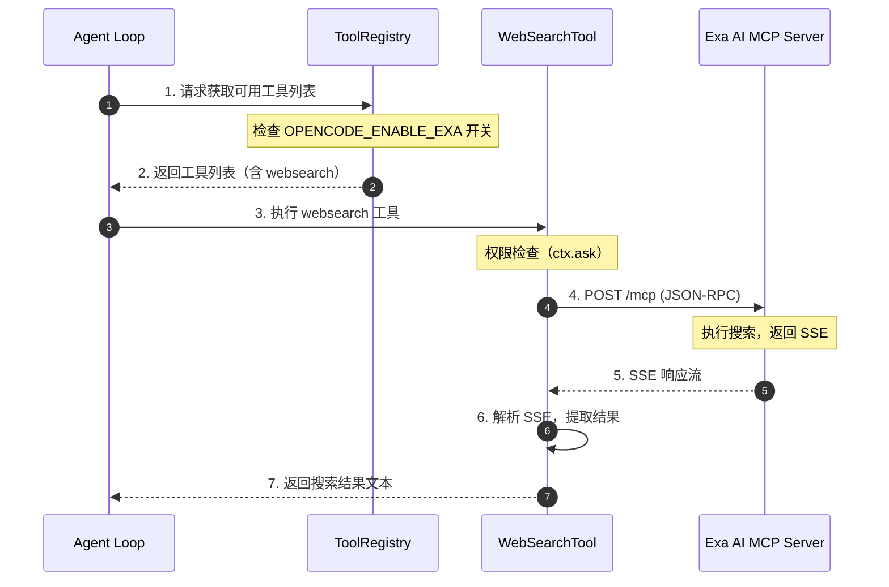
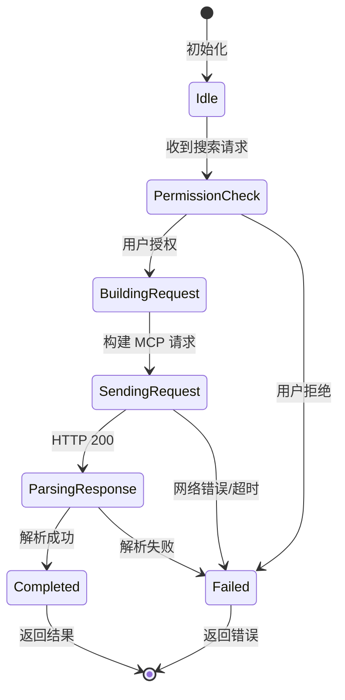
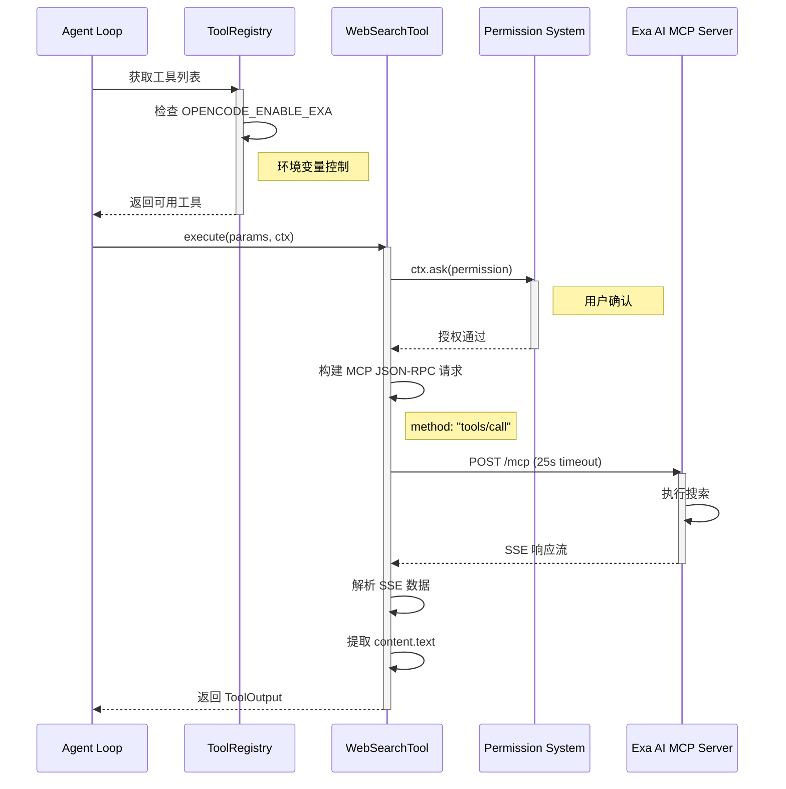
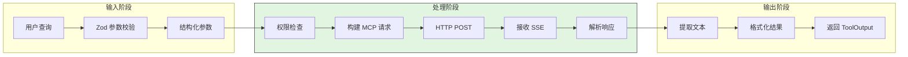
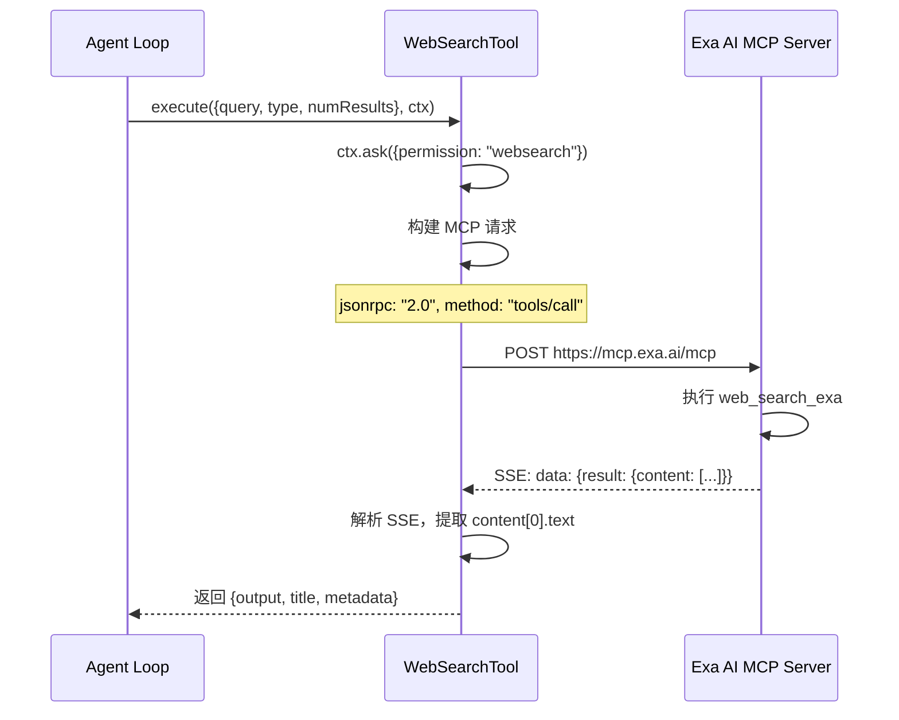
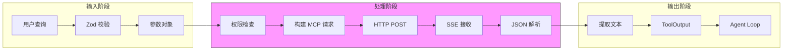
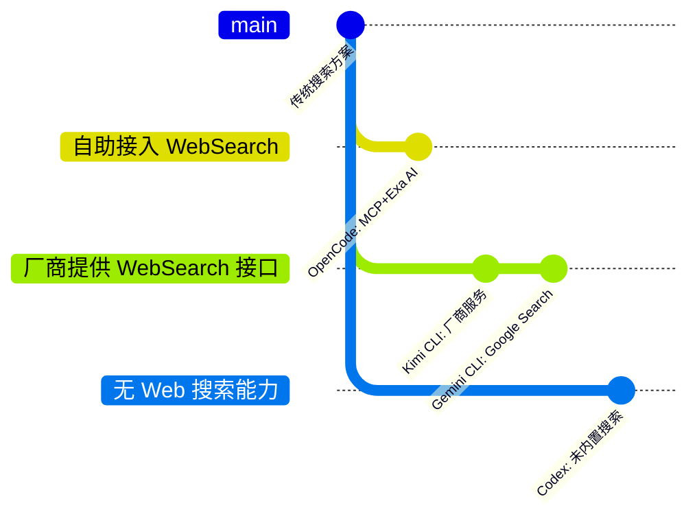

# OpenCode WebSearch 实现机制

> **阅读指南**
>
> | 属性 | 说明 |
> |-----|------|
> | 预计阅读 | 20-30 分钟 |
> | 前置文档 | `01-opencode-overview.md`、`03-opencode-session-runtime.md` |
> | 文档结构 | 速览 → 架构 → 机制 → 实现 → 对比 |
> | 代码呈现 | 关键代码直接展示，完整代码可折叠查看 |

---

## TL;DR（结论先行）

**一句话定义**：OpenCode WebSearch 是通过 Exa AI MCP 服务实现的外部搜索能力，采用 MCP JSON-RPC 协议与 Exa AI 后端通信，支持实时爬取和多模式搜索。

**OpenCode 的核心取舍**：**自助接入 WebSearch** - 通过 MCP 协议标准化接入 Exa AI，采用双工具分离设计（对比其他项目的厂商提供接口或无搜索能力）

### 核心要点速览

| 维度 | 关键决策 | 代码位置 |
|-----|---------|---------|
| 核心机制 | MCP JSON-RPC 协议调用 Exa AI 后端 | `packages/opencode/src/tool/websearch.ts:327` |
| 传输格式 | SSE (Server-Sent Events) 流式响应 | `packages/opencode/src/tool/websearch.ts:371-384` |
| 搜索模式 | auto/fast/deep 三种模式可选 | `packages/opencode/src/tool/websearch.ts:324` |
| 功能开关 | `OPENCODE_ENABLE_EXA` 环境变量控制 | `packages/opencode/src/flag/flag.ts:261-264` |

---

## 1. 为什么需要这个机制？（解决什么问题）

### 1.1 问题场景

没有 WebSearch：用户询问"最新的 React 19 特性"→ LLM 只能基于训练数据回答（可能过时）→ 信息不准确

有 WebSearch：
  → LLM: "需要搜索最新信息" → 调用 websearch 工具 → 获取实时搜索结果
  → LLM: "根据搜索结果回答..." → 提供准确的最新信息

### 1.2 核心挑战

| 挑战 | 不解决的后果 |
|-----|-------------|
| LLM 知识时效性有限 | 无法回答最新技术、新闻、API 变更等问题 |
| 搜索服务选型 | 需要稳定、快速、支持编程场景的搜索 API |
| 协议标准化 | 不同搜索服务 API 差异大，难以统一维护 |
| 权限与安全 | 无限制的网络搜索可能导致信息泄露或滥用 |

---

## 2. 整体架构

### 2.1 在系统中的位置

```text
┌─────────────────────────────────────────────────────────────┐
│ OpenCode Agent Loop / Session Runtime                        │
│ packages/opencode/src/agent/agent.ts                         │
└───────────────────────┬─────────────────────────────────────┘
                        │ 工具调用
                        ▼
┌─────────────────────────────────────────────────────────────┐
│ ▓▓▓ WebSearch / WebFetch / CodeSearch ▓▓▓                   │
│ packages/opencode/src/tool/                                  │
│ - websearch.ts : WebSearch 工具实现                         │
│ - webfetch.ts  : WebFetch 工具实现                          │
│ - codesearch.ts: CodeSearch 工具实现                        │
│ - registry.ts  : 工具注册中心                               │
└───────────────────────┬─────────────────────────────────────┘
                        │ MCP JSON-RPC / HTTP
                        ▼
┌─────────────────────────────────────────────────────────────┐
│ Exa AI MCP Service           │ 其他外部服务                  │
│ mcp.exa.ai/mcp               │                               │
└──────────────────────────────┴───────────────────────────────┘
```

### 2.2 核心组件职责

| 组件 | 职责 | 代码位置 |
|-----|------|---------|
| `WebSearchTool` | 执行网络搜索，调用 Exa AI MCP 服务 | `packages/opencode/src/tool/websearch.ts:315` |
| `WebFetchTool` | 直接获取指定 URL 内容，支持格式转换 | `packages/opencode/src/tool/webfetch.ts:400` |
| `CodeSearchTool` | 代码和文档搜索，基于 Exa AI MCP | `packages/opencode/src/tool/codesearch.ts:1` |
| `ToolRegistry` | 管理工具注册，控制功能开关 | `packages/opencode/src/tool/registry.ts:235` |
| `Flag` | 功能开关定义，环境变量控制 | `packages/opencode/src/flag/flag.ts:261` |

### 2.3 核心组件交互关系



**关键交互说明**：

| 步骤 | 交互内容 | 设计意图 |
|-----|---------|---------|
| 1 | Agent 请求工具列表 | 解耦工具管理与执行，支持动态启用/禁用 |
| 2 | Registry 根据开关过滤 | 通过环境变量控制功能可用性 |
| 3 | Agent 调用 WebSearch | 统一工具调用接口 |
| 4 | MCP JSON-RPC 请求 | 标准化协议，便于扩展其他 MCP 服务 |
| 5 | SSE 流式响应 | 支持大结果集流式传输 |
| 6 | 客户端解析 SSE | 将流式数据转为结构化结果 |
| 7 | 返回格式化结果 | 统一输出格式，便于 LLM 消费 |

---

## 3. 核心组件详细分析

### 3.1 WebSearchTool 内部结构

#### 职责定位

WebSearchTool 是 OpenCode 的外部搜索入口，负责将 LLM 的搜索意图转换为 Exa AI MCP 调用，并处理 SSE 响应。

#### 状态机图



**状态说明**：

| 状态 | 说明 | 进入条件 | 退出条件 |
|-----|------|---------|---------|
| Idle | 空闲等待 | 工具初始化完成 | 收到 execute 调用 |
| PermissionCheck | 权限检查 | 开始执行 | 用户授权/拒绝 |
| BuildingRequest | 构建请求 | 权限通过 | 请求参数就绪 |
| SendingRequest | 发送请求 | 请求构建完成 | 收到响应或超时 |
| ParsingResponse | 解析响应 | 收到 HTTP 响应 | 解析完成或失败 |
| Completed | 完成 | 成功获取结果 | 返回结果 |
| Failed | 失败 | 任何步骤出错 | 返回错误信息 |

#### 内部数据流

```text
┌────────────────────────────────────────────┐
│  输入层                                     │
│   用户查询 → Zod 参数校验 → 结构化参数      │
└──────────────────┬─────────────────────────┘
                   ▼
┌────────────────────────────────────────────┐
│  处理层                                     │
│   权限检查 → 构建 MCP 请求 → HTTP POST     │
│   → 接收 SSE → 解析响应                     │
└──────────────────┬─────────────────────────┘
                   ▼
┌────────────────────────────────────────────┐
│  输出层                                     │
│   提取文本 → 格式化结果 → 返回 ToolOutput   │
└────────────────────────────────────────────┘
```

#### 关键接口

| 接口 | 输入 | 输出 | 说明 | 代码位置 |
|-----|------|------|------|---------|
| `Tool.define()` | 工具配置 | Tool 实例 | 定义工具元数据 | `packages/opencode/src/tool/websearch.ts:315` |
| `execute()` | 搜索参数 + Context | ToolOutput | 执行搜索 | `packages/opencode/src/tool/websearch.ts:327` |
| `ctx.ask()` | 权限请求 | Promise | 请求用户授权 | `packages/opencode/src/tool/websearch.ts:329` |

---

### 3.2 WebFetchTool 内部结构

#### 职责定位

WebFetchTool 提供直接 URL 内容获取能力，支持 HTML/Markdown/Text 格式转换，并具备智能反爬机制。

#### 关键特性流程

```text
┌─────────────────────────────────────────────────────────────────┐
│                        WebFetch Tool                            │
├─────────────────────────────────────────────────────────────────┤
│  Input: URL + format (markdown/text/html) + timeout             │
│                         │                                       │
│                         ▼                                       │
│  ┌──────────────────────────────────────────────────────┐      │
│  │  1. Permission Check (webfetch permission)           │      │
│  │  2. Validate URL (must start with http/https)        │      │
│  │  3. Build Accept Header based on format              │      │
│  │  4. Fetch with User-Agent (Chrome 143)               │      │
│  │  5. Retry with "opencode" UA if Cloudflare blocked   │      │
│  │  6. Check Content-Length (max 5MB)                   │      │
│  └──────────────────────────────────────────────────────┘      │
│                         │                                       │
│                         ▼                                       │
│  ┌──────────────────────────────────────────────────────┐      │
│  │  Content Processing:                                 │      │
│  │  - Image: Return base64 data URI                     │      │
│  │  - HTML→Markdown: TurndownService                    │      │
│  │  - HTML→Text: HTMLRewriter extract text              │      │
│  │  - Other: Return as-is                               │      │
│  └──────────────────────────────────────────────────────┘      │
└─────────────────────────────────────────────────────────────────┘
```

---

### 3.3 组件间协作时序



**协作要点**：

1. **Agent 与 Registry**：动态获取工具列表，支持运行时开关控制
2. **WebSearch 与 Permission**：执行前必须获得用户授权，确保安全
3. **WebSearch 与 Exa AI**：通过标准化 MCP 协议通信，25秒超时保护

---

### 3.4 关键数据路径

#### 主路径（正常流程）



#### 异常路径（错误恢复）

```mermaid
flowchart TD
    E[发生错误] --> E1{错误类型}
    E1 -->|权限拒绝| R1[返回权限错误]
    E1 -->|网络超时| R2[超时错误]
    E1 -->|解析失败| R3[解析错误]
    E1 -->|无结果| R4[返回"No results"]

    R2 --> R2A[25s 超时保护]
    R3 --> R3A[尝试备用解析]

    R1 --> End[结束]
    R2A --> End
    R3A --> End
    R4 --> End

    style R1 fill:#FF6B6B
    style R2 fill:#FFD700
    style R4 fill:#90EE90
```

---

## 4. 端到端数据流转

### 4.1 正常流程（详细版）



**数据变换详情**：

| 阶段 | 输入 | 处理 | 输出 | 代码位置 |
|-----|------|------|------|---------|
| 接收 | 用户查询字符串 | Zod schema 校验 | 结构化参数对象 | `packages/opencode/src/tool/websearch.ts:320-326` |
| 处理 | 参数对象 | 构建 JSON-RPC 请求 | MCP 请求体 | `packages/opencode/src/tool/websearch.ts:337-351` |
| 传输 | MCP 请求 | HTTP POST + SSE 接收 | SSE 响应文本 | `packages/opencode/src/tool/websearch.ts:355-366` |
| 解析 | SSE 文本 | 按行解析，提取 data 字段 | 搜索结果文本 | `packages/opencode/src/tool/websearch.ts:371-384` |
| 输出 | 结果文本 | 格式化 ToolOutput | 标准工具输出 | `packages/opencode/src/tool/websearch.ts:377-381` |

### 4.2 数据流向图



### 4.3 异常/边界流程

```mermaid
flowchart TD
    A[开始执行] --> B{权限检查}
    B -->|拒绝| C[抛出权限错误]
    B -->|通过| D[构建请求]
    D --> E{网络请求}
    E -->|超时| F[25s 超时错误]
    E -->|成功| G[接收 SSE]
    G --> H{解析结果}
    H -->|成功| I[返回结果]
    H -->|无结果| J[返回"No results"]
    H -->|解析失败| K[解析错误]
    C --> End[结束]
    F --> End
    I --> End
    J --> End
    K --> End
```

---

## 5. 关键代码实现

### 5.1 核心数据结构

```typescript
// packages/opencode/src/tool/websearch.ts:309-314
const API_CONFIG = {
  BASE_URL: "https://mcp.exa.ai",
  ENDPOINTS: { SEARCH: "/mcp" },
  DEFAULT_NUM_RESULTS: 8,
} as const;

// MCP JSON-RPC 请求结构
interface McpSearchRequest {
  jsonrpc: "2.0";
  id: number;
  method: "tools/call";
  params: {
    name: "web_search_exa";
    arguments: {
      query: string;
      type: "auto" | "fast" | "deep";
      numResults: number;
      livecrawl: "fallback" | "preferred";
      contextMaxCharacters?: number;
    };
  };
}
```

**字段说明**：

| 字段 | 类型 | 用途 |
|-----|------|------|
| `BASE_URL` | `string` | Exa AI MCP 服务端点 |
| `jsonrpc` | `"2.0"` | JSON-RPC 协议版本 |
| `method` | `"tools/call"` | MCP 调用方法 |
| `name` | `"web_search_exa"` | Exa AI 工具名称 |
| `type` | `enum` | 搜索模式：auto/fast/deep |
| `livecrawl` | `enum` | 实时爬取策略 |

### 5.2 主链路代码

**关键代码**（核心逻辑）：

```typescript
// packages/opencode/src/tool/websearch.ts:327-391
async execute(params, ctx) {
  // 1. 权限检查：请求用户授权
  await ctx.ask({
    permission: "websearch",
    patterns: [params.query],
    always: ["*"],
    metadata: { /* ... */ },
  });

  // 2. 构建 MCP JSON-RPC 请求
  const searchRequest = {
    jsonrpc: "2.0",
    id: 1,
    method: "tools/call",
    params: {
      name: "web_search_exa",
      arguments: {
        query: params.query,
        type: params.type || "auto",
        numResults: params.numResults || 8,
        livecrawl: params.livecrawl || "fallback",
        contextMaxCharacters: params.contextMaxCharacters,
      },
    },
  };

  // 3. 发送请求（25秒超时保护）
  const { signal, clearTimeout } = abortAfterAny(25000, ctx.abort);
  const response = await fetch(
    `${API_CONFIG.BASE_URL}${API_CONFIG.ENDPOINTS.SEARCH}`,
    {
      method: "POST",
      headers: {
        accept: "application/json, text/event-stream",
        "content-type": "application/json",
      },
      body: JSON.stringify(searchRequest),
      signal,
    }
  );
  clearTimeout();

  // 4. 解析 SSE 响应
  const responseText = await response.text();
  const lines = responseText.split("\n");
  for (const line of lines) {
    if (line.startsWith("data: ")) {
      const data = JSON.parse(line.substring(6));
      if (data.result?.content?.length > 0) {
        return {
          output: data.result.content[0].text,
          title: `Web search: ${params.query}`,
          metadata: {},
        };
      }
    }
  }

  return {
    output: "No search results found.",
    title: `Web search: ${params.query}`,
    metadata: {},
  };
}
```

**设计意图**：
1. **权限前置**：执行前必须获得用户授权，防止未授权搜索
2. **MCP 标准化**：使用 JSON-RPC 2.0 协议，符合 MCP 规范
3. **超时保护**：25秒超时防止请求悬挂，使用 abortAfterAny 统一管理
4. **SSE 解析**：支持流式响应，为后续大结果集处理预留空间

<details>
<summary>查看完整实现（含类型定义和工具配置）</summary>

```typescript
// packages/opencode/src/tool/websearch.ts:1-393
import z from "zod";
import { Tool } from "./tool";
import DESCRIPTION from "./websearch.txt";
import { abortAfterAny } from "../util/abort";

const API_CONFIG = {
  BASE_URL: "https://mcp.exa.ai",
  ENDPOINTS: { SEARCH: "/mcp" },
  DEFAULT_NUM_RESULTS: 8,
} as const;

export const WebSearchTool = Tool.define("websearch", async () => {
  return {
    get description() {
      return DESCRIPTION.replace("{{year}}", new Date().getFullYear().toString());
    },
    parameters: z.object({
      query: z.string().describe("Websearch query"),
      numResults: z.number().optional().describe("Number of search results to return (default: 8)"),
      livecrawl: z
        .enum(["fallback", "preferred"])
        .optional()
        .describe("Live crawl mode - 'fallback': use live crawling as backup..."),
      type: z
        .enum(["auto", "fast", "deep"])
        .optional()
        .describe("Search type - 'auto': balanced, 'fast': quick, 'deep': comprehensive"),
      contextMaxCharacters: z
        .number()
        .optional()
        .describe("Maximum characters for context string (default: 10000)"),
    }),
    async execute(params, ctx) {
      await ctx.ask({
        permission: "websearch",
        patterns: [params.query],
        always: ["*"],
        metadata: { /* ... */ },
      });

      const searchRequest = {
        jsonrpc: "2.0",
        id: 1,
        method: "tools/call",
        params: {
          name: "web_search_exa",
          arguments: {
            query: params.query,
            type: params.type || "auto",
            numResults: params.numResults || 8,
            livecrawl: params.livecrawl || "fallback",
            contextMaxCharacters: params.contextMaxCharacters,
          },
        },
      };

      const { signal, clearTimeout } = abortAfterAny(25000, ctx.abort);
      const response = await fetch(
        `${API_CONFIG.BASE_URL}${API_CONFIG.ENDPOINTS.SEARCH}`,
        {
          method: "POST",
          headers: {
            accept: "application/json, text/event-stream",
            "content-type": "application/json",
          },
          body: JSON.stringify(searchRequest),
          signal,
        }
      );

      clearTimeout();

      const responseText = await response.text();
      const lines = responseText.split("\n");
      for (const line of lines) {
        if (line.startsWith("data: ")) {
          const data = JSON.parse(line.substring(6));
          if (data.result?.content?.length > 0) {
            return {
              output: data.result.content[0].text,
              title: `Web search: ${params.query}`,
              metadata: {},
            };
          }
        }
      }

      return {
        output: "No search results found.",
        title: `Web search: ${params.query}`,
        metadata: {},
      };
    },
  };
});
```

</details>

### 5.3 关键调用链

```text
ToolRegistry.tools()          [packages/opencode/src/tool/registry.ts:235]
  -> all()                    [packages/opencode/src/tool/registry.ts:1]
    -> filter()               [packages/opencode/src/tool/registry.ts:239]
      -> WebSearchTool.init() [packages/opencode/src/tool/websearch.ts:315]
        -> Tool.define()      [packages/opencode/src/tool/tool.ts:1]
          - execute()         [packages/opencode/src/tool/websearch.ts:327]
            - ctx.ask()       [权限检查]
            - fetch()         [MCP 请求]
            - SSE 解析        [结果提取]
```

---

## 6. 设计意图与 Trade-off

### 6.1 OpenCode 的选择

| 维度 | OpenCode 的选择 | 替代方案 | 取舍分析 |
|-----|----------------|---------|---------|
| 搜索 Provider | Exa AI MCP | 自建搜索服务/Google API | 快速接入专业搜索，但依赖第三方服务可用性 |
| 协议 | MCP JSON-RPC | REST/GraphQL | 标准化协议便于扩展，但增加学习成本 |
| 传输格式 | SSE | 普通 JSON | 支持流式传输，但解析复杂度增加 |
| 工具设计 | 双工具分离（search/fetch） | 单一工具 | 职责清晰，但增加维护成本 |
| 功能开关 | 环境变量 | 配置文件 | 部署灵活，但缺少运行时动态调整 |

### 6.2 为什么这样设计？

**核心问题**：如何在 Agent 中提供可靠、安全、易维护的外部搜索能力？

**OpenCode 的解决方案**：
- **代码依据**：`packages/opencode/src/tool/websearch.ts:327`
- **设计意图**：
  - 使用 MCP 协议与 Exa AI 通信，符合行业标准
  - 双工具分离，WebSearch 负责发现，WebFetch 负责精确获取
  - 环境变量控制功能开关，便于渐进式发布
- **带来的好处**：
  - 标准化协议降低扩展成本
  - 专业搜索服务提供高质量结果
  - 细粒度权限控制保障安全
- **付出的代价**：
  - 依赖 Exa AI 服务可用性
  - 需要处理 SSE 解析复杂性
  - 环境变量配置不如配置文件直观

### 6.3 与其他项目的对比



### 三类 WebSearch 实现模式

| 分类 | 定义 | 代表项目 |
|-----|------|---------|
| **厂商提供 WebSearch 接口** | LLM 厂商直接提供搜索能力，Agent 直接调用 | Kimi CLI、Gemini CLI |
| **自助接入 WebSearch** | Agent 开发者自行接入第三方搜索服务（如通过 MCP 接入 Exa AI） | **OpenCode** |
| **无 Web 搜索能力** | 不具备网络搜索功能，只用本地工具 | Codex |

### 各项目详细对比

| 项目 | 分类 | 核心差异 | 适用场景 |
|-----|------|---------|---------|
| **OpenCode** | 自助接入 WebSearch | MCP 协议 + Exa AI，双工具分离 | 需要标准化协议和高质量搜索结果 |
| Kimi CLI | 厂商提供 WebSearch 接口 | 自有搜索服务 | 需要完全控制搜索逻辑和结果 |
| Gemini CLI | 厂商提供 WebSearch 接口 | Google Search API | 需要广泛的网页覆盖 |
| Codex | 无 Web 搜索能力 | 未内置搜索功能 | 纯代码场景，不需要外部搜索 |

**详细对比**：

| 特性 | OpenCode (自助接入) | Kimi CLI (厂商提供) | Gemini CLI (厂商提供) | Codex (无搜索) |
|------|---------------------|---------------------|-----------------------|----------------|
| 搜索 Provider | Exa AI MCP | 自有服务 | Google Search | 未内置 |
| 协议 | MCP JSON-RPC | HTTP REST | 内部 API | - |
| 传输格式 | SSE | JSON | JSON | - |
| 实时爬取 | fallback/preferred | - | - | - |
| 搜索模式 | auto/fast/deep | - | - | - |
| 代码搜索 | 独立工具 | - | - | - |
| URL 获取 | 独立 webfetch | - | - | - |
| 功能开关 | 环境变量 | 配置项 | 配置项 | - |
| 超时控制 | 25s (search) / 30s (fetch) | - | - | - |

---

## 7. 边界情况与错误处理

### 7.1 终止条件

| 终止原因 | 触发条件 | 代码位置 |
|---------|---------|---------|
| 权限拒绝 | 用户未授权 websearch 权限 | `packages/opencode/src/tool/websearch.ts:329` |
| 请求超时 | 25秒内未收到响应 | `packages/opencode/src/tool/websearch.ts:354` |
| 网络错误 | fetch 抛出异常 | `packages/opencode/src/tool/websearch.ts:355` |
| 无搜索结果 | SSE 响应中无有效内容 | `packages/opencode/src/tool/websearch.ts:386` |
| 解析失败 | SSE 数据格式错误 | `packages/opencode/src/tool/websearch.ts:375` |

### 7.2 超时/资源限制

```typescript
// packages/opencode/src/tool/websearch.ts:354
const { signal, clearTimeout } = abortAfterAny(25000, ctx.abort);

// packages/opencode/src/tool/webfetch.ts:416
const timeout = Math.min((params.timeout ?? 30) * 1000, 120000);
```

**资源限制说明**：

| 限制项 | 值 | 说明 |
|-------|-----|------|
| WebSearch 超时 | 25s | 防止搜索请求长时间悬挂 |
| WebFetch 默认超时 | 30s | URL 获取默认超时 |
| WebFetch 最大超时 | 120s | 用户可配置的最大超时 |
| WebFetch 内容大小 | 5MB | 防止大文件下载导致内存溢出 |

### 7.3 错误恢复策略

| 错误类型 | 处理策略 | 代码位置 |
|---------|---------|---------|
| 权限拒绝 | 抛出错误，终止执行 | `packages/opencode/src/tool/websearch.ts:329` |
| 网络超时 | 超时信号取消请求，返回错误 | `packages/opencode/src/tool/websearch.ts:354` |
| Cloudflare 拦截 | 切换 User-Agent 重试 | `packages/opencode/src/tool/webfetch.ts:443-446` |
| 无搜索结果 | 返回"No search results found." | `packages/opencode/src/tool/websearch.ts:386-390` |
| SSE 解析失败 | 逐行解析，跳过无效行 | `packages/opencode/src/tool/websearch.ts:373-384` |

---

## 8. 关键代码索引

| 功能 | 文件 | 行号 | 说明 |
|-----|------|------|------|
| 入口 | `packages/opencode/src/tool/websearch.ts` | 315 | WebSearch 工具定义入口 |
| 核心 | `packages/opencode/src/tool/websearch.ts` | 327 | execute 方法实现 |
| 权限 | `packages/opencode/src/tool/websearch.ts` | 329 | 权限检查调用 |
| 请求构建 | `packages/opencode/src/tool/websearch.ts` | 337-351 | MCP JSON-RPC 请求构建 |
| HTTP 请求 | `packages/opencode/src/tool/websearch.ts` | 355-366 | fetch 调用与超时控制 |
| SSE 解析 | `packages/opencode/src/tool/websearch.ts` | 371-384 | 响应解析逻辑 |
| WebFetch | `packages/opencode/src/tool/webfetch.ts` | 400 | WebFetch 工具定义 |
| CodeSearch | `packages/opencode/src/tool/codesearch.ts` | 1 | CodeSearch 工具实现 |
| 工具注册 | `packages/opencode/src/tool/registry.ts` | 235 | 工具注册与开关控制 |
| 功能开关 | `packages/opencode/src/flag/flag.ts` | 261-264 | OPENCODE_ENABLE_EXA 定义 |
| 权限配置 | `packages/opencode/src/config/config.ts` | 278-283 | 权限规则配置 |
| 超时工具 | `packages/opencode/src/util/abort.ts` | 1 | abortAfterAny 实现 |
| 描述文本 | `packages/opencode/src/tool/websearch.txt` | 1 | WebSearch 工具描述模板 |

---

## 9. 延伸阅读

- **前置知识**：
  - `docs/opencode/01-opencode-overview.md` - OpenCode 整体架构
  - `docs/opencode/03-opencode-session-runtime.md` - Session 运行时机制
  - `docs/opencode/06-opencode-mcp-integration.md` - MCP 集成详解

- **相关机制**：
  - `docs/opencode/04-opencode-agent-loop.md` - Agent Loop 机制
  - `docs/opencode/07-opencode-memory-context.md` - 内存与上下文管理

- **深度分析**：
  - `docs/comm/comm-mcp-integration.md` - MCP 跨项目对比
  - `docs/comm/comm-tool-system.md` - 工具系统通用设计

- **外部参考**：
  - [Exa AI Documentation](https://docs.exa.ai/)
  - [Model Context Protocol (MCP) Specification](https://modelcontextprotocol.io/)

---

*基于版本：OpenCode baseline 2026-02-08 | 最后更新：2026-04-12*
