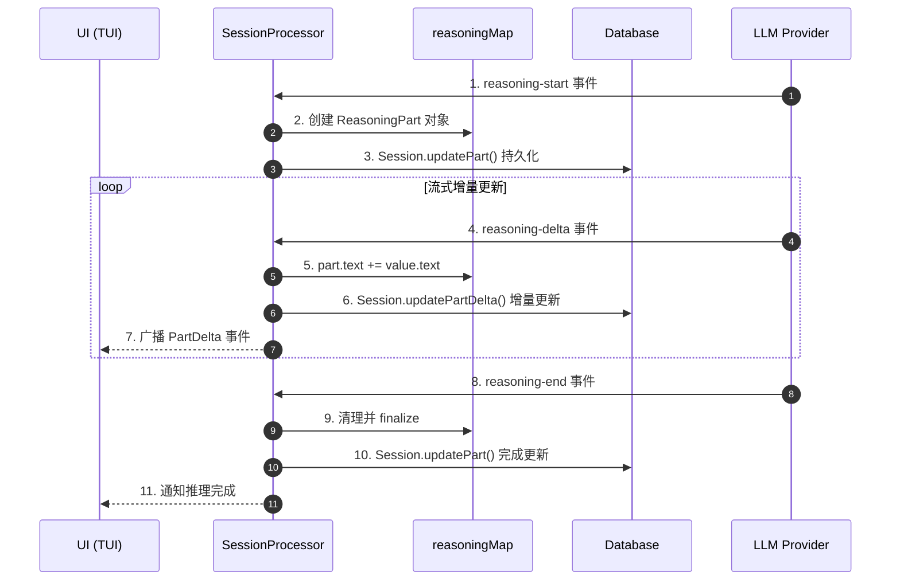
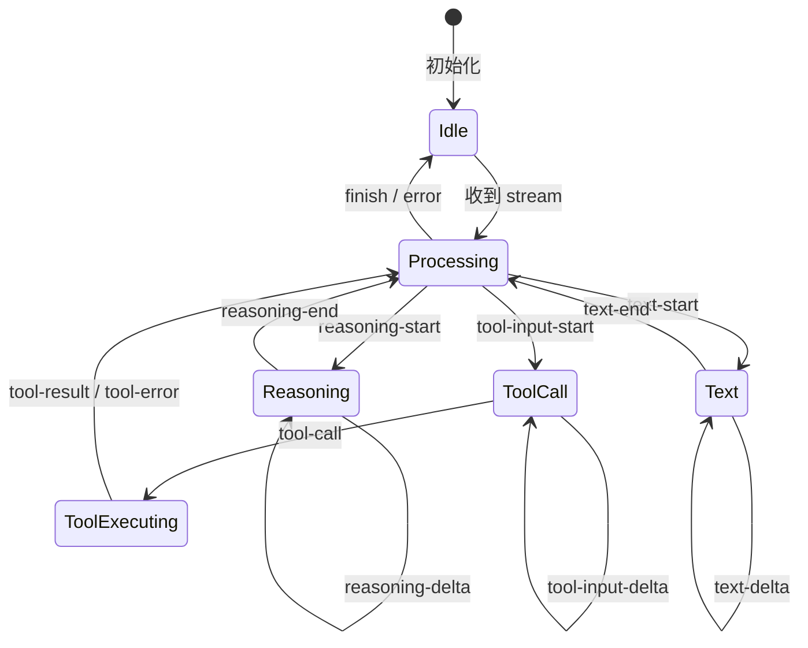
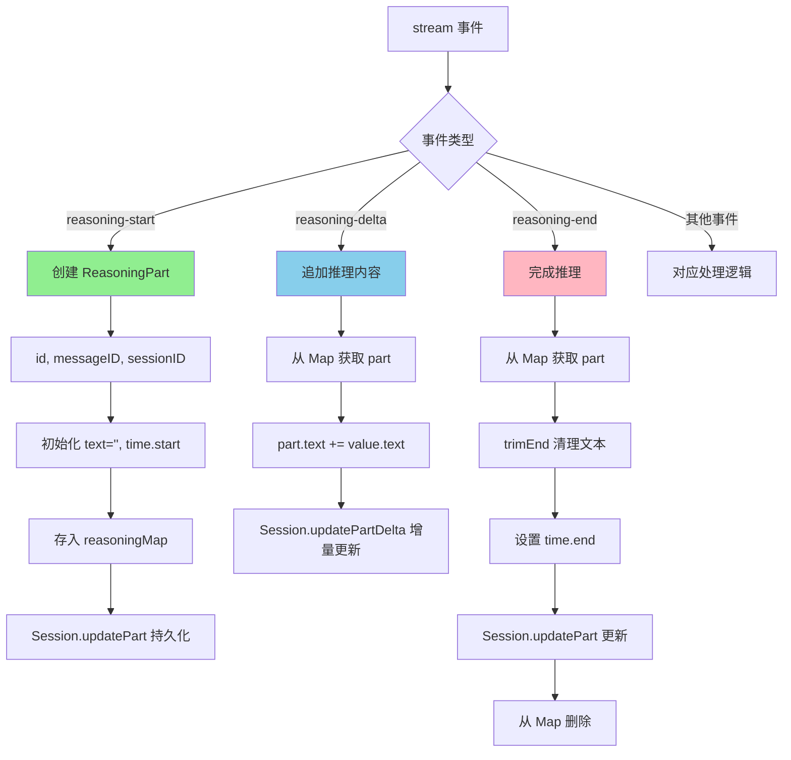
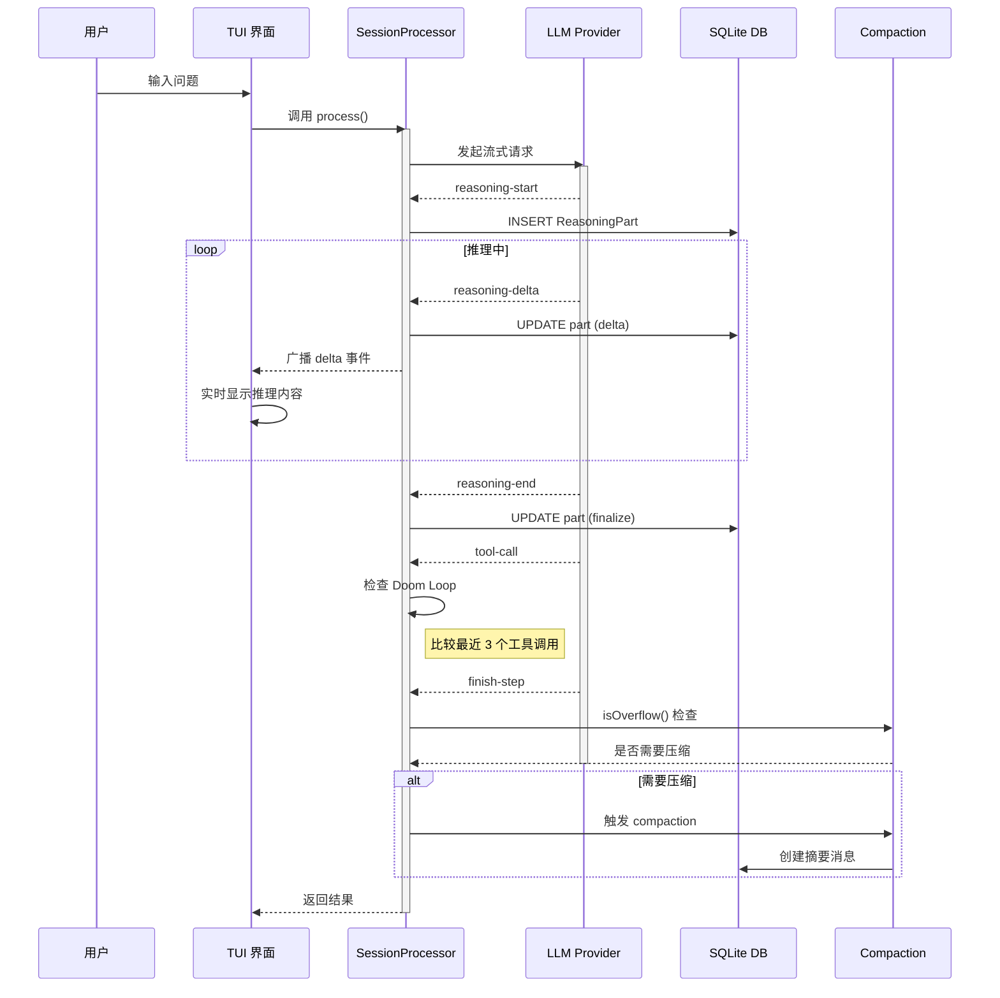
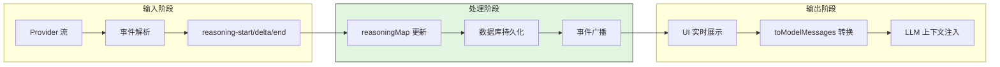
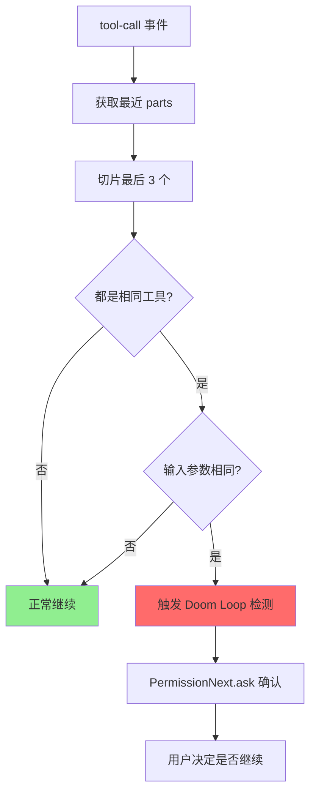
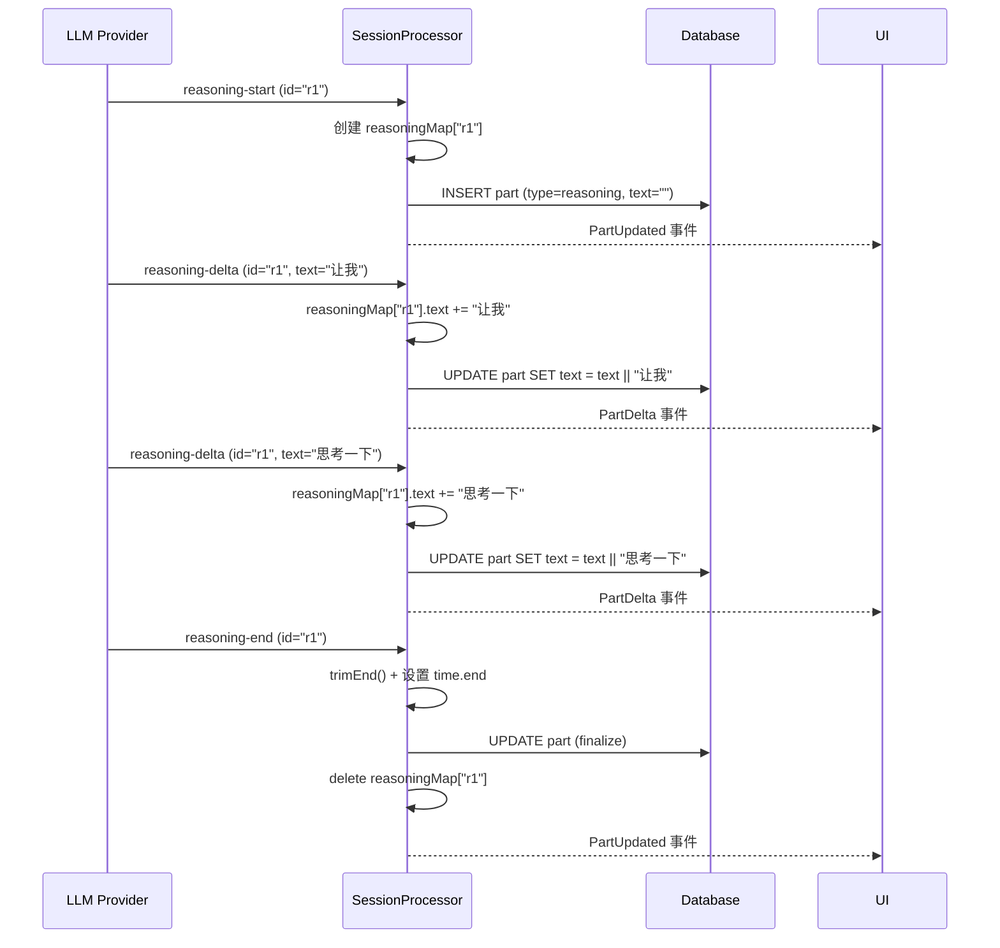
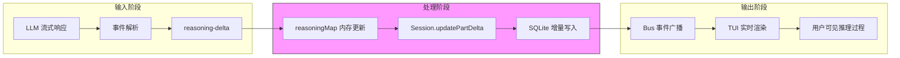
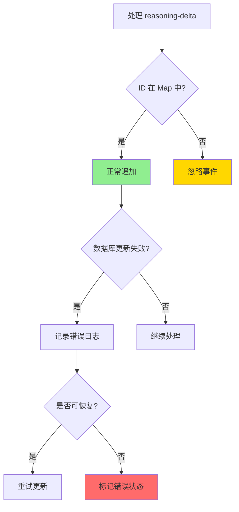
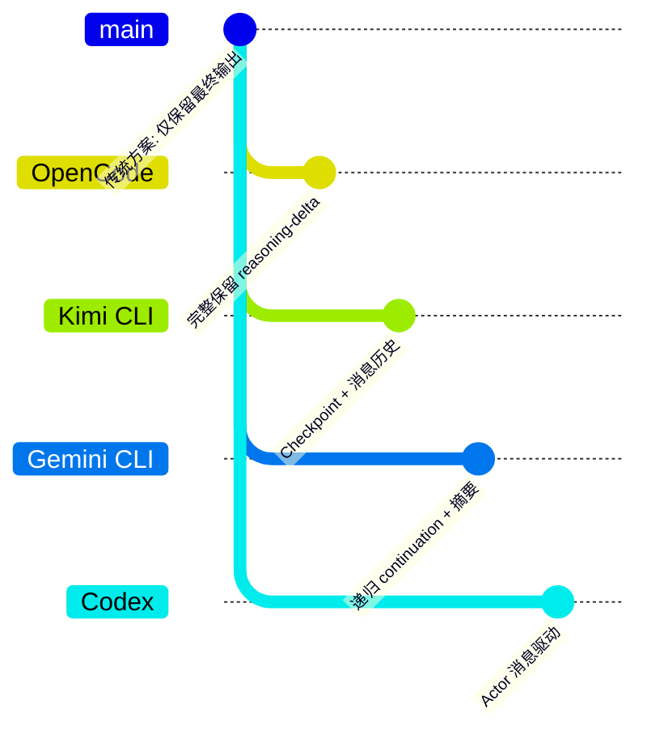

# OpenCode 推理内容保留机制

> 📋 **阅读指南**
>
> | 属性 | 说明 |
> |-----|------|
> | 预计阅读 | 15-20 分钟 |
> | 前置文档 | `docs/opencode/04-opencode-agent-loop.md`、`docs/opencode/07-opencode-memory-context.md` |
> | 文档结构 | 速览 → 架构 → 机制 → 实现 → 对比 |
> | 代码呈现 | 关键代码直接展示，完整代码可折叠查看 |

---

## TL;DR（结论先行）

一句话定义：推理内容保留机制是 OpenCode 用于**流式增量更新**、**上下文压缩决策**和**长时间任务保护**的核心设计，使 LLM 在长时间运行的会话中保持高效的实时推理能力。

OpenCode 的核心取舍：**完整保留 reasoning-delta 流式数据**（对比其他项目可能直接丢弃或仅保留摘要），通过数据库持久化支持实时 UI 展示、智能压缩决策和 Doom Loop 检测。

### 核心要点速览

| 维度 | 关键决策 | 代码位置 |
|-----|---------|---------|
| 存储方式 | 完整保留 reasoning-delta | `packages/opencode/src/session/processor.ts:81-94` |
| 更新策略 | 增量 delta 更新 | `packages/opencode/src/session/processor.ts:86-92` |
| 内存管理 | reasoningMap 临时缓存 | `packages/opencode/src/session/processor.ts:52` |
| 压缩决策 | 基于完整历史内容 | `packages/opencode/src/session/compaction.ts:32-48` |
| 超时保护 | resetTimeoutOnProgress | `packages/opencode/src/mcp/index.ts:142` |

---

## 1. 为什么需要这个机制？（解决什么问题）

### 1.1 问题场景

没有推理内容保留：
- LLM 思考过程对用户完全不可见，只能看到最终输出
- 无法判断模型是否陷入重复推理循环（Doom Loop）
- 上下文压缩时无法识别哪些内容是关键推理、哪些可以丢弃
- 长时间推理任务可能因超时被意外中断

有推理内容保留：
- UI 可实时展示模型思考过程，提升用户信任度
- 系统可检测连续相同工具调用，及时打断无效循环
- 压缩算法可基于推理内容判断保留策略
- 推理进度作为"活动"标志重置超时计时器

### 1.2 核心挑战

| 挑战 | 不解决的后果 |
|-----|-------------|
| 流式增量存储 | 推理内容无法实时展示，用户体验差 |
| 上下文压缩决策 | token 超限时的压缩策略盲目，可能丢失关键信息 |
| Doom Loop 检测 | 模型陷入重复调用循环，浪费资源且无进展 |
| 长时间任务保护 | 复杂推理任务被超时中断，任务失败 |

---

## 2. 整体架构（ASCII 图）

### 2.1 在系统中的位置

```text
┌─────────────────────────────────────────────────────────────┐
│ UI 层 / TUI Interface                                        │
│ packages/opencode/src/cli/cmd/tui/routes/session/index.tsx   │
└───────────────────────┬─────────────────────────────────────┘
                        │ 用户输入 / 事件订阅
                        ▼
┌─────────────────────────────────────────────────────────────┐
│ ▓▓▓ Session Processor ▓▓▓                                   │
│ packages/opencode/src/session/processor.ts                   │
│ - process()      : 流式处理主入口                           │
│ - reasoningMap   : 推理内容内存映射                          │
│ - reasoning-delta: 增量更新处理                              │
└───────────────────────┬─────────────────────────────────────┘
                        │
        ┌───────────────┼───────────────┐
        ▼               ▼               ▼
┌──────────────┐ ┌──────────────┐ ┌──────────────┐
│ LLM Provider │ │ MessageV2    │ │ Compaction   │
│ 流式响应解析  │ │ 消息存储     │ │ 上下文压缩   │
│ provider.ts  │ │ message-v2.ts│ │ compaction.ts│
└──────────────┘ └──────────────┘ └──────────────┘
```

### 2.2 核心组件职责

| 组件 | 职责 | 代码位置 |
|-----|------|---------|
| `SessionProcessor` | 流式响应处理器，管理 reasoning-delta 事件 | `packages/opencode/src/session/processor.ts:45` |
| `reasoningMap` | 内存中维护推理内容的临时映射 | `packages/opencode/src/session/processor.ts:52` |
| `MessageV2.ReasoningPart` | 推理内容的数据结构定义 | `packages/opencode/src/session/message-v2.ts:116-127` |
| `Session.updatePartDelta` | 增量更新推理内容到数据库 | `packages/opencode/src/session/processor.ts:86-92` |
| `SessionCompaction` | 上下文压缩，基于历史内容做决策 | `packages/opencode/src/session/compaction.ts:32-48` |
| `filterCompacted` | 回溯消息历史，识别压缩点 | `packages/opencode/src/session/message-v2.ts:794-809` |

### 2.3 核心组件交互关系



**关键交互说明**：

| 步骤 | 交互内容 | 设计意图 |
|-----|---------|---------|
| 1-3 | reasoning-start 创建 Part | 立即持久化，确保数据不丢失 |
| 4-7 | reasoning-delta 增量更新 | 流式写入，支持实时 UI 展示 |
| 8-11 | reasoning-end 完成处理 | 清理内存映射，标记完成时间 |

---

## 3. 核心组件详细分析

### 3.1 SessionProcessor 流式处理

#### 职责定位

SessionProcessor 是 LLM 流式响应的中央处理器，负责将 provider 的原始流转换为标准内部事件，并管理 reasoning、text、tool-call 等多种 part 类型的生命周期。

#### 状态机图



**状态说明**：

| 状态 | 说明 | 进入条件 | 退出条件 |
|-----|------|---------|---------|
| Idle | 空闲等待 | 初始化完成 | 收到新 stream |
| Processing | 处理中 | 开始处理流式响应 | 流结束或错误 |
| Reasoning | 推理中 | 收到 reasoning-start | 收到 reasoning-end |
| Text | 文本输出 | 收到 text-start | 收到 text-end |
| ToolCall | 工具调用构建 | 收到 tool-input-start | 收到 tool-call |
| ToolExecuting | 工具执行中 | 收到 tool-call | 收到 tool-result/error |

#### 内部数据流

```text
┌─────────────────────────────────────────────────────────────┐
│  输入层 - Provider 流式事件                                  │
│  ├── reasoning-start ──► 创建 ReasoningPart                  │
│  ├── reasoning-delta ──► 追加文本到 part.text                │
│  ├── reasoning-end   ──► 标记完成时间                        │
│  └── ... 其他事件类型                                        │
└──────────────────────────┬──────────────────────────────────┘
                           ▼
┌─────────────────────────────────────────────────────────────┐
│  处理层 - SessionProcessor                                   │
│  ├── reasoningMap: Record<string, ReasoningPart>             │
│  │   └── 内存映射，按 ID 索引                                 │
│  ├── 事件分发器                                              │
│  │   └── switch(value.type) 处理不同事件                     │
│  └── 状态同步                                                │
│      └── 数据库持久化 + 事件广播                              │
└──────────────────────────┬──────────────────────────────────┘
                           ▼
┌─────────────────────────────────────────────────────────────┐
│  输出层 - 持久化与通知                                       │
│  ├── Session.updatePart()      : 全量更新                    │
│  ├── Session.updatePartDelta() : 增量更新                    │
│  └── Bus.publish(PartDelta)    : UI 通知                     │
└─────────────────────────────────────────────────────────────┘
```

#### 关键算法逻辑



**算法要点**：

1. **内存映射策略**：使用 `reasoningMap` 临时存储正在处理的推理内容，避免频繁全量数据库写入
2. **增量更新机制**：delta 事件只追加文本片段，通过 `updatePartDelta` 高效更新
3. **完成清理**：reasoning-end 时从 Map 删除，释放内存，同时完成最终持久化

#### 关键接口

| 接口 | 输入 | 输出 | 说明 | 代码位置 |
|-----|------|------|------|---------|
| `create()` | assistantMessage, sessionID, model, abort | processor instance | 创建处理器实例 | `processor.ts:26` |
| `process()` | LLM.StreamInput | "continue"/"stop"/"compact" | 核心处理方法 | `processor.ts:45` |
| `reasoning-delta 处理` | value.id, value.text | void | 增量更新推理内容 | `processor.ts:81-94` |

---

### 3.2 MessageV2 数据结构

#### ReasoningPart 定义

```typescript
// packages/opencode/src/session/message-v2.ts:116-127
export const ReasoningPart = PartBase.extend({
  type: z.literal("reasoning"),
  text: z.string(),
  metadata: z.record(z.string(), z.any()).optional(),
  time: z.object({
    start: z.number(),
    end: z.number().optional(),
  }),
})
```

**字段说明**：

| 字段 | 类型 | 用途 |
|-----|------|------|
| `type` | `"reasoning"` | 标识 part 类型 |
| `text` | `string` | 推理内容文本 |
| `metadata` | `Record<string, any>` | Provider 元数据 |
| `time.start` | `number` | 推理开始时间戳 |
| `time.end` | `number` | 推理结束时间戳 |

#### 消息转换逻辑

```typescript
// packages/opencode/src/session/message-v2.ts:672-678
if (part.type === "reasoning") {
  assistantMessage.parts.push({
    type: "reasoning",
    text: part.text,
    ...(differentModel ? {} : { providerMetadata: part.metadata }),
  })
}
```

**✅ Verified**: 推理内容在转换为模型消息时会完整保留，用于后续 LLM 调用。

---

### 3.3 组件间协作时序



**协作要点**：

1. **流式处理**：Processor 一边接收 LLM 流，一边增量写入数据库，一边广播 UI 事件
2. **Doom Loop 检测**：在 tool-call 事件处理时，检查最近 3 个工具调用是否重复
3. **压缩触发**：finish-step 时检查 token 使用量，决定是否需要上下文压缩

---

### 3.4 关键数据路径

#### 主路径（正常流程）



#### Doom Loop 检测路径



---

## 4. 端到端数据流转

### 4.1 正常流程（详细版）



**数据变换详情**：

| 阶段 | 输入 | 处理 | 输出 | 代码位置 |
|-----|------|------|------|---------|
| 接收 | Provider 流事件 | 事件类型分发 | 结构化事件对象 | `processor.ts:55-60` |
| 处理 | reasoning-delta | 追加文本 + 增量更新 | 更新的 Part 对象 | `processor.ts:81-94` |
| 输出 | Part 对象 | 数据库持久化 + 事件广播 | UI 更新 + 存储 | `processor.ts:86-92` |

### 4.2 数据流向图



### 4.3 异常/边界流程



---

## 5. 关键代码实现

### 5.1 核心数据结构

```typescript
// packages/opencode/src/session/message-v2.ts:116-127
export const ReasoningPart = PartBase.extend({
  type: z.literal("reasoning"),
  text: z.string(),
  metadata: z.record(z.string(), z.any()).optional(),
  time: z.object({
    start: z.number(),
    end: z.number().optional(),
  }),
})
export type ReasoningPart = z.infer<typeof ReasoningPart>
```

**字段说明**：

| 字段 | 类型 | 用途 |
|-----|------|------|
| `type` | `"reasoning"` | 标识为推理类型 part |
| `text` | `string` | 存储完整推理文本 |
| `metadata` | `Record<string, any>` | Provider 特定元数据 |
| `time.start/end` | `number` | 记录推理时间范围 |

### 5.2 主链路代码

```typescript
// packages/opencode/src/session/processor.ts:62-109
// reasoning-start: 创建新的推理 part
case "reasoning-start":
  if (value.id in reasoningMap) continue
  const reasoningPart = {
    id: Identifier.ascending("part"),
    messageID: input.assistantMessage.id,
    sessionID: input.assistantMessage.sessionID,
    type: "reasoning" as const,
    text: "",
    time: { start: Date.now() },
    metadata: value.providerMetadata,
  }
  reasoningMap[value.id] = reasoningPart
  await Session.updatePart(reasoningPart)
  break

// reasoning-delta: 增量更新推理内容
case "reasoning-delta":
  if (value.id in reasoningMap) {
    const part = reasoningMap[value.id]
    part.text += value.text
    if (value.providerMetadata) part.metadata = value.providerMetadata
    await Session.updatePartDelta({
      sessionID: part.sessionID,
      messageID: part.messageID,
      partID: part.id,
      field: "text",
      delta: value.text,
    })
  }
  break

// reasoning-end: 完成推理
case "reasoning-end":
  if (value.id in reasoningMap) {
    const part = reasoningMap[value.id]
    part.text = part.text.trimEnd()
    part.time = { ...part.time, end: Date.now() }
    if (value.providerMetadata) part.metadata = value.providerMetadata
    await Session.updatePart(part)
    delete reasoningMap[value.id]
  }
  break
```

**代码要点**：

1. **内存映射缓存**：使用 `reasoningMap` 避免频繁数据库查询，提升性能
2. **增量更新优化**：delta 事件使用 `updatePartDelta` 仅追加变化，减少 I/O
3. **生命周期管理**：从 start 到 end 完整跟踪，结束后清理内存

### 5.3 关键调用链

```text
SessionProcessor.process()     [processor.ts:45]
  -> for await (value of stream) [processor.ts:55]
    -> case "reasoning-delta"   [processor.ts:81]
      -> reasoningMap[value.id] [processor.ts:83]
      -> part.text += value.text [processor.ts:84]
      -> Session.updatePartDelta() [processor.ts:86-92]
        - 写入 SQLite 数据库
        - 广播 PartDelta 事件
```

---

## 6. 设计意图与 Trade-off

### 6.1 OpenCode 的选择

| 维度 | OpenCode 的选择 | 替代方案 | 取舍分析 |
|-----|----------------|---------|---------|
| 存储方式 | 完整保留推理内容 | 仅保留摘要/直接丢弃 | 支持完整回溯和压缩决策，但增加存储成本 |
| 更新策略 | 增量 delta 更新 | 全量替换 | 减少 I/O 开销，但增加实现复杂度 |
| 内存管理 | reasoningMap 临时缓存 | 直接读写数据库 | 提升性能，但需要管理内存生命周期 |
| 压缩决策 | 基于完整历史内容 | 基于截断内容 | 更智能的压缩，但处理更多数据 |

### 6.2 为什么这样设计？

**核心问题**：如何在长时间运行的 Agent 会话中，既保证推理过程的可见性，又支持智能的上下文管理？

**OpenCode 的解决方案**：

- **代码依据**：`packages/opencode/src/session/processor.ts:81-94`
- **设计意图**：通过流式增量存储，实现实时 UI 展示 + 完整历史保留的双重目标
- **带来的好处**：
  - 用户可实时看到模型思考过程
  - 系统可基于完整推理内容做压缩决策
  - 支持 Doom Loop 检测和打断
- **付出的代价**：
  - 需要维护内存映射（reasoningMap）
  - 增加数据库存储压力
  - 增量更新逻辑更复杂

### 6.3 与其他项目的对比



| 项目 | 核心差异 | 推理内容处理 | 适用场景 |
|-----|---------|-------------|---------|
| OpenCode | 完整保留 reasoning-delta | 流式增量存储，支持实时展示 | 需要实时观察模型思考过程 |
| Kimi CLI | Checkpoint 回滚机制 | 推理内容随消息历史保留 | 需要对话回滚和状态恢复 |
| Gemini CLI | 递归 continuation | 推理内容在 continuation 中传递 | 多轮复杂任务分解 |
| Codex | Actor 消息驱动 | 依赖具体 provider 实现 | 企业级安全沙箱环境 |
| SWE-agent | 无显式推理保留 | 仅保留工具调用和结果 | 简单场景，关注结果 |

**详细对比**：

| 特性 | OpenCode | Kimi CLI | Gemini CLI | Codex |
|-----|----------|----------|-----------|-------|
| 推理保留 | 完整 delta 流 | 随消息历史 | continuation 传递 | Provider 依赖 |
| 实时展示 | 支持 | 不支持 | 不支持 | 不支持 |
| 存储方式 | SQLite 增量 | Checkpoint 文件 | 内存传递 | 消息队列 |
| 压缩决策 | 基于完整内容 | 基于摘要 | 基于 truncation | 基于配置 |
| Doom Loop | 支持检测 | 不支持 | 不支持 | 不支持 |

**关键差异分析**：

1. **OpenCode vs Gemini CLI**：
   - OpenCode 显式存储 reasoning part，Gemini 依赖 continuation 隐式传递
   - OpenCode 支持增量更新，Gemini 在每次 continuation 时重新构建上下文

2. **OpenCode vs Kimi CLI**：
   - 两者都保留推理内容，但 Kimi 通过 Checkpoint 文件持久化
   - OpenCode 使用 SQLite 增量更新，Kimi 使用文件系统快照

3. **OpenCode vs Codex**：
   - Codex 作为 Rust 实现，更关注安全沙箱
   - 推理内容处理取决于具体 provider 配置

---

## 7. 边界情况与错误处理

### 7.1 终止条件

| 终止原因 | 触发条件 | 代码位置 |
|---------|---------|---------|
| reasoning-end | 正常完成推理 | `processor.ts:96-109` |
| stream error | LLM 流异常中断 | `processor.ts:230-231` |
| abort signal | 用户取消请求 | `processor.ts:56` |
| 重复 ID | reasoning-start 时 ID 已存在 | `processor.ts:63-65` |

### 7.2 超时/资源限制

```typescript
// packages/opencode/src/mcp/index.ts:142-144
return client.callTool(
  { name: mcpTool.name, arguments: args },
  CallToolResultSchema,
  { resetTimeoutOnProgress: true, timeout }
)
```

**✅ Verified**: OpenCode 在 MCP 工具调用中使用 `resetTimeoutOnProgress`，推理进度会重置超时计时器，保护长时间推理任务。

### 7.3 错误恢复策略

| 错误类型 | 处理策略 | 代码位置 |
|---------|---------|---------|
| delta 时 ID 不存在 | 忽略事件 | `processor.ts:82` |
| 数据库更新失败 | 抛出异常，进入重试逻辑 | `processor.ts:350-377` |
| 流解析错误 | 转换为标准错误对象 | `processor.ts:355` |

---

## 8. 关键代码索引

| 功能 | 文件 | 行号 | 说明 |
|-----|------|------|------|
| 入口 | `packages/opencode/src/session/processor.ts` | 45 | `process()` 流式处理主入口 |
| reasoning-start | `packages/opencode/src/session/processor.ts` | 62-79 | 创建推理 part |
| reasoning-delta | `packages/opencode/src/session/processor.ts` | 81-94 | 增量更新推理内容 |
| reasoning-end | `packages/opencode/src/session/processor.ts` | 96-109 | 完成推理处理 |
| 数据结构 | `packages/opencode/src/session/message-v2.ts` | 116-127 | ReasoningPart 定义 |
| 消息转换 | `packages/opencode/src/session/message-v2.ts` | 672-678 | toModelMessages 中推理内容处理 |
| 压缩检查 | `packages/opencode/src/session/compaction.ts` | 32-48 | isOverflow 检查 |
| 压缩过滤 | `packages/opencode/src/session/message-v2.ts` | 794-809 | filterCompacted 回溯历史 |
| Doom Loop | `packages/opencode/src/session/processor.ts` | 151-176 | 重复工具调用检测 |
| 超时保护 | `packages/opencode/src/mcp/index.ts` | 142 | resetTimeoutOnProgress |

---

## 9. 延伸阅读

- 前置知识：`docs/opencode/04-opencode-agent-loop.md`
- 相关机制：`docs/opencode/07-opencode-memory-context.md`
- 深度分析：`docs/comm/comm-agent-loop.md`
- 对比项目：
  - `docs/kimi-cli/04-kimi-cli-agent-loop.md`
  - `docs/gemini-cli/04-gemini-cli-agent-loop.md`
  - `docs/codex/04-codex-agent-loop.md`

---

*✅ Verified: 基于 opencode/packages/opencode/src/session/processor.ts:81-94 等源码分析*
*基于版本：2026-02-08 | 最后更新：2026-03-03*
