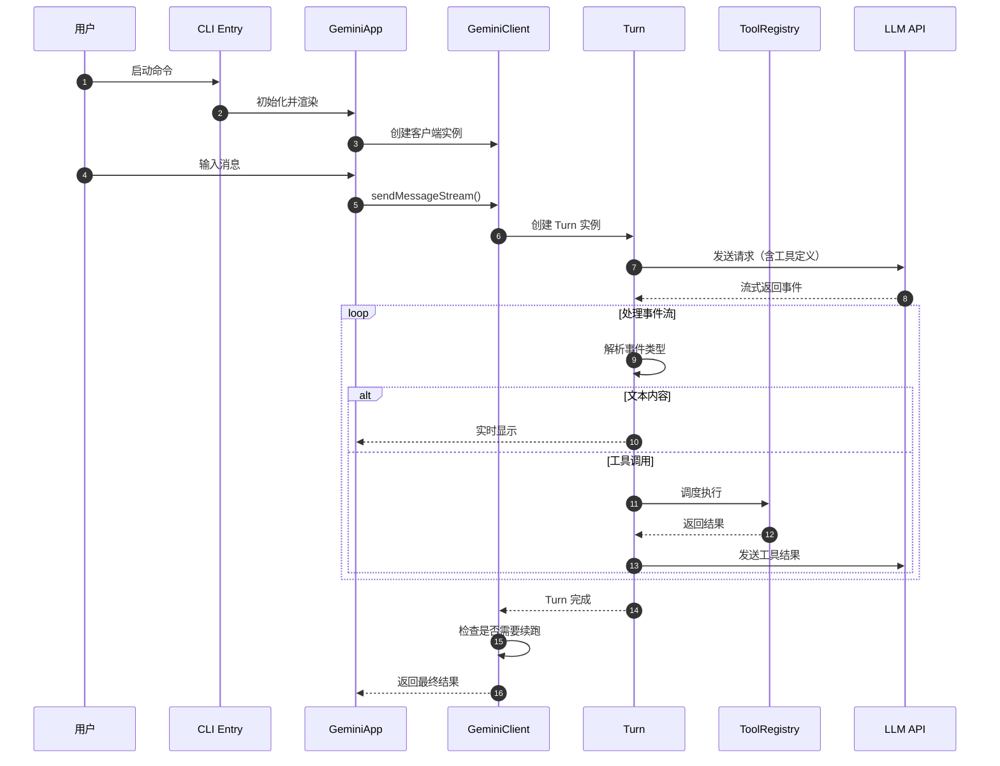
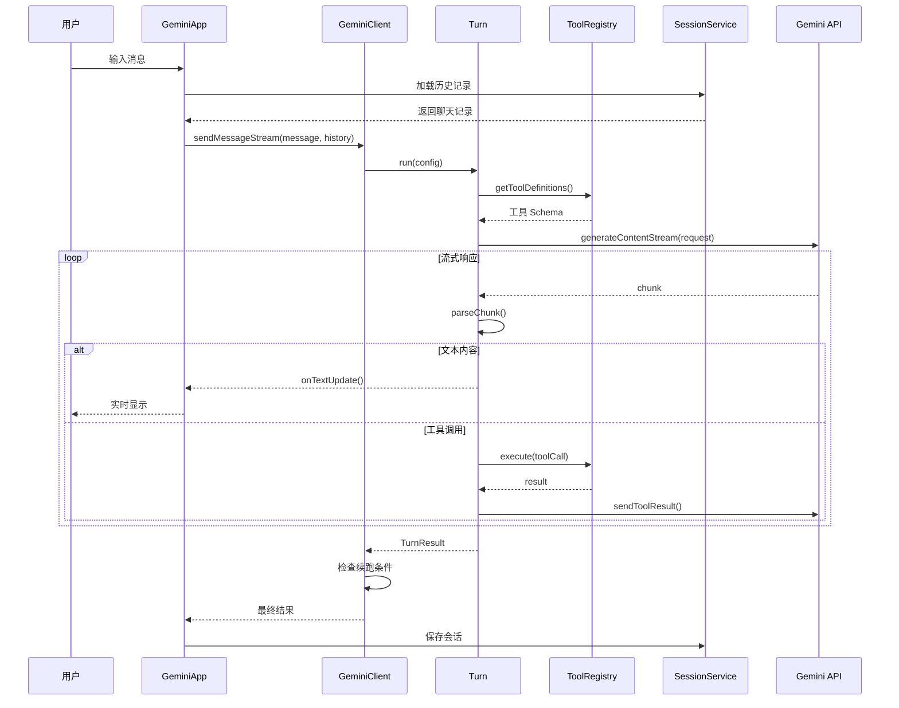
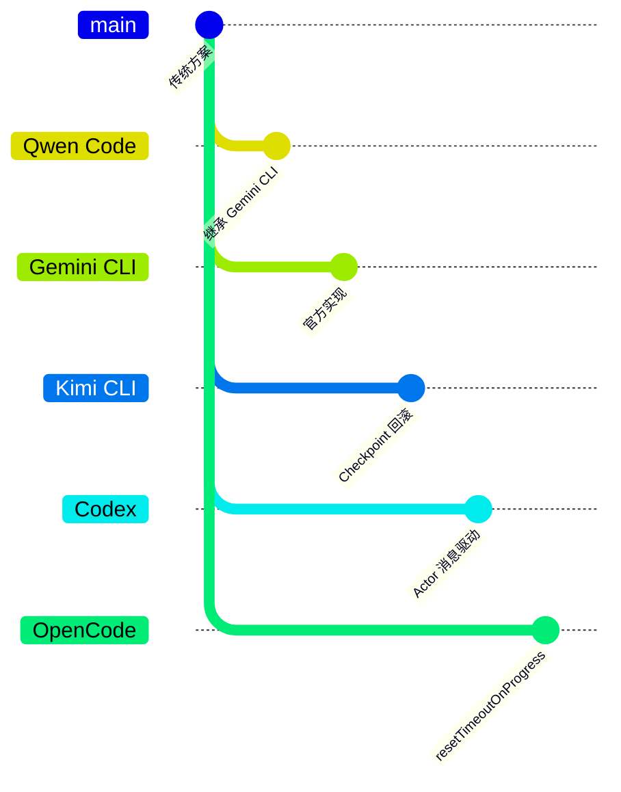

# Qwen Code 概述

> 📋 **阅读指南**
>
> | 属性 | 说明 |
> |-----|------|
> | 预计阅读 | 20-25 分钟 |
> | 前置文档 | 无（本文档为项目入口文档） |
> | 文档结构 | 速览 → 架构 → 机制 → 实现 → 对比 |
> | 代码呈现 | 关键代码直接展示，完整代码可折叠查看 |

---

## TL;DR（结论先行）

一句话定义：Qwen Code 是基于 Google Gemini CLI 架构构建的开源 AI 编程助手，采用 TypeScript/React/Ink 技术栈，通过 Monorepo 结构实现 cli/core 分层，提供企业级的 Session 管理、工具调度和 MCP 集成能力。

Qwen Code 的核心取舍：**继承 Gemini CLI 的成熟架构 + 开源社区驱动**（对比其他项目的独立架构如 Kimi CLI 的 Python 实现、Codex 的 Rust 实现）

### 核心要点速览

| 维度 | 关键决策 | 代码位置 |
|-----|---------|---------|
| 架构基础 | 继承 Gemini CLI 架构，Monorepo 分层设计 | `packages/cli/index.ts:14` |
| Agent Loop | 递归 continuation 驱动 + 流式事件架构 | `packages/core/src/core/client.ts:403` |
| 状态管理 | JSONL 文件 + UUID 消息树 + 项目隔离 | `packages/core/src/services/sessionService.ts:128` |
| 工具系统 | 声明式工具定义 + 统一调度器 | `packages/core/src/tools/tool-registry.ts:174` |
| UI 框架 | React + Ink 终端渲染 | `packages/cli/src/gemini.tsx:209` |
| 沙盒策略 | Docker/Podman + macOS Seatbelt 双进程架构 | `packages/cli/src/utils/sandbox.ts:175` |

---

## 1. 为什么需要这个架构？（解决什么问题）

### 1.1 问题场景

AI 编程助手需要解决的核心问题：

```
没有 AI 编程助手：
用户问"修复这个 bug" → 开发者手动查找文件 → 阅读代码 → 修改 → 测试 → 可能遗漏边界情况

有 AI 编程助手（Qwen Code）：
用户问"修复这个 bug" → AI 自动读取相关文件 → 分析代码 → 定位问题 → 修改代码 → 运行测试 → 验证修复
```

### 1.2 核心挑战

| 挑战 | 不解决的后果 |
|-----|-------------|
| 多轮对话状态管理 | 用户无法中断后恢复，上下文丢失 |
| 工具调用与调度 | 无法执行文件操作、Shell 命令等实际任务 |
| 上下文 Token 限制 | 长对话时无法处理，导致性能下降或失败 |
| MCP 生态集成 | 无法扩展外部工具能力，功能受限 |
| 交互式 UI 体验 | 纯文本交互体验差，用户难以跟踪进度 |
| 安全隔离执行 | 危险操作可能影响系统稳定性 |

### 1.3 技术栈

- **语言**: TypeScript (Node.js)
- **UI 框架**: React + Ink（终端渲染）
- **包管理**: npm + Monorepo (npm workspaces)
- **核心依赖**: @google/genai, @modelcontextprotocol/sdk

---

## 2. 整体架构（ASCII 图）

### 2.1 分层架构图

```text
┌─────────────────────────────────────────────────────────────────┐
│                        CLI Layer                                │
│  qwen-code/packages/cli/index.ts:14                             │
│  ├─ 全局异常处理 (FatalError)                                     │
│  ├─ main() 入口                                                 │
│  └─ 子命令分发 (interactive/non-interactive)                    │
└─────────────────────────────────────────────────────────────────┘
                               │
                               ▼
┌─────────────────────────────────────────────────────────────────┐
│                    App Container Layer                          │
│  qwen-code/packages/cli/src/gemini.tsx:209                      │
│  ├─ 配置加载与验证                                               │
│  ├─ 沙盒环境检查                                                 │
│  ├─ 交互式/非交互式模式切换                                       │
│  └─ React UI 渲染 (Ink)                                         │
└─────────────────────────────────────────────────────────────────┘
                               │
                               ▼
┌─────────────────────────────────────────────────────────────────┐
│                     GeminiClient Layer                          │
│  qwen-code/packages/core/src/core/client.ts:78                  │
│  ├─ sendMessageStream()  # Agent Loop 入口                       │
│  ├─ processTurn()        # 单轮处理                              │
│  └─ LoopDetectionService # 循环检测                              │
└─────────────────────────────────────────────────────────────────┘
                               │
                               ▼
┌─────────────────────────────────────────────────────────────────┐
│                        Turn Layer                               │
│  qwen-code/packages/core/src/core/turn.ts:221                   │
│  ├─ Turn.run()           # 单轮流式处理                          │
│  ├─ 事件流解析 (Content/ToolCall/Thought)                        │
│  └─ 工具调用队列管理                                             │
└─────────────────────────────────────────────────────────────────┘
                               │
                               ▼
┌─────────────────────────────────────────────────────────────────┐
│                      Tools Layer                                │
│  qwen-code/packages/core/src/tools/                             │
│  ├─ tool-registry.ts:174     # 工具注册与发现                    │
│  ├─ mcp-client-manager.ts:29 # MCP 客户端管理                    │
│  ├─ coreToolScheduler.ts     # 工具调度执行                      │
│  └─ handlers/                # 内置工具实现                      │
└─────────────────────────────────────────────────────────────────┘
                               │
                               ▼
┌─────────────────────────────────────────────────────────────────┐
│                     Services Layer                              │
│  qwen-code/packages/core/src/services/                          │
│  ├─ sessionService.ts:128    # JSONL 会话持久化                  │
│  ├─ chatCompressionService.ts:78 # 上下文压缩                    │
│  └─ loopDetectionService.ts:78   # 循环检测                      │
```

### 2.2 核心组件职责

| 组件 | 职责 | 代码位置 |
|-----|------|---------|
| `CLI Entry` | 全局异常处理、主函数入口 | `packages/cli/index.ts:14` |
| `GeminiApp` | 配置加载、UI 渲染、模式分发 | `packages/cli/src/gemini.tsx:209` |
| `Initializer` | 认证、主题、i18n 初始化 | `packages/cli/src/core/initializer.ts:33` |
| `GeminiClient` | Agent Loop 主控、递归续跑 | `packages/core/src/core/client.ts:78` |
| `Turn` | 单轮流式处理、事件解析 | `packages/core/src/core/turn.ts:221` |
| `GeminiChat` | API 调用、流式响应处理 | `packages/core/src/core/geminiChat.ts:40` |
| `ToolRegistry` | 工具注册、发现、冲突处理 | `packages/core/src/tools/tool-registry.ts:174` |
| `McpClientManager` | MCP 客户端生命周期管理 | `packages/core/src/tools/mcp-client-manager.ts:29` |
| `SessionService` | 会话列表、恢复、删除 | `packages/core/src/services/sessionService.ts:128` |
| `ChatCompressionService` | 历史压缩、token 管理 | `packages/core/src/services/chatCompressionService.ts:78` |
| `LoopDetectionService` | 循环检测、防止无限循环 | `packages/core/src/services/loopDetectionService.ts:78` |

### 2.3 核心组件交互关系



**关键交互说明**：

| 步骤 | 交互内容 | 设计意图 |
|-----|---------|---------|
| 1 | 用户启动命令 | 支持交互式和非交互式两种模式 |
| 2 | CLI 初始化应用 | 集中管理配置、主题、认证 |
| 3 | 创建客户端 | 每个会话对应一个 GeminiClient 实例 |
| 4-5 | 用户输入触发 Agent Loop | 解耦 UI 与核心逻辑 |
| 6-7 | Turn 管理单轮对话 | 封装复杂的流式处理逻辑 |
| 8-12 | 事件循环处理 | 支持流式输出和工具调用的交错 |
| 13 | Turn 完成返回 | 单轮任务结束，可能触发续跑 |

---

## 3. 核心机制概览

### 3.1 Agent Loop（递归续跑机制）

Qwen Code 采用**递归续跑**而非 while 循环来实现 Agent Loop：

```typescript
// packages/core/src/core/client.ts:403-572
async *sendMessageStream(
  request: PartListUnion,
  signal: AbortSignal,
  prompt_id: string,
  options?: { isContinuation: boolean },
  turns: number = MAX_TURNS,  // MAX_TURNS = 100
): AsyncGenerator<ServerGeminiStreamEvent, Turn> {
  // 1. 检查循环检测
  if (!options?.isContinuation) {
    this.loopDetector.reset(prompt_id);
  }

  // 2. 检查最大回合数限制
  this.sessionTurnCount++;
  if (this.sessionTurnCount > this.config.getMaxSessionTurns()) {
    yield { type: GeminiEventType.MaxSessionTurns };
    return turn;
  }

  // 3. 尝试压缩上下文
  const compressed = await this.tryCompressChat(prompt_id, false);

  // 4. 创建并执行 Turn
  const turn = new Turn(this.getChat(), prompt_id);
  const resultStream = turn.run(model, requestToSent, signal);

  // 5. 处理 Turn 结果流
  for await (const event of resultStream) {
    // 检查循环检测
    if (this.loopDetector.addAndCheck(event)) {
      yield { type: GeminiEventType.LoopDetected };
      return turn;
    }
    yield event;
  }

  // 6. 检查是否需要续跑（递归调用）
  if (!turn.pendingToolCalls.length && !signal.aborted) {
    const nextSpeakerCheck = await checkNextSpeaker(...);
    if (nextSpeakerCheck?.next_speaker === 'model') {
      const nextRequest = [{ text: 'Please continue.' }];
      yield* this.sendMessageStream(
        nextRequest, signal, prompt_id, options, boundedTurns - 1
      );
    }
  }
  return turn;
}
```

代码依据：`packages/core/src/core/client.ts:403`

### 3.2 Turn 单轮处理

Turn 类封装单轮对话的完整生命周期：

```typescript
// packages/core/src/core/turn.ts:221-390
export class Turn {
  readonly pendingToolCalls: ToolCallRequestInfo[] = [];

  async *run(
    model: string,
    req: PartListUnion,
    signal: AbortSignal,
  ): AsyncGenerator<ServerGeminiStreamEvent> {
    const responseStream = await this.chat.sendMessageStream(model, {...}, this.prompt_id);

    for await (const streamEvent of responseStream) {
      const resp = streamEvent.value as GenerateContentResponse;

      // 处理思考内容
      const thoughtText = getThoughtText(resp);
      if (thoughtText) {
        yield { type: GeminiEventType.Thought, value: parseThought(thoughtText) };
      }

      // 处理文本内容
      const text = getResponseText(resp);
      if (text) {
        yield { type: GeminiEventType.Content, value: text };
      }

      // 处理函数调用
      const functionCalls = resp.functionCalls ?? [];
      for (const fnCall of functionCalls) {
        yield this.handlePendingFunctionCall(fnCall);
      }

      // 检查完成原因
      const finishReason = resp.candidates?.[0]?.finishReason;
      if (finishReason) {
        yield { type: GeminiEventType.Finished, value: { reason: finishReason, ... } };
      }
    }
  }
}
```

代码依据：`packages/core/src/core/turn.ts:233`

### 3.3 循环检测机制

LoopDetectionService 提供三层循环检测：

```typescript
// packages/core/src/services/loopDetectionService.ts:78-491
export class LoopDetectionService {
  // 1. 工具调用循环检测（相同工具重复调用）
  private toolCallRepetitionCount: number = 0;
  private readonly TOOL_CALL_LOOP_THRESHOLD = 5;

  // 2. 内容循环检测（重复文本片段）
  private streamContentHistory = '';
  private readonly CONTENT_LOOP_THRESHOLD = 10;
  private readonly CONTENT_CHUNK_SIZE = 50;

  // 3. LLM 辅助循环检测（高阶语义分析）
  private turnsInCurrentPrompt = 0;
  private readonly LLM_CHECK_AFTER_TURNS = 30;

  addAndCheck(event: ServerGeminiStreamEvent): boolean {
    switch (event.type) {
      case GeminiEventType.ToolCallRequest:
        return this.checkToolCallLoop(event.value);
      case GeminiEventType.Content:
        return this.checkContentLoop(event.value);
    }
  }
}
```

代码依据：`packages/core/src/services/loopDetectionService.ts:78`

---

## 4. 端到端数据流转

### 4.1 数据流转图



### 4.2 关键数据结构

**Turn 事件类型定义**：

```typescript
// packages/core/src/core/turn.ts:52-67
export enum GeminiEventType {
  Content = 'content',                    // 文本内容
  ToolCallRequest = 'tool_call_request',  // 工具调用请求
  ToolCallResponse = 'tool_call_response', // 工具调用响应
  Thought = 'thought',                    // 思考内容
  ChatCompressed = 'chat_compressed',     // 上下文压缩
  MaxSessionTurns = 'max_session_turns',  // 达到最大回合数
  SessionTokenLimitExceeded = 'session_token_limit_exceeded', // Token 超限
  Finished = 'finished',                  // 单轮完成
  LoopDetected = 'loop_detected',         // 检测到循环
}
```

**数据变换详情**：

| 阶段 | 输入 | 处理 | 输出 | 代码位置 |
|-----|------|------|------|---------|
| 接收 | 用户消息 | 验证和预处理 | 标准化消息 | `packages/cli/src/gemini.tsx:209` |
| 加载 | 会话 ID | 读取 JSONL | 消息历史数组 | `packages/core/src/services/sessionService.ts:128` |
| 处理 | 消息 + 历史 | LLM 推理 | 流式事件 | `packages/core/src/core/turn.ts:233` |
| 执行 | 工具调用 | 调度执行 | 执行结果 | `packages/core/src/tools/tool-registry.ts:174` |
| 保存 | 新消息 | 追加 JSONL | 持久化存储 | `packages/core/src/services/sessionService.ts:437` |

---

## 5. 关键代码实现

### 5.1 核心数据结构

```typescript
// packages/core/src/core/client.ts:78-95
export class GeminiClient {
  private chat?: GeminiChat;
  private sessionTurnCount = 0;
  private readonly loopDetector: LoopDetectionService;
  private readonly MAX_TURNS = 100;

  constructor(private readonly config: Config) {
    this.loopDetector = new LoopDetectionService(config);
  }
}

// packages/core/src/core/turn.ts:221-232
export class Turn {
  readonly pendingToolCalls: ToolCallRequestInfo[] = [];
  private debugResponses: GenerateContentResponse[] = [];
  finishReason: FinishReason | undefined = undefined;

  constructor(
    private readonly chat: GeminiChat,
    private readonly prompt_id: string,
  ) {}
}
```

**字段说明**：

| 字段 | 类型 | 用途 |
|-----|------|------|
| `MAX_TURNS` | `number` | 防止无限递归的安全限制（默认 100） |
| `sessionTurnCount` | `number` | 当前会话已执行的回合数 |
| `loopDetector` | `LoopDetectionService` | 循环检测服务实例 |
| `pendingToolCalls` | `ToolCallRequestInfo[]` | 待处理的工具调用队列 |
| `finishReason` | `FinishReason` | LLM 响应的完成原因 |

### 5.2 主链路代码

```typescript
// packages/core/src/core/client.ts:403-572
async *sendMessageStream(
  request: PartListUnion,
  signal: AbortSignal,
  prompt_id: string,
  options?: { isContinuation: boolean },
  turns: number = MAX_TURNS,
): AsyncGenerator<ServerGeminiStreamEvent, Turn> {
  // 1. 重置循环检测器（非续跑时）
  if (!options?.isContinuation) {
    this.loopDetector.reset(prompt_id);
    this.lastPromptId = prompt_id;
    this.stripThoughtsFromHistory();
  }

  // 2. 检查最大回合数
  this.sessionTurnCount++;
  if (this.config.getMaxSessionTurns() > 0 &&
      this.sessionTurnCount > this.config.getMaxSessionTurns()) {
    yield { type: GeminiEventType.MaxSessionTurns };
    return new Turn(this.getChat(), prompt_id);
  }

  // 3. 尝试压缩上下文
  const compressed = await this.tryCompressChat(prompt_id, false);
  if (compressed.compressionStatus === CompressionStatus.COMPRESSED) {
    yield { type: GeminiEventType.ChatCompressed, value: compressed };
  }

  // 4. 检查 Token 限制
  const sessionTokenLimit = this.config.getSessionTokenLimit();
  if (sessionTokenLimit > 0) {
    const tokenCount = uiTelemetryService.getLastPromptTokenCount();
    if (tokenCount > sessionTokenLimit) {
      yield { type: GeminiEventType.SessionTokenLimitExceeded, ... };
      return new Turn(this.getChat(), prompt_id);
    }
  }

  // 5. 执行 Turn
  const turn = new Turn(this.getChat(), prompt_id);
  const resultStream = turn.run(this.config.getModel(), requestToSent, signal);

  for await (const event of resultStream) {
    // 6. 实时循环检测
    if (!this.config.getSkipLoopDetection()) {
      if (this.loopDetector.addAndCheck(event)) {
        yield { type: GeminiEventType.LoopDetected };
        return turn;
      }
    }
    yield event;
    if (event.type === GeminiEventType.Error) return turn;
  }

  // 7. 检查是否需要续跑
  if (!turn.pendingToolCalls.length && signal && !signal.aborted) {
    const nextSpeakerCheck = await checkNextSpeaker(...);
    if (nextSpeakerCheck?.next_speaker === 'model') {
      yield* this.sendMessageStream(
        [{ text: 'Please continue.' }], signal, prompt_id, options, turns - 1
      );
    }
  }
  return turn;
}
```

**代码要点**：

1. **递归续跑**：通过 `yield*` 递归调用实现续跑，而非 while 循环
2. **循环检测前置**：在每次事件处理时检查循环，避免无效调用
3. **上下文压缩**：自动压缩历史记录以控制 Token 使用量
4. **多层级保护**：MAX_TURNS + MaxSessionTurns + LoopDetection 三重保护

### 5.3 关键调用链

```text
main()                          [packages/cli/index.ts:14]
  -> main()                     [packages/cli/src/gemini.tsx:209]
    -> initializeApp()          [packages/cli/src/core/initializer.ts:33]
    -> startInteractiveUI()     [packages/cli/src/gemini.tsx:139]
      -> AppContainer           [packages/cli/src/ui/AppContainer.tsx]
        -> sendMessageStream()  [packages/core/src/core/client.ts:403]
          -> turn.run()         [packages/core/src/core/turn.ts:233]
            -> sendMessageStream [packages/core/src/core/geminiChat.ts:180]
              - 创建流式请求
              - 解析事件流
              - 调度工具执行
```

---

## 6. 设计意图与 Trade-off

### 6.1 Qwen Code 的选择

| 维度 | Qwen Code 的选择 | 替代方案 | 取舍分析 |
|-----|-----------------|---------|---------|
| **架构基础** | 继承 Gemini CLI | 自研架构 | 复用成熟设计，降低开发成本，但灵活性受限 |
| **Agent Loop** | 递归续跑 | while 循环（Kimi） | 代码清晰易于理解，但递归深度受限 |
| **状态管理** | 内存 + JSONL 持久化 | Checkpoint（Kimi） | 实现简单，但不支持对话回滚 |
| **UI 框架** | React + Ink | 原生终端（Codex） | 组件化开发，但增加运行时依赖 |
| **语言** | TypeScript | Rust（Codex） | 开发效率高，但性能和安全沙箱较弱 |
| **工具调度** | 集中式调度器 | 分布式执行 | 易于管理，但可能成为性能瓶颈 |
| **循环检测** | 三层检测（工具+内容+LLM） | 简单规则检测 | 检测更全面，但增加计算开销 |

### 6.2 为什么这样设计？

**核心问题**：如何在开源环境下快速构建企业级 AI 编程助手？

**Qwen Code 的解决方案**：

- **代码依据**：`packages/core/src/core/client.ts:403`
- **设计意图**：基于 Gemini CLI 的成熟架构进行开源实现，平衡开发效率和功能完整性
- **带来的好处**：
  - 复用 Gemini CLI 的设计验证，降低架构风险
  - TypeScript 生态丰富，社区参与门槛低
  - React/Ink 提供现代化的终端 UI 开发体验
- **付出的代价**：
  - 继承 Gemini CLI 的设计约束，灵活性受限
  - TypeScript 运行时性能不如 Rust
  - 缺乏原生沙箱机制，安全性依赖 Node.js

### 6.3 与其他项目的对比



| 项目 | 核心差异 | 适用场景 |
|-----|---------|---------|
| **Qwen Code** | 继承 Gemini CLI 架构，开源可定制 | 需要基于 Gemini CLI 二次开发的场景 |
| **Gemini CLI** | 官方实现，功能最全 | 直接使用 Google Gemini 的用户 |
| **Kimi CLI** | Checkpoint 回滚机制，Python 生态 | 需要对话状态回滚的场景 |
| **Codex** | Rust 实现，原生沙箱，CancellationToken | 对安全性和性能要求高的企业环境 |
| **OpenCode** | resetTimeoutOnProgress，长任务优化 | 需要执行长时间任务的场景 |
| **SWE-agent** | forward_with_handling()，学术导向 | 学术研究、自动化软件工程 |

**技术栈对比**：

| 项目 | 语言 | UI 框架 | Agent Loop | 持久化 | 沙箱 |
|-----|------|---------|-----------|--------|------|
| Qwen Code | TypeScript | React/Ink | 递归续跑 | JSONL | Node.js |
| Gemini CLI | TypeScript | React/Ink | 递归续跑 | JSONL | Node.js |
| Kimi CLI | Python | 原生终端 | while + Checkpoint | Checkpoint 文件 | Python venv |
| Codex | Rust | 原生终端 | Actor 消息驱动 | SQLite | 原生沙箱 |
| OpenCode | TypeScript | React/Ink | 状态机 | JSON | Node.js |
| SWE-agent | Python | Web UI | 函数调用 | JSON | Docker |

---

## 7. 边界情况与错误处理

### 7.1 终止条件

| 终止原因 | 触发条件 | 代码位置 |
|---------|---------|---------|
| 用户中断 | Ctrl+C 信号 | `packages/cli/index.ts:14` |
| 最大递归深度 | iterationCount >= MAX_TURNS (100) | `packages/core/src/core/client.ts:429` |
| 最大会话回合 | sessionTurnCount > maxSessionTurns | `packages/core/src/core/client.ts:421` |
| 循环检测 | 重复执行相同工具序列 | `packages/core/src/services/loopDetectionService.ts:183` |
| Token 超限 | tokenCount > sessionTokenLimit | `packages/core/src/core/client.ts:445` |
| API 错误 | 网络中断或 API 限流 | `packages/core/src/core/turn.ts:327` |

### 7.2 超时/资源限制

```typescript
// packages/core/src/core/client.ts:76
const MAX_TURNS = 100;

// packages/core/src/services/loopDetectionService.ts:30-33
const TOOL_CALL_LOOP_THRESHOLD = 5;
const CONTENT_LOOP_THRESHOLD = 10;
const MAX_HISTORY_LENGTH = 1000;

// packages/core/src/services/chatCompressionService.ts:22-28
const COMPRESSION_TOKEN_THRESHOLD = 0.7;  // 70% 上下文窗口时触发压缩
const COMPRESSION_PRESERVE_THRESHOLD = 0.3; // 保留最近 30% 历史
```

### 7.3 错误恢复策略

| 错误类型 | 处理策略 | 代码位置 |
|---------|---------|---------|
| 网络超时 | 指数退避重试 | `packages/core/src/utils/retry.ts` |
| API 限流 | 60s 固定延迟重试（10 次） | `packages/core/src/core/geminiChat.ts:72` |
| 无效内容 | 2 次尝试（1 初始 + 1 重试） | `packages/core/src/core/geminiChat.ts:62` |
| 工具执行错误 | 返回错误信息给 LLM | `packages/core/src/core/turn.ts:357` |
| 循环检测触发 | 终止并提示用户 | `packages/core/src/core/client.ts:492` |

---

## 8. 关键代码索引

### 8.1 核心文件

| 组件 | 文件路径 | 行号 | 说明 |
|-----|----------|------|------|
| CLI 入口 | `packages/cli/index.ts` | 14 | 主入口，异常处理 |
| 主程序 | `packages/cli/src/gemini.tsx` | 209 | main() 函数 |
| 初始化 | `packages/cli/src/core/initializer.ts` | 33 | 应用初始化 |
| GeminiClient | `packages/core/src/core/client.ts` | 78 | 主客户端类 |
| sendMessageStream | `packages/core/src/core/client.ts` | 403 | Agent Loop 入口 |
| Turn | `packages/core/src/core/turn.ts` | 221 | Turn 管理 |
| Turn.run | `packages/core/src/core/turn.ts` | 233 | 单轮执行 |
| GeminiChat | `packages/core/src/core/geminiChat.ts` | 40 | API 封装 |

### 8.2 工具系统

| 组件 | 文件路径 | 行号 | 说明 |
|-----|----------|------|------|
| ToolRegistry | `packages/core/src/tools/tool-registry.ts` | 174 | 工具注册表 |
| McpClientManager | `packages/core/src/tools/mcp-client-manager.ts` | 29 | MCP 管理器 |
| McpClient | `packages/core/src/tools/mcp-client.ts` | 1 | MCP 客户端 |
| CoreToolScheduler | `packages/core/src/core/coreToolScheduler.ts` | 1 | 工具调度 |

### 8.3 服务层

| 组件 | 文件路径 | 行号 | 说明 |
|-----|----------|------|------|
| SessionService | `packages/core/src/services/sessionService.ts` | 128 | 会话管理 |
| ChatCompressionService | `packages/core/src/services/chatCompressionService.ts` | 78 | 上下文压缩 |
| LoopDetectionService | `packages/core/src/services/loopDetectionService.ts` | 78 | 循环检测 |

### 8.4 内置工具

| 工具 | 文件路径 | 说明 |
|-----|----------|------|
| read-file | `packages/core/src/tools/read-file.ts` | 文件读取 |
| write-file | `packages/core/src/tools/write-file.ts` | 文件写入 |
| edit | `packages/core/src/tools/edit.ts` | 文件编辑 |
| ls | `packages/core/src/tools/ls.ts` | 目录列表 |
| grep | `packages/core/src/tools/grep.ts` | 文本搜索 |
| shell | `packages/core/src/tools/shell.ts` | Shell 执行 |
| glob | `packages/core/src/tools/glob.ts` | 文件匹配 |
| web-fetch | `packages/core/src/tools/web-fetch.ts` | 网页获取 |
| memory | `packages/core/src/tools/memoryTool.ts` | 记忆存储 |
| todoWrite | `packages/core/src/tools/todoWrite.ts` | 待办事项 |

---

## 9. 延伸阅读

- **Gemini CLI 架构**：`docs/gemini-cli/01-gemini-cli-overview.md`
- **Agent Loop 详解**：`docs/qwen-code/04-qwen-code-agent-loop.md`
- **MCP 集成**：`docs/qwen-code/06-qwen-code-mcp-integration.md`
- **与 Gemini CLI 对比**：本文档第 6.3 节

---

*✅ Verified: 基于 qwen-code/packages/core/src/core/client.ts:403、qwen-code/packages/core/src/core/turn.ts:233、qwen-code/packages/core/src/services/loopDetectionService.ts:78 等源码分析*
*基于版本：2026-02-08 | 最后更新：2026-03-03*
