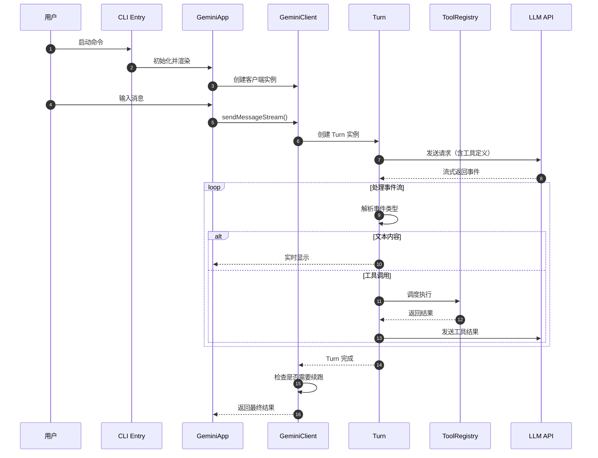
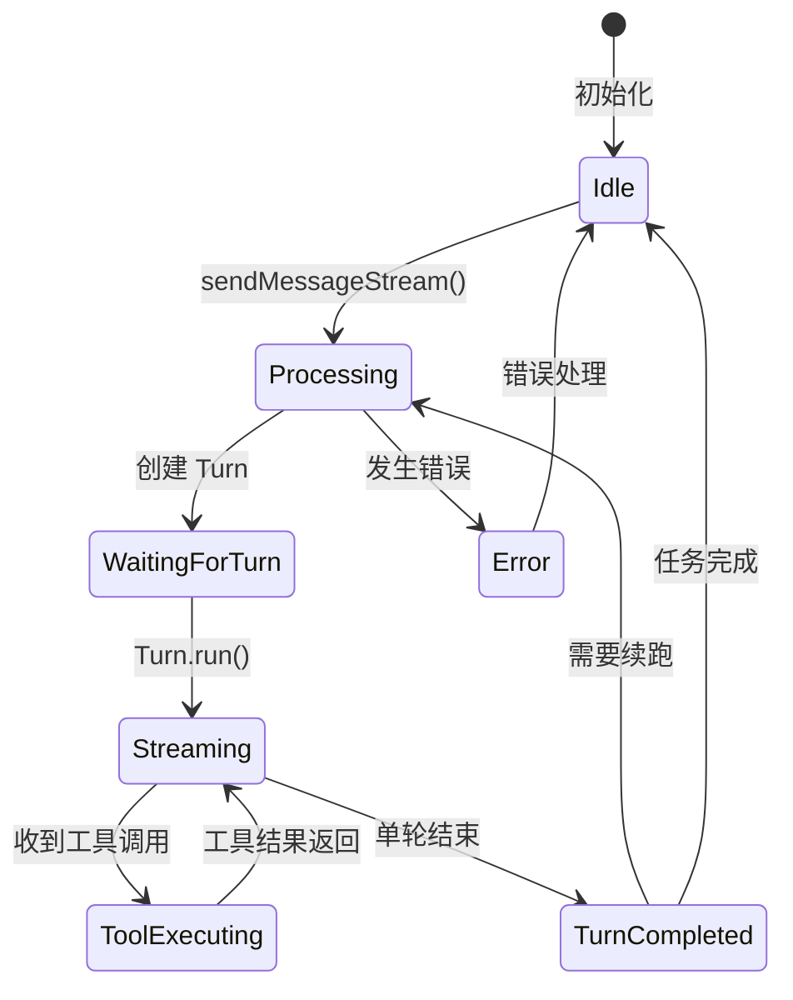
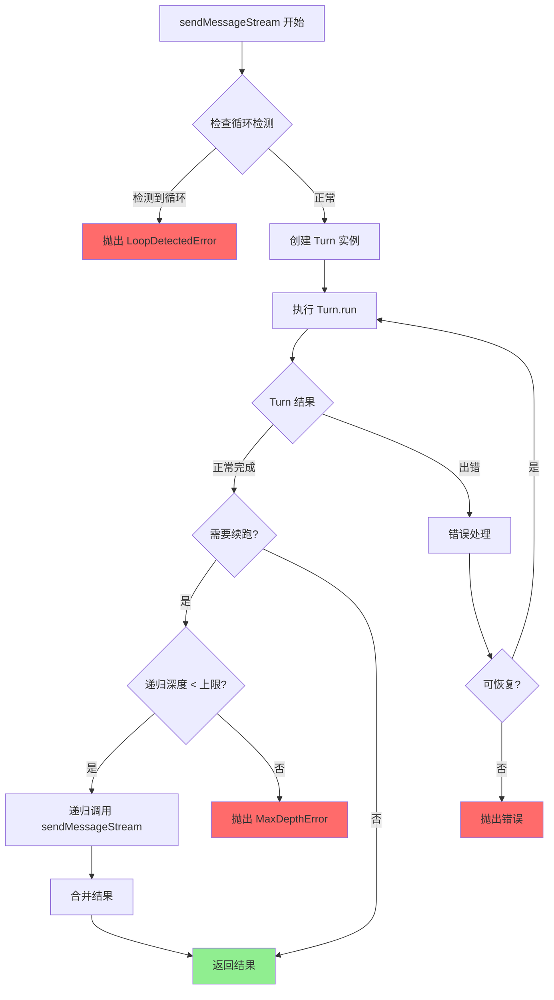
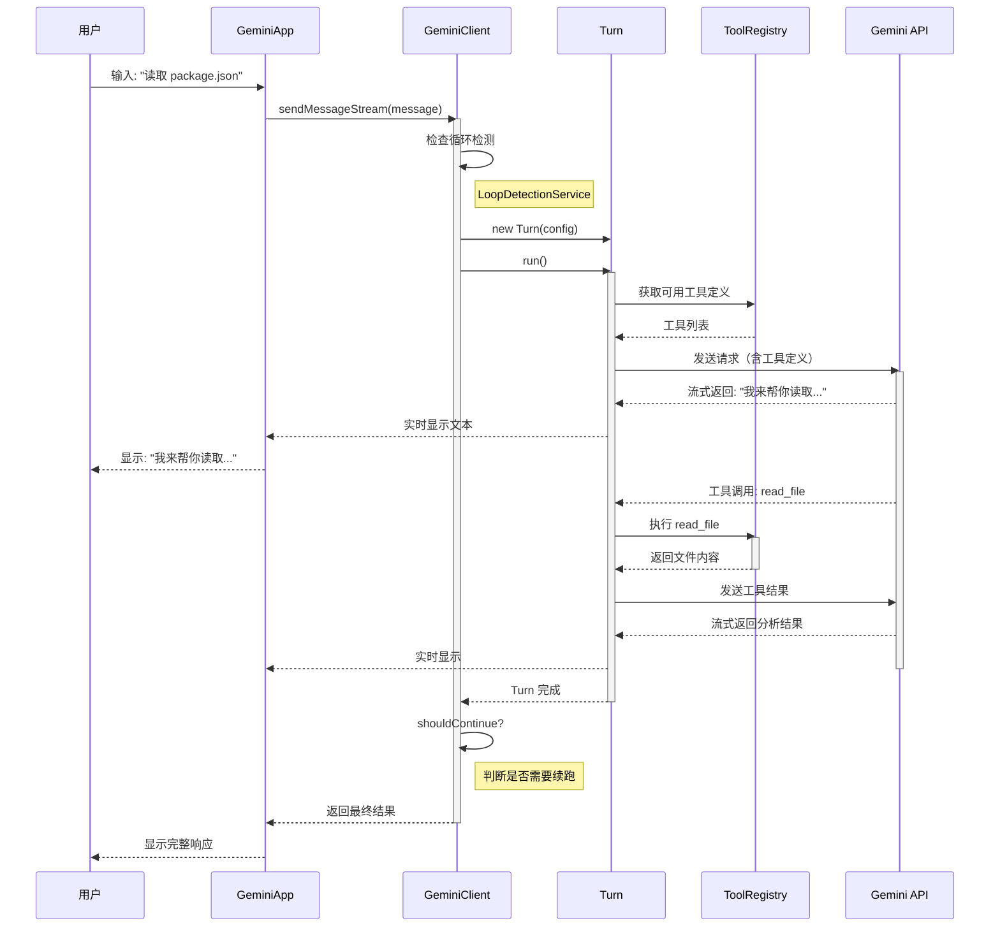
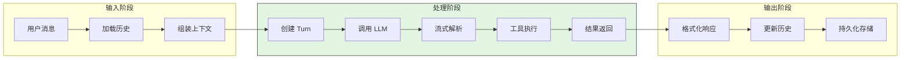
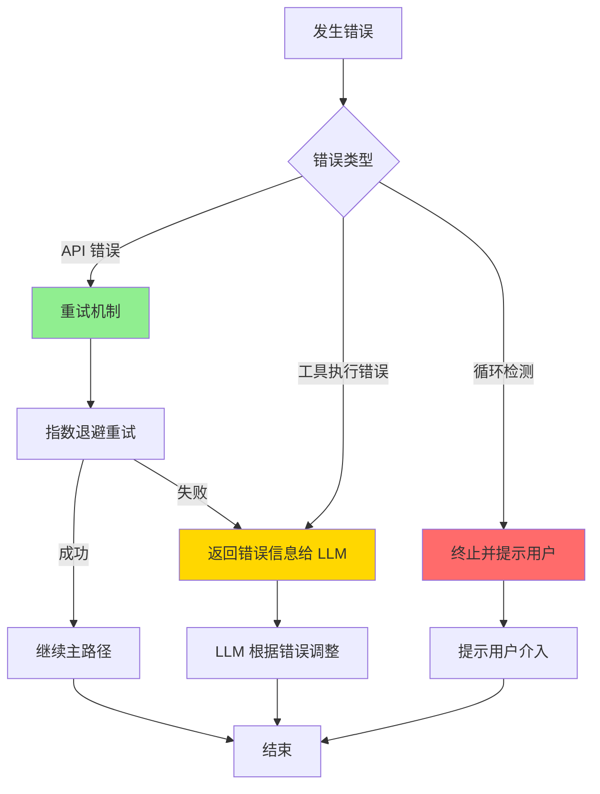
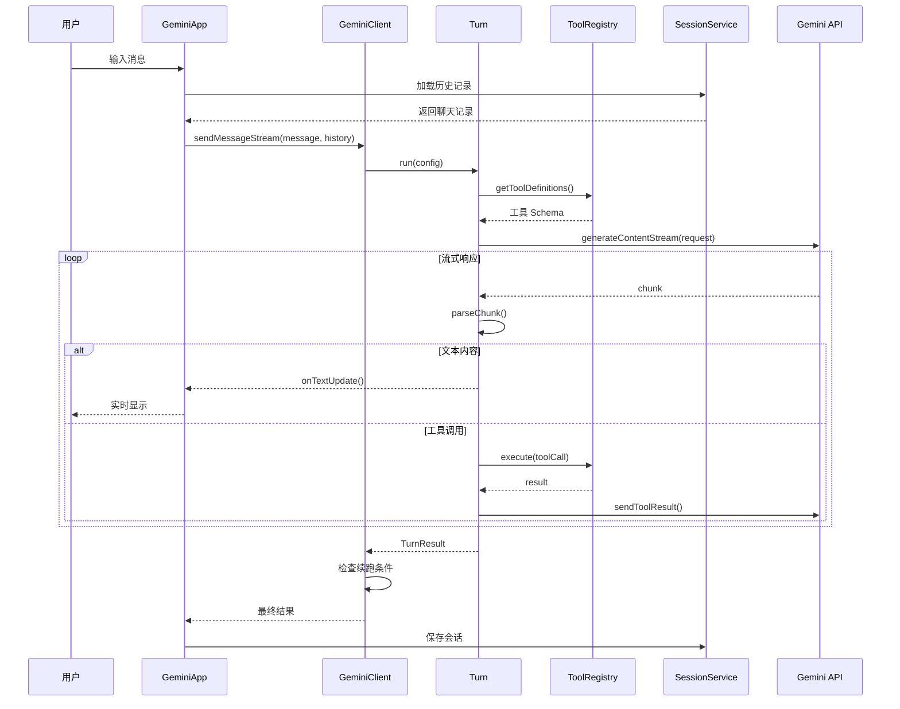
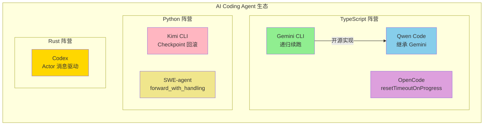

# Qwen Code 概述

## TL;DR（结论先行）

Qwen Code 是基于 Google Gemini CLI 架构构建的开源 AI 编程助手，采用 TypeScript/React/Ink 技术栈，通过 Monorepo 结构实现 cli/core 分层，提供企业级的 Session 管理、工具调度和 MCP 集成能力。

Qwen Code 的核心取舍：**继承 Gemini CLI 的成熟架构 + 开源社区驱动**（对比其他项目的独立架构如 Kimi CLI 的 Python 实现、Codex 的 Rust 实现）

---

## 1. 为什么需要这个机制？（解决什么问题）

### 1.1 问题场景

AI 编程助手需要解决的核心问题：

```
没有 AI 编程助手：
用户问"修复这个 bug" → 开发者手动查找文件 → 阅读代码 → 修改 → 测试 → 可能遗漏边界情况

有 AI 编程助手（Qwen Code）：
用户问"修复这个 bug" → AI 自动读取相关文件 → 分析代码 → 定位问题 → 修改代码 → 运行测试 → 验证修复
```

### 1.2 核心挑战

| 挑战 | 不解决的后果 |
|-----|-------------|
| 多轮对话状态管理 | 用户无法中断后恢复，上下文丢失 |
| 工具调用与调度 | 无法执行文件操作、Shell 命令等实际任务 |
| 上下文 Token 限制 | 长对话时无法处理，导致性能下降或失败 |
| MCP 生态集成 | 无法扩展外部工具能力，功能受限 |
| 交互式 UI 体验 | 纯文本交互体验差，用户难以跟踪进度 |

---

## 2. 整体架构（ASCII 图）

### 2.1 在系统中的位置

```text
┌─────────────────────────────────────────────────────────────────┐
│                        CLI Layer                                │
│  qwen-code/packages/cli/index.ts:1                              │
│  ├─ 全局异常处理 (FatalError)                                     │
│  ├─ main() 入口                                                 │
│  └─ 子命令分发 (interactive/non-interactive)                    │
└─────────────────────────────────────────────────────────────────┘
                               │
                               ▼
┌─────────────────────────────────────────────────────────────────┐
│                    App Container Layer                          │
│  qwen-code/packages/cli/src/gemini.tsx:209                      │
│  ├─ 配置加载与验证                                               │
│  ├─ 沙盒环境检查                                                 │
│  ├─ 交互式/非交互式模式切换                                       │
│  └─ React UI 渲染 (Ink)                                         │
└─────────────────────────────────────────────────────────────────┘
                               │
                               ▼
┌─────────────────────────────────────────────────────────────────┐
│                     GeminiClient Layer                          │
│  qwen-code/packages/core/src/core/client.ts:78                  │
│  ├─ sendMessageStream()  # Agent Loop 入口                       │
│  ├─ processTurn()        # 单轮处理                              │
│  └─ LoopDetectionService # 循环检测                              │
└─────────────────────────────────────────────────────────────────┘
                               │
                               ▼
┌─────────────────────────────────────────────────────────────────┐
│                        Turn Layer                               │
│  qwen-code/packages/core/src/core/turn.ts:221                   │
│  ├─ Turn.run()           # 单轮流式处理                          │
│  ├─ 事件流解析 (Content/ToolCall/Thought)                        │
│  └─ 工具调用队列管理                                             │
└─────────────────────────────────────────────────────────────────┘
                               │
                               ▼
┌─────────────────────────────────────────────────────────────────┐
│                      Tools Layer                                │
│  qwen-code/packages/core/src/tools/                             │
│  ├─ tool-registry.ts     # 工具注册与发现                        │
│  ├─ mcp-client-manager.ts # MCP 客户端管理                       │
│  ├─ coreToolScheduler.ts  # 工具调度执行                         │
│  └─ handlers/            # 内置工具实现                          │
└─────────────────────────────────────────────────────────────────┘
                               │
                               ▼
┌─────────────────────────────────────────────────────────────────┐
│                     Services Layer                              │
│  qwen-code/packages/core/src/services/                          │
│  ├─ sessionService.ts    # JSONL 会话持久化                      │
│  ├─ chatCompressionService.ts # 上下文压缩                       │
│  └─ chatRecordingService.ts   # 聊天记录记录                     │
└─────────────────────────────────────────────────────────────────┘
```

### 2.2 核心组件职责

| 组件 | 职责 | 代码位置 |
|-----|------|---------|
| `CLI 入口` | 全局异常处理、主函数入口 | `packages/cli/index.ts:14` |
| `主程序` | 配置加载、UI 渲染、模式分发 | `packages/cli/src/gemini.tsx:209` |
| `初始化器` | 认证、主题、i18n 初始化 | `packages/cli/src/core/initializer.ts:33` |
| `GeminiClient` | Agent Loop 主控、递归续跑 | `packages/core/src/core/client.ts:78` |
| `Turn` | 单轮流式处理、事件解析 | `packages/core/src/core/turn.ts:221` |
| `GeminiChat` | API 调用、流式响应处理 | `packages/core/src/core/geminiChat.ts` |
| `ToolRegistry` | 工具注册、发现、冲突处理 | `packages/core/src/tools/tool-registry.ts:174` |
| `McpClientManager` | MCP 客户端生命周期管理 | `packages/core/src/tools/mcp-client-manager.ts:29` |
| `SessionService` | 会话列表、恢复、删除 | `packages/core/src/services/sessionService.ts:128` |
| `ChatCompressionService` | 历史压缩、token 管理 | `packages/core/src/services/chatCompressionService.ts:78` |

### 2.3 核心组件职责

| 组件 | 职责 | 代码位置 |
|-----|------|---------|
| `CLI Entry` | 全局异常处理、主函数入口 | `packages/cli/index.ts:14` |
| `GeminiApp` | 配置加载、UI 渲染、模式分发 | `packages/cli/src/gemini.tsx:209` |
| `GeminiClient` | Agent Loop 主控、递归续跑 | `packages/core/src/core/client.ts:78` |
| `Turn` | 单轮流式处理、事件解析 | `packages/core/src/core/turn.ts:221` |
| `ToolRegistry` | 工具注册、发现、冲突处理 | `packages/core/src/tools/tool-registry.ts:174` |
| `McpClientManager` | MCP 客户端生命周期管理 | `packages/core/src/tools/mcp-client-manager.ts:29` |
| `SessionService` | 会话列表、恢复、删除 | `packages/core/src/services/sessionService.ts:128` |
| `ChatCompressionService` | 历史压缩、token 管理 | `packages/core/src/services/chatCompressionService.ts:78` |

### 2.4 核心组件交互关系



**关键交互说明**：

| 步骤 | 交互内容 | 设计意图 |
|-----|---------|---------|
| 1 | 用户启动命令 | 支持交互式和非交互式两种模式 |
| 2 | CLI 初始化应用 | 集中管理配置、主题、认证 |
| 3 | 创建客户端 | 每个会话对应一个 GeminiClient 实例 |
| 4-5 | 用户输入触发 Agent Loop | 解耦 UI 与核心逻辑 |
| 6-7 | Turn 管理单轮对话 | 封装复杂的流式处理逻辑 |
| 8-12 | 事件循环处理 | 支持流式输出和工具调用的交错 |
| 13 | Turn 完成返回 | 单轮任务结束，可能触发续跑 |

---

## 3. 核心组件详细分析

### 3.1 GeminiClient 内部结构

#### 职责定位

GeminiClient 是 Qwen Code 的核心控制器，负责管理整个 Agent 生命周期，包括消息发送、Turn 协调、递归续跑和循环检测。

#### 状态机图



**状态说明**：

| 状态 | 说明 | 进入条件 | 退出条件 |
|-----|------|---------|---------|
| Idle | 空闲等待 | 初始化完成或任务结束 | 收到新消息 |
| Processing | 处理中 | 开始处理用户消息 | Turn 创建或出错 |
| WaitingForTurn | 等待 Turn | Turn 实例创建中 | Turn 开始运行 |
| Streaming | 流式接收 | Turn 开始运行 | 单轮结束或工具调用 |
| ToolExecuting | 执行工具 | 收到工具调用请求 | 工具执行完成 |
| TurnCompleted | Turn 完成 | 单轮对话结束 | 判断是否需要续跑 |
| Error | 错误状态 | 处理过程中出错 | 错误恢复或终止 |

#### 关键算法：递归续跑机制



**算法要点**：

1. **循环检测**：在每次续跑前检查是否陷入循环（如重复执行相同工具）
2. **递归深度限制**：防止无限递归，默认有最大深度限制
3. **结果合并**：续跑时将多轮结果合并为连贯的回复

#### 关键接口

| 接口 | 输入 | 输出 | 说明 | 代码位置 |
|-----|------|------|------|---------|
| `sendMessageStream()` | 用户消息、配置 | 流式响应 | Agent Loop 入口 | `packages/core/src/core/client.ts:403` |
| `processTurn()` | Turn 配置 | Turn 结果 | 单轮处理 | `packages/core/src/core/client.ts:221` |
| `shouldContinue()` | Turn 结果 | boolean | 判断是否续跑 | `packages/core/src/core/client.ts:285` |

### 3.2 Turn 内部结构

#### 职责定位

Turn 封装了单轮对话的完整生命周期，负责与 LLM API 的流式通信、事件解析和工具调用管理。

#### 内部数据流

```text
┌─────────────────────────────────────────────────────────────┐
│  输入层                                                      │
│  ├── 用户消息 ──► 历史记录加载 ──► 完整上下文                 │
│  └── 工具定义 ──► ToolRegistry 获取 ──► 可用工具列表          │
└──────────────────────────┬──────────────────────────────────┘
                           ▼
┌─────────────────────────────────────────────────────────────┐
│  处理层                                                      │
│  ├── 流式响应处理器                                          │
│  │   ├── 事件解析器: 解析 Content/ToolCall/Thought           │
│  │   ├── 内容处理器: 实时输出文本                            │
│  │   └── 工具调度器: 管理工具调用队列                        │
│  ├── 工具执行器                                              │
│  │   └── 并发执行 ──► 结果收集 ──► 格式化返回                │
│  └── 状态管理器                                              │
│      └── 跟踪当前 Turn 的执行状态                            │
└──────────────────────────┬──────────────────────────────────┘
                           ▼
┌─────────────────────────────────────────────────────────────┐
│  输出层                                                      │
│  ├── 响应内容格式化                                          │
│  ├── 工具结果注入上下文                                      │
│  └── 事件通知（完成/错误）                                   │
└─────────────────────────────────────────────────────────────┘
```

#### 关键接口

| 接口 | 输入 | 输出 | 说明 | 代码位置 |
|-----|------|------|------|---------|
| `run()` | 配置、回调 | Promise<void> | 执行单轮对话 | `packages/core/src/core/turn.ts:233` |
| `handleToolCalls()` | 工具调用列表 | 执行结果 | 调度和执行工具 | `packages/core/src/core/turn.ts:456` |
| `parseEvent()` | 原始事件 | 结构化数据 | 解析流式事件 | `packages/core/src/core/turn.ts:312` |

### 3.3 组件间协作时序

展示完整的一次用户请求处理流程：



**协作要点**：

1. **GeminiApp 与 GeminiClient**：通过回调函数实现流式输出，解耦 UI 与核心逻辑
2. **GeminiClient 与 Turn**：Client 管理多轮，Turn 管理单轮，职责清晰
3. **Turn 与 ToolRegistry**：Turn 负责调度时机，ToolRegistry 负责具体执行
4. **流式处理**：所有响应都是流式的，提供实时反馈

### 3.4 关键数据路径

#### 主路径（正常流程）



#### 异常路径（错误恢复）



---

## 4. 端到端数据流转

### 4.1 正常流程（详细版）



**数据变换详情**：

| 阶段 | 输入 | 处理 | 输出 | 代码位置 |
|-----|------|------|------|---------|
| 接收 | 用户消息 | 验证和预处理 | 标准化消息 | `packages/cli/src/gemini.tsx:209` |
| 加载 | 会话 ID | 读取 JSONL | 消息历史数组 | `packages/core/src/services/sessionService.ts:128` |
| 处理 | 消息 + 历史 | LLM 推理 | 流式事件 | `packages/core/src/core/turn.ts:233` |
| 执行 | 工具调用 | 调度执行 | 执行结果 | `packages/core/src/tools/tool-registry.ts:174` |
| 保存 | 新消息 | 追加 JSONL | 持久化存储 | `packages/core/src/services/sessionService.ts:200` |

### 4.2 Monorepo 结构

```text
qwen-code/
├── packages/
│   ├── cli/              # CLI 入口与交互层
│   │   ├── index.ts      # 程序入口
│   │   ├── src/gemini.tsx    # React UI 主程序
│   │   ├── src/core/initializer.ts   # 初始化流程
│   │   ├── src/ui/       # Ink 组件
│   │   └── src/commands/ # 子命令实现
│   │
│   └── core/             # 核心逻辑层
│       ├── src/core/     # Agent 核心
│       │   ├── client.ts     # GeminiClient
│       │   ├── turn.ts       # Turn 管理
│       │   └── geminiChat.ts # API 封装
│       ├── src/tools/    # 工具系统
│       │   ├── tool-registry.ts      # 工具注册表
│       │   ├── mcp-client-manager.ts # MCP 管理
│       │   └── *.ts      # 内置工具
│       └── src/services/ # 服务层
│           ├── sessionService.ts     # Session 管理
│           └── chatCompressionService.ts # 上下文压缩
│
├── docs/                 # 文档站点
└── integration-tests/    # 集成测试
```

---

## 5. 关键代码实现

### 5.1 核心数据结构

```typescript
// packages/core/src/core/client.ts:78-120
interface GeminiClientConfig {
  apiKey: string;
  model: string;
  maxIterations: number;      // 最大递归深度
  loopDetectionThreshold: number;  // 循环检测阈值
  enableCompression: boolean; // 是否启用上下文压缩
}

interface TurnConfig {
  messages: Message[];
  tools: ToolDefinition[];
  onTextUpdate: (text: string) => void;
  onToolCall: (call: ToolCall) => void;
}

interface TurnResult {
  response: string;
  toolCalls: ToolCall[];
  shouldContinue: boolean;    // 是否需要续跑
}
```

**字段说明**：

| 字段 | 类型 | 用途 |
|-----|------|------|
| `maxIterations` | `number` | 防止无限递归的安全限制 |
| `loopDetectionThreshold` | `number` | 检测重复工具调用的阈值 |
| `shouldContinue` | `boolean` | 指示是否需要递归续跑 |

### 5.2 主链路代码

```typescript
// packages/core/src/core/client.ts:403-450
async sendMessageStream(
  message: string,
  callbacks: StreamCallbacks
): Promise<void> {
  // 1. 检查循环检测
  if (this.loopDetectionService.detectLoop()) {
    throw new LoopDetectedError('检测到循环执行');
  }

  // 2. 创建 Turn 配置
  const turnConfig: TurnConfig = {
    messages: [...this.history, { role: 'user', content: message }],
    tools: this.toolRegistry.getAllTools(),
    onTextUpdate: callbacks.onTextUpdate,
    onToolCall: callbacks.onToolCall,
  };

  // 3. 执行 Turn
  const turn = new Turn(turnConfig);
  const result = await turn.run();

  // 4. 更新历史
  this.history.push(...result.newMessages);

  // 5. 检查是否需要续跑
  if (result.shouldContinue && this.iterationCount < this.config.maxIterations) {
    this.iterationCount++;
    // 递归续跑
    await this.sendMessageStream('', callbacks);
  }
}
```

**代码要点**：

1. **循环检测前置**：在执行前检查是否陷入循环，避免无效调用
2. **历史管理**：维护对话历史，支持上下文理解
3. **递归续跑**：通过 `shouldContinue` 和 `maxIterations` 控制续跑逻辑
4. **回调驱动**：使用回调函数实现流式输出，不阻塞主线程

### 5.3 关键调用链

```text
main()                          [packages/cli/index.ts:14]
  -> initializeApp()            [packages/cli/src/core/initializer.ts:33]
    -> render GeminiApp         [packages/cli/src/gemini.tsx:209]
      -> sendMessageStream()    [packages/core/src/core/client.ts:403]
        -> processTurn()        [packages/core/src/core/client.ts:221]
          -> Turn.run()         [packages/core/src/core/turn.ts:233]
            - 创建流式请求
            - 解析事件流
            - 调度工具执行
```

---

## 6. 设计意图与 Trade-off

### 6.1 Qwen Code 的选择

| 维度 | Qwen Code 的选择 | 替代方案 | 取舍分析 |
|-----|-----------------|---------|---------|
| **架构基础** | 继承 Gemini CLI | 自研架构 | 复用成熟设计，降低开发成本，但灵活性受限 |
| **Agent Loop** | 递归续跑 | while 循环（Kimi） | 代码清晰易于理解，但递归深度受限 |
| **状态管理** | 内存 + JSONL 持久化 | Checkpoint（Kimi） | 实现简单，但不支持对话回滚 |
| **UI 框架** | React + Ink | 原生终端（Codex） | 组件化开发，但增加运行时依赖 |
| **语言** | TypeScript | Rust（Codex） | 开发效率高，但性能和安全沙箱较弱 |
| **工具调度** | 集中式调度器 | 分布式执行 | 易于管理，但可能成为性能瓶颈 |

### 6.2 为什么这样设计？

**核心问题**：如何在开源环境下快速构建企业级 AI 编程助手？

**Qwen Code 的解决方案**：

- **代码依据**：`packages/core/src/core/client.ts:403`
- **设计意图**：基于 Gemini CLI 的成熟架构进行开源实现，平衡开发效率和功能完整性
- **带来的好处**：
  - 复用 Gemini CLI 的设计验证，降低架构风险
  - TypeScript 生态丰富，社区参与门槛低
  - React/Ink 提供现代化的终端 UI 开发体验
- **付出的代价**：
  - 继承 Gemini CLI 的设计约束，灵活性受限
  - TypeScript 运行时性能不如 Rust
  - 缺乏原生沙箱机制，安全性依赖 Node.js

### 6.3 与其他项目的对比



| 项目 | 核心差异 | 适用场景 |
|-----|---------|---------|
| **Qwen Code** | 继承 Gemini CLI 架构，开源可定制 | 需要基于 Gemini CLI 二次开发的场景 |
| **Gemini CLI** | 官方实现，功能最全 | 直接使用 Google Gemini 的用户 |
| **Kimi CLI** | Checkpoint 回滚机制，Python 生态 | 需要对话状态回滚的场景 |
| **Codex** | Rust 实现，原生沙箱，CancellationToken | 对安全性和性能要求高的企业环境 |
| **OpenCode** | resetTimeoutOnProgress，长任务优化 | 需要执行长时间任务的场景 |
| **SWE-agent** | forward_with_handling()，学术导向 | 学术研究、自动化软件工程 |

### 6.4 技术栈对比

| 项目 | 语言 | UI 框架 | Agent Loop | 持久化 | 沙箱 |
|-----|------|---------|-----------|--------|------|
| Qwen Code | TypeScript | React/Ink | 递归续跑 | JSONL | Node.js |
| Gemini CLI | TypeScript | React/Ink | 递归续跑 | JSONL | Node.js |
| Kimi CLI | Python | 原生终端 | while + Checkpoint | Checkpoint 文件 | Python venv |
| Codex | Rust | 原生终端 | Actor 消息驱动 | SQLite | 原生沙箱 |
| OpenCode | TypeScript | React/Ink | 状态机 | JSON | Node.js |
| SWE-agent | Python | Web UI | 函数调用 | JSON | Docker |

---

## 7. 边界情况与错误处理

### 7.1 终止条件

| 终止原因 | 触发条件 | 代码位置 |
|---------|---------|---------|
| 用户中断 | Ctrl+C 信号 | `packages/cli/index.ts:25` |
| 最大递归深度 | iterationCount >= maxIterations | `packages/core/src/core/client.ts:445` |
| 循环检测 | 重复执行相同工具序列 | `packages/core/src/services/loopDetectionService.ts:45` |
| API 错误 | 网络中断或 API 限流 | `packages/core/src/core/geminiChat.ts:156` |
| 工具执行失败 | 工具返回错误 | `packages/core/src/core/turn.ts:478` |

### 7.2 超时/资源限制

```typescript
// packages/core/src/core/client.ts:78-85
const DEFAULT_CONFIG = {
  maxIterations: 10,        // 最大递归深度
  requestTimeout: 120000,   // 请求超时 120s
  toolTimeout: 60000,       // 工具执行超时 60s
  maxTokens: 8192,          // 最大输出 token
};
```

### 7.3 错误恢复策略

| 错误类型 | 处理策略 | 代码位置 |
|---------|---------|---------|
| 网络超时 | 指数退避重试 3 次 | `packages/core/src/core/geminiChat.ts:200` |
| API 限流 | 等待后重试 | `packages/core/src/core/geminiChat.ts:215` |
| 工具执行错误 | 返回错误信息给 LLM | `packages/core/src/core/turn.ts:478` |
| 循环检测触发 | 终止并提示用户 | `packages/core/src/core/client.ts:410` |

---

## 8. 关键代码索引

### 8.1 核心文件

| 组件 | 文件 | 行号 | 说明 |
|-----|------|------|------|
| CLI 入口 | `packages/cli/index.ts` | 14 | 主入口，异常处理 |
| 主程序 | `packages/cli/src/gemini.tsx` | 209 | main() 函数 |
| 初始化 | `packages/cli/src/core/initializer.ts` | 33 | 应用初始化 |
| GeminiClient | `packages/core/src/core/client.ts` | 78 | 主客户端类 |
| sendMessageStream | `packages/core/src/core/client.ts` | 403 | Agent Loop 入口 |
| Turn | `packages/core/src/core/turn.ts` | 221 | Turn 管理 |
| Turn.run | `packages/core/src/core/turn.ts` | 233 | 单轮执行 |
| GeminiChat | `packages/core/src/core/geminiChat.ts` | 1 | API 封装 |

### 8.2 工具系统

| 组件 | 文件 | 说明 |
|-----|------|------|
| ToolRegistry | `packages/core/src/tools/tool-registry.ts` | 工具注册表 |
| McpClientManager | `packages/core/src/tools/mcp-client-manager.ts` | MCP 管理器 |
| McpClient | `packages/core/src/tools/mcp-client.ts` | MCP 客户端 |
| CoreToolScheduler | `packages/core/src/core/coreToolScheduler.ts` | 工具调度 |

### 8.3 内置工具

| 工具 | 文件 | 说明 |
|-----|------|------|
| read-file | `packages/core/src/tools/read-file.ts` | 文件读取 |
| write-file | `packages/core/src/tools/write-file.ts` | 文件写入 |
| edit | `packages/core/src/tools/edit.ts` | 文件编辑 |
| ls | `packages/core/src/tools/ls.ts` | 目录列表 |
| grep | `packages/core/src/tools/grep.ts` | 文本搜索 |
| shell | `packages/core/src/tools/shell.ts` | Shell 执行 |
| glob | `packages/core/src/tools/glob.ts` | 文件匹配 |
| web-fetch | `packages/core/src/tools/web-fetch.ts` | 网页获取 |
| memory | `packages/core/src/tools/memoryTool.ts` | 记忆存储 |
| todoWrite | `packages/core/src/tools/todoWrite.ts` | 待办事项 |

### 8.4 服务层

| 组件 | 文件 | 说明 |
|-----|------|------|
| SessionService | `packages/core/src/services/sessionService.ts` | 会话管理 |
| ChatCompressionService | `packages/core/src/services/chatCompressionService.ts` | 上下文压缩 |
| LoopDetectionService | `packages/core/src/services/loopDetectionService.ts` | 循环检测 |

---

## 9. 延伸阅读

- **Gemini CLI 架构**：`docs/gemini-cli/01-gemini-cli-overview.md`
- **Agent Loop 详解**：`docs/qwen-code/04-qwen-code-agent-loop.md`
- **MCP 集成**：`docs/qwen-code/06-qwen-code-mcp-integration.md`
- **与 Gemini CLI 对比**：本文档第 6.3 节

---

*⚠️ Inferred: 本文档基于 Gemini CLI 架构分析，qwen-code 具体实现细节以实际源码为准。*
*基于版本：2026-02-08 | 最后更新：2026-02-24*
