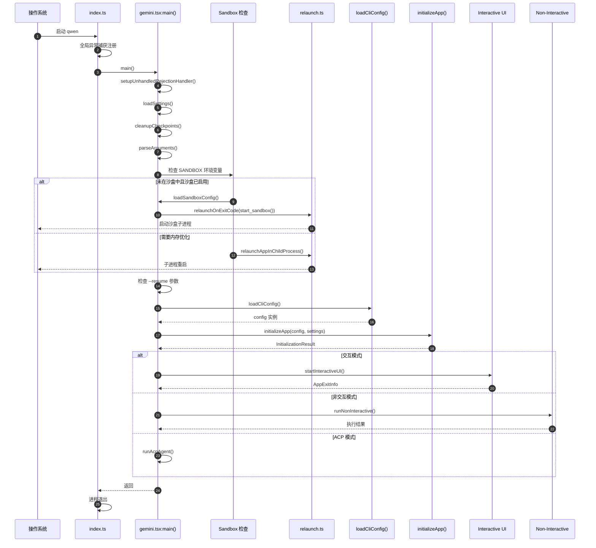
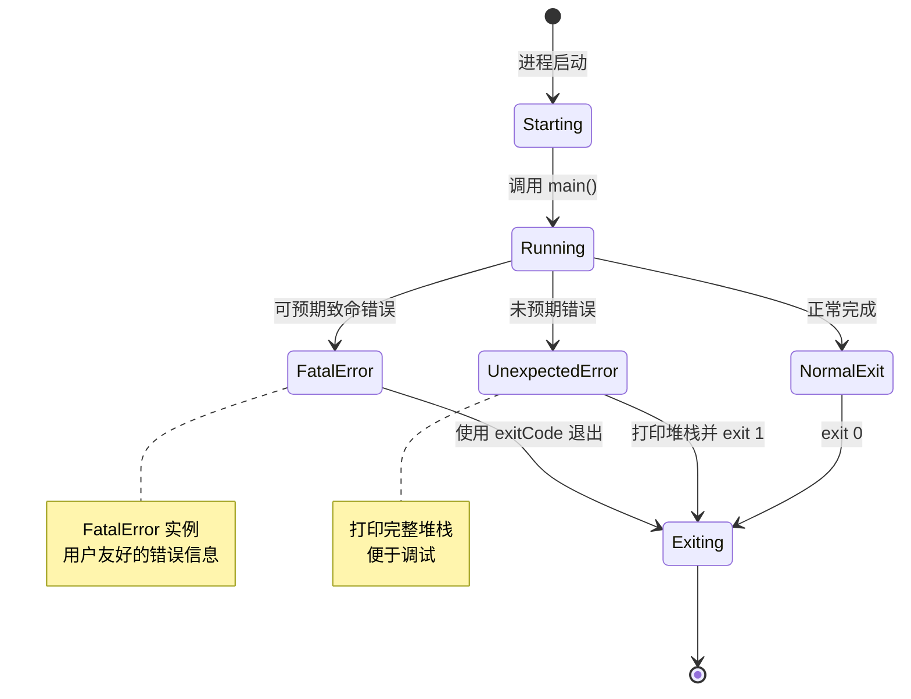
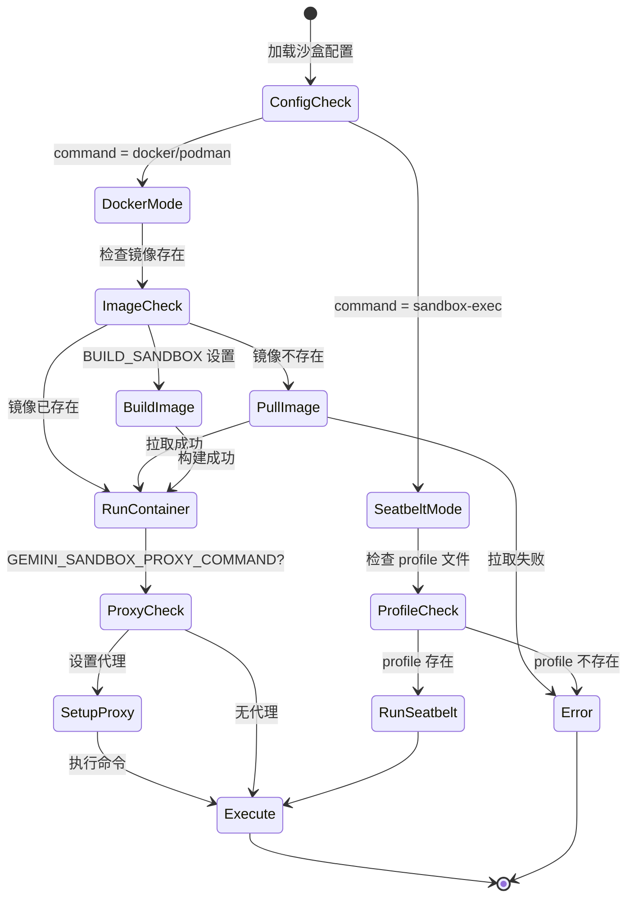
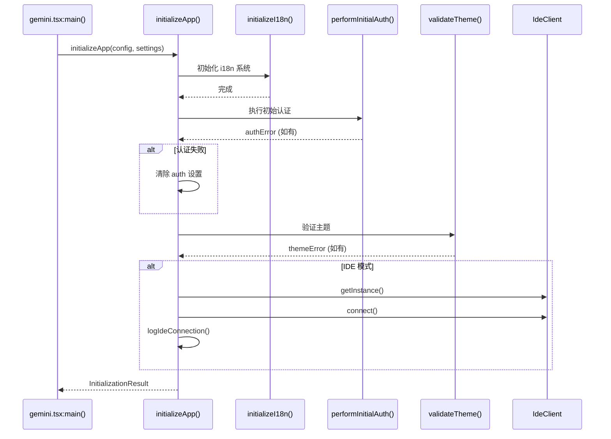
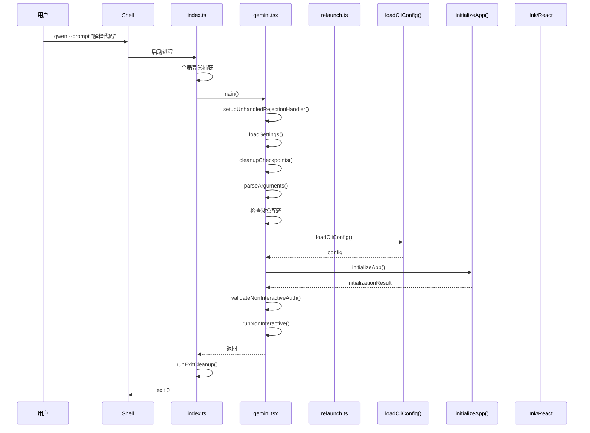
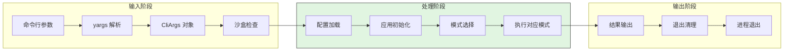
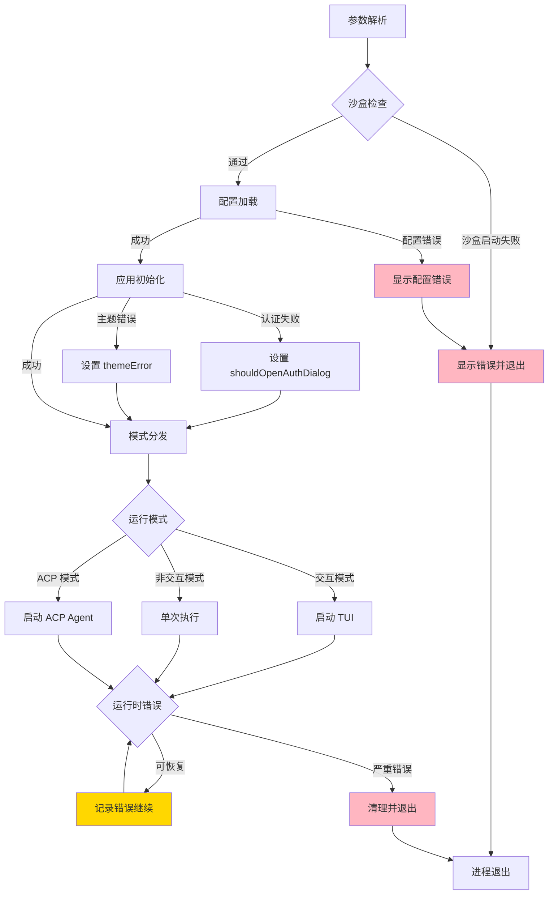
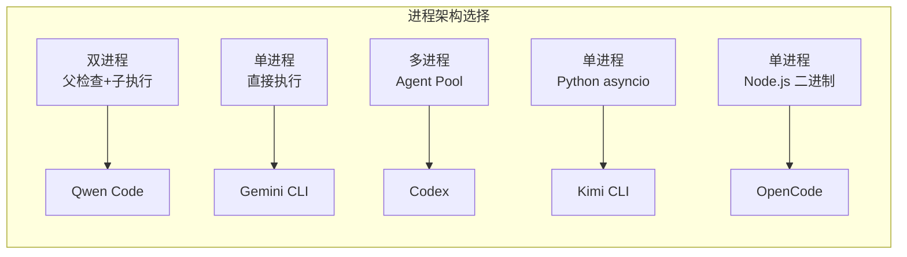

# CLI Entry（Qwen Code）

## TL;DR（结论先行）

一句话定义：Qwen Code 的 CLI Entry 是「**双进程沙盒可选的 React 终端应用**」，采用 yargs 参数解析 + Ink React TUI 架构，支持交互式/非交互式/ACP 三种运行模式，以及 Docker/Podman/sandbox-exec 多类型沙盒隔离。

核心取舍：
- **双进程架构**：父进程负责沙盒检查与重启，子进程执行实际业务（对比 Gemini CLI 的单进程模式）
- **沙盒策略**：支持 Docker/Podman 容器 + macOS Seatbelt 双重隔离（对比 Codex 的原生沙箱、Kimi CLI 的无沙盒）
- **内存优化**：自动计算并配置 `--max-old-space-size`（对比其他项目的固定内存配置）
- **TUI 框架**：React + Ink 组件化渲染（与 Gemini CLI 相同，对比 Kimi CLI 的 prompt_toolkit）

---

## 1. 为什么需要这个机制？

### 1.1 问题场景

```text
场景：Qwen Code 需要同时满足以下需求：
1. 日常交互式开发（TUI 模式）
2. CI/CD 自动化调用（非交互式）
3. IDE 集成（ACP 协议模式）
4. 安全隔离执行（沙盒模式）
5. 内存优化（大项目场景）

如果没有显式分发：
- 沙盒内重复启动沙盒 -> 无限递归
- 内存不足导致 OOM -> 进程崩溃
- 交互模式在 CI 中运行 -> 卡住等待输入
- 全局异常未捕获 -> 进程异常退出无提示

Qwen Code 的做法：
  入口文件 index.ts 只做全局异常捕获
  主程序 gemini.tsx 负责：
  - 设置 Promise 异常处理
  - 加载用户设置
  - 清理旧 checkpoint
  - 解析 CLI 参数
  - 检查沙盒配置，必要时启动沙盒子进程
  - 内存优化重启（子进程）
  - 会话恢复
  - 模式分发（交互式/非交互式/ACP）
```

### 1.2 核心挑战

| 挑战 | 不解决的后果 |
|-----|-------------|
| 沙盒递归 | 沙盒内重复启动沙盒，导致无限递归和资源耗尽 |
| 内存限制 | Node.js 默认内存限制（1.4GB）导致大项目 OOM |
| 模式区分 | 交互模式与自动化模式互相干扰，CI 环境挂起 |
| 全局异常 | 未捕获的异常导致进程崩溃，无错误提示 |
| 会话恢复 | 用户无法恢复之前的对话上下文 |
| 资源清理 | MCP 子进程、沙盒容器等资源泄漏 |

---

## 2. 整体架构（ASCII 图）

### 2.1 在系统中的位置

```text
┌─────────────────────────────────────────────────────────────┐
│ 操作系统 / Shell                                             │
│ 用户输入: qwen [OPTIONS] [QUERY]                             │
└───────────────────────┬─────────────────────────────────────┘
                        │ 启动进程
                        ▼
┌─────────────────────────────────────────────────────────────┐
│ ▓▓▓ Entry Point ▓▓▓                                         │
│ packages/cli/index.ts:14                                     │
│ - 全局异常捕获（FatalError 分类处理）                        │
│ - main() 调用                                                │
└───────────────────────┬─────────────────────────────────────┘
                        │
                        ▼
┌─────────────────────────────────────────────────────────────┐
│ ▓▓▓ Main Logic ▓▓▓                                          │
│ packages/cli/src/gemini.tsx:209                              │
│ - setupUnhandledRejectionHandler()                           │
│ - loadSettings()                                             │
│ - cleanupCheckpoints()                                       │
│ - parseArguments()                                           │
│ - 沙盒检查与重启                                             │
│ - 会话恢复                                                   │
│ - 模式分发                                                   │
└───────────────────────┬─────────────────────────────────────┘
                        │
        ┌───────────────┼───────────────┬──────────────────┐
        ▼               ▼               ▼                  ▼
┌──────────────┐ ┌──────────────┐ ┌──────────────┐ ┌──────────────┐
│ Interactive  │ │ Non-Interac  │ │ ACP Mode     │ │ Sandbox      │
│ TUI 模式     │ │ tive 模式    │ │              │ │ 子进程       │
│              │ │              │ │              │ │              │
│ Ink/React    │ │ 单轮执行     │ │ ACP Agent    │ │ Docker/      │
│ 实时渲染     │ │ 输出后退出   │ │ 协议处理     │ │ Podman/      │
│              │ │              │ │              │ │ Seatbelt     │
└──────────────┘ └──────────────┘ └──────────────┘ └──────────────┘
```

### 2.2 核心组件职责

| 组件 | 职责 | 代码位置 |
|-----|------|---------|
| `index.ts` | 入口文件、全局异常处理 | `packages/cli/index.ts:14` |
| `main()` | 主逻辑入口、沙盒检查、模式分发 | `packages/cli/src/gemini.tsx:209` |
| `setupUnhandledRejectionHandler()` | Promise 异常处理 | `packages/cli/src/gemini.tsx:117` |
| `parseArguments()` | yargs 参数解析 | `packages/cli/src/config/config.ts:177` |
| `loadCliConfig()` | 配置加载 | `packages/cli/src/config/config.ts` |
| `initializeApp()` | 应用初始化（i18n、认证、主题） | `packages/cli/src/core/initializer.ts:33` |
| `startInteractiveUI()` | 启动交互式 TUI | `packages/cli/src/gemini.tsx:139` |
| `runNonInteractive()` | 非交互式执行 | `packages/cli/src/nonInteractiveCli.ts:109` |
| `start_sandbox()` | 启动沙盒容器 | `packages/cli/src/utils/sandbox.ts:175` |
| `relaunchAppInChildProcess()` | 子进程重启 | `packages/cli/src/utils/relaunch.ts:28` |
| `cleanupCheckpoints()` | 清理旧 checkpoint | `packages/cli/src/utils/cleanup.ts:28` |

### 2.3 核心组件交互关系



**关键交互说明**：

| 步骤 | 交互内容 | 设计意图 |
|-----|---------|---------|
| 1 | 全局异常捕获注册 | 确保未捕获异常不会导致进程崩溃 |
| 2 | Promise 异常处理 | 捕获异步代码中的未处理异常 |
| 3 | 清理旧 checkpoint | 防止磁盘空间无限增长 |
| 4-5 | 沙盒检查与重启 | 安全隔离与内存优化 |
| 6 | 会话恢复 | 支持对话上下文恢复 |
| 7 | 配置加载 | 合并多层配置来源 |
| 8 | 应用初始化 | i18n、认证、主题等前置准备 |
| 9-11 | 模式分发 | 根据参数选择运行模式 |

---

## 3. 核心组件详细分析

### 3.1 入口文件（index.ts）

#### 职责定位

入口文件负责全局异常处理和进程生命周期管理，将具体业务逻辑委托给 `gemini.tsx` 的 `main()` 函数。

#### 状态机图



**状态说明**：

| 状态 | 说明 | 进入条件 | 退出条件 |
|-----|------|---------|---------|
| Starting | 进程启动 | 操作系统加载 | main() 被调用 |
| Running | 主逻辑执行 | main() 开始执行 | 执行完成或出错 |
| NormalExit | 正常退出 | main() 正常返回 | 进程退出码 0 |
| FatalError | 可预期错误 | 抛出 FatalError | 使用 error.exitCode 退出 |
| UnexpectedError | 未预期错误 | 抛出其他异常 | 退出码 1 |

#### 关键接口

| 接口 | 输入 | 输出 | 说明 | 代码位置 |
|-----|------|------|------|---------|
| `main()` | - | Promise<void> | 主逻辑入口 | `gemini.tsx:209` |
| `FatalError` | message, exitCode | Error 实例 | 可预期错误类型 | `@qwen-code/qwen-code-core` |

#### 关键代码

```typescript
// packages/cli/index.ts:14-30
main().catch((error) => {
  if (error instanceof FatalError) {
    let errorMessage = error.message;
    if (!process.env['NO_COLOR']) {
      errorMessage = `\x1b[31m${errorMessage}\x1b[0m`;
    }
    console.error(errorMessage);
    process.exit(error.exitCode);
  }
  console.error('An unexpected critical error occurred:');
  if (error instanceof Error) {
    console.error(error.stack);
  } else {
    console.error(String(error));
  }
  process.exit(1);
});
```

---

### 3.2 主逻辑与模式分发（gemini.tsx）

#### 职责定位

`main()` 函数是 CLI 的核心控制器，负责参数解析、沙盒检查、配置加载和运行模式选择。

#### 内部数据流

```text
┌─────────────────────────────────────────────────────────────┐
│  输入层                                                      │
│  ├── 命令行参数 ──► parseArguments() ──► CliArgs             │
│  ├── 配置文件   ──► loadSettings()   ──► LoadedSettings      │
│  └── 环境变量   ──► process.env      ──► 沙盒/调试标志       │
└──────────────────────────┬──────────────────────────────────┘
                           ▼
┌─────────────────────────────────────────────────────────────┐
│  沙盒与进程管理层                                            │
│  ├── 检查 SANDBOX 环境变量                                   │
│  ├── 加载沙盒配置 ──► loadSandboxConfig()                    │
│  ├── 沙盒模式   ──► start_sandbox() ──► 子进程               │
│  └── 普通模式   ──► relaunchAppInChildProcess() ──► 子进程   │
└──────────────────────────┬──────────────────────────────────┘
                           ▼
┌─────────────────────────────────────────────────────────────┐
│  初始化层                                                    │
│  ├── 会话恢复 ──► showResumeSessionPicker()                  │
│  ├── 配置加载 ──► loadCliConfig()                            │
│  ├── 应用初始化 ──► initializeApp()                          │
│  │   ├── initializeI18n()                                    │
│  │   ├── performInitialAuth()                                │
│  │   └── validateTheme()                                     │
│  └── Kitty 协议检测 ──► detectAndEnableKittyProtocol()       │
└──────────────────────────┬──────────────────────────────────┘
                           ▼
┌─────────────────────────────────────────────────────────────┐
│  模式分发层                                                  │
│  ├── ACP 模式   ──► runAcpAgent()                            │
│  ├── 交互模式   ──► startInteractiveUI()                     │
│  │   └── Ink/React TUI 渲染                                  │
│  └── 非交互模式 ──► runNonInteractive()                      │
│      └── 单轮执行，输出后退出                                 │
└─────────────────────────────────────────────────────────────┘
```

#### 关键算法逻辑

```mermaid
flowchart TD
    A[main() 开始] --> B[setupUnhandledRejectionHandler]
    B --> C[loadSettings]
    C --> D[cleanupCheckpoints]
    D --> E[parseArguments]

    E --> F{SANDBOX 环境变量?}
    F -->|未设置| G[loadSandboxConfig]
    G --> H{沙盒已启用?}
    H -->|是| I[认证预检]
    I --> J[start_sandbox]
    J --> K[relaunchOnExitCode]
    K --> L[exit 0]

    H -->|否| M[getNodeMemoryArgs]
    M --> N{需要更多内存?}
    N -->|是| O[relaunchAppInChildProcess]
    N -->|否| P[继续执行]
    O --> P

    F -->|已设置| P

    P --> Q{--resume?}
    Q -->|是, 无 ID| R[showResumeSessionPicker]
    Q -->|否| S[loadCliConfig]
    R --> S

    S --> T[registerCleanup]
    T --> U{isInteractive?}

    U -->|否| V[validateNonInteractiveAuth]
    V --> W{inputFormat?}
    W -->|STREAM_JSON| X[runNonInteractiveStreamJson]
    W -->|其他| Y[runNonInteractive]

    U -->|是| Z[detectAndEnableKittyProtocol]
    Z --> AA[initializeApp]
    AA --> AB[startInteractiveUI]

    style J fill:#90EE90
    style O fill:#87CEEB
    style AB fill:#FFD700
```

**算法要点**：

1. **沙盒检查优先**：在昂贵初始化之前检查沙盒配置，避免资源浪费
2. **内存自动优化**：根据系统总内存自动计算 `--max-old-space-size`
3. **认证预检**：沙盒模式外进行 OAuth 认证，避免沙盒内重定向问题
4. **延迟初始化**：流式 JSON 模式延迟初始化，直到收到控制请求

---

### 3.3 沙盒系统（sandbox.ts）

#### 职责定位

沙盒系统负责在隔离环境中运行 Qwen Code，支持 Docker/Podman 容器和 macOS Seatbelt 两种隔离机制。

#### 状态机图



#### 关键接口

| 接口 | 输入 | 输出 | 说明 | 代码位置 |
|-----|------|------|------|---------|
| `start_sandbox()` | SandboxConfig, nodeArgs, cliConfig, cliArgs | Promise<number> | 启动沙盒 | `sandbox.ts:175` |
| `loadSandboxConfig()` | Settings, CliArgs | Promise<SandboxConfig \| null> | 加载沙盒配置 | `config/sandboxConfig.ts` |
| `relaunchOnExitCode()` | runner function | Promise<never> | 重启循环 | `relaunch.ts:11` |

---

### 3.4 应用初始化（initializer.ts）

#### 职责定位

`initializeApp()` 在 React UI 渲染前完成应用的初始化工作，包括 i18n、认证、主题验证等。

#### 组件间协作时序



**协作要点**：

1. **i18n 优先**：首先初始化多语言系统，确保后续错误信息可本地化
2. **认证容错**：认证失败不清空设置，允许用户后续重新选择
3. **IDE 集成**：IDE 模式建立 WebSocket 连接，支持双向通信

---

## 4. 端到端数据流转

### 4.1 正常流程（详细版）



**数据变换详情**：

| 阶段 | 输入 | 处理 | 输出 | 代码位置 |
|-----|------|------|------|---------|
| 接收 | 命令行参数 | yargs 解析验证 | CliArgs 对象 | `config/config.ts:177` |
| 沙盒检查 | CliArgs, Settings | loadSandboxConfig | SandboxConfig/null | `config/sandboxConfig.ts` |
| 配置加载 | Settings, CliArgs | 多层配置合并 | Config 实例 | `config/config.ts` |
| 初始化 | Config, Settings | i18n/认证/主题 | InitializationResult | `core/initializer.ts:33` |
| 执行 | Config, input | Agent Loop 处理 | 响应输出 | `nonInteractiveCli.ts:109` |
| 清理 | - | 运行注册的清理函数 | 资源释放 | `utils/cleanup.ts:17` |

### 4.2 数据流向图



### 4.3 异常/边界流程



---

## 5. 关键代码实现

### 5.1 核心数据结构

```typescript
// packages/cli/src/config/config.ts:105-160
export interface CliArgs {
  query: string | undefined;
  model: string | undefined;
  sandbox: boolean | string | undefined;
  sandboxImage: string | undefined;
  debug: boolean | undefined;
  prompt: string | undefined;
  promptInteractive: string | undefined;
  yolo: boolean | undefined;
  approvalMode: string | undefined;
  resume: string | undefined;
  sessionId: string | undefined;
  inputFormat?: string | undefined;
  outputFormat: string | undefined;
  extensions: string[] | undefined;
  // ... 更多字段
}

// packages/cli/src/core/initializer.ts:19-24
export interface InitializationResult {
  authError: string | null;
  themeError: string | null;
  shouldOpenAuthDialog: boolean;
  geminiMdFileCount: number;
}
```

**字段说明**：

| 字段 | 类型 | 用途 |
|-----|------|------|
| `sandbox` | `boolean \| string` | 沙盒启用标志及命令类型 |
| `approvalMode` | `string` | 审批模式：plan/default/auto-edit/yolo |
| `resume` | `string` | 恢复会话 ID |
| `inputFormat` | `string` | 输入格式：text/stream-json |
| `shouldOpenAuthDialog` | `boolean` | 是否需要打开认证对话框 |

### 5.2 主链路代码

```typescript
// packages/cli/src/gemini.tsx:209-280
export async function main() {
  setupUnhandledRejectionHandler();
  const settings = loadSettings();
  await cleanupCheckpoints();

  let argv = await parseArguments();

  // 检查无效输入组合
  if (argv.promptInteractive && !process.stdin.isTTY) {
    writeStderrLine(
      'Error: The --prompt-interactive flag cannot be used when input is piped from stdin.',
    );
    process.exit(1);
  }

  const isDebugMode = cliConfig.isDebugMode(argv);

  // DNS 和主题初始化
  dns.setDefaultResultOrder(
    validateDnsResolutionOrder(settings.merged.advanced?.dnsResolutionOrder),
  );
  themeManager.loadCustomThemes(settings.merged.ui?.customThemes);

  // 沙盒检查
  if (!process.env['SANDBOX']) {
    const memoryArgs = settings.merged.advanced?.autoConfigureMemory
      ? getNodeMemoryArgs(isDebugMode)
      : [];
    const sandboxConfig = await loadSandboxConfig(settings.merged, argv);

    if (sandboxConfig) {
      // 沙盒模式：预认证后启动沙盒
      const partialConfig = await loadCliConfig(
        settings.merged, argv, undefined, [],
      );
      // ... 认证预检
      await relaunchOnExitCode(() =>
        start_sandbox(sandboxConfig, memoryArgs, partialConfig, sandboxArgs),
      );
      process.exit(0);
    } else {
      // 普通模式：子进程重启
      await relaunchAppInChildProcess(memoryArgs, []);
    }
  }

  // 会话恢复和配置加载
  if (argv.resume === '') {
    const selectedSessionId = await showResumeSessionPicker();
    argv = { ...argv, resume: selectedSessionId };
  }
  // ...
}
```

**代码要点**：

1. **前置检查**：在昂贵初始化前检查无效输入组合
2. **沙盒优先**：沙盒检查和重启在配置加载之前
3. **认证预检**：沙盒外完成 OAuth 认证，避免沙盒内重定向问题
4. **内存优化**：根据系统内存自动计算 Node.js 堆大小

### 5.3 关键调用链

```text
main()                              [packages/cli/index.ts:14]
  -> main()                         [packages/cli/src/gemini.tsx:209]
    -> setupUnhandledRejectionHandler() [gemini.tsx:117]
    -> loadSettings()               [config/settings.ts]
    -> cleanupCheckpoints()         [utils/cleanup.ts:28]
    -> parseArguments()             [config/config.ts:177]
    -> loadSandboxConfig()          [config/sandboxConfig.ts]
      -> start_sandbox()            [utils/sandbox.ts:175]
        - Docker/Podman 容器启动
        - macOS Seatbelt 启动
      -> relaunchAppInChildProcess() [utils/relaunch.ts:28]
        - 子进程重启
    -> loadCliConfig()              [config/config.ts]
    -> initializeApp()              [core/initializer.ts:33]
      - initializeI18n()
      - performInitialAuth()
      - validateTheme()
    -> startInteractiveUI()         [gemini.tsx:139]
      - Ink/React 渲染
    -> runNonInteractive()          [nonInteractiveCli.ts:109]
```

---

## 6. 设计意图与 Trade-off

### 6.1 Qwen Code 的选择

| 维度 | Qwen Code 的选择 | 替代方案 | 取舍分析 |
|-----|-----------------|---------|---------|
| 进程架构 | 双进程（父进程检查+子进程执行） | 单进程（Gemini CLI） | 支持沙盒隔离和内存优化，但增加进程管理复杂度 |
| 沙盒类型 | Docker/Podman + macOS Seatbelt | 原生沙箱（Codex） | 跨平台支持好，但依赖外部容器运行时 |
| 内存优化 | 自动计算 `--max-old-space-size` | 固定配置或用户手动设置 | 自适应系统内存，但 50% 比例可能不适合所有场景 |
| 认证策略 | 沙盒外预检 OAuth | 沙盒内认证 | 避免沙盒内重定向问题，但增加启动时间 |
| TUI 框架 | React + Ink | prompt_toolkit（Kimi CLI） | 组件化开发，但有运行时开销 |
| 异常处理 | 全局捕获 + FatalError 分类 | 各层独立处理 | 统一错误处理，但需要维护错误类型体系 |

### 6.2 为什么这样设计？

**核心问题**：如何在 Node.js 生态中实现安全隔离、内存优化和良好的用户体验？

**Qwen Code 的解决方案**：
- **代码依据**：`packages/cli/src/gemini.tsx:244-324`
- **设计意图**：通过双进程架构实现沙盒隔离和内存优化，同时保持代码可维护性
- **带来的好处**：
  - 沙盒内外环境隔离，避免递归启动
  - 自动内存配置，减少用户配置负担
  - 认证在沙盒外完成，支持 OAuth 流程
  - React 组件化 UI，开发效率高
- **付出的代价**：
  - 进程间通信复杂度
  - 启动时间增加（子进程重启）
  - 调试需要跟踪多个进程

### 6.3 与其他项目的对比



| 项目 | CLI 框架 | 进程架构 | 沙盒策略 | 内存优化 | 适用场景 |
|-----|---------|---------|---------|---------|---------|
| **Qwen Code** | yargs | 双进程（检查+执行） | Docker/Podman + Seatbelt | 自动计算 50% 内存 | 需要安全隔离的企业环境 |
| **Gemini CLI** | yargs | 单进程 | 无原生沙盒 | 无自动优化 | 快速启动的本地开发 |
| **Codex** | clap | 多进程（Agent Pool） | 原生 Rust 沙箱 | 系统级资源限制 | 高安全性要求的环境 |
| **Kimi CLI** | Typer | 单进程（Python） | 无沙盒 | 依赖 Python GC | Python 生态，快速开发 |
| **OpenCode** | yargs | 单进程（Node.js 二进制） | 无沙盒 | V8 默认配置 | 跨平台二进制分发 |

**关键差异**：

1. **进程架构**：
   - **Qwen Code**：双进程设计，父进程负责沙盒检查和内存优化，子进程执行业务
   - **Gemini CLI**：单进程设计，简化进程管理，但不支持沙盒隔离
   - **Codex**：多进程 Agent Pool，支持并行执行和更细粒度的资源控制
   - **Kimi CLI**：单进程 Python asyncio，简化并发模型

2. **沙盒策略**：
   - **Qwen Code**：支持 Docker/Podman 容器和 macOS Seatbelt，跨平台但依赖外部运行时
   - **Codex**：原生 Rust 沙箱，无需外部依赖，安全性更高
   - **Gemini CLI/Kimi CLI/OpenCode**：无原生沙盒支持

3. **内存优化**：
   - **Qwen Code**：自动计算系统内存的 50% 作为 Node.js 堆限制
   - **其他项目**：依赖用户手动配置或系统默认

4. **认证策略**：
   - **Qwen Code**：沙盒外预检 OAuth，避免沙盒内重定向问题
   - **其他项目**：通常在应用内完成认证

---

## 7. 边界情况与错误处理

### 7.1 终止条件

| 终止原因 | 触发条件 | 代码位置 |
|---------|---------|---------|
| 正常退出 | 用户退出 TUI 或非交互式执行完成 | `gemini.tsx:209` |
| FatalError | 可预期的致命错误（如配置错误） | `index.ts:15` |
| 未预期错误 | 未捕获的异常 | `index.ts:23` |
| 沙盒启动失败 | Docker/Podman 不可用或镜像缺失 | `sandbox.ts:389` |
| 参数错误 | 无效参数组合（如 --prompt-interactive + 管道） | `gemini.tsx:217` |
| 会话恢复取消 | 用户取消会话选择 | `gemini.tsx:331` |
| MCP 清理 | 进程退出时清理 MCP 子进程 | `gemini.tsx:355` |

### 7.2 超时/资源限制

```typescript
// packages/cli/src/gemini.tsx:83-112
function getNodeMemoryArgs(isDebugMode: boolean): string[] {
  const totalMemoryMB = os.totalmem() / (1024 * 1024);
  const heapStats = v8.getHeapStatistics();
  const currentMaxOldSpaceSizeMb = Math.floor(
    heapStats.heap_size_limit / 1024 / 1024,
  );

  // 设置目标为总内存的 50%
  const targetMaxOldSpaceSizeInMB = Math.floor(totalMemoryMB * 0.5);

  if (targetMaxOldSpaceSizeInMB > currentMaxOldSpaceSizeMb) {
    return [`--max-old-space-size=${targetMaxOldSpaceSizeInMB}`];
  }

  return [];
}
```

### 7.3 错误恢复策略

| 错误类型 | 处理策略 | 代码位置 |
|---------|---------|---------|
| FatalError | 使用特定 exitCode 退出，显示用户友好信息 | `index.ts:15` |
| 未预期错误 | 打印堆栈并退出码 1 | `index.ts:23` |
| 沙盒镜像缺失 | 尝试拉取镜像，失败则报错退出 | `sandbox.ts:389` |
| 认证失败 | 清除设置，允许用户重新选择 | `initializer.ts:50` |
| 主题错误 | 记录错误，继续使用默认主题 | `initializer.ts:57` |
| Promise 拒绝 | 记录错误，打开调试控制台 | `gemini.tsx:119` |

---

## 8. 关键代码索引

| 功能 | 文件 | 行号 | 说明 |
|-----|------|------|------|
| 入口 | `packages/cli/index.ts` | 14 | 全局异常处理、进程入口 |
| 主逻辑 | `packages/cli/src/gemini.tsx` | 209 | 参数解析、沙盒检查、模式分发 |
| Promise 异常处理 | `packages/cli/src/gemini.tsx` | 117 | setupUnhandledRejectionHandler |
| 内存优化 | `packages/cli/src/gemini.tsx` | 83 | getNodeMemoryArgs |
| 交互式 UI | `packages/cli/src/gemini.tsx` | 139 | startInteractiveUI |
| 参数解析 | `packages/cli/src/config/config.ts` | 177 | parseArguments |
| 配置加载 | `packages/cli/src/config/config.ts` | - | loadCliConfig |
| 沙盒配置 | `packages/cli/src/config/sandboxConfig.ts` | - | loadSandboxConfig |
| 沙盒启动 | `packages/cli/src/utils/sandbox.ts` | 175 | start_sandbox |
| 子进程重启 | `packages/cli/src/utils/relaunch.ts` | 28 | relaunchAppInChildProcess |
| 应用初始化 | `packages/cli/src/core/initializer.ts` | 33 | initializeApp |
| i18n 初始化 | `packages/cli/src/i18n/index.ts` | - | initializeI18n |
| 认证 | `packages/cli/src/core/auth.ts` | - | performInitialAuth |
| 主题验证 | `packages/cli/src/core/theme.ts` | - | validateTheme |
| 会话选择 | `packages/cli/src/ui/components/StandaloneSessionPicker.ts` | - | showResumeSessionPicker |
| 非交互式执行 | `packages/cli/src/nonInteractiveCli.ts` | 109 | runNonInteractive |
| 清理工具 | `packages/cli/src/utils/cleanup.ts` | 28 | cleanupCheckpoints |
| 退出清理 | `packages/cli/src/utils/cleanup.ts` | 17 | runExitCleanup |

---

## 9. 延伸阅读

- 概览：`01-qwen-code-overview.md`
- Agent Loop：`04-qwen-code-agent-loop.md`
- MCP Integration：`06-qwen-code-mcp-integration.md`
- 对比参考：
  - Gemini CLI Entry：`docs/gemini-cli/02-gemini-cli-cli-entry.md`
  - Kimi CLI Entry：`docs/kimi-cli/02-kimi-cli-cli-entry.md`

---

*✅ Verified: 基于 qwen-code/packages/cli 源码分析*
*基于版本：2026-02-08 | 最后更新：2026-02-24*
