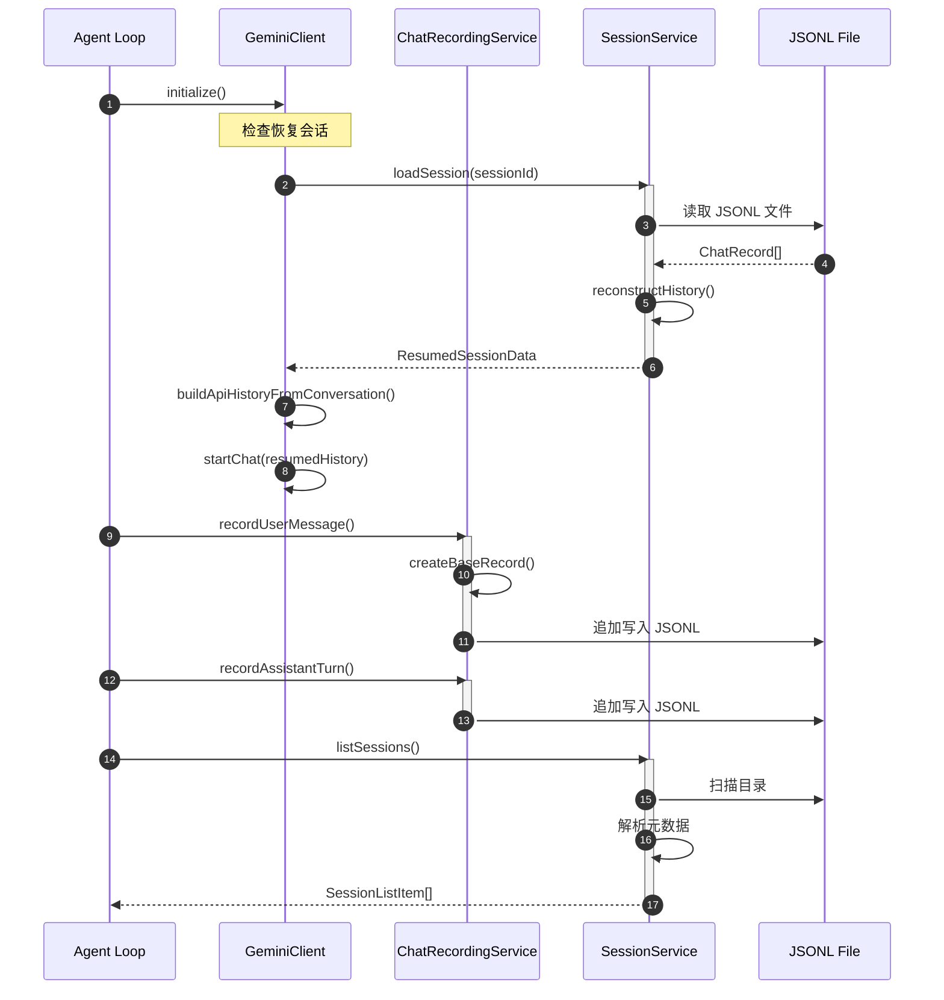
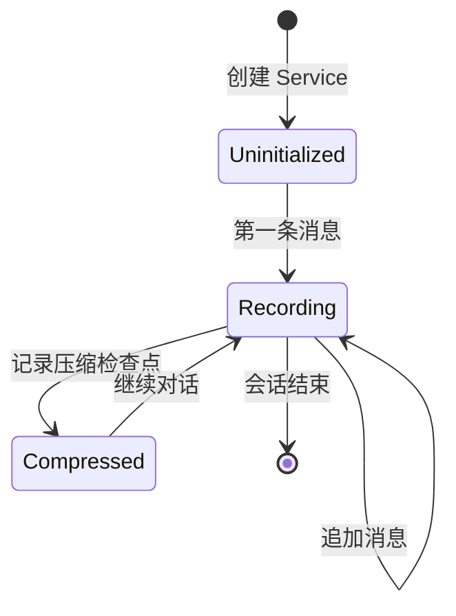
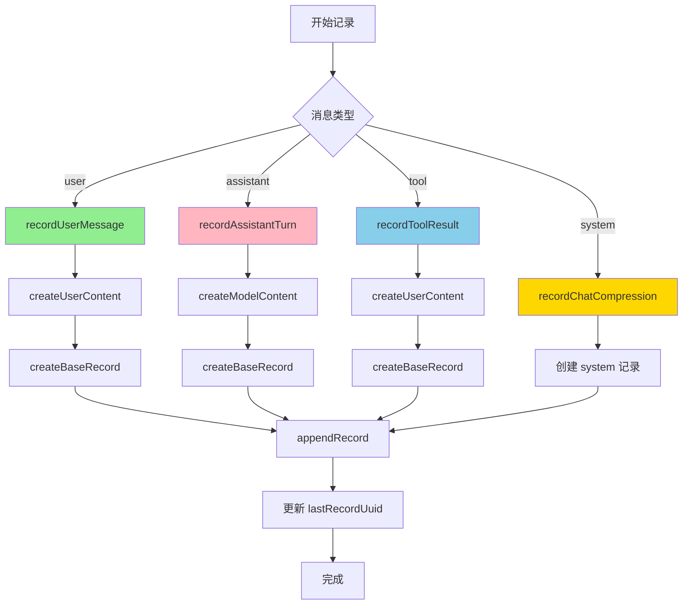
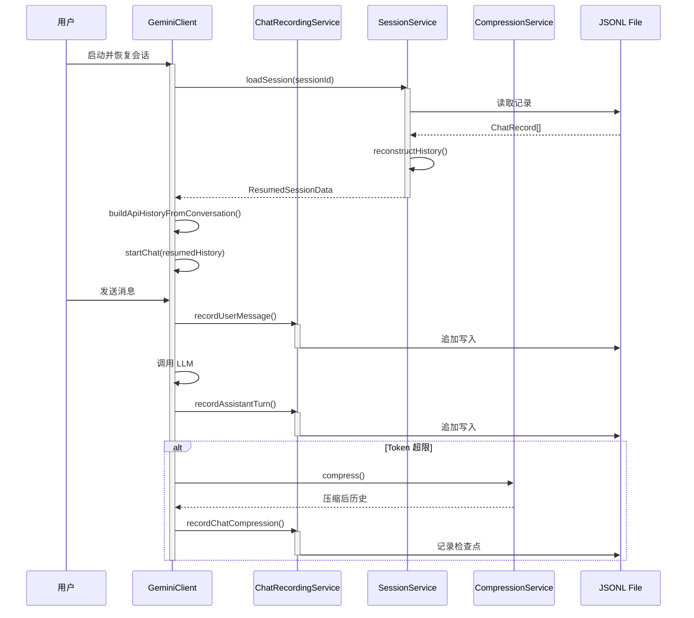
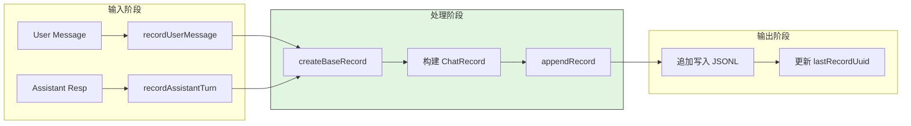
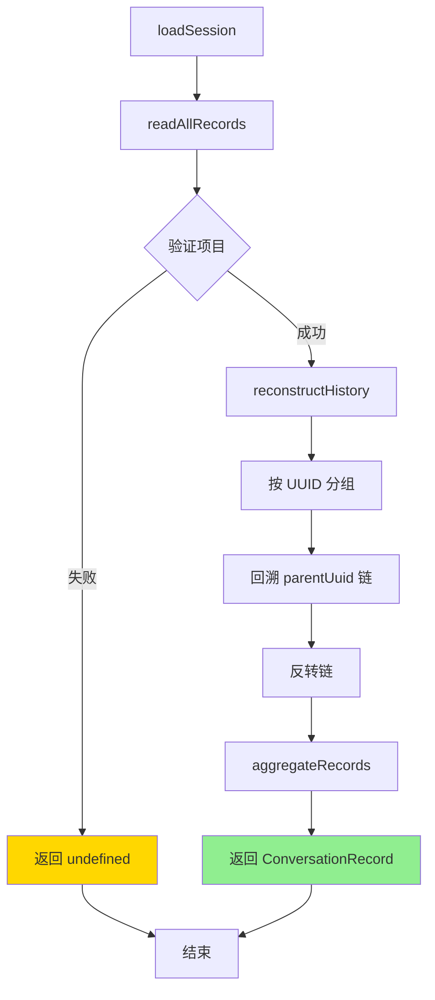
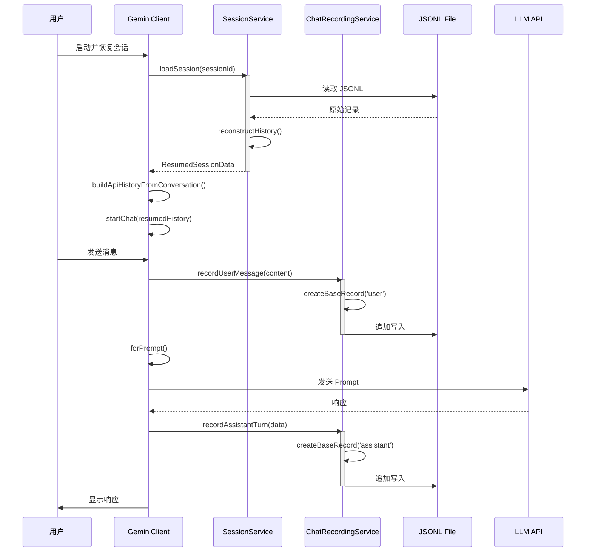
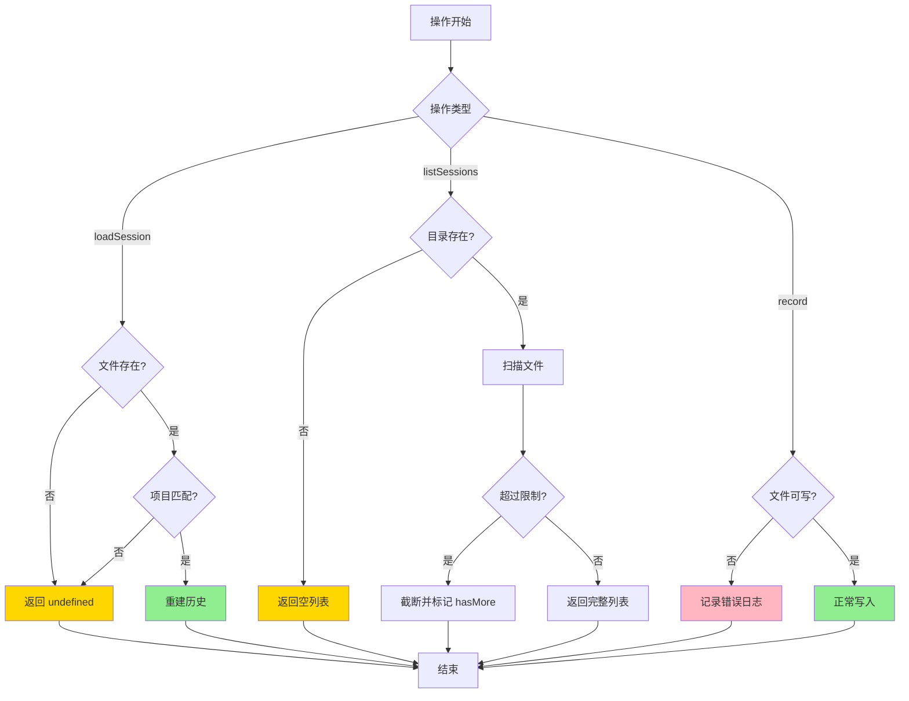
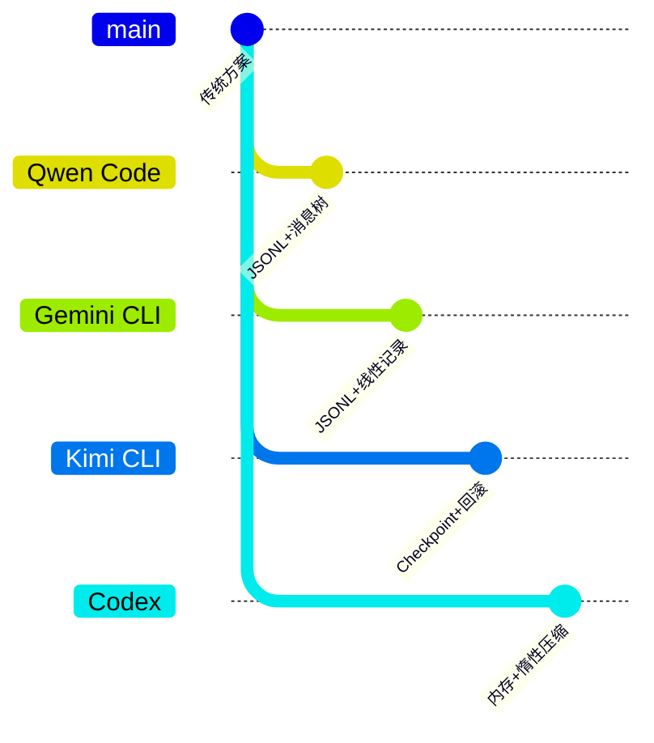

# Session 运行时（Qwen Code）

> 📋 **阅读指南**
>
> | 属性 | 说明 |
> |-----|------|
> | 预计阅读 | 20-25 分钟 |
> | 前置文档 | `01-qwen-code-overview.md`、`02-qwen-code-cli-entry.md` |
> | 文档结构 | 速览 → 架构 → 机制 → 实现 → 对比 |
> | 代码呈现 | 关键代码直接展示，完整代码可折叠查看 |

---

## TL;DR（结论先行）

一句话定义：Session 运行时是 Code Agent 的上下文持久化层，负责对话历史的存储、恢复和压缩管理。

Qwen Code 的核心取舍：**JSONL 文件 + UUID 消息树 + 项目隔离**（对比 Gemini CLI 的分层记忆、Kimi CLI 的 Checkpoint 回滚、Codex 的惰性压缩）

### 核心要点速览

| 维度 | 关键决策 | 代码位置 |
|-----|---------|---------|
| 存储格式 | JSON Lines (JSONL) | `packages/core/src/services/sessionService.ts:128` |
| 消息结构 | 树形 (uuid/parentUuid) | `packages/core/src/services/chatRecordingService.ts:40` |
| 持久化策略 | 即时同步写入 | `packages/core/src/services/chatRecordingService.ts:265` |
| 项目隔离 | projectHash 目录隔离 | `packages/core/src/services/sessionService.ts:128` |
| 压缩策略 | 检查点快照 | `packages/core/src/services/chatCompressionService.ts:78` |
| 分页机制 | 游标分页 (mtime) | `packages/core/src/services/sessionService.ts:216` |

---

## 1. 为什么需要这个机制？（解决什么问题）

### 1.1 问题场景

没有 Session 运行时管理：
```
用户对话 → 程序崩溃 → 历史丢失 → 从头开始
多项目切换 → 会话混淆 → 上下文污染 → 回答错误
长对话 → Token 超限 → 无法继续 → 被迫重启
```

有 Session 运行时管理：
```
用户对话 → 自动持久化到 JSONL → 程序重启后恢复 → 对话继续
项目 A 对话 → 隔离存储 → 切换到项目 B → 各自独立历史
长对话 → 自动压缩检查点 → Token 降低 → 继续对话
```

### 1.2 核心挑战

| 挑战 | 不解决的后果 |
|-----|-------------|
| 对话持久化 | 程序崩溃或重启后丢失所有上下文 |
| 项目隔离 | 多项目会话混杂，导致上下文污染 |
| Token 超限 | 长对话导致上下文窗口溢出 |
| 会话恢复 | 无法从断点继续之前的对话 |
| 消息树结构 | 无法支持分支对话和复杂交互 |
| 并发安全 | 异步写入可能导致数据损坏 |

---

## 2. 整体架构（ASCII 图）

### 2.1 在系统中的位置

```text
┌─────────────────────────────────────────────────────────────┐
│ Agent Loop / GeminiClient                                    │
│ packages/core/src/core/client.ts:97                          │
└───────────────────────┬─────────────────────────────────────┘
                        │
        ┌───────────────┼───────────────┐
        ▼               ▼               ▼
┌──────────────┐ ┌──────────────┐ ┌──────────────┐
│ Session      │ │ Chat         │ │ Compression  │
│ Service      │ │ Recording    │ │ Service      │
│ 会话管理     │ │ Service      │ │ 压缩检查点   │
└──────┬───────┘ └──────┬───────┘ └──────┬───────┘
       │                │                │
       ▼                ▼                ▼
┌─────────────────────────────────────────────────────────────┐
│ ▓▓▓ Session Runtime ▓▓▓                                     │
│ packages/core/src/services/                                  │
│ - sessionService.ts       : 会话列表、加载、删除            │
│ - chatRecordingService.ts : 消息记录、持久化                │
│ - chatCompressionService.ts: 历史压缩检查点                 │
└───────────────────────┬─────────────────────────────────────┘
                        │ 依赖
        ┌───────────────┼───────────────┐
        ▼               ▼               ▼
┌──────────────┐ ┌──────────────┐ ┌──────────────┐
│ JSONL File   │ │ Project Hash │ │ Storage      │
│ ~/.qwen/tmp/ │ │ 项目隔离     │ │ Config       │
└──────────────┘ └──────────────┘ └──────────────┘
```

### 2.2 核心组件职责

| 组件 | 职责 | 代码位置 |
|-----|------|---------|
| `SessionService` | 会话列表查询、加载、删除 | `packages/core/src/services/sessionService.ts:128` |
| `ChatRecordingService` | 消息记录、文件持久化 | `packages/core/src/services/chatRecordingService.ts:173` |
| `ChatRecord` | 消息记录数据结构 | `packages/core/src/services/chatRecordingService.ts:40` |
| `buildApiHistoryFromConversation` | 重建 API 历史 | `packages/core/src/services/sessionService.ts:592` |
| `reconstructHistory` | 从树结构重建线性历史 | `packages/core/src/services/sessionService.ts:392` |

### 2.3 核心组件交互关系



**关键交互说明**：

| 步骤 | 交互内容 | 设计意图 |
|-----|---------|---------|
| 1-3 | 初始化时检查恢复 | 支持从断点继续对话 |
| 4-5 | 重建 API 历史 | 将存储格式转换为 API 可用格式 |
| 6-7 | 记录用户消息 | 即时持久化，保证数据安全 |
| 8-9 | 记录助手响应 | 完整记录模型输出 |
| 10-12 | 列出会话 | 支持会话管理和切换 |

---

## 3. 核心组件详细分析

### 3.1 ChatRecordingService 内部结构

#### 职责定位

ChatRecordingService 是 Qwen Code 会话持久化的核心，负责将对话历史以 JSONL 格式追加写入文件，支持消息树结构和即时持久化。

#### 状态机图



**状态说明**：

| 状态 | 说明 | 进入条件 | 退出条件 |
|-----|------|---------|---------|
| Uninitialized | 未初始化 | Service 创建 | 首次写入消息 |
| Recording | 记录中 | 开始对话 | 会话结束 |
| Compressed | 已压缩 | 记录压缩检查点 | 继续对话 |

#### 内部数据流

```text
┌─────────────────────────────────────────────────────────────┐
│  输入层                                                      │
│  ├── User Message      ──► recordUserMessage()              │
│  ├── Assistant Resp    ──► recordAssistantTurn()            │
│  ├── Tool Result       ──► recordToolResult()               │
│  └── Compression       ──► recordChatCompression()          │
└──────────────────────────┬──────────────────────────────────┘
                           ▼
┌─────────────────────────────────────────────────────────────┐
│  处理层                                                      │
│  ├── createBaseRecord(): 生成 uuid/parentUuid/timestamp     │
│  ├── 构建 ChatRecord 对象                                   │
│  └── appendRecord(): 追加到文件                             │
└──────────────────────────┬──────────────────────────────────┘
                           ▼
┌─────────────────────────────────────────────────────────────┐
│  持久化层                                                    │
│  ├── ~/.qwen/tmp/<hash>/chats/<sessionId>.jsonl            │
│  └── 追加写入模式 (flags: 'a')                              │
└─────────────────────────────────────────────────────────────┘
```

#### 关键算法逻辑



**算法要点**：

1. **消息类型分离**：不同类型消息使用不同方法记录
2. **UUID 链**：通过 parentUuid 构建消息树
3. **即时持久化**：每次记录立即写入文件
4. **原子创建**：使用 'wx' 标志避免文件竞争

#### 关键接口

| 接口 | 输入 | 输出 | 说明 | 代码位置 |
|-----|------|------|------|---------|
| `recordUserMessage()` | PartListUnion | void | 记录用户消息 | `chatRecordingService.ts:283` |
| `recordAssistantTurn()` | model, message, tokens | void | 记录助手响应 | `chatRecordingService.ts:304` |
| `recordToolResult()` | message, toolCallResult | void | 记录工具结果 | `chatRecordingService.ts:336` |
| `recordChatCompression()` | ChatCompressionInfo | void | 记录压缩检查点 | `chatRecordingService.ts:398` |

---

### 3.2 SessionService 内部结构

#### 职责定位

SessionService 负责会话的管理操作，包括列出会话、加载会话、删除会话，支持分页查询和会话恢复。

#### 关键算法逻辑

```typescript
// packages/core/src/services/sessionService.ts:216-320
async listSessions(options: ListSessionsOptions = {}): Promise<ListSessionsResult> {
  // 1. 扫描目录获取所有会话文件
  const files = await fs.promises.readdir(this.getChatsDir());

  // 2. 过滤并提取元数据
  for (const file of files) {
    if (!SESSION_FILE_PATTERN.test(file)) continue;
    // 提取第一条用户提示、消息数量等
  }

  // 3. 按 mtime 降序排列
  sessions.sort((a, b) => b.mtime - a.mtime);

  // 4. 游标分页
  const startIndex = cursor ? sessions.findIndex(s => s.mtime < cursor) : 0;
  return {
    items: sessions.slice(startIndex, startIndex + size),
    nextCursor: sessions[startIndex + size - 1]?.mtime,
    hasMore: sessions.length > startIndex + size,
  };
}
```

**算法要点**：

1. **正则过滤**：使用 SESSION_FILE_PATTERN 验证文件名
2. **项目隔离**：通过 projectHash 过滤非当前项目会话
3. **游标分页**：基于 mtime 实现高效分页
4. **安全限制**：MAX_FILES_TO_PROCESS 防止性能问题

#### 会话恢复算法

```typescript
// packages/core/src/services/sessionService.ts:437-477
async loadSession(sessionId: string): Promise<ResumedSessionData | undefined> {
  // 1. 读取所有记录
  const records = await this.readAllRecords(filePath);

  // 2. 验证项目归属
  const recordProjectHash = getProjectHash(firstRecord.cwd);
  if (recordProjectHash !== this.projectHash) return;

  // 3. 重建线性历史
  const messages = this.reconstructHistory(records);

  // 4. 返回恢复数据
  return {
    conversation: { sessionId, projectHash, messages, ... },
    filePath,
    lastCompletedUuid: lastMessage.uuid,
  };
}
```

---

### 3.3 消息树重建算法

#### 职责定位

将 JSONL 中扁平存储的记录重建为线性对话历史，支持通过 leafUuid 重建特定分支。

#### 关键算法逻辑

```typescript
// packages/core/src/services/sessionService.ts:392-428
private reconstructHistory(records: ChatRecord[], leafUuid?: string): ChatRecord[] {
  // 1. 按 UUID 分组记录（支持同一消息的多个片段）
  const recordsByUuid = new Map<string, ChatRecord[]>();
  for (const record of records) {
    const existing = recordsByUuid.get(record.uuid) || [];
    existing.push(record);
    recordsByUuid.set(record.uuid, existing);
  }

  // 2. 从 leafUuid 或最后一条记录开始回溯
  let currentUuid: string | null = leafUuid ?? records[records.length - 1].uuid;
  const uuidChain: string[] = [];
  const visited = new Set<string>();

  // 3. 沿 parentUuid 链回溯
  while (currentUuid && !visited.has(currentUuid)) {
    visited.add(currentUuid);
    uuidChain.push(currentUuid);
    const recordsForUuid = recordsByUuid.get(currentUuid);
    currentUuid = recordsForUuid?.[0].parentUuid ?? null;
  }

  // 4. 反转得到正序历史
  uuidChain.reverse();

  // 5. 合并同一 UUID 的多个记录
  for (const uuid of uuidChain) {
    const recordsForUuid = recordsByUuid.get(uuid);
    if (recordsForUuid && recordsForUuid.length > 0) {
      messages.push(this.aggregateRecords(recordsForUuid));
    }
  }

  return messages;
}
```

**算法要点**：

1. **UUID 分组**：同一消息可能分多段存储
2. **回溯链**：沿 parentUuid 构建消息链
3. **循环检测**：使用 visited Set 防止无限循环
4. **记录合并**：aggregateRecords 合并多段记录

---

### 3.4 组件间协作时序



**协作要点**：

1. **恢复流程**：加载 → 重建 → 构建 API 历史 → 启动 Chat
2. **记录流程**：即时追加写入，保证数据安全
3. **压缩流程**：触发压缩 → 记录检查点 → 重建 Chat

---

### 3.5 关键数据路径

#### 主路径（正常流程）



#### 恢复路径



---

## 4. 端到端数据流转

### 4.1 正常流程（详细版）



**数据变换详情**：

| 阶段 | 输入 | 处理 | 输出 | 代码位置 |
|-----|------|------|------|---------|
| 加载 | sessionId | 读取 JSONL | ChatRecord[] | `sessionService.ts:437` |
| 重建 | ChatRecord[] | reconstructHistory | 线性历史 | `sessionService.ts:392` |
| 构建历史 | ConversationRecord | buildApiHistory | Content[] | `sessionService.ts:592` |
| 记录 | PartListUnion | createBaseRecord | ChatRecord | `chatRecordingService.ts:247` |
| 持久化 | ChatRecord | JSON.stringify | JSONL 行 | `chatRecordingService.ts:265` |

### 4.2 数据流向图

```mermaid
flowchart LR
    subgraph Input["输入"]
        I1[User Message]
        I2[Assistant Response]
        I3[Tool Result]
    end

    subgraph Recording["ChatRecordingService"]
        R1[createBaseRecord]
        R2[构建 ChatRecord]
        R3[appendRecord]
    end

    subgraph File["JSONL File"]
        F1[~/.qwen/tmp/<hash>/chats/]
        F2[uuid/parentUuid 链]
    end

    subgraph Session["SessionService"]
        S1[loadSession]
        S2[reconstructHistory]
        S3[aggregateRecords]
    end

    subgraph Output["输出"]
        O1[ConversationRecord]
        O2[Content[] for API]
    end

    I1 --> R1
    I2 --> R1
    I3 --> R1
    R1 --> R2
    R2 --> R3
    R3 --> F1
    F1 --> F2
    F2 --> S1
    S1 --> S2
    S2 --> S3
    S3 --> O1
    O1 --> O2
```

### 4.3 异常/边界流程



---

## 5. 关键代码实现

### 5.1 核心数据结构

```typescript
// packages/core/src/services/chatRecordingService.ts:40-99
export interface ChatRecord {
  /** Unique identifier for this logical message */
  uuid: string;
  /** UUID of the parent message; null for root */
  parentUuid: string | null;
  /** Session identifier */
  sessionId: string;
  /** ISO 8601 timestamp */
  timestamp: string;
  /** Message type */
  type: 'user' | 'assistant' | 'tool_result' | 'system';
  /** Optional system subtype */
  subtype?: 'chat_compression' | 'slash_command' | 'ui_telemetry' | 'at_command';
  /** Working directory at time of message */
  cwd: string;
  /** The actual Content object (role + parts) */
  message?: Content;
  /** Token usage statistics */
  usageMetadata?: GenerateContentResponseUsageMetadata;
  /** Model used for this response */
  model?: string;
  /** Tool call metadata for UI recovery */
  toolCallResult?: Partial<ToolCallResponseInfo>;
  /** Payload for system records */
  systemPayload?: ChatCompressionRecordPayload | ...;
}
```

**字段说明**：

| 字段 | 类型 | 用途 |
|-----|------|------|
| `uuid` | `string` | 消息唯一标识 |
| `parentUuid` | `string \| null` | 父消息 UUID，构建树结构 |
| `sessionId` | `string` | 所属会话 ID |
| `type` | `'user' \| 'assistant' \| ...` | 消息类型 |
| `message` | `Content` | API 格式的消息内容 |
| `usageMetadata` | `GenerateContentResponseUsageMetadata` | Token 使用统计 |

### 5.2 主链路代码

```typescript
// packages/core/src/services/chatRecordingService.ts:247-275
private createBaseRecord(type: ChatRecord['type']): Omit<ChatRecord, 'message' | ...> {
  return {
    uuid: randomUUID(),
    parentUuid: this.lastRecordUuid,
    sessionId: this.getSessionId(),
    timestamp: new Date().toISOString(),
    type,
    cwd: this.config.getProjectRoot(),
    version: this.config.getCliVersion() || 'unknown',
    gitBranch: getGitBranch(this.config.getProjectRoot()),
  };
}

private appendRecord(record: ChatRecord): void {
  try {
    const conversationFile = this.ensureConversationFile();
    jsonl.writeLineSync(conversationFile, record);
    this.lastRecordUuid = record.uuid;
  } catch (error) {
    debugLogger.error('Error appending record:', error);
    throw error;
  }
}
```

**代码要点**：

1. **UUID 生成**：使用 randomUUID() 生成唯一标识
2. **链式结构**：parentUuid 指向 lastRecordUuid 构建链
3. **即时持久化**：writeLineSync 同步写入保证数据安全
4. **状态更新**：写入成功后更新 lastRecordUuid

### 5.3 关键调用链

```text
GeminiClient.initialize()
  -> config.getResumedSessionData()     [检查恢复数据]
  -> sessionService.loadSession()       [sessionService.ts:437]
    -> readAllRecords()                  [sessionService.ts:325]
    -> reconstructHistory()              [sessionService.ts:392]
      -> aggregateRecords()              [sessionService.ts:340]
  -> buildApiHistoryFromConversation()   [sessionService.ts:592]
    -> stripThoughtsFromContent()        [过滤思考内容]
  -> startChat(resumedHistory)           [client.ts:176]

GeminiClient.sendMessageStream()
  -> chatRecordingService.recordUserMessage()   [chatRecordingService.ts:283]
    -> createBaseRecord('user')                  [chatRecordingService.ts:247]
    -> appendRecord()                            [chatRecordingService.ts:265]
  -> chatRecordingService.recordAssistantTurn() [chatRecordingService.ts:304]
    -> createBaseRecord('assistant')             [chatRecordingService.ts:247]
    -> appendRecord()                            [chatRecordingService.ts:265]

SessionService.listSessions()
  -> readdirSync()                       [sessionService.ts:225]
  -> jsonl.readLines()                   [读取前 N 行]
  -> countSessionMessages()              [统计消息数]
  -> 按 mtime 排序 + 游标分页            [sessionService.ts:246-319]
```

---

## 6. 设计意图与 Trade-off

### 6.1 Qwen Code 的选择

| 维度 | Qwen Code 的选择 | 替代方案 | 取舍分析 |
|-----|-----------------|---------|---------|
| 存储格式 | JSON Lines | SQLite / 二进制 / 内存 | 可读性好、追加高效；但体积较大、随机访问慢 |
| 消息结构 | 树形 (uuid/parentUuid) | 线性数组 | 支持分支对话；但重建需要回溯 |
| 持久化策略 | 即时同步写入 | 异步批量写入 | 数据安全高；但 IO 开销大 |
| 项目隔离 | projectHash 目录隔离 | 单文件多项目 | 隔离清晰；但目录结构复杂 |
| 压缩策略 | 检查点快照 | 无检查点 | 支持精确恢复；但占用额外存储 |
| 分页机制 | 游标分页 (mtime) | Offset 分页 | 高效稳定；但依赖文件时间戳 |

### 6.2 为什么这样设计？

**核心问题**：如何在保证数据安全的同时，支持复杂的对话历史管理？

**Qwen Code 的解决方案**：
- 代码依据：`chatRecordingService.ts:265` 的即时同步写入
- 设计意图：通过 JSONL 追加写入 + 消息树结构，实现即时持久化和灵活的历史重建
- 带来的好处：
  - 程序崩溃不会丢失已记录的消息
  - 消息树结构支持未来的分支对话功能
  - JSON 格式人类可读，便于调试
  - 压缩检查点支持 Token 超限后的历史恢复
- 付出的代价：
  - 同步写入带来 IO 开销
  - 消息重建需要回溯整个链
  - 文件大小随对话增长

### 6.3 与其他项目的对比



| 项目 | 存储格式 | 消息结构 | 持久化策略 | 压缩策略 | 回滚能力 | 适用场景 |
|-----|---------|---------|-----------|---------|---------|---------|
| **Qwen Code** | JSONL | 树形 (uuid/parentUuid) | 即时同步写入 | 检查点快照 | 无（继承 Gemini） | 需要数据安全和复杂历史管理 |
| **Gemini CLI** | JSONL | 线性记录 | 即时同步写入 | 检查点快照 | 无 | 通用场景、数据安全优先 |
| **Kimi CLI** | JSONL | 线性 + Checkpoint 标记 | 异步写入 | 保留 N 条 + LLM 摘要 | Checkpoint + D-Mail | 需要精确状态恢复、时间旅行 |
| **Codex** | JSON Lines Rollout | 内存数组 | 内存管理 | 惰性 Compaction | 无 | 通用场景、平衡性能与精度 |

**核心差异分析**：

| 对比维度 | Qwen Code | Gemini CLI | Kimi CLI | Codex |
|---------|-----------|-----------|----------|-------|
| **存储格式** | JSONL 文件 | JSONL 文件 | JSONL WireFile | JSON Lines Rollout |
| **消息结构** | 树形 (uuid/parentUuid) | 线性记录 | 线性 + Checkpoint | 内存数组 |
| **持久化时机** | 即时同步写入 | 即时同步写入 | 异步写入 | 内存管理 |
| **项目隔离** | projectHash 目录 | projectHash 目录 | 固定路径 | 内存隔离 |
| **压缩策略** | 检查点快照 | 检查点快照 | 保留 N 条 + LLM 摘要 | 惰性 Compaction |
| **回滚能力** | 无 | 无 | Checkpoint + D-Mail | 无 |
| **并发处理** | 同步写入 | 同步写入 | aiofiles 异步 | 同步 |

**选择建议**：

- **Qwen Code**：适合需要数据安全、支持未来分支对话功能的场景
- **Gemini CLI**：适合通用场景，追求简单高效和数据安全
- **Kimi CLI**：适合需要精确控制对话历史、经常需要回滚的用户
- **Codex**：适合追求极致性能，不需要复杂持久化的场景

---

## 7. 边界情况与错误处理

### 7.1 终止条件

| 终止原因 | 触发条件 | 代码位置 |
|---------|---------|---------|
| 会话不存在 | loadSession 时文件不存在 | `sessionService.ts:443` |
| 项目不匹配 | recordProjectHash !== projectHash | `sessionService.ts:451` |
| 空会话文件 | 读取记录为空数组 | `sessionService.ts:445` |
| 目录不存在 | listSessions 时 chats 目录不存在 | `sessionService.ts:240` |
| 超过文件限制 | 处理文件数 > MAX_FILES_TO_PROCESS | `sessionService.ts:263` |
| 文件写入失败 | appendRecord 时 IO 错误 | `chatRecordingService.ts:271` |

### 7.2 资源限制

```typescript
// packages/core/src/services/sessionService.ts:106
const MAX_FILES_TO_PROCESS = 10000;

// packages/core/src/services/sessionService.ts:115
const MAX_PROMPT_SCAN_LINES = 10;

// packages/core/src/services/sessionService.ts:113
const SESSION_FILE_PATTERN = /^[0-9a-fA-F-]{32,36}\.jsonl$/;
```

### 7.3 错误恢复策略

| 错误类型 | 处理策略 | 代码位置 |
|---------|---------|---------|
| 会话文件不存在 | 返回 undefined，视为新会话 | `sessionService.ts:443` |
| 项目不匹配 | 返回 undefined，防止跨项目访问 | `sessionService.ts:451` |
| 目录不存在 | 返回空列表 | `sessionService.ts:240` |
| 文件读取错误 | 记录错误，返回空数组 | `sessionService.ts:330` |
| 文件写入错误 | 记录错误日志，抛出异常 | `chatRecordingService.ts:271` |
| JSON 解析错误 | 跳过损坏行，继续处理 | `sessionService.ts:191` |

---

## 8. 关键代码索引

| 功能 | 文件 | 行号 | 说明 |
|-----|------|------|------|
| SessionService 类 | `packages/core/src/services/sessionService.ts` | 128 | 会话管理核心类 |
| listSessions | `packages/core/src/services/sessionService.ts` | 216 | 分页列出会话 |
| loadSession | `packages/core/src/services/sessionService.ts` | 437 | 加载会话用于恢复 |
| removeSession | `packages/core/src/services/sessionService.ts` | 485 | 删除会话 |
| reconstructHistory | `packages/core/src/services/sessionService.ts` | 392 | 重建消息树 |
| aggregateRecords | `packages/core/src/services/sessionService.ts` | 340 | 合并多段记录 |
| buildApiHistoryFromConversation | `packages/core/src/services/sessionService.ts` | 592 | 构建 API 历史 |
| ChatRecordingService 类 | `packages/core/src/services/chatRecordingService.ts` | 173 | 消息记录服务 |
| ChatRecord 接口 | `packages/core/src/services/chatRecordingService.ts` | 40 | 消息记录结构 |
| recordUserMessage | `packages/core/src/services/chatRecordingService.ts` | 283 | 记录用户消息 |
| recordAssistantTurn | `packages/core/src/services/chatRecordingService.ts` | 304 | 记录助手响应 |
| recordChatCompression | `packages/core/src/services/chatRecordingService.ts` | 398 | 记录压缩检查点 |
| createBaseRecord | `packages/core/src/services/chatRecordingService.ts` | 247 | 创建基础记录 |
| appendRecord | `packages/core/src/services/chatRecordingService.ts` | 265 | 追加记录到文件 |
| GeminiClient.initialize | `packages/core/src/core/client.ts` | 97 | 客户端初始化 |

---

## 9. 延伸阅读

- 前置知识：`04-qwen-code-agent-loop.md`（Agent Loop 如何使用 Session）
- 相关机制：`docs/qwen-code/questions/qwen-code-chat-compression.md`（压缩检查点深度分析）
- 跨项目对比：`docs/comm/comm-memory-context.md`（多项目 Memory 对比）
- 相关项目：
  - `docs/gemini-cli/03-gemini-cli-session-runtime.md`（Gemini CLI 的 Session 实现）
  - `docs/kimi-cli/07-kimi-cli-memory-context.md`（Kimi CLI 的 Checkpoint 机制）
  - `docs/codex/07-codex-memory-context.md`（Codex 的惰性压缩）

---

*✅ Verified: 基于 qwen-code/packages/core/src/services/sessionService.ts、chatRecordingService.ts、core/client.ts 源码分析*
*基于版本：2026-02-08 | 最后更新：2026-03-03*
