# Agent Loop（Qwen Code）

## TL;DR（结论先行）

一句话定义：Agent Loop 是 Code Agent 的控制核心，让 LLM 从"一次性回答"变成"多轮执行"。

Qwen Code 的核心取舍：**递归 continuation 驱动 + 流式事件架构**（对比 Kimi CLI 的 while 循环、Codex 的 Actor 消息驱动）

---

## 1. 为什么需要这个机制？（解决什么问题）

### 1.1 问题场景

没有 Agent Loop：用户问"修复这个 bug"→ LLM 一次回答→ 结束（可能根本没看文件）

有 Agent Loop：
  - LLM: "先读文件" → 读文件 → 得到结果
  - LLM: "再跑测试" → 执行测试 → 得到结果
  - LLM: "修改第 42 行" → 写文件 → 成功

### 1.2 核心挑战

| 挑战 | 不解决的后果 |
|-----|-------------|
| 如何持续驱动多轮对话 | 无法完成复杂任务，只能一次性回答 |
| 如何处理工具调用与结果回注 | 工具无法被调用，或调用结果无法反馈给 LLM |
| 如何防止无限循环 | 资源耗尽，用户体验差 |
| 如何管理上下文长度 | Token 超限导致请求失败 |

---

## 2. 整体架构

### 2.1 在系统中的位置

```text
┌─────────────────────────────────────────────────────────────┐
│ UI 层                                                       │
│ packages/core/src/ui/useGeminiStream.ts                     │
│ - submitQuery() : 用户输入入口                              │
└───────────────────────┬─────────────────────────────────────┘
                        │ 调用
                        ▼
┌─────────────────────────────────────────────────────────────┐
│ ▓▓▓ Agent Loop ▓▓▓                                          │
│ packages/core/src/core/client.ts                            │
│ - sendMessageStream() : 递归入口，续跑驱动                  │
│ - tryCompressChat()   : 上下文压缩                          │
│ - loopDetector        : 循环检测                            │
│                                                             │
│ packages/core/src/core/turn.ts                              │
│ - turn.run()          : 单轮处理，流式产出事件              │
│ - handlePendingFunctionCall() : 工具调用收集                │
└───────────────────────┬─────────────────────────────────────┘
                        │
        ┌───────────────┼───────────────┐
        ▼               ▼               ▼
┌──────────────┐ ┌──────────────┐ ┌──────────────┐
│ LLM API      │ │ Tool System  │ │ Context      │
│ sendMessage  │ │ 工具执行     │ │ 压缩/管理    │
│ Stream       │ │              │ │              │
└──────────────┘ └──────────────┘ └──────────────┘
```

### 2.2 核心组件职责

| 组件 | 职责 | 代码位置 |
|-----|------|---------|
| `GeminiClient` | Agent Loop 控制器，管理递归续跑 | `packages/core/src/core/client.ts:403` |
| `Turn` | 单轮对话处理，流式解析模型输出 | `packages/core/src/core/turn.ts:233` |
| `LoopDetectionService` | 检测循环调用，防止无限循环 | `packages/core/src/services/loopDetectionService.ts` |
| `ChatCompressionService` | 上下文压缩，管理 token 使用 | `packages/core/src/core/client.ts:178` |

### 2.3 核心组件交互关系

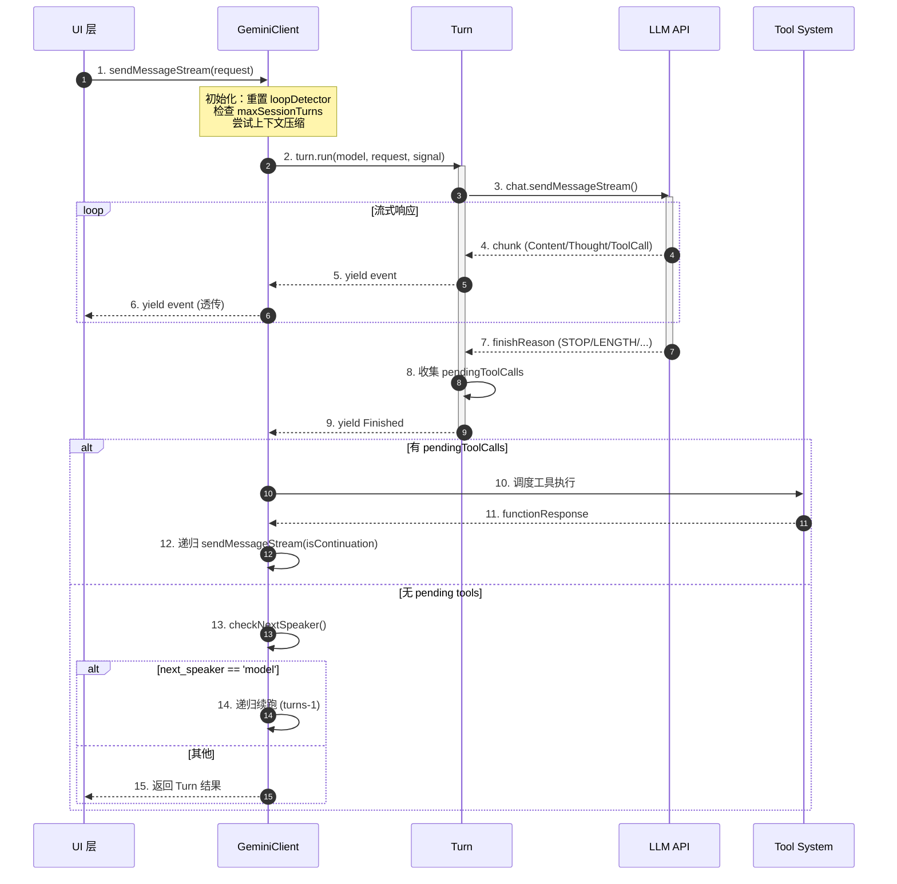

**关键交互说明**：

| 步骤 | 交互内容 | 设计意图 |
|-----|---------|---------|
| 1 | UI 向 Client 发起请求 | 解耦 UI 与核心逻辑，支持多种 UI 实现 |
| 2-3 | Client 创建 Turn 并调用 LLM | 单轮逻辑封装在 Turn 中，便于测试和复用 |
| 4-6 | 流式事件透传 | 实时响应用户，支持取消和进度展示 |
| 7-9 | Turn 完成，产出 Finished 事件 | 明确单轮结束，携带完成原因 |
| 10-12 | 工具执行后递归续跑 | 工具结果回注后继续对话，形成循环 |
| 13-15 | 检查是否需要模型继续 | 支持多 agent 协作场景 |

---

## 3. 核心组件详细分析

### 3.1 GeminiClient 内部结构

#### 职责定位

Agent Loop 的总控制器，负责递归驱动多轮对话、状态管理和终止条件检查。

#### 状态机图

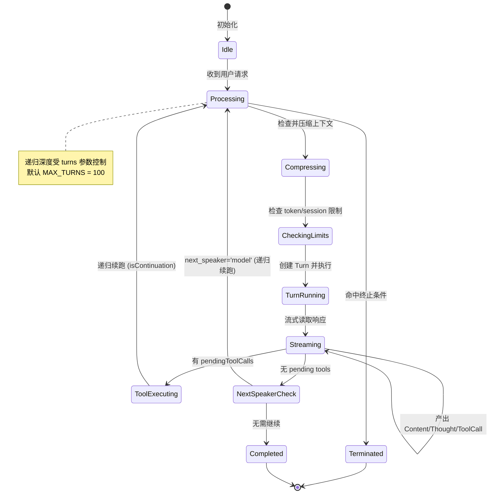

**状态说明**：

| 状态 | 说明 | 进入条件 | 退出条件 |
|-----|------|---------|---------|
| Idle | 空闲等待 | 初始化完成 | 收到新请求 |
| Processing | 处理中 | 收到请求 | 完成或终止 |
| Compressing | 上下文压缩 | 启用压缩且超出阈值 | 压缩完成或跳过 |
| CheckingLimits | 限制检查 | 压缩完成 | 检查通过或超限终止 |
| TurnRunning | Turn 执行中 | 限制检查通过 | Turn 完成 |
| Streaming | 流式响应处理 | Turn 开始产出 | 收到 finishReason |
| ToolExecuting | 工具执行 | 有 pendingToolCalls | 工具完成 |
| NextSpeakerCheck | 检查下一说话者 | 无 pending tools | 检查完成 |
| Completed | 正常完成 | 无需继续 | 自动结束 |
| Terminated | 终止 | 命中限制或错误 | 返回结果 |

#### 关键算法逻辑

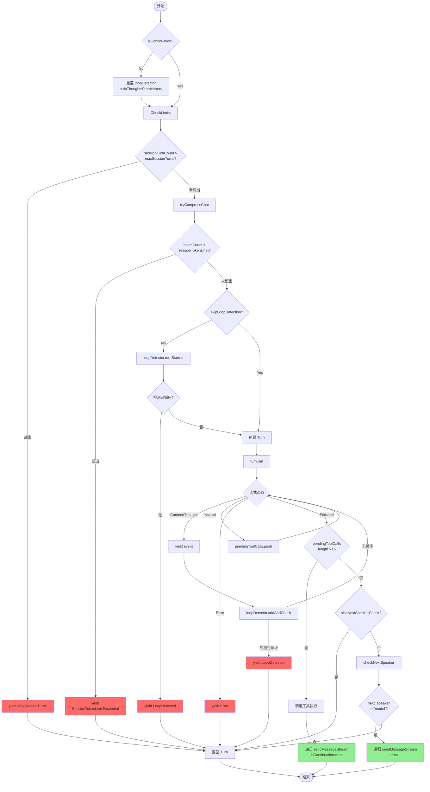

**算法要点**：

1. **递归驱动**：通过 `yield* this.sendMessageStream(...)` 实现续跑，每轮独立的 turns 计数
2. **流式实时检测**：在流式读取过程中实时进行循环检测，及时发现异常
3. **多层终止条件**：硬性限制（turns/token）、用户干预（signal）、循环检测、自然收敛
4. **工具优先于续跑**：有 pendingToolCalls 时优先处理工具，而非直接 checkNextSpeaker

#### 关键接口

| 接口 | 输入 | 输出 | 说明 | 代码位置 |
|-----|------|------|------|---------|
| `sendMessageStream()` | request, signal, prompt_id, options, turns | AsyncGenerator<event> | 递归入口 | `client.ts:403` |
| `tryCompressChat()` | promptId, force | compressionStatus, info | 上下文压缩 | `client.ts:178` |
| `reset()` | prompt_id | void | 重置 loop 状态 | `client.ts:244` |

---

### 3.2 Turn 内部结构

#### 职责定位

封装单轮对话的完整生命周期：调用 LLM、流式解析响应、收集工具调用请求。

#### 状态机图

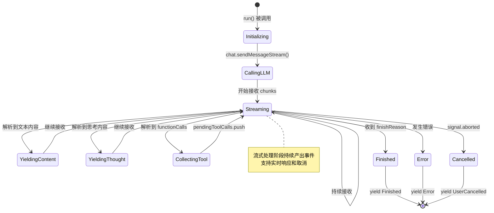

**状态说明**：

| 状态 | 说明 | 进入条件 | 退出条件 |
|-----|------|---------|---------|
| Initializing | 初始化 | run() 被调用 | 开始调用 LLM |
| CallingLLM | 调用 LLM | 初始化完成 | 开始接收响应 |
| Streaming | 流式接收 | 开始接收 chunks | 收到 finishReason/错误/取消 |
| YieldingContent | 产出文本 | 解析到文本内容 | 产出完成 |
| YieldingThought | 产出思考 | 解析到思考内容 | 产出完成 |
| CollectingTool | 收集工具调用 | 解析到 functionCalls | 收集完成 |
| Finished | 完成 | 收到 finishReason | 自动结束 |
| Error | 错误 | 发生异常 | 自动结束 |
| Cancelled | 取消 | 用户中断 | 自动结束 |

#### 内部数据流

```text
┌─────────────────────────────────────────────────────────────┐
│  输入层                                                      │
│  ├── model: 模型名称                                         │
│  ├── req: PartListUnion (用户请求)                          │
│  └── signal: AbortSignal (取消信号)                         │
└──────────────────────────┬──────────────────────────────────┘
                           ▼
┌─────────────────────────────────────────────────────────────┐
│  LLM 调用层                                                  │
│  ├── chat.sendMessageStream()                               │
│  └── 返回 AsyncGenerator<StreamEvent>                       │
└──────────────────────────┬──────────────────────────────────┘
                           ▼
┌─────────────────────────────────────────────────────────────┐
│  流式处理层                                                  │
│  ├── 重试事件处理 → yield Retry                             │
│  ├── 思考提取 → getThoughtText() → yield Thought            │
│  ├── 文本提取 → getResponseText() → yield Content           │
│  ├── 工具调用 → handlePendingFunctionCall()                 │
│  │   └── pendingToolCalls.push() → yield ToolCallRequest    │
│  └── 完成检测 → finishReason → yield Finished               │
└──────────────────────────┬──────────────────────────────────┘
                           ▼
┌─────────────────────────────────────────────────────────────┐
│  输出层                                                      │
│  ├── 流式事件: ServerGeminiStreamEvent                      │
│  ├── 状态存储: debugResponses, finishReason                 │
│  └── 工具队列: pendingToolCalls (供上层调度)                │
└─────────────────────────────────────────────────────────────┘
```

#### 关键接口

| 接口 | 输入 | 输出 | 说明 | 代码位置 |
|-----|------|------|------|---------|
| `run()` | model, req, signal | AsyncGenerator<event> | 单轮执行入口 | `turn.ts:233` |
| `handlePendingFunctionCall()` | fnCall | ToolCallRequestEvent | 处理工具调用 | `turn.ts:402` |

---

### 3.3 组件间协作时序

展示完整的多轮对话场景（包含工具调用和续跑）：

```mermaid
sequenceDiagram
    participant UI as UI 层
    participant Client as GeminiClient
    participant Turn as Turn
    participant LLM as LLM API
    participant Tool as Tool System
    participant Loop as LoopDetector

    %% 第一轮：请求工具调用
    UI->>Client: sendMessageStream("修复 bug")
    activate Client

    Client->>Loop: reset(prompt_id)
    Client->>Client: tryCompressChat()
    Client->>Loop: turnStarted()
    Loop-->>Client: false (无循环)

    Client->>Turn: new Turn(chat, prompt_id)
    Client->>Turn: turn.run(model, request, signal)
    activate Turn

    Turn->>LLM: sendMessageStream()
    activate LLM
    LLM-->>Turn: chunk: "我来分析..."
    Turn-->>Client: yield Content
    Client-->>UI: yield Content

    LLM-->>Turn: chunk: Thought (思考)
    Turn-->>Client: yield Thought
    Client-->>UI: yield Thought

    LLM-->>Turn: chunk: ToolCall (readFile)
    Turn->>Turn: pendingToolCalls.push()
    Turn-->>Client: yield ToolCallRequest
    Client-->>UI: yield ToolCallRequest

    LLM-->>Turn: chunk: finishReason=STOP
    Turn-->>Client: yield Finished
    deactivate LLM
    deactivate Turn

    %% 工具执行
    Client->>Tool: 调度执行 readFile
    activate Tool
    Tool-->>Client: functionResponse (文件内容)
    deactivate Tool

    %% 第二轮：递归续跑（工具结果回注）
    Client->>Client: sendMessageStream(isContinuation=true)
    Client->>Loop: turnStarted()
    Loop-->>Client: false

    Client->>Turn: turn.run(model, functionResponse, signal)
    activate Turn
    Turn->>LLM: sendMessageStream()
    activate LLM

    LLM-->>Turn: chunk: "根据文件内容..."
    Turn-->>Client: yield Content
    Client-->>UI: yield Content

    LLM-->>Turn: chunk: ToolCall (editFile)
    Turn->>Turn: pendingToolCalls.push()
    Turn-->>Client: yield ToolCallRequest
    Client-->>UI: yield ToolCallRequest

    LLM-->>Turn: chunk: finishReason=STOP
    Turn-->>Client: yield Finished
    deactivate LLM
    deactivate Turn

    %% 工具执行
    Client->>Tool: 调度执行 editFile
    activate Tool
    Tool-->>Client: functionResponse (编辑成功)
    deactivate Tool

    %% 第三轮：递归续跑
    Client->>Client: sendMessageStream(isContinuation=true)
    Client->>Turn: turn.run(model, functionResponse, signal)
    activate Turn
    Turn->>LLM: sendMessageStream()
    activate LLM

    LLM-->>Turn: chunk: "修复完成"
    Turn-->>Client: yield Content
    Client-->>UI: yield Content

    LLM-->>Turn: chunk: finishReason=STOP
    Turn-->>Client: yield Finished
    deactivate LLM
    deactivate Turn

    %% 检查是否需要继续
    Client->>Client: checkNextSpeaker()
    Note right of Client: 无 pending tools<br/>next_speaker != 'model'

    Client-->>UI: 返回 Turn 结果
    deactivate Client
```

**协作要点**：

1. **UI 与 Client**：UI 通过 `AsyncGenerator` 消费事件，实现实时响应
2. **Client 与 Turn**：Client 负责递归控制，Turn 负责单轮执行，职责分离
3. **Turn 与 LLM**：流式通信，支持取消和进度展示
4. **工具执行与递归**：工具结果通过递归调用回注，保持对话连贯性
5. **循环检测**：每轮开始前检查，防止无限循环

---

### 3.4 关键数据路径

#### 主路径（正常流程）

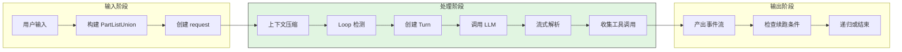

#### 异常路径（错误恢复）

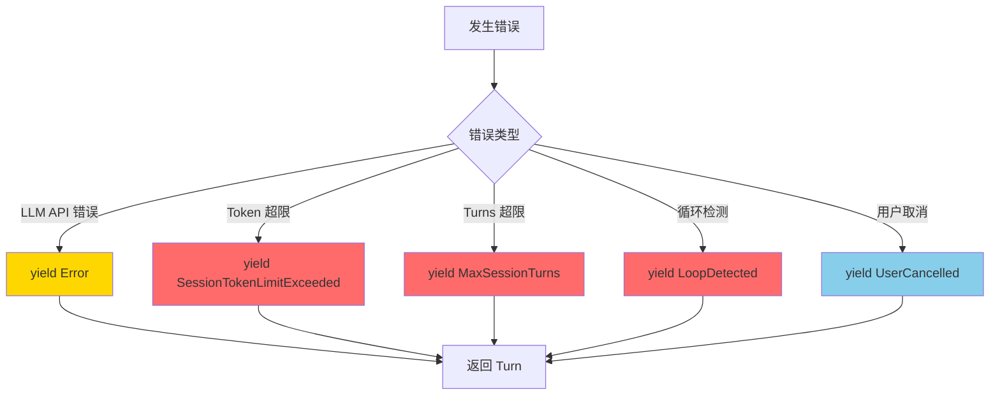

#### 递归续跑路径

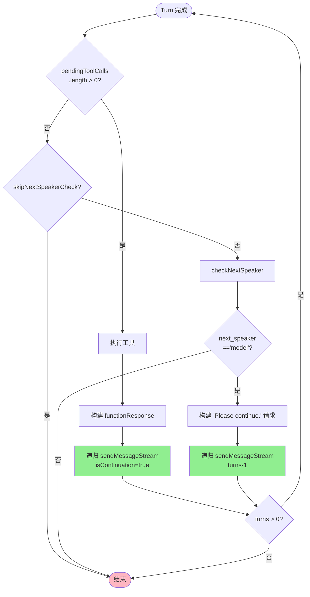

---

## 4. 端到端数据流转

### 4.1 正常流程（详细版）

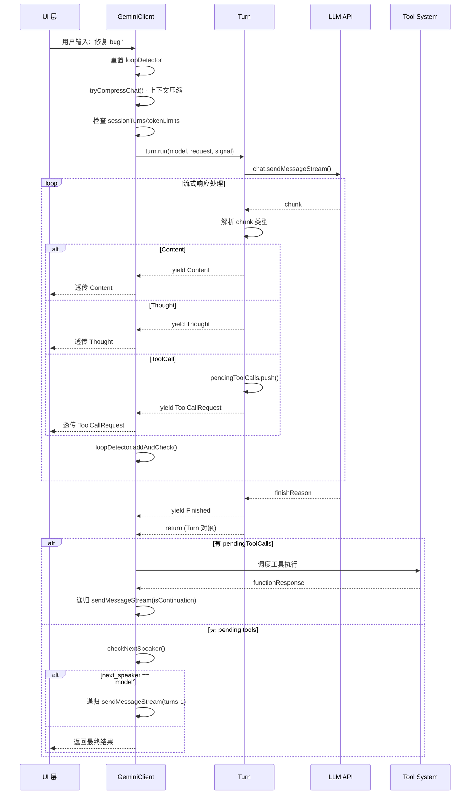

**数据变换详情**：

| 阶段 | 输入 | 处理 | 输出 | 代码位置 |
|-----|------|------|------|---------|
| 接收 | 用户输入字符串 | 构建 PartListUnion | request 对象 | `client.ts:403` |
| 压缩 | chat history | ChatCompressionService.compress | newHistory | `client.ts:434` |
| 检测 | StreamEvent | loopDetector.addAndCheck | boolean (是否循环) | `client.ts:491` |
| 解析 | GenerateContentResponse | getResponseText/getThoughtText | 结构化事件 | `turn.ts:369-378` |
| 工具收集 | functionCalls | handlePendingFunctionCall | pendingToolCalls | `turn.ts:382-385` |
| 续跑 | functionResponse | 构建下一轮 request | 递归调用 | `client.ts:537` |

### 4.2 数据流向图

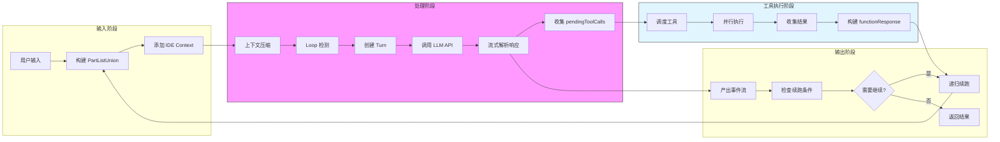

### 4.3 异常/边界流程

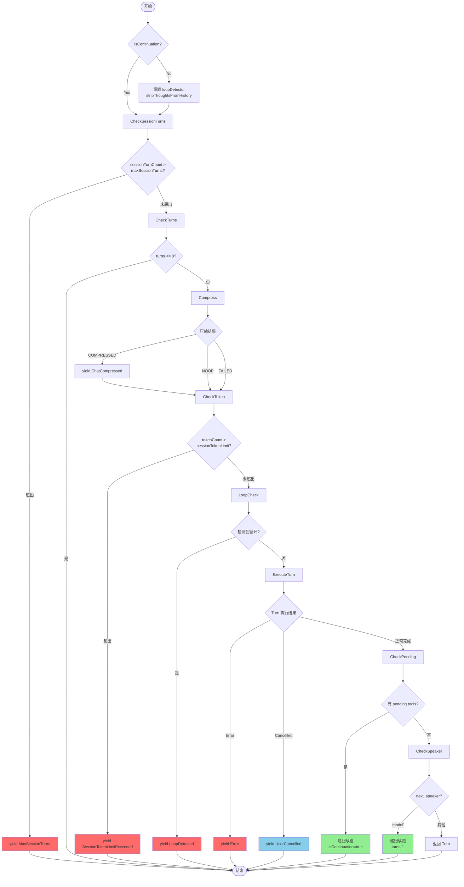

---

## 5. 关键代码实现

### 5.1 核心数据结构

```typescript
// packages/core/src/core/client.ts:76
const MAX_TURNS = 100;

// packages/core/src/core/turn.ts:85
export class Turn {
  readonly pendingToolCalls: ToolCallRequestInfo[] = [];
  private debugResponses: GenerateContentResponse[] = [];
  finishReason?: FinishReason;
  // ...
}

// packages/core/src/services/loopDetectionService.ts:15
export class LoopDetectionService {
  private turnCount = 0;
  private lastToolCalls: string[] = [];
  private consecutiveSameToolCalls = 0;
  // ...
}
```

**字段说明**：

| 字段 | 类型 | 用途 |
|-----|------|------|
| `MAX_TURNS` | `number` | 默认最大轮次限制（100） |
| `pendingToolCalls` | `ToolCallRequestInfo[]` | 待执行工具调用队列 |
| `debugResponses` | `GenerateContentResponse[]` | 调试用的原始响应记录 |
| `turnCount` | `number` | 当前会话轮次计数 |
| `lastToolCalls` | `string[]` | 最近工具调用历史（用于循环检测） |
| `consecutiveSameToolCalls` | `number` | 连续相同工具调用计数 |

### 5.2 主链路代码

```typescript
// packages/core/src/core/client.ts:403-558
async *sendMessageStream(
  request: PartListUnion,
  signal: AbortSignal,
  prompt_id: string,
  options?: { isContinuation: boolean },
  turns: number = MAX_TURNS,
): AsyncGenerator<ServerGeminiStreamEvent, Turn> {
  // 1. 非续跑时重置状态
  if (!options?.isContinuation) {
    this.loopDetector.reset(prompt_id);
    this.lastPromptId = prompt_id;
    this.stripThoughtsFromHistory();
  }

  // 2. 检查会话轮次限制
  this.sessionTurnCount++;
  if (this.config.getMaxSessionTurns() > 0 &&
      this.sessionTurnCount > this.config.getMaxSessionTurns()) {
    yield { type: GeminiEventType.MaxSessionTurns };
    return new Turn(this.getChat(), prompt_id);
  }

  // 3. 确保 turns 不超过 MAX_TURNS
  const boundedTurns = Math.min(turns, MAX_TURNS);
  if (!boundedTurns) {
    return new Turn(this.getChat(), prompt_id);
  }

  // 4. 尝试压缩上下文
  const compressed = await this.tryCompressChat(prompt_id, false);
  if (compressed.compressionStatus === CompressionStatus.COMPRESSED) {
    yield { type: GeminiEventType.ChatCompressed, value: compressed };
  }

  // 5. 检查 token 限制
  const sessionTokenLimit = this.config.getSessionTokenLimit();
  if (sessionTokenLimit > 0) {
    const tokenCount = uiTelemetryService.getLastPromptTokenCount();
    if (tokenCount > sessionTokenLimit) {
      yield { type: GeminiEventType.SessionTokenLimitExceeded, ... };
      return new Turn(this.getChat(), prompt_id);
    }
  }

  // 6. 创建 Turn 并执行
  const turn = new Turn(this.getChat(), prompt_id);

  // 7. 循环检测
  if (!this.config.getSkipLoopDetection()) {
    const loopDetected = await this.loopDetector.turnStarted(signal);
    if (loopDetected) {
      yield { type: GeminiEventType.LoopDetected };
      return turn;
    }
  }

  // 8. 执行 Turn，流式产出事件
  const resultStream = turn.run(this.config.getModel(), requestToSent, signal);
  for await (const event of resultStream) {
    if (!this.config.getSkipLoopDetection()) {
      if (this.loopDetector.addAndCheck(event)) {
        yield { type: GeminiEventType.LoopDetected };
        return turn;
      }
    }
    yield event;
    if (event.type === GeminiEventType.Error) {
      return turn;
    }
  }

  // 9. 检查是否需要续跑
  if (!turn.pendingToolCalls.length && signal && !signal.aborted) {
    if (this.config.getSkipNextSpeakerCheck()) {
      return turn;
    }

    const nextSpeakerCheck = await checkNextSpeaker(...);
    if (nextSpeakerCheck?.next_speaker === 'model') {
      const nextRequest = [{ text: 'Please continue.' }];
      // 递归续跑
      yield* this.sendMessageStream(
        nextRequest,
        signal,
        prompt_id,
        options,
        boundedTurns - 1,
      );
    }
  }
  return turn;
}
```

**代码要点**：

1. **递归驱动设计**：通过 `yield* this.sendMessageStream(...)` 实现续跑，保持调用栈清晰
2. **状态重置策略**：仅在非续跑时重置 loopDetector，保证循环检测跨轮次有效
3. **多层防御机制**：sessionTurns/turns/tokenLimits 三层限制，防止资源耗尽
4. **流式实时检测**：在事件流中实时进行循环检测，及时发现异常

### 5.3 关键调用链

```text
submitQuery()                    [packages/core/src/ui/useGeminiStream.ts]
  -> sendMessageStream()         [packages/core/src/core/client.ts:403]
    -> tryCompressChat()         [packages/core/src/core/client.ts:178]
    -> loopDetector.turnStarted() [packages/core/src/services/loopDetectionService.ts:477]
    -> turn.run()                [packages/core/src/core/turn.ts:233]
      -> chat.sendMessageStream() [LLM API 调用]
      -> handlePendingFunctionCall() [packages/core/src/core/turn.ts:402]
    -> checkNextSpeaker()        [packages/core/src/core/client.ts:548]
    -> [递归] sendMessageStream() [packages/core/src/core/client.ts:537]
```

---

## 6. 设计意图与 Trade-off

### 6.1 Qwen Code 的选择

| 维度 | Qwen Code 的选择 | 替代方案 | 取舍分析 |
|-----|-----------------|---------|---------|
| 循环结构 | 递归 continuation | while 循环 (Kimi CLI) | 代码更清晰，每轮有独立 turns 计数；递归深度受限于 MAX_TURNS |
| 事件架构 | 流式 AsyncGenerator | 回调函数 / Promise | 支持实时响应和取消，代码可读性好；需要理解 Generator 语义 |
| 状态管理 | 实例变量 (pendingToolCalls) | 纯函数式状态传递 | 实现简单直观；状态分散在多个组件中 |
| 工具调度 | 上层 Client 调度 | Turn 内部调度 | 职责分离清晰；需要额外的数据传递 |
| 循环检测 | 实时检测 + LLM 复核 | 仅事后检测 | 检测更及时；有一定性能开销 |

### 6.2 为什么这样设计？

**核心问题**：如何优雅地驱动多轮 LLM 调用，同时支持流式响应、工具调用和取消？

**Qwen Code 的解决方案**：
- 代码依据：`packages/core/src/core/client.ts:403`
- 设计意图：使用递归而非循环，使得每轮对话有清晰的调用边界和独立的计数器
- 带来的好处：
  - 代码结构清晰，易于理解和调试
  - 天然支持 `turns` 参数控制递归深度
  - 流式事件可以通过 `yield*` 透传，无需额外的事件总线
  - 异步工具执行结果可以通过递归参数回注
- 付出的代价：
  - 递归深度受限于 JavaScript 调用栈（但 MAX_TURNS=100 足够安全）
  - 状态分散在 Client 和 Turn 中，需要仔细管理生命周期

### 6.3 与其他项目的对比

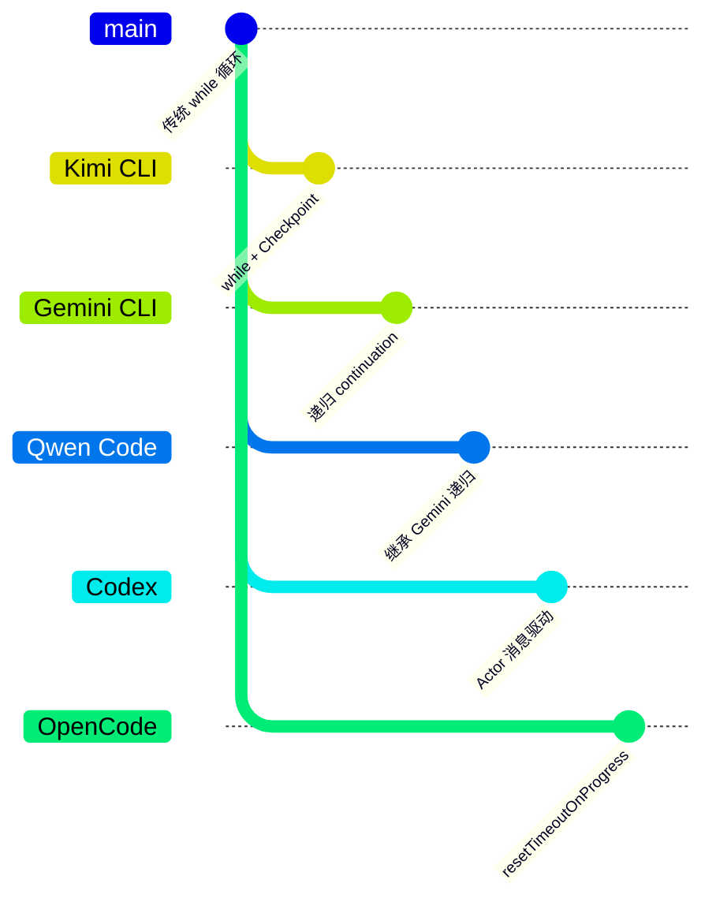

| 项目 | 核心差异 | 适用场景 |
|-----|---------|---------|
| Qwen Code | 递归 continuation + 流式事件 | 需要实时响应和复杂事件处理的场景 |
| Gemini CLI | 递归 continuation（Qwen Code 继承自此） | 多 agent 协作，需要灵活续跑控制 |
| Kimi CLI | while 循环 + Checkpoint 回滚 | 需要状态持久化和回滚能力的场景 |
| Codex | Actor 消息驱动 + CancellationToken | 高并发、需要精细取消控制的场景 |
| OpenCode | resetTimeoutOnProgress + 流式 | 长运行任务，需要超时重置的场景 |

**递归 vs 循环的深度对比**：

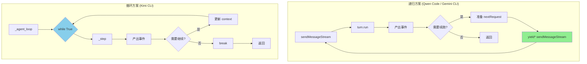

| 特性 | 递归 (Qwen Code) | 循环 (Kimi CLI) |
|-----|-----------------|-----------------|
| 代码清晰度 | 每轮独立函数调用，栈清晰 | 状态在循环内累积，需要仔细管理 |
| turns 计数 | 天然支持，通过参数传递 | 需要手动维护计数器 |
| 事件透传 | `yield*` 简洁优雅 | 需要额外机制传递事件 |
| 取消处理 | 通过 signal 传递 | 通过 signal 或异常跳出 |
| 调试难度 | 调用栈较深，但清晰 | 循环内状态复杂 |
| 状态持久化 | 需要额外机制 | 天然支持（循环内状态） |

---

## 7. 边界情况与错误处理

### 7.1 终止条件

| 终止原因 | 触发条件 | 代码位置 |
|---------|---------|---------|
| MAX_TURNS 达到 | `boundedTurns <= 0` | `client.ts:430` |
| Session Turns 超限 | `sessionTurnCount > maxSessionTurns` | `client.ts:421` |
| Token 限制 | `tokenCount > sessionTokenLimit` | `client.ts:443` |
| 用户取消 | `signal.aborted` | `turn.ts:253` |
| 循环检测 | `loopDetector.addAndCheck() == true` | `client.ts:491` |
| 无需继续 | `next_speaker !== 'model'` | `client.ts:558` |
| LLM 错误 | 发生异常 | `turn.ts:397` |

### 7.2 超时/资源限制

```typescript
// packages/core/src/core/client.ts:76
const MAX_TURNS = 100;

// packages/core/src/core/client.ts:421
if (this.config.getMaxSessionTurns() > 0 &&
    this.sessionTurnCount > this.config.getMaxSessionTurns()) {
  yield { type: GeminiEventType.MaxSessionTurns };
  return new Turn(this.getChat(), prompt_id);
}

// packages/core/src/core/client.ts:443
if (tokenCount > sessionTokenLimit) {
  yield { type: GeminiEventType.SessionTokenLimitExceeded, ... };
  return new Turn(this.getChat(), prompt_id);
}
```

### 7.3 错误恢复策略

| 错误类型 | 处理策略 | 代码位置 |
|---------|---------|---------|
| LLM API 错误 | yield Error 事件，终止当前 Turn | `turn.ts:397` |
| 循环检测触发 | yield LoopDetected 事件，终止递归 | `client.ts:491` |
| Token 超限 | yield SessionTokenLimitExceeded，终止 | `client.ts:443` |
| 用户取消 | yield UserCancelled，立即返回 | `turn.ts:253` |
| 压缩失败 | 标记 hasFailedCompressionAttempt，继续 | `client.ts:448` |

---

## 8. 关键代码索引

| 功能 | 文件 | 行号 | 说明 |
|-----|------|------|------|
| 入口 | `packages/core/src/ui/useGeminiStream.ts` | - | UI 层调用入口 |
| 核心 | `packages/core/src/core/client.ts` | 403 | sendMessageStream 递归入口 |
| 核心 | `packages/core/src/core/turn.ts` | 233 | Turn.run 单轮处理 |
| 循环检测 | `packages/core/src/services/loopDetectionService.ts` | - | LoopDetectionService 实现 |
| 上下文压缩 | `packages/core/src/core/client.ts` | 178 | tryCompressChat 方法 |
| 下一说话者 | `packages/core/src/core/nextSpeakerChecker.ts` | - | checkNextSpeaker 实现 |
| 配置 | `packages/core/src/core/client.ts` | 76 | MAX_TURNS 常量 |

---

## 9. 延伸阅读

- 前置知识：`docs/qwen-code/01-qwen-code-overview.md`
- 相关机制：`docs/qwen-code/07-qwen-code-memory-context.md` (上下文管理)
- 深度分析：`docs/qwen-code/questions/qwen-code-loop-detection.md` (循环检测详解)
- 对比文档：`docs/gemini-cli/04-gemini-cli-agent-loop.md` (Gemini CLI 递归实现)
- 对比文档：`docs/kimi-cli/04-kimi-cli-agent-loop.md` (Kimi CLI while 循环实现)

---

*✅ Verified: 基于 qwen-code/packages/core/src/core/client.ts:403、turn.ts:233 等源码分析*
*基于版本：2026-02-08 | 最后更新：2026-02-24*
