# Tools 系统（Qwen Code）

> 📋 **阅读指南**
>
> | 属性 | 说明 |
> |-----|------|
> | 预计阅读 | 20-25 分钟 |
> | 前置文档 | `01-qwen-code-overview.md`、`04-qwen-code-agent-loop.md` |
> | 文档结构 | 速览 → 架构 → 机制 → 实现 → 对比 |
> | 代码呈现 | 关键代码直接展示，完整代码可折叠查看 |

---

## TL;DR（结论先行）

Qwen Code 的 Tools 系统是「**注册表 + 调度器**」双层架构：ToolRegistry 负责工具注册和发现，CoreToolScheduler 负责参数校验、用户确认和实际执行。

Qwen Code 的核心取舍：**声明式工具定义 + 统一调度器**（对比 Kimi CLI 的函数装饰器、Codex 的 Rust trait 系统）

### 核心要点速览

| 维度 | 关键决策 | 代码位置 |
|-----|---------|---------|
| 工具定义 | 声明式基类 + TypeScript 泛型 | `packages/core/src/tools/tools.ts:234` |
| 注册管理 | ToolRegistry 集中式注册表 | `packages/core/src/tools/tool-registry.ts:174` |
| 调度执行 | CoreToolScheduler 统一调度 | `packages/core/src/core/coreToolScheduler.ts:276` |
| MCP 集成 | McpClientManager 动态发现 | `packages/core/src/tools/mcp-client-manager.ts:29` |
| 参数校验 | Zod Schema 运行时校验 | `coreToolScheduler.ts:301` |
| 用户确认 | 工具级别 shouldConfirmExecute | `packages/core/src/tools/tools.ts:246` |

---

## 1. 为什么需要这个机制？（解决什么问题）

### 1.1 问题场景

没有 Tools 系统：LLM 只能生成文本回答，无法与外部环境交互
- 无法读取文件内容
- 无法执行命令
- 无法访问外部 API

有 Tools 系统：
- LLM: "需要查看文件内容" -> 调用 read_file -> 获得文件内容
- LLM: "需要执行测试" -> 调用 shell -> 获得测试结果
- LLM: "需要搜索代码" -> 调用 grep -> 获得匹配结果

### 1.2 核心挑战

| 挑战 | 不解决的后果 |
|-----|-------------|
| 工具发现 | LLM 不知道有哪些工具可用 |
| 参数校验 | 工具执行时因参数错误失败 |
| 用户确认 | 危险操作（如删除文件）未经确认直接执行 |
| 工具冲突 | 同名工具相互覆盖，导致调用错误 |
| 扩展性 | 无法集成外部 MCP 工具或自定义工具 |

---

## 2. 整体架构（ASCII 图）

### 2.1 在系统中的位置

```text
┌─────────────────────────────────────────────────────────────┐
│ Agent Loop / Turn Runtime                                    │
│ packages/core/src/core/turn.ts                               │
└───────────────────────┬─────────────────────────────────────┘
                        │ 产出 ToolCallRequest 事件
                        ▼
┌─────────────────────────────────────────────────────────────┐
│ ▓▓▓ Tools 系统 ▓▓▓                                           │
│                                                              │
│ ┌─────────────────────────────────────────────────────────┐ │
│ │ ToolRegistry (packages/core/src/tools/tool-registry.ts) │ │
│ │ - registerTool(): 注册工具                              │ │
│ │ - discoverAllTools(): 发现所有工具                      │ │
│ │ - getTool(): 获取工具实例                               │ │
│ └─────────────────────────┬───────────────────────────────┘ │
│                           │ 工具查询
│                           ▼
│ ┌─────────────────────────────────────────────────────────┐ │
│ │ CoreToolScheduler (packages/core/src/core/              │ │
│ │                   coreToolScheduler.ts)                 │ │
│ │ - validateParams(): 参数校验                            │ │
│ │ - shouldConfirmExecute(): 用户确认                      │ │
│ │ - execute(): 执行工具                                   │ │
│ └─────────────────────────┬───────────────────────────────┘ │
└───────────────────────────┬─────────────────────────────────┘
                            │ 工具执行
        ┌───────────────────┼───────────────────┐
        ▼                   ▼                   ▼
┌──────────────┐   ┌──────────────┐   ┌──────────────┐
│ 内置工具      │   │ MCP 工具      │   │ 发现工具      │
│ read_file    │   │ Discovered   │   │ Discovered   │
│ write_file   │   │ MCPTool      │   │ Tool         │
│ shell        │   │              │   │              │
└──────────────┘   └──────────────┘   └──────────────┘
```

### 2.2 核心组件职责

| 组件 | 职责 | 代码位置 |
|-----|------|---------|
| `ToolRegistry` | 管理工具注册表，支持内置/MCP/发现工具 | `packages/core/src/tools/tool-registry.ts:174` |
| `CoreToolScheduler` | 调度执行工具调用，处理确认和错误 | `packages/core/src/core/coreToolScheduler.ts:276` |
| `BaseDeclarativeTool` | 声明式工具基类，定义工具元数据 | `packages/core/src/tools/tools.ts:234` |
| `BaseToolInvocation` | 工具调用执行基类，封装执行逻辑 | `packages/core/src/tools/tools.ts:222` |
| `McpClientManager` | MCP 客户端管理，动态发现 MCP 工具 | `packages/core/src/tools/mcp-client-manager.ts:29` |

### 2.3 核心组件交互关系

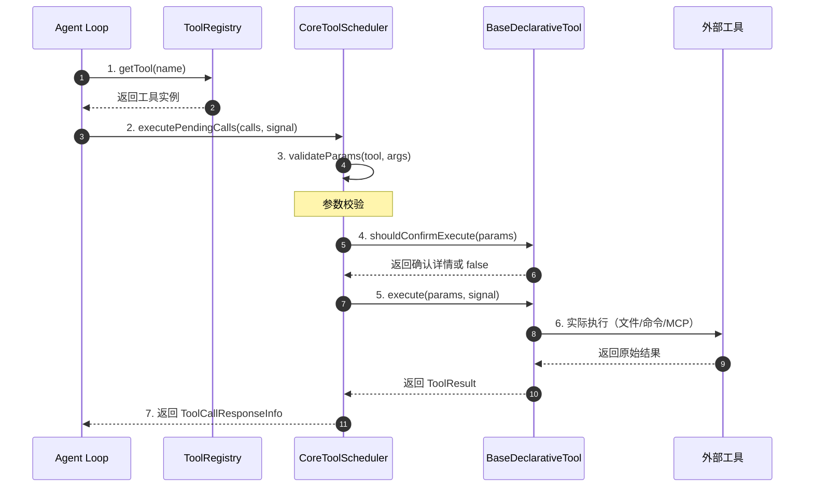

**关键交互说明**：

| 步骤 | 交互内容 | 设计意图 |
|-----|---------|---------|
| 1 | Agent Loop 从注册表获取工具 | 解耦工具定义与使用，支持动态发现 |
| 2 | 调度器批量执行待处理调用 | 统一处理多个工具调用，便于并行优化 |
| 3 | 参数校验 | 提前捕获参数错误，避免无效执行 |
| 4 | 用户确认检查 | 危险操作需人工确认，保障安全 |
| 5-6 | 工具执行 | 基类封装通用逻辑，具体工具实现差异化 |
| 7 | 统一返回格式 | 便于 Agent Loop 处理结果并继续对话 |

---

## 3. 核心组件详细分析

### 3.1 ToolRegistry 内部结构

#### 职责定位

ToolRegistry 是工具系统的「中央注册表」，负责管理所有可用工具的生命周期，包括注册、发现、查询和冲突处理。

#### 状态机图

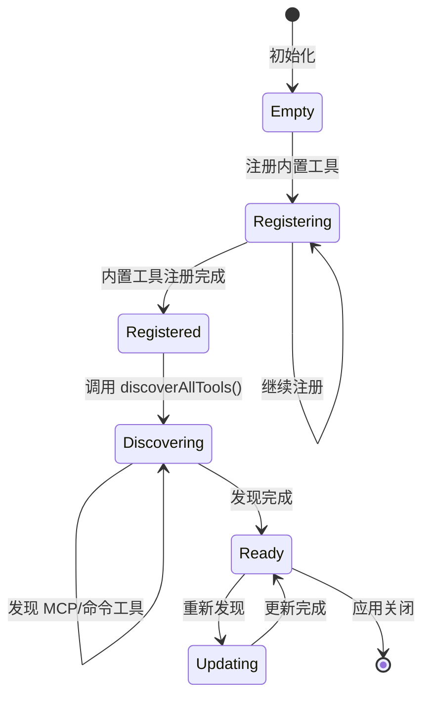

**状态说明**：

| 状态 | 说明 | 进入条件 | 退出条件 |
|-----|------|---------|---------|
| Empty | 空注册表 | 初始化 | 开始注册内置工具 |
| Registering | 注册中 | 开始注册工具 | 内置工具注册完成 |
| Registered | 已注册内置工具 | 内置工具注册完成 | 开始发现外部工具 |
| Discovering | 发现外部工具中 | 调用 discoverAllTools | 发现完成 |
| Ready | 就绪状态 | 发现完成 | 重新发现或关闭 |
| Updating | 更新中 | 重新发现 | 更新完成 |

#### 内部数据流

```text
┌─────────────────────────────────────────────────────────────┐
│  输入层                                                      │
│  ├── 内置工具类 ──► registerTool()                          │
│  ├── MCP 配置   ──► discoverAllMcpTools()                   │
│  └── 命令配置   ──► discoverAndRegisterToolsFromCommand()   │
└──────────────────────────┬──────────────────────────────────┘
                           ▼
┌─────────────────────────────────────────────────────────────┐
│  处理层                                                      │
│  ├── 工具实例化                                              │
│  ├── 名称冲突检测                                            │
│  │   └── MCP 工具使用完全限定名 (serverName__toolName)      │
│  └── Map 存储 (name -> tool)                                 │
└──────────────────────────┬──────────────────────────────────┘
                           ▼
┌─────────────────────────────────────────────────────────────┐
│  输出层                                                      │
│  ├── getTool(name) 查询                                      │
│  ├── getAllTools() 获取全部                                  │
│  └── getFunctionDeclarations() 获取 LLM Schema               │
└─────────────────────────────────────────────────────────────┘
```

#### 关键算法逻辑

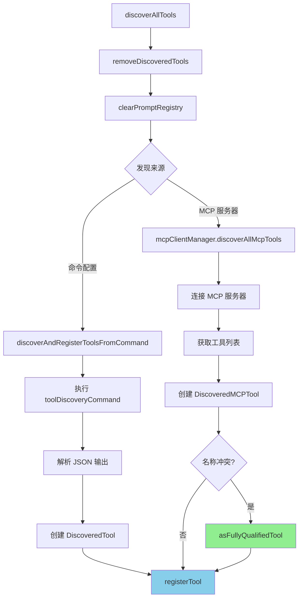

**算法要点**：

1. **清理优先**：先移除已发现的工具，确保动态更新
2. **双源发现**：支持命令发现和 MCP 发现两种方式
3. **冲突处理**：MCP 工具使用完全限定名（serverName__toolName）避免冲突

#### 关键接口

| 接口 | 输入 | 输出 | 说明 | 代码位置 |
|-----|------|------|------|---------|
| `registerTool()` | `AnyDeclarativeTool` | void | 注册工具，处理冲突 | `tool-registry.ts:164` |
| `discoverAllTools()` | - | `Promise<void>` | 发现所有工具 | `tool-registry.ts:176` |
| `getTool()` | `string` | `AnyDeclarativeTool \| undefined` | 按名获取工具 | `tool-registry.ts:204` |
| `getFunctionDeclarations()` | - | `FunctionDeclaration[]` | 获取 LLM 可用的 schema | `tool-registry.ts:195` |

---

### 3.2 CoreToolScheduler 内部结构

#### 职责定位

CoreToolScheduler 是工具执行的「统一调度中心」，负责参数校验、用户确认、错误处理和结果格式化。

#### 状态机图

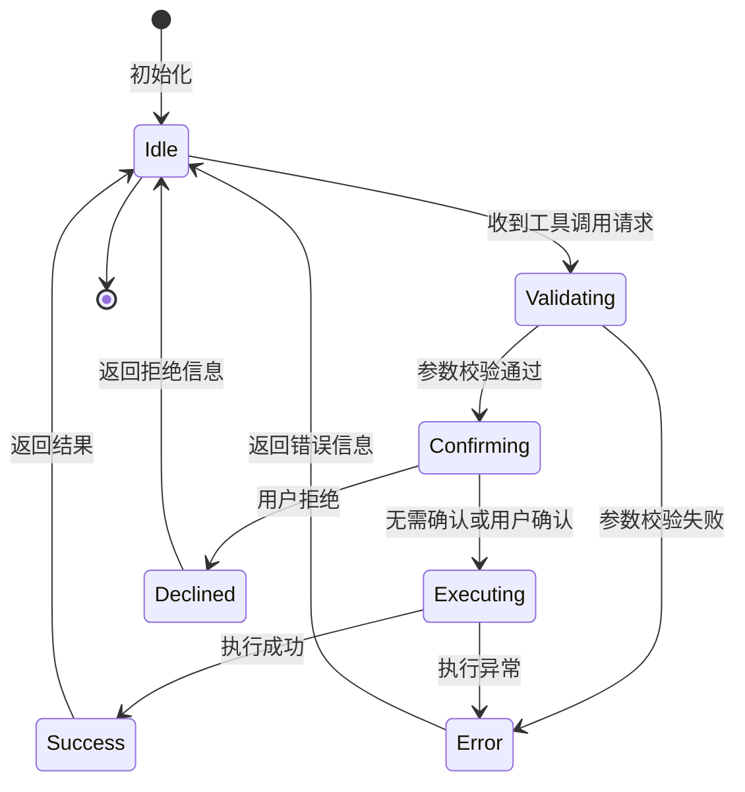

**状态说明**：

| 状态 | 说明 | 进入条件 | 退出条件 |
|-----|------|---------|---------|
| Idle | 空闲等待 | 初始化或处理完成 | 收到新的工具调用请求 |
| Validating | 参数校验中 | 收到工具调用 | 校验完成 |
| Confirming | 等待用户确认 | 参数校验通过且需要确认 | 用户确认或拒绝 |
| Executing | 执行工具 | 确认通过或无需确认 | 执行完成或异常 |
| Success | 执行成功 | 工具执行成功 | 自动返回 Idle |
| Declined | 用户拒绝 | 用户在确认对话框拒绝 | 自动返回 Idle |
| Error | 执行错误 | 参数校验失败或执行异常 | 自动返回 Idle |

#### 内部数据流

```text
┌─────────────────────────────────────────────────────────────┐
│  输入层                                                      │
│  ├── ToolCallRequestInfo[] ──► 遍历每个调用                  │
│  └── AbortSignal ──► 取消支持                                │
└──────────────────────────┬──────────────────────────────────┘
                           ▼
┌─────────────────────────────────────────────────────────────┐
│  处理层                                                      │
│  ├── 工具查询: toolRegistry.getTool(call.name)               │
│  │   └── 未找到 ──► 返回 TOOL_NOT_FOUND 错误                 │
│  ├── 参数校验: validateParams(tool, call.args)               │
│  ├── 确认检查: tool.shouldConfirmExecute(params)             │
│  │   └── 用户拒绝 ──► 返回 USER_DECLINED 错误                │
│  └── 工具执行: tool.execute(params, signal)                  │
│      └── 异常捕获 ──► 返回 EXECUTION_ERROR                   │
└──────────────────────────┬──────────────────────────────────┘
                           ▼
┌─────────────────────────────────────────────────────────────┐
│  输出层                                                      │
│  ├── ToolCallResponseInfo[] 组装                            │
│  ├── functionResponse 格式化                                │
│  └── errorType 分类（ToolErrorType）                         │
└─────────────────────────────────────────────────────────────┘
```

---

### 3.3 组件间协作时序

展示 ToolRegistry、CoreToolScheduler 和具体工具如何协作完成一次完整的工具调用。

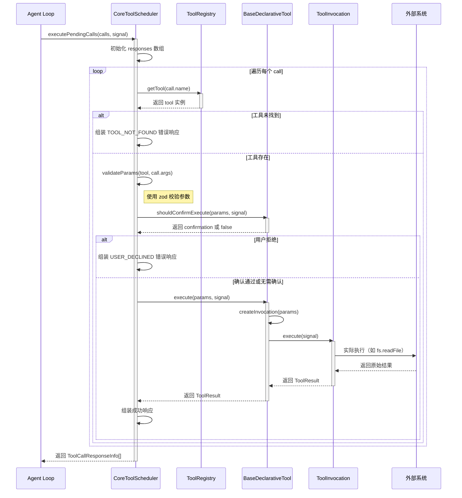

**协作要点**：

1. **批量处理**：CoreToolScheduler 一次处理多个 ToolCall，便于后续并行优化
2. **错误隔离**：单个工具调用失败不影响其他调用
3. **统一封装**：所有结果统一封装为 ToolCallResponseInfo，便于上层处理
4. **信号传递**：AbortSignal 贯穿整个调用链，支持取消操作

---

### 3.4 关键数据路径

#### 主路径（正常流程）

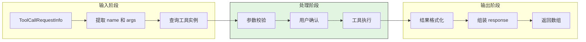

#### 异常路径（错误恢复）

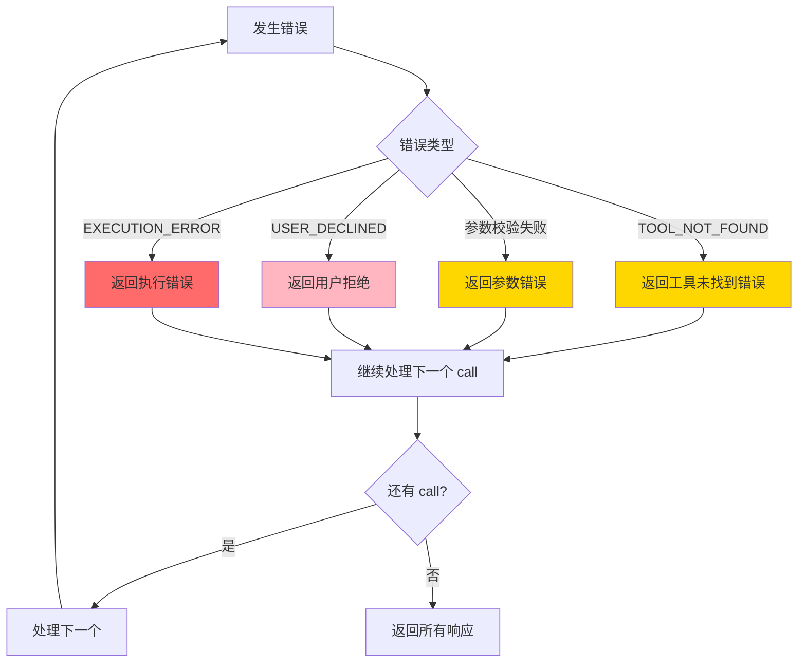

---

## 4. 端到端数据流转

### 4.1 正常流程（详细版）

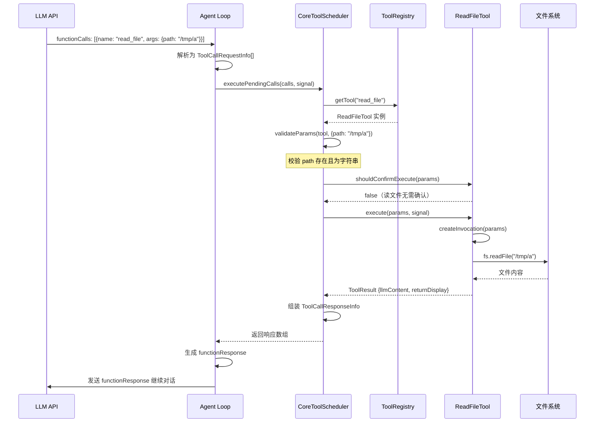

**数据变换详情**：

| 阶段 | 输入 | 处理 | 输出 | 代码位置 |
|-----|------|------|------|---------|
| 接收 | `ToolCallRequestInfo[]` | 遍历每个调用 | 单个 call 处理 | `coreToolScheduler.ts:276` |
| 查询 | `call.name` | Map 查找 | `AnyDeclarativeTool \| undefined` | `tool-registry.ts:204` |
| 校验 | `args: unknown` | Zod schema 校验 | `validatedParams` | `coreToolScheduler.ts:301` |
| 确认 | `params, signal` | UI 确认对话框 | `confirmation \| false` | `coreToolScheduler.ts:304` |
| 执行 | `params, signal` | 工具特定逻辑 | `ToolResult` | `coreToolScheduler.ts:328` |
| 输出 | `ToolResult` | 格式化为 functionResponse | `ToolCallResponseInfo` | `coreToolScheduler.ts:329` |

### 4.2 数据流向图

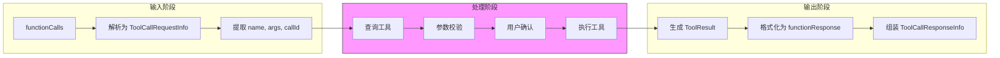

### 4.3 异常/边界流程

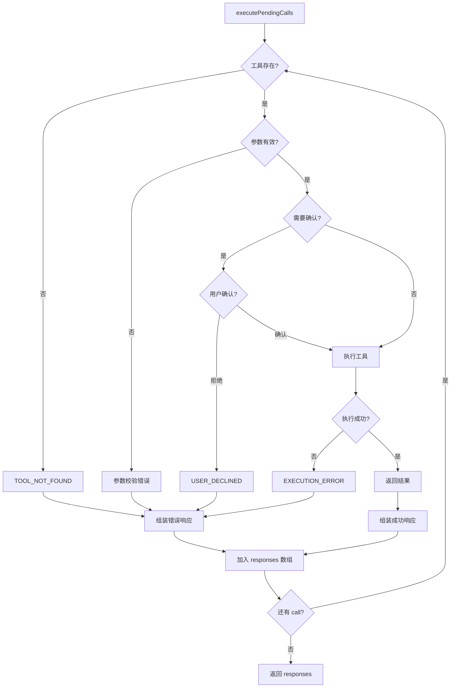

---

## 5. 关键代码实现

### 5.1 核心数据结构

```typescript
// packages/core/src/tools/tools.ts:222
// 工具调用抽象基类
export abstract class BaseToolInvocation<TParams, TResult> {
  constructor(protected readonly params: TParams) {}

  abstract getDescription(): string;

  abstract execute(
    signal: AbortSignal,
    updateOutput?: (output: ToolResultDisplay) => void,
  ): Promise<TResult>;
}

// packages/core/src/tools/tools.ts:234
// 声明式工具基类
export abstract class BaseDeclarativeTool<TParams, TResult> {
  abstract readonly name: string;
  abstract readonly displayName: string;
  abstract readonly description: string;
  abstract readonly kind: Kind;
  abstract readonly schema: FunctionDeclaration;

  protected abstract createInvocation(
    params: TParams,
  ): ToolInvocation<TParams, TResult>;

  abstract shouldConfirmExecute(
    params: TParams,
    abortSignal: AbortSignal,
  ): Promise<ToolCallConfirmationDetails | false>;

  async execute(
    params: TParams,
    signal: AbortSignal,
    updateOutput?: (output: ToolResultDisplay) => void,
  ): Promise<TResult> {
    const invocation = this.createInvocation(params);
    return invocation.execute(signal, updateOutput);
  }
}
```

**字段说明**：

| 字段 | 类型 | 用途 |
|-----|------|------|
| `name` | `string` | 工具唯一标识，LLM 调用时使用 |
| `displayName` | `string` | UI 展示名称 |
| `description` | `string` | 工具功能描述，用于 LLM 理解 |
| `kind` | `Kind` | 工具分类（Read/Write/Execute 等） |
| `schema` | `FunctionDeclaration` | JSON Schema，描述参数结构 |

### 5.2 主链路代码

```typescript
// packages/core/src/core/coreToolScheduler.ts:276-358
async executePendingCalls(
  pendingCalls: ToolCallRequestInfo[],
  signal: AbortSignal,
): Promise<ToolCallResponseInfo[]> {
  const responses: ToolCallResponseInfo[] = [];

  for (const call of pendingCalls) {
    const tool = this.toolRegistry.getTool(call.name);
    if (!tool) {
      responses.push({
        callId: call.callId,
        responseParts: [{
          functionResponse: {
            name: call.name,
            response: { error: `Tool not found: ${call.name}` },
          },
        }],
        error: new Error(`Tool not found: ${call.name}`),
        errorType: ToolErrorType.TOOL_NOT_FOUND,
      });
      continue;
    }

    // 参数校验
    const validatedParams = this.validateParams(tool, call.args);

    // 用户确认检查
    const confirmation = await tool.shouldConfirmExecute(validatedParams, signal);

    if (confirmation === false) {
      responses.push({
        callId: call.callId,
        responseParts: [{
          functionResponse: { name: call.name, response: { error: 'User declined' } },
        }],
        error: new Error('User declined'),
        errorType: ToolErrorType.USER_DECLINED,
      });
      continue;
    }

    // 执行工具
    try {
      const result = await tool.execute(validatedParams, signal);
      responses.push({
        callId: call.callId,
        responseParts: [{
          functionResponse: {
            name: call.name,
            response: { output: result.llmContent },
          },
        }],
        resultDisplay: result.returnDisplay,
        error: result.error ? new Error(result.error.message) : undefined,
        errorType: result.error?.type,
      });
    } catch (error) {
      responses.push({
        callId: call.callId,
        responseParts: [{
          functionResponse: { name: call.name, response: { error: String(error) } },
        }],
        error: error instanceof Error ? error : new Error(String(error)),
        errorType: ToolErrorType.EXECUTION_ERROR,
      });
    }
  }

  return responses;
}
```

**代码要点**：

1. **顺序执行循环**：使用 `for...of` 顺序处理每个调用，确保确定性
2. **错误隔离**：每个调用的错误被捕获并转换为错误响应，不影响其他调用
3. **统一响应格式**：所有情况都返回 `ToolCallResponseInfo`，便于上层统一处理
4. **信号传递**：`AbortSignal` 传递给 `shouldConfirmExecute` 和 `execute`，支持取消

### 5.3 关键调用链

```text
Agent Loop
  -> CoreToolScheduler.executePendingCalls()    [coreToolScheduler.ts:276]
    -> ToolRegistry.getTool(name)                [tool-registry.ts:204]
    -> CoreToolScheduler.validateParams()        [coreToolScheduler.ts:301]
    -> BaseDeclarativeTool.shouldConfirmExecute()[tools.ts:246]
    -> BaseDeclarativeTool.execute()             [tools.ts:252]
      -> BaseDeclarativeTool.createInvocation()  [tools.ts:241]
      -> BaseToolInvocation.execute()            [tools.ts:227]
        - 实际工具逻辑（如 fs.readFile）
```

---

## 6. 设计意图与 Trade-off

### 6.1 Qwen Code 的选择

| 维度 | Qwen Code 的选择 | 替代方案 | 取舍分析 |
|-----|-----------------|---------|---------|
| 工具定义方式 | 声明式基类 + TypeScript 泛型 | 函数装饰器（Kimi）、Rust trait（Codex） | 类型安全，IDE 友好，但需要更多样板代码 |
| 调度模式 | 统一调度器（CoreToolScheduler） | 工具自调度 | 集中处理确认和错误，但增加一层抽象 |
| 执行模型 | 顺序执行 | 并行执行 | 确定性高，但性能可能受限 |
| 确认机制 | 工具级别 shouldConfirmExecute | 全局配置 | 细粒度控制，但每个工具需单独实现 |
| 工具发现 | 注册表 + 动态发现 | 静态导入 | 支持运行时扩展，但需要管理生命周期 |

### 6.2 为什么这样设计？

**核心问题**：如何在类型安全、可扩展性和用户体验之间取得平衡？

**Qwen Code 的解决方案**：

- **代码依据**：`packages/core/src/tools/tools.ts:222-260`
- **设计意图**：通过 TypeScript 泛型和抽象基类，在编译期保证工具参数和返回值的类型安全
- **带来的好处**：
  - 类型安全：编译期捕获参数错误
  - IDE 支持：自动补全和类型提示
  - 可扩展性：通过继承轻松添加新工具
- **付出的代价**：
  - 样板代码：每个工具需定义 schema、invocation 类
  - 学习成本：开发者需理解泛型和抽象类

### 6.3 与其他项目的对比

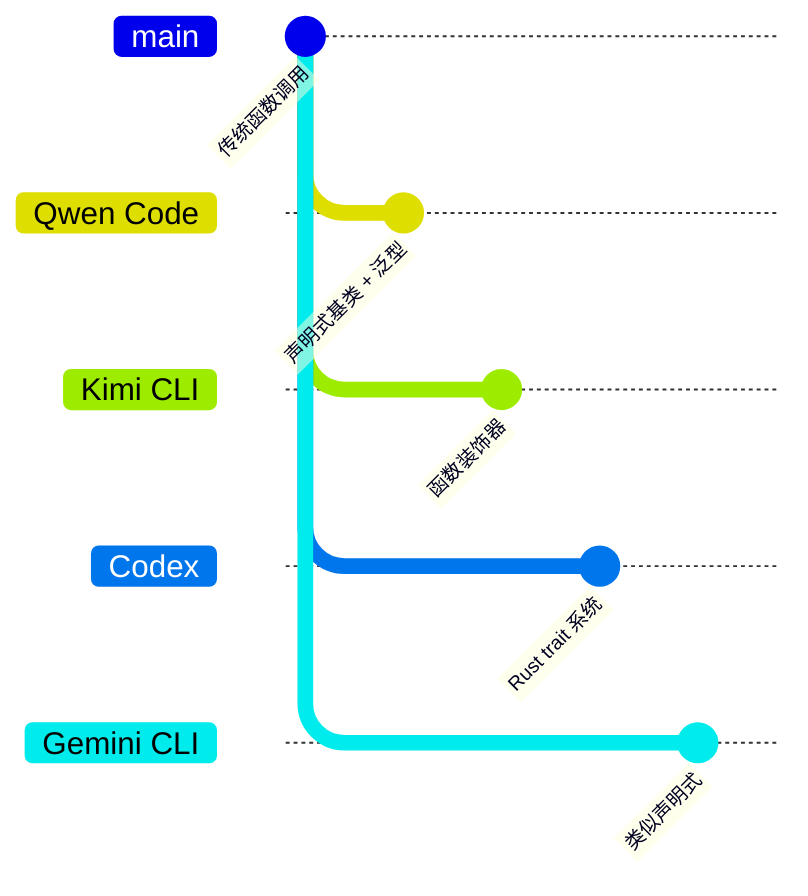

| 项目 | 核心差异 | 适用场景 |
|-----|---------|---------|
| Qwen Code | 声明式基类 + TypeScript 泛型，统一调度器 | 需要类型安全和集中控制的场景 |
| Gemini CLI | 类似声明式，继承自同一架构 | 与 Qwen Code 类似 |
| Kimi CLI | Python 函数装饰器，运行时注册 | 快速原型开发，减少样板代码 |
| Codex | Rust trait + 宏定义 | 高性能、强类型保证的系统级工具 |

**详细对比**：

| 特性 | Qwen Code | Gemini CLI | Kimi CLI | Codex |
|-----|-----------|------------|----------|-------|
| 定义方式 | 类继承 | 类继承 | 装饰器 | Trait |
| 类型安全 | 编译期 | 编译期 | 运行时 | 编译期 |
| MCP 支持 | 是 | 是 | 是 | 是 |
| 确认机制 | 工具级别 | 工具级别 | 全局配置 | 全局配置 |
| 扩展方式 | 继承/MCP/命令 | 继承/MCP/命令 | 装饰器/MCP | Trait/MCP |

---

## 7. 边界情况与错误处理

### 7.1 终止条件

| 终止原因 | 触发条件 | 代码位置 |
|---------|---------|---------|
| 工具未找到 | `toolRegistry.getTool()` 返回 undefined | `coreToolScheduler.ts:284` |
| 用户拒绝 | `shouldConfirmExecute()` 返回 false | `coreToolScheduler.ts:309` |
| 执行异常 | `tool.execute()` 抛出异常 | `coreToolScheduler.ts:341` |
| 信号取消 | `AbortSignal` 触发 abort | `shouldConfirmExecute.ts:304` |

### 7.2 超时/资源限制

```typescript
// packages/core/src/core/coreToolScheduler.ts:304
// 确认检查支持 AbortSignal
const confirmation = await tool.shouldConfirmExecute(validatedParams, signal);

// packages/core/src/tools/tools.ts:252
// 工具执行支持 AbortSignal
async execute(params: TParams, signal: AbortSignal, ...): Promise<TResult>
```

### 7.3 错误恢复策略

| 错误类型 | 处理策略 | 代码位置 |
|---------|---------|---------|
| TOOL_NOT_FOUND | 返回错误响应，继续处理下一个 call | `coreToolScheduler.ts:285` |
| 参数校验失败 | 抛出异常，转换为错误响应 | `validateParams()` 内部 |
| USER_DECLINED | 返回拒绝响应，继续处理下一个 call | `coreToolScheduler.ts:311` |
| EXECUTION_ERROR | 捕获异常，返回错误详情 | `coreToolScheduler.ts:342` |

---

## 8. 关键代码索引

| 功能 | 文件 | 行号 | 说明 |
|-----|------|------|------|
| 入口 | `packages/core/src/core/coreToolScheduler.ts` | 276 | `executePendingCalls` 主入口 |
| 注册表 | `packages/core/src/tools/tool-registry.ts` | 174 | `ToolRegistry` 类定义 |
| 工具基类 | `packages/core/src/tools/tools.ts` | 222 | `BaseToolInvocation` 基类 |
| 声明式工具 | `packages/core/src/tools/tools.ts` | 234 | `BaseDeclarativeTool` 基类 |
| MCP 管理 | `packages/core/src/tools/mcp-client-manager.ts` | - | `McpClientManager` MCP 工具发现 |
| 内置工具 | `packages/core/src/tools/read-file.ts` | - | `ReadFileTool` 示例实现 |
| 发现工具 | `packages/core/src/tools/tool-registry.ts` | 32 | `DiscoveredTool` 命令发现实现 |
| 错误类型 | `packages/core/src/types.ts` | - | `ToolErrorType` 枚举定义 |

---

## 9. 延伸阅读

- 前置知识：`docs/qwen-code/04-qwen-code-agent-loop.md` - Agent Loop 如何调用 Tools 系统
- 相关机制：`docs/qwen-code/06-qwen-code-mcp-integration.md` - MCP 工具集成详解
- 深度分析：`docs/comm/comm-tool-system.md` - 跨项目 Tools 系统对比

---

*✅ Verified: 基于 qwen-code/packages/core/src/tools/tool-registry.ts:174、coreToolScheduler.ts:276 等源码分析*
*基于版本：2026-02-08 | 最后更新：2026-03-03*
