> **阅读指南**
>
> | 属性 | 说明 |
> |-----|------|
> | 预计阅读 | 25-35 分钟 |
> | 前置文档 | `01-qwen-code-overview.md`、`05-qwen-code-tools-system.md` |
> | 文档结构 | 速览 → 架构 → 机制 → 实现 → 对比 |
> | 代码呈现 | 关键代码直接展示，完整代码可折叠查看 |

---

# MCP 集成（Qwen Code）

## TL;DR（结论先行）

一句话定义：Qwen Code 的 MCP 集成是**基于官方 MCP SDK 的多传输层 + 自动 OAuth 发现 + 服务器级信任模型 + 工具注解支持**的外部工具接入框架，通过 `McpClientManager` 统一管理多个 MCP 服务器的连接、发现和生命周期，支持实时进度通知和现代 JSON Schema 标准。

Qwen Code 的核心取舍：**官方 MCP SDK 原生集成 + 自动 OAuth 发现 + 完全限定名命名空间 + Tool Annotations 智能审批**（对比 Gemini CLI 的多传输自动回退、Codex 的 Rust 原生实现、Kimi CLI 的 ACP 桥接）

### 核心要点速览

| 维度 | 关键决策 | 代码位置 |
|-----|---------|---------|
| 核心机制 | 官方 MCP SDK 原生集成，支持多传输协议 | `packages/core/src/tools/mcp-client.ts:798` |
| 连接管理 | McpClientManager 统一管理多服务器生命周期 | `packages/core/src/tools/mcp-client-manager.ts:29` |
| 认证机制 | 自动 OAuth 发现 + 401 重试机制 | `packages/core/src/tools/mcp-client.ts:364` |
| 工具命名 | `mcp__{server}__{tool}` 完全限定名避免冲突 | `packages/core/src/tools/mcp-tool.ts:569` |
| 智能审批 | Tool Annotations (readOnlyHint) 支持 Plan 模式 | `packages/core/src/tools/mcp-tool.ts:97` |
| 进度通知 | onprogress 回调支持长时间任务实时反馈 | `packages/core/src/tools/mcp-tool.ts:213` |
| Schema 兼容 | Draft-07 + Draft-2020-12 双验证器 | `packages/core/src/utils/schemaValidator.ts:66` |

---

## 1. 为什么需要这个机制？（解决什么问题）

### 1.1 问题场景

没有 MCP 集成：每个外部工具需要单独开发和维护适配代码

```
想用数据库工具 → 修改 Qwen Code 源码 → 重新构建
想用 Jira 工具  → 修改 Qwen Code 源码 → 重新构建
想用内部 API   → 修改 Qwen Code 源码 → 重新构建
```

有 MCP 集成：
```
配置: settings.json 中定义 mcpServers
  ↓ 自动发现: McpClientManager.discoverAllMcpTools() 获取服务器工具列表
  ↓ 自动注册: 工具名 mcp__{server}__{tool} 注册到 ToolRegistry
  ↓ 自动调用: 模型输出 → DiscoveredMCPTool → callTool() → 远程执行
  ↓ 自动响应: 结果格式化为 Part[] 返回给模型
```

### 1.2 核心挑战

| 挑战 | 不解决的后果 |
|-----|-------------|
| 多传输协议支持 | 无法连接不同类型的 MCP 服务器（本地/远程） |
| 服务器管理 | 多服务器连接生命周期复杂，容易泄露 |
| 工具命名冲突 | 不同服务器同名工具互相覆盖 |
| OAuth 认证 | 无法安全地访问受保护的远程服务 |
| 自动发现 | 需要手动配置每个工具，无法动态扩展 |
| 进度通知 | 长时间运行的工具无法反馈执行进度 |
| 工具注解 | 无法区分只读/破坏性工具，统一审批体验差 |
| Schema 兼容性 | 新版 MCP 服务器使用 Draft-2020-12 导致验证失败 |

---

## 2. 整体架构（ASCII 图）

### 2.1 在系统中的位置

```text
┌─────────────────────────────────────────────────────────────┐
│ Agent Loop / CoreToolScheduler                               │
│ packages/core/src/core/index.ts                              │
└───────────────────────┬─────────────────────────────────────┘
                        │ 调用 MCP 工具
                        ▼
┌─────────────────────────────────────────────────────────────┐
│ ▓▓▓ MCP Integration ▓▓▓                                     │
│ packages/core/src/tools/mcp*.ts                             │
│ - McpClientManager     : 多服务器连接管理                    │
│ - McpClient            : 单个服务器客户端（封装）            │
│ - DiscoveredMCPTool    : 工具包装类                          │
│ - createTransport      : 传输层创建，支持多种协议            │
└───────────────────────┬─────────────────────────────────────┘
                        │ 依赖/调用
        ┌───────────────┼───────────────┐
        ▼               ▼               ▼
┌──────────────┐ ┌──────────────┐ ┌──────────────┐
│ StreamableHTTP│ │ SSEClient    │ │ StdioClient  │
│ Transport    │ │ Transport    │ │ Transport    │
└──────┬───────┘ └──────┬───────┘ └──────┬───────┘
       │                │                │
       ▼                ▼                ▼
┌──────────────┐ ┌──────────────┐ ┌──────────────┐
│ MCP Server 1 │ │ MCP Server 2 │ │ MCP Server 3 │
│ (远程 HTTP)   │ │ (远程 SSE)   │ │ (本地进程)   │
└──────────────┘ └──────────────┘ └──────────────┘
```

### 2.2 核心组件职责

| 组件 | 职责 | 代码位置 |
|-----|------|---------|
| `McpClientManager` | 多服务器连接生命周期管理，事件通知 | `packages/core/src/tools/mcp-client-manager.ts:29` |
| `McpClient` (class) | 单个 MCP 服务器的连接封装 | `packages/core/src/tools/mcp-client.ts:45` |
| `discoverMcpTools` | 发现所有配置服务器的工具 | `packages/core/src/tools/mcp-client.ts:625` |
| `connectAndDiscover` | 连接单个服务器并发现工具 | `packages/core/src/tools/mcp-client.ts:548` |
| `createTransport` | 创建传输层，支持 OAuth 注入 | `packages/core/src/tools/mcp-client.ts:1223` |
| `DiscoveredMCPTool` | MCP 工具的包装，集成审批和注解 | `packages/core/src/tools/mcp-tool.ts:348` |
| `generateValidName` | 生成符合 Gemini API 的工具名 | `packages/core/src/tools/mcp-tool.ts:569` |
| **McpToolAnnotations** | **工具注解接口（readOnlyHint 等）** | **`packages/core/src/tools/mcp-tool.ts:97`** |
| **McpToolProgressData** | **MCP 工具进度数据结构** | **`packages/core/src/tools/tools.ts:477`** |
| **SchemaValidator** | **支持 Draft-2020-12 的验证器** | **`packages/core/src/utils/schemaValidator.ts:66`** |

### 2.3 核心组件交互关系

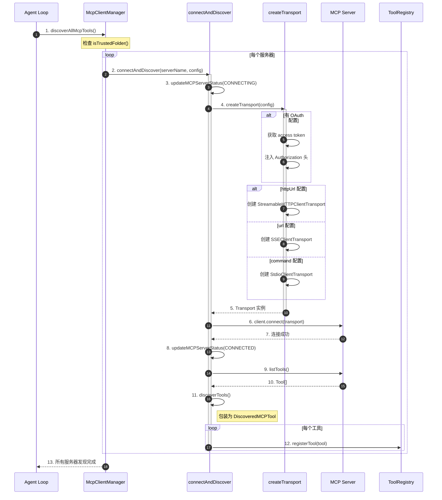

**关键交互说明**：

| 步骤 | 交互内容 | 设计意图 |
|-----|---------|---------|
| 1 | Agent Loop 触发发现 | 解耦触发与执行，支持延迟加载 |
| 2 | 信任文件夹检查 | 不受信任文件夹不启用 MCP，安全默认 |
| 4 | 创建传输层 | 根据配置自动选择传输协议 |
| 5 | OAuth 注入 | 自动处理认证，支持 401 自动重试 |
| 6-7 | 建立连接 | 支持多种传输协议，自动回退 |
| 9-10 | 发现工具 | 使用 mcpToTool 从 SDK 获取工具定义 |
| 12 | 注册到 Registry | 工具名格式为 `mcp__{server}__{tool}` |
| 10 | 注册到 Registry | 工具名格式为 `mcp__{server}__{tool}` |

---

## 3. 核心组件详细分析

### 3.1 McpClientManager 内部结构

#### 职责定位

McpClientManager 是 Qwen Code MCP 集成的核心枢纽，负责管理多个 MCP 服务器的连接、发现、生命周期和事件通知。

#### 状态机图

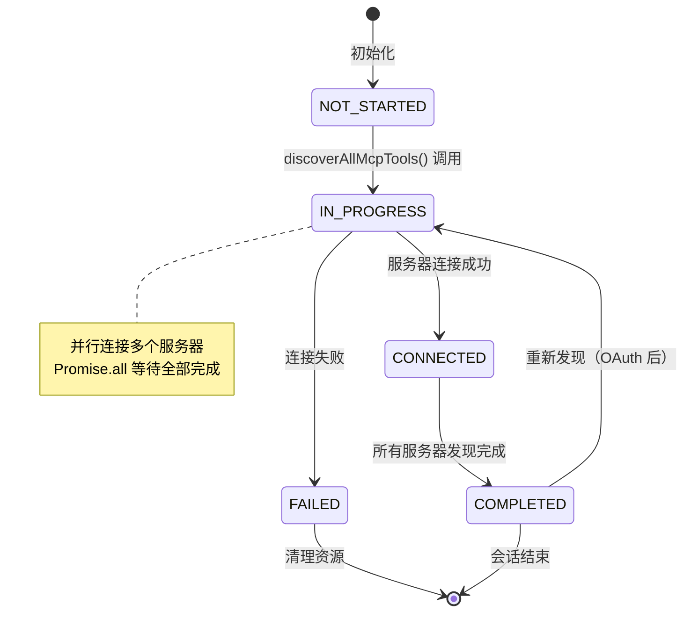

**状态说明**：

| 状态 | 说明 | 进入条件 | 退出条件 |
|-----|------|---------|---------|
| NOT_STARTED | 初始状态 | McpClientManager 创建 | 调用 discoverAllMcpTools() |
| IN_PROGRESS | 发现中 | 开始遍历服务器配置 | 所有服务器处理完成 |
| CONNECTED | 已连接 | 单个服务器连接成功 | 开始发现工具 |
| COMPLETED | 完成 | 所有服务器发现完成 | 会话结束 |
| FAILED | 失败 | 连接失败 | 清理资源 |

#### 内部数据流

```text
┌─────────────────────────────────────────────────────────────┐
│  输入层                                                      │
│  ├── settings.json / CLI 配置加载                            │
│  │   └── mcpServers: { server1, server2, ... }               │
│  └── mcpServerCommand 命令行参数                             │
│      └── 动态添加 MCP 服务器                                 │
└──────────────────────────┬──────────────────────────────────┘
                           ▼
┌─────────────────────────────────────────────────────────────┐
│  处理层                                                      │
│  ├── isTrustedFolder() 安全检查                              │
│  ├── populateMcpServerCommand() 合并配置                     │
│  ├── 并行连接所有服务器                                      │
│  │   └── Promise.all(discoveryPromises)                     │
│  ├── connectAndDiscover()                                   │
│  │   ├── createTransport()                                  │
│  │   │   ├── StreamableHTTP (OAuth 支持)                    │
│  │   │   ├── SSE (OAuth 支持)                               │
│  │   │   └── Stdio (本地进程)                               │
│  │   ├── client.connect()                                   │
│  │   ├── discoverTools()                                    │
│  │   └── discoverPrompts()                                  │
│  └── 注册到 ToolRegistry                                    │
└──────────────────────────┬──────────────────────────────────┘
                           ▼
┌─────────────────────────────────────────────────────────────┐
│  输出层                                                      │
│  ├── Map<string, McpClient> clients                         │
│  ├── MCPDiscoveryState 状态                                 │
│  └── mcp-client-update 事件（UI 状态同步）                   │
└─────────────────────────────────────────────────────────────┘
```

#### 关键接口

| 接口 | 输入 | 输出 | 说明 | 代码位置 |
|-----|------|------|------|---------|
| `discoverAllMcpTools()` | Config | Promise<void> | 发现所有配置的服务器 | `mcp-client-manager.ts:55` |
| `discoverMcpToolsForServer()` | serverName, Config | Promise<void> | 单服务器发现（OAuth 后重连） | `mcp-client-manager.ts:114` |
| `stop()` | - | Promise<void> | 停止所有客户端 | `mcp-client-manager.ts:179` |
| `readResource()` | serverName, uri | Promise<ReadResourceResult> | 读取 MCP 资源 | `mcp-client-manager.ts:200` |

---

### 3.2 传输层与 OAuth 集成

#### 职责定位

createTransport 函数负责根据配置创建合适的传输层，并自动处理 OAuth 认证注入。

#### 关键算法逻辑

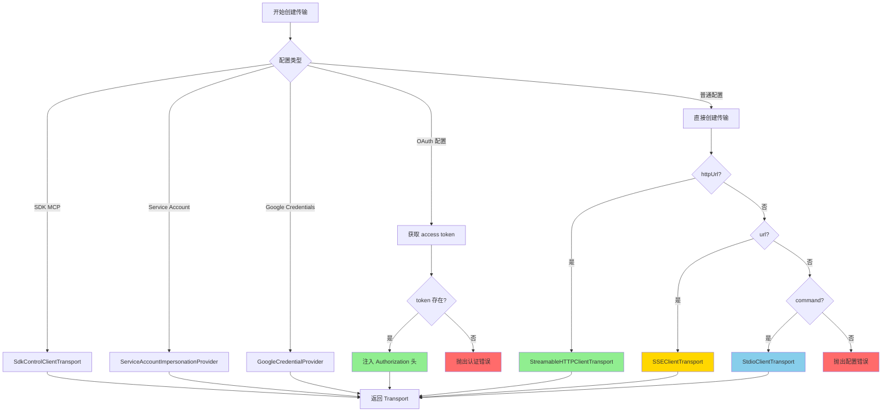

**算法要点**：

1. **优先级**：SDK MCP > Service Account > Google Credentials > OAuth > 普通配置
2. **自动注入**：OAuth token 自动注入到请求头
3. **传输选择**：httpUrl → StreamableHTTP, url → SSE, command → Stdio
4. **错误处理**：401 错误触发自动 OAuth 发现流程

#### 401 自动 OAuth 发现流程

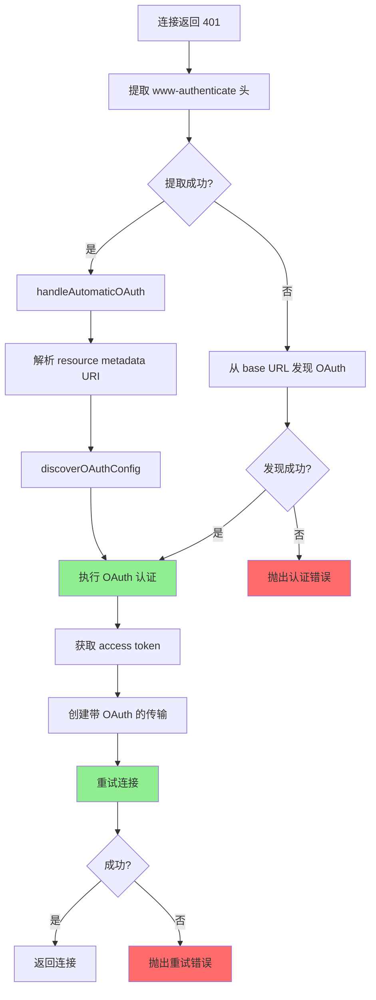

---

### 3.3 DiscoveredMCPTool 工具包装

#### 职责定位

DiscoveredMCPTool 是 MCP 工具的包装类，继承自 BaseDeclarativeTool，集成到 Qwen Code 的工具系统中，支持审批控制和进度通知。

#### 关键代码

```typescript
// packages/core/src/tools/mcp-tool.ts:348-409
export class DiscoveredMCPTool extends BaseDeclarativeTool<
  ToolParams,
  ToolResult
> {
  constructor(
    private readonly mcpTool: CallableTool,
    readonly serverName: string,
    readonly serverToolName: string,
    description: string,
    override readonly parameterSchema: unknown,
    readonly trust?: boolean,
    nameOverride?: string,
    private readonly cliConfig?: Config,
    private readonly mcpClient?: McpDirectClient,
    private readonly mcpTimeout?: number,
    private readonly annotations?: McpToolAnnotations,
  ) {
    super(
      nameOverride ??
        generateValidName(`mcp__${serverName}__${serverToolName}`),
      `${serverToolName} (${serverName} MCP Server)`,
      description,
      annotations?.readOnlyHint === true ? Kind.Read : Kind.Other,
      parameterSchema,
      true, // isOutputMarkdown
      true, // canUpdateOutput — enables streaming progress for MCP tools
    );
  }

  protected createInvocation(
    params: ToolParams,
  ): ToolInvocation<ToolParams, ToolResult> {
    return new DiscoveredMCPToolInvocation(
      this.mcpTool,
      this.serverName,
      this.serverToolName,
      this.displayName,
      this.trust,
      params,
      this.cliConfig,
      this.mcpClient,
      this.mcpTimeout,
      this.annotations,
    );
  }
}
```

**代码要点**：

1. **命名空间隔离**：`mcp__{server}__{tool}` 格式避免跨服务器冲突
2. **名称验证**：generateValidName 确保符合 Gemini API 限制（63 字符，合法字符）
3. **进度支持**：canUpdateOutput = true 支持长时间运行的工具进度通知
4. **双路径执行**：支持直接 MCP Client 或 @google/genai CallableTool
5. **工具注解**：通过 annotations 参数传递 MCP Tool Annotations，实现智能审批

#### 审批控制与工具注解

```typescript
// packages/core/src/tools/mcp-tool.ts:130-171
override async shouldConfirmExecute(
  _abortSignal: AbortSignal,
): Promise<ToolCallConfirmationDetails | false> {
  const serverAllowListKey = this.serverName;
  const toolAllowListKey = `${this.serverName}.${this.serverToolName}`;

  // 信任文件夹 + trust 配置 = 无需确认
  if (this.cliConfig?.isTrustedFolder() && this.trust) {
    return false;
  }

  // MCP tools annotated with readOnlyHint: true are safe to execute
  // without confirmation, especially important for plan mode support
  if (this.annotations?.readOnlyHint === true) {
    return false;
  }

  // 已在白名单中 = 无需确认
  if (
    DiscoveredMCPToolInvocation.allowlist.has(serverAllowListKey) ||
    DiscoveredMCPToolInvocation.allowlist.has(toolAllowListKey)
  ) {
    return false;
  }

  // 需要确认
  return {
    type: 'mcp',
    title: 'Confirm MCP Tool Execution',
    serverName: this.serverName,
    toolName: this.serverToolName,
    // ...
    onConfirm: async (outcome) => {
      if (outcome === ToolConfirmationOutcome.ProceedAlwaysServer) {
        DiscoveredMCPToolInvocation.allowlist.add(serverAllowListKey);
      } else if (outcome === ToolConfirmationOutcome.ProceedAlwaysTool) {
        DiscoveredMCPToolInvocation.allowlist.add(toolAllowListKey);
      }
    },
  };
}
```

**工具注解（Tool Annotations）**：

MCP 规范定义了工具注解用于描述工具行为特征，Qwen Code 支持以下注解：

| 注解字段 | 类型 | 含义 | 对审批的影响 |
|---------|------|------|-------------|
| `readOnlyHint` | `boolean` | 工具是否只读，不修改系统状态 | `true` 时跳过确认，支持 Plan 模式 |
| `destructiveHint` | `boolean` | 工具是否可能执行破坏性操作 | 未来可用于增强警告 |
| `idempotentHint` | `boolean` | 工具是否幂等 | 未来可用于重试策略 |
| `openWorldHint` | `boolean` | 工具是否与外部世界交互 | 未来可用于安全评估 |

**设计意图**：
1. **Plan 模式支持**：`readOnlyHint: true` 的工具在 Plan 模式下可直接执行，无需用户确认
2. **渐进式增强**：当前主要利用 `readOnlyHint`，其他注解为未来扩展预留
3. **向后兼容**：无注解的工具保持原有审批行为

---

### 3.4 组件间协作时序

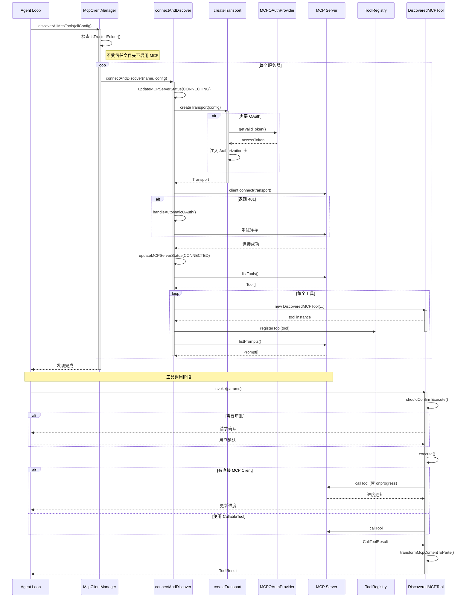

**协作要点**：

1. **McpClientManager 与 connectAndDiscover**：一对多管理，每个服务器独立发现
2. **createTransport 与 OAuth**：自动处理认证，支持 401 自动重试
3. **DiscoveredMCPTool 与审批**：调用前进行权限检查，支持服务器/工具级白名单
4. **进度通知**：直接 MCP Client 支持 onprogress 回调，实时反馈执行进度

---

### 3.5 MCP 工具进度通知

#### 职责定位

Qwen Code 支持 MCP 协议的进度通知机制，允许长时间运行的工具实时反馈执行进度，提升用户体验。

#### 进度数据结构

```typescript
// packages/core/src/tools/tools.ts:477-485
export interface McpToolProgressData {
  type: 'mcp_tool_progress';
  /** Current progress value (must increase with each notification) */
  progress: number;
  /** Optional total value indicating the operation's target */
  total?: number;
  /** Optional human-readable progress message */
  message?: string;
}
```

#### 执行流程与进度回调

```typescript
// packages/core/src/tools/mcp-tool.ts:213-238
private async executeWithDirectClient(
  signal: AbortSignal,
  updateOutput?: (output: ToolResultDisplay) => void,
): Promise<ToolResult> {
  const callToolResult = await this.mcpClient!.callTool(
    {
      name: this.serverToolName,
      arguments: this.params as Record<string, unknown>,
    },
    undefined,
    {
      onprogress: (progress) => {
        if (updateOutput) {
          const progressData: McpToolProgressData = {
            type: 'mcp_tool_progress',
            progress: progress.progress,
            ...(progress.total != null && { total: progress.total }),
            ...(progress.message != null && { message: progress.message }),
          };
          updateOutput(progressData);
        }
      },
      timeout: this.mcpTimeout,
      signal,
    },
  );
  // ...
}
```

**设计要点**：

1. **双路径执行**：
   - **直接 MCP Client**：支持 `onprogress` 回调，实时接收进度通知
   - **@google/genai CallableTool**：不支持进度通知，作为降级方案

2. **进度数据流**：
   ```
   MCP Server → onprogress callback → McpToolProgressData → updateOutput → UI 更新
   ```

3. **使用场景**：
   - 浏览器自动化（playwright-mcp）
   - 长时间的数据处理任务
   - 文件下载/上传操作

---

### 3.6 JSON Schema Draft-2020-12 支持

#### 职责定位

现代 MCP 服务器（如使用 rmcp 实现的服务器）采用 JSON Schema Draft-2020-12 标准，Qwen Code 通过引入 Ajv2020 验证器实现兼容。

#### 实现代码

```typescript
// packages/core/src/utils/schemaValidator.ts:1-60
import AjvPkg, { type AnySchema, type Ajv } from 'ajv';
// Ajv2020 is the documented way to use draft-2020-12
import Ajv2020Pkg from 'ajv/dist/2020.js';
import * as addFormats from 'ajv-formats';

const AjvClass = (AjvPkg as any).default || AjvPkg;
const Ajv2020Class = (Ajv2020Pkg as any).default || Ajv2020Pkg;

const ajvOptions = {
  strictSchema: false,  // 允许非标准关键字
};

// Draft-07 validator (default)
const ajvDefault: Ajv = new AjvClass(ajvOptions);

// Draft-2020-12 validator for MCP servers using rmcp
const ajv2020: Ajv = new Ajv2020Class(ajvOptions);

const DRAFT_2020_12_SCHEMA = 'https://json-schema.org/draft/2020-12/schema';

function getValidator(schema: AnySchema): Ajv {
  if (
    typeof schema === 'object' &&
    schema !== null &&
    '$schema' in schema &&
    schema.$schema === DRAFT_2020_12_SCHEMA
  ) {
    return ajv2020;
  }
  return ajvDefault;
}
```

**设计要点**：

1. **自动检测**：根据 schema 的 `$schema` 字段自动选择验证器
2. **向后兼容**：Draft-07 作为默认验证器，确保旧版本兼容
3. **容错处理**：schema 编译失败时跳过验证，不阻塞工具使用
4. **布尔值修复**：自动将字符串 `"true"`/`"false"` 转换为布尔值，适配自托管 LLM

---

### 3.7 关键数据路径

#### 主路径（正常流程）

```mermaid
flowchart LR
    subgraph Input["输入阶段"]
        I1[settings.json 配置] --> I2[McpClientManager::discoverAllMcpTools]
        I2 --> I3[遍历 mcpServers]
    end

    subgraph Process["处理阶段"]
        P1[createTransport] --> P2[自动选择传输类型]
        P2 --> P3[client.connect]
        P3 --> P4[listTools/listPrompts]
        P4 --> P5[注册到 Registry]
    end

    subgraph Output["输出阶段"]
        O1[DiscoveredMCPTool] --> O2[Agent Loop 使用]
        O2 --> O3[callTool 远程执行]
    end

    I3 --> P1
    P5 --> O1

    style Process fill:#e1f5e1,stroke:#333
```

#### 异常路径（错误恢复）

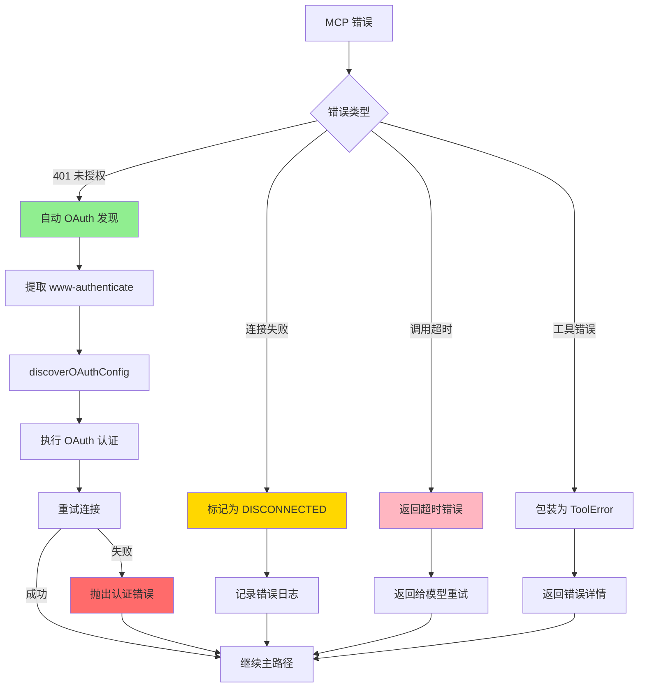

---

## 4. 端到端数据流转

### 4.1 正常流程（详细版）

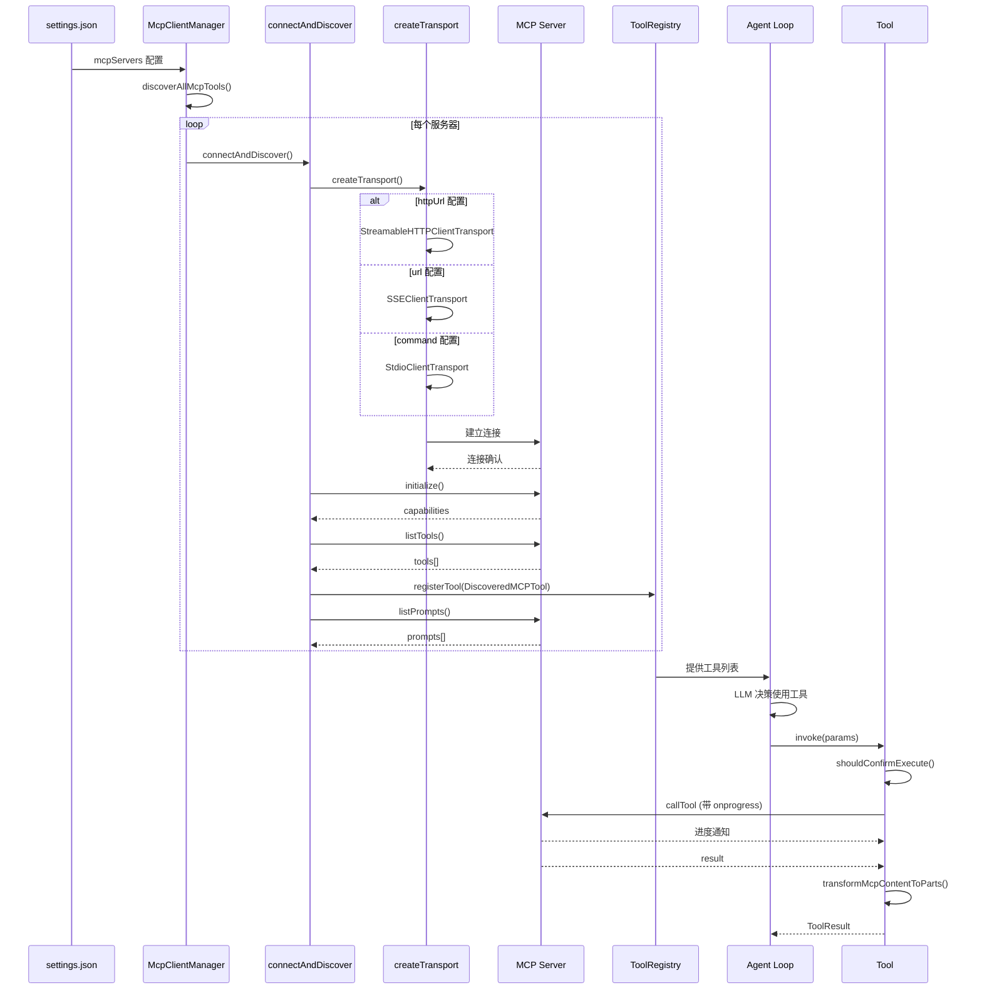

**数据变换详情**：

| 阶段 | 输入 | 处理 | 输出 | 代码位置 |
|-----|------|------|------|---------|
| 配置 | settings.json | 解析 mcpServers | MCPServerConfig | `protocol.ts:287` |
| 传输 | MCPServerConfig | createTransport() | Transport 实例 | `mcp-client.ts:1223` |
| 发现 | Transport | listTools() | Tool[] | `mcp-client.ts:624` |
| 包装 | Tool | new DiscoveredMCPTool() | CallableTool | `mcp-tool.ts:329` |
| 注册 | DiscoveredMCPTool | registerTool() | Registry 条目 | `mcp-client.ts:598` |
| 调用 | server__tool, args | callTool() | CallToolResult | `mcp-tool.ts:194` |
| 转换 | CallToolResult | transformMcpContentToParts() | Part[] | `mcp-tool.ts:474` |

### 4.2 数据流向图

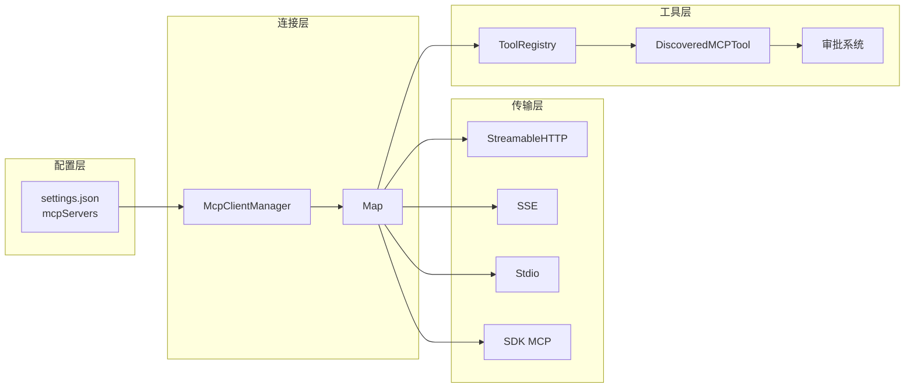

### 4.3 异常/边界流程

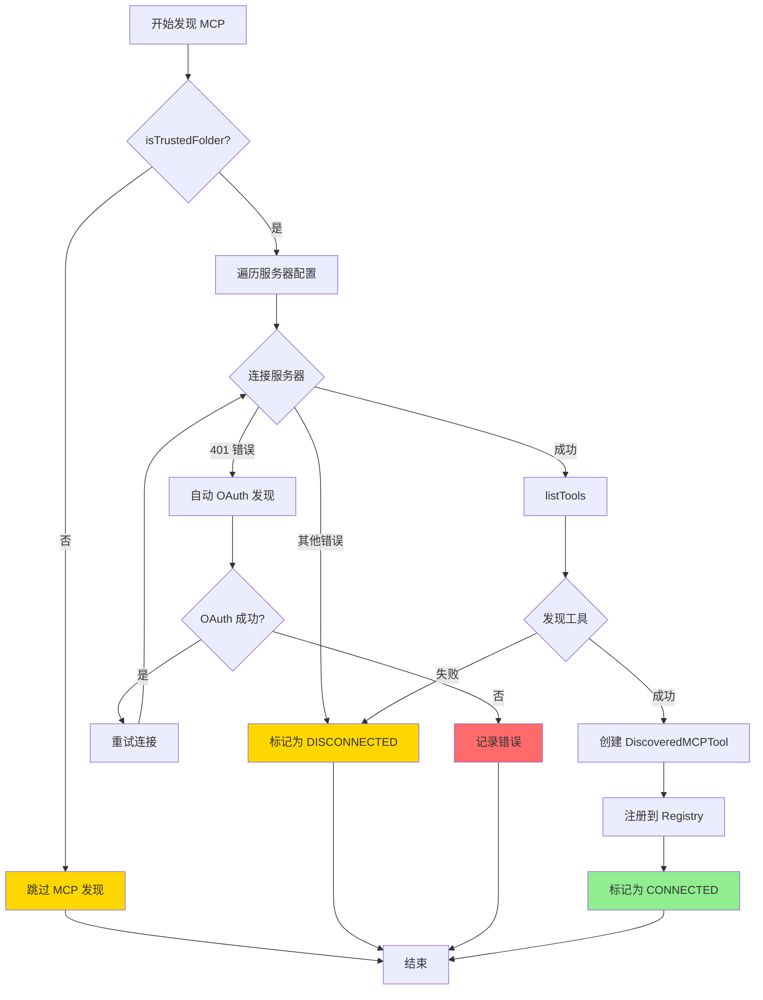

---

## 5. 关键代码实现

### 5.1 核心数据结构

```typescript
// packages/sdk-typescript/src/types/protocol.ts:287-306
export interface MCPServerConfig {
  command?: string;
  args?: string[];
  env?: Record<string, string>;
  cwd?: string;
  url?: string;
  httpUrl?: string;
  headers?: Record<string, string>;
  tcp?: string;
  timeout?: number;
  trust?: boolean;
  description?: string;
  includeTools?: string[];
  excludeTools?: string[];
  extensionName?: string;
  oauth?: Record<string, unknown>;
  authProviderType?: AuthProviderType;
  targetAudience?: string;
  targetServiceAccount?: string;
}
```

**字段说明**：

| 字段 | 类型 | 用途 |
|-----|------|------|
| `command` | `string` | Stdio 传输的命令 |
| `args` | `string[]` | 命令参数 |
| `url` | `string` | SSE 传输的 URL |
| `httpUrl` | `string` | StreamableHTTP 传输的 URL |
| `headers` | `Record<string, string>` | 自定义请求头 |
| `timeout` | `number` | 工具调用超时（毫秒） |
| `trust` | `boolean` | 是否信任该服务器（影响审批） |
| `includeTools` | `string[]` | 允许列表（白名单） |
| `excludeTools` | `string[]` | 禁止列表（黑名单） |
| `oauth` | `Record<string, unknown>` | OAuth 配置 |
| `authProviderType` | `AuthProviderType` | 认证提供者类型 |

### 5.2 主链路代码

```typescript
// packages/core/src/tools/mcp-client.ts:798-870
export async function connectToMcpServer(
  mcpServerName: string,
  mcpServerConfig: MCPServerConfig,
  debugMode: boolean,
  workspaceContext: WorkspaceContext,
  sendSdkMcpMessage?: SendSdkMcpMessage,
): Promise<Client> {
  const mcpClient = new Client({
    name: 'qwen-code-mcp-client',
    version: '0.0.1',
  });

  // 注册 roots 能力
  mcpClient.registerCapabilities({
    roots: { listChanged: true },
  });

  // 设置 roots 请求处理器
  mcpClient.setRequestHandler(ListRootsRequestSchema, async () => {
    const roots = [];
    for (const dir of workspaceContext.getDirectories()) {
      roots.push({
        uri: pathToFileURL(dir).toString(),
        name: basename(dir),
      });
    }
    return { roots };
  });

  // 创建传输层
  const transport = await createTransport(
    mcpServerName,
    mcpServerConfig,
    debugMode,
    sendSdkMcpMessage,
  );

  try {
    await mcpClient.connect(transport, {
      timeout: mcpServerConfig.timeout ?? MCP_DEFAULT_TIMEOUT_MSEC,
    });
    return mcpClient;
  } catch (error) {
    await transport.close();
    throw error;
  }
}
```

**代码要点**：

1. **Roots 支持**：实现 MCP roots 协议，支持工作区目录同步
2. **目录变更通知**：监听目录变化，通知 MCP 服务器
3. **超时配置**：支持配置连接超时，默认使用 MCP_DEFAULT_TIMEOUT_MSEC
4. **资源清理**：连接失败时自动关闭传输层

### 5.3 关键调用链

```text
discoverAllMcpTools()              [mcp-client-manager.ts:55]
  -> stop()                        [mcp-client-manager.ts:59]
  -> populateMcpServerCommand()    [mcp-client.ts:518]
  -> Promise.all(discoveryPromises)
    -> connectAndDiscover()        [mcp-client.ts:548]
      -> updateMCPServerStatus()   [mcp-client.ts:558]
      -> connectToMcpServer()      [mcp-client.ts:798]
        -> createTransport()       [mcp-client.ts:1223]
          - 处理 OAuth token
          - 创建 StreamableHTTP/SSE/Stdio 传输
        -> client.connect()
        -> 设置 onerror 处理器
      -> discoverPrompts()         [mcp-client.ts:713]
      -> discoverTools()           [mcp-client.ts:625]
        -> mcpToTool()             [@google/genai]
        -> fetch annotations       [mcp-client.ts:646]
        -> isEnabled()             [mcp-client.ts:1407]
        -> new DiscoveredMCPTool() [mcp-tool.ts:348]
          - generateValidName()    [mcp-tool.ts:569]
      -> registerTool()            [tool-registry.ts]
```

---

## 6. 设计意图与 Trade-off

### 6.1 Qwen Code 的选择

| 维度 | Qwen Code 的选择 | 替代方案 | 取舍分析 |
|-----|-----------------|---------|---------|
| SDK 选择 | 官方 @modelcontextprotocol/sdk | 自研实现 (Codex) / fastmcp (Kimi) | 标准兼容，但依赖外部库更新 |
| 传输协议 | StreamableHTTP/SSE/Stdio/SDK MCP | 仅 stdio | 覆盖更多场景，但增加复杂度 |
| 传输选择 | 配置指定（httpUrl/url/command） | 自动回退 (Gemini) | 配置明确，但需要用户了解协议差异 |
| 认证机制 | 自动 OAuth 发现 + 401 重试 | 手动配置 / 仅 Bearer | 零配置体验，但自动发现可能失败 |
| 工具命名 | `mcp__{server}__{tool}` | `{server}__{tool}` / UUID | 命名空间清晰，但增加长度 |
| 信任模型 | 服务器级 trust + 审批白名单 | 工具级审批 | 简化配置，但粒度较粗 |
| 进度通知 | 直接 MCP Client onprogress | 无进度 | 支持长时间任务，但增加复杂度 |
| Roots 支持 | 完整实现 | 不支持 | 支持工作区同步，但增加协议复杂度 |
| **Tool Annotations** | **支持 readOnlyHint 等** | **无** | **智能审批，支持 Plan 模式** |
| **JSON Schema** | **Draft-07 + Draft-2020-12** | **仅 Draft-07** | **兼容现代 MCP 服务器** |

### 6.2 为什么这样设计？

**核心问题**：如何在保持与官方 MCP 协议兼容的同时，提供良好的用户体验？

**Qwen Code 的解决方案**：
- 代码依据：`mcp-client.ts:798-870` 的 connectToMcpServer 实现
- 设计意图：基于官方 SDK 实现，确保协议兼容性
- 带来的好处：
  - 与官方 MCP 协议完全兼容
  - 自动 OAuth 发现降低配置负担
  - Roots 支持实现工作区同步
  - 进度通知支持长时间任务
- 付出的代价：
  - 依赖官方 SDK 的更新和维护
  - 自动 OAuth 发现可能失败，需要手动回退
  - 传输协议需要用户显式配置

### 6.3 与其他项目的对比

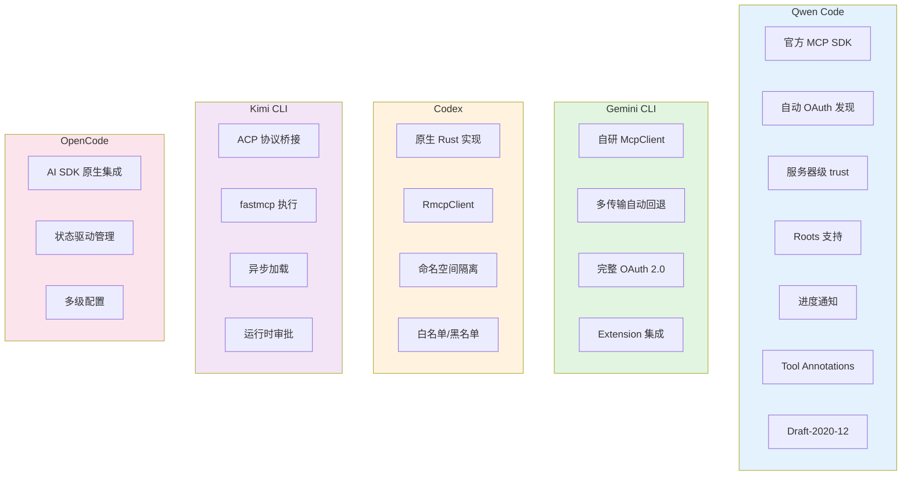

#### 详细对比表

| 维度 | Qwen Code | Gemini CLI | Codex | Kimi CLI | OpenCode |
|-----|-----------|------------|-------|----------|----------|
| **SDK 选择** | 官方 @modelcontextprotocol/sdk | 自研 McpClient | RmcpClient (Rust) | fastmcp (Python) | @modelcontextprotocol/sdk |
| **传输协议** | StreamableHTTP/SSE/Stdio/SDK MCP | StreamableHTTP/SSE/Stdio/WebSocket | stdio/StreamableHTTP | HTTP/SSE/Stdio | StreamableHTTP/SSE/Stdio |
| **传输选择** | 配置指定 | 自动回退 | 配置指定 | 配置指定 | 自动回退 |
| **认证机制** | 自动 OAuth 发现 + 401 重试 | 完整 OAuth 2.0 + Google 服务账号 | Bearer Token | OAuth/Headers | OAuth 动态注册 |
| **工具发现** | 启动时发现 | 启动发现 + 动态刷新 | 启动时发现 | 启动时异步发现 | 启动发现 + 状态管理 |
| **工具命名** | `mcp__{server}__{tool}` | `{server}__{tool}` | `mcp__{server}__{tool}` | 原始名称 | `{client}:{tool}` |
| **审批控制** | 服务器级 trust + 白名单 + **Tool Annotations** | Policy Engine + trust | 白名单/黑名单 | 运行时审批 | 配置 enabled |
| **进度通知** | 支持（onprogress） | 支持 | 不支持 | 不支持 | 支持 |
| **Roots 支持** | 完整实现 | 支持 | 不支持 | 不支持 | 支持 |
| **Schema 支持** | **Draft-07 + Draft-2020-12** | Draft-07 | Draft-07 | Draft-07 | Draft-07 |
| **加载策略** | 同步初始化 | 同步初始化 | 同步初始化 | 异步后台加载 | 状态驱动初始化 |

#### 各项目适用场景

| 项目 | 核心差异 | 适用场景 |
|-----|---------|---------|
| **Qwen Code** | 官方 SDK + 自动 OAuth 发现 + Roots 支持 + Tool Annotations + Draft-2020-12 | 需要与官方 MCP 协议完全兼容，支持现代 MCP 服务器的场景 |
| **Gemini CLI** | 自研 McpClient + 多传输自动回退 + 完整 OAuth 2.0 | 需要访问 Google Workspace 等企业服务 |
| **Codex** | 原生 Rust 实现 + 命名空间隔离 | 追求高性能和稳定性的企业场景 |
| **Kimi CLI** | ACP 桥接 + fastmcp 执行 + 异步加载 | 已使用 Moonshot ACP 生态的用户 |
| **OpenCode** | AI SDK 原生集成 + 状态驱动 | 使用 Vercel AI SDK 的项目 |

---

## 7. 边界情况与错误处理

### 7.1 终止条件

| 终止原因 | 触发条件 | 代码位置 |
|---------|---------|---------|
| 不受信任文件夹 | isTrustedFolder() 返回 false | `mcp-client-manager.ts:56` |
| 服务器未配置 | 找不到对应服务器配置 | `mcp-client-manager.ts:213` |
| 连接超时 | 超过 timeout 配置 | `mcp-client.ts:864` |
| 401 未授权 | 服务器返回 401 且 OAuth 失败 | `mcp-client.ts:874` |
| 工具调用超时 | 超过 mcpTimeout 配置 | `mcp-tool.ts:217` |
| 审批拒绝 | 用户拒绝工具调用 | `mcp-tool.ts:130` |
| **只读工具跳过审批** | **readOnlyHint=true 且 Plan 模式** | **`mcp-tool.ts:140`** |
| 服务器断开 | onerror 回调触发 | `mcp-client.ts:570` |

### 7.2 超时/资源限制

```typescript
// 默认超时配置
const MCP_DEFAULT_TIMEOUT_MSEC = 600000;  // 10 分钟

// 配置层超时设置
export interface MCPServerConfig {
  timeout?: number;  // 工具调用超时（毫秒）
}

// 工具调用超时
// packages/core/src/tools/mcp-tool.ts:216
result = await this.mcpClient!.callTool(
  { name: this.serverToolName, arguments: this.params },
  undefined,
  {
    onprogress: (progress) => { /* ... */ },
    timeout: this.mcpTimeout,  // 从配置读取
    signal,
  },
);
```

### 7.3 错误恢复策略

| 错误类型 | 处理策略 | 代码位置 |
|---------|---------|---------|
| 401 未授权 | 自动 OAuth 发现并重试 | `mcp-client.ts:874-1198` |
| 连接失败 | 标记为 DISCONNECTED，记录日志 | `mcp-client.ts:600` |
| 调用超时 | 返回超时错误给模型 | `mcp-tool.ts:216` |
| 工具错误 | 包装为 ToolError，包含错误详情 | `mcp-tool.ts:229` |
| 审批拒绝 | 返回 ToolConfirmationOutcome | `mcp-tool.ts:149` |
| 命名冲突 | 使用 generateValidName 处理 | `mcp-tool.ts:547` |
| 资源清理 | stop() 关闭所有客户端 | `mcp-client-manager.ts:179` |

---

## 8. 关键代码索引

| 功能 | 文件 | 行号 | 说明 |
|-----|------|------|------|
| 配置 | `packages/sdk-typescript/src/types/protocol.ts` | 287 | MCPServerConfig 接口定义 |
| 连接管理 | `packages/core/src/tools/mcp-client-manager.ts` | 29 | McpClientManager 类 |
| 发现入口 | `packages/core/src/tools/mcp-client-manager.ts` | 55 | discoverAllMcpTools() 方法 |
| 单服务器发现 | `packages/core/src/tools/mcp-client-manager.ts` | 114 | discoverMcpToolsForServer() 方法 |
| 停止所有 | `packages/core/src/tools/mcp-client-manager.ts` | 179 | stop() 方法 |
| 读取资源 | `packages/core/src/tools/mcp-client-manager.ts` | 200 | readResource() 方法 |
| 连接服务器 | `packages/core/src/tools/mcp-client.ts` | 548 | connectAndDiscover() 函数 |
| 创建客户端 | `packages/core/src/tools/mcp-client.ts` | 798 | connectToMcpServer() 函数 |
| 传输创建 | `packages/core/src/tools/mcp-client.ts` | 1223 | createTransport() 函数 |
| OAuth 处理 | `packages/core/src/tools/mcp-client.ts` | 364 | handleAutomaticOAuth() 函数 |
| 工具发现 | `packages/core/src/tools/mcp-client.ts` | 625 | discoverTools() 函数 |
| Prompt 发现 | `packages/core/src/tools/mcp-client.ts` | 713 | discoverPrompts() 函数 |
| 工具启用检查 | `packages/core/src/tools/mcp-client.ts` | 1407 | isEnabled() 函数 |
| 工具包装 | `packages/core/src/tools/mcp-tool.ts` | 348 | DiscoveredMCPTool 类 |
| 工具调用 | `packages/core/src/tools/mcp-tool.ts` | 109 | DiscoveredMCPToolInvocation 类 |
| 审批检查 | `packages/core/src/tools/mcp-tool.ts` | 130 | shouldConfirmExecute() 方法 |
| 执行工具 | `packages/core/src/tools/mcp-tool.ts` | 195 | execute() 方法 |
| 名称生成 | `packages/core/src/tools/mcp-tool.ts` | 569 | generateValidName() 函数 |
| 内容转换 | `packages/core/src/tools/mcp-tool.ts` | 496 | transformMcpContentToParts() 函数 |
| 状态更新 | `packages/core/src/tools/mcp-client.ts` | 298 | updateMCPServerStatus() 函数 |
| 获取状态 | `packages/core/src/tools/mcp-client.ts` | 312 | getMCPServerStatus() 函数 |
| **工具注解** | **`packages/core/src/tools/mcp-tool.ts`** | **97** | **McpToolAnnotations 接口** |
| **进度数据** | **`packages/core/src/tools/tools.ts`** | **477** | **McpToolProgressData 接口** |
| **Schema 验证** | **`packages/core/src/utils/schemaValidator.ts`** | **66** | **SchemaValidator 类** |

---

## 9. 延伸阅读

- 前置知识：`05-qwen-code-tools-system.md`
- 相关机制：`04-qwen-code-agent-loop.md`
- 传输协议：[MCP Specification](https://modelcontextprotocol.io/specification)
- 跨项目对比：`../comm/06-comm-mcp-integration.md`
- Gemini CLI MCP：`../gemini-cli/06-gemini-cli-mcp-integration.md`
- Codex MCP：`../codex/06-codex-mcp-integration.md`
- Kimi CLI MCP：`../kimi-cli/06-kimi-cli-mcp-integration.md`
- OpenCode MCP：`../opencode/06-opencode-mcp-integration.md`

---

*✅ Verified: 基于 qwen-code/packages/core/src/tools/mcp*.ts 源码分析*
*基于版本：2026-02-08 | 最后更新：2026-03-02*
