> **阅读指南**
>
> | 属性 | 说明 |
> |-----|------|
> | 预计阅读 | 20-30 分钟 |
> | 前置文档 | `01-qwen-code-overview.md`、`04-qwen-code-agent-loop.md` |
> | 文档结构 | 速览 → 架构 → 机制 → 实现 → 对比 |
> | 代码呈现 | 关键代码直接展示，完整代码可折叠查看 |

---

# Memory Context（Qwen Code）

## TL;DR（结论先行）

一句话定义：Qwen Code 的 Memory Context 采用「**四层分层架构 + 智能自动压缩 + IDE 上下文增量同步**」策略，通过 GeminiChat 管理 API 格式历史，ChatCompressionService 在 token 超过 70% 阈值时自动总结压缩，同时支持 IDE 编辑器状态的实时增量注入。

Qwen Code 的核心取舍：**自动压缩 + IDE 增量同步**（对比 Gemini CLI 的文件分层记忆、Kimi CLI 的 Checkpoint 回滚、Codex 的惰性压缩）

### 核心要点速览

| 维度 | 关键决策 | 代码位置 |
|-----|---------|---------|
| 核心机制 | API Content 数组管理对话历史 | `packages/core/src/core/geminiChat.ts:214` |
| 自动压缩 | 70% 阈值触发，保留 30% 完整历史 | `packages/core/src/services/chatCompressionService.ts:78` |
| 分割策略 | 在 user message 边界分割，保护 functionCall/functionResponse 配对 | `packages/core/src/services/chatCompressionService.ts:36` |
| IDE 同步 | 增量更新 + API 约束感知（跳过 pending tool call） | `packages/core/src/core/client.ts:211` |
| 思考清理 | 完全移除 thought parts 减少 token 消耗 | `packages/core/src/core/geminiChat.ts:480` |
| 失败处理 | 标记 hasFailedCompressionAttempt 避免重复失败 | `packages/core/src/core/client.ts:695` |

---

## 1. 为什么需要这个机制？（解决什么问题）

### 1.1 问题场景

没有 Memory Context 管理：
```
用户提问 → LLM 缺乏项目背景 → 回答泛泛而谈 → 需要反复解释项目规范
长对话 → Token 超限 → 模型报错 → 对话中断
IDE 中切换文件 → Agent 不知道当前编辑位置 → 上下文脱节
```

有 Memory Context 管理：
```
用户提问 → 自动加载 System Prompt + 工具声明 → LLM 了解上下文 → 精准回答
长对话 → Token 接近 70% 阈值 → 自动压缩早期历史 → 对话继续
IDE 中切换文件 → 增量同步编辑器状态 → Agent 实时感知当前上下文
```

### 1.2 核心挑战

| 挑战 | 不解决的后果 |
|-----|-------------|
| Token 超限 | 长对话导致上下文窗口溢出，模型报错 |
| 历史管理 | 无法有效管理多轮对话历史，信息丢失 |
| IDE 上下文同步 | Agent 与编辑器状态脱节，无法感知当前编辑位置 |
| 压缩质量 | 简单截断会丢失关键信息 |
| API 约束 | functionCall/functionResponse 必须相邻，插入 IDE 上下文会破坏约束 |

---

## 2. 整体架构（ASCII 图）

### 2.1 在系统中的位置

```text
┌─────────────────────────────────────────────────────────────┐
│ Agent Loop / GeminiClient                                    │
│ packages/core/src/core/client.ts                             │
└───────────────────────┬─────────────────────────────────────┘
                        │
        ┌───────────────┼───────────────┐
        ▼               ▼               ▼
┌──────────────┐ ┌──────────────┐ ┌──────────────┐
│ IDE Context  │ │ Compression  │ │ Chat History │
│ 增量同步     │ │ Service      │ │ 管理         │
└──────┬───────┘ └──────┬───────┘ └──────┬───────┘
       │                │                │
       ▼                ▼                ▼
┌─────────────────────────────────────────────────────────────┐
│ ▓▓▓ Memory Context ▓▓▓                                      │
│ packages/core/src/                                           │
│ - core/geminiChat.ts      : Chat 历史管理 (Content[])       │
│ - services/chatCompressionService.ts: 自动压缩服务          │
│ - core/client.ts          : IDE 上下文集成                  │
│ - ide/ideContext.ts       : IDE 状态存储                    │
└───────────────────────┬─────────────────────────────────────┘
                        │ 依赖
        ┌───────────────┼───────────────┐
        ▼               ▼               ▼
┌──────────────┐ ┌──────────────┐ ┌──────────────┐
│ Token Limits │ │ LLM API      │ │ Telemetry    │
│ 模型限制     │ │ 摘要生成     │ │ Token 统计   │
└──────────────┘ └──────────────┘ └──────────────┘
```

### 2.2 核心组件职责

| 组件 | 职责 | 代码位置 |
|-----|------|---------|
| `GeminiChat` | 管理 API 格式的对话历史 (Content[]) | `packages/core/src/core/geminiChat.ts:214` |
| `ChatCompressionService` | 自动检测并压缩超长历史 | `packages/core/src/services/chatCompressionService.ts:78` |
| `findCompressSplitPoint` | 计算历史分割点（保留最近 30%） | `packages/core/src/services/chatCompressionService.ts:36` |
| `GeminiClient` | 协调历史管理与 IDE 上下文注入 | `packages/core/src/core/client.ts:78` |
| `IdeContextStore` | 存储和管理 IDE 编辑器状态 | `packages/core/src/ide/ideContext.ts:15` |
| `getIdeContextParts` | 生成完整或增量 IDE 上下文 | `packages/core/src/core/client.ts:211` |

### 2.3 核心组件交互关系

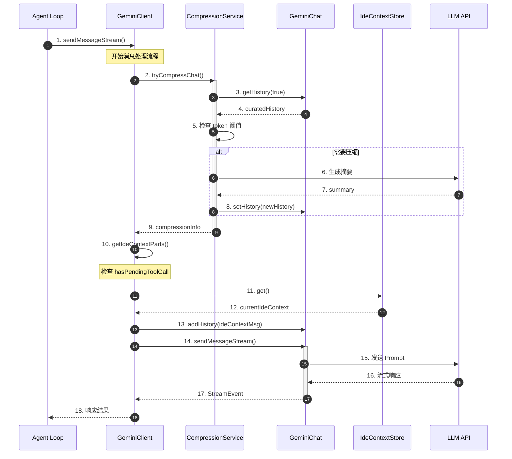

**关键交互说明**：

| 步骤 | 交互内容 | 设计意图 |
|-----|---------|---------|
| 1 | Agent Loop 发起请求 | 统一入口，解耦业务与核心 |
| 2-9 | 压缩检查与执行 | 在发送前自动压缩，避免超限 |
| 10-13 | IDE 上下文注入 | 增量同步编辑器状态 |
| 14-18 | LLM 调用与响应 | 标准对话流程 |

---

## 3. 核心组件详细分析

### 3.1 GeminiChat 内部结构

#### 职责定位

GeminiChat 是 Qwen Code 对话历史管理的核心，负责维护 API 格式的 Content 数组，支持历史记录、检索、清理思考内容等功能。

#### 状态机图

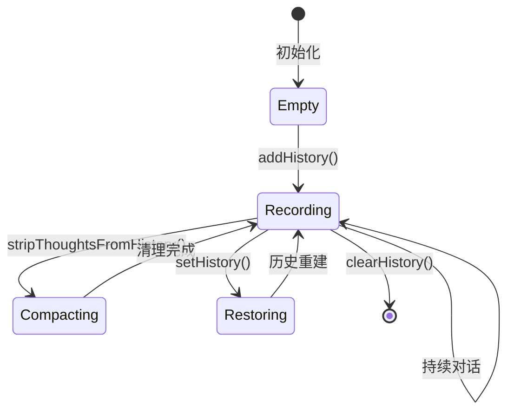

**状态说明**：

| 状态 | 说明 | 进入条件 | 退出条件 |
|-----|------|---------|---------|
| Empty | 初始状态 | GeminiChat 创建 | 首次添加历史 |
| Recording | 记录中 | 开始对话 | 清理/重建/清空 |
| Compacting | 清理思考内容 | 调用 stripThoughts | 清理完成 |
| Restoring | 恢复/重建历史 | 调用 setHistory | 重建完成 |

#### 内部数据流

```text
┌─────────────────────────────────────────────────────────────┐
│  输入层                                                      │
│  ├── User Message    ──► addHistory()                       │
│  ├── Assistant Resp  ──► addHistory()                       │
│  ├── Tool Output     ──► addHistory()                       │
│  └── IDE Context     ──► addHistory()                       │
└──────────────────────────┬──────────────────────────────────┘
                           ▼
┌─────────────────────────────────────────────────────────────┐
│  内存层                                                      │
│  ├── history: Content[] (API 格式)                          │
│  ├── generationConfig: 系统指令 + 工具声明                  │
│  └── sendPromise: 流式请求同步                              │
└──────────────────────────┬──────────────────────────────────┘
                           ▼
┌─────────────────────────────────────────────────────────────┐
│  输出层                                                      │
│  ├── getHistory(curated)                                    │
│  │   └── curated=true: 过滤无效内容                         │
│  ├── stripThoughtsFromHistory()                             │
│  │   └── 移除 thought/thoughtSignature                      │
│  └── sendMessageStream()                                    │
│      └── 流式 LLM 调用                                      │
└─────────────────────────────────────────────────────────────┘
```

#### 关键算法逻辑

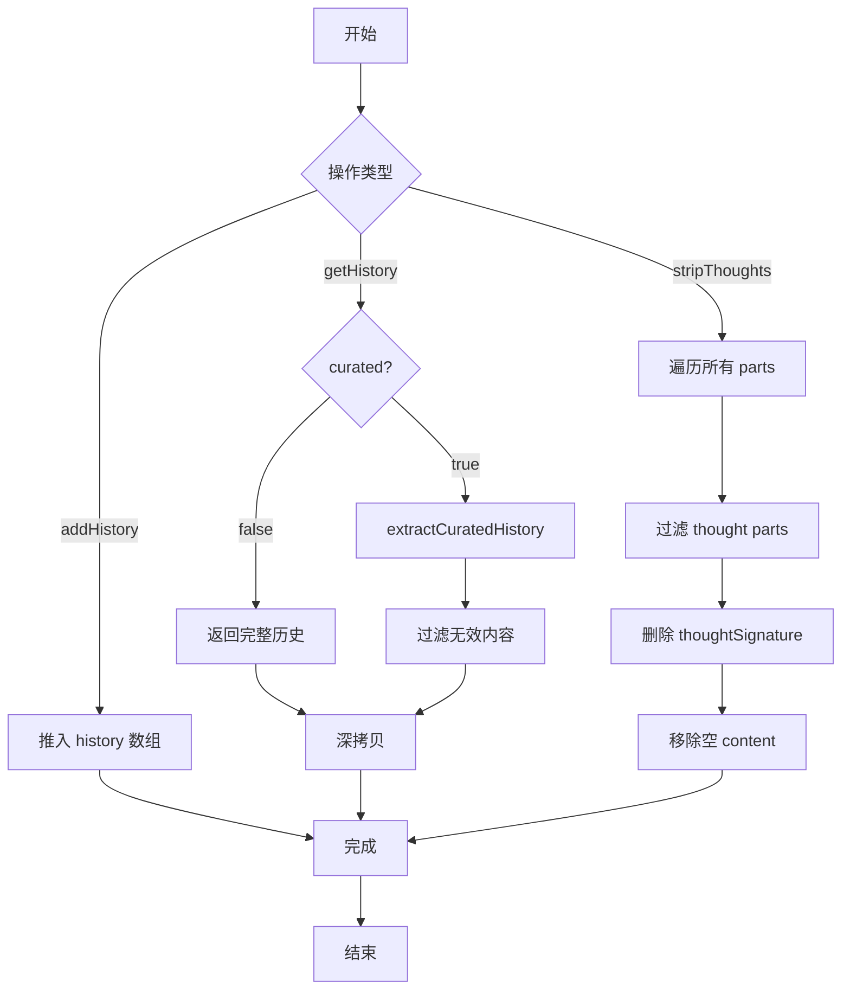

**算法要点**：

1. **Curated 历史**：过滤掉无效或空的模型输出，确保后续请求被接受
2. **思考清理**：完全移除 thought parts 和 thoughtSignature，减少 token 消耗
3. **深拷贝保护**：getHistory 返回深拷贝，防止外部修改影响内部状态

#### 关键接口

| 接口 | 输入 | 输出 | 说明 | 代码位置 |
|-----|------|------|------|---------|
| `addHistory()` | Content | - | 添加历史记录 | `geminiChat.ts:472` |
| `getHistory()` | curated?: boolean | Content[] | 获取历史 | `geminiChat.ts:453` |
| `setHistory()` | Content[] | - | 设置历史（压缩后重建） | `geminiChat.ts:476` |
| `stripThoughtsFromHistory()` | - | - | 清理思考内容 | `geminiChat.ts:480` |
| `sendMessageStream()` | model, params, prompt_id | AsyncGenerator | 流式发送 | `geminiChat.ts:263` |

---

### 3.2 ChatCompressionService 内部结构

#### 职责定位

ChatCompressionService 负责在 token 超过阈值时自动压缩对话历史，保留最近 30% 的完整对话，将早期历史总结为摘要。

#### 状态机图

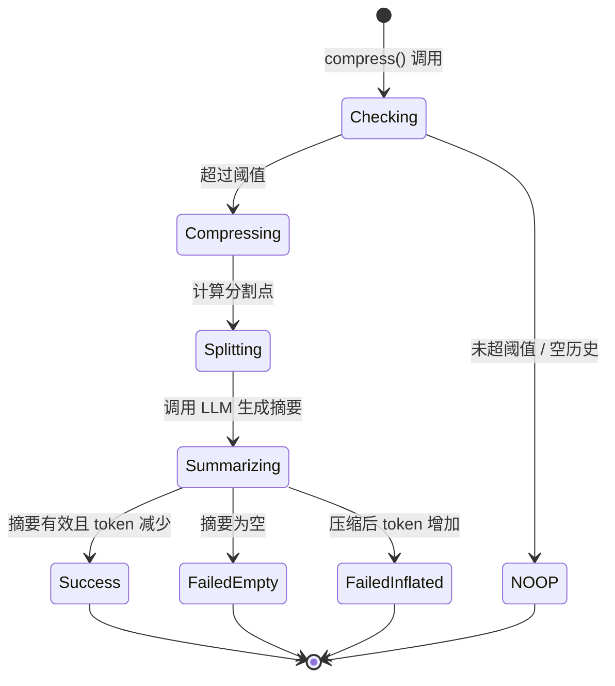

**状态说明**：

| 状态 | 说明 | 进入条件 | 退出条件 |
|-----|------|---------|---------|
| Checking | 检查是否需要压缩 | 调用 compress() | 决定操作 |
| NOOP | 无需压缩 | 未超阈值/空历史/禁用 | 直接返回 |
| Compressing | 执行压缩 | 超过阈值 | 分割历史 |
| Splitting | 计算分割点 | 开始压缩 | 确定分割位置 |
| Summarizing | 生成摘要 | 分割完成 | LLM 返回结果 |
| Success | 压缩成功 | 摘要有效且减少 token | 返回新历史 |
| FailedEmpty | 摘要为空 | LLM 返回空摘要 | 返回 null |
| FailedInflated | 压缩反增 | 新 token > 原 token | 返回 null |

#### 关键算法逻辑

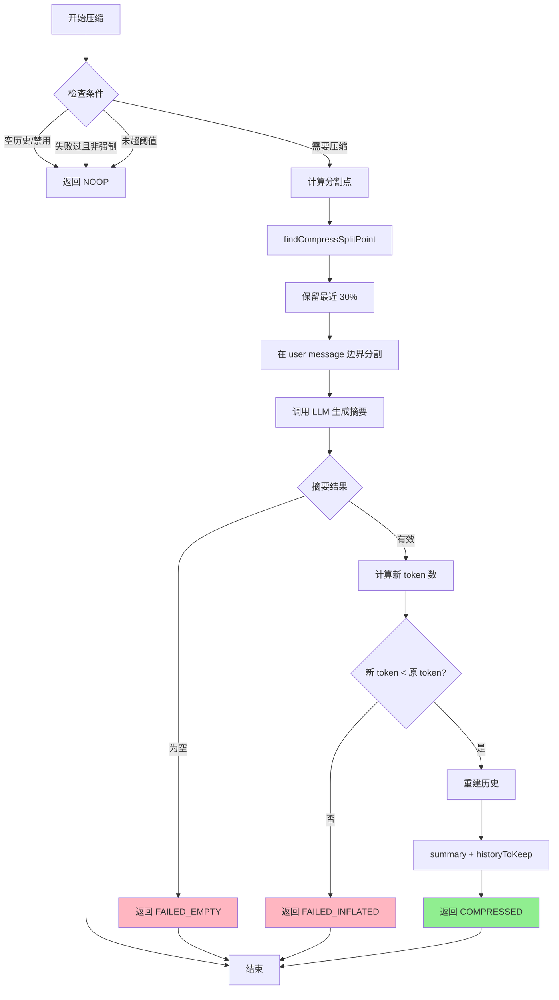

**算法要点**：

1. **阈值检查**：默认 70% 上下文限制触发压缩
2. **分割策略**：保留最近 30%，在 user message 边界分割（避免破坏 functionCall/functionResponse 配对）
3. **摘要生成**：使用独立 LLM 调用生成早期对话摘要
4. **失败处理**：空摘要或 token 增加时放弃压缩，标记失败避免重复尝试

#### 关键接口

| 接口 | 输入 | 输出 | 说明 | 代码位置 |
|-----|------|------|------|---------|
| `compress()` | chat, promptId, force, model, config | {newHistory, info} | 主压缩方法 | `chatCompressionService.ts:79` |
| `findCompressSplitPoint()` | contents, fraction | number | 计算分割点 | `chatCompressionService.ts:36` |

---

### 3.3 IDE 上下文集成内部结构

#### 职责定位

IDE 上下文集成负责将编辑器状态（活跃文件、光标位置、选择区域）同步到对话历史中，支持完整上下文和增量更新两种模式。

#### 关键算法逻辑

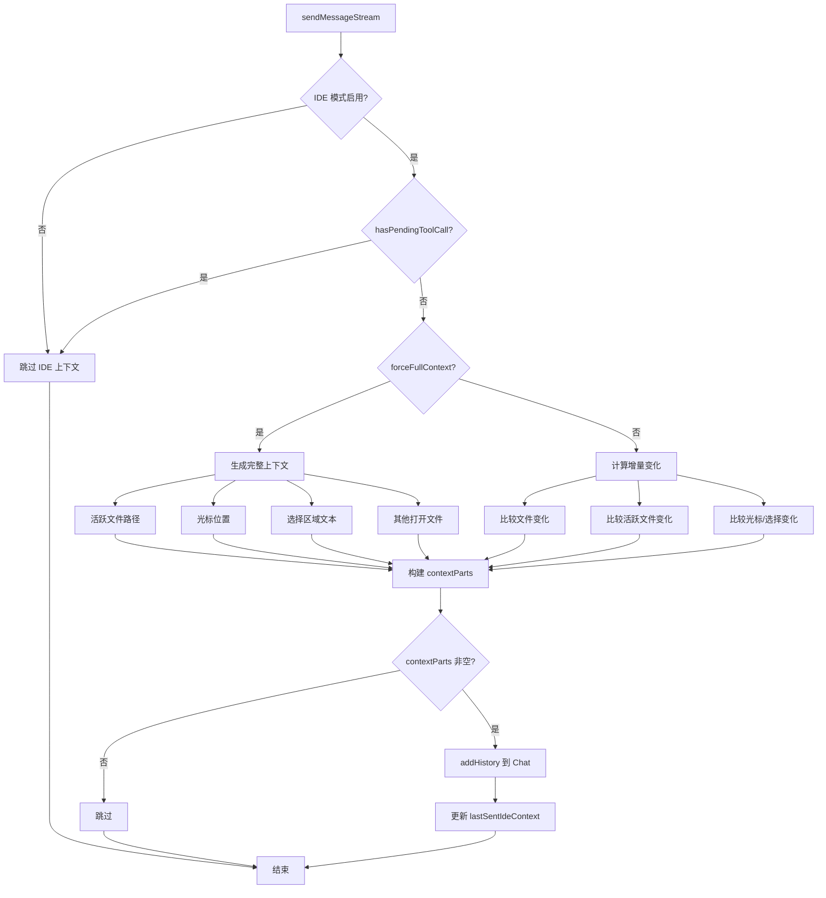

**算法要点**：

1. **API 约束感知**：有 pending tool call 时跳过 IDE 上下文注入（functionResponse 必须紧跟 functionCall）
2. **增量同步**：非首次调用时只发送变化，减少 token 消耗
3. **变化检测**：比较文件打开/关闭、活跃文件切换、光标移动、选择变化
4. **强制完整模式**：setHistory 后强制发送完整上下文，确保一致性

#### 关键接口

| 接口 | 输入 | 输出 | 说明 | 代码位置 |
|-----|------|------|------|---------|
| `getIdeContextParts()` | forceFullContext | {contextParts, newIdeContext} | 生成 IDE 上下文 | `client.ts:211` |
| `ideContextStore.set()` | IdeContext | - | 更新 IDE 状态 | `ide/ideContext.ts:32` |
| `ideContextStore.get()` | - | IdeContext \| undefined | 获取 IDE 状态 | `ide/ideContext.ts:100` |

---

### 3.4 组件间协作时序

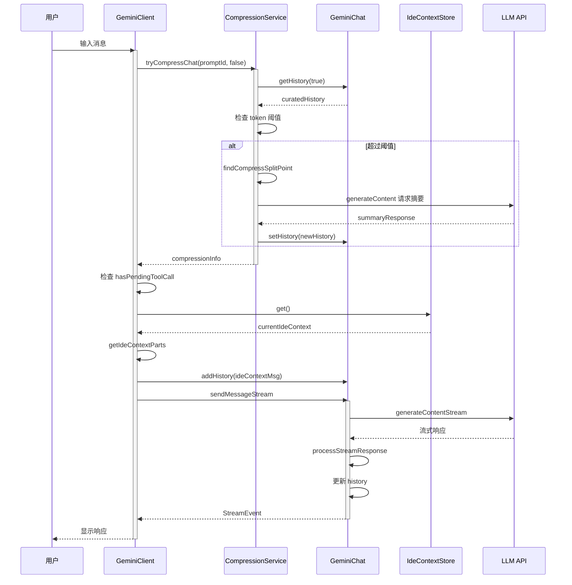

**协作要点**：

1. **压缩前置**：在发送消息前执行压缩，确保不超限
2. **IDE 同步**：压缩后注入 IDE 上下文，保持编辑器状态同步
3. **API 约束**：检查 pending tool call，避免破坏 functionCall/functionResponse 配对
4. **流式处理**：标准流式 LLM 调用，实时返回响应

---

### 3.5 关键数据路径

#### 主路径（正常流程）

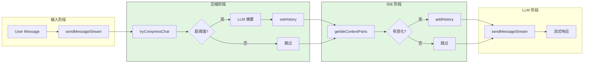

#### 异常路径（压缩失败）

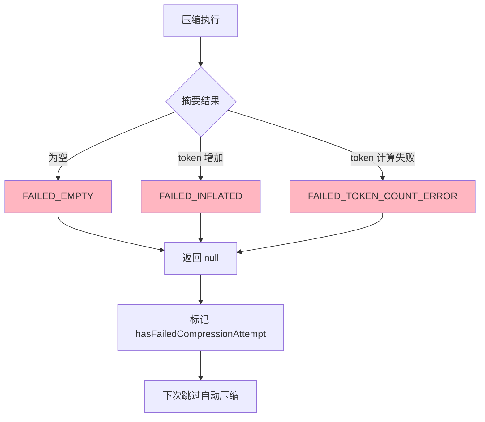

---

## 4. 端到端数据流转

### 4.1 正常流程（详细版）

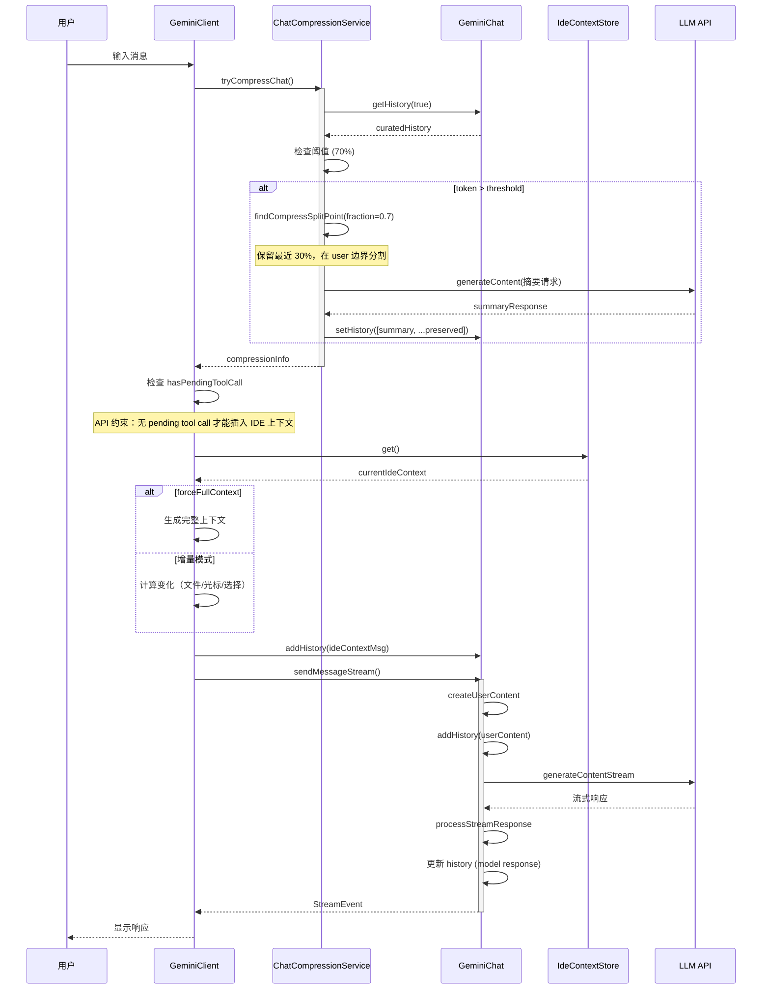

**数据变换详情**：

| 阶段 | 输入 | 处理 | 输出 | 代码位置 |
|-----|------|------|------|---------|
| 压缩检查 | curatedHistory | 阈值比较 | 是否压缩 | `chatCompressionService.ts:111` |
| 分割计算 | contents, 0.7 | 字符计数 + user 边界 | splitPoint | `chatCompressionService.ts:127` |
| 摘要生成 | historyToCompress | LLM 调用 | summary | `chatCompressionService.ts:146` |
| 历史重建 | summary + preserved | 数组拼接 | newHistory | `chatCompressionService.ts:189` |
| IDE 上下文 | IdeContext | 完整/增量生成 | contextParts | `client.ts:211` |
| 流式响应 | chunks | 合并 + 验证 | model content | `geminiChat.ts:551` |

### 4.2 数据流向图

```mermaid
flowchart LR
    subgraph Input["输入"]
        I1[User Message]
        I2[IDE Context]
    end

    subgraph Processing["处理层"]
        P1[Compression Service]
        P2[GeminiChat]
        P3[IDE Context Integration]
    end

    subgraph Storage["存储层"]
        S1[history: Content[]]
        S2[lastSentIdeContext]
    end

    subgraph Output["输出"]
        O1[LLM Prompt]
        O2[Stream Response]
    end

    I1 --> P1
    I2 --> P3
    P1 --> P2
    P3 --> P2
    P2 --> S1
    P3 --> S2
    S1 --> O1
    O1 --> O2
```

### 4.3 异常/边界流程

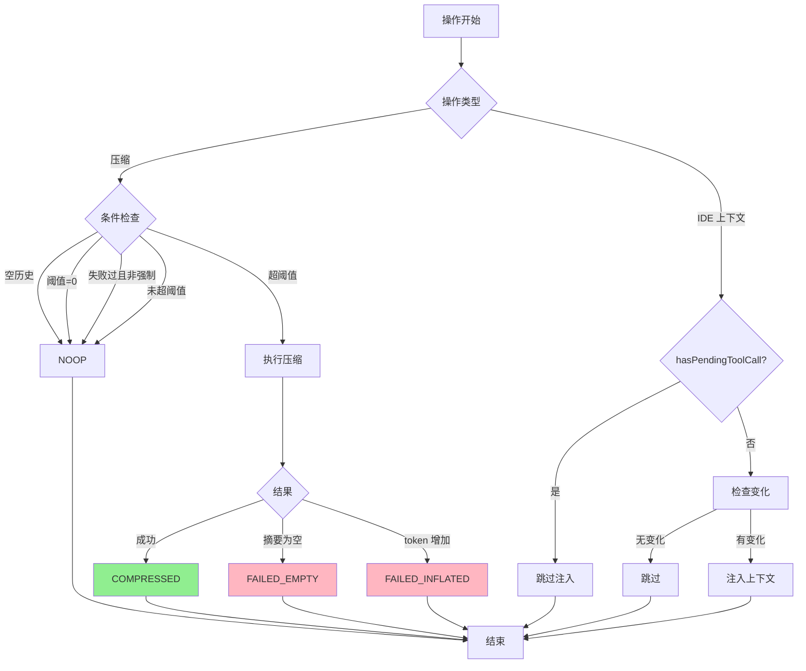

---

## 5. 关键代码实现

### 5.1 核心数据结构

```typescript
// packages/core/src/core/geminiChat.ts:214-233
export class GeminiChat {
  private history: Content[] = [];
  private sendPromise: Promise<void> = Promise.resolve();

  constructor(
    private readonly config: Config,
    private readonly generationConfig: GenerateContentConfig = {},
    private history: Content[] = [],
    private readonly chatRecordingService?: ChatRecordingService,
  ) {
    validateHistory(history);
  }
}

// packages/core/src/services/chatCompressionService.ts:18-28
export const COMPRESSION_TOKEN_THRESHOLD = 0.7;
export const COMPRESSION_PRESERVE_THRESHOLD = 0.3;

// packages/core/src/core/client.ts:78-92
export class GeminiClient {
  private chat?: GeminiChat;
  private lastSentIdeContext: IdeContext | undefined;
  private forceFullIdeContext = true;
  private hasFailedCompressionAttempt = false;
}
```

**字段说明**：

| 字段 | 类型 | 用途 |
|-----|------|------|
| `history` | `Content[]` | API 格式的对话历史 |
| `sendPromise` | `Promise<void>` | 流式请求同步锁 |
| `COMPRESSION_TOKEN_THRESHOLD` | `number` | 压缩触发阈值 (0.7) |
| `COMPRESSION_PRESERVE_THRESHOLD` | `number` | 保留历史比例 (0.3) |
| `lastSentIdeContext` | `IdeContext \| undefined` | 上次发送的 IDE 状态 |
| `forceFullIdeContext` | `boolean` | 是否强制发送完整上下文 |
| `hasFailedCompressionAttempt` | `boolean` | 是否有过失败的压缩尝试 |

### 5.2 主链路代码

```typescript
// packages/core/src/services/chatCompressionService.ts:79-145
async compress(
  chat: GeminiChat,
  promptId: string,
  force: boolean,
  model: string,
  config: Config,
  hasFailedCompressionAttempt: boolean,
): Promise<{ newHistory: Content[] | null; info: ChatCompressionInfo }> {
  const curatedHistory = chat.getHistory(true);
  const threshold =
    config.getChatCompression()?.contextPercentageThreshold ??
    COMPRESSION_TOKEN_THRESHOLD;

  // 边界检查：空历史、禁用压缩、失败过且非强制
  if (
    curatedHistory.length === 0 ||
    threshold <= 0 ||
    (hasFailedCompressionAttempt && !force)
  ) {
    return {
      newHistory: null,
      info: {
        originalTokenCount: 0,
        newTokenCount: 0,
        compressionStatus: CompressionStatus.NOOP,
      },
    };
  }

  const originalTokenCount = uiTelemetryService.getLastPromptTokenCount();

  // 检查是否超过阈值
  if (!force) {
    const contextLimit =
      config.getContentGeneratorConfig()?.contextWindowSize ??
      DEFAULT_TOKEN_LIMIT;
    if (originalTokenCount < threshold * contextLimit) {
      return {
        newHistory: null,
        info: {
          originalTokenCount,
          newTokenCount: originalTokenCount,
          compressionStatus: CompressionStatus.NOOP,
        },
      };
    }
  }

  // 计算分割点并压缩
  const splitPoint = findCompressSplitPoint(
    curatedHistory,
    1 - COMPRESSION_PRESERVE_THRESHOLD,
  );
  // ... 摘要生成和历史重建
}
```

**代码要点**：

1. **多层边界检查**：空历史、禁用、失败标记、阈值检查
2. **Token 来源**：使用 uiTelemetryService 记录的最后一次 prompt token 数
3. **分割策略**：保留 30%，在 user message 边界分割
4. **失败标记**：非强制压缩失败时标记，避免重复失败

### 5.3 关键调用链

```text
Agent Loop
  -> GeminiClient.sendMessageStream()     [client.ts:403]
    -> GeminiClient.tryCompressChat()      [client.ts:434]
      -> ChatCompressionService.compress() [chatCompressionService.ts:79]
        -> GeminiChat.getHistory(true)     [geminiChat.ts:453]
        -> findCompressSplitPoint()        [chatCompressionService.ts:36]
        -> ContentGenerator.generateContent() [摘要生成]
        -> GeminiChat.setHistory()         [geminiChat.ts:476]
    -> GeminiClient.getIdeContextParts()   [client.ts:211]
      -> IdeContextStore.get()             [ide/ideContext.ts:100]
    -> GeminiChat.addHistory()             [geminiChat.ts:472]
    -> GeminiChat.sendMessageStream()      [geminiChat.ts:263]
      -> createUserContent()
      -> generateContentStream()           [LLM API]
      -> processStreamResponse()           [geminiChat.ts:551]
```

---

## 6. 设计意图与 Trade-off

### 6.1 Qwen Code 的选择

| 维度 | Qwen Code 的选择 | 替代方案 | 取舍分析 |
|-----|-----------------|---------|---------|
| 压缩触发 | 70% 阈值自动触发 | 固定步数触发 (Kimi) / 惰性触发 (Codex) | 提前预防超限，但可能过早压缩 |
| 分割策略 | 保留 30% + user 边界 | 简单截断 / 保留 N 条 (Kimi) | 保持对话结构完整，但分割点选择有限 |
| IDE 同步 | 增量更新 + API 约束检查 | 每次完整发送 / 无 IDE 同步 | 减少 token 消耗，但逻辑复杂 |
| 失败处理 | 标记失败避免重复 | 重试机制 | 避免无效压缩开销，但可能错过有效压缩时机 |
| 历史格式 | API Content 数组 | 自定义格式 (Kimi JSONL) | 与 LLM API 直接兼容，但灵活性较低 |
| 思考清理 | 完全移除 thought parts | 保留思考 | 减少 token，但丢失推理过程 |

### 6.2 为什么这样设计？

**核心问题**：如何在有限的上下文窗口内支持长对话，同时保持与 IDE 的实时同步？

**Qwen Code 的解决方案**：
- 代码依据：`chatCompressionService.ts:79` 的自动压缩逻辑
- 设计意图：通过预定义阈值主动压缩，避免突然超限
- 带来的好处：
  - 提前预防 token 超限，对话更流畅
  - 保留最近 30% 确保上下文连续性
  - 增量 IDE 同步减少 token 消耗
  - 遵守 API 约束，避免请求失败
- 付出的代价：
  - 压缩时机固定，可能不是最优
  - 增量同步逻辑复杂，需要维护 lastSentIdeContext
  - 压缩失败后会跳过自动压缩

### 6.3 与其他项目的对比

```mermaid
flowchart TD
    subgraph Qwen["Qwen Code"]
        Q1[70% 阈值自动压缩] --> Q2[保留 30% + 摘要]
        Q2 --> Q3[IDE 增量同步]
        Q3 --> Q4[API 约束感知]
    end

    subgraph Gemini["Gemini CLI"]
        G1[分层记忆 Global/Extension/Project] --> G2[双向文件发现]
        G2 --> G3[JIT 动态加载]
        G3 --> G4[两阶段验证压缩]
    end

    subgraph Kimi["Kimi CLI"]
        K1[JSONL 持久化] --> K2[Checkpoint 标记]
        K2 --> K3[D-Mail 时间旅行]
        K3 --> K4[文件轮换备份]
    end

    subgraph Codex["Codex"]
        C1[内存完整存储] --> C2[惰性压缩]
        C2 --> C3[渐进式移除]
        C3 --> C4[Compaction 项替换]
    end

    style Qwen fill:#e1f5e1
    style Gemini fill:#e1e1f5
    style Kimi fill:#ffe1e1
    style Codex fill:#fff5e1
```

| 项目 | 内存层次 | 压缩策略 | IDE 集成 | 回滚能力 | 适用场景 |
|-----|---------|---------|---------|---------|---------|
| **Qwen Code** | API Content 数组 | 70% 阈值 + 保留 30% | 增量同步 | 无 | IDE 集成场景、需要实时上下文 |
| **Gemini CLI** | 三层分层（Global/Extension/Project） | 两阶段验证压缩 | 无 | 无 | 多项目、需要精细记忆管理 |
| **Kimi CLI** | JSONL 文件 | 保留 N 条 + LLM 摘要 | 无 | Checkpoint + D-Mail | 需要精确状态恢复、时间旅行 |
| **Codex** | 内存 Vec<ResponseItem> | 惰性触发 + 渐进移除 | 无 | 无 | 通用场景、平衡性能与精度 |

**核心差异分析**：

| 对比维度 | Qwen Code | Gemini CLI | Kimi CLI | Codex |
|---------|-----------|-----------|----------|-------|
| **压缩触发** | 70% 阈值 | 两阶段验证 | 固定步数检查 | 惰性触发 |
| **保留策略** | 30% 完整历史 | 分层保留 | 最近 N 条 | 渐进移除 |
| **IDE 集成** | 增量同步 | 无 | 无 | 无 |
| **API 约束** | 感知并遵守 | N/A | N/A | 规范化处理 |
| **持久化** | 无（内存） | 无（每次发现） | JSONL 文件 | JSON Lines Rollout |
| **回滚能力** | 无 | 无 | Checkpoint + D-Mail | 无 |
| **思考处理** | 完全移除 | 保留 | 保留 | 保留 |

**选择建议**：

- **Qwen Code**：适合需要与 IDE 实时同步、在编辑器环境中使用的场景
- **Gemini CLI**：适合在多个项目间切换，需要复杂记忆管理的场景
- **Kimi CLI**：适合需要精确控制对话历史、经常需要回滚的用户
- **Codex**：适合追求简单高效，不需要复杂记忆管理的通用场景

---

## 7. 边界情况与错误处理

### 7.1 终止条件

| 终止原因 | 触发条件 | 代码位置 |
|---------|---------|---------|
| 空历史 | curatedHistory.length === 0 | `chatCompressionService.ts:93` |
| 压缩禁用 | threshold <= 0 | `chatCompressionService.ts:95` |
| 失败过且非强制 | hasFailedCompressionAttempt && !force | `chatCompressionService.ts:96` |
| 未超阈值 | originalTokenCount < threshold * limit | `chatCompressionService.ts:115` |
| 摘要为空 | summary.trim().length === 0 | `chatCompressionService.ts:167` |
| 压缩反增 | newTokenCount > originalTokenCount | `chatCompressionService.ts:182` |
| Token 计算失败 | 无法获取 usageMetadata | `chatCompressionService.ts:177` |
| IDE 上下文跳过 | hasPendingToolCall | `client.ts:468` |

### 7.2 资源限制

```typescript
// packages/core/src/core/constants.ts
export const IDE_MAX_OPEN_FILES = 10;
export const IDE_MAX_SELECTED_TEXT_LENGTH = 2000;

// packages/core/src/services/chatCompressionService.ts:22
export const COMPRESSION_TOKEN_THRESHOLD = 0.7;

// packages/core/src/services/chatCompressionService.ts:28
export const COMPRESSION_PRESERVE_THRESHOLD = 0.3;

// packages/core/src/core/client.ts:76
const MAX_TURNS = 100;
```

### 7.3 错误恢复策略

| 错误类型 | 处理策略 | 代码位置 |
|---------|---------|---------|
| 压缩摘要为空 | 返回 null，标记失败 | `chatCompressionService.ts:233` |
| 压缩 token 增加 | 返回 null，标记失败 | `chatCompressionService.ts:243` |
| Token 计算失败 | 返回 null，标记失败 | `chatCompressionService.ts:252` |
| 有 pending tool call | 跳过 IDE 上下文注入 | `client.ts:473` |
| 流式响应无效 | 重试或抛出 InvalidStreamError | `geminiChat.ts:657` |

---

## 8. 关键代码索引

| 功能 | 文件 | 行号 | 说明 |
|-----|------|------|------|
| GeminiChat 类 | `packages/core/src/core/geminiChat.ts` | 214 | 对话历史管理核心 |
| addHistory | `packages/core/src/core/geminiChat.ts` | 472 | 添加历史记录 |
| getHistory | `packages/core/src/core/geminiChat.ts` | 453 | 获取历史（支持 curated） |
| setHistory | `packages/core/src/core/geminiChat.ts` | 476 | 设置历史（压缩后重建） |
| stripThoughtsFromHistory | `packages/core/src/core/geminiChat.ts` | 480 | 清理思考内容 |
| ChatCompressionService | `packages/core/src/services/chatCompressionService.ts` | 78 | 压缩服务 |
| compress | `packages/core/src/services/chatCompressionService.ts` | 79 | 主压缩方法 |
| findCompressSplitPoint | `packages/core/src/services/chatCompressionService.ts` | 36 | 计算分割点 |
| COMPRESSION_TOKEN_THRESHOLD | `packages/core/src/services/chatCompressionService.ts` | 22 | 压缩阈值常量 |
| GeminiClient | `packages/core/src/core/client.ts` | 78 | 客户端核心 |
| sendMessageStream | `packages/core/src/core/client.ts` | 403 | 流式发送入口 |
| tryCompressChat | `packages/core/src/core/client.ts` | 630 | 压缩检查入口 |
| getIdeContextParts | `packages/core/src/core/client.ts` | 211 | IDE 上下文生成 |
| IdeContextStore | `packages/core/src/ide/ideContext.ts` | 15 | IDE 状态存储 |
| tokenLimits | `packages/core/src/core/tokenLimits.ts` | 11 | Token 限制定义 |
| DEFAULT_TOKEN_LIMIT | `packages/core/src/core/tokenLimits.ts` | 11 | 默认 128K 限制 |

---

## 9. 延伸阅读

- 前置知识：`04-qwen-code-agent-loop.md`（Agent Loop 如何使用 Memory Context）
- 相关机制：`06-qwen-code-mcp-integration.md`（MCP 工具调用与历史管理）
- 跨项目对比：
  - `docs/gemini-cli/07-gemini-cli-memory-context.md`（分层记忆）
  - `docs/kimi-cli/07-kimi-cli-memory-context.md`（Checkpoint 回滚）
  - `docs/codex/07-codex-memory-context.md`（惰性压缩）

---

*✅ Verified: 基于 qwen-code/packages/core/src/core/geminiChat.ts、services/chatCompressionService.ts、core/client.ts、ide/ideContext.ts 源码分析*
*基于版本：2026-02-08 | 最后更新：2026-02-24*
