> **阅读指南**
>
> | 属性 | 说明 |
> |-----|------|
> | 预计阅读 | 20-30 分钟 |
> | 前置文档 | `02-qwen-code-cli-entry.md`、`04-qwen-code-agent-loop.md` |
> | 文档结构 | 速览 → 架构 → 机制 → 实现 → 对比 |
> | 代码呈现 | 关键代码直接展示，完整代码可折叠查看 |

---

# UI 交互（Qwen Code）

## TL;DR（结论先行）

一句话定义：Qwen Code 的 UI 交互是**基于 Ink.js + React 的终端渲染系统**，通过多层 Context Provider 实现状态管理，支持流式消息渲染、Vim 模式、Kitty 键盘协议等高级终端特性。

Qwen Code 的核心取舍：**React 组件化 + Context 依赖注入**（对比 Codex 的 Ratatui、Kimi CLI 的 Wire 协议解耦）

### 核心要点速览

| 维度 | 关键决策 | 代码位置 |
|-----|---------|---------|
| 渲染框架 | Ink.js + React 组件化 | `packages/cli/src/gemini.tsx:179` |
| 状态管理 | Context Provider 依赖注入 | `packages/cli/src/ui/contexts/KeypressContext.tsx:82` |
| 键盘处理 | Kitty 协议 + 自定义解析 | `packages/cli/src/ui/contexts/KeypressContext.tsx:150` |
| 输入编辑 | TextBuffer 类管理光标和文本 | `packages/cli/src/ui/components/InputPrompt.tsx:386` |
| 流式渲染 | Static 组件优化性能 | `packages/cli/src/ui/components/MainContent.tsx:23` |
| 主题系统 | themeManager 全局管理 | `packages/cli/src/ui/themes/theme-manager.ts` |

---

## 1. 为什么需要这个机制？（解决什么问题）

### 1.1 问题场景

没有 UI 交互系统：
```
纯文本输出 → 无流式渲染 → 用户体验差
硬编码状态管理 → 组件耦合 → 难以扩展
基础键盘输入 → 不支持 Vim 键位 → 效率低
固定主题 → 无法个性化 → 视觉疲劳
```

有 UI 交互系统：
```
Ink.js 渲染 → React 组件模型 → 熟悉的开发体验
Context Provider → 依赖注入 → 状态解耦
KeypressProvider → Kitty 协议 + Vim 模式 → 高级交互
themeManager → 自定义主题 → 个性化体验
```

### 1.2 核心挑战

| 挑战 | 不解决的后果 |
|-----|-------------|
| 终端兼容性 | 不同终端显示异常，特殊按键无法识别 |
| 流式渲染性能 | 消息闪烁，CPU 占用高 |
| 状态管理复杂度 | 组件间数据传递混乱，难以维护 |
| 键盘输入处理 | 特殊按键、组合键、粘贴操作异常 |
| 主题动态切换 | 需要重启才能生效 |
| 可访问性支持 | 屏幕阅读器用户无法使用 |

---

## 2. 整体架构（ASCII 图）

### 2.1 在系统中的位置

```text
┌─────────────────────────────────────────────────────────────┐
│ CLI Entry / Session Runtime                                  │
│ qwen-code/packages/cli/src/gemini.tsx:139                    │
│ - startInteractiveUI() 启动交互式 UI                         │
└───────────────────────┬─────────────────────────────────────┘
                        │ render()
                        ▼
┌─────────────────────────────────────────────────────────────┐
│ ▓▓▓ Context Provider 层 ▓▓▓                                 │
│ qwen-code/packages/cli/src/ui/contexts/                      │
│ - SettingsContext.Provider    : 全局设置共享                 │
│ - KeypressProvider            : 键盘事件处理                 │
│ - SessionStatsProvider        : 会话统计                   │
│ - VimModeProvider             : Vim 模式状态               │
└───────────────────────┬─────────────────────────────────────┘
                        │ children
                        ▼
┌─────────────────────────────────────────────────────────────┐
│ ▓▓▓ 应用容器层 ▓▓▓                                          │
│ qwen-code/packages/cli/src/ui/AppContainer.tsx               │
│ - AppContainer : 主应用容器，管理全局状态                    │
│ - App          : 根组件，选择布局模式                        │
└───────────────────────┬─────────────────────────────────────┘
                        │
        ┌───────────────┼───────────────┐
        ▼               ▼               ▼
┌──────────────┐ ┌──────────────┐ ┌──────────────┐
│ DefaultAppLayout            │ ScreenReaderAppLayout        │
│ (默认布局)    │ (屏幕阅读器模式)              │
│ - MainContent │ - 简化渲染    │
│ - Composer    │ - 无障碍优化  │
└──────────────┘ └──────────────┘
```

### 2.2 核心组件职责

| 组件 | 职责 | 代码位置 |
|-----|------|---------|
| `KeypressProvider` | 键盘事件处理，支持 Kitty 协议 | `qwen-code/packages/cli/src/ui/contexts/KeypressContext.tsx:82` |
| `SettingsContext` | 全局设置共享 | `qwen-code/packages/cli/src/ui/contexts/SettingsContext.tsx:10` |
| `SessionStatsProvider` | 会话统计和指标追踪 | `qwen-code/packages/cli/src/ui/contexts/SessionContext.tsx:192` |
| `VimModeProvider` | Vim 模式状态管理 | `qwen-code/packages/cli/src/ui/contexts/VimModeContext.tsx:28` |
| `AppContainer` | 主应用容器，管理 UI 状态 | `qwen-code/packages/cli/src/ui/AppContainer.tsx:45` |
| `App` | 根组件，选择布局模式 | `qwen-code/packages/cli/src/ui/App.tsx:14` |
| `DefaultAppLayout` | 默认布局组件 | `qwen-code/packages/cli/src/ui/layouts/DefaultAppLayout.tsx:16` |
| `MainContent` | 主内容区（历史消息） | `qwen-code/packages/cli/src/ui/components/MainContent.tsx:23` |
| `Composer` | 输入组合器 | `qwen-code/packages/cli/src/ui/components/Composer.tsx:23` |
| `InputPrompt` | 输入提示组件 | `qwen-code/packages/cli/src/ui/components/InputPrompt.tsx:97` |

### 2.3 核心组件交互关系

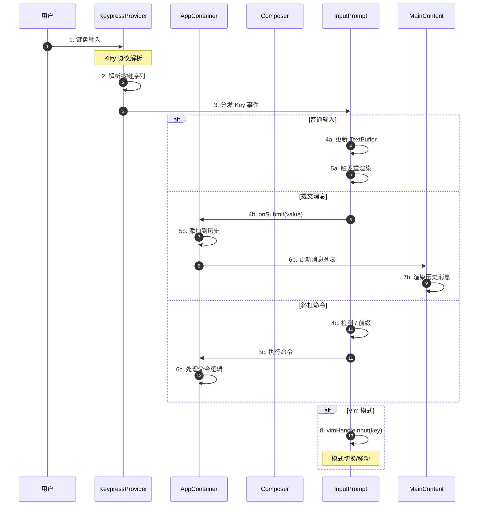

**关键交互说明**：

| 步骤 | 交互内容 | 设计意图 |
|-----|---------|---------|
| 1-3 | 键盘事件捕获与解析 | 统一入口处理所有按键，支持 Kitty 协议 |
| 4-5 | 普通输入处理 | TextBuffer 管理光标和文本状态 |
| 6-7 | 消息提交 | 解耦输入与历史管理，触发 Agent Loop |
| 8 | Vim 模式 | 支持高级编辑键位，提升效率 |

---

## 3. 核心组件详细分析

### 3.1 KeypressProvider 内部结构

#### 职责定位

KeypressProvider 是键盘输入的核心处理组件，负责原始按键数据解析、Kitty 键盘协议支持和事件分发。

#### 状态机图

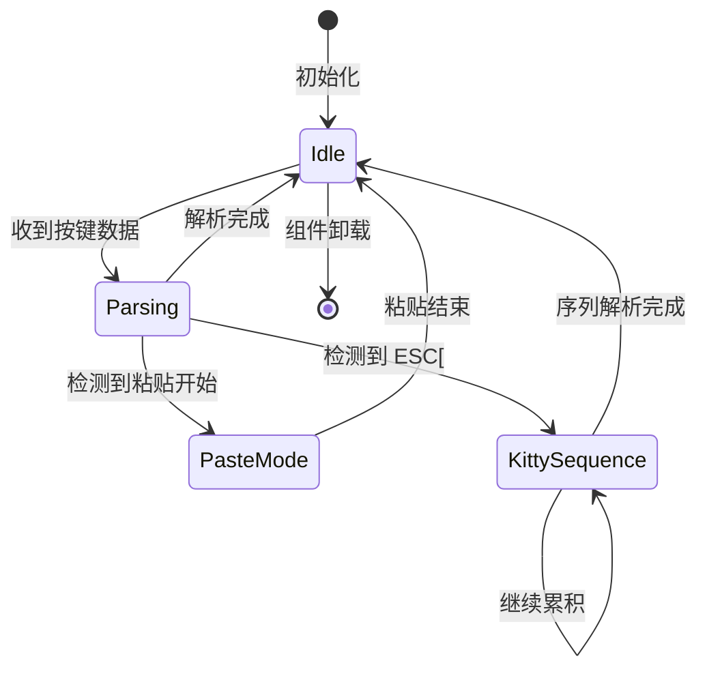

**状态说明**：

| 状态 | 说明 | 进入条件 | 退出条件 |
|-----|------|---------|---------|
| Idle | 等待输入 | 初始化完成 | 收到按键数据 |
| Parsing | 解析按键 | 收到原始数据 | 解析完成 |
| PasteMode | 粘贴模式 | 检测到 paste-start | 检测到 paste-end |
| KittySequence | Kitty 序列 | 检测到 ESC[ | 序列完整或超时 |

#### 内部数据流

```text
┌─────────────────────────────────────────────────────────────┐
│  原始输入层                                                  │
│  ├── stdin.on('data')                                       │
│  ├── 原始 Buffer 累积                                       │
│  └── 粘贴模式检测                                           │
└──────────────────────────┬──────────────────────────────────┘
                           ▼
┌─────────────────────────────────────────────────────────────┐
│  协议解析层                                                  │
│  ├── Legacy 功能键 (ESC[A/B/C/D/H/F])                       │
│  ├── Parameterized 功能键 (ESC[1;modsX)                    │
│  ├── CSI-u 格式 (ESC[code;modsu/~)                         │
│  └── Kitty 扩展序列                                         │
└──────────────────────────┬──────────────────────────────────┘
                           ▼
┌─────────────────────────────────────────────────────────────┐
│  事件分发层                                                  │
│  ├── 解析为 Key 对象                                        │
│  │   ├── name, ctrl, meta, shift                           │
│  │   ├── sequence (原始序列)                               │
│  │   └── kittyProtocol (标记)                              │
│  └── 广播给所有订阅者                                       │
└─────────────────────────────────────────────────────────────┘
```

#### 关键算法逻辑

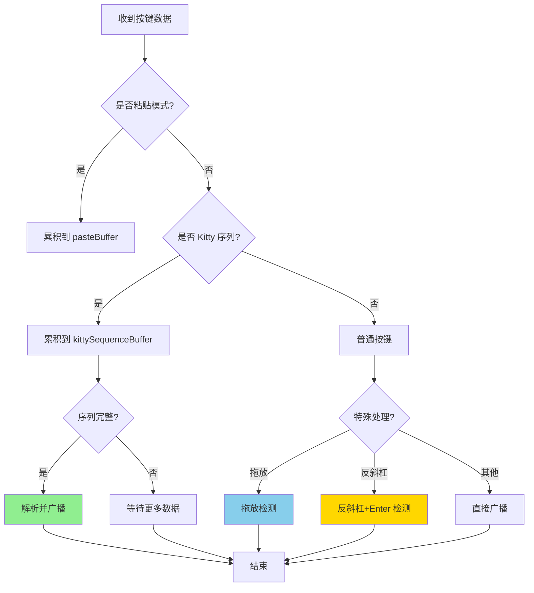

**算法要点**：

1. **分层解析**：先检测粘贴模式，再检测 Kitty 序列，最后作为普通按键
2. **序列累积**：不完整的 Kitty 序列保留在 buffer 中等待后续数据
3. **拖放检测**：引号开头的输入触发拖放模式，100ms 超时完成
4. **反斜杠处理**：检测 `\` + Enter 组合转换为 Shift+Enter

#### 关键接口

| 接口 | 输入 | 输出 | 说明 | 代码位置 |
|-----|------|------|------|---------|
| `subscribe()` | `KeypressHandler` | - | 订阅按键事件 | `KeypressContext.tsx:101` |
| `unsubscribe()` | `KeypressHandler` | - | 取消订阅 | `KeypressContext.tsx:108` |
| `parseKittyPrefix()` | `string` | `{key, length}\|null` | 解析 Kitty 序列 | `KeypressContext.tsx:150` |
| `broadcast()` | `Key` | - | 广播给订阅者 | `KeypressContext.tsx:387` |

---

### 3.2 AppContainer 内部结构

#### 职责定位

AppContainer 是应用的核心状态容器，管理历史消息、流式状态、对话框状态等全局 UI 状态。

#### 状态机图

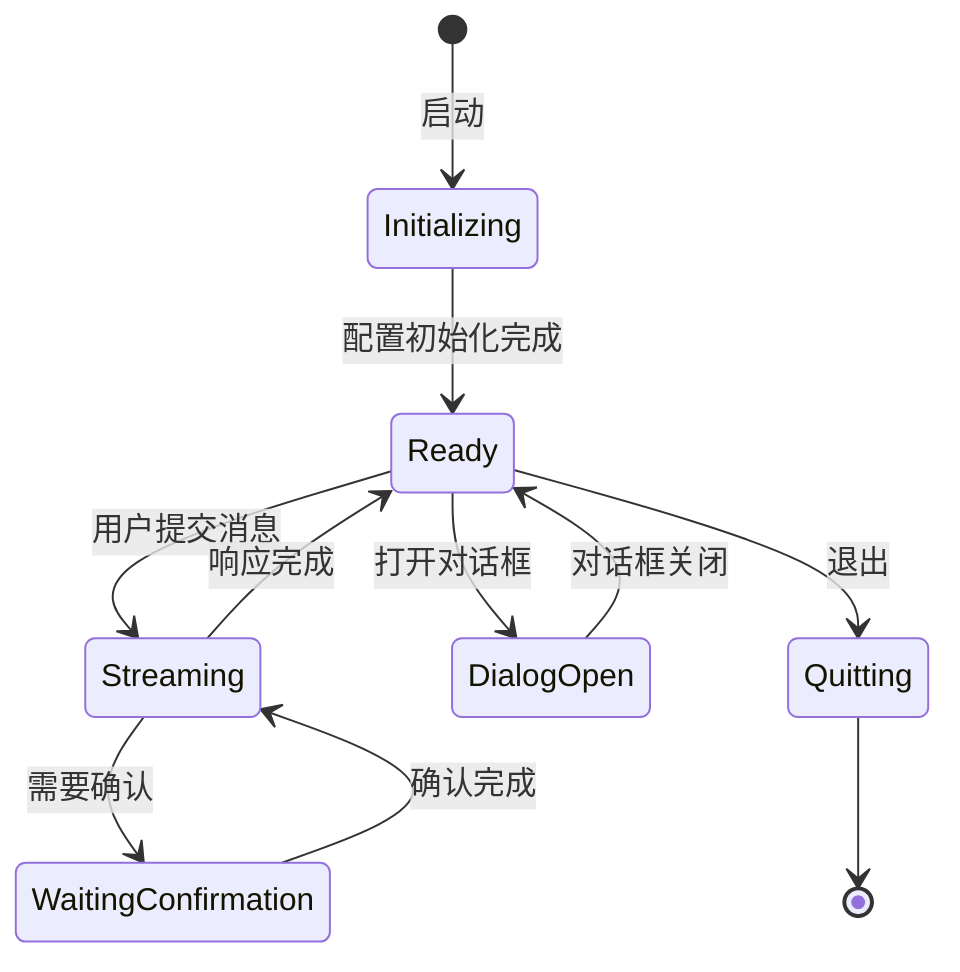

**状态说明**：

| 状态 | 说明 | 进入条件 | 退出条件 |
|-----|------|---------|---------|
| Initializing | 初始化中 | 组件挂载 | config 初始化完成 |
| Ready | 就绪 | 初始化完成 | 用户提交消息 |
| Streaming | 流式响应中 | 提交消息 | 响应完成 |
| WaitingConfirmation | 等待确认 | 需要审批 | 用户响应 |
| DialogOpen | 对话框打开 | 用户操作 | 对话框关闭 |
| Quitting | 退出中 | 用户退出 | 清理完成 |

#### 内部数据流

```text
┌─────────────────────────────────────────────────────────────┐
│  状态管理层                                                  │
│  ├── history: HistoryItem[]                                 │
│  ├── streamingState: StreamingState                         │
│  ├── pendingHistoryItems: HistoryItemWithoutId[]           │
│  └── 各种对话框状态 (isAuthDialogOpen, etc.)               │
└──────────────────────────┬──────────────────────────────────┘
                           ▼
┌─────────────────────────────────────────────────────────────┐
│  动作处理层                                                  │
│  ├── handleSubmit()    : 处理用户输入                       │
│  ├── handleClearScreen(): 清屏                              │
│  ├── 命令处理 (/help, /clear, etc.)                        │
│  └── 流式消息处理                                           │
└──────────────────────────┬──────────────────────────────────┘
                           ▼
┌─────────────────────────────────────────────────────────────┐
│  渲染输出层                                                  │
│  ├── MainContent: 历史消息显示                              │
│  ├── Composer: 输入区域                                     │
│  └── DialogManager: 对话框管理                              │
└─────────────────────────────────────────────────────────────┘
```

#### 关键代码

```typescript
// qwen-code/packages/cli/src/ui/AppContainer.tsx:45-120
export function AppContainer({
  config,
  settings,
  startupWarnings,
  version,
  initializationResult,
}: AppContainerProps) {
  // 核心状态
  const { history, addItem, updateItem, clearItems, loadHistory } = useHistory();
  const [streamingState, setStreamingState] = useState<StreamingState>(
    StreamingState.Idle,
  );
  const [pendingHistoryItems, setPendingHistoryItems] = useState<
    HistoryItemWithoutId[]
  >([]);

  // 处理用户提交
  const handleSubmit = useCallback(
    async (inputValue: string) => {
      // 添加到历史
      const userItem: HistoryItemWithoutId = {
        type: 'user',
        text: inputValue,
        timestamp: Date.now(),
      };
      addItem(userItem, Date.now());

      // 发送给 Agent
      await submitQuery(inputValue);
    },
    [addItem, submitQuery],
  );

  // 流式消息处理
  const handleStreamingEvent = useCallback(
    (event: StreamingEvent) => {
      switch (event.type) {
        case 'content':
          // 追加内容到当前消息
          appendToCurrentMessage(event.value);
          break;
        case 'toolCall':
          // 显示工具调用
          addToolCall(event.value);
          break;
        case 'finished':
          // 完成当前消息
          finalizeCurrentMessage();
          break;
      }
    },
    [appendToCurrentMessage, addToolCall, finalizeCurrentMessage],
  );
}
```

**代码要点**：

1. **状态集中管理**：所有 UI 状态集中在 AppContainer 管理
2. **useHistory Hook**：封装历史消息逻辑，支持添加、更新、加载
3. **流式事件处理**：通过事件类型分发处理不同消息
4. **Callback 优化**：使用 useCallback 避免不必要的重渲染

---

### 3.3 InputPrompt 内部结构

#### 职责定位

InputPrompt 是用户输入的核心组件，处理文本输入、历史导航、自动补全、Vim 模式等。

#### 内部数据流

```text
┌─────────────────────────────────────────────────────────────┐
│  输入处理层                                                  │
│  ├── 键盘事件处理 (useKeypress)                             │
│  ├── Vim 模式处理 (vimHandleInput)                          │
│  ├── 粘贴处理 (大内容占位符)                                │
│  └── 特殊按键 (Ctrl+C, Ctrl+V, etc.)                       │
└──────────────────────────┬──────────────────────────────────┘
                           ▼
┌─────────────────────────────────────────────────────────────┐
│  补全系统层                                                  │
│  ├── 命令补全 (useCommandCompletion)                        │
│  ├── 历史搜索 (useReverseSearchCompletion)                  │
│  ├── 建议显示 (SuggestionsDisplay)                          │
│  └── 文件路径补全                                           │
└──────────────────────────┬──────────────────────────────────┘
                           ▼
┌─────────────────────────────────────────────────────────────┐
│  渲染输出层                                                  │
│  ├── 输入框边框和状态指示                                   │
│  ├── 文本高亮 (命令/文件路径)                               │
│  ├── 光标渲染                                               │
│  └── 建议列表                                               │
└─────────────────────────────────────────────────────────────┘
```

#### 关键算法逻辑

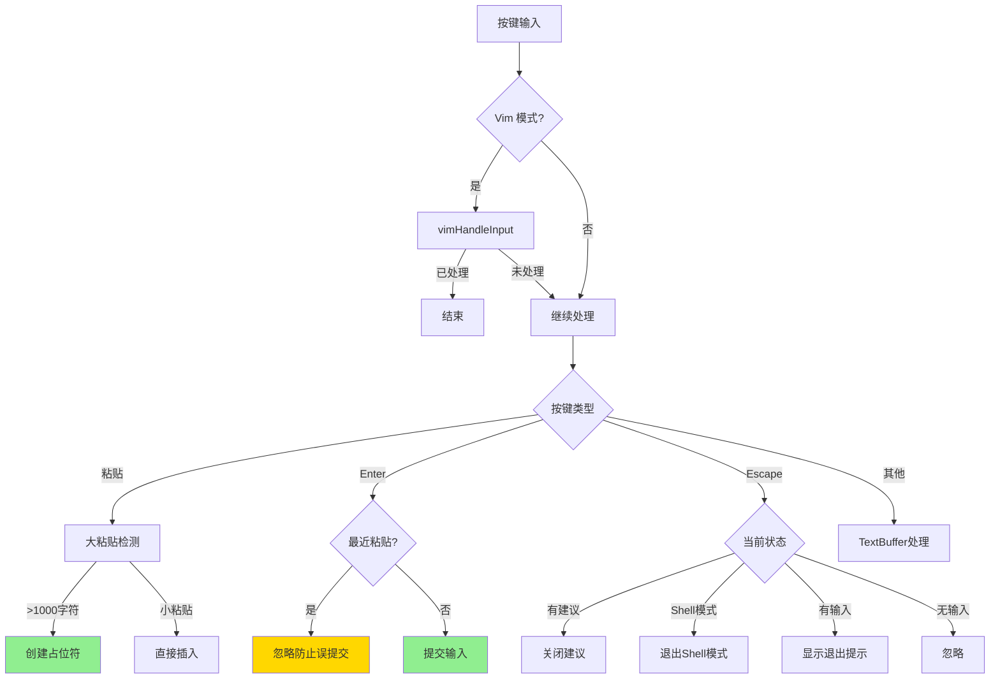

**算法要点**：

1. **大粘贴保护**：超过 1000 字符或 10 行的粘贴显示占位符，避免卡顿
2. **粘贴防误提交**：粘贴后 500ms 内忽略 Enter 键，防止误执行
3. **ESC 分层处理**：根据当前状态决定 ESC 行为（关闭建议/退出模式/清屏提示）
4. **占位符 ID 复用**：相同字符数的占位符复用 ID，支持多个大粘贴

---

### 3.4 组件间协作时序

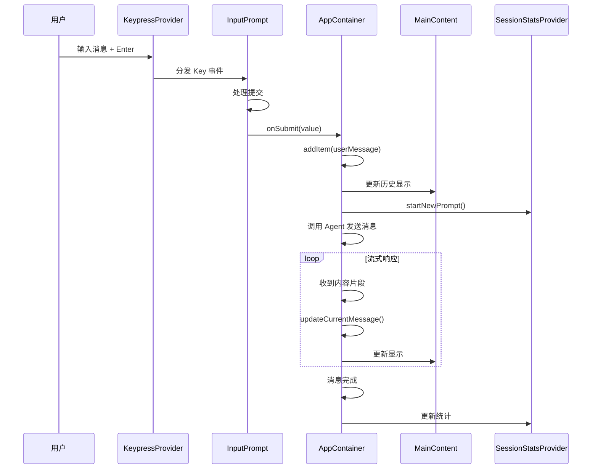

**协作要点**：

1. **按键分发**：KeypressProvider 统一解析后分发给 InputPrompt
2. **提交处理**：InputPrompt 处理提交逻辑，调用 AppContainer 的 onSubmit
3. **历史管理**：AppContainer 使用 useHistory 管理消息历史
4. **统计追踪**：SessionStatsProvider 追踪会话指标

---

### 3.5 关键数据路径

#### 主路径（正常输入流）

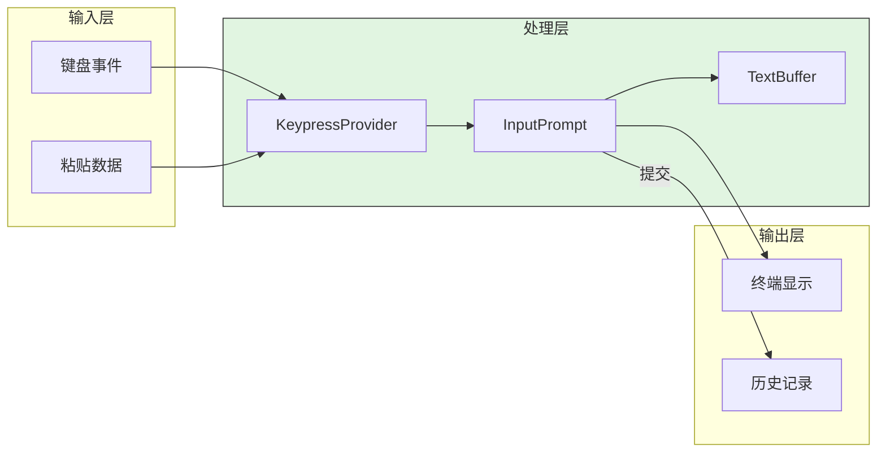

#### 异常路径（粘贴错误恢复）

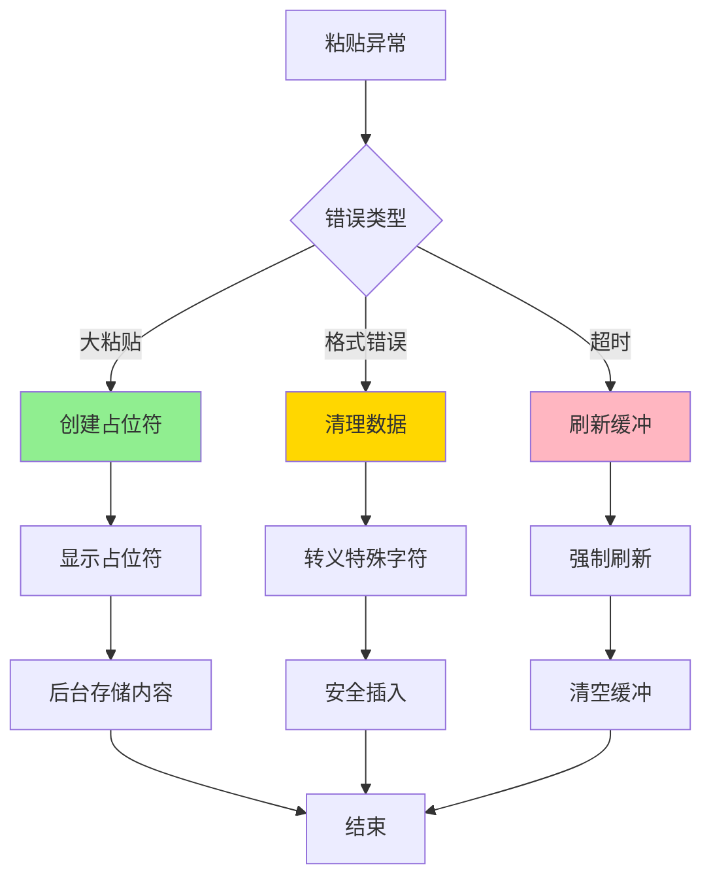

---

## 4. 端到端数据流转

### 4.1 正常流程（详细版）

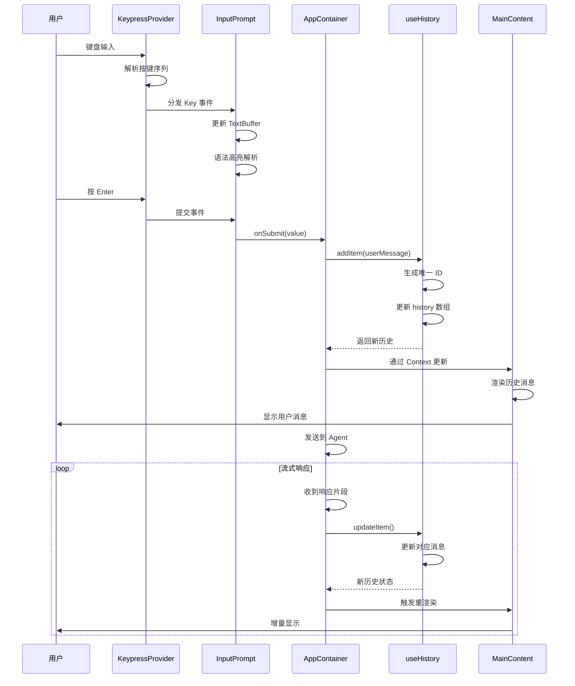

**数据变换详情**：

| 阶段 | 输入 | 处理 | 输出 | 代码位置 |
|-----|------|------|------|---------|
| 按键输入 | 原始按键数据 | Kitty 协议解析 | Key 对象 | `KeypressContext.tsx:150` |
| 文本编辑 | Key 对象 | TextBuffer 更新 | 光标位置 + 文本 | `InputPrompt.tsx:386` |
| 消息提交 | 输入文本 | 验证和格式化 | HistoryItem | `AppContainer.tsx:120` |
| 历史管理 | HistoryItem | ID 生成 + 去重 | HistoryItem[] | `useHistory.ts:47` |
| 消息渲染 | HistoryItem[] | Static 组件渲染 | 终端输出 | `MainContent.tsx:42` |

### 4.2 数据流向图

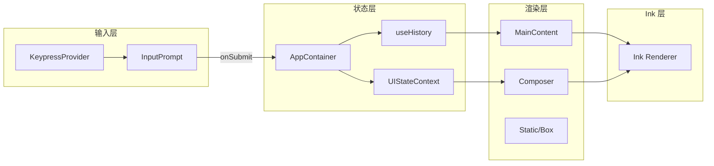

### 4.3 异常/边界流程

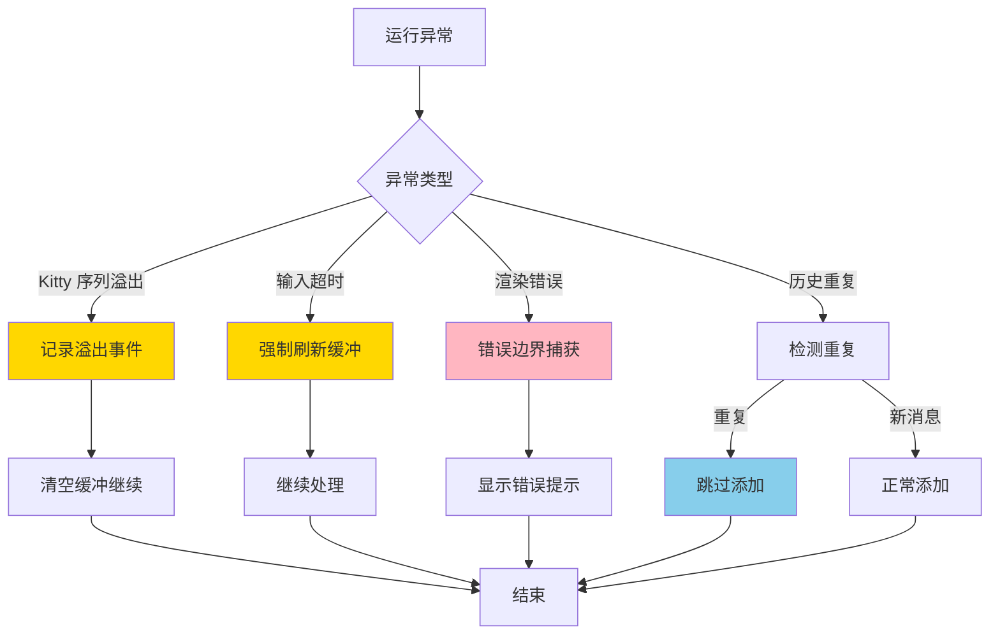

---

## 5. 关键代码实现

### 5.1 核心数据结构

```typescript
// qwen-code/packages/cli/src/ui/types.ts
// 历史消息类型
export interface HistoryItem {
  id: number;
  type: 'user' | 'model' | 'tool' | 'error';
  text: string;
  timestamp: number;
  toolCalls?: ToolCall[];
  thoughts?: ThoughtSummary;
}

// 流式状态
export enum StreamingState {
  Idle = 'idle',
  WaitingForConfirmation = 'waiting_for_confirmation',
  Streaming = 'streaming',
  Thinking = 'thinking',
}

// 按键定义
export interface Key {
  name: string;
  ctrl: boolean;
  meta: boolean;
  shift: boolean;
  paste: boolean;
  sequence: string;
  kittyProtocol?: boolean;
}
```

**字段说明**：

| 字段 | 类型 | 用途 |
|-----|------|------|
| `id` | `number` | 消息唯一标识 |
| `type` | `'user' \| 'model' \| 'tool' \| 'error'` | 消息类型 |
| `streamingState` | `StreamingState` | 当前流式状态 |
| `kittyProtocol` | `boolean` | 是否 Kitty 协议按键 |

### 5.2 主链路代码

```typescript
// qwen-code/packages/cli/src/ui/contexts/KeypressContext.tsx:150-385
const parseKittyPrefix = (buffer: string): { key: Key; length: number } | null => {
  // 1. Reverse Tab (legacy): ESC [ Z
  const revTabLegacy = new RegExp(`^${ESC}\\[Z`);
  let m = buffer.match(revTabLegacy);
  if (m) {
    return {
      key: { name: 'tab', ctrl: false, meta: false, shift: true, ... },
      length: m[0].length,
    };
  }

  // 2. Parameterized functional: ESC [ 1 ; <mods> (A|B|C|D|...)
  const arrowPrefix = new RegExp(`^${ESC}\\[1;(\\d+)([ABCDHFPQSR])`);
  m = buffer.match(arrowPrefix);
  if (m) {
    const bits = parseInt(m[1], 10) - KITTY_MODIFIER_BASE;
    return {
      key: {
        name: symbolToName[m[2]],
        shift: (bits & MODIFIER_SHIFT_BIT) === MODIFIER_SHIFT_BIT,
        alt: (bits & MODIFIER_ALT_BIT) === MODIFIER_ALT_BIT,
        ctrl: (bits & MODIFIER_CTRL_BIT) === MODIFIER_CTRL_BIT,
        ...
      },
      length: m[0].length,
    };
  }

  // 3. CSI-u form: ESC [ <code> ; <mods> (u|~)
  // ... 更多解析逻辑

  return null;
};
```

**代码要点**：

1. **分层解析**：按优先级依次尝试不同格式的解析
2. **修饰键计算**：通过位运算解析 Shift/Alt/Ctrl 状态
3. **长度返回**：返回消耗字符数，支持序列累积
4. **空值处理**：无法解析时返回 null，保留 buffer 等待更多数据

### 5.3 关键调用链

```text
// 键盘输入处理链
stdin.on('data')                    [KeypressContext.tsx:704]
  -> handleRawKeypress()
    -> flushRawBuffer()
      -> keypressStream.write()
        -> handleKeypress()         [KeypressContext.tsx:393]
          -> parseKittyPrefix()     [KeypressContext.tsx:150]
            -> 各种正则匹配
          -> broadcast()
            -> 遍历 subscribers
              -> InputPrompt.handleInput()  [InputPrompt.tsx:386]

// 消息提交流用链
InputPrompt.handleSubmitAndClear()  [InputPrompt.tsx:261]
  -> buffer.setText('')
  -> onSubmit(finalValue)           [AppContainer.tsx]
    -> handleSubmit()
      -> addItem(userMessage)       [useHistory.ts:47]
      -> submitQuery()              [AppContainer.tsx]
        -> geminiClient.sendMessageStream()

// 流式响应处理链
for await (const event of stream)  [AppContainer.tsx]
  -> handleStreamingEvent()
    -> switch(event.type)
      case 'content':
        -> appendToCurrentMessage()
        -> updateItem()             [useHistory.ts:78]
      case 'toolCall':
        -> addToolCall()
      case 'finished':
        -> finalizeCurrentMessage()
```

---

## 6. 设计意图与 Trade-off

### 6.1 Qwen Code 的选择

| 维度 | Qwen Code 的选择 | 替代方案 | 取舍分析 |
|-----|-----------------|---------|---------|
| UI 框架 | Ink.js + React | Ratatui / 纯文本 | 组件化开发，但依赖 Node.js 运行时 |
| 状态管理 | React Context | Redux / Zustand | 简单直观，但深层嵌套有性能问题 |
| 键盘处理 | Kitty 协议 + 自定义解析 | 基础 ANSI | 支持高级特性，但实现复杂 |
| 输入编辑 | TextBuffer 类 | 原生 input | 功能丰富，但代码量大 |
| 渲染优化 | Static 组件 | 全量重渲染 | 性能更好，但实现复杂 |
| 主题系统 | themeManager 全局 | CSS-in-JS | 简单直接，但动态性受限 |

### 6.2 为什么这样设计？

**核心问题**：如何在终端环境下提供现代、响应式的用户界面？

**Qwen Code 的解决方案**：
- 代码依据：`qwen-code/packages/cli/src/gemini.tsx:179` 的 Ink render
- 设计意图：利用 React 的组件化能力和 Ink 的终端渲染能力
- 带来的好处：
  - 开发者熟悉 React 生态，上手快
  - 组件可复用，易于测试
  - Context 实现依赖注入，解耦状态管理
  - 声明式 UI，代码可读性好
- 付出的代价：
  - 需要打包 React 和 Ink，体积较大
  - 终端性能不如原生 TUI 框架
  - 调试需要特殊工具（ink-testing-library）

### 6.3 与其他项目的对比

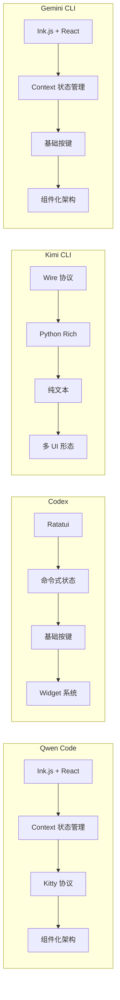

| 项目 | UI 框架 | 核心差异 | 适用场景 |
|-----|---------|---------|---------|
| **Qwen Code** | Ink.js + React | Kitty 协议支持，Vim 模式 | 需要高级终端特性的场景 |
| **Gemini CLI** | Ink.js + React | 类似架构，继承特性 | 复杂交互、多对话框 |
| **Codex** | Ratatui (Rust) | 高性能 TUI，语法高亮 | 代码阅读密集型 |
| **Kimi CLI** | Wire 协议 + Rich | Soul/UI 解耦，远程支持 | 需要多种交互形态 |
| **OpenCode** | Ink.js (React) | 可配置渲染 | 需要自定义样式 |

**核心差异分析**：

1. **架构模式**：
   - Qwen Code / Gemini CLI: React 组件化，Context 状态管理
   - Codex: Rust Widget 系统，命令式状态管理
   - Kimi CLI: Wire 协议解耦，支持多种 UI 形态

2. **键盘输入**：
   - Qwen Code: 完整的 Kitty 协议支持，Vim 模式
   - Gemini CLI: 基础键盘处理
   - Codex: crossterm 跨平台按键
   - Kimi CLI: 标准输入处理

3. **渲染性能**：
   - Codex: Ratatui 最高性能
   - Qwen Code / Gemini CLI: Ink.js 适中
   - Kimi CLI: Rich 库，功能丰富但较慢

---

## 7. 边界情况与错误处理

### 7.1 终止条件

| 终止原因 | 触发条件 | 代码位置 |
|---------|---------|---------|
| 用户退出 | Ctrl+D 或输入 /quit | `InputPrompt.tsx:219` |
| 取消操作 | Ctrl+C | `KeypressContext.tsx:488` |
| Kitty 序列溢出 | 序列长度超过 128 | `KeypressContext.tsx:585` |
| 历史重复 | 连续相同用户消息 | `useHistory.ts:56` |
| 流式超时 | 长时间无响应 | `AppContainer.tsx` |
| 渲染错误 | React 错误边界 | `App.tsx` |

### 7.2 超时/资源限制

```typescript
// qwen-code/packages/cli/src/ui/contexts/KeypressContext.tsx:45
export const DRAG_COMPLETION_TIMEOUT_MS = 100;  // 拖放检测超时
export const MAX_KITTY_SEQUENCE_LENGTH = 128;   // Kitty 序列最大长度
export const BACKSLASH_ENTER_DETECTION_WINDOW_MS = 50;  // 反斜杠检测窗口

// qwen-code/packages/cli/src/ui/components/InputPrompt.tsx:94
const LARGE_PASTE_CHAR_THRESHOLD = 1000;  // 大粘贴字符阈值
const LARGE_PASTE_LINE_THRESHOLD = 10;    // 大粘贴行数阈值
```

### 7.3 错误恢复策略

| 错误类型 | 处理策略 | 代码位置 |
|---------|---------|---------|
| Kitty 序列溢出 | 记录事件，清空缓冲 | `KeypressContext.tsx:592` |
| 粘贴数据损坏 | 转义特殊字符后插入 | `InputPrompt.tsx:412` |
| 历史更新冲突 | 使用函数式更新，避免竞态 | `useHistory.ts:83` |
| 渲染超时 | Static 组件限制最大高度 | `MainContent.tsx:21` |
| 主题加载失败 | 使用默认主题 | `gemini.tsx:237` |

---

## 8. 关键代码索引

| 功能 | 文件 | 行号 | 说明 |
|-----|------|------|------|
| 启动交互式 UI | `packages/cli/src/gemini.tsx` | 139 | `startInteractiveUI()` 函数 |
| Ink render | `packages/cli/src/gemini.tsx` | 179 | 渲染入口 |
| 键盘事件处理 | `packages/cli/src/ui/contexts/KeypressContext.tsx` | 82 | `KeypressProvider` 组件 |
| Kitty 序列解析 | `packages/cli/src/ui/contexts/KeypressContext.tsx` | 150 | `parseKittyPrefix()` 函数 |
| 设置上下文 | `packages/cli/src/ui/contexts/SettingsContext.tsx` | 10 | `SettingsContext` 定义 |
| 会话统计 | `packages/cli/src/ui/contexts/SessionContext.tsx` | 192 | `SessionStatsProvider` 组件 |
| Vim 模式 | `packages/cli/src/ui/contexts/VimModeContext.tsx` | 28 | `VimModeProvider` 组件 |
| 应用容器 | `packages/cli/src/ui/AppContainer.tsx` | 45 | `AppContainer` 组件 |
| 根组件 | `packages/cli/src/ui/App.tsx` | 14 | `App` 组件 |
| 默认布局 | `packages/cli/src/ui/layouts/DefaultAppLayout.tsx` | 16 | `DefaultAppLayout` 组件 |
| 主内容 | `packages/cli/src/ui/components/MainContent.tsx` | 23 | `MainContent` 组件 |
| 输入组合器 | `packages/cli/src/ui/components/Composer.tsx` | 23 | `Composer` 组件 |
| 输入提示 | `packages/cli/src/ui/components/InputPrompt.tsx` | 97 | `InputPrompt` 组件 |
| 历史管理 Hook | `packages/cli/src/ui/hooks/useHistoryManager.ts` | 32 | `useHistory()` Hook |
| 主题管理 | `packages/cli/src/ui/themes/theme-manager.ts` | - | `themeManager` 对象 |

---

## 9. 延伸阅读

- 前置知识：`02-qwen-code-cli-entry.md`、`04-qwen-code-agent-loop.md`
- 相关机制：`06-qwen-code-mcp-integration.md`、`07-qwen-code-memory-context.md`
- 技术文档：[Ink 文档](https://github.com/vadimdemedes/ink)、[React 文档](https://react.dev/)
- 对比文档：
  - `docs/codex/08-codex-ui-interaction.md` - Ratatui TUI 方案
  - `docs/kimi-cli/08-kimi-cli-ui-interaction.md` - Wire 协议方案
  - `docs/gemini-cli/08-gemini-cli-ui-interaction.md` - Ink.js 方案

---

*✅ Verified: 基于 qwen-code/packages/cli/src/ui/ 源码分析*
*基于版本：2026-02-08 | 最后更新：2026-02-24*
