# Web Server（Qwen Code）

## TL;DR（结论先行）

一句话定义：Qwen Code **没有独立的 Web Server 实现**，而是通过 **ACP（Agent Communication Protocol）模式** 基于 stdio 流提供结构化通信能力，作为 IDE 插件和外部集成的替代方案。

Qwen Code 的核心取舍：**ACP stdio 模式**（对比 Gemini CLI 的 A2A HTTP Server、OpenCode 的 REST/WebSocket、Codex 的内嵌 Web Server）

---

## 1. 为什么需要这个机制？（解决什么问题）

### 1.1 问题场景

没有 Web Server 或 ACP：
```
Qwen Code 只能作为纯 CLI 工具使用
  → 无法与 IDE 深度集成
  → 无法被其他 Agent 调用
  → 每次交互需要启动新进程
```

有 ACP 模式：
```
IDE 插件通过 stdio 流与 Qwen Code 通信
  → 支持 Zed、VSCode 等编辑器集成
  → 结构化 JSON-RPC 协议
  → 会话状态持久化
  → 流式响应实时反馈
```

### 1.2 核心挑战

| 挑战 | 不解决的后果 |
|-----|-------------|
| 无 HTTP Server | 无法通过浏览器或 REST API 访问 |
| IDE 集成需求 | 需要为每个 IDE 定制集成方案 |
| 进程间通信 | 跨进程状态同步复杂 |
| 流式响应 | 用户体验差，需要等待完整结果 |

---

## 2. 整体架构（ASCII 图）

### 2.1 在系统中的位置

```text
┌─────────────────────────────────────────────────────────────┐
│ IDE 插件 (Zed/VSCode)                                        │
│ 通过 stdio 流调用 Qwen Code                                  │
└───────────────────────┬─────────────────────────────────────┘
                        │ 启动子进程
                        ▼
┌─────────────────────────────────────────────────────────────┐
│ ▓▓▓ ACP 模式 ▓▓▓                                            │
│ packages/cli/src/acp-integration/acpAgent.ts                │
│ - runAcpAgent(): ACP 入口                                   │
│ - GeminiAgent: Agent 实现                                   │
│ - AgentSideConnection: JSON-RPC 连接管理                    │
└───────────────────────┬─────────────────────────────────────┘
                        │ 依赖/调用
        ┌───────────────┼───────────────┐
        ▼               ▼               ▼
┌──────────────┐ ┌──────────────┐ ┌──────────────┐
│ ACP Protocol │ │ Session      │ │ Gemini API   │
│ JSON-RPC     │ │ 状态管理     │ │ 流式调用     │
└──────────────┘ └──────────────┘ └──────────────┘
```

### 2.2 核心组件职责

| 组件 | 职责 | 代码位置 |
|-----|------|---------|
| `runAcpAgent()` | ACP 模式入口，初始化 stdio 流 | `packages/cli/src/acp-integration/acpAgent.ts:41` |
| `GeminiAgent` | 实现 Agent 接口，处理 ACP 请求 | `packages/cli/src/acp-integration/acpAgent.ts:62` |
| `AgentSideConnection` | JSON-RPC 连接管理，消息路由 | `packages/cli/src/acp-integration/acp.ts:19` |
| `Connection` | 底层通信，序列化/反序列化 | `packages/cli/src/acp-integration/acp.ts:196` |
| `Session` | 会话生命周期管理，消息处理 | `packages/cli/src/acp-integration/session/Session.ts:82` |
| `RequestError` | ACP 错误处理，标准错误码 | `packages/cli/src/acp-integration/acp.ts:374` |

### 2.3 核心组件交互关系

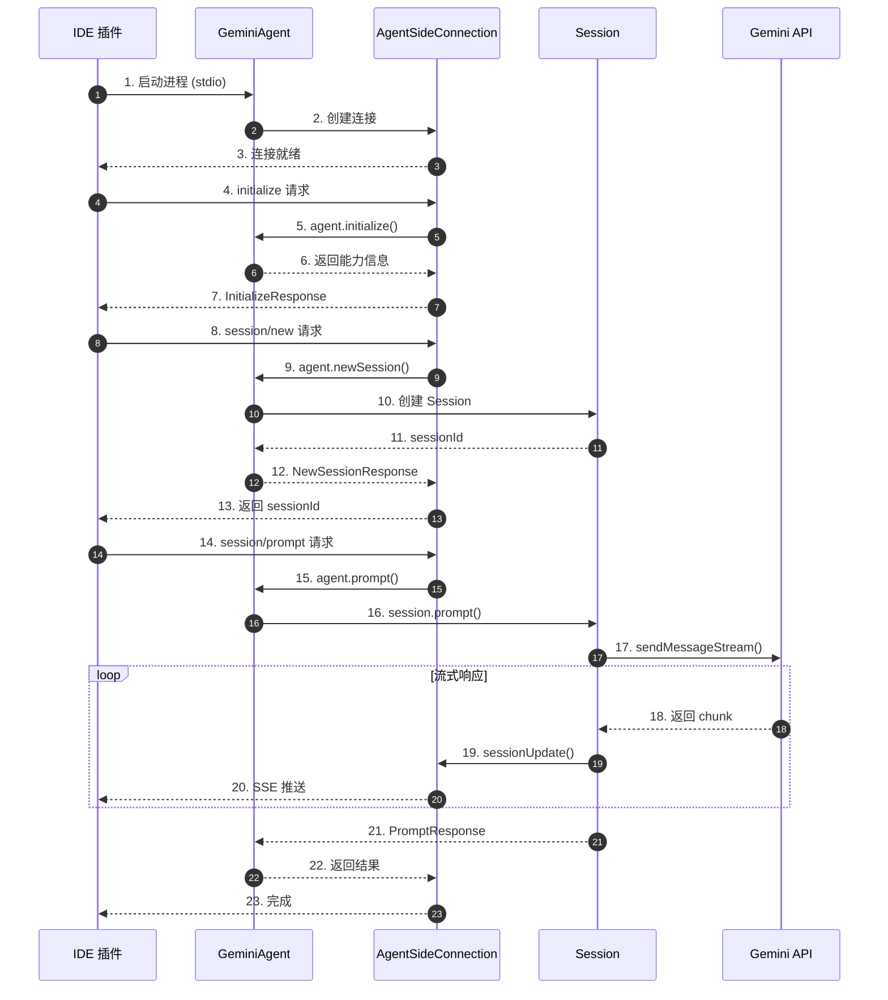

**关键交互说明**：

| 步骤 | 交互内容 | 设计意图 |
|-----|---------|---------|
| 1-3 | IDE 启动 Qwen Code 子进程 | 通过 stdio 建立双向通信通道 |
| 4-7 | 初始化握手 | 交换协议版本和能力信息 |
| 8-13 | 创建会话 | 建立持久化会话上下文 |
| 14-23 | 发送消息并流式响应 | 实时反馈 LLM 输出 |

---

## 3. 核心组件详细分析

### 3.1 AgentSideConnection 内部结构

#### 职责定位

AgentSideConnection 是 ACP 协议的 Agent 侧实现，负责管理 stdio 流上的 JSON-RPC 通信，将方法调用路由到对应的 Agent 实现。

#### 状态机图

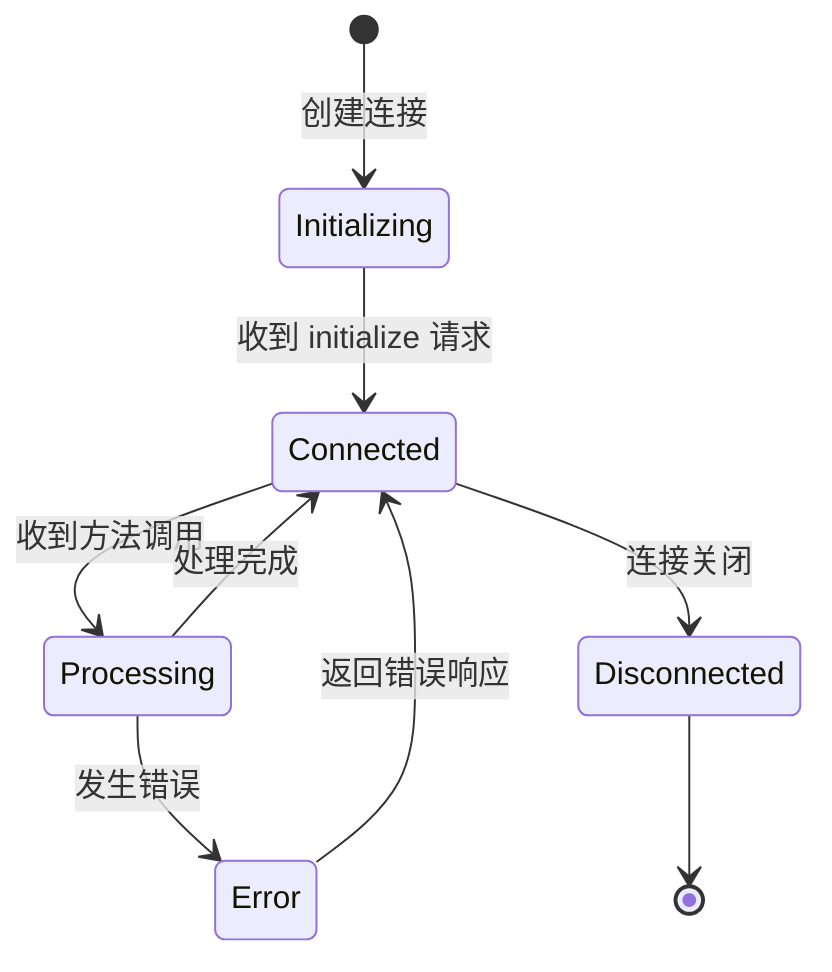

**状态说明**：

| 状态 | 说明 | 进入条件 | 退出条件 |
|-----|------|---------|---------|
| Initializing | 初始化中 | 创建 AgentSideConnection | 收到 initialize 请求 |
| Connected | 已连接 | 初始化成功 | 连接关闭 |
| Processing | 处理中 | 收到方法调用 | 处理完成/出错 |
| Error | 错误状态 | 处理出错 | 返回错误响应 |
| Disconnected | 已断开 | 连接关闭 | 无 |

#### 内部数据流

```text
┌─────────────────────────────────────────────────────────────┐
│  输入层 (stdin)                                              │
│  ├── 原始字节流 ──► TextDecoder ──► JSON 字符串              │
│  └── 按行分割 ──► JSON.parse ──► Request/Response/Notification│
└──────────────────────────┬──────────────────────────────────┘
                           ▼
┌─────────────────────────────────────────────────────────────┐
│  处理层                                                      │
│  ├── 消息类型识别: method + id ? Request : Notification       │
│  ├── 方法路由: switch(method) ──► 调用 handler               │
│  ├── 参数验证: Zod Schema 解析                               │
│  └── 错误处理: RequestError / ZodError                       │
└──────────────────────────┬──────────────────────────────────┘
                           ▼
┌─────────────────────────────────────────────────────────────┐
│  输出层 (stdout)                                             │
│  ├── 响应序列化: JSON.stringify                              │
│  ├── 行分隔: + '\n'                                          │
│  └── 字节编码: TextEncoder ──► WritableStream                │
└─────────────────────────────────────────────────────────────┘
```

#### 关键算法逻辑

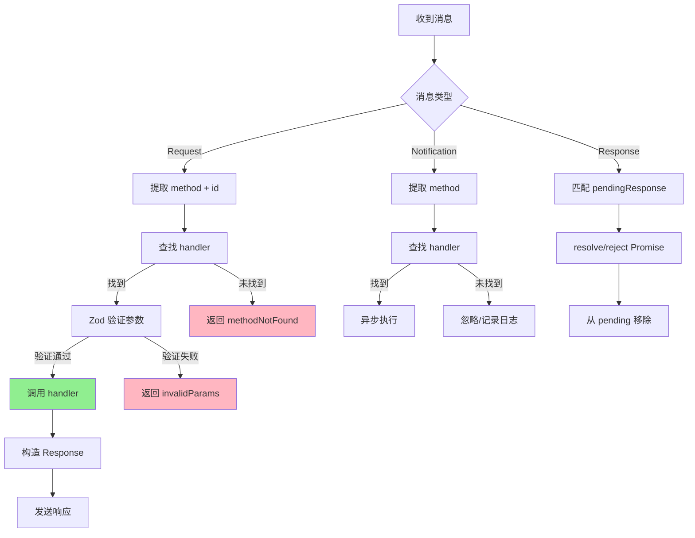

**算法要点**：

1. **消息分类**：通过 `method` 和 `id` 字段区分 Request/Notification/Response
2. **Zod 验证**：所有参数使用 Zod Schema 严格验证
3. **错误分类**：区分方法不存在、参数错误、内部错误等不同错误码
4. **异步处理**：Notification 异步执行，不等待结果

#### 关键接口

| 接口 | 输入 | 输出 | 说明 | 代码位置 |
|-----|------|------|------|---------|
| `sessionUpdate()` | SessionNotification | Promise<void> | 向客户端推送更新 | `acp.ts:95` |
| `requestPermission()` | RequestPermissionRequest | Promise<RequestPermissionResponse> | 请求用户确认 | `acp.ts:126` |
| `authenticateUpdate()` | AuthenticateUpdate | Promise<void> | 推送认证更新 | `acp.ts:105` |

---

### 3.2 GeminiAgent 内部结构

#### 职责定位

GeminiAgent 实现 ACP 协议的 Agent 接口，管理会话生命周期，处理初始化、认证、会话创建和消息处理等核心功能。

#### 关键数据结构

```typescript
// packages/cli/src/acp-integration/acpAgent.ts:62-71
class GeminiAgent {
  private sessions: Map<string, Session> = new Map();
  private clientCapabilities: acp.ClientCapabilities | undefined;

  constructor(
    private config: Config,
    private settings: LoadedSettings,
    private argv: CliArgs,
    private client: acp.Client,
  ) {}
}
```

**字段说明**：

| 字段 | 类型 | 用途 |
|-----|------|------|
| `sessions` | `Map<string, Session>` | 活跃会话映射表 |
| `clientCapabilities` | `ClientCapabilities` | 客户端能力声明 |
| `config` | `Config` | CLI 配置对象 |
| `client` | `acp.Client` | ACP 客户端接口 |

#### 状态转换详解

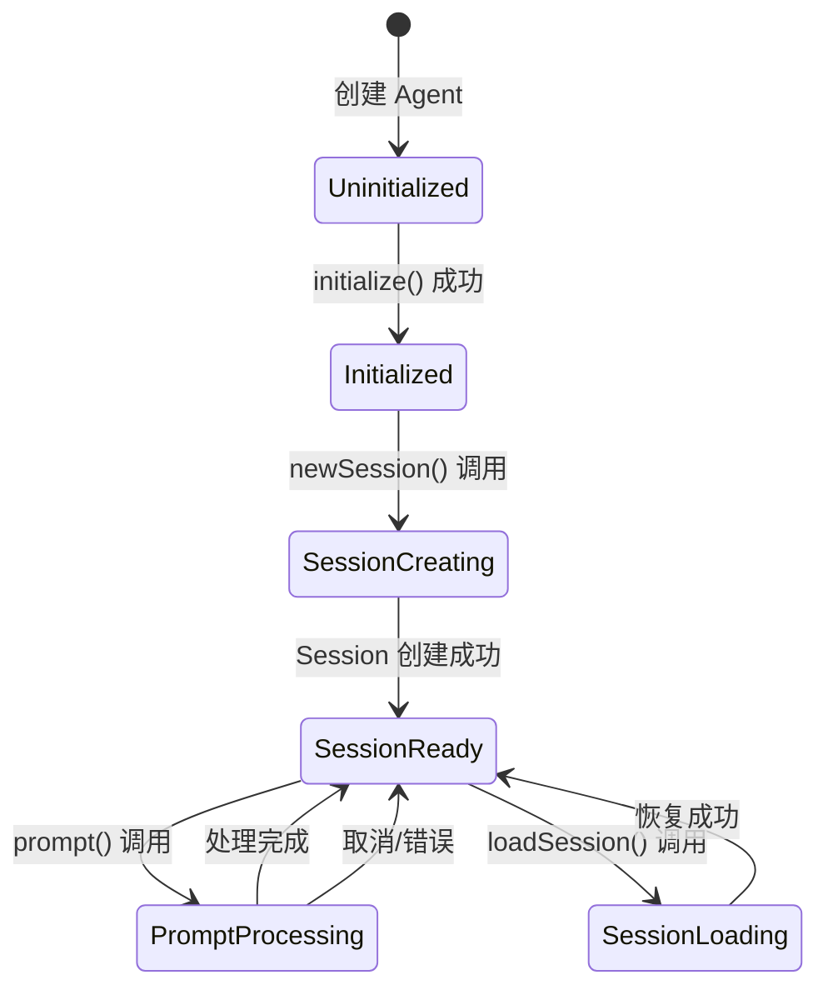

---

### 3.3 Session 内部结构

#### 职责定位

Session 管理单个对话会话的完整生命周期，包括消息处理、工具调用、流式响应和状态更新。

#### 关键算法逻辑

```mermaid
flowchart TD
    A[prompt() 调用] --> B[创建 AbortController]
    B --> C[检查 slash command]
    C -->|是| D[执行 command]
    C -->|否| E[解析 prompt 内容]
    D -->|submit_prompt| F[发送到 LLM]
    D -->|stream_messages| G[直接返回]
    D -->|message| H[发送通知]
    E --> F
    F --> I[流式接收响应]
    I --> J{事件类型}
    J -->|文本| K[emitMessage]
    J -->|工具调用| L[runTool]
    J -->|完成| M[返回结果]
    L --> N[工具执行]
    N --> O[emitToolResult]
    O --> I
```

**算法要点**：

1. **Slash Command 支持**：在 ACP 模式下支持 /summary、/compress 等命令
2. **工具调用追踪**：使用 ToolCallEmitter 统一处理工具事件
3. **权限确认**：非 YOLO 模式下通过 requestPermission 请求用户确认
4. **取消机制**：通过 AbortSignal 支持中途取消

---

### 3.4 组件间协作时序

展示多个组件如何协作完成一个完整的 prompt 请求。

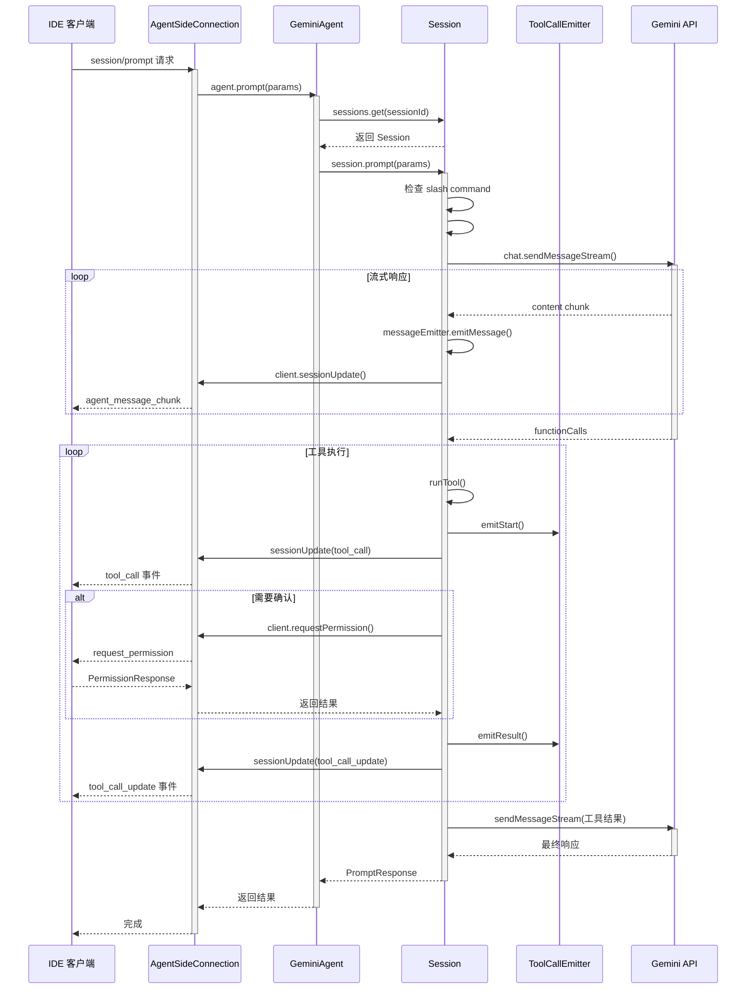

**协作要点**：

1. **多层封装**：IDE -> Connection -> Agent -> Session -> LLM
2. **事件驱动**：所有状态变更通过 sessionUpdate 通知客户端
3. **工具确认**：权限请求通过独立的 requestPermission 方法
4. **流式处理**：LLM 响应实时转发，不等待完整结果

---

### 3.5 关键数据路径

#### 主路径（正常流程）

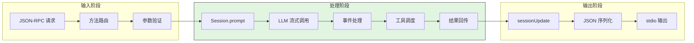

#### 异常路径（错误恢复）

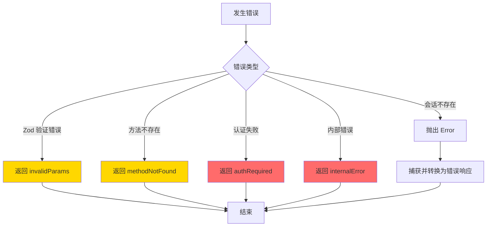

---

## 4. 端到端数据流转

### 4.1 正常流程（详细版）

展示数据如何从 IDE 输入到流式输出的完整变换过程。

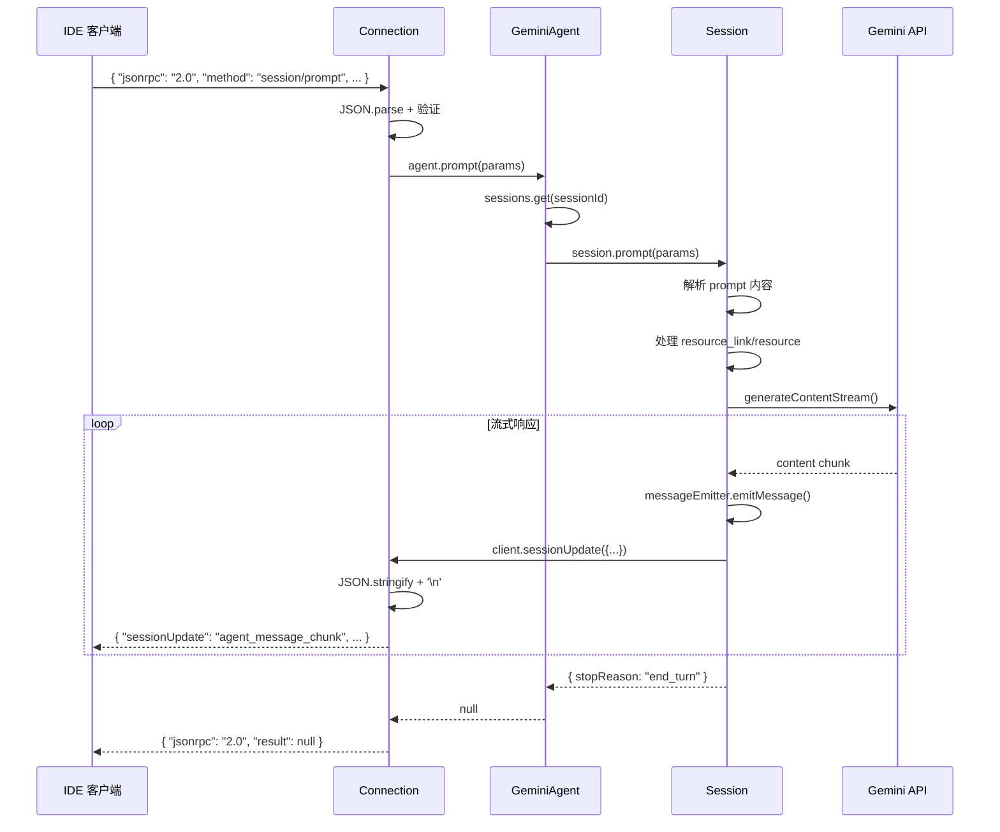

**数据变换详情**：

| 阶段 | 输入 | 处理 | 输出 | 代码位置 |
|-----|------|------|------|---------|
| 接收 | stdin 字节流 | TextDecoder + 行分割 | JSON 对象 | `acp.ts:215-239` |
| 路由 | method 字段 | switch 匹配 | handler 调用 | `acp.ts:29-87` |
| 处理 | prompt 参数 | Session 处理 + LLM 调用 | 内部事件 | `Session.ts:136-288` |
| 推送 | SessionUpdate | JSON.stringify + 编码 | stdout 字节流 | `acp.ts:355-371` |

### 4.2 数据流向图

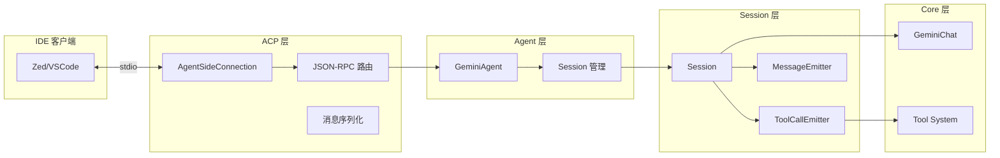

### 4.3 异常/边界流程

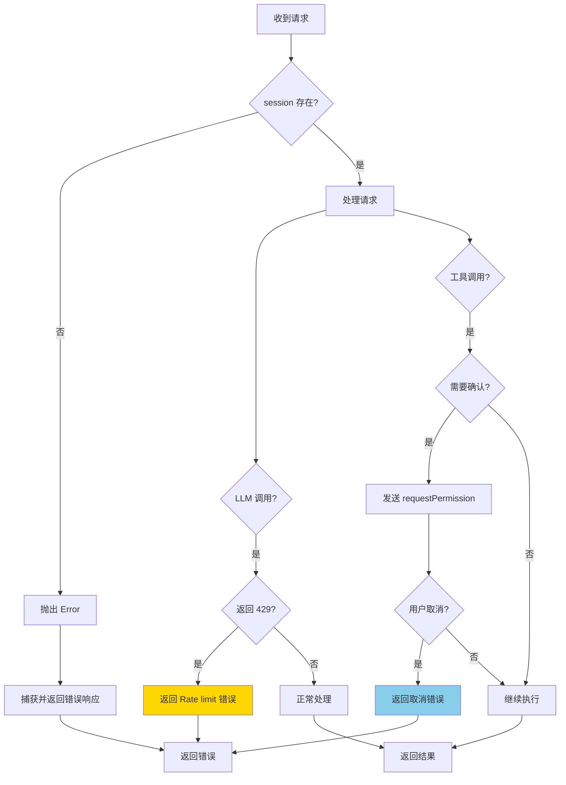

---

## 5. 关键代码实现

### 5.1 核心数据结构

```typescript
// packages/cli/src/acp-integration/schema.ts:625-636
export const requestPermissionRequestSchema = z.object({
  options: z.array(permissionOptionSchema),
  sessionId: z.string(),
  toolCall: toolCallSchema,
});

// packages/cli/src/acp-integration/schema.ts:564-610
export const sessionUpdateSchema = z.union([
  z.object({
    content: contentBlockSchema,
    sessionUpdate: z.literal('agent_message_chunk'),
    _meta: sessionUpdateMetaSchema.optional().nullable(),
  }),
  z.object({
    sessionUpdate: z.literal('tool_call'),
    toolCallId: z.string(),
    status: toolCallStatusSchema,
    title: z.string(),
    kind: toolKindSchema,
    // ...
  }),
  // ... 其他更新类型
]);
```

**字段说明**：

| 字段 | 类型 | 用途 |
|-----|------|------|
| `options` | `PermissionOption[]` | 用户可选择的权限选项 |
| `toolCall` | `ToolCall` | 工具调用详情 |
| `sessionUpdate` | `union` | 更新类型标识 |
| `_meta` | `SessionUpdateMeta` | 元数据（token 用量等） |

### 5.2 主链路代码

```typescript
// packages/cli/src/acp-integration/acpAgent.ts:41-60
export async function runAcpAgent(
  config: Config,
  settings: LoadedSettings,
  argv: CliArgs,
) {
  const stdout = Writable.toWeb(process.stdout) as WritableStream;
  const stdin = Readable.toWeb(process.stdin) as ReadableStream<Uint8Array>;

  // Stdout 用于发送消息给客户端，所以将 console.log 重定向到 stderr
  console.log = console.error;
  console.info = console.error;
  console.debug = console.error;

  new acp.AgentSideConnection(
    (client: acp.Client) => new GeminiAgent(config, settings, argv, client),
    stdout,
    stdin,
  );
}
```

**代码要点**：

1. **stdio 重定向**：将 stdout 用于 ACP 通信，console 输出重定向到 stderr
2. **流转换**：使用 Node.js 的 `toWeb()` 将 Node 流转换为 Web Streams
3. **连接创建**：创建 AgentSideConnection 即开始监听请求

### 5.3 关键调用链

```text
runAcpAgent()                    [acpAgent.ts:41]
  -> new AgentSideConnection()   [acp.ts:19]
    -> new Connection()          [acp.ts:196]
      -> #receive()              [acp.ts:215]
        -> #processMessage()     [acp.ts:242]
          -> #tryCallHandler()   [acp.ts:264]
            -> agent.prompt()    [acpAgent.ts:200]
              -> session.prompt() [Session.ts:136]
                -> chat.sendMessageStream()
                -> runTool()     [Session.ts:424]
                  -> toolCallEmitter.emitStart()
                  -> client.requestPermission()
                  -> toolCallEmitter.emitResult()
```

---

## 6. 设计意图与 Trade-off

### 6.1 Qwen Code 的选择

| 维度 | Qwen Code 的选择 | 替代方案 | 取舍分析 |
|-----|-----------------|---------|---------|
| 通信方式 | ACP stdio | HTTP Server / WebSocket | 简单可靠，但仅支持本地集成 |
| 协议格式 | JSON-RPC 2.0 | REST / gRPC | 标准协议，但需自定义扩展 |
| 集成目标 | IDE 插件 | 通用 Web API | 深度 IDE 集成，但无法浏览器访问 |
| 状态管理 | 内存 Map | 数据库存储 | 简单高效，但重启丢失 |
| 流式通信 | 推送更新 | SSE / WebSocket | 双向流式，但需客户端轮询 |

### 6.2 为什么这样设计？

**核心问题**：如何在无 Web Server 的情况下支持 IDE 集成？

**Qwen Code 的解决方案**：

- **代码依据**：`packages/cli/src/acp-integration/acpAgent.ts:41-60`
- **设计意图**：
  - 复用 Gemini CLI 的 ACP 协议实现，确保与 Zed 等编辑器兼容
  - stdio 通信简单可靠，无需端口管理和网络安全配置
  - JSON-RPC 协议标准化，便于多语言客户端实现
- **带来的好处**：
  - 无需维护 HTTP Server，降低复杂度
  - 与 IDE 进程生命周期绑定，自动清理
  - 支持流式响应，用户体验良好
- **付出的代价**：
  - 无法通过浏览器访问
  - 无法远程调用
  - 每次启动需要初始化开销

### 6.3 与其他项目的对比

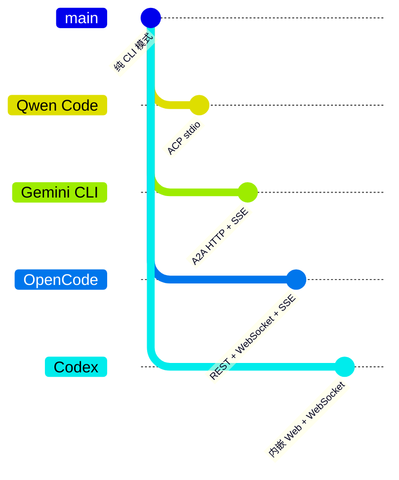

| 项目 | 协议设计 | 通信方式 | 部署模式 | 适用场景 |
|-----|---------|---------|---------|---------|
| Qwen Code | ACP (JSON-RPC) | stdio 流 | 子进程 | IDE 插件集成 |
| Gemini CLI | A2A (JSON-RPC) | HTTP + SSE | Express.js | Agent 间协作 |
| OpenCode | REST + OpenAPI | HTTP + WebSocket + SSE | Hono (Bun) | 高性能 API |
| Codex | WebSocket | HTTP + WebSocket | Axum (Rust) | 浏览器 + CLI 双模式 |

**详细对比**：

| 维度 | Qwen Code | Gemini CLI | OpenCode | Codex |
|-----|-----------|------------|----------|-------|
| **协议标准** | ACP | A2A | OpenAPI 3.1 | 自定义 |
| **RPC 格式** | JSON-RPC 2.0 | JSON-RPC 2.0 | RESTful JSON | WebSocket JSON |
| **传输层** | stdio | HTTP (SSE) | HTTP / WebSocket | HTTP / WebSocket |
| **流式技术** | 推送更新 | SSE | SSE / WebSocket | WebSocket |
| **集成方式** | 子进程 | HTTP 服务 | HTTP 服务 | 内嵌服务 |
| **远程访问** | 不支持 | 支持 | 支持 | 支持 |
| **浏览器支持** | 否 | 否 | 是 | 是 |
| **IDE 集成** | Zed, VSCode | Zed | 自定义 | 自定义 |

**设计选择分析**：

1. **Qwen Code 选择 ACP stdio**：
   - 与 Gemini CLI 保持兼容，复用 Zed 插件
   - 无需端口管理，避免冲突
   - 进程生命周期绑定，简化资源管理

2. **Gemini CLI 选择 A2A HTTP**：
   - 支持 Agent 间协作
   - 符合 Google A2A 标准
   - 支持 GCS 持久化

3. **OpenCode 选择 REST/WebSocket**：
   - 通用 API 设计，便于集成
   - Bun 原生高性能
   - 支持多协议并存

4. **Codex 选择内嵌 Web**：
   - 同时支持 CLI 和 Web 模式
   - 共享核心逻辑
   - Rust 安全保证

---

## 7. 边界情况与错误处理

### 7.1 终止条件

| 终止原因 | 触发条件 | 代码位置 |
|---------|---------|---------|
| 进程退出 | IDE 关闭子进程 | `acpAgent.ts:41` |
| 会话不存在 | sessionId 无效 | `acpAgent.ts:201` |
| 认证失败 | token 过期/无效 | `acpAgent.ts:284` |
| 用户取消 | 调用 session/cancel | `Session.ts:127` |
| 流式中断 | AbortSignal 触发 | `Session.ts:201` |
| 速率限制 | LLM 返回 429 | `Session.ts:256` |

### 7.2 超时/资源限制

```typescript
// packages/cli/src/acp-integration/session/Session.ts:136-288
// 无全局超时，依赖 AbortSignal

// 流式响应处理
const pendingSend = new AbortController();
this.pendingPrompt = pendingSend;

// 在循环中检查取消
if (pendingSend.signal.aborted) {
  chat.addHistory(nextMessage);
  return { stopReason: 'cancelled' };
}
```

**资源限制说明**：
- 无全局超时设置，依赖客户端发送 cancel 通知
- 工具执行有独立超时控制（在 Tool 实现中）
- 内存限制：会话数量受限于内存大小

### 7.3 错误恢复策略

| 错误类型 | 处理策略 | 代码位置 |
|---------|---------|---------|
| JSON 解析错误 | 记录日志，忽略消息 | `acp.ts:230-236` |
| Zod 验证错误 | 返回 invalidParams | `acp.ts:282-289` |
| 方法不存在 | 返回 methodNotFound | `acp.ts:84-85` |
| 认证失败 | 返回 authRequired | `acp.ts:307-311` |
| 会话不存在 | 抛出 Error，转为内部错误 | `acpAgent.ts:201-204` |
| LLM 429 错误 | 返回特定错误码 | `Session.ts:256-260` |

---

## 8. 关键代码索引

| 功能 | 文件 | 行号 | 说明 |
|-----|------|------|------|
| ACP 入口 | `packages/cli/src/acp-integration/acpAgent.ts` | 41 | `runAcpAgent()` 启动函数 |
| Agent 实现 | `packages/cli/src/acp-integration/acpAgent.ts` | 62 | `GeminiAgent` 类 |
| 连接管理 | `packages/cli/src/acp-integration/acp.ts` | 19 | `AgentSideConnection` 类 |
| 消息路由 | `packages/cli/src/acp-integration/acp.ts` | 29 | 方法路由 switch |
| 底层通信 | `packages/cli/src/acp-integration/acp.ts` | 196 | `Connection` 类 |
| 会话管理 | `packages/cli/src/acp-integration/session/Session.ts` | 82 | `Session` 类 |
| Schema 定义 | `packages/cli/src/acp-integration/schema.ts` | 1 | Zod Schema 定义 |
| 错误处理 | `packages/cli/src/acp-integration/acp.ts` | 374 | `RequestError` 类 |
| 工具发射器 | `packages/cli/src/acp-integration/session/emitters/ToolCallEmitter.ts` | 1 | 工具事件封装 |
| 消息发射器 | `packages/cli/src/acp-integration/session/emitters/MessageEmitter.ts` | 1 | 消息事件封装 |
| CLI 入口 | `packages/cli/src/gemini.tsx` | 400 | `runAcpAgent()` 调用点 |

---

## 9. 延伸阅读

- 前置知识：[ACP 协议规范](https://github.com/google/gemini-cli/blob/main/docs/acp.md)
- 相关机制：[04-qwen-code-agent-loop.md](./04-qwen-code-agent-loop.md)
- 相关机制：[06-qwen-code-mcp-integration.md](./06-qwen-code-mcp-integration.md)
- 对比分析：[09-gemini-cli-web-server.md](./09-gemini-cli-web-server.md)
- 对比分析：[09-opencode-web-server.md](./09-opencode-web-server.md)

---

*✅ Verified: 基于 qwen-code/packages/cli/src/acp-integration/acpAgent.ts、acp.ts、session/Session.ts 等源码分析*
*基于版本：2025-02 | 最后更新：2026-02-24*
