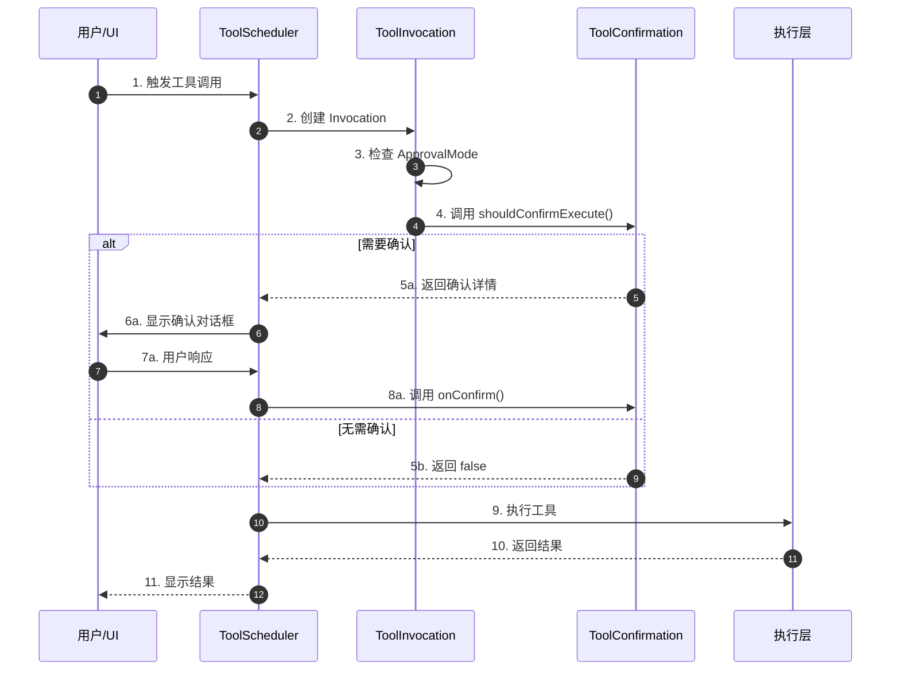
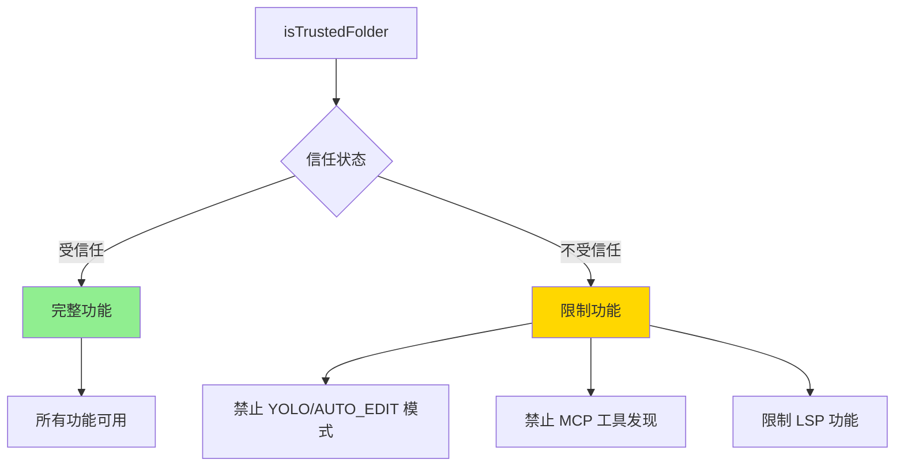
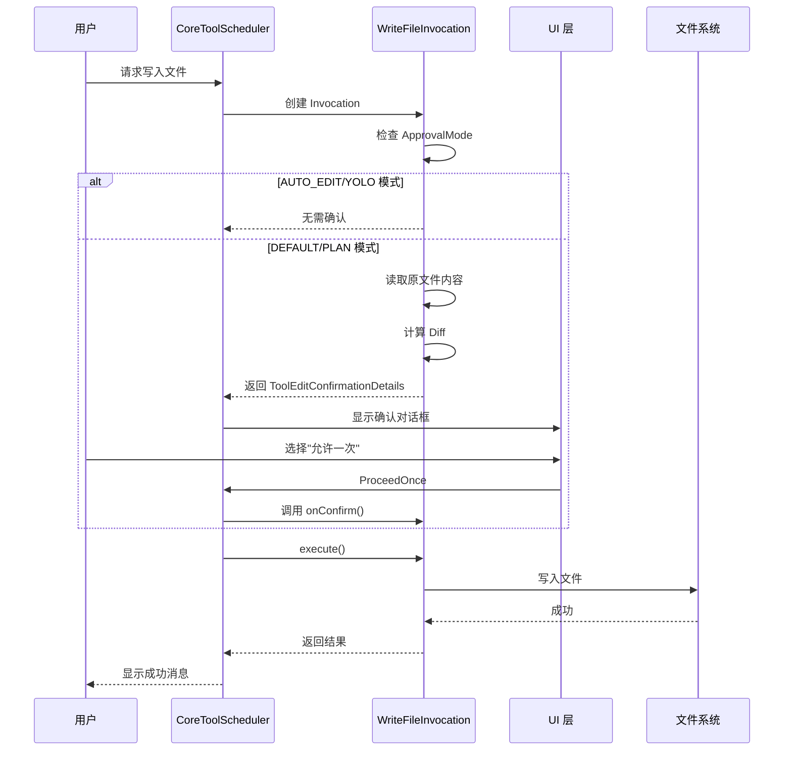
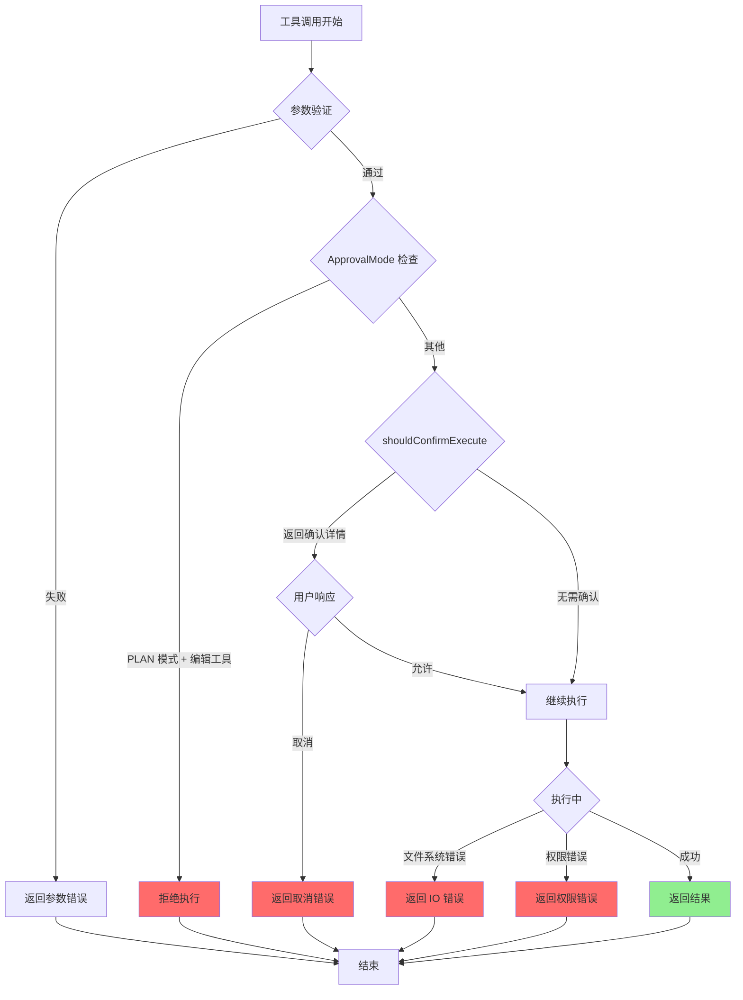
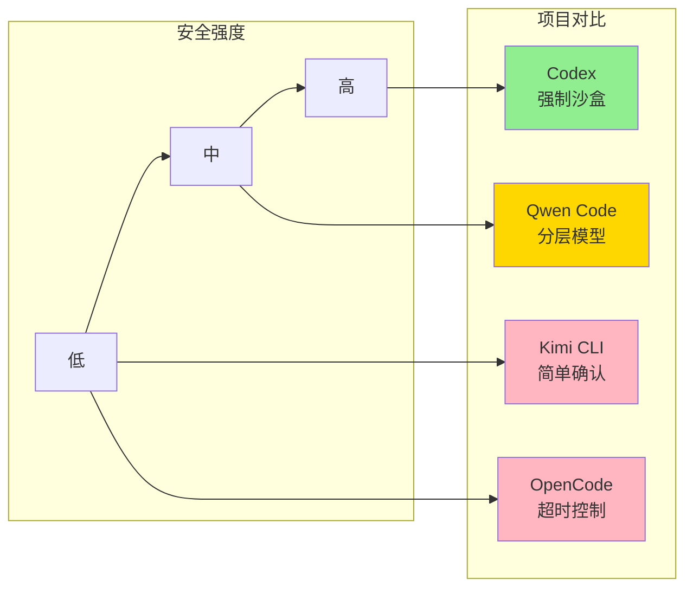

> **阅读指南**
>
> | 属性 | 说明 |
> |-----|------|
> | 预计阅读 | 25-35 分钟 |
> | 前置文档 | `01-qwen-code-overview.md`、`05-qwen-code-tools-system.md` |
> | 文档结构 | 速览 → 架构 → 机制 → 实现 → 对比 |
> | 代码呈现 | 关键代码直接展示，完整代码可折叠查看 |

---

# Safety Control（Qwen Code）

## TL;DR（结论先行）

一句话定义：Safety Control 是 Qwen Code 的多层次安全控制机制，通过**ApprovalMode（审批模式）+ 工具级确认 + 文件夹信任模型 + Shell 命令静态分析**四层防护，防止 AI 执行危险操作。

Qwen Code 的核心取舍：**分层渐进式安全模型**（对比 Codex 的强制沙盒、Kimi CLI 的简单确认对话框）

### 核心要点速览

| 维度 | 关键决策 | 代码位置 |
|-----|---------|---------|
| 审批模式 | 四级模式（PLAN/DEFAULT/AUTO_EDIT/YOLO） | `packages/core/src/config/config.ts:131` |
| 工具确认 | 每个工具自定义 shouldConfirmExecute() 逻辑 | `packages/core/src/tools/tools.ts:45` |
| 文件夹信任 | 二元信任状态，限制非信任目录功能 | `packages/core/src/config/config.ts:1458` |
| Shell 安全 | 静态白名单 + 语法分析，无需运行时沙盒 | `packages/core/src/utils/shellReadOnlyChecker.ts:339` |
| ACP 保护 | Plan 模式在 ACP 会话中强制执行 | `packages/cli/src/acp-integration/session/Session.ts:519` |
| 限流处理 | 429/503/1302 错误码检测 + 60s 倒计时重试 | `packages/core/src/utils/rateLimit.ts:29` |

---

## 1. 为什么需要这个机制？（解决什么问题）

### 1.1 问题场景

没有安全控制时，AI Agent 可能执行以下危险操作：

```
用户: "帮我清理一下项目"
AI: rm -rf /  →  系统被毁

用户: "修复这个 bug"
AI: 直接修改生产环境配置  →  服务中断

用户: "运行这个脚本"
AI: curl http://恶意脚本 | bash  →  安全漏洞
```

### 1.2 核心挑战

| 挑战 | 不解决的后果 |
|-----|-------------|
| 误操作风险 | AI 误解意图导致不可逆数据丢失 |
| 恶意代码注入 | 通过命令替换、管道等方式执行危险命令 |
| 权限越界 | 访问/修改工作目录外的敏感文件 |
| MCP 工具滥用 | 第三方 MCP 服务器可能执行未授权操作 |

---

## 2. 整体架构（ASCII 图）

### 2.1 在系统中的位置

```text
┌─────────────────────────────────────────────────────────────┐
│ CLI 入口 / UI 层                                            │
│ packages/cli/src/ui/components/messages/                    │
│   ToolConfirmationMessage.tsx                               │
└───────────────────────┬─────────────────────────────────────┘
                        │ 用户交互
                        ▼
┌─────────────────────────────────────────────────────────────┐
│ ▓▓▓ Safety Control Core ▓▓▓                                 │
│ packages/core/src/                                           │
│ - config/config.ts          : ApprovalMode 定义             │
│ - core/coreToolScheduler.ts : 工具调度与确认逻辑             │
│ - tools/tools.ts            : ToolInvocation 接口           │
└───────────────────────┬─────────────────────────────────────┘
                        │ 依赖/调用
        ┌───────────────┼───────────────┐
        ▼               ▼               ▼
┌──────────────┐ ┌──────────────┐ ┌──────────────┐
│ 工具层        │ │ Shell 安全层  │ │ MCP 安全层    │
│ - write-file │ │ shell-utils  │ │ mcp-tool     │
│ - edit       │ │ shellReadOnly│ │ mcp-client   │
│ - shell      │ │ Checker      │ │ -manager     │
└──────────────┘ └──────────────┘ └──────────────┘
```

### 2.2 核心组件职责

| 组件 | 职责 | 代码位置 |
|-----|------|---------|
| `ApprovalMode` | 定义四种审批模式（PLAN/DEFAULT/AUTO_EDIT/YOLO） | `packages/core/src/config/config.ts:131-136` |
| `ToolInvocation.shouldConfirmExecute()` | 工具级确认检查接口 | `packages/core/src/tools/tools.ts:45-47` |
| `isTrustedFolder()` | 文件夹信任状态检查 | `packages/core/src/config/config.ts:1458-1472` |
| `isShellCommandReadOnly()` | Shell 命令静态分析 | `packages/core/src/utils/shellReadOnlyChecker.ts:339-353` |
| `McpClientManager` | MCP 工具发现与权限控制 | `packages/core/src/tools/mcp-client-manager.ts:55-58` |
| **Session.runTool()** | **ACP 会话中 Plan 模式强制执行** | **`packages/cli/src/acp-integration/session/Session.ts:519-529`** |
| **RateLimit 检测器** | **限流错误检测与重试信息生成** | **`packages/core/src/utils/rateLimit.ts:29-32`** |
| **Sandbox 环境检测** | **集成测试环境变量检测** | **`packages/cli/src/utils/sandbox.ts:543-544`** |

### 2.3 核心组件交互关系



**关键交互说明**：

| 步骤 | 交互内容 | 设计意图 |
|-----|---------|---------|
| 3 | 检查全局 ApprovalMode | 第一层全局策略控制 |
| 4 | 工具级确认检查 | 第二层细粒度控制，每个工具自定义逻辑 |
| 6a | 显示确认对话框 | 用户介入决策点，支持多种确认选项 |
| 8a | onConfirm 回调 | 支持"始终允许"等持久化授权 |
| 9-10 | 工具执行与结果返回 | 主流程与副作用分离，确保核心逻辑稳定 |

---

## 3. 核心组件详细分析

### 3.1 ApprovalMode 状态机

#### 职责定位

ApprovalMode 是全局安全策略控制器，定义四种安全级别，从严格到宽松递进。

#### 状态定义

```mermaid
stateDiagram-v2
    [*] --> PLAN: 最高安全
    [*] --> DEFAULT: 标准安全
    [*] --> AUTO_EDIT: 自动编辑
    [*] --> YOLO: 完全自动

    PLAN --> DEFAULT: 用户切换
    DEFAULT --> AUTO_EDIT: 用户切换
    AUTO_EDIT --> YOLO: 用户切换
    YOLO --> DEFAULT: 用户切换
    AUTO_EDIT --> DEFAULT: 用户切换
    DEFAULT --> PLAN: 用户切换

    note right of PLAN
        仅分析，禁止修改文件
        禁止执行命令
    end note

    note right of DEFAULT
        编辑文件需确认
        Shell 命令需确认
    end note

    note right of AUTO_EDIT
        自动批准文件编辑
        Shell 命令仍需确认
    end note

    note right of YOLO
        自动批准所有操作
        仅受信任文件夹可用
    end note
```

**状态说明**：

| 状态 | 说明 | 适用场景 |
|-----|------|---------|
| PLAN | 只读分析模式 | 代码审查、安全审计 |
| DEFAULT | 标准保护模式 | 日常开发（推荐） |
| AUTO_EDIT | 自动编辑模式 | 批量重构、信任的项目 |
| YOLO | 完全自动模式 | CI/CD、自动化脚本 |

#### ACP 会话中的 Plan 模式强制执行

在 ACP (Agent Communication Protocol) 会话中，Plan 模式会被强制强制执行：

```typescript
// packages/cli/src/acp-integration/session/Session.ts:519-529
const isPlanMode = this.config.getApprovalMode() === ApprovalMode.PLAN;
if (isPlanMode && !isExitPlanModeTool && confirmationDetails) {
  // In plan mode, block any tool that requires confirmation (write operations)
  return errorResponse(
    new Error(
      `Plan mode is active. The tool "${fc.name}" cannot be executed because it modifies the system. ` +
        'Please use the exit_plan_mode tool to present your plan and exit plan mode before making changes.',
    ),
  );
}
```

**设计意图**：
- **防止误操作**：在 ACP 会话中，AI 可能无法直接感知用户意图，强制 Plan 模式可以阻止意外的写操作
- **明确边界**：只有标记为 `readOnlyHint: true` 的 MCP 工具可以在 Plan 模式下执行
- **用户引导**：错误消息明确告知用户如何退出 Plan 模式并执行修改操作

#### 关键代码

```typescript
// packages/core/src/config/config.ts:131-174
export enum ApprovalMode {
  PLAN = 'plan',           // 仅分析，不修改
  DEFAULT = 'default',     // 编辑/执行需确认
  AUTO_EDIT = 'auto-edit', // 自动批准编辑
  YOLO = 'yolo',           // 自动批准所有
}

// 不受信任文件夹限制
setApprovalMode(mode: ApprovalMode): void {
  if (!this.isTrustedFolder() && mode !== ApprovalMode.DEFAULT && mode !== ApprovalMode.PLAN) {
    throw new Error('Cannot enable privileged approval modes in an untrusted folder.');
  }
  this.approvalMode = mode;
}
```

---

### 3.2 工具级确认机制

#### 职责定位

每个工具通过实现 `shouldConfirmExecute()` 方法，自定义确认逻辑，实现细粒度安全控制。

#### 内部数据流

```text
┌─────────────────────────────────────────────────────────────┐
│  输入层                                                      │
│  ├── 工具参数 ──► 参数验证                                   │
│  └── ApprovalMode ──► 全局策略检查                           │
└──────────────────────────┬──────────────────────────────────┘
                           ▼
┌─────────────────────────────────────────────────────────────┐
│  决策层                                                      │
│  ├── 读取当前文件内容（编辑类工具）                           │
│  ├── 计算 Diff                                              │
│  ├── 检查命令白名单（Shell 工具）                             │
│  └── 判断是否需要确认                                        │
└──────────────────────────┬──────────────────────────────────┘
                           ▼
┌─────────────────────────────────────────────────────────────┐
│  输出层                                                      │
│  ├── false: 无需确认                                         │
│  └── ToolCallConfirmationDetails: 确认详情                   │
│      ├── type: 'edit' | 'exec' | 'mcp' | 'info' | 'plan'    │
│      ├── title: 确认标题                                     │
│      ├── onConfirm: 回调函数                                 │
│      └── 类型特定字段（diff、command 等）                      │
└─────────────────────────────────────────────────────────────┘
```

#### 关键接口

```typescript
// packages/core/src/tools/tools.ts:45-47
interface ToolInvocation {
  shouldConfirmExecute(
    abortSignal: AbortSignal,
  ): Promise<ToolCallConfirmationDetails | false>;
}

// 确认结果类型（联合类型）
type ToolCallConfirmationDetails =
  | ToolEditConfirmationDetails    // 文件编辑
  | ToolExecuteConfirmationDetails // Shell 执行
  | ToolMcpConfirmationDetails     // MCP 工具
  | ToolInfoConfirmationDetails    // 信息提示
  | ToolPlanConfirmationDetails;   // Plan 模式
```

---

### 3.3 Shell 命令安全分析器

#### 职责定位

通过静态分析判断 Shell 命令是否为只读操作，无需运行时执行即可识别危险命令。

#### 算法流程

```mermaid
flowchart TD
    A[Shell 命令输入] --> B[分割命令段]
    B --> C{命令替换检测}
    C -->|存在 $() ``| D[拒绝: 危险操作]
    C -->|无| E[检查输出重定向]
    E -->|存在 > >>| D
    E -->|无| F[解析命令根]
    F --> G{根命令在白名单?}
    G -->|否| D
    G -->|是| H[特殊命令分析]
    H --> I{git 命令?}
    I -->|是| J[检查子命令]
    J -->|blame/status/diff| K[允许]
    J -->|push/reset| D
    H --> L{find 命令?}
    L -->|是| M[检查 -delete/-exec]
    M -->|存在| D
    M -->|无| K
    H --> N{sed 命令?}
    N -->|是| O[检查 -i/--in-place]
    O -->|存在| D
    O -->|无| K
    H --> P{awk 命令?}
    P -->|是| Q[检查 system/print >]
    Q -->|存在| D
    Q -->|无| K

    style D fill:#FF6B6B
    style K fill:#90EE90
```

#### 只读命令白名单

```typescript
// packages/core/src/utils/shellReadOnlyChecker.ts:14-49
const READ_ONLY_ROOT_COMMANDS = new Set([
  'awk', 'basename', 'cat', 'cd', 'column', 'cut', 'df', 'dirname',
  'du', 'echo', 'env', 'find', 'git', 'grep', 'head', 'less', 'ls',
  'more', 'printenv', 'printf', 'ps', 'pwd', 'rg', 'ripgrep', 'sed',
  'sort', 'stat', 'tail', 'tree', 'uniq', 'wc', 'which', 'where', 'whoami',
]);

// Git 只读子命令
const READ_ONLY_GIT_SUBCOMMANDS = new Set([
  'blame', 'branch', 'cat-file', 'diff', 'grep', 'log',
  'ls-files', 'remote', 'rev-parse', 'show', 'status', 'describe',
]);
```

---

### 3.4 文件夹信任模型

#### 职责定位

区分受信任与不受信任的工作目录，对不受信任目录实施更严格的安全限制。

#### 信任检查点



#### 关键代码

```typescript
// packages/core/src/config/config.ts:1458-1472
isTrustedFolder(): boolean {
  // 默认值为 true，因为使用受信任设置加载
  // 避免在常见路径中重启
  const context = ideContextStore.get();
  if (context?.workspaceState?.isTrusted !== undefined) {
    return context.workspaceState.isTrusted;
  }
  return this.folderTrust;
}

// MCP 工具发现检查
// packages/core/src/tools/mcp-client-manager.ts:55-58
async discoverAllMcpTools(cliConfig: Config): Promise<void> {
  if (!cliConfig.isTrustedFolder()) {
    return; // 不受信任文件夹禁用 MCP
  }
  // ... 发现 MCP 工具
}
```

---

## 4. 端到端数据流转

### 4.1 正常流程（详细版）

以 WriteFile 工具为例：



### 4.2 数据变换详情

| 阶段 | 输入 | 处理 | 输出 | 代码位置 |
|-----|------|------|------|---------|
| 接收 | 工具调用请求 | 参数验证 | WriteFileToolParams | `write-file.ts:404-438` |
| 确认检查 | ApprovalMode + 参数 | 模式检查 + Diff 计算 | ConfirmationDetails/false | `write-file.ts:135-198` |
| 用户确认 | ConfirmationDetails | UI 渲染 + 用户交互 | ToolConfirmationOutcome | `ToolConfirmationMessage.tsx:75-87` |
| 执行 | 确认后的参数 | 文件写入 | ToolResult | `write-file.ts:200-366` |

### 4.3 异常/边界流程



---

## 5. 关键代码实现

### 5.1 核心数据结构

```typescript
// packages/core/src/tools/tools.ts:604-611
export enum ToolConfirmationOutcome {
  ProceedOnce = 'proceed_once',           // 允许一次
  ProceedAlways = 'proceed_always',       // 始终允许（当前会话）
  ProceedAlwaysServer = 'proceed_always_server', // 始终允许（MCP 服务器）
  ProceedAlwaysTool = 'proceed_always_tool',     // 始终允许（特定工具）
  ModifyWithEditor = 'modify_with_editor', // 用编辑器修改
  Cancel = 'cancel',                       // 取消
}

// 工具种类定义
export enum Kind {
  Read = 'read',
  Edit = 'edit',
  Delete = 'delete',
  Move = 'move',
  Search = 'search',
  Execute = 'execute',
  Think = 'think',
  Fetch = 'fetch',
  Other = 'other',
}

// 有副作用的工具类型
export const MUTATOR_KINDS: Kind[] = [
  Kind.Edit, Kind.Delete, Kind.Move, Kind.Execute,
];
```

### 5.2 主链路代码（WriteFile 确认逻辑）

```typescript
// packages/core/src/tools/write-file.ts:135-198
override async shouldConfirmExecute(
  _abortSignal: AbortSignal,
): Promise<ToolCallConfirmationDetails | false> {
  // 1. 检查全局 ApprovalMode
  if (this.config.getApprovalMode() === ApprovalMode.AUTO_EDIT) {
    return false;
  }

  // 2. 获取文件内容用于 Diff
  const correctedContentResult = await getCorrectedFileContent(
    this.config,
    this.params.file_path,
    this.params.content,
  );

  if (correctedContentResult.error) {
    return false;
  }

  // 3. 生成 Diff
  const { originalContent, correctedContent } = correctedContentResult;
  const fileDiff = Diff.createPatch(
    fileName,
    originalContent,
    correctedContent,
    'Current',
    'Proposed',
    DEFAULT_DIFF_OPTIONS,
  );

  // 4. 检查 IDE 集成
  const ideClient = await IdeClient.getInstance();
  const ideConfirmation =
    this.config.getIdeMode() && ideClient.isDiffingEnabled()
      ? ideClient.openDiff(this.params.file_path, correctedContent)
      : undefined;

  // 5. 返回确认详情
  const confirmationDetails: ToolEditConfirmationDetails = {
    type: 'edit',
    title: `Confirm Write: ${shortenPath(relativePath)}`,
    fileName, filePath, fileDiff, originalContent, newContent: correctedContent,
    onConfirm: async (outcome: ToolConfirmationOutcome) => {
      if (outcome === ToolConfirmationOutcome.ProceedAlways) {
        this.config.setApprovalMode(ApprovalMode.AUTO_EDIT);
      }
      // IDE 集成处理...
    },
    ideConfirmation,
  };
  return confirmationDetails;
}
```

### 5.3 关键调用链

```text
CoreToolScheduler.scheduleToolCalls()
  └── packages/core/src/core/coreToolScheduler.ts:XXX
    ├── tool.build()                    // 创建 Invocation
    │   └── BaseDeclarativeTool.build() // packages/core/src/tools/tools.ts:281-287
    ├── invocation.shouldConfirmExecute() // 检查是否需要确认
    │   ├── WriteFileTool:135-198       // 文件写入确认
    │   ├── EditTool:248-313            // 文件编辑确认
    │   ├── ShellTool:92-125            // Shell 命令确认
    │   └── McpTool:117-152             // MCP 工具确认
    └── invocation.execute()            // 执行工具
```

---

## 6. 设计意图与 Trade-off

### 6.1 Qwen Code 的选择

| 维度 | Qwen Code 的选择 | 替代方案 | 取舍分析 |
|-----|-----------------|---------|---------|
| 安全模型 | 四层分层模型（Mode + Tool + Trust + Static Analysis） | 单层统一控制 | 灵活但复杂，需理解各层交互 |
| Shell 安全 | 静态分析（白名单 + 语法检测） | 运行时沙盒（Codex） | 轻量但可能被绕过，无法捕获所有攻击 |
| 确认粒度 | 工具级自定义逻辑 | 统一确认对话框 | 精确但每个工具需单独实现 |
| MCP 安全 | 服务器级 + 工具级白名单 | 完全禁止外部工具 | 开放但需用户理解信任模型 |
| 文件夹信任 | 二元信任状态 | 细粒度权限矩阵 | 简单但不够灵活 |

### 6.2 为什么这样设计？

**核心问题**：如何在安全性与用户体验之间取得平衡？

**Qwen Code 的解决方案**：

- **代码依据**：`packages/core/src/config/config.ts:131-174`
- **设计意图**：提供渐进式安全级别，让用户根据场景选择
  - 审查场景用 PLAN 模式
  - 日常开发用 DEFAULT 模式
  - 信任项目用 AUTO_EDIT 模式
  - 自动化用 YOLO 模式
- **带来的好处**：
  - 新用户默认受保护
  - 高级用户可提升效率
  - 不受信任代码有额外防护
- **付出的代价**：
  - 安全模型理解成本高
  - 不受信任文件夹功能受限
  - YOLO 模式风险高

### 6.3 与其他项目的对比



| 项目 | 核心差异 | 适用场景 |
|-----|---------|---------|
| **Qwen Code** | 四层分层模型 + 静态 Shell 分析 | 需要灵活安全策略的团队 |
| **Codex** | 强制 Docker 沙盒 + 原生隔离 | 企业级安全要求 |
| **Kimi CLI** | 简单确认对话框 + Checkpoint 回滚 | 个人开发者 |
| **Gemini CLI** | 继承 Qwen Code 的安全模型 | 与 Qwen Code 相同 |
| **OpenCode** | resetTimeoutOnProgress + 流式控制 | 长任务场景 |

**详细对比**：

| 特性 | Qwen Code | Codex | Kimi CLI |
|-----|-----------|-------|----------|
| 沙盒隔离 | 可选配置 | 强制 Docker | 无 |
| Shell 安全 | 静态分析 | 运行时隔离 | 简单确认 |
| 审批模式 | 4 级可调 | 固定严格 | 2 级 |
| MCP 安全 | 服务器+工具白名单 | 不支持 | 不支持 |
| 文件夹信任 | 支持 | 无 | 无 |
| 回滚机制 | 无 | 无 | Checkpoint |

---

## 7. 边界情况与错误处理

### 7.1 终止条件

| 终止原因 | 触发条件 | 代码位置 |
|---------|---------|---------|
| 用户取消 | 确认对话框选择"取消" | `ToolConfirmationOutcome.Cancel` |
| 参数无效 | 工具参数验证失败 | `BaseDeclarativeTool.build():283-285` |
| 模式限制 | PLAN 模式尝试编辑 | `setApprovalMode():1231-1239` |
| **ACP Plan 模式拦截** | **ACP 会话中写操作被阻止** | **`Session.runTool():519-529`** |
| 信任限制 | 不受信任文件夹使用 YOLO | `setApprovalMode():1231-1239` |
| 命令拒绝 | Shell 命令被黑名单拦截 | `shell-utils.ts:889-899` |

### 7.2 超时/资源限制

```typescript
// packages/core/src/tools/shell.ts:49
const DEFAULT_FOREGROUND_TIMEOUT_MS = 120000; // 2 分钟默认超时

// 超时处理逻辑
const effectiveTimeout = this.params.is_background
  ? undefined
  : (this.params.timeout ?? DEFAULT_FOREGROUND_TIMEOUT_MS);

if (effectiveTimeout) {
  const timeoutSignal = AbortSignal.timeout(effectiveTimeout);
  combinedSignal = AbortSignal.any([signal, timeoutSignal]);
}
```

### 7.3 速率限制重试机制

**设计目标**：处理 API 提供商的限流错误（TPM 限制、GLM 限流等），提供用户友好的倒计时重试 UI。

#### 限流错误检测

```typescript
// packages/core/src/utils/rateLimit.ts:9-32
// Known rate-limit error codes across providers.
// 429  - Standard HTTP "Too Many Requests" (DashScope TPM, OpenAI, etc.)
// 503  - Provider throttling/overload (treated as rate-limit for retry UI)
// 1302 - Z.AI GLM rate limit (https://docs.z.ai/api-reference/api-code)
const RATE_LIMIT_ERROR_CODES = new Set([429, 503, 1302]);

export function isRateLimitError(error: unknown): boolean {
  const code = getErrorCode(error);
  return code !== null && RATE_LIMIT_ERROR_CODES.has(code);
}
```

#### 重试策略

```typescript
// packages/core/src/core/geminiChat.ts:315-345
const isRateLimit = isRateLimitError(error);
if (
  isRateLimit &&
  rateLimitRetryCount < RATE_LIMIT_RETRY_OPTIONS.maxRetries
) {
  rateLimitRetryCount++;
  const delayMs = RATE_LIMIT_RETRY_OPTIONS.delayMs; // 固定 60s
  const message = parseAndFormatApiError(
    error instanceof Error ? error.message : String(error),
  );
  debugLogger.warn(
    `Rate limit throttling detected (retry ${rateLimitRetryCount}/${RATE_LIMIT_RETRY_OPTIONS.maxRetries}). ` +
      `Waiting ${delayMs / 1000}s before retrying...`,
  );
  yield {
    type: StreamEventType.RETRY,
    retryInfo: {
      message,
      attempt: rateLimitRetryCount,
      maxRetries: RATE_LIMIT_RETRY_OPTIONS.maxRetries,
      delayMs,
    },
  };
  // Don't count rate-limit retries against the content retry limit
  attempt--;
  await new Promise((res) => setTimeout(res, delayMs));
  continue;
}
```

#### 重试参数配置

| 参数 | 值 | 说明 |
|-----|-----|------|
| maxRetries | 10 | 最大重试次数 |
| delayMs | 60000 | 固定重试间隔（60秒） |
| 支持的错误码 | 429, 503, 1302 | 涵盖主流提供商限流码 |

**关键设计决策**：
- **固定延迟**：使用固定 60 秒延迟而非指数退避，因为限流通常是基于时间窗口的
- **独立计数**：限流重试不计入内容错误重试次数，避免过早失败
- **流式通知**：通过 `StreamEventType.RETRY` 事件向 UI 层传递重试信息，支持倒计时显示
- **多提供商支持**：覆盖 DashScope TPM、OpenAI、GLM (Z.AI) 等主流提供商的限流码

### 7.4 错误恢复策略

| 错误类型 | 处理策略 | 代码位置 |
|---------|---------|---------|
| 文件写入失败 | 返回详细错误信息（含错误码） | `write-file.ts:327-365` |
| 权限拒绝 | 返回 PERMISSION_DENIED 类型错误 | `write-file.ts:337-338` |
| 磁盘满 | 返回 NO_SPACE_LEFT 类型错误 | `write-file.ts:340-341` |
| 命令超时 | 返回超时前输出 | `shell.ts:300-306` |
| MCP 连接失败 | 记录错误，不阻止其他服务器 | `mcp-client-manager.ts:92-100` |

### 7.5 Sandbox 环境变量变更

**BREAKING CHANGE**：集成测试环境变量名称已变更。

| 旧名称 | 新名称 | 影响范围 |
|-------|-------|---------|
| `GEMINI_CLI_INTEGRATION_TEST` | `QWEN_CODE_INTEGRATION_TEST` | 集成测试、CI/CD 配置 |

#### 代码变更

```typescript
// packages/cli/src/utils/sandbox.ts:543-544
const isIntegrationTest =
  process.env['QWEN_CODE_INTEGRATION_TEST'] === 'true';

// 容器命名逻辑
if (isIntegrationTest) {
  containerName = `qwen-code-integration-test-${randomBytes(4).toString('hex')}`;
} else {
  containerName = `${imageName}-${index}`;
}
```

#### UID/GID 处理改进

集成测试模式下，SANDBOX_SET_UID_GID 现在可以正常工作：

```typescript
// packages/cli/src/utils/sandbox.ts:720-767
const useCurrentUser = await shouldUseCurrentUserInSandbox();

if (useCurrentUser) {
  // SANDBOX_SET_UID_GID is enabled: create user with host's UID/GID
  // This includes integration test mode with SANDBOX_SET_UID_GID=true,
  // allowing tests that need to access host's ~/.qwen (e.g., --resume) to work.
  args.push('--user', 'root');
  const uid = execSync('id -u').toString().trim();
  const gid = execSync('id -g').toString().trim();

  // 创建与主机 UID/GID 匹配的用户
  const setupUserCommands = [
    `groupadd -f -g ${gid} ${username}`,
    `id -u ${username} &>/dev/null || useradd -o -u ${uid} -g ${gid} -d ${homeDir} -s /bin/bash ${username}`,
  ].join(' && ');
}
```

**迁移指南**：
- 更新 CI/CD 脚本中的环境变量引用
- 检查本地开发环境的 `.env` 文件
- 更新文档和团队配置指南

---

## 8. 关键代码索引

| 功能 | 文件 | 行号 | 说明 |
|-----|------|------|------|
| ApprovalMode 定义 | `packages/core/src/config/config.ts` | 131-136 | 四种审批模式枚举 |
| ApprovalMode 信息 | `packages/core/src/config/config.ts` | 153-174 | 模式描述信息 |
| 设置审批模式 | `packages/core/src/config/config.ts` | 1230-1241 | setApprovalMode 方法 |
| 文件夹信任检查 | `packages/core/src/config/config.ts` | 1458-1472 | isTrustedFolder 方法 |
| 工具确认接口 | `packages/core/src/tools/tools.ts` | 45-47 | shouldConfirmExecute 定义 |
| 确认结果类型 | `packages/core/src/tools/tools.ts` | 530-598 | 各种 ConfirmationDetails |
| 确认结果枚举 | `packages/core/src/tools/tools.ts` | 604-611 | ToolConfirmationOutcome |
| WriteFile 确认 | `packages/core/src/tools/write-file.ts` | 135-198 | 文件写入确认逻辑 |
| Edit 确认 | `packages/core/src/tools/edit.ts` | 248-313 | 文件编辑确认逻辑 |
| Shell 确认 | `packages/core/src/tools/shell.ts` | 92-125 | Shell 命令确认逻辑 |
| MCP 确认 | `packages/core/src/tools/mcp-tool.ts` | 117-152 | MCP 工具确认逻辑 |
| Shell 静态分析 | `packages/core/src/utils/shellReadOnlyChecker.ts` | 339-353 | isShellCommandReadOnly |
| 只读命令白名单 | `packages/core/src/utils/shellReadOnlyChecker.ts` | 14-49 | READ_ONLY_ROOT_COMMANDS |
| 命令权限检查 | `packages/core/src/utils/shell-utils.ts` | 889-899 | isCommandAllowed |
| MCP 信任检查 | `packages/core/src/tools/mcp-client-manager.ts` | 55-58 | discoverAllMcpTools |
| UI 确认组件 | `packages/cli/src/ui/components/messages/ToolConfirmationMessage.tsx` | 1-300+ | 确认对话框 UI |
| **ACP Plan 模式强制执行** | **`packages/cli/src/acp-integration/session/Session.ts`** | **519-529** | **runTool() Plan 模式拦截** |
| **限流错误检测** | **`packages/core/src/utils/rateLimit.ts`** | **29-32** | **isRateLimitError()** |
| **限流重试逻辑** | **`packages/core/src/core/geminiChat.ts`** | **315-345** | **Rate limit retry with countdown UI** |
| **Sandbox 环境变量** | **`packages/cli/src/utils/sandbox.ts`** | **543-544** | **QWEN_CODE_INTEGRATION_TEST** |
| **Sandbox UID/GID 处理** | **`packages/cli/src/utils/sandbox.ts`** | **720-767** | **集成测试用户权限** |

---

## 9. 延伸阅读

- 前置知识：`docs/comm/comm-technical-point-template.md`
- 相关机制：
  - `docs/qwen-code/04-qwen-code-agent-loop.md` - Agent Loop 机制
  - `docs/qwen-code/06-qwen-code-mcp-integration.md` - MCP 集成
- 深度分析：
  - `docs/gemini-cli/10-gemini-cli-safety-control.md` - Gemini CLI 安全控制（同源实现）
  - `docs/codex/10-codex-safety-control.md` - Codex 沙盒安全

---

*✅ Verified: 基于 qwen-code/packages/core/src/config/config.ts、tools/*.ts、utils/shell-utils.ts 等源码分析*
*⚠️ Updated: 2026-03-02 - 新增 Plan 模式强制执行、速率限制重试、Sandbox 环境变量变更*
*基于版本：2025-02 | 最后更新：2026-03-02*
