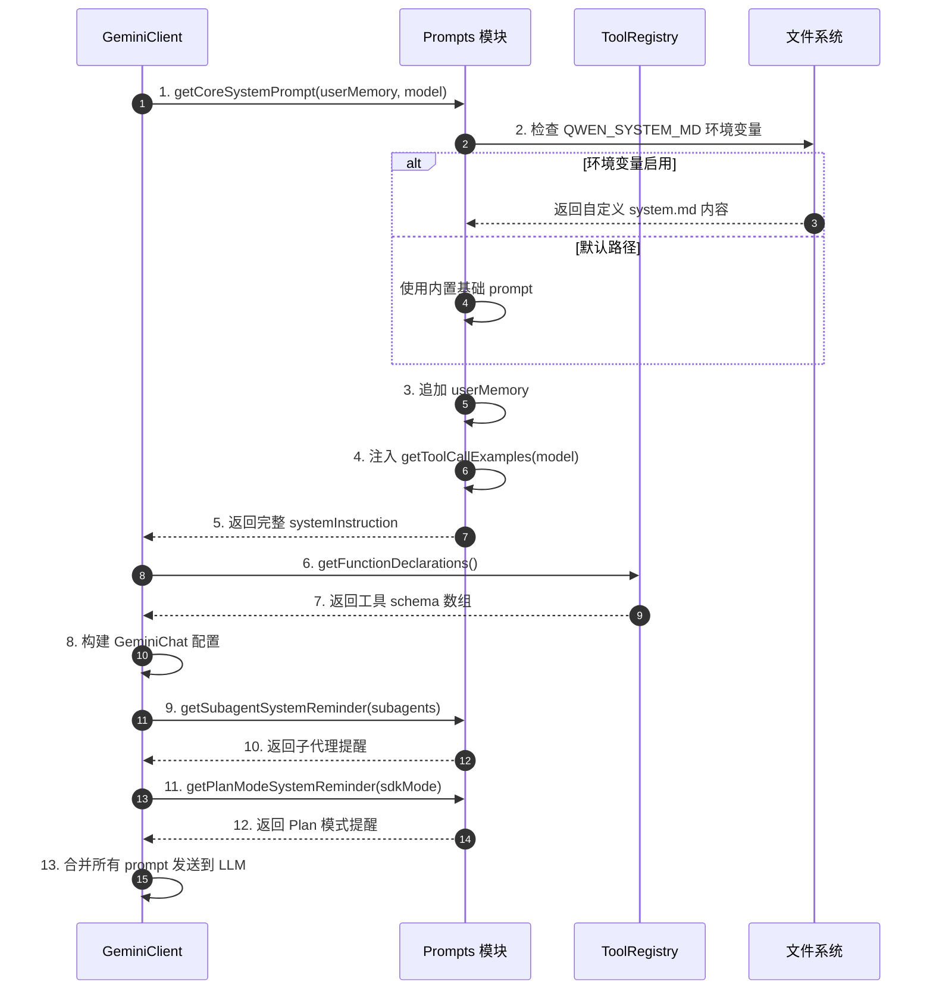
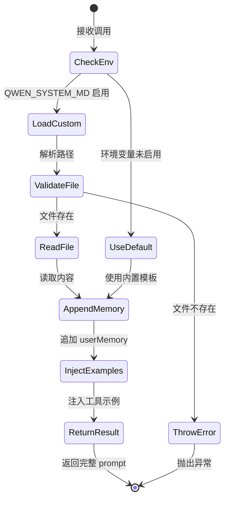
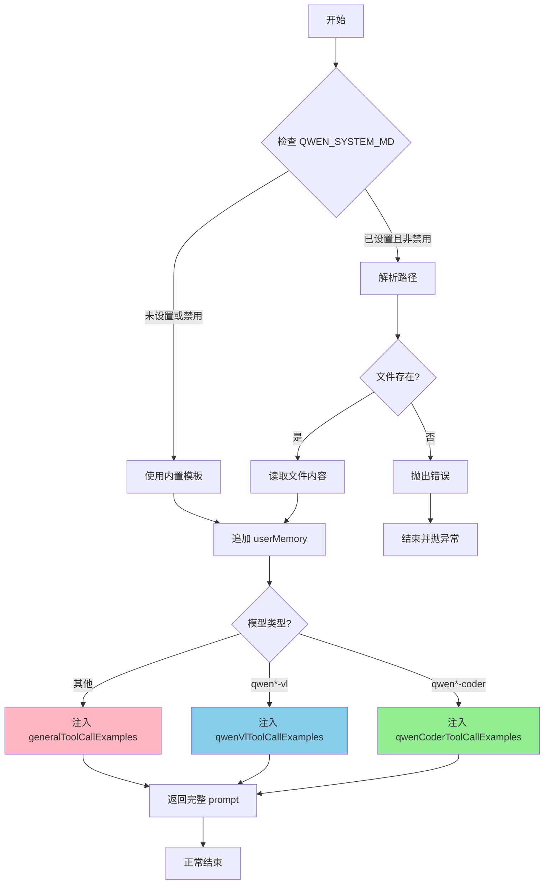
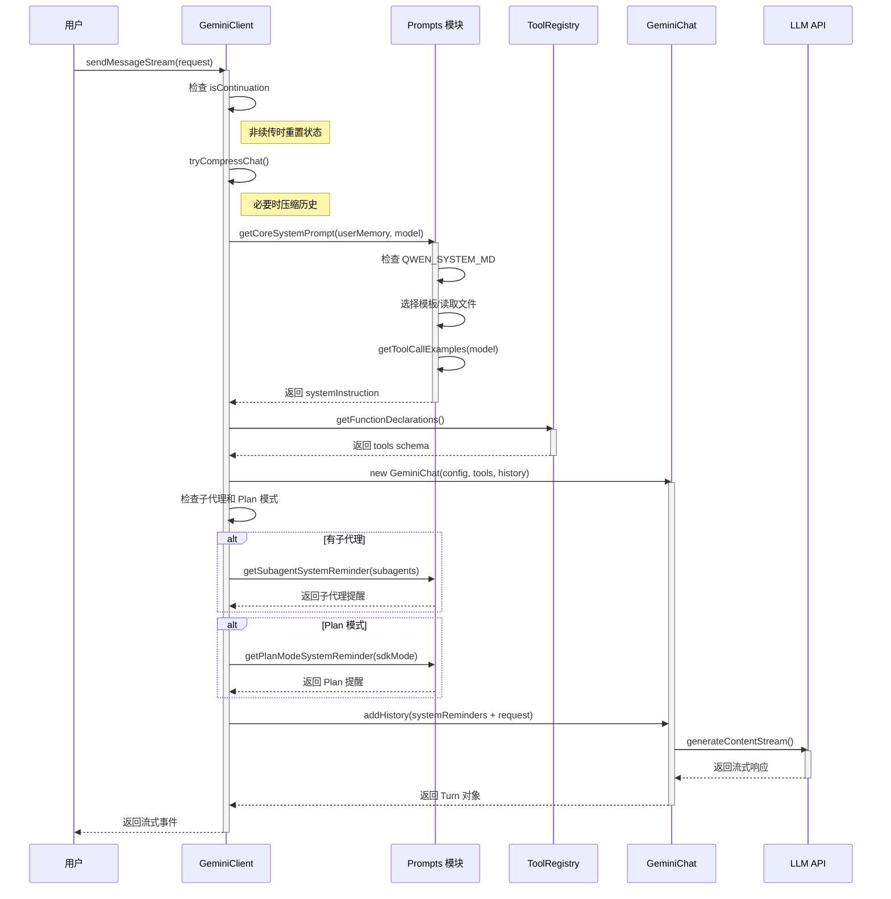
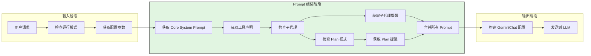
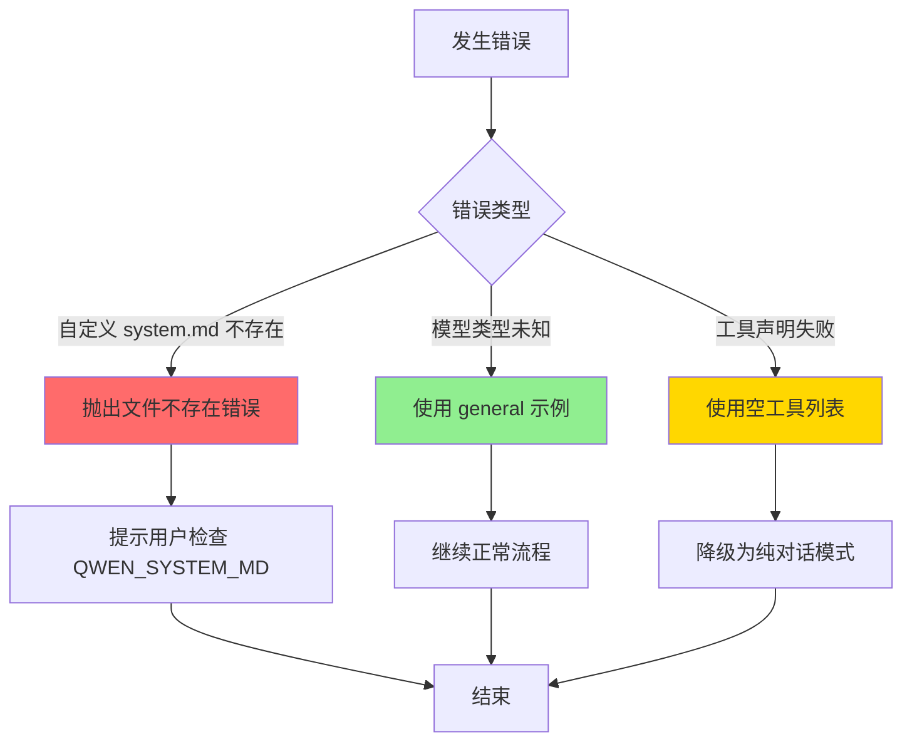
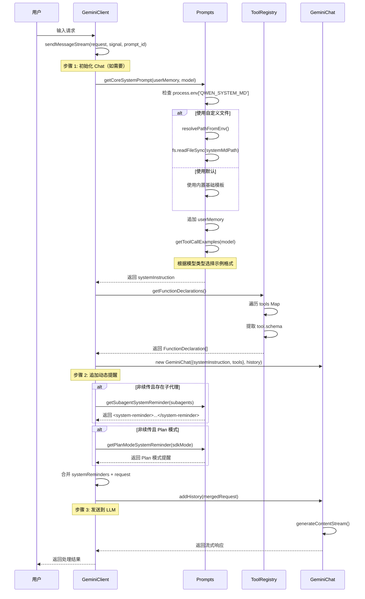
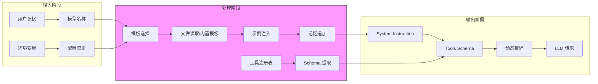
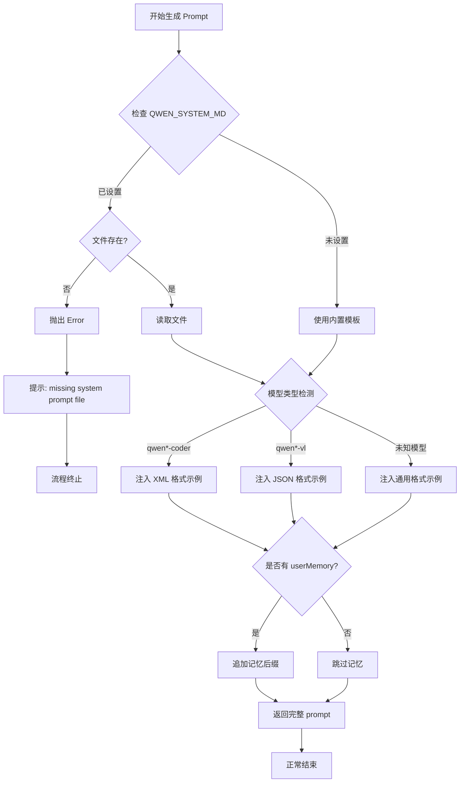
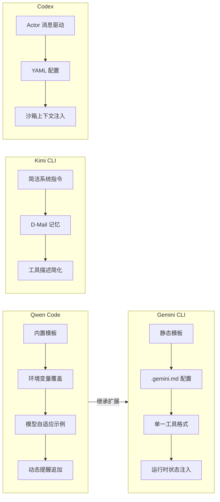

> **阅读指南**
>
> | 属性 | 说明 |
> |-----|------|
> | 预计阅读 | 20-30 分钟 |
> | 前置文档 | `01-qwen-code-overview.md`、`04-qwen-code-agent-loop.md` |
> | 文档结构 | 速览 → 架构 → 机制 → 实现 → 对比 |
> | 代码呈现 | 关键代码直接展示，完整代码可折叠查看 |

---

# Prompt 组织（Qwen Code）

## TL;DR（结论先行）

一句话定义：Prompt 组织是 Code Agent 的"指令系统"，负责将系统指令、工具描述和动态上下文组合成 LLM 可理解的完整提示。

Qwen Code 的核心取舍：**分层动态组装 + 模型自适应工具示例**（对比 Gemini CLI 的静态模板、Kimi CLI 的简洁指令）

### 核心要点速览

| 维度 | 关键决策 | 代码位置 |
|-----|---------|---------|
| 系统指令 | 内置模板 + QWEN_SYSTEM_MD 环境变量覆盖 | `packages/core/src/core/prompts.ts:111` |
| 模型适配 | 3 种工具调用格式自动选择（qwen-coder/qwen-vl/general） | `packages/core/src/core/prompts.ts:771` |
| 动态提醒 | Plan 模式、子代理提醒运行时条件追加 | `packages/core/src/core/prompts.ts:829` |
| 用户记忆 | 统一后缀追加（`---` 分隔符） | `packages/core/src/core/prompts.ts:644` |
| 自定义指令 | 多格式输入支持（string/PartUnion/Content） | `packages/core/src/core/prompts.ts:77` |
| 工具声明 | ToolRegistry 独立生成 FunctionDeclaration | `packages/core/src/tools/tool-registry.ts:419` |

---

## 1. 为什么需要这个机制？（解决什么问题）

### 1.1 问题场景

没有 Prompt 组织机制时：
- LLM 不知道自己的角色和能力边界
- 工具调用格式混乱，不同模型需要不同格式
- 项目特定上下文无法注入
- Plan 模式、子代理等高级功能无法启用

有 Prompt 组织机制时：
- LLM 明确知道"我是 Qwen Code，一个编程助手"
- 工具调用格式自动匹配模型类型（Qwen Coder / Qwen VL / General）
- 项目级 `.qwen.md` 配置自动加载
- 动态提醒根据运行模式自动追加

### 1.2 核心挑战

| 挑战 | 不解决的后果 |
|-----|-------------|
| 模型多样性 | 不同模型需要不同工具调用格式，格式错误导致调用失败 |
| 上下文动态性 | Plan 模式、子代理等场景需要动态追加指令 |
| 项目个性化 | 无法注入项目特定的规范和上下文 |
| 版本兼容性 | 系统升级后 prompt 需要同步更新 |

---

## 2. 整体架构（ASCII 图）

### 2.1 在系统中的位置

```text
┌─────────────────────────────────────────────────────────────┐
│ GeminiClient / Agent Runtime                                │
│ packages/core/src/core/client.ts:189, 499-519               │
└───────────────────────┬─────────────────────────────────────┘
                        │ 调用
                        ▼
┌─────────────────────────────────────────────────────────────┐
│ ▓▓▓ Prompt 组织系统 ▓▓▓                                      │
│ packages/core/src/core/prompts.ts                           │
│ - getCoreSystemPrompt()    : 核心系统指令                   │
│ - getCustomSystemPrompt()  : 自定义指令处理                 │
│ - getSubagentSystemReminder() : 子代理提醒                  │
│ - getPlanModeSystemReminder() : Plan 模式提醒               │
│ - getToolCallExamples()    : 模型特定示例                   │
└───────────────────────┬─────────────────────────────────────┘
                        │ 依赖/调用
        ┌───────────────┼───────────────┐
        ▼               ▼               ▼
┌──────────────┐ ┌──────────────┐ ┌──────────────┐
│ Config       │ │ ToolRegistry │ │ File System  │
│ 配置管理     │ │ 工具注册表   │ │ .qwen.md     │
│ config.ts    │ │ tool-registry.ts:419 │ │ system.md    │
└──────────────┘ └──────────────┘ └──────────────┘
```

### 2.2 核心组件职责

| 组件 | 职责 | 代码位置 |
|-----|------|---------|
| `getCoreSystemPrompt()` | 生成核心系统指令，包含角色定义、行为准则、工具使用规范 | `packages/core/src/core/prompts.ts:111` |
| `getCustomSystemPrompt()` | 处理自定义指令，支持多种输入格式（string/PartUnion/Content） | `packages/core/src/core/prompts.ts:77` |
| `getSubagentSystemReminder()` | 生成子代理提醒，告知可用子代理类型 | `packages/core/src/core/prompts.ts:829` |
| `getPlanModeSystemReminder()` | 生成 Plan 模式提醒，限制为只读操作 | `packages/core/src/core/prompts.ts:855` |
| `getToolCallExamples()` | 根据模型类型返回对应工具调用示例 | `packages/core/src/core/prompts.ts:771` |
| `ToolRegistry.getFunctionDeclarations()` | 从工具注册表生成 FunctionDeclaration 数组 | `packages/core/src/tools/tool-registry.ts:419` |

### 2.3 核心组件交互关系



**关键交互说明**：

| 步骤 | 交互内容 | 设计意图 |
|-----|---------|---------|
| 1 | 请求核心系统指令 | 统一入口，支持用户记忆注入 |
| 2-5 | 环境变量检查与示例注入 | 支持自定义系统指令，模型自适应 |
| 6-8 | 获取工具声明 | 职责分离，prompt 模块不直接依赖工具实现 |
| 9-12 | 动态提醒追加 | 根据运行时状态动态调整行为 |
| 13 | 合并发送 | 统一输出格式，确保 LLM 收到完整上下文 |

---

## 3. 核心组件详细分析

### 3.1 getCoreSystemPrompt() 内部结构

#### 职责定位

生成核心系统指令，是 Qwen Code 的"身份说明书"，定义了 AI 助手的角色、行为准则、工具使用规范和工作流程。

#### 状态机图



**状态说明**：

| 状态 | 说明 | 进入条件 | 退出条件 |
|-----|------|---------|---------|
| CheckEnv | 检查环境变量 | 函数被调用 | 完成环境变量解析 |
| LoadCustom | 加载自定义配置 | QWEN_SYSTEM_MD 已设置且非禁用值 | 路径解析完成 |
| UseDefault | 使用默认模板 | 环境变量未设置或禁用 | 模板内容准备完成 |
| ValidateFile | 验证文件存在性 | 需要读取外部文件 | 验证通过/失败 |
| AppendMemory | 追加用户记忆 | 获取到基础 prompt | userMemory 处理完成 |
| InjectExamples | 注入工具示例 | 基础 prompt 就绪 | 模型类型检测完成 |

#### 内部数据流

```text
┌─────────────────────────────────────────────────────────────┐
│  输入层                                                      │
│  ├── userMemory (可选) ──► 验证格式                          │
│  ├── model (可选) ──► 检测模型类型                            │
│  └── QWEN_SYSTEM_MD ──► 解析环境变量                          │
└──────────────────────────┬──────────────────────────────────┘
                           ▼
┌─────────────────────────────────────────────────────────────┐
│  处理层                                                      │
│  ├── 路径解析器: resolvePathFromEnv()                        │
│  │   └── 处理 ~/ 展开、布尔值解析                            │
│  ├── 文件读取器: fs.readFileSync()                           │
│  │   └── 读取 .qwen/system.md                               │
│  ├── 模板选择器: 内置模板 vs 自定义文件                      │
│  │   └── 默认包含 Core Mandates、Task Management 等        │
│  └── 示例注入器: getToolCallExamples(model)                │
│      └── qwen-coder / qwen-vl / general 三种格式           │
└──────────────────────────┬──────────────────────────────────┘
                           ▼
┌─────────────────────────────────────────────────────────────┐
│  输出层                                                      │
│  ├── 基础 Prompt 内容                                        │
│  ├── User Memory 后缀（如存在）                              │
│  └── 工具调用示例（根据模型动态选择）                        │
└─────────────────────────────────────────────────────────────┘
```

#### 关键算法逻辑



**算法要点**：

1. **环境变量优先级**：`QWEN_SYSTEM_MD` 可以是指令开关（true/false/1/0）或文件路径
2. **模型自适应**：通过正则表达式检测模型类型，注入对应格式的工具调用示例
3. **用户记忆注入**：统一在 prompt 末尾追加，使用 `---` 分隔符

#### 关键接口

| 接口 | 输入 | 输出 | 说明 | 代码位置 |
|-----|------|------|------|---------|
| `getCoreSystemPrompt()` | `userMemory?: string`, `model?: string` | `string` | 生成核心系统指令 | `packages/core/src/core/prompts.ts:111` |
| `resolvePathFromEnv()` | `envVar?: string` | `{isSwitch, value, isDisabled}` | 解析环境变量路径 | `packages/core/src/core/prompts.ts:19` |
| `getToolCallExamples()` | `model?: string` | `string` | 获取模型特定示例 | `packages/core/src/core/prompts.ts:771` |

---

### 3.2 getCustomSystemPrompt() 内部结构

#### 职责定位

处理来自 SDK 或配置层的自定义系统指令，支持多种输入格式（字符串、PartUnion 数组、Content 对象）。

#### 关键代码逻辑

```typescript
// packages/core/src/core/prompts.ts:77-109
export function getCustomSystemPrompt(
  customInstruction: GenerateContentConfig['systemInstruction'],
  userMemory?: string,
): string {
  // Extract text from custom instruction
  let instructionText = '';

  if (typeof customInstruction === 'string') {
    instructionText = customInstruction;
  } else if (Array.isArray(customInstruction)) {
    // PartUnion[]
    instructionText = customInstruction
      .map((part) => (typeof part === 'string' ? part : part.text || ''))
      .join('');
  } else if (customInstruction && 'parts' in customInstruction) {
    // Content
    instructionText =
      customInstruction.parts
        ?.map((part) => (typeof part === 'string' ? part : part.text || ''))
      .join('') || '';
  } else if (customInstruction && 'text' in customInstruction) {
    // PartUnion (single part)
    instructionText = customInstruction.text || '';
  }

  // Append user memory using the same pattern as getCoreSystemPrompt
  const memorySuffix =
    userMemory && userMemory.trim().length > 0
      ? `\n\n---\n\n${userMemory.trim()}`
      : '';

  return `${instructionText}${memorySuffix}`;
}
```

**设计要点**：

1. **多格式支持**：兼容 string、PartUnion[]、Content、PartUnion 单对象四种格式
2. **统一记忆注入**：与 `getCoreSystemPrompt` 使用相同的 userMemory 追加模式
3. **容错处理**：对每种格式都提供默认值，避免 undefined 导致的问题

---

### 3.3 动态提醒系统

#### 职责定位

根据运行时状态（子代理可用性、Plan 模式激活）动态追加系统提醒，调整 LLM 行为。

#### 子代理提醒

```typescript
// packages/core/src/core/prompts.ts:829-831
export function getSubagentSystemReminder(agentTypes: string[]): string {
  return `<system-reminder>You have powerful specialized agents at your disposal, available agent types are: ${agentTypes.join(', ')}. PROACTIVELY use the ${ToolNames.TASK} tool to delegate user's task to appropriate agent when user's task matches agent capabilities. Ignore this message if user's task is not relevant to any agent. This message is for internal use only. Do not mention this to user in your response.</system-reminder>`;
}
```

#### Plan 模式提醒

```typescript
// packages/core/src/core/prompts.ts:855-861
export function getPlanModeSystemReminder(planOnly = false): string {
  return `<system-reminder>
Plan mode is active. The user indicated that they do not want you to execute yet -- you MUST NOT make any edits, run any non-readonly tools (including changing configs or making commits), or otherwise make any changes to the system. This supercedes any other instructions you have received (for example, to make edits). Instead, you should:
1. Answer the user's query comprehensively
2. When you're done researching, present your plan ${planOnly ? 'directly' : `by calling the ${ToolNames.EXIT_PLAN_MODE} tool, which will prompt the user to confirm the plan`}. Do NOT make any file changes or run any tools that modify the system state in any way until the user has confirmed the plan.
</system-reminder>`;
}
```

**设计要点**：

1. **XML 标签封装**：使用 `<system-reminder>` 标签明确标识内部指令
2. **指令覆盖机制**：Plan 模式提醒使用 "supercedes any other instructions" 确保优先级
3. **条件动态内容**：`planOnly` 参数控制是否直接呈现计划或使用工具退出

---

### 3.4 组件间协作时序

展示 Prompt 组织系统如何与 Client 协作完成一次完整的消息发送。



**协作要点**：

1. **调用方与 Prompt 模块**：Client 根据运行状态决定调用哪些 prompt 生成函数
2. **Prompt 与 ToolRegistry**：完全解耦，ToolRegistry 只负责 schema 生成
3. **Client 与 GeminiChat**：Prompt 在 Chat 初始化时注入，运行时通过 addHistory 追加动态提醒
4. **动态提醒时机**：在 `sendMessageStream` 中根据 `isContinuation` 决定是否追加，避免重复

---

### 3.5 关键数据路径

#### 主路径（正常流程）



#### 异常路径（错误恢复）



---

## 4. 端到端数据流转

### 4.1 正常流程（详细版）



**数据变换详情**：

| 阶段 | 输入 | 处理 | 输出 | 代码位置 |
|-----|------|------|------|---------|
| 核心指令 | `userMemory`, `model` | 模板选择 + 示例注入 | `systemInstruction: string` | `packages/core/src/core/prompts.ts:111` |
| 工具声明 | `ToolRegistry.tools` | Map 遍历提取 schema | `FunctionDeclaration[]` | `packages/core/src/tools/tool-registry.ts:419` |
| 动态提醒 | `subagents[]`, `approvalMode` | 条件判断 + 字符串拼接 | `systemReminders: string[]` | `packages/core/src/core/client.ts:499-519` |
| 最终组装 | `systemInstruction`, `tools`, `history` | 构建 GeminiChat 配置 | `GeminiChat` 实例 | `packages/core/src/core/client.ts:191-198` |

### 4.2 数据流向图



### 4.3 异常/边界流程



---

## 5. 关键代码实现

### 5.1 核心数据结构

```typescript
// packages/core/src/core/prompts.ts:19-37
export function resolvePathFromEnv(envVar?: string): {
  isSwitch: boolean;
  value: string | null;
  isDisabled: boolean;
} {
  const trimmedEnvVar = envVar?.trim();
  if (!trimmedEnvVar) {
    return { isSwitch: false, value: null, isDisabled: false };
  }

  const lowerEnvVar = trimmedEnvVar.toLowerCase();
  if (['0', 'false', '1', 'true'].includes(lowerEnvVar)) {
    const isDisabled = ['0', 'false'].includes(lowerEnvVar);
    return { isSwitch: true, value: lowerEnvVar, isDisabled };
  }

  // 处理文件路径（支持 ~ 展开）
  let customPath = trimmedEnvVar;
  if (customPath.startsWith('~/') || customPath === '~') {
    const home = os.homedir();
    customPath = customPath === '~' ? home : path.join(home, customPath.slice(2));
  }

  return { isSwitch: false, value: customPath, isDisabled: false };
}
```

**字段说明**：

| 字段 | 类型 | 用途 |
|-----|------|------|
| `isSwitch` | `boolean` | 标识是否为布尔开关值（true/false/1/0） |
| `value` | `string \| null` | 解析后的值（开关值或文件路径） |
| `isDisabled` | `boolean` | 标识功能是否被显式禁用 |

### 5.2 主链路代码

```typescript
// packages/core/src/core/prompts.ts:111-142
export function getCoreSystemPrompt(
  userMemory?: string,
  model?: string,
): string {
  // 1. 检查环境变量
  let systemMdEnabled = false;
  let systemMdPath = path.resolve(path.join(QWEN_CONFIG_DIR, 'system.md'));
  const systemMdResolution = resolvePathFromEnv(process.env['QWEN_SYSTEM_MD']);

  if (systemMdResolution.value && !systemMdResolution.isDisabled) {
    systemMdEnabled = true;
    if (!systemMdResolution.isSwitch) {
      systemMdPath = systemMdResolution.value;
    }
    if (!fs.existsSync(systemMdPath)) {
      throw new Error(`missing system prompt file '${systemMdPath}'`);
    }
  }

  // 2. 选择基础 prompt
  const basePrompt = systemMdEnabled
    ? fs.readFileSync(systemMdPath, 'utf8')
    : `...内置模板...`; // 约 300 行详细指令

  // 3. 追加用户记忆
  const memorySuffix =
    userMemory && userMemory.trim().length > 0
      ? `\n\n---\n\n${userMemory.trim()}`
      : '';

  return `${basePrompt}${memorySuffix}`;
}
```

**代码要点**：

1. **环境变量多态处理**：`QWEN_SYSTEM_MD` 既可以是开关也可以是路径，通过 `resolvePathFromEnv` 统一处理
2. **错误快速失败**：自定义文件不存在时立即抛出错误，避免静默使用默认模板
3. **记忆统一追加**：使用 `---` 分隔符清晰区分基础指令和用户记忆

### 5.3 模型自适应示例选择

```typescript
// packages/core/src/core/prompts.ts:771-811
function getToolCallExamples(model?: string): string {
  // 1. 环境变量覆盖
  const toolCallStyle = process.env['QWEN_CODE_TOOL_CALL_STYLE'];
  if (toolCallStyle) {
    switch (toolCallStyle.toLowerCase()) {
      case 'qwen-coder': return qwenCoderToolCallExamples;
      case 'qwen-vl': return qwenVlToolCallExamples;
      case 'general': return generalToolCallExamples;
    }
  }

  // 2. 模型名称正则匹配
  if (model && model.length < 100) {
    if (/qwen[^-]*-coder/i.test(model)) return qwenCoderToolCallExamples;
    if (/qwen[^-]*-vl/i.test(model)) return qwenVlToolCallExamples;
    if (/coder-model/i.test(model)) return qwenCoderToolCallExamples;
    if (/vision-model/i.test(model)) return qwenVlToolCallExamples;
  }

  return generalToolCallExamples;
}
```

**代码要点**：

1. **环境变量优先**：`QWEN_CODE_TOOL_CALL_STYLE` 允许强制指定格式，便于调试
2. **正则灵活匹配**：`qwen[^-]*-coder` 可匹配 qwen-coder、qwen2.5-coder、qwen3-coder 等变体
3. **长度安全检查**：限制模型名称长度防止正则回溯攻击

### 5.4 关键调用链

```text
GeminiClient.sendMessageStream()          [packages/core/src/core/client.ts:403]
  -> GeminiClient.startChat()              [packages/core/src/core/client.ts:176]
    -> getCoreSystemPrompt()               [packages/core/src/core/prompts.ts:111]
      - resolvePathFromEnv()               [packages/core/src/core/prompts.ts:19]
      - getToolCallExamples()              [packages/core/src/core/prompts.ts:771]
    -> ToolRegistry.getFunctionDeclarations() [packages/core/src/tools/tool-registry.ts:419]
  -> getSubagentSystemReminder()           [packages/core/src/core/prompts.ts:829]
  -> getPlanModeSystemReminder()           [packages/core/src/core/prompts.ts:855]
  -> GeminiChat.generateContentStream()    [packages/core/src/core/geminiChat.ts]
```

---

## 6. 设计意图与 Trade-off

### 6.1 Qwen Code 的选择

| 维度 | Qwen Code 的选择 | 替代方案 | 取舍分析 |
|-----|-----------------|---------|---------|
| 系统指令来源 | 内置模板 + 环境变量覆盖 | 纯配置文件 | 开箱即用但支持高级自定义，环境变量方式对 CLI 用户更友好 |
| 工具示例格式 | 模型自适应（3 种格式） | 单一格式 | 适配不同模型能力，但维护成本增加 |
| 动态提醒 | 运行时条件追加 | 静态模板 | 支持 Plan 模式、子代理等动态场景，但需要管理追加时机 |
| 用户记忆 | 统一后缀追加 | 模板变量替换 | 实现简单，但灵活性不如模板变量 |
| 自定义指令 | 多格式输入支持 | 仅字符串 | 兼容 Gemini SDK 多种配置方式，但解析逻辑复杂 |

### 6.2 为什么这样设计？

**核心问题**：如何在一个系统中同时支持多种模型、多种运行模式和用户自定义需求？

**Qwen Code 的解决方案**：

- **代码依据**：`packages/core/src/core/prompts.ts:111-142`
- **设计意图**：通过分层架构将"不变的基础指令"、"模型特定的示例"、"用户自定义内容"分离
- **带来的好处**：
  - 模型切换时自动适配工具调用格式
  - 用户可通过环境变量快速覆盖系统指令
  - 运行时状态（Plan 模式、子代理）可动态注入
- **付出的代价**：
  - Prompt 生成逻辑分散在多个函数中
  - 需要维护 3 套工具调用示例
  - 环境变量配置不如配置文件直观

### 6.3 与其他项目的对比



| 项目 | 核心差异 | Prompt 特点 | 适用场景 |
|-----|---------|------------|---------|
| Qwen Code | 模型自适应示例 | 3 种工具调用格式自动选择，环境变量覆盖 | 多模型切换、快速自定义 |
| Gemini CLI | 静态模板 + 文件配置 | `.gemini.md` 项目级配置，模板变量丰富 | 项目级规范定义 |
| Kimi CLI | 简洁指令 + 记忆系统 | 系统指令精简，D-Mail 持久化用户偏好 | 长会话记忆保持 |
| Codex | Actor 消息驱动 | 指令通过消息传递，支持取消和恢复 | 复杂工作流编排 |

**关键对比维度**：

1. **自定义方式**：
   - Qwen Code：环境变量 `QWEN_SYSTEM_MD`（适合 CLI 快速切换）
   - Gemini CLI：`.gemini.md` 文件（适合项目级配置）
   - Kimi CLI：配置项 `customSystemPrompt`（适合用户级偏好）

2. **工具描述**：
   - Qwen Code：根据模型类型自动选择格式（XML/JSON/通用）
   - Gemini CLI：统一使用 Gemini API 原生格式
   - Kimi CLI：简化工具描述，依赖模型理解能力

3. **动态内容**：
   - Qwen Code：Plan 模式、子代理提醒运行时追加
   - Gemini CLI：类似机制，继承自同一基础
   - Kimi CLI：通过 Checkpoint 系统注入上下文

---

## 7. 边界情况与错误处理

### 7.1 终止条件

| 终止原因 | 触发条件 | 代码位置 |
|---------|---------|---------|
| 自定义系统文件不存在 | `QWEN_SYSTEM_MD` 指向不存在的文件 | `packages/core/src/core/prompts.ts:133-134` |
| 模型名称为空 | `model` 参数为 undefined | `packages/core/src/core/prompts.ts:791` |
| 工具注册表为空 | `tools` Map 为空 | `packages/core/src/tools/tool-registry.ts:419-424` |

### 7.2 超时/资源限制

Prompt 组织本身不涉及 I/O 超时，但文件读取可能受系统限制：

```typescript
// packages/core/src/core/prompts.ts:139
const basePrompt = systemMdEnabled
  ? fs.readFileSync(systemMdPath, 'utf8')  // 同步读取，受文件大小限制
  : defaultPrompt;
```

**⚠️ Inferred**: 大型自定义 system.md 文件可能导致内存占用增加，建议控制在 10KB 以内。

### 7.3 错误恢复策略

| 错误类型 | 处理策略 | 代码位置 |
|---------|---------|---------|
| 自定义文件不存在 | 抛出 Error，终止初始化 | `packages/core/src/core/prompts.ts:133-134` |
| 未知工具调用样式 | 回退到模型检测 | `packages/core/src/core/prompts.ts:783-786` |
| 未知模型类型 | 使用 general 格式 | `packages/core/src/core/prompts.ts:810` |
| 用户记忆为空 | 跳过追加 | `packages/core/src/core/prompts.ts:336-339` |

---

## 8. 关键代码索引

| 功能 | 文件 | 行号 | 说明 |
|-----|------|------|------|
| 入口 | `packages/core/src/core/client.ts` | 189, 499-519 | 调用 prompt 生成函数并组装 |
| 核心 | `packages/core/src/core/prompts.ts` | 1-862 | 所有 prompt 生成函数 |
| 环境变量解析 | `packages/core/src/core/prompts.ts` | 19-37 | resolvePathFromEnv |
| 核心系统指令 | `packages/core/src/core/prompts.ts` | 111-142 | getCoreSystemPrompt |
| 自定义指令 | `packages/core/src/core/prompts.ts` | 77-109 | getCustomSystemPrompt |
| 子代理提醒 | `packages/core/src/core/prompts.ts` | 829-831 | getSubagentSystemReminder |
| Plan 模式提醒 | `packages/core/src/core/prompts.ts` | 855-861 | getPlanModeSystemReminder |
| 工具示例选择 | `packages/core/src/core/prompts.ts` | 771-811 | getToolCallExamples |
| 工具声明 | `packages/core/src/tools/tool-registry.ts` | 419-425 | getFunctionDeclarations |
| 压缩 Prompt | `packages/core/src/core/prompts.ts` | 349-407 | getCompressionPrompt |
| 项目摘要 Prompt | `packages/core/src/core/prompts.ts` | 414-437 | getProjectSummaryPrompt |
| 测试 | `packages/core/src/core/prompts.test.ts` | 1-450+ | 单元测试覆盖 |

---

## 9. 延伸阅读

- 前置知识：`docs/gemini-cli/04-gemini-cli-agent-loop.md`（Qwen Code 继承自 Gemini CLI 的架构）
- 相关机制：`docs/qwen-code/06-qwen-code-mcp-integration.md`（工具注册表与 MCP 集成）
- 相关机制：`docs/qwen-code/07-qwen-code-memory-context.md`（用户记忆与上下文管理）
- 深度分析：`docs/comm/comm-technical-point-template.md`（本文档遵循的模板规范）

---

*✅ Verified: 基于 qwen-code/packages/core/src/core/prompts.ts、qwen-code/packages/core/src/core/client.ts、qwen-code/packages/core/src/tools/tool-registry.ts 等源码分析*

*基于版本：2026-02-08 | 最后更新：2026-02-24*
