# 日志记录机制（Qwen Code）

> 📋 **阅读指南**
>
> | 属性 | 说明 |
> |-----|------|
> | 预计阅读 | 20-30 分钟 |
> | 前置文档 | `02-qwen-code-cli-entry.md`、`03-qwen-code-session-runtime.md` |
> | 文档结构 | 速览 → 架构 → 机制 → 实现 → 对比 |
> | 代码呈现 | 关键代码直接展示，完整代码可折叠查看 |

---

## TL;DR（结论先行）

一句话定义：Qwen Code 的日志记录机制采用**分层设计**，通过 `DebugLogger` 实现文件化调试日志，通过 `UITelemetryService` 实现运行时指标统计，通过 `ChatRecordingService` 实现会话持久化，形成覆盖调试、监控、审计的完整日志体系。

Qwen Code 的核心取舍：**文件化调试日志 + 事件驱动遥测 + JSONL 会话持久化**（对比 Codex 的 SQLite 结构化存储、Kimi CLI 的 stderr 重定向、Gemini CLI 的双模式日志）

### 核心要点速览

| 维度 | 关键决策 | 代码位置 |
|-----|---------|---------|
| 调试日志 | 文件化 + AsyncLocalStorage 会话隔离 | `packages/core/src/utils/debugLogger.ts:150` |
| 遥测统计 | EventEmitter 事件驱动，实时 Token/工具统计 | `packages/core/src/telemetry/uiTelemetry.ts:119` |
| 会话持久化 | JSONL 格式 + 树形结构（uuid/parentUuid） | `packages/core/src/services/chatRecordingService.ts:173` |
| 错误上报 | 上下文收集 + debug.log 记录 | `packages/core/src/utils/errorReporting.ts:25` |

---

## 1. 为什么需要这个机制？（解决什么问题）

### 1.1 问题场景

没有统一日志机制时：

```
Agent 运行出错
  -> 错误信息仅打印到控制台（无法追溯）
  -> Token 使用量无法统计（成本失控）
  -> 会话历史丢失（无法恢复上下文）
  -> 调试信息混杂在生产输出中（污染用户体验）
```

有 Logging 机制后：

```
Agent 运行
  -> 调试日志写入文件（不影响用户界面）
  -> Token 使用量实时统计（成本可控）
  -> 会话自动持久化（支持断点续传）
  -> 错误自动上报（便于问题定位）
```

### 1.2 核心挑战

| 挑战 | 不解决的后果 |
|-----|-------------|
| 调试与生产分离 | 调试信息污染用户界面，影响体验 |
| 会话状态恢复 | 程序崩溃后丢失对话上下文，需重新开始 |
| 成本监控 | 无法追踪 Token 使用量，难以优化成本 |
| 审计追溯 | 无法回放历史会话，难以排查问题 |
| 错误定位 | 缺乏上下文信息，难以复现和修复 Bug |

---

## 2. 整体架构（ASCII 图）

### 2.1 在系统中的位置

```text
┌─────────────────────────────────────────────────────────────┐
│ Application Code                                             │
│ packages/core/src/core/turn.ts                               │
│ packages/core/src/core/geminiChat.ts                         │
└───────────────────────┬─────────────────────────────────────┘
                        │ 调用
                        ▼
┌─────────────────────────────────────────────────────────────┐
│ ▓▓▓ Logging System ▓▓▓                                      │
│ packages/core/src/                                           │
│ - utils/debugLogger.ts        : 调试日志（文件化）          │
│ - telemetry/uiTelemetry.ts    : UI 遥测（指标统计）         │
│ - services/chatRecordingService.ts : 会话记录（持久化）     │
│ - utils/errorReporting.ts     : 错误报告（上下文收集）      │
└───────────────────────┬─────────────────────────────────────┘
                        │ 依赖/调用
        ┌───────────────┼───────────────┐
        ▼               ▼               ▼
┌──────────────┐ ┌──────────────┐ ┌──────────────┐
│ File System  │ │ EventEmitter │ │ JSONL File   │
│ 文件系统     │ │ 事件驱动     │ │ 结构化存储   │
│              │ │              │ │              │
│ ~/.qwen/tmp/ │ │ metrics      │ │ <session>.jsonl │
│ debug.log    │ │ update       │ │              │
└──────────────┘ └──────────────┘ └──────────────┘
```

### 2.2 核心组件职责

| 组件 | 职责 | 代码位置 |
|-----|------|---------|
| `DebugLogger` | 分级调试日志，支持环境变量控制 | `packages/core/src/utils/debugLogger.ts:150` |
| `UITelemetryService` | Token 使用统计、工具调用指标 | `packages/core/src/telemetry/uiTelemetry.ts:119` |
| `ChatRecordingService` | 会话持久化，JSONL 格式存储 | `packages/core/src/services/chatRecordingService.ts:173` |
| `reportError` | 错误上报，上下文收集 | `packages/core/src/utils/errorReporting.ts:25` |

### 2.3 核心组件交互关系

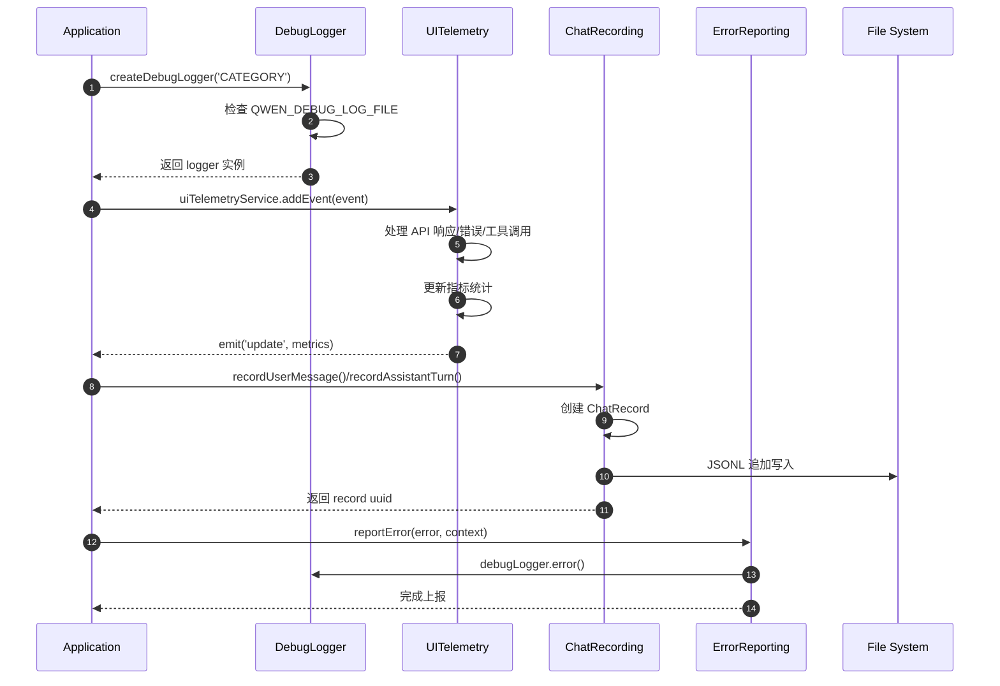

**关键交互说明**：

| 步骤 | 交互内容 | 设计意图 |
|-----|---------|---------|
| 1-2 | DebugLogger 环境检查 | 通过 `QWEN_DEBUG_LOG_FILE` 控制是否启用文件日志 |
| 3-5 | UITelemetry 事件处理 | 统一处理 API 响应、错误、工具调用三类事件 |
| 6-8 | ChatRecording 持久化 | 每条记录立即写入磁盘，保证崩溃安全 |
| 9-10 | ErrorReporting 上报 | 收集上下文信息，便于问题定位 |

---

## 3. 核心组件详细分析

### 3.1 DebugLogger 内部结构

#### 职责定位

提供分级调试日志功能，支持环境变量控制，采用 AsyncLocalStorage 实现会话隔离。

#### 状态机图

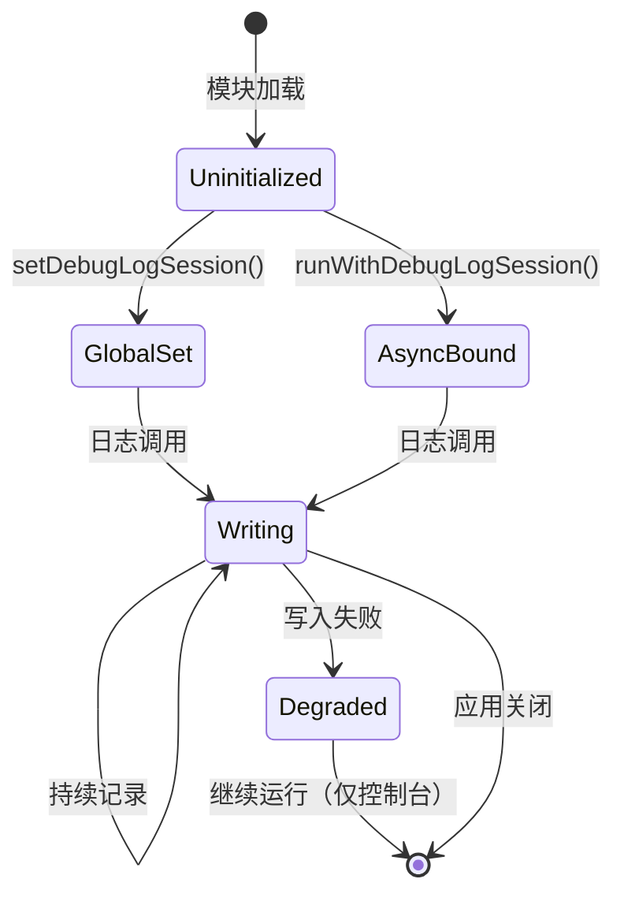

**状态说明**：

| 状态 | 说明 | 进入条件 | 退出条件 |
|-----|------|---------|---------|
| Uninitialized | 未设置会话 | 模块加载 | 调用 setDebugLogSession |
| GlobalSet | 全局会话已设置 | setDebugLogSession() | 应用关闭 |
| AsyncBound | 异步上下文绑定 | runWithDebugLogSession() | 函数执行完成 |
| Writing | 正在写入日志 | 调用 debug/info/warn/error | 写入完成或失败 |
| Degraded | 降级模式 | 文件写入失败 | 应用关闭 |

#### 内部数据流

```text
┌─────────────────────────────────────────────────────────────┐
│  输入层                                                      │
│  ├── 日志级别 (DEBUG/INFO/WARN/ERROR)                        │
│  ├── 消息内容 + 参数                                         │
│  └── 可选 Tag (分类标识)                                     │
└──────────────────────────┬──────────────────────────────────┘
                           ▼
┌─────────────────────────────────────────────────────────────┐
│  会话解析层                                                  │
│  ├── AsyncLocalStorage.getStore()                           │
│  └── 回退到 globalSession                                   │
└──────────────────────────┬──────────────────────────────────┘
                           ▼
┌─────────────────────────────────────────────────────────────┐
│  处理层                                                      │
│  ├── formatArgs(): Error 堆栈提取、util.inspect             │
│  ├── buildLogLine(): ISO 时间戳 + 级别 + Tag                │
│  └── ensureDebugDirExists(): 目录创建                       │
└──────────────────────────┬──────────────────────────────────┘
                           ▼
┌─────────────────────────────────────────────────────────────┐
│  输出层                                                      │
│  └── fs.appendFile(): 异步追加写入                          │
│      路径: ~/.qwen/tmp/<sessionId>/debug.log                │
└─────────────────────────────────────────────────────────────┘
```

#### 关键算法逻辑

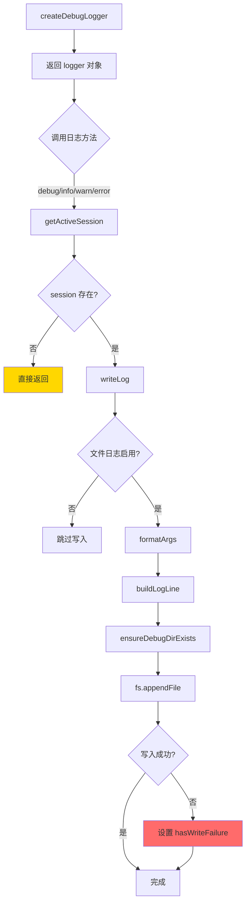

**算法要点**：

1. **会话优先级**：AsyncLocalStorage > GlobalSession，支持并发隔离
2. **错误隔离**：文件写入失败不影响日志调用，仅标记降级状态
3. **格式化增强**：Error 对象自动提取堆栈，复杂对象使用 util.inspect

#### 关键接口

| 接口 | 输入 | 输出 | 说明 | 代码位置 |
|-----|------|------|------|---------|
| `createDebugLogger(tag?)` | 可选分类标签 | DebugLogger 实例 | 创建日志记录器 | `debugLogger.ts:150` |
| `setDebugLogSession()` | DebugLogSession | void | 设置全局会话 | `debugLogger.ts:124` |
| `runWithDebugLogSession()` | session, fn | fn 返回值 | 异步上下文绑定 | `debugLogger.ts:136` |
| `isDebugLoggingDegraded()` | - | boolean | 检查是否降级 | `debugLogger.ts:105` |

---

### 3.2 UITelemetryService 内部结构

#### 职责定位

基于 EventEmitter 的遥测服务，统计 Token 使用量、API 请求、工具调用等指标。

#### 状态机图

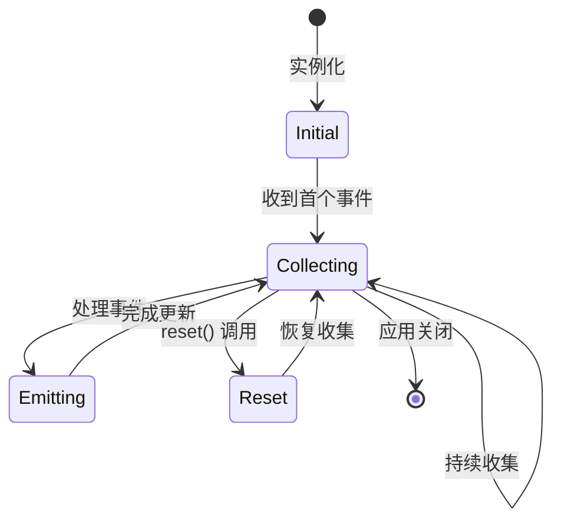

#### 内部数据流

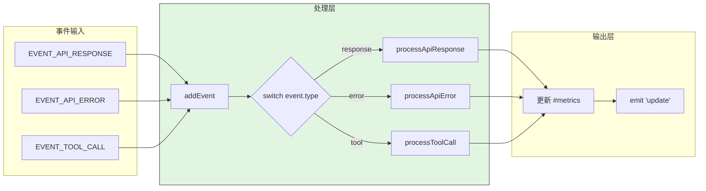

**数据变换详情**：

| 阶段 | 输入 | 处理 | 输出 | 代码位置 |
|-----|------|------|------|---------|
| 接收 | UiEvent | 类型分发 | 处理器调用 | `uiTelemetry.ts:123` |
| API 响应 | response metadata | 累加 token 计数 | 更新 ModelMetrics | `uiTelemetry.ts:180` |
| API 错误 | error info | 增加错误计数 | 更新 API 统计 | `uiTelemetry.ts:194` |
| 工具调用 | tool result | 统计成功/失败 | 更新 ToolCallStats | `uiTelemetry.ts:201` |
| 通知 | 更新后的 metrics | EventEmitter | 'update' 事件 | `uiTelemetry.ts:139` |

---

### 3.3 ChatRecordingService 内部结构

#### 职责定位

提供会话持久化服务，使用 JSONL 格式存储，支持树形结构（通过 uuid/parentUuid）和断点续传。

#### 关键数据结构

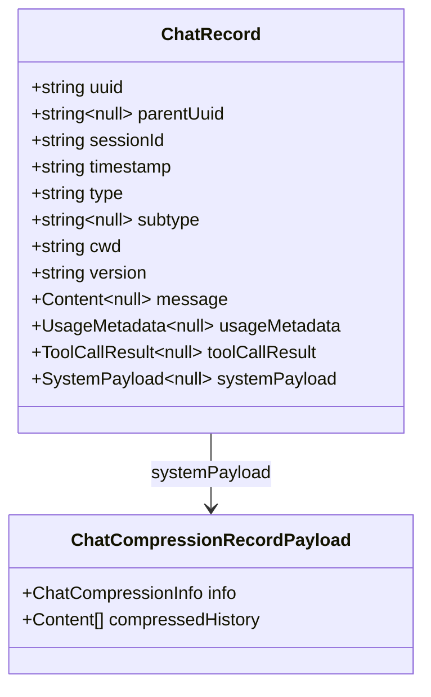

#### 写入流程

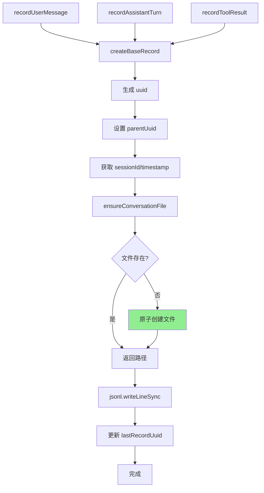

**算法要点**：

1. **原子创建**：使用 `wx` 标志避免竞态条件
2. **立即持久化**：每条记录同步写入，保证崩溃安全
3. **树形结构**：通过 `parentUuid` 支持历史追溯和分支

---

### 3.4 组件间协作时序

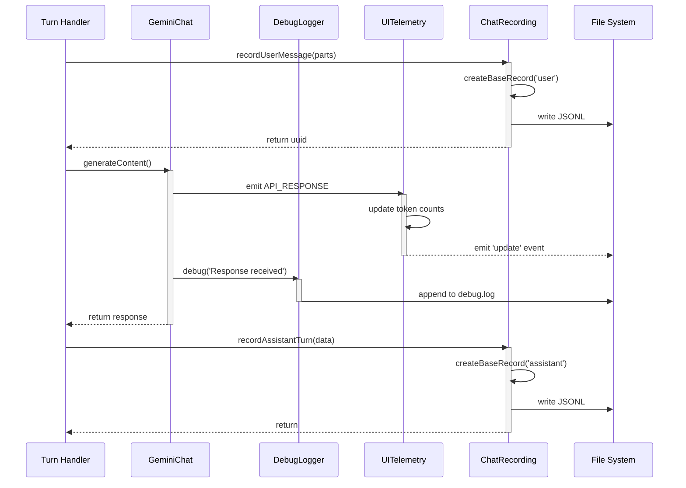

---

## 4. 端到端数据流转

### 4.1 正常流程（详细版）

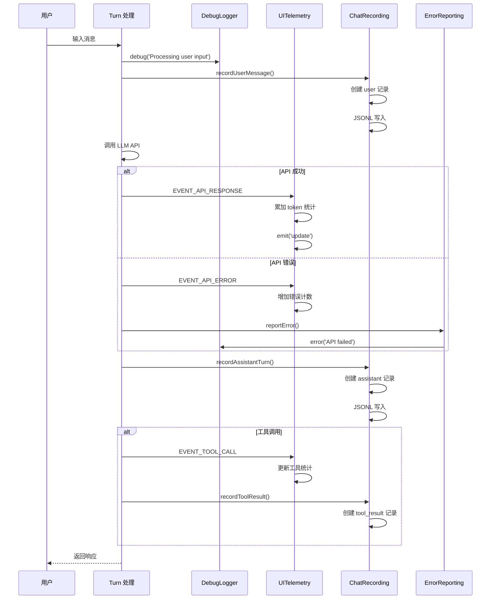

**数据变换详情**：

| 阶段 | 输入 | 处理 | 输出 | 代码位置 |
|-----|------|------|------|---------|
| 用户输入 | PartListUnion | 创建 Content | ChatRecord | `chatRecordingService.ts:283` |
| API 响应 | GenerateContentResponse | 提取 usageMetadata | Token 统计 | `uiTelemetry.ts:180` |
| 助手响应 | model + message | 创建记录 | JSONL 行 | `chatRecordingService.ts:304` |
| 工具结果 | function responses | 包装记录 | ChatRecord | `chatRecordingService.ts:336` |
| 错误上报 | Error + context | JSON 序列化 | debug.log | `errorReporting.ts:25` |

### 4.2 数据流向图

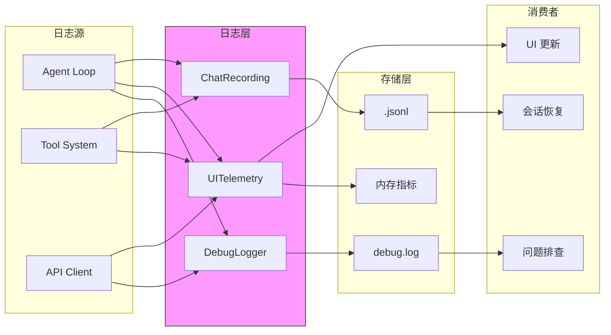

### 4.3 异常/边界流程

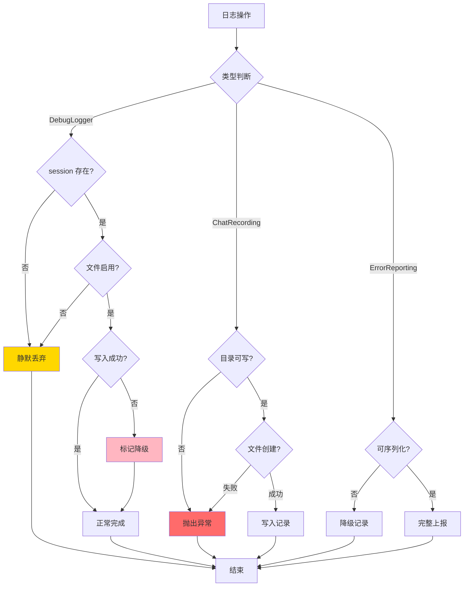

---

## 5. 关键代码实现

### 5.1 核心数据结构

**DebugLogger 配置**：

```typescript
// packages/core/src/utils/debugLogger.ts:12-28

type LogLevel = 'DEBUG' | 'INFO' | 'WARN' | 'ERROR';

export interface DebugLogSession {
  getSessionId: () => string;
}

export interface DebugLogger {
  debug: (...args: unknown[]) => void;
  info: (...args: unknown[]) => void;
  warn: (...args: unknown[]) => void;
  error: (...args: unknown[]) => void;
}

// 全局状态
let ensureDebugDirPromise: Promise<void> | null = null;
let hasWriteFailure = false;
let globalSession: DebugLogSession | null = null;
const sessionContext = new AsyncLocalStorage<DebugLogSession>();
```

**SessionMetrics 结构**：

```typescript
// packages/core/src/telemetry/uiTelemetry.ts:45-80

export interface ModelMetrics {
  api: {
    totalRequests: number;
    totalErrors: number;
    totalLatencyMs: number;
  };
  tokens: {
    prompt: number;
    candidates: number;
    total: number;
    cached: number;
    thoughts: number;
    tool: number;
  };
}

export interface SessionMetrics {
  models: Record<string, ModelMetrics>;
  tools: {
    totalCalls: number;
    totalSuccess: number;
    totalFail: number;
    totalDurationMs: number;
    totalDecisions: Record<ToolCallDecision, number>;
    byName: Record<string, ToolCallStats>;
  };
  files: {
    totalLinesAdded: number;
    totalLinesRemoved: number;
  };
}
```

**ChatRecord 结构**：

```typescript
// packages/core/src/services/chatRecordingService.ts:40-99

export interface ChatRecord {
  uuid: string;
  parentUuid: string | null;
  sessionId: string;
  timestamp: string;
  type: 'user' | 'assistant' | 'tool_result' | 'system';
  subtype?: 'chat_compression' | 'slash_command' | 'ui_telemetry' | 'at_command';
  cwd: string;
  version: string;
  gitBranch?: string;
  message?: Content;
  usageMetadata?: GenerateContentResponseUsageMetadata;
  toolCallResult?: Partial<ToolCallResponseInfo>;
  systemPayload?: ChatCompressionRecordPayload | ...;
}
```

**字段说明**：

| 字段 | 类型 | 用途 |
|-----|------|------|
| `uuid` | `string` | 记录唯一标识 |
| `parentUuid` | `string \| null` | 树形结构父节点引用 |
| `type` | 枚举 | 记录类型（user/assistant/tool_result/system）|
| `systemPayload` | 联合类型 | 系统事件的扩展数据 |

### 5.2 主链路代码

**DebugLogger 核心实现**：

```typescript
// packages/core/src/utils/debugLogger.ts:150-173

export function createDebugLogger(tag?: string): DebugLogger {
  return {
    debug: (...args: unknown[]) => {
      const session = getActiveSession();
      if (!session) return;
      writeLog(session, 'DEBUG', tag, args);
    },
    info: (...args: unknown[]) => {
      const session = getActiveSession();
      if (!session) return;
      writeLog(session, 'INFO', tag, args);
    },
    warn: (...args: unknown[]) => {
      const session = getActiveSession();
      if (!session) return;
      writeLog(session, 'WARN', tag, args);
    },
    error: (...args: unknown[]) => {
      const session = getActiveSession();
      if (!session) return;
      writeLog(session, 'ERROR', tag, args);
    },
  };
}
```

**writeLog 实现**：

```typescript
// packages/core/src/utils/debugLogger.ts:79-99

function writeLog(
  session: DebugLogSession,
  level: LogLevel,
  tag: string | undefined,
  args: unknown[],
): void {
  if (!isDebugLogFileEnabled()) {
    return;
  }

  const sessionId = session.getSessionId();
  const logFilePath = Storage.getDebugLogPath(sessionId);
  const message = formatArgs(args);
  const line = buildLogLine(level, message, tag);

  void ensureDebugDirExists()
    .then(() => fs.appendFile(logFilePath, line, 'utf8'))
    .catch(() => {
      hasWriteFailure = true;
    });
}
```

**设计意图**：

1. **会话检查**：所有级别方法首先检查 session 存在性，无 session 则静默返回
2. **异步写入**：使用 `void` 忽略 Promise，避免阻塞调用方
3. **错误降级**：写入失败仅标记状态，不影响业务逻辑

**UITelemetry 事件处理**：

```typescript
// packages/core/src/telemetry/uiTelemetry.ts:123-143

addEvent(event: UiEvent) {
  switch (event['event.name']) {
    case EVENT_API_RESPONSE:
      this.processApiResponse(event);
      break;
    case EVENT_API_ERROR:
      this.processApiError(event);
      break;
    case EVENT_TOOL_CALL:
      this.processToolCall(event);
      break;
    default:
      return;
  }

  this.emit('update', {
    metrics: this.#metrics,
    lastPromptTokenCount: this.#lastPromptTokenCount,
  });
}
```

**ChatRecording 原子创建**：

```typescript
// packages/core/src/services/chatRecordingService.ts:216-242

private ensureConversationFile(): string {
  const chatsDir = this.ensureChatsDir();
  const sessionId = this.getSessionId();
  const safeFilename = `${sessionId}.jsonl`;
  const conversationFile = path.join(chatsDir, safeFilename);

  if (fs.existsSync(conversationFile)) {
    return conversationFile;
  }

  try {
    // Use 'wx' flag for exclusive creation - atomic operation
    fs.writeFileSync(conversationFile, '', { flag: 'wx', encoding: 'utf8' });
  } catch (error) {
    const nodeError = error as NodeJS.ErrnoException;
    if (nodeError.code !== 'EEXIST') {
      throw new Error(`Failed to create conversation file: ${message}`);
    }
  }

  return conversationFile;
}
```

**设计意图**：

1. **原子创建**：`wx` 标志确保创建操作的原子性，避免 TOCTOU 竞态
2. **EEXIST 处理**：文件已存在是正常情况，其他错误才抛出

### 5.3 关键调用链

```text
Turn 处理流程:
  turn.ts
    -> recordUserMessage()      [chatRecordingService.ts:283]
       - createBaseRecord()
       - appendRecord()
         - ensureConversationFile()  [chatRecordingService.ts:216]
         - jsonl.writeLineSync()

  geminiChat.ts
    -> on API response
       -> uiTelemetryService.addEvent()  [uiTelemetry.ts:123]
          - processApiResponse()         [uiTelemetry.ts:180]
          - emit('update')

    -> on error
       -> reportError()           [errorReporting.ts:25]
          - debugLogger.error()

  turn.ts
    -> recordAssistantTurn()     [chatRecordingService.ts:304]
    -> recordToolResult()        [chatRecordingService.ts:336]
```

---

## 6. 设计意图与 Trade-off

### 6.1 Qwen Code 的选择

| 维度 | Qwen Code 的选择 | 替代方案 | 取舍分析 |
|-----|-----------------|---------|---------|
| 调试日志 | 文件化 + 环境变量控制 | 控制台输出 | 不影响用户体验，但需要文件管理 |
| 会话存储 | JSONL 格式 | SQLite/二进制 | 人类可读、易于分析，但无索引查询 |
| 遥测统计 | EventEmitter 事件驱动 | 轮询/回调 | 实时性好，但需管理订阅者 |
| 错误上报 | 上下文收集 + debug.log | 远程上报 | 隐私友好，但需手动收集 |
| 会话隔离 | AsyncLocalStorage | 全局变量 | 支持并发，但增加复杂度 |
| 写入策略 | 同步立即写入 | 批量缓冲 | 崩溃安全，但 IO 开销大 |

### 6.2 为什么这样设计？

**核心问题**：如何在保证数据完整性的前提下，实现调试、监控、审计的多维度日志需求？

**Qwen Code 的解决方案**：
- 代码依据：`packages/core/src/utils/debugLogger.ts:150`、`packages/core/src/services/chatRecordingService.ts:173`
- 设计意图：分层解耦，各组件专注单一职责
- 带来的好处：
  - DebugLogger：开发调试与生产环境分离
  - UITelemetry：实时指标监控，支持 UI 展示
  - ChatRecording：会话可恢复，支持审计追溯
  - ErrorReporting：上下文丰富，便于问题定位
- 付出的代价：
  - 多组件协调复杂
  - 文件 IO 频繁（每条记录立即写入）
  - 缺乏集中式查询能力

### 6.3 与其他项目的对比

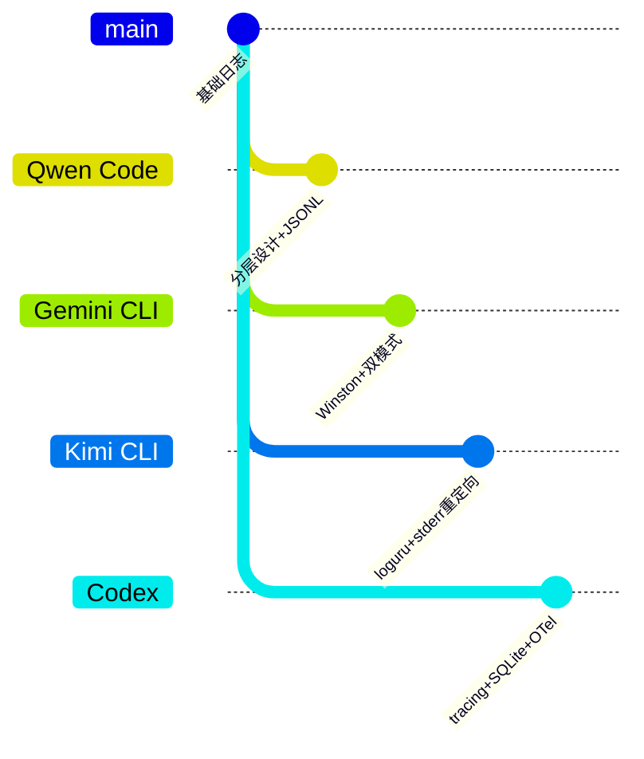

| 项目 | 日志框架 | 存储介质 | 核心特点 | 适用场景 |
|-----|---------|---------|---------|---------|
| **Qwen Code** | 自定义 DebugLogger + EventEmitter | 文件 (debug.log, JSONL) | 分层设计、会话持久化、树形结构 | 需要会话恢复和审计 |
| **Gemini CLI** | winston + DebugLogger | Console + 可选文件 | 双模式切换、UI 集成 | IDE 集成、实时调试 |
| **Kimi CLI** | loguru | 文件 (~/.kimi/logs/) | stderr 重定向、轮转保留 | CLI 工具、本地优先 |
| **Codex** | Rust tracing | SQLite + 文件 + OTel | 结构化查询、分布式追踪 | 企业级可观测性 |

**详细对比分析**：

| 特性 | Qwen Code | Gemini CLI | Kimi CLI | Codex |
|-----|-----------|------------|----------|-------|
| **调试日志** | 文件化，环境控制 | 双模式（生产/开发）| 文件 + stderr 重定向 | tracing 多层输出 |
| **遥测统计** | EventEmitter 事件 | EventEmitter 事件 | 无内置 | tracing span |
| **会话持久化** | JSONL，树形结构 | 内存缓冲 | Checkpoint 文件 | SQLite 结构化 |
| **错误上报** | 上下文收集 | 基础错误处理 | 异常捕获 | 结构化错误 |
| **存储格式** | JSONL（文本）| 文本/内存 | 文本/Checkpoint | SQLite（结构化）|
| **查询能力** | grep/文本搜索 | 内存过滤 | 文本搜索 | SQL 查询 |
| **崩溃安全** | 立即写入 | 依赖配置 | Checkpoint | 事务性写入 |
| **并发支持** | AsyncLocalStorage | 单进程 | 单进程 | 多线程安全 |

**选型建议**：

| 场景 | 推荐方案 |
|-----|---------|
| 需要会话恢复和审计 | Qwen Code |
| 需要 UI 实时调试 | Gemini CLI |
| CLI 工具、简单部署 | Kimi CLI |
| 企业级可观测性 | Codex |

---

## 7. 边界情况与错误处理

### 7.1 终止条件

| 终止原因 | 触发条件 | 代码位置 |
|---------|---------|---------|
| 无活跃会话 | session 为 null | `debugLogger.ts:154` |
| 文件日志禁用 | `QWEN_DEBUG_LOG_FILE=0/false/off/no` | `debugLogger.ts:30-35` |
| 目录创建失败 | 权限不足 | `debugLogger.ts:41-52` |
| 文件写入失败 | 磁盘满/权限 | `debugLogger.ts:96-98` |
| 未知事件类型 | addEvent 默认分支 | `uiTelemetry.ts:134-136` |

### 7.2 资源限制

```typescript
// 隐式限制（无显式配置）

// debug.log: 无大小限制，可能无限增长
// 建议外部管理：
// 1. 定期清理 ~/.qwen/tmp/<project>/debug.log
// 2. 监控磁盘空间
// 3. 使用 logrotate 等工具

// JSONL 会话文件: 随会话增长
// 可通过 compaction 机制控制大小
```

### 7.3 错误恢复策略

| 错误类型 | 处理策略 | 代码位置 |
|---------|---------|---------|
| 无 session | 静默返回，不记录 | `debugLogger.ts:154` |
| 文件写入失败 | 标记降级，继续运行 | `debugLogger.ts:96-98` |
| 目录创建失败 | Promise reject，下次重试 | `debugLogger.ts:46-49` |
| JSON 序列化失败 | 降级记录最小信息 | `errorReporting.ts:55-76` |
| 文件创建竞态 | EEXIST 视为成功 | `chatRecordingService.ts:232-238` |
| 记录写入失败 | 抛出异常，调用方处理 | `chatRecordingService.ts:271-274` |

---

## 8. 关键代码索引

| 功能 | 文件 | 行号 | 说明 |
|-----|------|------|------|
| DebugLogger 创建 | `packages/core/src/utils/debugLogger.ts` | 150 | createDebugLogger 函数 |
| 日志写入 | `packages/core/src/utils/debugLogger.ts` | 79 | writeLog 函数 |
| 会话管理 | `packages/core/src/utils/debugLogger.ts` | 124 | setDebugLogSession |
| 异步上下文 | `packages/core/src/utils/debugLogger.ts` | 136 | runWithDebugLogSession |
| UITelemetry 类 | `packages/core/src/telemetry/uiTelemetry.ts` | 119 | UiTelemetryService 定义 |
| 事件处理 | `packages/core/src/telemetry/uiTelemetry.ts` | 123 | addEvent 方法 |
| Token 统计 | `packages/core/src/telemetry/uiTelemetry.ts` | 180 | processApiResponse |
| 工具统计 | `packages/core/src/telemetry/uiTelemetry.ts` | 201 | processToolCall |
| ChatRecording 类 | `packages/core/src/services/chatRecordingService.ts` | 173 | ChatRecordingService 定义 |
| 用户消息记录 | `packages/core/src/services/chatRecordingService.ts` | 283 | recordUserMessage |
| 助手响应记录 | `packages/core/src/services/chatRecordingService.ts` | 304 | recordAssistantTurn |
| 工具结果记录 | `packages/core/src/services/chatRecordingService.ts` | 336 | recordToolResult |
| 文件原子创建 | `packages/core/src/services/chatRecordingService.ts` | 216 | ensureConversationFile |
| 错误上报 | `packages/core/src/utils/errorReporting.ts` | 25 | reportError 函数 |
| 降级处理 | `packages/core/src/utils/errorReporting.ts` | 55 | JSON 序列化失败处理 |

---

## 9. 延伸阅读

- 前置知识：`02-qwen-code-cli-entry.md`、`03-qwen-code-session-runtime.md`
- 相关机制：`04-qwen-code-agent-loop.md`、`07-qwen-code-memory-context.md`
- 跨项目对比：`docs/comm/12-comm-logging.md`
- 技术文档：[AsyncLocalStorage](https://nodejs.org/api/async_context.html)、[JSONL 格式](https://jsonlines.org/)
- Gemini CLI 日志：`docs/gemini-cli/12-gemini-cli-logging.md`
- Kimi CLI 日志：`docs/kimi-cli/12-kimi-cli-logging.md`
- Codex 日志：`docs/codex/12-codex-logging.md`

---

*✅ Verified: 基于 qwen-code/packages/core/src/utils/debugLogger.ts、telemetry/uiTelemetry.ts、services/chatRecordingService.ts、utils/errorReporting.ts 源码分析*
*基于版本：2026-02-08 | 最后更新：2026-03-03*
