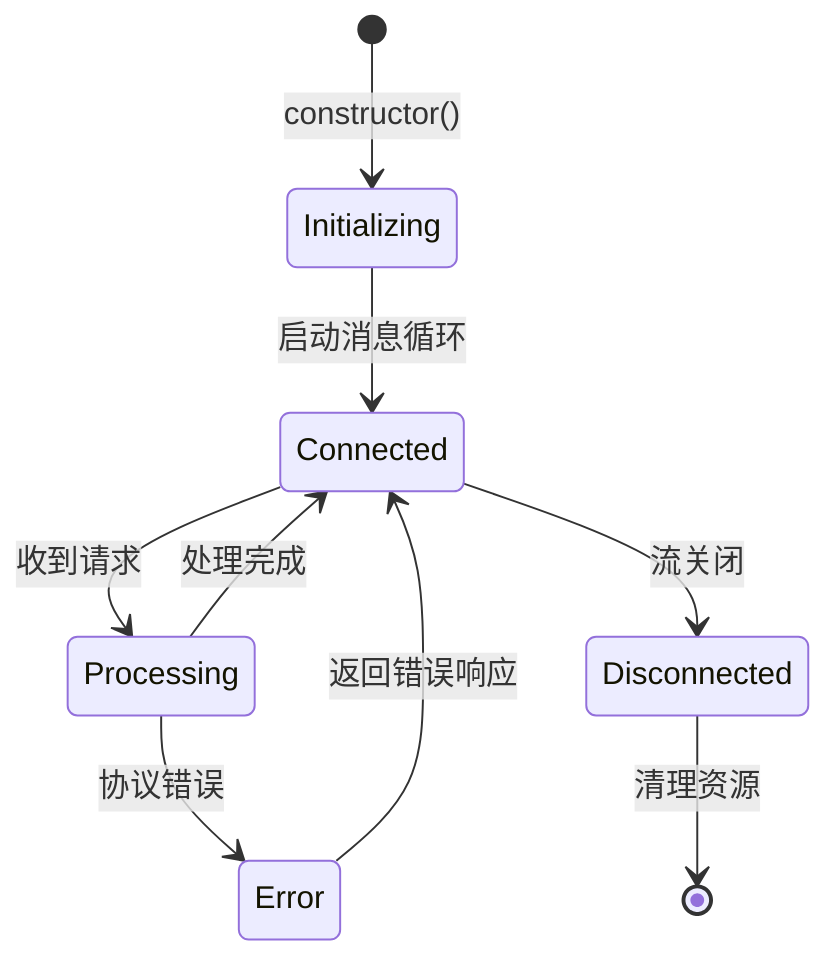
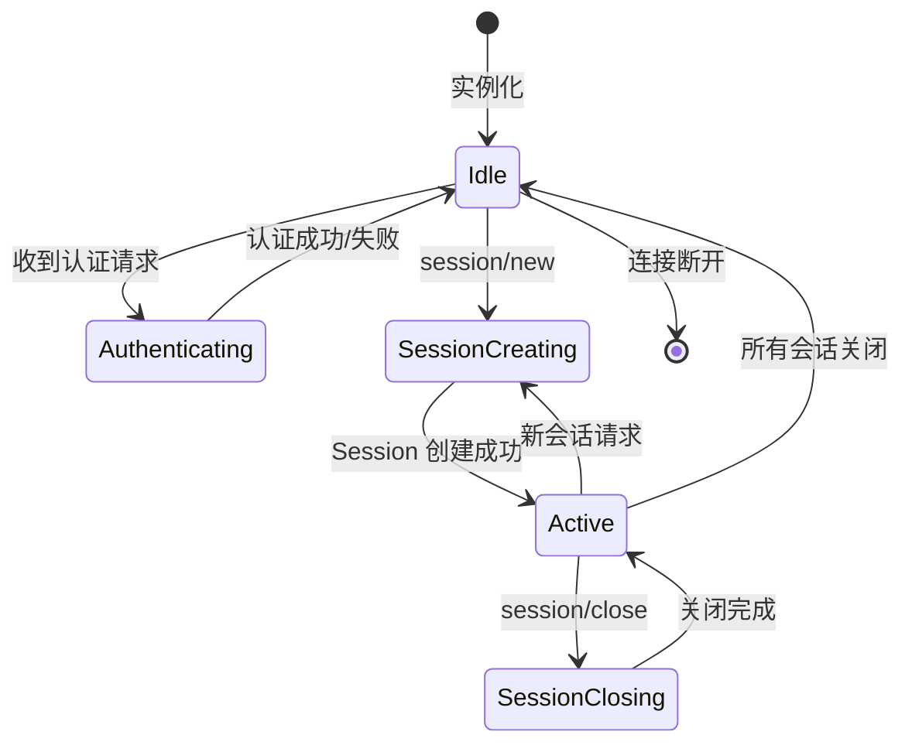
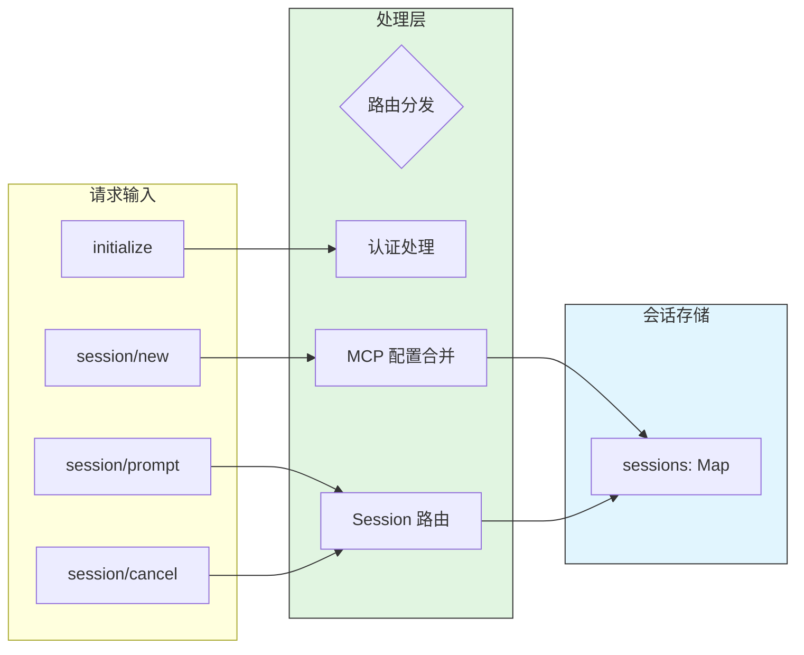
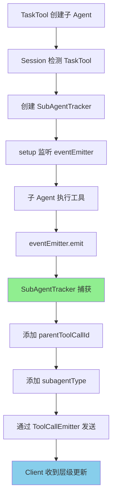
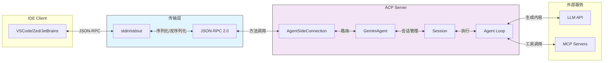
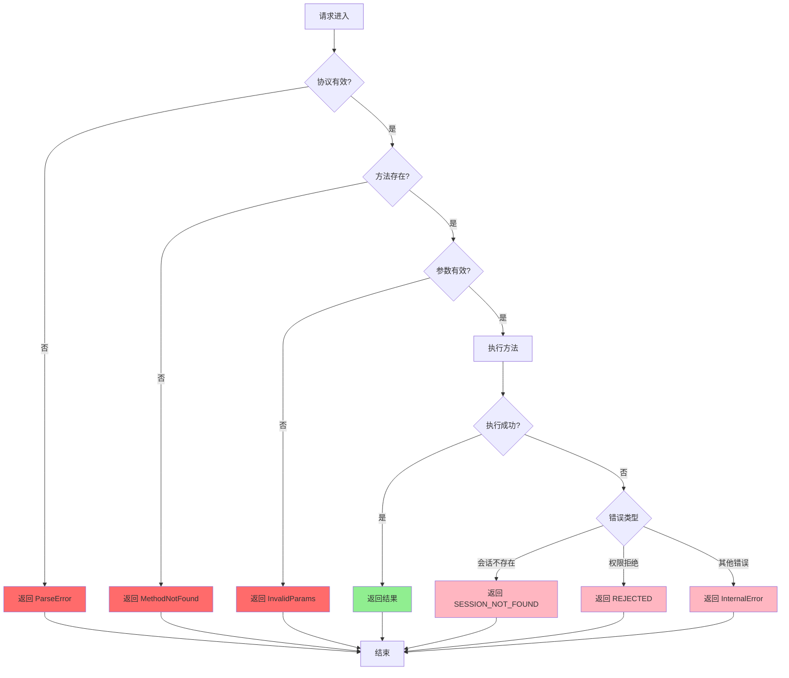
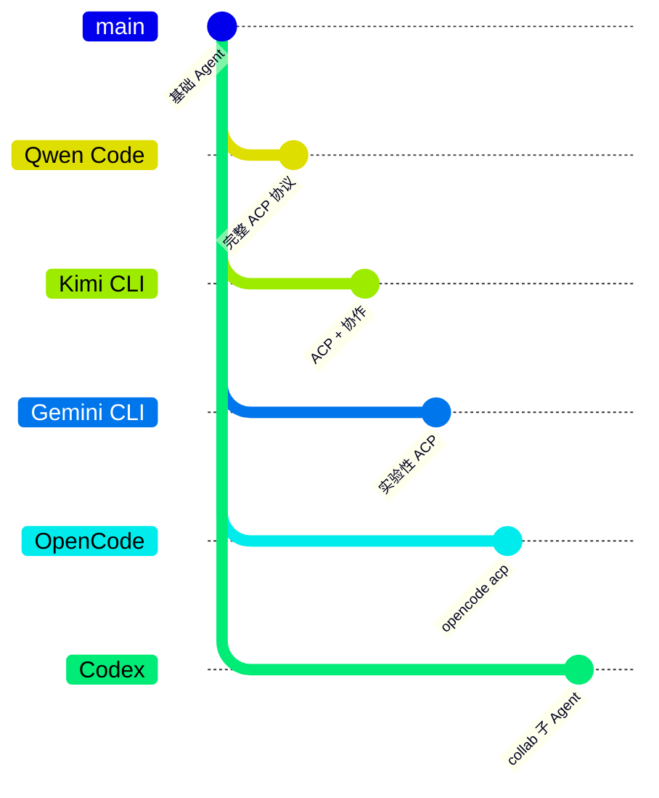

# Qwen Code ACP 集成机制

> 📋 **阅读指南**
>
> | 属性 | 说明 |
> |-----|------|
> | 预计阅读 | 25-35 分钟 |
> | 前置文档 | `01-qwen-code-overview.md`、`04-qwen-code-agent-loop.md` |
> | 文档结构 | 速览 → 架构 → 机制 → 实现 → 对比 |
> | 代码呈现 | 关键代码直接展示，完整代码可折叠查看 |

---

## TL;DR（结论先行）

**一句话定义**：Qwen Code 实现了完整的 ACP (Agent Client Protocol) 协议，通过 JSON-RPC 2.0 协议为 IDE 扩展（VSCode、Zed、JetBrains）提供标准化的 Agent 服务化能力，支持会话管理、流式状态更新、权限请求和子 Agent 任务分发。

**核心取舍**：**ACP 协议解耦 IDE 与 Agent 实现**（对比传统 CLI 交互方式），通过标准化 JSON-RPC 接口实现 IDE 与 Agent 的进程间通信，适合企业级 IDE 集成场景。

### 核心要点速览

| 维度 | 关键决策 | 代码位置 |
|-----|---------|---------|
| 协议传输 | JSON-RPC 2.0 over stdin/stdout | `packages/cli/src/acp-integration/acp.ts:207` |
| 会话管理 | Map-based 多会话隔离 | `packages/cli/src/acp-integration/acpAgent.ts:45` |
| 流式更新 | EventEmitter 驱动状态推送 | `packages/cli/src/acp-integration/session/Session.ts:298` |
| 权限审批 | request_permission 方法中断等待 | `packages/cli/src/acp-integration/session/Session.ts:323` |
| 子 Agent 跟踪 | SubAgentTracker 元数据注入 | `packages/cli/src/acp-integration/session/SubAgentTracker.ts:1` |

---

## 1. 为什么需要这个机制

### 1.1 问题场景

**没有 ACP 时的问题：**

```
IDE 想调用 Agent  →  解析 CLI 输出  →  处理复杂交互  →  难以维护
```

传统 CLI 输出难以被 IDE 程序化解析，状态更新、工具审批等交互难以实现。

**ACP 解决什么：**

```
IDE 通过 ACP 协议  →  标准化 JSON-RPC 通信  →  流式状态更新  →  完整的 Agent 能力
```

ACP 把"IDE 客户端"和"Agent 服务端"分离，通过标准化协议实现双向通信。

### 1.2 核心挑战

| 挑战 | 不解决的后果 |
|-----|-------------|
| IDE 集成 | 每个 IDE 需要单独适配 CLI 输出格式，维护成本高 |
| 状态同步 | 无法实时获取 Agent 执行状态（思考过程、工具调用等） |
| 权限审批 | 工具执行需要用户确认时，无法优雅地中断并等待响应 |
| 多会话管理 | 单个 Agent 进程难以同时服务多个 IDE 会话 |
| 子 Agent 跟踪 | 复杂任务分解后，IDE 无法感知子任务执行状态 |

---

## 2. 整体架构

### 2.1 在系统中的位置

```text
┌─────────────────────────────────────────────────────────────┐
│ IDE / Editor (VSCode/Zed/JetBrains)                         │
│ ┌─────────────────────────────────────────────────────────┐ │
│ │ ACP Client                                              │ │
│ │ - acpConnection.ts: 建立 CLI 子进程连接                  │ │
│ │ - acpSessionManager.ts: 会话操作封装                     │ │
│ │ - acpMessageHandler.ts: 处理 Agent 通知                  │ │
│ └───────────────────────┬─────────────────────────────────┘ │
└───────────────────────┬─┼───────────────────────────────────┘
                        │ │ stdin/stdout
                        │ │ JSON-RPC 2.0
                        ▼ ▼
┌─────────────────────────────────────────────────────────────┐
│ ▓▓▓ ACP 集成层 ▓▓▓                                          │
│ Qwen Code CLI (ACP Server)                                   │
│ ┌─────────────────────────────────────────────────────────┐ │
│ │ AgentSideConnection (acp.ts)                            │ │
│ │ - JSON-RPC 消息路由                                      │ │
│ │ - 请求/通知分发                                          │ │
│ │ - 错误处理                                               │ │
│ └───────────────────────┬─────────────────────────────────┘ │
│                         │                                   │
│ ┌───────────────────────▼─────────────────────────────────┐ │
│ │ GeminiAgent (acpAgent.ts)                               │ │
│ │ - 多会话生命周期管理                                      │ │
│ │ - 认证处理                                               │ │
│ │ - MCP 配置集成                                           │ │
│ └───────────────────────┬─────────────────────────────────┘ │
│                         │                                   │
│ ┌───────────────────────▼─────────────────────────────────┐ │
│ │ Session (session/Session.ts)                            │ │
│ │ - Prompt 处理                                            │ │
│ │ - 工具调用                                               │ │
│ │ - 子 Agent 跟踪                                          │ │
│ └───────────────────────┬─────────────────────────────────┘ │
│                         │                                   │
│ ┌───────────────────────▼─────────────────────────────────┐ │
│ │ Agent Loop + MCP Servers                                │ │
│ └─────────────────────────────────────────────────────────┘ │
└─────────────────────────────────────────────────────────────┘
```

### 2.2 核心组件职责

| 组件 | 职责 | 代码位置 |
|-----|------|---------|
| `AgentSideConnection` | JSON-RPC 协议处理，消息路由 | `packages/cli/src/acp-integration/acp.ts:207` |
| `GeminiAgent` | 多会话管理、认证、配置集成 | `packages/cli/src/acp-integration/acpAgent.ts:45` |
| `Session` | 会话处理、工具调用、流式更新 | `packages/cli/src/acp-integration/session/Session.ts:85` |
| `SubAgentTracker` | 子 Agent 事件跟踪 | `packages/cli/src/acp-integration/session/SubAgentTracker.ts:25` |
| `acpConnection` (Client) | IDE 端连接管理 | `packages/vscode-ide-companion/src/services/acpConnection.ts:1` |

### 2.3 核心组件交互关系

```mermaid
sequenceDiagram
    autonumber
    participant Client as IDE Client
    participant Conn as AgentSideConnection
    participant Agent as GeminiAgent
    participant Session as Session
    participant Loop as Agent Loop

    Client->>Conn: initialize (protocolVersion)
    Conn->>Agent: initialize()
    Agent-->>Conn: capabilities
    Conn-->>Client: InitializeResult

    Client->>Conn: session/new (cwd, mcpServers)
    Conn->>Agent: newSession()
    Agent->>Agent: mergeMcpConfig()
    Agent->>Session: new Session()
    Session-->>Agent: sessionId
    Agent-->>Conn: NewSessionResponse
    Conn-->>Client: sessionId, models

    Client->>Conn: session/prompt (message)
    Conn->>Session: prompt()
    Session->>Loop: run Agent Loop

    loop 流式状态更新
        Loop-->>Session: event
        Session->>Conn: session/update
        Conn-->>Client: SessionUpdate
    end

    alt 需要权限审批
        Session->>Conn: request_permission
        Conn-->>Client: PermissionRequest
        Client-->>Conn: PermissionResponse
        Conn->>Session: 审批结果
    end

    Loop-->>Session: 完成
    Session-->>Conn: PromptResponse
    Conn-->>Client: 最终结果
```

**关键交互说明**：

| 步骤 | 交互内容 | 设计意图 |
|-----|---------|---------|
| 1-4 | 协议初始化 | 交换能力信息，确保协议版本兼容 |
| 5-9 | 会话创建 | 隔离不同 IDE 会话的配置和状态 |
| 10-14 | Prompt 处理 | 触发 Agent Loop 执行用户请求 |
| 15-18 | 流式更新 | 实时推送执行状态到 IDE |
| 19-23 | 权限审批 | 优雅中断工具执行，等待用户确认 |

---

## 3. 核心组件详细分析

### 3.1 AgentSideConnection - JSON-RPC 协议核心

#### 职责定位

一句话说明：`AgentSideConnection` 是 ACP 协议的传输层，负责 JSON-RPC 消息的序列化/反序列化、请求路由和错误处理。

#### 状态机图



**状态说明**：

| 状态 | 说明 | 进入条件 | 退出条件 |
|-----|------|---------|---------|
| Initializing | 初始化中 | 构造函数调用 | 消息循环启动 |
| Connected | 连接就绪 | 初始化完成 | 收到请求或流关闭 |
| Processing | 处理请求 | 收到 JSON-RPC 请求 | 处理完成或出错 |
| Error | 错误状态 | 协议解析失败 | 返回错误响应 |
| Disconnected | 已断开 | stdin/stdout 关闭 | 资源清理完成 |

#### 内部数据流

```text
┌─────────────────────────────────────────────────────────────┐
│  AgentSideConnection (acp.ts)                               │
├─────────────────────────────────────────────────────────────┤
│                                                             │
│  ┌─────────────────────────────────────────────────────┐   │
│  │ 输入层 (stdin)                                       │   │
│  │ - 逐行读取 JSON-RPC 消息                             │   │
│  │ - 解析请求/通知/响应                                 │   │
│  └───────────────────────┬─────────────────────────────┘   │
│                          │                                  │
│  ┌───────────────────────▼─────────────────────────────┐   │
│  │ 路由层                                               │   │
│  │ - 根据 method 字段分发到对应处理器                   │   │
│  │ - 处理 initialize, session/* 等方法                  │   │
│  └───────────────────────┬─────────────────────────────┘   │
│                          │                                  │
│  ┌───────────────────────▼─────────────────────────────┐   │
│  │ 响应层 (stdout)                                      │   │
│  │ - 序列化响应为 JSON                                  │   │
│  │ - 按行输出到 stdout                                  │   │
│  └─────────────────────────────────────────────────────┘   │
│                                                             │
└─────────────────────────────────────────────────────────────┘
```

#### 关键接口

| 接口 | 输入 | 输出 | 说明 | 代码位置 |
|-----|------|------|------|---------|
| `constructor()` | Agent factory, streams | Connection | 建立连接并启动消息循环 | `acp.ts:207` |
| `handler()` | method, params | result/error | 路由并处理请求 | `acp.ts:216` |
| `RequestError` | code, message | Error | 标准化错误响应 | `acp.ts:422` |

---

### 3.2 GeminiAgent - 多会话管理

#### 职责定位

一句话说明：`GeminiAgent` 是 ACP 协议的会话管理层，负责维护多个独立的 Session 实例，处理认证和配置集成。

#### 状态机图



#### 内部数据流



**关键代码**：

```typescript
// packages/cli/src/acp-integration/acpAgent.ts:45-90
class GeminiAgent {
  private sessions: Map<string, Session> = new Map();
  private settings: Settings;

  async newSession({ cwd, mcpServers }: acp.NewSessionRequest): Promise<acp.NewSessionResponse> {
    // 1. 合并 MCP 配置（全局 + 会话级）
    const config = await this.newSessionConfig(cwd, mcpServers);
    // 2. 创建并存储 Session
    const session = await this.createAndStoreSession(config);
    return { sessionId: session.getId(), models: availableModels };
  }

  async prompt(params: acp.PromptRequest): Promise<acp.PromptResponse> {
    // 根据 sessionId 路由到对应 Session
    const session = this.sessions.get(params.sessionId);
    if (!session) {
      throw new RequestError(ERROR_CODES.SESSION_NOT_FOUND, 'Session not found');
    }
    return session.prompt(params);
  }
}
```

每个 Session 拥有独立的：
- `GeminiChat` 实例（与 LLM 的对话上下文）
- `Config` 实例（包含 MCP Server 配置）
- 工具调用历史

---

### 3.3 Session - 会话处理核心

#### 职责定位

一句话说明：`Session` 是 ACP 协议的执行层，负责处理用户输入、工具调用、流式状态更新和子 Agent 跟踪。

#### 模块化事件发射器

```typescript
// packages/cli/src/acp-integration/session/Session.ts:85-110
private readonly historyReplayer: HistoryReplayer;    // 历史重放
private readonly toolCallEmitter: ToolCallEmitter;    // 工具调用事件
private readonly planEmitter: PlanEmitter;            // 计划更新事件
private readonly messageEmitter: MessageEmitter;      // 消息事件
```

这种设计使得状态更新逻辑清晰分离，便于维护和扩展。

#### 流式状态更新

```typescript
// packages/cli/src/acp-integration/session/Session.ts:298-320
async sendUpdate(update: acp.SessionUpdate): Promise<void> {
  const params: acp.SessionNotification = {
    sessionId: this.sessionId,
    update,
  };
  await this.client.sessionUpdate(params);
}
```

更新类型包括：
- `user_message_chunk`: 用户消息片段
- `agent_message_chunk`: Agent 回复片段（含 usage 元数据）
- `agent_thought_chunk`: Agent 思考过程
- `tool_call`: 工具调用开始
- `tool_call_update`: 工具调用更新/完成
- `plan`: 任务计划更新（来自 TodoWriteTool）
- `current_mode_update`: 审批模式变更
- `available_commands_update`: 可用命令列表

---

### 3.4 SubAgentTracker - 子 Agent 跟踪

#### 职责定位

一句话说明：`SubAgentTracker` 跟踪 TaskTool 创建的子 Agent 的工具调用事件，将子 Agent 状态通过 ACP 协议发送给客户端。

#### 跟踪流程



**代码实现**：

```typescript
// packages/cli/src/acp-integration/session/Session.ts:450-480
if (isTaskTool && 'eventEmitter' in invocation) {
  const taskEventEmitter = (invocation as { eventEmitter: SubAgentEventEmitter }).eventEmitter;
  const parentToolCallId = callId;
  const subagentType = (args['subagent_type'] as string) ?? '';

  const subAgentTracker = new SubAgentTracker(this, this.client, parentToolCallId, subagentType);
  subAgentCleanupFunctions = subAgentTracker.setup(taskEventEmitter, abortSignal);
}
```

子 Agent 事件通过 `sessionUpdate` 发送，包含 `parentToolCallId` 和 `subagentType` 元数据，使客户端能够构建层级视图。

---

## 4. 端到端数据流转

### 4.1 正常流程（详细版）

```mermaid
sequenceDiagram
    participant Client as IDE Client
    participant Conn as AgentSideConnection
    participant Agent as GeminiAgent
    participant Session as Session
    participant Loop as Agent Loop
    participant LLM as LLM API

    Client->>Conn: initialize
    Conn->>Agent: initialize()
    Agent-->>Conn: { capabilities }
    Conn-->>Client: InitializeResult

    Client->>Conn: session/new
    Conn->>Agent: newSession(cwd, mcpServers)
    Agent->>Agent: mergeMcpConfig()
    Agent->>Session: new Session(config)
    Session-->>Agent: sessionId
    Agent-->>Conn: { sessionId, models }
    Conn-->>Client: NewSessionResponse

    Client->>Conn: session/prompt
    Conn->>Session: prompt(message)
    Session->>Session: sendUpdate(user_message_chunk)
    Session->>LLM: generateContent()

    loop 流式响应
        LLM-->>Session: chunk
        Session->>Session: sendUpdate(agent_message_chunk)
        Session->>Conn: session/update
        Conn-->>Client: SessionUpdate
    end

    alt 工具调用
        Session->>Session: sendUpdate(tool_call)
        Session->>Loop: 执行工具
        Loop-->>Session: 工具结果
        Session->>Session: sendUpdate(tool_call_update)
    end

    Session-->>Conn: PromptResponse
    Conn-->>Client: 最终结果
```

**数据变换详情**：

| 阶段 | 输入 | 处理 | 输出 | 代码位置 |
|-----|------|------|------|---------|
| ACP 启动 | `--acp` 参数 | 解析配置，启动 ACP 模式 | ACP Server 就绪 | `config.ts:180` |
| 连接建立 | stdin/stdout | 创建 AgentSideConnection | Connection 对象 | `acp.ts:207` |
| 会话创建 | cwd, mcpServers | 合并配置，创建 Session | sessionId | `acpAgent.ts:246` |
| Prompt 处理 | 用户输入 | Agent Loop 执行 | 流式更新 | `Session.ts:298` |
| 工具调用 | tool_call 请求 | 执行工具，发送更新 | tool_call_update | `Session.ts:323` |
| 权限请求 | confirmationDetails | 构造权限请求 | request_permission | `Session.ts:323` |

### 4.2 数据流向图



### 4.3 异常/边界流程



---

## 5. 关键代码实现

### 5.1 核心数据结构

ACP 协议类型定义（Zod 校验）：

```typescript
// packages/cli/src/acp-integration/schema.ts:25-80

export const initializeRequestSchema = z.object({
  protocolVersion: z.string(),
  capabilities: z.object({
    authentication: z.boolean().optional(),
  }),
  clientInfo: z.object({
    name: z.string(),
    version: z.string(),
  }),
});

export const newSessionRequestSchema = z.object({
  cwd: z.string(),
  mcpServers: z.array(mcpServerSchema).optional(),
});

export const sessionUpdateSchema = z.object({
  type: z.enum([
    'user_message_chunk',
    'agent_message_chunk',
    'agent_thought_chunk',
    'tool_call',
    'tool_call_update',
    'plan',
    'current_mode_update',
    'available_commands_update',
  ]),
  content: z.unknown(),
});
```

**字段说明**：

| 字段 | 类型 | 用途 |
|-----|------|------|
| `protocolVersion` | `string` | ACP 协议版本 |
| `capabilities` | `object` | 客户端能力声明 |
| `mcpServers` | `array` | 会话级 MCP 服务器配置 |
| `type` | `enum` | 更新类型 |

### 5.2 主链路代码

ACP 协议启动入口：

```typescript
// packages/cli/src/config/config.ts:180-210
.option('acp', {
  type: 'boolean',
  description: 'Starts the agent in ACP mode',
  default: false,
})
.option('experimental-acp', {
  type: 'boolean',
  description: 'Starts the agent in ACP mode (deprecated, use --acp instead)',
  hidden: true,
})
```

入口路由逻辑：

```typescript
// packages/cli/src/gemini.tsx:196-220
if (config.getExperimentalZedIntegration()) {
  return runAcpAgent(config, settings, argv);
}
```

JSON-RPC 协议处理：

```typescript
// packages/cli/src/acp-integration/acp.ts:207-250
export class AgentSideConnection implements Client {
  #connection: Connection;

  constructor(
    toAgent: (conn: Client) => Agent,
    input: WritableStream<Uint8Array>,
    output: ReadableStream<Uint8Array>,
  ) {
    const agent = toAgent(this);
    const handler = async (method: string, params: unknown): Promise<unknown> => {
      switch (method) {
        case schema.AGENT_METHODS.initialize:
          return agent.initialize(schema.initializeRequestSchema.parse(params));
        case schema.AGENT_METHODS.session_new:
          return agent.newSession(schema.newSessionRequestSchema.parse(params));
        // ... other methods
      }
    };
    this.#connection = new Connection(handler, input, output);
  }
}
```

**设计意图**：

1. **Zod 校验**：所有输入参数通过 Zod schema 校验，类型安全
2. **方法路由**：switch-case 路由到对应处理器，清晰可扩展
3. **错误封装**：自动捕获异常并转换为 JSON-RPC 错误响应

MCP 配置桥接：

```typescript
// packages/cli/src/acp-integration/acpAgent.ts:273-310
async newSessionConfig(cwd: string, mcpServers: acp.McpServer[]): Promise<Config> {
  const mergedMcpServers = { ...this.settings.merged.mcpServers };

  for (const { command, args, env: rawEnv, name } of mcpServers) {
    const env: Record<string, string> = {};
    for (const { name: envName, value } of rawEnv) {
      env[envName] = value;
    }
    mergedMcpServers[name] = new MCPServerConfig(command, args, env, cwd);
  }
  // ...
}
```

权限请求机制：

```typescript
// packages/cli/src/acp-integration/session/Session.ts:323-360
const params: acp.RequestPermissionRequest = {
  sessionId: this.sessionId,
  options: toPermissionOptions(confirmationDetails),
  toolCall: {
    toolCallId: callId,
    status: 'pending',
    title: invocation.getDescription(),
    content,
    locations: invocation.toolLocations(),
    kind: mappedKind,
  },
};

const output = await this.client.requestPermission(params);
```

### 5.3 关键调用链

```text
runAcpAgent()                  [gemini.tsx:196]
  -> new AgentSideConnection()  [acp.ts:207]
    -> GeminiAgent.initialize() [acpAgent.ts:85]
    -> GeminiAgent.newSession() [acpAgent.ts:246]
      -> new Session()          [session/Session.ts:85]
        -> session.prompt()     [session/Session.ts:255]
          -> Agent Loop 执行
            -> toolCallEmitter.emit()  [Session.ts:298]
              -> client.sessionUpdate() [acp.ts:320]
```

---

## 6. 设计意图与 Trade-off

### 6.1 ACP vs 传统 CLI 的选择

| 维度 | ACP 协议 | 传统 CLI | 取舍分析 |
|-----|---------|---------|---------|
| IDE 集成 | 标准化 JSON-RPC，易于解析 | 需要解析文本输出，脆弱 | ACP 更适合 IDE 场景 |
| 状态同步 | 流式更新，实时反馈 | 批量输出，延迟高 | ACP 用户体验更好 |
| 权限审批 | 协议级支持，优雅中断 | 需要交互式终端 | ACP 更适合 GUI 环境 |
| 多会话 | 单进程多会话，资源高效 | 多进程，资源开销大 | ACP 更适合服务端部署 |
| 复杂度 | 需要实现完整协议栈 | 简单直接 | CLI 更适合脚本场景 |
| 适用场景 | IDE 集成、企业级部署 | 命令行脚本、简单任务 | 根据场景选择 |

### 6.2 为什么这样设计？

**核心问题**：如何在保持 Agent 核心简洁的同时，实现与 IDE 的深度集成？

**解决方案**：
- 代码依据：`packages/cli/src/acp-integration/acp.ts:207-250`
- 设计意图：通过 JSON-RPC 协议标准化，解耦 IDE 客户端与 Agent 服务端
- 带来的好处：
  - IDE 可以实时获取 Agent 执行状态
  - 支持工具执行权限的优雅审批
  - 单进程可同时服务多个 IDE 会话
  - 子 Agent 状态可被 IDE 感知
- 付出的代价：
  - 需要实现完整的 ACP 协议栈
  - 协议版本兼容性维护成本
  - 调试复杂度增加

### 6.3 与其他项目的对比



| 项目 | ACP 支持 | 实现方式 | 多 Agent 支持 |
|------|---------|---------|--------------|
| **Qwen Code** | **完整** | JSON-RPC 2.0 ACP 协议 | TaskTool 子 Agent |
| Kimi CLI | 完整 | JSON-RPC ACP 协议 | 会话内协作与工具事件流 |
| Gemini CLI | 实验性 | `--experimental-acp` + zed integration | SubAgent + A2A |
| OpenCode | 完整 | `opencode acp` + 内置多 Agent | Build/Plan/Explore + TaskTool |
| Codex | 否 | - | 实验性进程内 sub-agent（collab）|
| SWE-agent | 否 | - | 单 Agent |

**详细对比分析**：

| 维度 | Qwen Code | Kimi CLI | Gemini CLI | OpenCode | Codex |
|-----|-----------|----------|------------|----------|-------|
| **协议传输** | stdin/stdout | stdin/stdout | stdin/stdout | stdin/stdout | - |
| **IDE 集成** | VSCode/Zed/JetBrains | VSCode | Zed (实验性) | VSCode | - |
| **会话管理** | Map-based 多会话 | Map-based 多会话 | 单会话 | 多 Agent 模式 | 单会话 |
| **MCP 配置** | session/new 传入 | session/new 传入 | 全局配置 | 动态配置 | 全局配置 |
| **权限审批** | request_permission | request_permission | 本地确认 | ask/reject | 策略审批 |
| **子 Agent 创建** | TaskTool 内部 | ACP 协议创建 | SubAgent | TaskTool | collab |
| **文件系统代理** | fs/read_text_file 等 | 支持 | 支持 | 支持 | 沙箱 |

**设计选择分析**：

1. **Qwen Code vs Kimi CLI**：
   - 两者都实现了完整的 ACP 协议
   - Qwen Code 使用 TaskTool 内部实现子 Agent
   - Kimi CLI 通过 ACP 协议创建独立子进程
   - Kimi CLI 支持更复杂的会话间协作

2. **Qwen Code vs Gemini CLI**：
   - Qwen Code 的 ACP 是生产级实现
   - Gemini CLI 的 ACP 仍在实验阶段
   - Gemini CLI 更侧重 Zed 编辑器集成

3. **Qwen Code vs OpenCode**：
   - OpenCode 内置多 Agent 模式（Build/Plan/Explore）
   - Qwen Code 通过 TaskTool 实现子 Agent
   - OpenCode 的权限系统更灵活

---

## 7. 边界情况与错误处理

### 7.1 终止条件

| 终止原因 | 触发条件 | 代码位置 |
|---------|---------|---------|
| 连接断开 | stdin/stdout 流关闭 | `acp.ts:207` |
| 会话超时 | 长时间无活动 | `Session.ts:85` |
| 认证失败 | 认证请求被拒绝 | `acpAgent.ts:120` |
| 协议错误 | 收到非 JSON-RPC 格式数据 | `acp.ts:216` |
| 会话取消 | Client 发送 session/cancel | `Session.ts:255` |

### 7.2 超时/资源限制

```typescript
// packages/cli/src/acp-integration/session/Session.ts:85-120
// 工具调用超时由 Agent Loop 控制
// 会话级超时由 Session 管理
```

### 7.3 错误恢复策略

| 错误类型 | 处理策略 | 代码位置 |
|---------|---------|---------|
| 连接断开 | 清理会话资源，通知 Client | `acp.ts:207` |
| 协议错误 | 返回 JSON-RPC 错误响应 | `acp.ts:422` |
| 会话不存在 | 返回 SESSION_NOT_FOUND 错误 | `acpAgent.ts:255` |
| 工具执行错误 | 透传给 Agent，由 Agent 决定如何处理 | `Session.ts:298` |
| 权限拒绝 | 返回 REJECTED 状态，终止工具调用 | `Session.ts:336` |

### 7.4 向后兼容性

`--experimental-acp` 参数已弃用，但仍支持，并显示警告：

```typescript
// packages/cli/src/config/config.ts:180-210
if (result['experimentalAcp']) {
  writeStderrLine('⚠ Warning: --experimental-acp is deprecated...');
  if (!result['acp']) {
    result['acp'] = true;
  }
}
```

---

## 8. 关键代码索引

| 功能 | 文件 | 行号 | 说明 |
|-----|------|------|------|
| 入口 | `packages/cli/src/config/config.ts` | 180 | `--acp` 参数定义 |
| 入口 | `packages/cli/src/gemini.tsx` | 196 | ACP 模式路由 |
| 核心 | `packages/cli/src/acp-integration/acp.ts` | 207 | `AgentSideConnection` 类定义 |
| 核心 | `packages/cli/src/acp-integration/acp.ts` | 216 | JSON-RPC 请求路由 handler |
| 核心 | `packages/cli/src/acp-integration/acp.ts` | 422 | `RequestError` 错误处理 |
| 核心 | `packages/cli/src/acp-integration/acpAgent.ts` | 45 | `GeminiAgent` 类定义 |
| 核心 | `packages/cli/src/acp-integration/acpAgent.ts` | 246 | `newSession()` 会话创建 |
| 核心 | `packages/cli/src/acp-integration/acpAgent.ts` | 273 | `newSessionConfig()` MCP 配置合并 |
| 核心 | `packages/cli/src/acp-integration/session/Session.ts` | 85 | `Session` 类定义 |
| 核心 | `packages/cli/src/acp-integration/session/Session.ts` | 298 | `sendUpdate()` 流式更新 |
| 核心 | `packages/cli/src/acp-integration/session/Session.ts` | 323 | 权限请求构造 |
| 核心 | `packages/cli/src/acp-integration/session/SubAgentTracker.ts` | 25 | `SubAgentTracker` 子 Agent 跟踪 |
| 协议 | `packages/cli/src/acp-integration/schema.ts` | 25 | ACP 协议类型定义 |
| 客户端 | `packages/vscode-ide-companion/src/services/acpConnection.ts` | 1 | VSCode 扩展连接管理 |
| 客户端 | `packages/vscode-ide-companion/src/services/acpSessionManager.ts` | 1 | VSCode 扩展会话操作 |

---

## 9. 延伸阅读

- 前置知识：`docs/comm/04-comm-agent-loop.md` —— 了解 ACP 如何与 Agent Loop 集成
- 相关机制：`docs/comm/06-comm-mcp-integration.md` —— ACP 与 MCP 的关系
- 相关机制：`docs/comm/comm-what-is-acp.md` —— ACP 协议概述
- 深度分析：各项目 ACP 实现对比
  - `docs/kimi-cli/13-kimi-cli-acp-integration.md`
  - `docs/gemini-cli/13-gemini-cli-acp-integration.md`
  - `docs/opencode/13-opencode-acp-integration.md`

---

*✅ Verified: 基于 qwen-code/packages/cli/src/acp-integration/ 源码分析*
*基于版本：2026-02-08 | 最后更新：2026-03-03*
