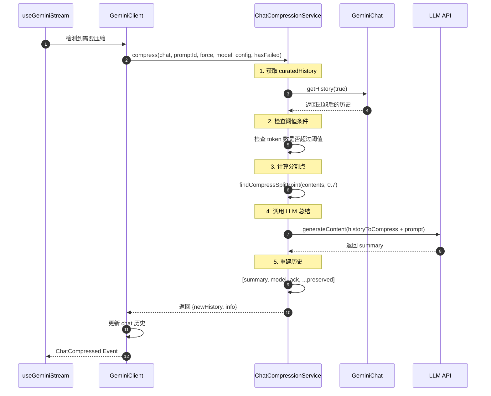
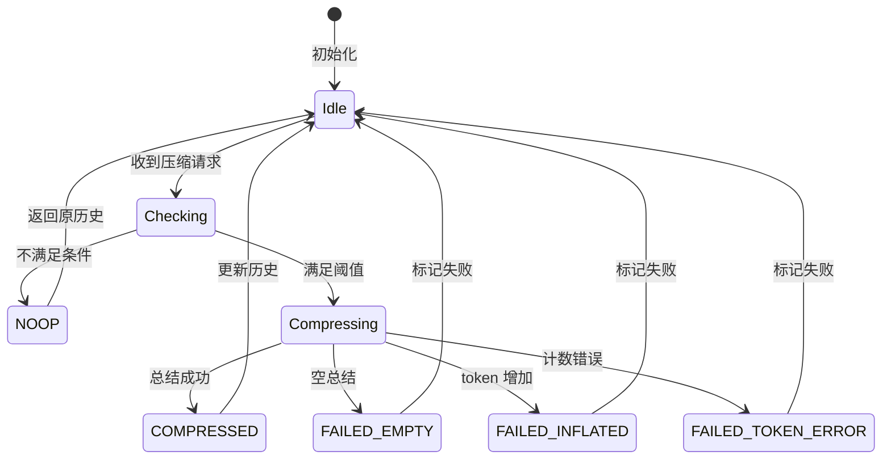
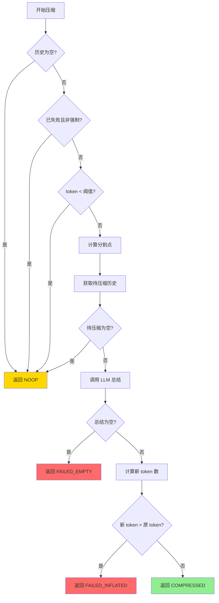
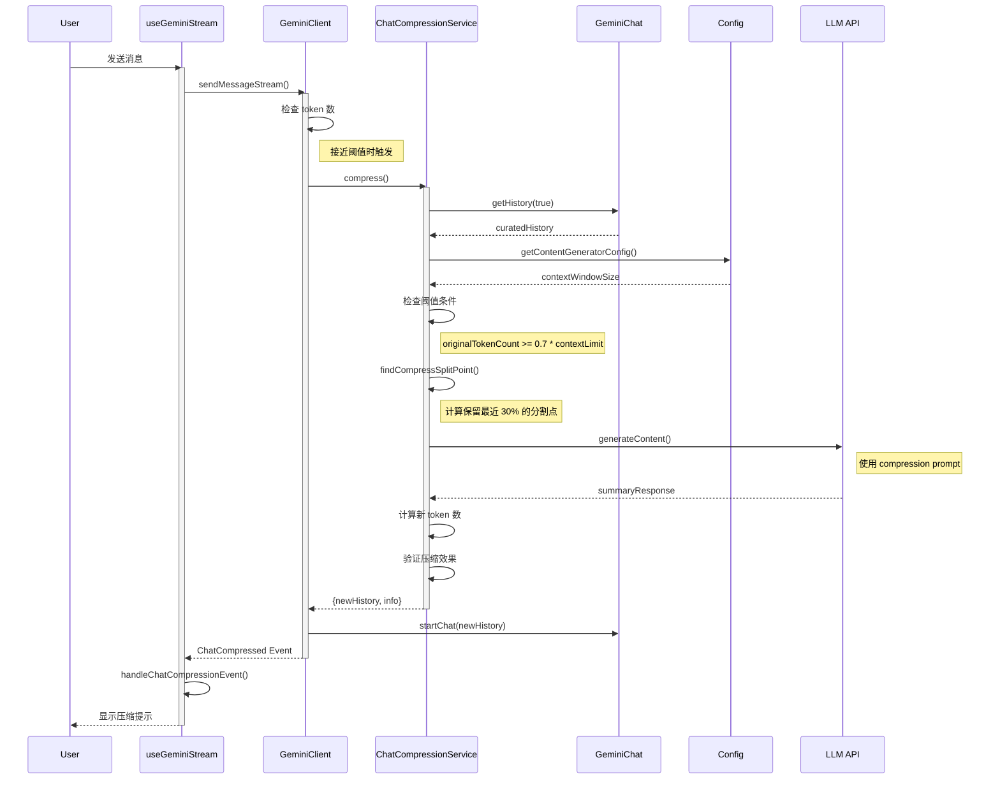
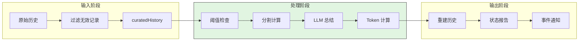
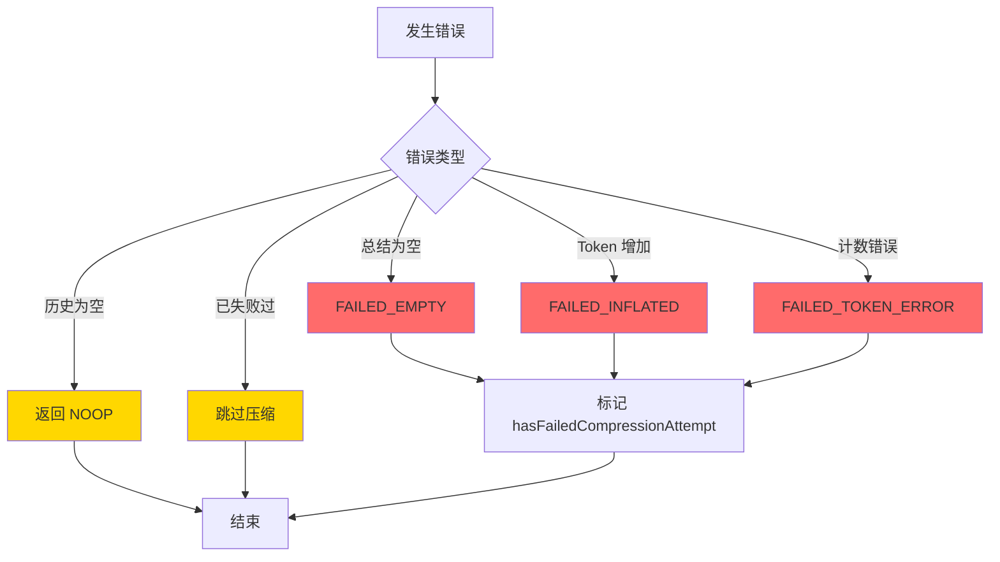
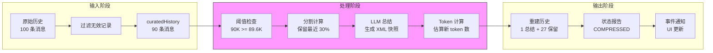
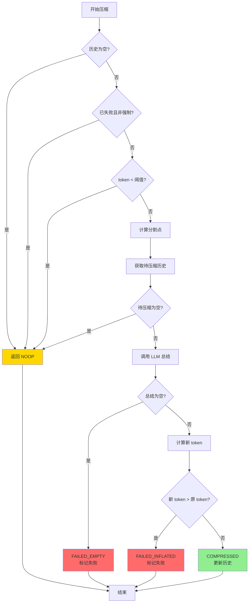
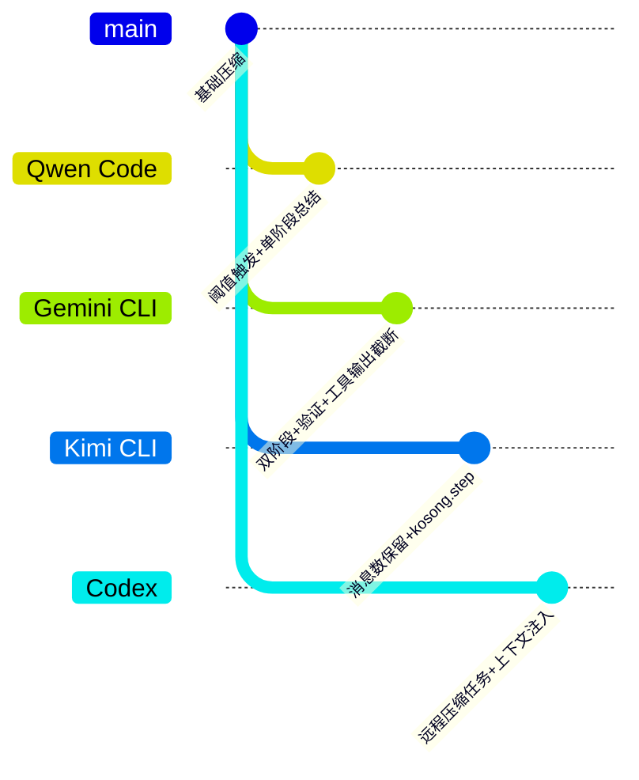

# 上下文压缩机制（Qwen Code）

## TL;DR（结论先行）

一句话定义：上下文压缩是 Qwen Code 在对话历史超过模型上下文窗口阈值时，自动将早期对话历史总结为结构化 XML 快照并替换原始消息的机制。

Qwen Code 的核心取舍：**阈值触发 + 模型总结 + 智能分割**（对比 Gemini CLI 的双阶段压缩 + 验证、Kimi CLI 的消息数保留策略、Codex 的远程压缩任务）

---

## 1. 为什么需要这个机制？（解决什么问题）

### 1.1 问题场景

没有上下文压缩：
- 用户与 Agent 进行长对话（如重构大型代码库）
- 对话历史不断增长，token 数接近模型上限（如 128K）
- LLM 调用失败或响应质量下降（上下文截断导致信息丢失）

有上下文压缩：
- 当 token 数达到阈值（默认 70%），系统自动触发压缩
- 早期对话被总结为结构化的 `<state_snapshot>` XML
- 保留最近 30% 的完整对话，确保上下文连续性
- LLM 继续正常工作，用户无感知

### 1.2 核心挑战

| 挑战 | 不解决的后果 |
|-----|-------------|
| Token 超限 | LLM API 报错或强制截断，导致信息丢失 |
| 总结质量 | 压缩后丢失关键信息（如文件修改、用户指令） |
| 分割边界 | 在 function call/response 中间分割导致对话断裂 |
| 压缩失败 | 重复尝试压缩造成资源浪费和用户体验下降 |

---

## 2. 整体架构（ASCII 图）

### 2.1 在系统中的位置

```text
┌─────────────────────────────────────────────────────────────┐
│ UI Layer / useGeminiStream                                   │
│ packages/cli/src/ui/hooks/useGeminiStream.ts:909            │
└───────────────────────┬─────────────────────────────────────┘
                        │ ChatCompressed Event
                        ▼
┌─────────────────────────────────────────────────────────────┐
│ ▓▓▓ 上下文压缩机制 ▓▓▓                                        │
│ packages/core/src/services/chatCompressionService.ts        │
│ - ChatCompressionService.compress() : 压缩入口               │
│ - findCompressSplitPoint()          : 分割点计算             │
│ - getCompressionPrompt()            : 总结 Prompt            │
└───────────────────────┬─────────────────────────────────────┘
                        │
        ┌───────────────┼───────────────┐
        ▼               ▼               ▼
┌──────────────┐ ┌──────────────┐ ┌──────────────┐
│ GeminiChat   │ │ Config       │ │ Telemetry    │
│ 获取历史记录  │ │ 阈值配置     │ │ 压缩事件上报 │
└──────────────┘ └──────────────┘ └──────────────┘
```

### 2.2 核心组件职责

| 组件 | 职责 | 代码位置 |
|-----|------|---------|
| `ChatCompressionService` | 压缩逻辑主入口，协调各步骤 | `packages/core/src/services/chatCompressionService.ts:78` |
| `findCompressSplitPoint` | 计算历史分割点（保留最近 30%） | `packages/core/src/services/chatCompressionService.ts:36` |
| `getCompressionPrompt` | 提供结构化总结的系统 Prompt | `packages/core/src/core/prompts.ts:349` |
| `CompressionStatus` | 定义压缩结果状态枚举 | `packages/core/src/core/turn.ts:152` |
| `tryCompressChat` | Client 层压缩调用入口 | `packages/core/src/core/client.ts:630` |

### 2.3 核心组件交互关系



**关键交互说明**：

| 步骤 | 交互内容 | 设计意图 |
|-----|---------|---------|
| 1 | UI 层触发压缩检测 | 解耦压缩逻辑与 UI 渲染 |
| 2 | 获取过滤后的历史 | 排除无效记录，减少噪声 |
| 3 | 阈值检查 | 避免不必要的压缩开销 |
| 4 | LLM 总结 | 使用结构化 Prompt 确保输出质量 |
| 5 | 重建历史 | 保留最近对话，确保上下文连续 |

---

## 3. 核心组件详细分析

### 3.1 ChatCompressionService 内部结构

#### 职责定位

`ChatCompressionService` 是上下文压缩的核心协调器，负责：阈值检查、分割计算、LLM 总结、历史重建、状态报告。

#### 状态机图



**状态说明**：

| 状态 | 说明 | 进入条件 | 退出条件 |
|-----|------|---------|---------|
| Idle | 空闲等待 | 初始化或处理结束 | 收到压缩请求 |
| Checking | 检查条件 | 收到压缩请求 | 条件判断完成 |
| Compressing | 执行压缩 | 满足阈值条件 | 压缩完成或失败 |
| COMPRESSED | 压缩成功 | 总结有效且 token 减少 | 返回新历史 |
| NOOP | 无需操作 | 不满足阈值或历史为空 | 返回原历史 |
| FAILED_* | 各种失败状态 | 压缩过程中出错 | 标记失败状态 |

#### 内部数据流

```text
┌─────────────────────────────────────────────────────────────┐
│  输入层                                                      │
│  ├── chat.getHistory(true) ──► 过滤无效记录                  │
│  ├── config.getChatCompression() ──► 获取阈值配置            │
│  └── uiTelemetryService.getLastPromptTokenCount()            │
└──────────────────────────┬──────────────────────────────────┘
                           ▼
┌─────────────────────────────────────────────────────────────┐
│  处理层                                                      │
│  ├── 阈值检查: originalTokenCount >= threshold * contextLimit│
│  ├── 分割计算: findCompressSplitPoint(contents, 0.7)         │
│  │   └── 只在 user message 边界分割（排除 functionResponse） │
│  ├── LLM 总结: generateContent(historyToCompress + prompt)   │
│  └── Token 计算: original - input + output - 1000            │
└──────────────────────────┬──────────────────────────────────┘
                           ▼
┌─────────────────────────────────────────────────────────────┐
│  输出层                                                      │
│  ├── 重建历史: [summary, ack, ...preserved]                  │
│  ├── 状态报告: CompressionStatus                             │
│  └── 事件通知: ChatCompressed Event                          │
└─────────────────────────────────────────────────────────────┘
```

#### 关键算法逻辑



**算法要点**：

1. **分层条件检查**：先检查空历史、失败标记、阈值，避免无效计算
2. **智能分割**：只在 user message 边界分割，避免在 function call/response 中间切断
3. **Token 估算**：使用 `original - input + output - 1000` 估算新 token 数（1000 为 prompt 开销）
4. **失败保护**：压缩失败时标记 `hasFailedCompressionAttempt`，避免重复尝试

#### 关键接口

| 接口 | 输入 | 输出 | 说明 | 代码位置 |
|-----|------|------|------|---------|
| `compress()` | chat, promptId, force, model, config, hasFailed | {newHistory, info} | 压缩主入口 | `packages/core/src/services/chatCompressionService.ts:79` |
| `findCompressSplitPoint()` | contents, fraction | number | 计算分割索引 | `packages/core/src/services/chatCompressionService.ts:36` |
| `getCompressionPrompt()` | - | string | 获取总结 Prompt | `packages/core/src/core/prompts.ts:349` |

---

### 3.2 分割点计算算法

```typescript
// packages/core/src/services/chatCompressionService.ts:36-76
export function findCompressSplitPoint(
  contents: Content[],
  fraction: number,
): number {
  // 基于字符数计算分割点
  const charCounts = contents.map((content) => JSON.stringify(content).length);
  const totalCharCount = charCounts.reduce((a, b) => a + b, 0);
  const targetCharCount = totalCharCount * fraction;

  let lastSplitPoint = 0; // 0 表示不压缩
  let cumulativeCharCount = 0;

  for (let i = 0; i < contents.length; i++) {
    const content = contents[i];
    // ✅ 只在 user message 处分割（排除 functionResponse）
    if (
      content.role === 'user' &&
      !content.parts?.some((part) => !!part.functionResponse)
    ) {
      if (cumulativeCharCount >= targetCharCount) {
        return i; // 找到合适的分割点
      }
      lastSplitPoint = i;
    }
    cumulativeCharCount += charCounts[i];
  }

  // 检查是否可以压缩全部
  const lastContent = contents[contents.length - 1];
  if (
    lastContent?.role === 'model' &&
    !lastContent?.parts?.some((part) => part.functionCall)
  ) {
    return contents.length; // 可以压缩全部
  }

  return lastSplitPoint; // 返回最后一个可用分割点
}
```

**关键设计**：
- 使用字符数而非 token 数估算（避免本地 token 计算开销）
- 只在 `user` role 且非 `functionResponse` 处分割，确保对话结构完整
- 如果最后一条是 model 消息且无 function call，可以压缩全部历史

---

### 3.3 组件间协作时序



**协作要点**：

1. **UI 与 Client**：UI 层通过 `useGeminiStream` Hook 监听压缩事件，更新界面提示
2. **Client 与 Service**：`tryCompressChat` 封装压缩调用，处理成功/失败逻辑
3. **Service 与 LLM**：使用专用 Prompt 生成结构化总结，确保输出质量

---

### 3.4 关键数据路径

#### 主路径（正常流程）



#### 异常路径（错误恢复）



---

## 4. 端到端数据流转

### 4.1 正常流程（详细版）

```mermaid
sequenceDiagram
    participant A as Agent Loop
    participant B as GeminiClient
    participant C as ChatCompressionService
    participant D as GeminiChat
    participant E as LLM API

    A->>B: tryCompressChat(promptId, force)
    B->>C: compress(chat, promptId, force, model, config, hasFailed)

    Note over C: 步骤 1: 获取历史
    C->>D: getHistory(true)
    D-->>C: curatedHistory (过滤后)

    Note over C: 步骤 2: 阈值检查
    C->>C: originalTokenCount = getLastPromptTokenCount()
    C->>C: contextLimit = config.getContentGeneratorConfig()?.contextWindowSize
    C->>C: threshold = config.getChatCompression()?.contextPercentageThreshold ?? 0.7

    Note over C: 步骤 3: 分割计算
    C->>C: splitPoint = findCompressSplitPoint(curatedHistory, 0.7)
    C->>C: historyToCompress = curatedHistory.slice(0, splitPoint)
    C->>C: historyToKeep = curatedHistory.slice(splitPoint)

    Note over C: 步骤 4: LLM 总结
    C->>E: generateContent({
              model,
              contents: [...historyToCompress, userPrompt],
              systemInstruction: getCompressionPrompt()
            })
    E-->>C: summaryResponse

    Note over C: 步骤 5: Token 计算
    C->>C: compressionInputTokenCount = summaryResponse.usageMetadata?.promptTokenCount
    C->>C: compressionOutputTokenCount = summaryResponse.usageMetadata?.candidatesTokenCount
    C->>C: newTokenCount = original - (input - 1000) + output

    Note over C: 步骤 6: 重建历史
    C->>C: extraHistory = [
              {role: 'user', parts: [{text: summary}]},
              {role: 'model', parts: [{text: 'Got it. Thanks!'}]},
              ...historyToKeep
            ]

    C-->>B: {newHistory: extraHistory, info: {originalTokenCount, newTokenCount, compressionStatus: COMPRESSED}}
    B->>D: startChat(newHistory)
    B-->>A: ChatCompressionInfo
```

**数据变换详情**：

| 阶段 | 输入 | 处理 | 输出 | 代码位置 |
|-----|------|------|------|---------|
| 获取历史 | chat | getHistory(true) | curatedHistory | `packages/core/src/core/geminiChat.ts` |
| 阈值检查 | originalTokenCount, contextLimit | original >= 0.7 * limit | boolean | `packages/core/src/services/chatCompressionService.ts:111-125` |
| 分割计算 | curatedHistory, fraction | 字符数累加，找 user message 边界 | splitPoint | `packages/core/src/services/chatCompressionService.ts:127-130` |
| LLM 总结 | historyToCompress, prompt | generateContent | summary | `packages/core/src/services/chatCompressionService.ts:146-165` |
| Token 计算 | original, input, output | original - (input - 1000) + output | newTokenCount | `packages/core/src/services/chatCompressionService.ts:207-220` |
| 历史重建 | summary, historyToKeep | 组装新历史数组 | extraHistory | `packages/core/src/services/chatCompressionService.ts:189-199` |

### 4.2 数据流向图



### 4.3 异常/边界流程



---

## 5. 关键代码实现

### 5.1 核心数据结构

```typescript
// packages/core/src/core/turn.ts:152-167
export enum CompressionStatus {
  /** 压缩成功 */
  COMPRESSED = 1,
  /** 压缩后 token 数增加 */
  COMPRESSION_FAILED_INFLATED_TOKEN_COUNT,
  /** token 计数错误 */
  COMPRESSION_FAILED_TOKEN_COUNT_ERROR,
  /** 总结为空 */
  COMPRESSION_FAILED_EMPTY_SUMMARY,
  /** 无需操作 */
  NOOP,
}

export interface ChatCompressionInfo {
  originalTokenCount: number;
  newTokenCount: number;
  compressionStatus: CompressionStatus;
}
```

**字段说明**：

| 字段 | 类型 | 用途 |
|-----|------|------|
| `compressionStatus` | `CompressionStatus` | 标识压缩结果状态 |
| `originalTokenCount` | `number` | 压缩前的 token 数 |
| `newTokenCount` | `number` | 压缩后的 token 数 |

### 5.2 主链路代码

```typescript
// packages/core/src/services/chatCompressionService.ts:79-145
async compress(
  chat: GeminiChat,
  promptId: string,
  force: boolean,
  model: string,
  config: Config,
  hasFailedCompressionAttempt: boolean,
): Promise<{ newHistory: Content[] | null; info: ChatCompressionInfo }> {
  const curatedHistory = chat.getHistory(true);
  const threshold =
    config.getChatCompression()?.contextPercentageThreshold ??
    COMPRESSION_TOKEN_THRESHOLD; // 0.7

  // 1. 基本条件检查
  if (
    curatedHistory.length === 0 ||
    threshold <= 0 ||
    (hasFailedCompressionAttempt && !force)
  ) {
    return { newHistory: null, info: { compressionStatus: CompressionStatus.NOOP, ... } };
  }

  const originalTokenCount = uiTelemetryService.getLastPromptTokenCount();

  // 2. 阈值检查
  if (!force) {
    const contextLimit =
      config.getContentGeneratorConfig()?.contextWindowSize ??
      DEFAULT_TOKEN_LIMIT;
    if (originalTokenCount < threshold * contextLimit) {
      return { newHistory: null, info: { compressionStatus: CompressionStatus.NOOP, ... } };
    }
  }

  // 3. 计算分割点
  const splitPoint = findCompressSplitPoint(
    curatedHistory,
    1 - COMPRESSION_PRESERVE_THRESHOLD, // 0.7
  );
  const historyToCompress = curatedHistory.slice(0, splitPoint);
  const historyToKeep = curatedHistory.slice(splitPoint);

  if (historyToCompress.length === 0) {
    return { newHistory: null, info: { compressionStatus: CompressionStatus.NOOP, ... } };
  }

  // 4. 调用 LLM 总结
  const summaryResponse = await config.getContentGenerator().generateContent(
    {
      model,
      contents: [...historyToCompress, { role: 'user', parts: [...] }],
      config: { systemInstruction: getCompressionPrompt() },
    },
    promptId,
  );
  // ... 处理结果
}
```

**代码要点**：

1. **分层条件检查**：先检查空历史、失败标记，再检查阈值，避免无效计算
2. **字符数估算分割**：使用 `JSON.stringify(content).length` 估算，避免本地 token 计算
3. **保留边界完整性**：只在 user message 边界分割，确保对话结构完整

### 5.3 关键调用链

```text
tryCompressChat()          [packages/core/src/core/client.ts:630]
  -> ChatCompressionService.compress()   [packages/core/src/services/chatCompressionService.ts:79]
    -> chat.getHistory(true)             [packages/core/src/core/geminiChat.ts]
    -> findCompressSplitPoint()          [packages/core/src/services/chatCompressionService.ts:36]
      - 字符数累加计算
      - 找 user message 边界
    -> config.getContentGenerator().generateContent()  [LLM API]
      - 使用 compression prompt
      - 生成结构化总结
    -> 计算新 token 数
      - original - (input - 1000) + output
    -> 返回 {newHistory, info}
  -> chat.startChat(newHistory)          [packages/core/src/core/client.ts:655]
  -> 返回 ChatCompressionInfo
```

---

## 6. 设计意图与 Trade-off

### 6.1 Qwen Code 的选择

| 维度 | Qwen Code 的选择 | 替代方案 | 取舍分析 |
|-----|-----------------|---------|---------|
| 触发方式 | 阈值触发（70%） | 固定消息数/手动触发 | 自动触发减少用户干预，但需要精确阈值配置 |
| 分割策略 | 字符数估算 + user message 边界 | Token 精确计算 | 避免本地 token 计算开销，但分割精度略低 |
| 总结方式 | 单阶段 LLM 总结 | 双阶段总结 + 验证 | 简单高效，但可能遗漏关键信息 |
| 保留策略 | 保留最近 30% | 固定消息数保留 | 适应不同长度对话，但保留量不稳定 |
| 失败处理 | 标记失败避免重试 | 无限重试/降级截断 | 避免资源浪费，但可能错过压缩机会 |

### 6.2 为什么这样设计？

**核心问题**：如何在保证压缩质量的同时，最小化计算开销和用户体验影响？

**Qwen Code 的解决方案**：
- 代码依据：`packages/core/src/services/chatCompressionService.ts:36-76`
- 设计意图：使用字符数估算代替精确 token 计算，减少本地计算开销
- 带来的好处：
  - 无需引入复杂的本地 token 计算库
  - 分割计算速度快，延迟低
  - 在 user message 边界分割，保证对话结构完整
- 付出的代价：
  - 分割精度不如 token 精确计算
  - 可能保留略多或略少的历史

**总结 Prompt 设计**：
- 代码依据：`packages/core/src/core/prompts.ts:349-420`
- 设计意图：使用结构化 XML 格式 (`<state_snapshot>`) 强制模型输出规范化总结
- 带来的好处：
  - 总结格式统一，便于后续处理
  - 明确指导模型保留关键信息（目标、知识、文件状态、最近操作）
- 付出的代价：
  - Prompt 较长，增加总结阶段的 token 开销

### 6.3 与其他项目的对比



| 项目 | 核心差异 | 适用场景 |
|-----|---------|---------|
| Qwen Code | 单阶段总结，字符数估算分割，阈值 70% | 追求简单高效，对分割精度要求不极端 |
| Gemini CLI | 双阶段总结（生成+验证），工具输出反向预算截断，阈值 50% | 高可靠性要求，需要验证总结质量 |
| Kimi CLI | 固定保留最近 N 条消息（默认 2 条），使用 kosong.step 执行压缩 | 简单场景，快速实现 |
| Codex | 支持远程压缩任务，多种初始上下文注入策略，用户消息 token 限制 | 复杂企业场景，需要灵活配置 |

**详细对比分析**：

| 维度 | Qwen Code | Gemini CLI | Kimi CLI | Codex |
|-----|-----------|------------|----------|-------|
| **触发阈值** | 70% | 50% | 无固定阈值，基于 max_context_size | 可配置 |
| **分割依据** | 字符数估算 | Token 估算 | 消息数 | Token 估算 |
| **保留策略** | 最近 30% | 最近 30% | 最近 2 条消息 | 可配置 |
| **总结阶段** | 单阶段 | 双阶段（生成+验证） | 单阶段 | 单阶段 |
| **特殊处理** | 无 | 工具输出反向预算截断 | 无 | 远程压缩任务 |
| **失败处理** | 标记失败避免重试 | 降级为截断模式 | 重试机制 | 错误恢复 |

**设计选择分析**：

1. **Qwen Code vs Gemini CLI**：
   - Qwen Code 选择单阶段总结，更简单高效
   - Gemini CLI 增加验证阶段，确保总结质量，但增加一次 LLM 调用开销
   - Gemini CLI 还实现了工具输出的反向预算截断（从最新开始保留 50K token 预算），处理大工具输出场景

2. **Qwen Code vs Kimi CLI**：
   - Qwen Code 使用百分比阈值，适应不同上下文窗口大小
   - Kimi CLI 使用固定消息数保留，实现更简单但不够灵活
   - Kimi CLI 使用 `kosong.step` 执行压缩，与主 LLM 调用解耦

3. **Qwen Code vs Codex**：
   - Codex 支持远程压缩任务（`should_use_remote_compact_task`），可卸载到远程执行
   - Codex 实现多种初始上下文注入策略（`InitialContextInjection`），更灵活
   - Codex 对用户消息有 20K token 限制（`COMPACT_USER_MESSAGE_MAX_TOKENS`）

---

## 7. 边界情况与错误处理

### 7.1 终止条件

| 终止原因 | 触发条件 | 代码位置 |
|---------|---------|---------|
| 历史为空 | `curatedHistory.length === 0` | `packages/core/src/services/chatCompressionService.ts:93` |
| 阈值为 0 | `threshold <= 0` | `packages/core/src/services/chatCompressionService.ts:95` |
| 已失败过 | `hasFailedCompressionAttempt && !force` | `packages/core/src/services/chatCompressionService.ts:96` |
| 未达阈值 | `originalTokenCount < threshold * contextLimit` | `packages/core/src/services/chatCompressionService.ts:115` |
| 无内容可压缩 | `historyToCompress.length === 0` | `packages/core/src/services/chatCompressionService.ts:135` |

### 7.2 失败状态处理

```typescript
// packages/core/src/services/chatCompressionService.ts:233-271
if (isSummaryEmpty) {
  return {
    newHistory: null,
    info: {
      originalTokenCount,
      newTokenCount: originalTokenCount,
      compressionStatus: CompressionStatus.COMPRESSION_FAILED_EMPTY_SUMMARY,
    },
  };
} else if (!canCalculateNewTokenCount) {
  return {
    newHistory: null,
    info: {
      originalTokenCount,
      newTokenCount: originalTokenCount,
      compressionStatus: CompressionStatus.COMPRESSION_FAILED_TOKEN_COUNT_ERROR,
    },
  };
} else if (newTokenCount > originalTokenCount) {
  return {
    newHistory: null,
    info: {
      originalTokenCount,
      newTokenCount,
      compressionStatus: CompressionStatus.COMPRESSION_FAILED_INFLATED_TOKEN_COUNT,
    },
  };
} else {
  // 成功
  uiTelemetryService.setLastPromptTokenCount(newTokenCount);
  return {
    newHistory: extraHistory,
    info: {
      originalTokenCount,
      newTokenCount,
      compressionStatus: CompressionStatus.COMPRESSED,
    },
  };
}
```

### 7.3 错误恢复策略

| 错误类型 | 处理策略 | 代码位置 |
|---------|---------|---------|
| 总结为空 | 返回 `FAILED_EMPTY_SUMMARY`，标记失败避免重试 | `packages/core/src/services/chatCompressionService.ts:233-241` |
| Token 计数错误 | 返回 `FAILED_TOKEN_COUNT_ERROR`，标记失败避免重试 | `packages/core/src/services/chatCompressionService.ts:242-251` |
| Token 数增加 | 返回 `FAILED_INFLATED_TOKEN_COUNT`，标记失败避免重试 | `packages/core/src/services/chatCompressionService.ts:252-262` |
| 强制压缩 | 忽略 `hasFailedCompressionAttempt` 标记 | `packages/core/src/services/chatCompressionService.ts:96` |

**失败标记机制**：
- 当压缩失败（空总结、token 增加、计数错误）时，Client 层设置 `hasFailedCompressionAttempt = true`
- 后续压缩请求会检查此标记，避免重复尝试导致资源浪费
- 用户可通过 `/compress` 命令强制压缩（`force=true`）

---

## 8. 关键代码索引

| 功能 | 文件 | 行号 | 说明 |
|-----|------|------|------|
| 入口 | `packages/core/src/core/client.ts` | 630-672 | `tryCompressChat` 方法 |
| 核心 | `packages/core/src/services/chatCompressionService.ts` | 78-274 | `ChatCompressionService` 类 |
| 分割算法 | `packages/core/src/services/chatCompressionService.ts` | 36-76 | `findCompressSplitPoint` 函数 |
| 压缩 Prompt | `packages/core/src/core/prompts.ts` | 349-420 | `getCompressionPrompt` 函数 |
| 状态定义 | `packages/core/src/core/turn.ts` | 152-173 | `CompressionStatus` 枚举 |
| 事件处理 | `packages/cli/src/ui/hooks/useGeminiStream.ts` | 781-830 | `handleChatCompressionEvent` |
| 配置 | `packages/cli/src/config/settingsSchema.ts` | - | 压缩相关配置项 |
| 测试 | `packages/core/src/services/chatCompressionService.test.ts` | 104-500 | 单元测试 |

---

## 9. 延伸阅读

- 前置知识：`docs/comm/comm-technical-point-template.md`
- 相关机制：
  - `docs/gemini-cli/07-gemini-cli-memory-context.md` - Gemini CLI 内存管理
  - `docs/kimi-cli/07-kimi-cli-memory-context.md` - Kimi CLI 内存管理
  - `docs/codex/07-codex-memory-context.md` - Codex 内存管理
- 深度分析：
  - `docs/gemini-cli/questions/gemini-cli-context-compaction.md` - Gemini CLI 压缩机制
  - `docs/kimi-cli/questions/kimi-cli-context-compaction.md` - Kimi CLI 压缩机制

---

*✅ Verified: 基于 qwen-code/packages/core/src/services/chatCompressionService.ts 等源码分析*
*基于版本：2025-02-08 | 最后更新：2026-02-24*
