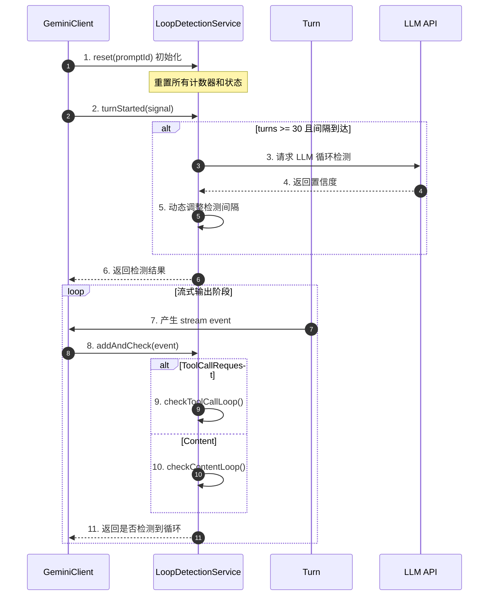
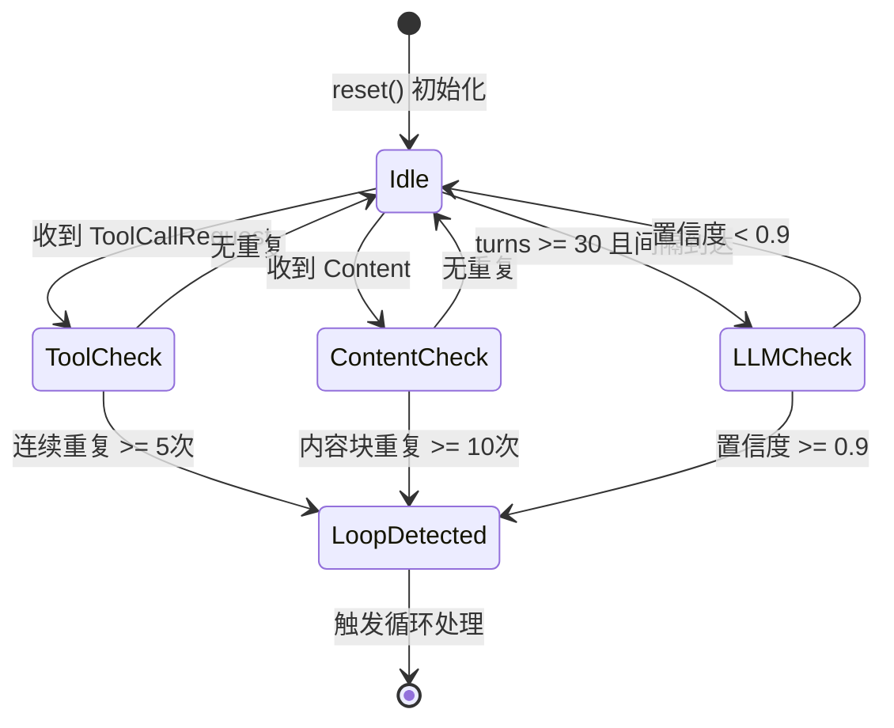
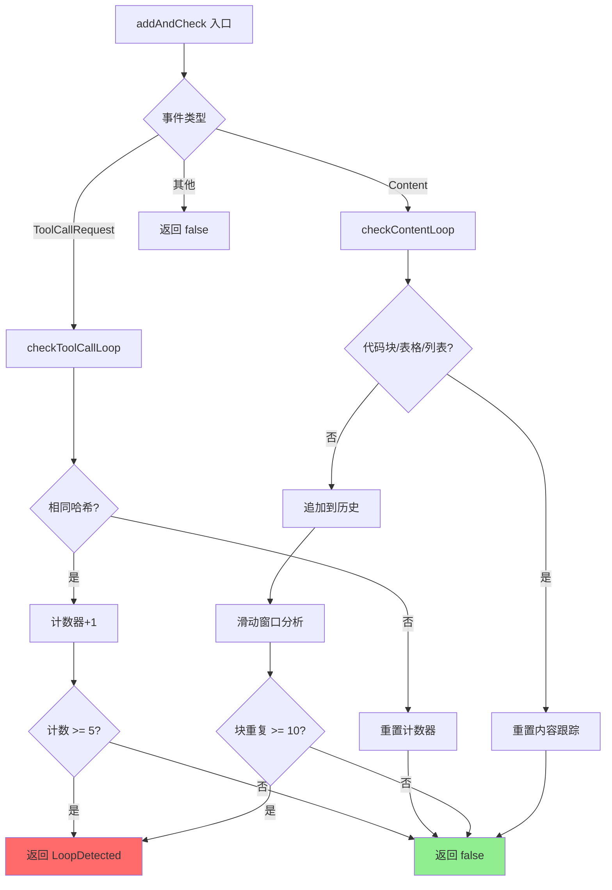
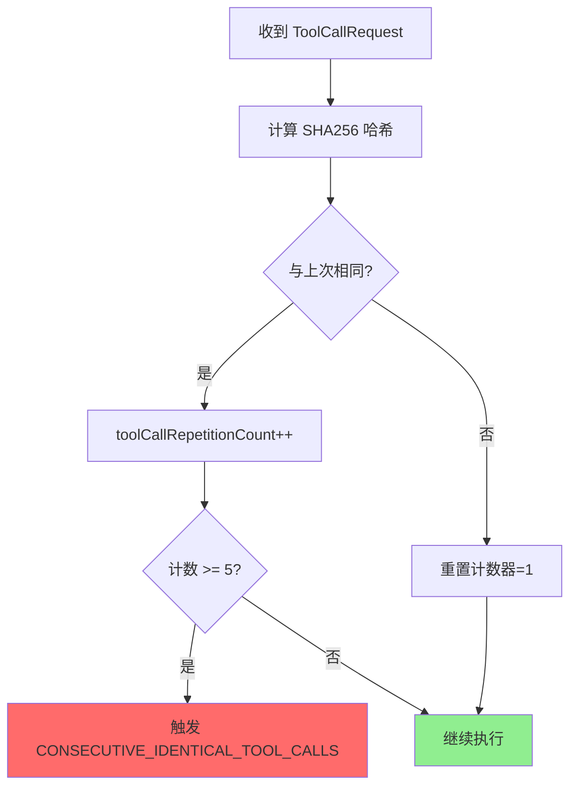
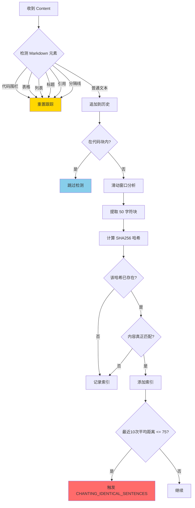
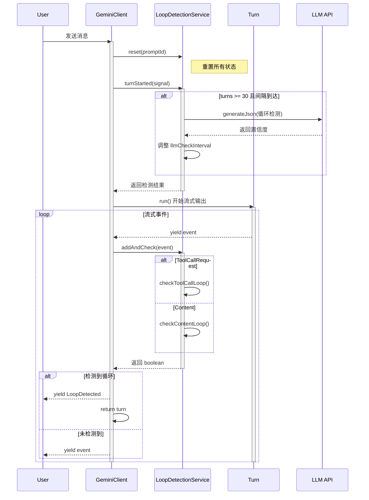
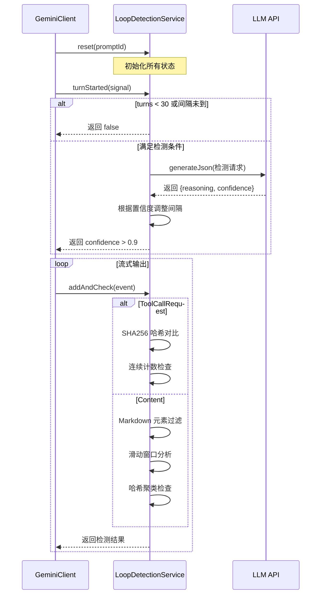
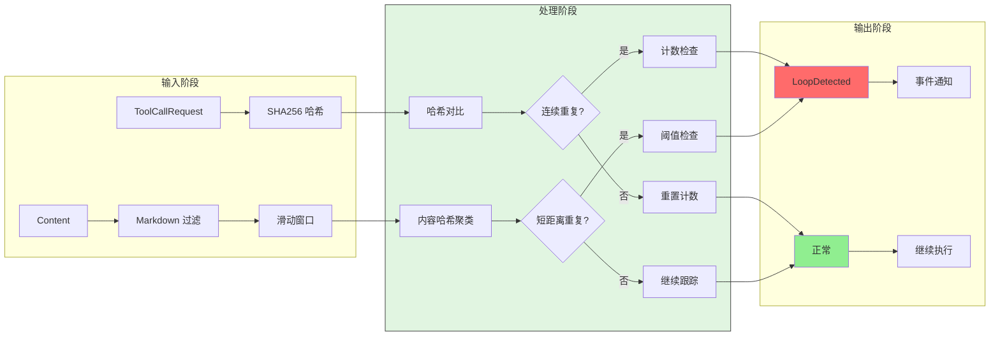
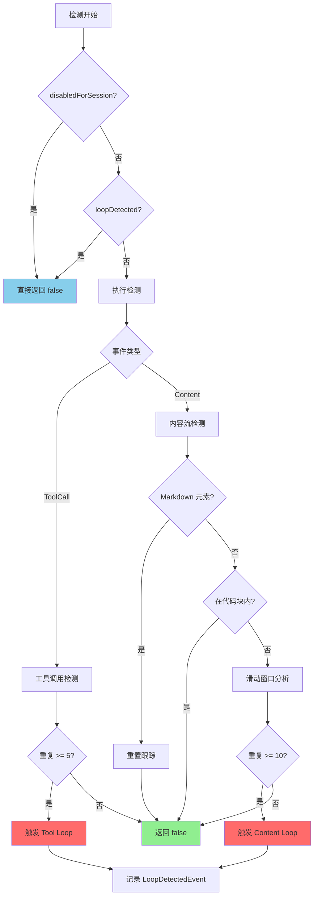
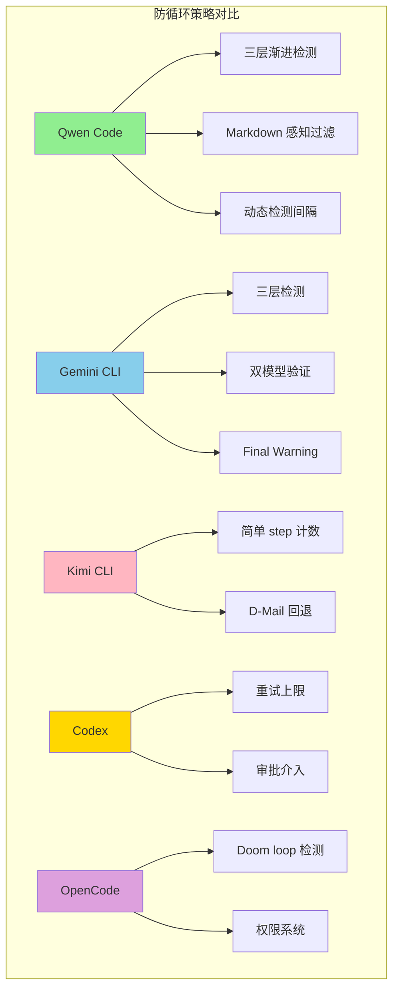

# 循环检测机制（Qwen Code）

## TL;DR（结论先行）

Qwen Code 通过**三层渐进式循环检测**（工具调用哈希重复、内容流滑动窗口、LLM 语义分析）+ **动态检测间隔调整** + **会话级禁用控制**防止 Agent 陷入无限循环。

Qwen Code 的核心取舍：**渐进式智能检测 + 代码块感知过滤**（对比 Gemini CLI 的双模型验证、Kimi CLI 的简单计数限制、Codex 的审批介入策略）

---

## 1. 为什么需要这个机制？

### 1.1 问题场景

没有循环检测机制时，Agent 可能出现以下行为：

```
用户: "修复这个 bug"

→ LLM: "读取文件 A" → 读取成功
→ LLM: "修改文件 A" → 修改成功
→ LLM: "读取文件 A" → 读取成功（重复！）
→ LLM: "修改文件 A" → 修改成功（重复！）
→ ... 无限循环 ...
```

或者内容层面的重复（Chanting）：

```
LLM: "我需要分析这个问题..."
LLM: "我需要分析这个问题..."
LLM: "我需要分析这个问题..." （重复输出相同内容）
```

### 1.2 核心挑战

| 挑战 | 不解决的后果 |
|-----|-------------|
| 相同工具调用重复 | 资源浪费，API 费用激增，用户等待时间延长 |
| 内容流重复输出（Chanting）| 用户体验差，输出无意义，无法推进任务 |
| 复杂语义级循环 | 难以用简单规则检测，需要理解对话上下文 |
| 代码块内自然重复 | 代码常有重复结构，容易被误检测为循环 |
| 硬性中断体验差 | 用户不知道发生了什么，无法优雅恢复 |

---

## 2. 整体架构

### 2.1 在系统中的位置

```text
┌─────────────────────────────────────────────────────────────┐
│ Agent Loop / GeminiClient                                    │
│ packages/core/src/core/client.ts:sendMessageStream()        │
└───────────────────────┬─────────────────────────────────────┘
                        │ 调用
                        ▼
┌─────────────────────────────────────────────────────────────┐
│ ▓▓▓ LoopDetectionService ▓▓▓                                │
│ packages/core/src/services/loopDetectionService.ts          │
│ - checkToolCallLoop()       : 工具调用重复检测               │
│ - checkContentLoop()        : 内容流重复检测                 │
│ - analyzeContentChunksForLoop(): 滑动窗口分析               │
│ - checkForLoopWithLLM()     : LLM 语义检测                   │
│ - turnStarted()             : Turn 开始检查                  │
│ - addAndCheck()             : 流式事件检测                   │
└───────────────────────┬─────────────────────────────────────┘
                        │ 依赖/调用
                        ▼
┌───────────────────────┬───────────────────────┬─────────────┐
│ GeminiClient          │ Telemetry             │ Config      │
│ packages/core/src/    │ packages/core/src/    │ packages/   │
│ core/client.ts        │ telemetry/            │ core/src/   │
│                       │                       │ config/     │
└───────────────────────┴───────────────────────┴─────────────┘
```

### 2.2 核心组件职责

| 组件 | 职责 | 代码位置 |
|-----|------|---------|
| `LoopDetectionService` | 三层循环检测协调中心 | `packages/core/src/services/loopDetectionService.ts:78` |
| `checkToolCallLoop()` | 工具调用 SHA256 哈希重复检测 | `packages/core/src/services/loopDetectionService.ts:175` |
| `checkContentLoop()` | 内容流重复检测（含代码块过滤） | `packages/core/src/services/loopDetectionService.ts:207` |
| `analyzeContentChunksForLoop()` | 滑动窗口内容块分析 | `packages/core/src/services/loopDetectionService.ts:287` |
| `isLoopDetectedForChunk()` | 单一块循环判断逻辑 | `packages/core/src/services/loopDetectionService.ts:331` |
| `checkForLoopWithLLM()` | LLM 语义级循环检测 | `packages/core/src/services/loopDetectionService.ts:395` |
| `turnStarted()` | 每 Turn 开始时触发 LLM 检测 | `packages/core/src/services/loopDetectionService.ts:158` |
| `addAndCheck()` | 流式事件实时检测入口 | `packages/core/src/services/loopDetectionService.ts:127` |

### 2.3 核心组件交互关系



**关键交互说明**：

| 步骤 | 交互内容 | 设计意图 |
|-----|---------|---------|
| 1 | 每次新 prompt 重置状态 | 避免跨会话误检测 |
| 2-6 | Turn 级别 LLM 检测 | 长对话后才启用高成本检测 |
| 7-11 | 流式实时检测 | 在内容生成过程中即时发现循环 |
| 9 | 工具调用哈希检测 | 检测相同工具+参数的重复调用 |
| 10 | 内容流滑动窗口检测 | 检测输出内容的重复模式 |

---

## 3. 核心组件详细分析

### 3.1 LoopDetectionService 内部结构

#### 职责定位

协调三层检测机制，提供统一的循环检测接口，支持流式实时检测和 Turn 级别语义检测。

#### 状态机图



**状态说明**：

| 状态 | 说明 | 进入条件 | 退出条件 |
|-----|------|---------|---------|
| Idle | 等待检测 | 初始化或检测完成 | 收到新输入 |
| ToolCheck | 工具调用检测 | 收到 ToolCallRequest 事件 | 检测完成 |
| ContentCheck | 内容流检测 | 收到 Content 事件 | 检测完成 |
| LLMCheck | 语义级检测 | 达到检测条件 | 收到模型响应 |
| LoopDetected | 检测到循环 | 任一层触发 | 返回检测结果 |

#### 内部数据流

```text
┌─────────────────────────────────────────────────────────────┐
│  输入层                                                      │
│  ├── 工具调用 ──► SHA256 哈希 ──► 哈希对比                   │
│  │   └── `${name}:${JSON.stringify(args)}`                  │
│  └── 内容块   ──► 滑动窗口(50字符) ──► 哈希聚类              │
│      └── 代码块/表格/列表过滤                                │
└──────────────────────────┬──────────────────────────────────┘
                           ▼
┌─────────────────────────────────────────────────────────────┐
│  处理层                                                      │
│  ├── 工具调用计数器: 连续相同哈希计数 (阈值: 5)              │
│  ├── 内容流历史: MAX_HISTORY_LENGTH=1000                     │
│  │   └── contentStats: Map<hash, indices[]>                 │
│  └── LLM 检测调度: 动态间隔(5-15轮)                          │
│      └── 置信度驱动间隔调整                                  │
└──────────────────────────┬──────────────────────────────────┘
                           ▼
┌─────────────────────────────────────────────────────────────┐
│  输出层                                                      │
│  ├── 检测结果: boolean                                       │
│  ├── LoopType: 循环类型枚举                                  │
│  │   ├── CONSECUTIVE_IDENTICAL_TOOL_CALLS                   │
│  │   ├── CHANTING_IDENTICAL_SENTENCES                       │
│  │   └── LLM_DETECTED_LOOP                                  │
│  └── 事件通知: LoopDetectedEvent                             │
└─────────────────────────────────────────────────────────────┘
```

#### 关键算法逻辑



**算法要点**：

1. **分层检测策略**：工具调用和内容流检测成本低，实时执行；LLM 检测成本高，按间隔执行
2. **代码块感知**：检测到代码围栏、表格、列表等 Markdown 元素时重置跟踪，避免误报
3. **滑动窗口聚类**：50 字符块 + 哈希索引，检测内容重复模式
4. **动态间隔调整**：根据 LLM 置信度调整检测频率（5-15轮）

#### 关键接口

| 接口 | 输入 | 输出 | 说明 | 代码位置 |
|-----|------|------|------|---------|
| `reset(promptId)` | prompt ID | void | 重置所有检测状态 | `packages/core/src/services/loopDetectionService.ts:465` |
| `turnStarted(signal)` | AbortSignal | Promise<boolean> | Turn 开始检测，可能触发 LLM 检测 | `packages/core/src/services/loopDetectionService.ts:158` |
| `addAndCheck(event)` | ServerGeminiStreamEvent | boolean | 流式事件实时检测 | `packages/core/src/services/loopDetectionService.ts:127` |
| `disableForSession()` | void | void | 禁用当前会话的循环检测 | `packages/core/src/services/loopDetectionService.ts:108` |

---

### 3.2 工具调用重复检测

#### 职责定位

检测相同工具调用（相同名称+参数）的连续重复。

#### 关键算法



**代码实现**：

```typescript
// packages/core/src/services/loopDetectionService.ts:116-120
private getToolCallKey(toolCall: { name: string; args: object }): string {
  const argsString = JSON.stringify(toolCall.args);
  const keyString = `${toolCall.name}:${argsString}`;
  return createHash('sha256').update(keyString).digest('hex');
}

// packages/core/src/services/loopDetectionService.ts:175-194
private checkToolCallLoop(toolCall: { name: string; args: object }): boolean {
  const key = this.getToolCallKey(toolCall);
  if (this.lastToolCallKey === key) {
    this.toolCallRepetitionCount++;
  } else {
    this.lastToolCallKey = key;
    this.toolCallRepetitionCount = 1;
  }
  if (this.toolCallRepetitionCount >= TOOL_CALL_LOOP_THRESHOLD) {
    logLoopDetected(
      this.config,
      new LoopDetectedEvent(
        LoopType.CONSECUTIVE_IDENTICAL_TOOL_CALLS,
        this.promptId,
      ),
    );
    return true;
  }
  return false;
}
```

**设计要点**：
1. **SHA256 哈希**：确保参数变化也能被精确检测
2. **连续计数**：只检测连续重复，避免误伤正常间隔重复
3. **工具调用会重置内容跟踪**：`resetContentTracking()` 避免跨工具调用的内容误检测

---

### 3.3 内容流重复检测

#### 职责定位

检测 LLM 输出内容的重复模式（Chanting），同时避免代码块等自然重复结构的误报。

#### 关键算法



**代码实现**：

```typescript
// packages/core/src/services/loopDetectionService.ts:207-243
private checkContentLoop(content: string): boolean {
  // 检测 Markdown 元素，避免跨元素边界分析
  const numFences = (content.match(/```/g) ?? []).length;
  const hasTable = /(^|\n)\s*(\|.*\||[|+-]{3,})/.test(content);
  const hasListItem = /(^|\n)\s*[*-+]\s/.test(content) || /(^|\n)\s*\d+\.\s/.test(content);
  const hasHeading = /(^|\n)#+\s/.test(content);
  const hasBlockquote = /(^|\n)>\s/.test(content);
  const isDivider = /^[+-_=*\u2500-\u257F]+$/.test(content);

  if (numFences || hasTable || hasListItem || hasHeading || hasBlockquote || isDivider) {
    this.resetContentTracking();
  }

  // 跟踪代码块状态
  const wasInCodeBlock = this.inCodeBlock;
  this.inCodeBlock = numFences % 2 === 0 ? this.inCodeBlock : !this.inCodeBlock;
  if (wasInCodeBlock || this.inCodeBlock || isDivider) {
    return false;  // 代码块内不检测
  }

  this.streamContentHistory += content;
  this.truncateAndUpdate();
  return this.analyzeContentChunksForLoop();
}
```

**设计要点**：
1. **Markdown 元素感知**：检测到代码围栏、表格、列表、标题、引用、分隔线时重置跟踪
2. **代码块状态跟踪**：`inCodeBlock` 布尔值跟踪是否在代码块内
3. **滑动窗口**：50 字符块（`CONTENT_CHUNK_SIZE`）逐字符滑动
4. **聚类分析**：相同哈希块在短距离内（<= 1.5 * chunk size）重复 10 次触发检测
5. **哈希碰撞防护**：`isActualContentMatch()` 验证内容真正匹配

---

### 3.4 LLM 语义检测

#### 职责定位

在长对话（30轮后）使用 LLM 分析对话历史，检测语义级循环。

#### 关键算法

```mermaid
flowchart TD
    A[turnStarted 调用] --> B{turns >= 30?}
    B -->|否| C[返回 false]
    B -->|是| D{距离上次检测 >= 间隔?}
    D -->|否| C
    D -->|是| E[构建检测提示]

    E --> F[获取最近 20 轮历史]
    F --> G[修剪历史]
    G --> H[调用 LLM generateJson]

    H --> I{返回置信度}
    I -->|>= 0.9| J[触发 LLM_DETECTED_LOOP]
    I -->|< 0.9| K[动态调整间隔]
    K --> L[间隔 = 5 + (15-5) * (1 - 置信度)]
    L --> C

    style J fill:#FF6B6B
    style C fill:#90EE90
```

**代码实现**：

```typescript
// packages/core/src/services/loopDetectionService.ts:395-460
private async checkForLoopWithLLM(signal: AbortSignal) {
  const recentHistory = this.config
    .getGeminiClient()
    .getHistory()
    .slice(-LLM_LOOP_CHECK_HISTORY_COUNT);  // 最近 20 轮

  const trimmedHistory = this.trimRecentHistory(recentHistory);

  const schema = {
    type: 'object',
    properties: {
      reasoning: { type: 'string' },
      confidence: { type: 'number' },  // 0.0 - 1.0
    },
    required: ['reasoning', 'confidence'],
  };

  const result = await this.config.getBaseLlmClient().generateJson({
    contents: [...trimmedHistory, { role: 'user', parts: [{ text: taskPrompt }] }],
    schema,
    model: this.config.getModel() || DEFAULT_QWEN_MODEL,
    systemInstruction: LOOP_DETECTION_SYSTEM_PROMPT,
    abortSignal: signal,
    promptId: this.promptId,
  });

  if (typeof result['confidence'] === 'number') {
    if (result['confidence'] > 0.9) {
      logLoopDetected(
        this.config,
        new LoopDetectedEvent(LoopType.LLM_DETECTED_LOOP, this.promptId),
      );
      return true;
    } else {
      // 动态调整检测间隔
      this.llmCheckInterval = Math.round(
        MIN_LLM_CHECK_INTERVAL +
          (MAX_LLM_CHECK_INTERVAL - MIN_LLM_CHECK_INTERVAL) *
            (1 - result['confidence']),
      );
    }
  }
  return false;
}
```

**设计要点**：
1. **延迟启用**：30 轮后才启用，避免短对话的额外开销
2. **动态间隔**：根据置信度调整（5-15轮），高置信度循环可能时检测更频繁
3. **结构化输出**：使用 JSON schema 获取 reasoning 和 confidence
4. **错误容错**：LLM 调用失败时静默处理，不中断主流程

---

### 3.5 组件间协作时序

展示 LoopDetectionService 与 GeminiClient 如何协作完成循环检测。



**协作要点**：

1. **初始化时机**：每次 `sendMessageStream` 非 continuation 时调用 `reset()`
2. **Turn 级别检测**：`turnStarted()` 在发送请求前调用，可能触发 LLM 检测
3. **流式实时检测**：`addAndCheck()` 在每个流式事件到达时同步调用
4. **即时终止**：检测到循环时立即 yield `LoopDetected` 并返回，不等待流完成

---

## 4. 端到端数据流转

### 4.1 正常流程（详细版）



**数据变换详情**：

| 阶段 | 输入 | 处理 | 输出 | 代码位置 |
|-----|------|------|------|---------|
| 初始化 | promptId | 重置计数器、清空历史 | 初始状态 | `packages/core/src/services/loopDetectionService.ts:465` |
| Turn 检测 | turns, lastCheckTurn | 间隔检查 | 是否触发 LLM 检测 | `packages/core/src/services/loopDetectionService.ts:164` |
| LLM 检测 | 最近 20 轮历史 | generateJson | 置信度 | `packages/core/src/services/loopDetectionService.ts:427` |
| 工具检测 | `{name, args}` | SHA256 哈希 + 连续计数 | boolean | `packages/core/src/services/loopDetectionService.ts:175` |
| 内容检测 | content chunk | 滑动窗口 + 聚类分析 | boolean | `packages/core/src/services/loopDetectionService.ts:207` |

### 4.2 数据流向图



### 4.3 异常/边界流程



---

## 5. 关键代码实现

### 5.1 核心数据结构

```typescript
// packages/core/src/services/loopDetectionService.ts:30-62
const TOOL_CALL_LOOP_THRESHOLD = 5;       // 相同工具调用 5 次触发
const CONTENT_LOOP_THRESHOLD = 10;        // 内容块重复 10 次触发
const CONTENT_CHUNK_SIZE = 50;            // 滑动窗口块大小
const MAX_HISTORY_LENGTH = 1000;          // 内容历史最大长度
const LLM_LOOP_CHECK_HISTORY_COUNT = 20;  // LLM 检测历史轮数
const LLM_CHECK_AFTER_TURNS = 30;         // LLM 检测起始轮次
const DEFAULT_LLM_CHECK_INTERVAL = 3;     // 默认检测间隔
const MIN_LLM_CHECK_INTERVAL = 5;         // 最小检测间隔
const MAX_LLM_CHECK_INTERVAL = 15;        // 最大检测间隔

// packages/core/src/telemetry/types.ts:362-366
export enum LoopType {
  CONSECUTIVE_IDENTICAL_TOOL_CALLS = 'consecutive_identical_tool_calls',
  CHANTING_IDENTICAL_SENTENCES = 'chanting_identical_sentences',
  LLM_DETECTED_LOOP = 'llm_detected_loop',
}
```

**字段说明**：

| 字段 | 类型 | 用途 |
|-----|------|------|
| `TOOL_CALL_LOOP_THRESHOLD` | `number` | 工具调用重复阈值 |
| `CONTENT_LOOP_THRESHOLD` | `number` | 内容重复阈值 |
| `CONTENT_CHUNK_SIZE` | `number` | 滑动窗口块大小（字符） |
| `MAX_HISTORY_LENGTH` | `number` | 内容历史最大长度，防止内存溢出 |
| `LLM_CHECK_AFTER_TURNS` | `number` | LLM 检测起始轮次 |
| `LoopType` | `enum` | 循环类型枚举 |

### 5.2 主链路代码

```typescript
// packages/core/src/services/loopDetectionService.ts:127-146
addAndCheck(event: ServerGeminiStreamEvent): boolean {
  if (this.loopDetected || this.disabledForSession) {
    return this.loopDetected;
  }

  switch (event.type) {
    case GeminiEventType.ToolCallRequest:
      // content chanting only happens in one single stream, reset if there
      // is a tool call in between
      this.resetContentTracking();
      this.loopDetected = this.checkToolCallLoop(event.value);
      break;
    case GeminiEventType.Content:
      this.loopDetected = this.checkContentLoop(event.value);
      break;
    default:
      break;
  }
  return this.loopDetected;
}
```

**代码要点**：
1. **短路返回**：已检测到循环或会话禁用时直接返回
2. **工具调用重置内容跟踪**：工具调用会中断内容流，重置内容跟踪状态
3. **同步检测**：流式事件同步处理，确保即时发现循环

### 5.3 内容块循环检测核心代码

```typescript
// packages/core/src/services/loopDetectionService.ts:287-357
private analyzeContentChunksForLoop(): boolean {
  while (this.hasMoreChunksToProcess()) {
    // 提取当前块
    const currentChunk = this.streamContentHistory.substring(
      this.lastContentIndex,
      this.lastContentIndex + CONTENT_CHUNK_SIZE,
    );
    const chunkHash = createHash('sha256').update(currentChunk).digest('hex');

    if (this.isLoopDetectedForChunk(currentChunk, chunkHash)) {
      logLoopDetected(
        this.config,
        new LoopDetectedEvent(
          LoopType.CHANTING_IDENTICAL_SENTENCES,
          this.promptId,
        ),
      );
      return true;
    }

    // 滑动窗口前移
    this.lastContentIndex++;
  }
  return false;
}

private isLoopDetectedForChunk(chunk: string, hash: string): boolean {
  const existingIndices = this.contentStats.get(hash);

  if (!existingIndices) {
    this.contentStats.set(hash, [this.lastContentIndex]);
    return false;
  }

  // 验证内容真正匹配（防止哈希碰撞）
  if (!this.isActualContentMatch(chunk, existingIndices[0])) {
    return false;
  }

  existingIndices.push(this.lastContentIndex);

  if (existingIndices.length < CONTENT_LOOP_THRESHOLD) {
    return false;
  }

  // 分析最近出现位置的平均距离
  const recentIndices = existingIndices.slice(-CONTENT_LOOP_THRESHOLD);
  const totalDistance =
    recentIndices[recentIndices.length - 1] - recentIndices[0];
  const averageDistance = totalDistance / (CONTENT_LOOP_THRESHOLD - 1);
  const maxAllowedDistance = CONTENT_CHUNK_SIZE * 1.5;

  return averageDistance <= maxAllowedDistance;
}
```

**代码要点**：
1. **逐字符滑动**：`lastContentIndex++` 实现逐字符滑动窗口
2. **哈希聚类**：`contentStats` Map 存储每个哈希值的所有出现位置
3. **距离阈值**：平均距离 <= 1.5 * 块大小（75字符）认为是短距离重复
4. **哈希碰撞防护**：`isActualContentMatch()` 验证原始内容匹配

### 5.4 关键调用链

```text
sendMessageStream()                    [packages/core/src/core/client.ts:403]
  -> loopDetector.reset(promptId)      [packages/core/src/services/loopDetectionService.ts:465]
  -> loopDetector.turnStarted(signal)  [packages/core/src/services/loopDetectionService.ts:490]
    -> checkForLoopWithLLM()           [packages/core/src/services/loopDetectionService.ts:395]
      - getHistory().slice(-20)        [获取最近20轮历史]
      - trimRecentHistory()            [修剪历史]
      - generateJson()                 [LLM 检测请求]
  -> turn.run()                        [packages/core/src/core/turn.ts]
    -> for await (event of resultStream)
      -> loopDetector.addAndCheck(event)  [packages/core/src/services/loopDetectionService.ts:529]
        - checkToolCallLoop()          [工具调用检测]
        - checkContentLoop()           [内容流检测]
          - analyzeContentChunksForLoop()  [滑动窗口分析]
```

---

## 6. 设计意图与 Trade-off

### 6.1 Qwen Code 的选择

| 维度 | Qwen Code 的选择 | 替代方案 | 取舍分析 |
|-----|-----------------|---------|---------|
| 检测层数 | 三层渐进式（工具/内容/语义） | 单层计数 | 检测全面但实现复杂，渐进触发平衡成本 |
| 内容过滤 | Markdown 元素感知重置 | 无过滤 | 减少误报，但需要维护复杂过滤逻辑 |
| LLM 检测 | 单模型 + 动态间隔 | 双模型验证（Gemini CLI） | 成本更低，但可能误报率稍高 |
| 检测间隔 | 动态调整（5-15轮） | 固定间隔 | 平衡检测频率与 API 成本 |
| 代码块处理 | 完全跳过检测 | 部分检测 | 彻底避免代码重复误报，但可能漏检代码块内循环 |

### 6.2 为什么这样设计？

**核心问题**：如何在准确检测循环的同时避免误报，并控制检测成本？

**Qwen Code 的解决方案**：
- 代码依据：`packages/core/src/services/loopDetectionService.ts:207-230`
- 设计意图：代码块、表格、列表等 Markdown 元素内的重复是正常现象，应排除检测
- 带来的好处：
  - 大幅减少误报，提高用户体验
  - 代码文件的自然重复不会触发检测
  - 列表/表格的格式化输出不会误报
- 付出的代价：
  - 需要维护复杂的 Markdown 元素检测正则
  - 代码块内的真正循环无法被检测

**另一关键设计**：工具调用重置内容跟踪
- 代码依据：`packages/core/src/services/loopDetectionService.ts:136`
- 设计意图：工具调用会改变对话上下文，之前的内容重复模式不再相关
- 带来的好处：
  - 避免跨工具调用的内容误检测
  - 每个工具调用后的内容流独立检测

### 6.3 与其他项目的对比



| 防护机制 | Qwen Code | Gemini CLI | Kimi CLI | Codex | OpenCode |
|---------|-----------|------------|----------|-------|----------|
| **工具调用哈希检测** | ✅ SHA256, 阈值5 | ✅ SHA256, 阈值5 | ❌ 无 | ❌ 无 | ❌ 无 |
| **内容流重复检测** | ✅ 滑动窗口 + Markdown过滤 | ✅ 滑动窗口 + 代码块过滤 | ❌ 无 | ❌ 无 | ❌ 无 |
| **LLM-based 检测** | ✅ 单模型 + 动态间隔 | ✅ 双模型验证 | ❌ 无 | ❌ 无 | ❌ 无 |
| **检测触发时机** | 30轮后，动态间隔 | 30轮后，动态间隔 | 无 | 无 | 无 |
| **状态回滚** | ❌ 无 | ❌ 无 | ✅ Checkpoint | ❌ 无 | ❌ 无 |
| **优雅恢复** | ❌ 直接终止 | ✅ Final Warning | ✅ D-Mail | ❌ 无 | ✅ ask/reject |
| **会话级禁用** | ✅ disableForSession | ❌ 无 | ❌ 无 | ❌ 无 | ❌ 无 |

**设计哲学对比**：

| 项目 | 核心哲学 | 适用场景 |
|-----|---------|---------|
| Qwen Code | **渐进智能检测**：低成本检测先行，高成本检测后置，Markdown 感知减少误报 | 需要平衡检测准确性和成本的生产环境 |
| Gemini CLI | **双重验证**：双模型确认降低误报，Final Warning 优雅恢复 | 追求极致用户体验的场景 |
| Kimi CLI | **简单可靠**：计数器 + 显式回退，不依赖智能检测 | 需要状态回滚能力的复杂任务 |
| Codex | **限制 + 人工**：策略驱动 + 审批介入 | 企业级安全场景 |
| OpenCode | **模式检测**：Doom loop + 权限系统 | 需要灵活权限控制的场景 |

**关键差异分析**：

1. **Qwen Code vs Gemini CLI**：
   - Qwen Code 使用单模型 LLM 检测，Gemini CLI 使用双模型验证
   - Qwen Code 的 Markdown 过滤更全面（表格、列表、标题等），Gemini CLI 仅过滤代码块
   - Gemini CLI 有 Final Warning 优雅恢复，Qwen Code 直接终止

2. **Qwen Code vs Kimi CLI**：
   - Qwen Code 有智能循环检测，Kimi CLI 仅依赖简单 step 计数
   - Kimi CLI 有 Checkpoint + D-Mail 状态回滚，Qwen Code 无状态回滚

3. **Qwen Code vs Codex**：
   - Qwen Code 主动检测循环模式，Codex 依赖重试上限和审批介入
   - Codex 通过 `is_retryable()` 白名单控制重试，Qwen Code 通过检测阻止循环

---

## 7. 边界情况与错误处理

### 7.1 终止条件

| 终止原因 | 触发条件 | 代码位置 |
|---------|---------|---------|
| 工具调用循环 | 相同工具调用连续 >= 5次 | `packages/core/src/services/loopDetectionService.ts:183` |
| 内容流循环 | 内容块在短距离内重复 >= 10次 | `packages/core/src/services/loopDetectionService.ts:345` |
| LLM 检测循环 | 置信度 > 0.9 | `packages/core/src/services/loopDetectionService.ts:442` |
| 会话禁用 | 调用 `disableForSession()` | `packages/core/src/services/loopDetectionService.ts:108` |
| 最大轮次 | `MAX_TURNS = 100` | `packages/core/src/core/client.ts:76` |

### 7.2 防误报设计

```typescript
// packages/core/src/services/loopDetectionService.ts:219-230
// 检测到以下元素时重置内容跟踪，避免误报
const numFences = (content.match(/```/g) ?? []).length;      // 代码围栏
const hasTable = /(^|\n)\s*(\|.*\||[|+-]{3,})/.test(content); // 表格
const hasListItem = /(^|\n)\s*[*-+]\s/.test(content) ||      // 无序列表
                    /(^|\n)\s*\d+\.\s/.test(content);        // 有序列表
const hasHeading = /(^|\n)#+\s/.test(content);               // 标题
const hasBlockquote = /(^|\n)>\s/.test(content);             // 引用
const isDivider = /^[+-_=*\u2500-\u257F]+$/.test(content);   // 分隔线
```

### 7.3 错误恢复策略

| 错误类型 | 处理策略 | 代码位置 |
|---------|---------|---------|
| LLM 检测调用失败 | 静默处理，视为未检测到循环 | `packages/core/src/services/loopDetectionService.ts:435-438` |
| 内容历史溢出 | 截断并调整索引 | `packages/core/src/services/loopDetectionService.ts:249-276` |
| 哈希碰撞 | 内容真正匹配验证 | `packages/core/src/services/loopDetectionService.ts:339-341` |
| 循环检测触发 | yield LoopDetected 事件，终止当前 turn | `packages/core/src/core/client.ts:491-493` |

---

## 8. 关键代码索引

| 功能 | 文件 | 行号 | 说明 |
|-----|------|------|------|
| 入口 | `packages/core/src/services/loopDetectionService.ts` | 78 | LoopDetectionService 类定义 |
| 初始化 | `packages/core/src/services/loopDetectionService.ts` | 465 | reset() 方法 |
| Turn 检测 | `packages/core/src/services/loopDetectionService.ts` | 158 | turnStarted() 方法 |
| 流式检测 | `packages/core/src/services/loopDetectionService.ts` | 127 | addAndCheck() 方法 |
| 工具调用检测 | `packages/core/src/services/loopDetectionService.ts` | 175 | checkToolCallLoop() 方法 |
| 内容流检测 | `packages/core/src/services/loopDetectionService.ts` | 207 | checkContentLoop() 方法 |
| 滑动窗口分析 | `packages/core/src/services/loopDetectionService.ts` | 287 | analyzeContentChunksForLoop() 方法 |
| 单块循环判断 | `packages/core/src/services/loopDetectionService.ts` | 331 | isLoopDetectedForLoop() 方法 |
| LLM 检测 | `packages/core/src/services/loopDetectionService.ts` | 395 | checkForLoopWithLLM() 方法 |
| 会话禁用 | `packages/core/src/services/loopDetectionService.ts` | 108 | disableForSession() 方法 |
| 阈值配置 | `packages/core/src/services/loopDetectionService.ts` | 30-49 | 检测阈值常量 |
| 循环类型 | `packages/core/src/telemetry/types.ts` | 362 | LoopType 枚举 |
| 循环事件 | `packages/core/src/telemetry/types.ts` | 368 | LoopDetectedEvent 类 |
| 客户端集成 | `packages/core/src/core/client.ts` | 489 | turnStarted 调用 |
| 流式集成 | `packages/core/src/core/client.ts` | 528 | addAndCheck 调用 |
| 测试 | `packages/core/src/services/loopDetectionService.test.ts` | 1 | 单元测试 |

---

## 9. 延伸阅读

- 前置知识：`../04-qwen-code-agent-loop.md`
- 相关机制：`../06-qwen-code-mcp-integration.md`（工具系统）
- 跨项目对比：
  - `../../gemini-cli/questions/gemini-cli-infinite-loop-prevention.md`
  - `../../kimi-cli/questions/kimi-cli-infinite-loop-prevention.md`
  - `../../codex/questions/codex-infinite-loop-prevention.md`
- 通用模板：`../../comm/comm-technical-point-template.md`

---

*✅ Verified: 基于 qwen-code/packages/core/src/services/loopDetectionService.ts、qwen-code/packages/core/src/core/client.ts、qwen-code/packages/core/src/telemetry/types.ts 源码分析*
*基于版本：qwen-code (baseline 2026-02-08) | 最后更新：2026-02-24*
