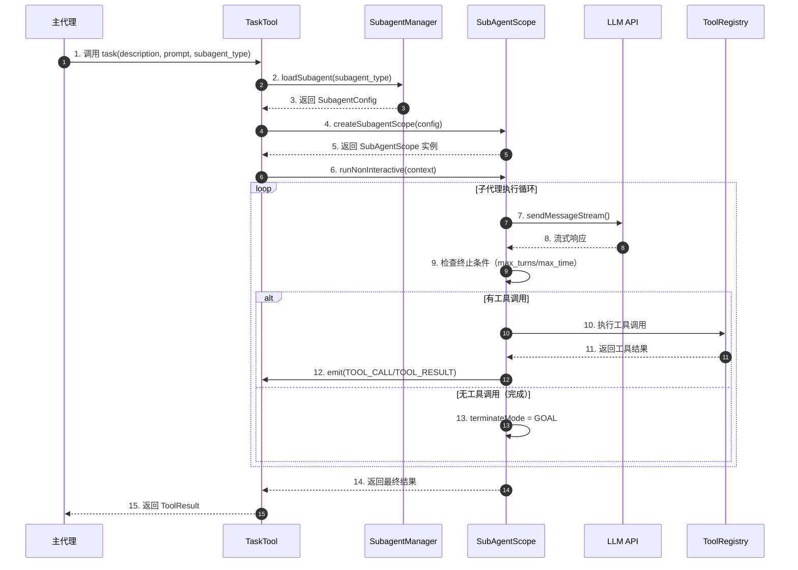
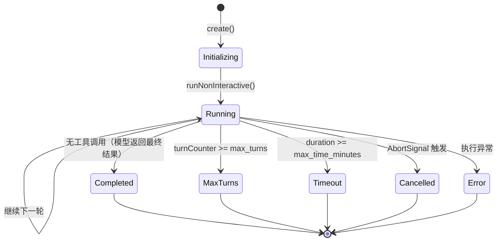
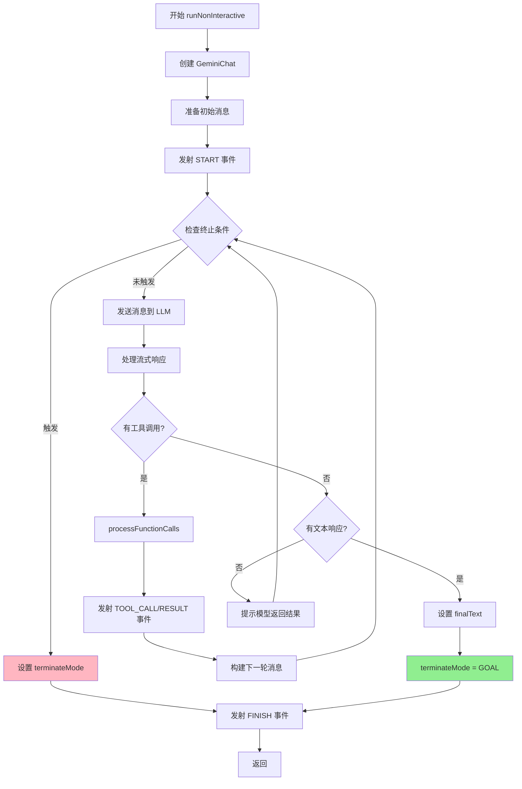
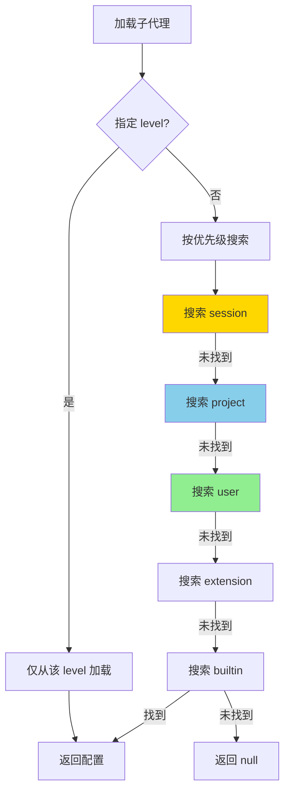
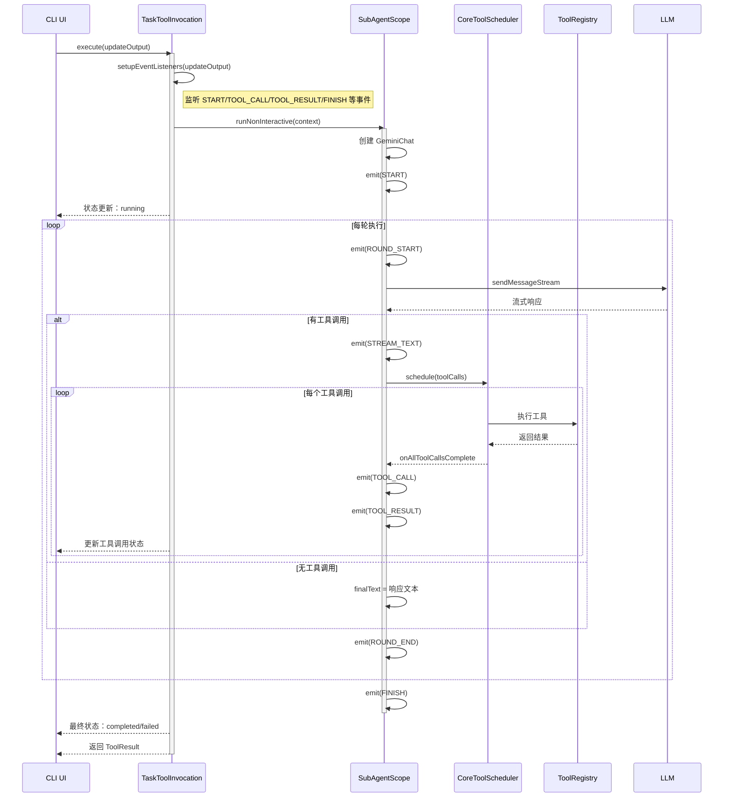
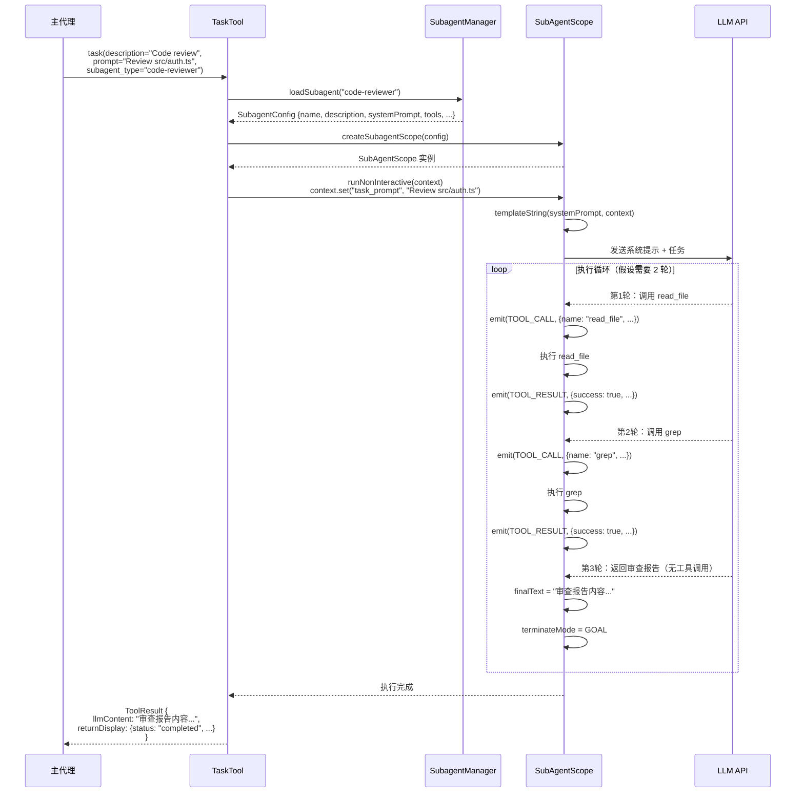
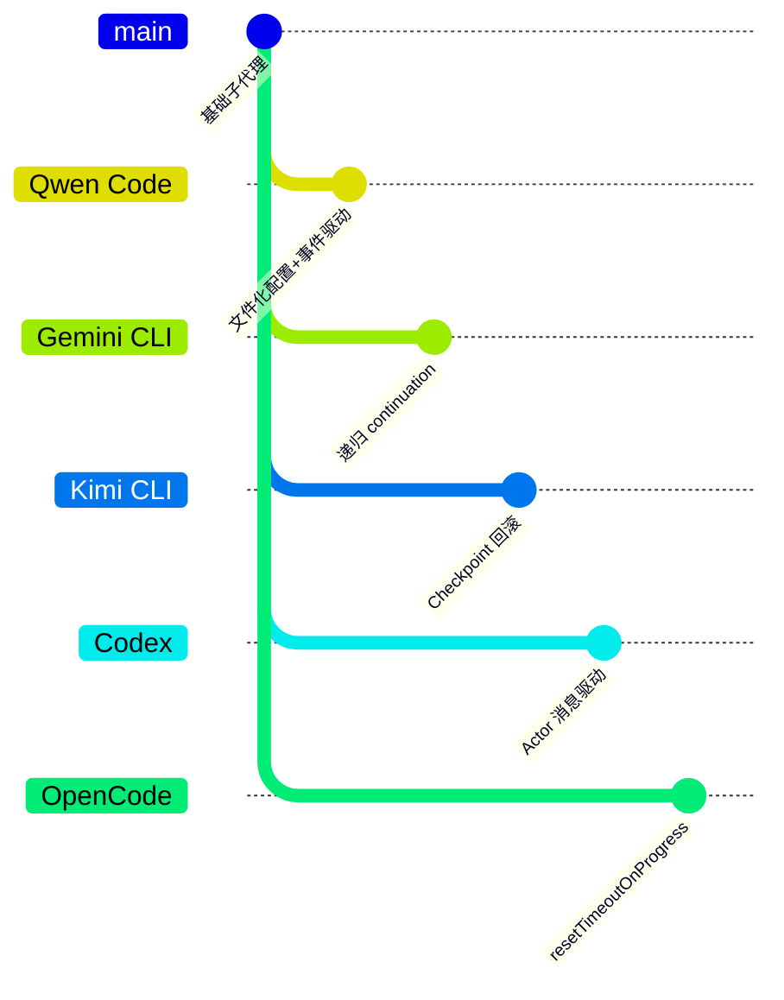

# Subagent/Task Implementation

> 📋 **阅读指南**
>
> | 属性 | 说明 |
> |-----|------|
> | 预计阅读 | 25-35 分钟 |
> | 前置文档 | `docs/qwen-code/04-qwen-code-agent-loop.md`、`docs/qwen-code/05-qwen-code-tools-system.md` |
> | 文档结构 | 速览 → 架构 → 机制 → 实现 → 对比 |
> | 代码呈现 | 关键代码直接展示，完整代码可折叠查看 |

---

## TL;DR（结论先行）

一句话定义：Qwen Code 通过 **Task Tool + SubAgentScope 运行时 + 五级配置存储** 实现子代理功能，支持主代理将复杂任务委托给具有独立工具集和系统提示的专用子代理并行执行。

Qwen Code 的核心取舍：**文件化配置 + 事件驱动监控**（对比 Gemini CLI 的递归 continuation、Kimi CLI 的 Checkpoint 回滚、Codex 的 Actor 消息驱动）

### 核心要点速览

| 维度 | 关键决策 | 代码位置 |
|-----|---------|---------|
| 核心机制 | Task Tool 作为子代理调用入口，动态加载可用子代理 | `packages/core/src/tools/task.ts:52` |
| 运行时 | SubAgentScope 实现独立 Agent Loop，支持资源限制 | `packages/core/src/subagents/subagent.ts:165` |
| 配置存储 | 五级存储体系（session/project/user/extension/builtin） | `packages/core/src/subagents/subagent-manager.ts:44` |
| 执行监控 | 事件驱动架构，实时发射 START/TOOL_CALL/FINISH 等事件 | `packages/core/src/subagents/subagent-events.ts:131` |
| 权限控制 | 工具白名单机制，子代理仅拥有最小必要工具集 | `packages/core/src/subagents/subagent.ts:594` |

---

## 1. 为什么需要这个机制？（解决什么问题）

### 1.1 问题场景

没有子代理系统时，主代理面临以下限制：

```
场景：需要同时进行代码审查、测试执行和文档生成

无子代理：
  → 主代理串行执行：先审查代码 → 再跑测试 → 最后写文档
  → 耗时 = 审查时间 + 测试时间 + 文档时间
  → 单代理工具权限难以细分（代码审查需要读权限，测试需要执行权限）

有子代理：
  → 主代理同时启动 3 个子代理并行执行
  → 耗时 = max(审查时间, 测试时间, 文档时间)
  → 每个子代理拥有最小必要工具集（最小权限原则）
```

### 1.2 核心挑战

| 挑战 | 不解决的后果 |
|-----|-------------|
| 任务并行化 | 复杂任务串行执行，效率低下 |
| 权限隔离 | 主代理拥有全部工具权限，存在安全风险 |
| 专业化分工 | 通用代理难以处理特定领域任务（如安全审计） |
| 执行监控 | 子代理执行过程黑盒，无法追踪进度 |
| 配置管理 | 子代理定义分散，难以维护和复用 |

---

## 2. 整体架构（ASCII 图）

### 2.1 在系统中的位置

```text
┌─────────────────────────────────────────────────────────────┐
│ 主代理 (Primary Agent)                                       │
│ packages/core/src/core/client.ts                             │
│ - 决策是否委托任务给子代理                                    │
│ - 通过 Task Tool 发起子代理调用                              │
└───────────────────────┬─────────────────────────────────────┘
                        │ 调用 Task Tool
                        ▼
┌─────────────────────────────────────────────────────────────┐
│ ▓▓▓ Task Tool ▓▓▓                                           │
│ packages/core/src/tools/task.ts                              │
│ - TaskTool: 动态加载可用子代理，生成工具描述                  │
│ - TaskToolInvocation: 执行子代理调用，管理事件流              │
└───────────────────────┬─────────────────────────────────────┘
                        │ 创建并运行 SubAgentScope
                        ▼
┌─────────────────────────────────────────────────────────────┐
│ ▓▓▓ SubAgentScope 运行时 ▓▓▓                                │
│ packages/core/src/subagents/subagent.ts                      │
│ - runNonInteractive(): 子代理主循环                          │
│ - processFunctionCalls(): 工具调用处理                       │
│ - 事件发射器：实时汇报执行进度                                │
└───────────────────────┬─────────────────────────────────────┘
                        │ 加载配置
                        ▼
┌─────────────────────────────────────────────────────────────┐
│ SubagentManager          │ BuiltinAgentRegistry              │
│ packages/core/src/       │ packages/core/src/                │
│ subagents/subagent-      │ subagents/builtin-agents.ts       │
│ manager.ts               │                                   │
│ - 五级存储管理            │ - 内置代理注册表                   │
│ - CRUD 操作              │ - general-purpose 等预设代理       │
└──────────────────────────┴───────────────────────────────────┘
```

### 2.2 核心组件职责

| 组件 | 职责 | 代码位置 |
|-----|------|---------|
| `TaskTool` | 动态加载子代理配置，生成工具 Schema | `packages/core/src/tools/task.ts:52` |
| `TaskToolInvocation` | 执行子代理调用，管理生命周期和事件 | `packages/core/src/tools/task.ts:264` |
| `SubAgentScope` | 子代理运行时容器，管理独立 Agent Loop | `packages/core/src/subagents/subagent.ts:165` |
| `SubagentManager` | 子代理配置的 CRUD 和存储管理 | `packages/core/src/subagents/subagent-manager.ts:44` |
| `BuiltinAgentRegistry` | 内置子代理注册（如 general-purpose） | `packages/core/src/subagents/builtin-agents.ts:13` |
| `SubAgentEventEmitter` | 事件发射，支持实时进度监控 | `packages/core/src/subagents/subagent-events.ts:131` |

### 2.3 核心组件交互关系



**关键交互说明**：

| 步骤 | 交互内容 | 设计意图 |
|-----|---------|---------|
| 1 | 主代理通过 Task Tool 发起委托 | 统一入口，工具化调用 |
| 3 | 动态加载子代理配置 | 支持运行时配置变更 |
| 6 | 非交互式运行 | 子代理自主执行，无需人工干预 |
| 9 | 内置资源限制检查 | 防止子代理无限运行 |
| 12 | 事件驱动进度汇报 | 支持 UI 实时展示子代理状态 |
| 14 | 单消息返回结果 | 子代理无状态，一次调用一次返回 |

---

## 3. 核心组件详细分析

### 3.1 TaskTool 内部结构

#### 职责定位

TaskTool 是主代理与子代理系统之间的桥梁，负责：
- 动态发现并加载可用子代理
- 生成包含子代理描述的工具 Schema
- 管理子代理配置变更监听

#### 动态 Schema 生成

```text
┌─────────────────────────────────────────────────────────────┐
│  初始化阶段                                                  │
│  ├── 创建基础 Schema（description, prompt, subagent_type）   │
│  └── 设置初始描述 "Loading available subagents..."           │
└──────────────────────────┬──────────────────────────────────┘
                           ▼
┌─────────────────────────────────────────────────────────────┐
│  异步加载阶段                                                │
│  ├── refreshSubagents() 加载所有子代理配置                   │
│  ├── 更新描述：拼接各子代理的 name + description             │
│  └── 更新 Schema：subagent_type.enum = [可用名称列表]        │
└──────────────────────────┬──────────────────────────────────┘
                           ▼
┌─────────────────────────────────────────────────────────────┐
│  运行时更新                                                  │
│  ├── 监听 SubagentManager change 事件                        │
│  └── 自动刷新 Schema 并通知 GeminiClient                     │
└─────────────────────────────────────────────────────────────┘
```

#### 关键接口

| 接口 | 输入 | 输出 | 说明 | 代码位置 |
|-----|------|------|------|---------|
| `refreshSubagents()` | - | Promise<void> | 异步加载子代理列表 | `task.ts:104` |
| `validateToolParams()` | TaskParams | string/null | 验证参数并检查子代理存在性 | `task.ts:216` |
| `createInvocation()` | TaskParams | TaskToolInvocation | 创建调用实例 | `task.ts:255` |

---

### 3.2 SubAgentScope 内部结构

#### 职责定位

子代理的运行时容器，实现独立的 Agent Loop，支持：
- 独立的系统提示和工具配置
- 资源限制（max_turns, max_time_minutes）
- 实时事件发射

#### 状态机图



**状态说明**：

| 状态 | 说明 | 进入条件 | 退出条件 |
|-----|------|---------|---------|
| Initializing | 初始化中 | 调用 create() | 创建完成 |
| Running | 执行中 | 调用 runNonInteractive() | 终止条件触发 |
| Completed | 成功完成 | 模型返回无工具调用的响应 | 自动结束 |
| MaxTurns | 达到最大轮数 | turnCounter >= max_turns | 自动结束 |
| Timeout | 超时 | 执行时间超过限制 | 自动结束 |
| Cancelled | 被取消 | 外部 AbortSignal 触发 | 自动结束 |
| Error | 错误 | 执行过程中抛出异常 | 自动结束 |

#### 内部数据流

```text
┌─────────────────────────────────────────────────────────────┐
│  输入层                                                      │
│  ├── task_prompt: 任务描述（来自 Task Tool 参数）            │
│  ├── systemPrompt: 子代理系统提示（模板化）                  │
│  └── ContextState: 模板变量替换（${variable}）               │
└──────────────────────────┬──────────────────────────────────┘
                           ▼
┌─────────────────────────────────────────────────────────────┐
│  执行层（Agent Loop）                                        │
│  ├── while 循环                                              │
│  │   ├── 检查终止条件（max_turns/max_time）                  │
│  │   ├── 发送消息到 LLM（sendMessageStream）                 │
│  │   ├── 处理流式响应（文本 + 工具调用）                     │
│  │   └── 如有工具调用 → processFunctionCalls()              │
│  └── 事件发射（START/ROUND_START/TOOL_CALL/...）             │
└──────────────────────────┬──────────────────────────────────┘
                           ▼
┌─────────────────────────────────────────────────────────────┐
│  输出层                                                      │
│  ├── finalText: 子代理最终返回文本                          │
│  ├── terminateMode: 终止原因（GOAL/TIMEOUT/...）             │
│  └── executionStats: 执行统计（轮数、工具调用、token 等）    │
└─────────────────────────────────────────────────────────────┘
```

#### 关键算法逻辑



**算法要点**：

1. **双层循环设计**：外层 while 控制执行轮数，内层处理单轮 LLM 调用
2. **终止条件前置**：每轮开始前检查，防止超限执行
3. **工具调用批处理**：单轮可能触发多个工具，并行执行后统一返回
4. **事件驱动架构**：关键节点发射事件，支持 UI 实时同步

---

### 3.3 SubagentManager 内部结构

#### 职责定位

子代理配置的中央管理器，实现五级存储体系：

| 级别 | 优先级 | 存储位置 | 可修改 |
|-----|-------|---------|-------|
| session | 最高 | 内存（运行时提供） | 只读 |
| project | 高 | `.qwen/agents/` | 可修改 |
| user | 中 | `~/.qwen/agents/` | 可修改 |
| extension | 低 | 扩展提供 | 只读（随扩展） |
| builtin | 最低 | 代码内置 | 不可修改 |

#### 配置优先级解析



#### 文件格式

子代理配置文件使用 Markdown + YAML Frontmatter 格式：

```markdown
---
name: code-reviewer
description: Code review specialist with security focus
tools:
  - read_file
  - grep
modelConfig:
  temp: 0.3
  top_p: 0.9
runConfig:
  max_turns: 10
  max_time_minutes: 5
color: '#4CAF50'
---

You are a code review specialist. Your task is to:
1. Analyze code for security vulnerabilities
2. Check for performance issues
3. Verify best practices compliance
4. Provide actionable feedback

Focus on critical issues first, then style improvements.
```

---

### 3.4 组件间协作时序



**协作要点**：

1. **UI 与 TaskToolInvocation**：通过 updateOutput 回调实现实时状态同步
2. **事件桥接**：SubAgentScope 的事件通过 TaskToolInvocation 转发到 UI
3. **工具调用调度**：使用 CoreToolScheduler 管理并发工具执行
4. **生命周期管理**：TaskToolInvocation 负责整个子代理生命周期的协调

---

## 4. 端到端数据流转

### 4.1 正常流程（详细版）



### 4.2 数据变换详情

| 阶段 | 输入 | 处理 | 输出 | 代码位置 |
|-----|------|------|------|---------|
| 接收 | task() 参数 | 验证参数，查找子代理 | SubagentConfig | `task.ts:216` |
| 模板化 | systemPrompt + ContextState | 替换 ${variable} | 最终系统提示 | `subagent.ts:986` |
| 执行 | 用户任务提示 | 非交互式 Agent Loop | 最终结果文本 | `subagent.ts:263` |
| 事件 | 执行状态变更 | 发射事件 | SubAgentEvent | `subagent-events.ts` |
| 返回 | 子代理输出 | 包装为 ToolResult | 主代理可消费格式 | `task.ts:549` |

### 4.3 异常/边界流程

```mermaid
flowchart TD
    A[Task Tool 调用] --> B{参数验证}
    B -->|失败| C[返回验证错误]

    B -->|通过| D{子代理存在?}
    D -->|不存在| E[返回 "Subagent not found"]

    D -->|存在| F[创建 SubAgentScope]
    F --> G[执行 runNonInteractive]

    G --> H{执行中异常}
    H -->|超时| I[terminateMode = TIMEOUT]
    H -->|达到最大轮数| J[terminateMode = MAX_TURNS]
    H -->|被取消| K[terminateMode = CANCELLED]
    H -->|错误| L[terminateMode = ERROR]

    H -->|正常完成| M{有最终结果?}
    M -->|有| N[terminateMode = GOAL]
    M -->|无| O[提示模型返回结果]
    O --> G

    C --> P[返回错误结果]
    E --> P
    I --> Q[发射 FINISH 事件]
    J --> Q
    K --> Q
    L --> Q
    N --> Q
    Q --> R[返回 ToolResult]

    style N fill:#90EE90
    style I fill:#FFD700
    style J fill:#FFD700
    style K fill:#FFB6C1
    style L fill:#FF6B6B
```

---

## 5. 关键代码实现

### 5.1 核心数据结构

```typescript
// packages/core/src/subagents/types.ts:29-82
export interface SubagentConfig {
  /** 子代理唯一标识 */
  name: string;
  /** 人类可读的描述 */
  description: string;
  /** 允许使用的工具列表 */
  tools?: string[];
  /** 系统提示（支持 ${variable} 模板） */
  systemPrompt: string;
  /** 存储级别 */
  level: SubagentLevel;
  /** 配置文件路径 */
  filePath?: string;
  /** 模型配置 */
  modelConfig?: Partial<ModelConfig>;
  /** 运行时配置 */
  runConfig?: Partial<RunConfig>;
  /** 显示颜色 */
  color?: string;
  /** 是否为内置代理 */
  readonly isBuiltin?: boolean;
}

// packages/core/src/tools/task.ts:39-43
export interface TaskParams {
  description: string;      // 任务简短描述
  prompt: string;          // 详细任务指令
  subagent_type: string;   // 子代理类型名称
}
```

**字段说明**：

| 字段 | 类型 | 用途 |
|-----|------|------|
| `name` | `string` | 子代理唯一标识，用于 Task Tool 的 subagent_type 参数 |
| `systemPrompt` | `string` | 定义子代理行为，支持 ContextState 模板变量替换 |
| `tools` | `string[]` | 白名单机制，未指定则继承全部工具 |
| `runConfig.max_turns` | `number` | 防止无限循环，默认无限制 |
| `runConfig.max_time_minutes` | `number` | 超时保护，默认无限制 |

### 5.2 主链路代码

**关键代码**（核心逻辑）：

```typescript
// packages/core/src/subagents/subagent.ts:263-347
async runNonInteractive(
  context: ContextState,
  externalSignal?: AbortSignal,
): Promise<void> {
  const chat = await this.createChatObject(context);
  if (!chat) {
    this.terminateMode = SubagentTerminateMode.ERROR;
    return;
  }

  // 准备工具列表（过滤掉 Task Tool 防止递归）
  const toolsList = this.prepareToolsList();

  const initialTaskText = String(context.get('task_prompt') ?? 'Get Started!');
  let currentMessages: Content[] = [
    { role: 'user', parts: [{ text: initialTaskText }] },
  ];

  const startTime = Date.now();
  this.executionStats.startTimeMs = startTime;
  let turnCounter = 0;

  // 发射开始事件
  this.eventEmitter?.emit(SubAgentEventType.START, {...});

  while (true) {
    // 1. 检查终止条件
    if (this.runConfig.max_turns && turnCounter >= this.runConfig.max_turns) {
      this.terminateMode = SubagentTerminateMode.MAX_TURNS;
      break;
    }
    const durationMin = (Date.now() - startTime) / (1000 * 60);
    if (this.runConfig.max_time_minutes && durationMin >= this.runConfig.max_time_minutes) {
      this.terminateMode = SubagentTerminateMode.TIMEOUT;
      break;
    }

    // 2. 发送消息到 LLM
    const responseStream = await chat.sendMessageStream(
      this.modelConfig.model || DEFAULT_QWEN_MODEL,
      { message: currentMessages[0]?.parts || [], config: { tools } },
      promptId,
    );

    // 3. 处理流式响应
    const functionCalls: FunctionCall[] = [];
    let roundText = '';
    for await (const streamEvent of responseStream) {
      if (streamEvent.type === 'chunk') {
        const resp = streamEvent.value;
        if (resp.functionCalls) functionCalls.push(...resp.functionCalls);
        // 收集文本响应...
      }
    }

    // 4. 处理工具调用或完成
    if (functionCalls.length > 0) {
      currentMessages = await this.processFunctionCalls(functionCalls, ...);
    } else {
      // 无工具调用 = 任务完成
      this.finalText = roundText.trim();
      this.terminateMode = SubagentTerminateMode.GOAL;
      break;
    }

    turnCounter++;
  }

  // 发射完成事件
  this.eventEmitter?.emit(SubAgentEventType.FINISH, {...});
}
```

**设计意图**：

1. **工具过滤**：子代理默认继承主代理工具，但会过滤掉 Task Tool 防止递归调用
2. **终止条件检查**：每轮开始前检查 max_turns 和 max_time_minutes
3. **流式处理**：支持流式响应，实时收集文本和工具调用
4. **事件驱动**：关键节点发射事件，支持外部监控

<details>
<summary>📋 查看完整实现</summary>

```typescript
// packages/core/src/subagents/subagent.ts:263-400
async runNonInteractive(
  context: ContextState,
  externalSignal?: AbortSignal,
): Promise<void> {
  const chat = await this.createChatObject(context);
  if (!chat) {
    this.terminateMode = SubagentTerminateMode.ERROR;
    return;
  }

  const toolsList = this.prepareToolsList();
  const initialTaskText = String(context.get('task_prompt') ?? 'Get Started!');
  let currentMessages: Content[] = [
    { role: 'user', parts: [{ text: initialTaskText }] },
  ];

  const startTime = Date.now();
  this.executionStats.startTimeMs = startTime;
  let turnCounter = 0;

  this.eventEmitter?.emit(SubAgentEventType.START, {
    subagentName: this.subagentConfig.name,
    taskPrompt: initialTaskText,
  });

  try {
    while (true) {
      // 检查终止条件
      if (this.runConfig.max_turns && turnCounter >= this.runConfig.max_turns) {
        this.terminateMode = SubagentTerminateMode.MAX_TURNS;
        break;
      }
      const durationMin = (Date.now() - startTime) / (1000 * 60);
      if (this.runConfig.max_time_minutes && durationMin >= this.runConfig.max_time_minutes) {
        this.terminateMode = SubagentTerminateMode.TIMEOUT;
        break;
      }

      // 执行单轮对话
      const response = await this.executeRound(chat, currentMessages, toolsList);

      if (response.functionCalls.length > 0) {
        currentMessages = await this.processFunctionCalls(response.functionCalls);
      } else {
        this.finalText = response.text;
        this.terminateMode = SubagentTerminateMode.GOAL;
        break;
      }

      turnCounter++;
    }
  } catch (error) {
    this.terminateMode = SubagentTerminateMode.ERROR;
    this.executionStats.error = error;
  }

  this.eventEmitter?.emit(SubAgentEventType.FINISH, {
    subagentName: this.subagentConfig.name,
    terminateMode: this.terminateMode,
    executionStats: this.executionStats,
  });
}
```

</details>

### 5.3 关键调用链

```text
主代理调用 Task Tool
  -> TaskToolInvocation.execute()     [packages/core/src/tools/task.ts:466]
    -> SubagentManager.loadSubagent()  [packages/core/src/subagents/subagent-manager.ts:147]
    -> SubagentManager.createSubagentScope() [packages/core/src/subagents/subagent-manager.ts:587]
      -> SubAgentScope.create()         [packages/core/src/subagents/subagent.ts:234]
    -> SubAgentScope.runNonInteractive() [packages/core/src/subagents/subagent.ts:263]
      - 创建 GeminiChat
      - 执行 while 循环
      - 调用 processFunctionCalls()
        -> CoreToolScheduler.schedule() [packages/core/src/core/coreToolScheduler.ts]
          - 执行具体工具
      - 发射各类事件
```

---

## 6. 设计意图与 Trade-off

### 6.1 Qwen Code 的选择

| 维度 | Qwen Code 的选择 | 替代方案 | 取舍分析 |
|-----|-----------------|---------|---------|
| 配置存储 | 五级存储（session/project/user/extension/builtin） | 单一配置中心 | 灵活分层，但优先级解析复杂 |
| 配置格式 | Markdown + YAML Frontmatter | JSON/YAML 纯文件 | 可读性好，但解析稍复杂 |
| 子代理通信 | 单消息返回（无状态） | 持续对话（有状态） | 简单可靠，但不支持中途交互 |
| 执行监控 | 事件驱动实时汇报 | 轮询或完成后统一返回 | 实时性好，但事件管理复杂 |
| 权限控制 | 工具白名单 | 沙箱隔离 | 实现简单，但粒度较粗 |
| 并行执行 | 主代理级并行（多 Task Tool 调用） | 子代理内部并行 | 利用现有工具并行机制 |

### 6.2 为什么这样设计？

**核心问题**：如何在保持架构简洁的同时，支持灵活的子代理配置和实时监控？

**Qwen Code 的解决方案**：

- **代码依据**：`packages/core/src/subagents/subagent.ts:165`, `packages/core/src/tools/task.ts:52`
- **设计意图**：
  1. **文件化配置**：利用 Markdown + YAML 的可读性，便于用户手动编辑
  2. **事件驱动**：通过 SubAgentEventEmitter 实现 UI 实时同步，不阻塞执行
  3. **非交互式**：子代理自主完成，减少用户干预点
  4. **工具集成**：复用现有 Tool 系统，降低实现复杂度

- **带来的好处**：
  - 配置可版本控制（存储在项目目录）
  - 实时进度可见（事件驱动 UI 更新）
  - 与现有架构无缝集成（复用 Tool、Scheduler 等组件）
  - 支持并行执行（主代理可同时调用多个 Task Tool）

- **付出的代价**：
  - 子代理无状态，无法多轮对话
  - 配置优先级解析逻辑复杂
  - 事件监听增加内存开销

### 6.3 与其他项目的对比



| 项目 | 核心差异 | 适用场景 |
|-----|---------|---------|
| **Qwen Code** | 文件化配置 + 事件驱动监控 + 非交互式执行 | 需要预定义专用代理、重视可观测性的场景 |
| **Gemini CLI** | 递归 continuation 模式，支持嵌套对话 | 需要深度嵌套对话的场景 |
| **Kimi CLI** | Checkpoint 机制支持状态回滚 | 需要容错和状态恢复的场景 |
| **Codex** | Actor 模型，高并发隔离 | 高并发、需要隔离失败的场景 |
| **OpenCode** | resetTimeoutOnProgress 支持长任务 | 需要长时间运行的任务 |

**关键差异说明**：

1. **配置方式**：Qwen Code 采用文件化配置（Markdown + YAML），便于版本控制和团队协作；其他项目多采用动态配置或代码定义
2. **执行模式**：Qwen Code 子代理是非交互式的（自主完成）；Gemini CLI 支持递归 continuation；Kimi CLI 支持 Checkpoint 回滚
3. **监控能力**：Qwen Code 通过事件系统实现细粒度监控（工具调用级别）；其他项目多仅支持最终结果返回

---

## 7. 边界情况与错误处理

### 7.1 终止条件

| 终止原因 | 触发条件 | 代码位置 |
|---------|---------|---------|
| GOAL | 子代理返回无工具调用的响应 | `subagent.ts:509` |
| MAX_TURNS | turnCounter >= max_turns | `subagent.ts:359` |
| TIMEOUT | 执行时间 >= max_time_minutes | `subagent.ts:367` |
| CANCELLED | AbortSignal 被触发 | `subagent.ts:406` |
| ERROR | 执行过程中抛出异常 | `subagent.ts:533` |

### 7.2 资源限制

```typescript
// packages/core/src/subagents/types.ts:264-272
export interface RunConfig {
  /** 最大执行时间（分钟） */
  max_time_minutes?: number;
  /** 最大对话轮数 */
  max_turns?: number;
}
```

### 7.3 错误恢复策略

| 错误类型 | 处理策略 | 代码位置 |
|---------|---------|---------|
| 子代理未找到 | 返回错误信息给主代理 | `task.ts:476` |
| 工具未授权 | 返回错误提示给子代理，继续执行 | `subagent.ts:618` |
| 工具执行失败 | 记录错误，发射 TOOL_RESULT 事件 | `subagent.ts:643` |
| LLM 调用失败 | 抛出异常，终止子代理 | `subagent.ts:531` |

---

## 8. 关键代码索引

| 功能 | 文件 | 行号 | 说明 |
|-----|------|------|------|
| 入口 | `packages/core/src/tools/task.ts` | 52 | TaskTool 类定义 |
| 执行 | `packages/core/src/tools/task.ts` | 466 | TaskToolInvocation.execute() |
| 核心 | `packages/core/src/subagents/subagent.ts` | 165 | SubAgentScope 类 |
| 循环 | `packages/core/src/subagents/subagent.ts` | 263 | runNonInteractive() 主循环 |
| 配置 | `packages/core/src/subagents/subagent-manager.ts` | 44 | SubagentManager 类 |
| 事件 | `packages/core/src/subagents/subagent-events.ts` | 131 | SubAgentEventEmitter 类 |
| 内置代理 | `packages/core/src/subagents/builtin-agents.ts` | 13 | BuiltinAgentRegistry 类 |
| 类型定义 | `packages/core/src/subagents/types.ts` | 29 | SubagentConfig 接口 |
| 测试 | `integration-tests/sdk-typescript/subagents.test.ts` | 1 | E2E 测试套件 |
| 文档 | `docs/developers/tools/task.md` | 1 | Task Tool 使用文档 |

---

## 9. 延伸阅读

- 前置知识：`docs/qwen-code/04-qwen-code-agent-loop.md`
- 相关机制：`docs/qwen-code/06-qwen-code-mcp-integration.md`（工具系统）
- 深度分析：`docs/qwen-code/07-qwen-code-memory-context.md`（上下文管理）
- 跨项目对比：`docs/comm/comm-subagent-comparison.md`（如存在）

---

*✅ Verified: 基于 qwen-code/packages/core/src/subagents/*.ts、qwen-code/packages/core/src/tools/task.ts 等源码分析*
*基于版本：2026-02-08 | 最后更新：2026-03-03*
