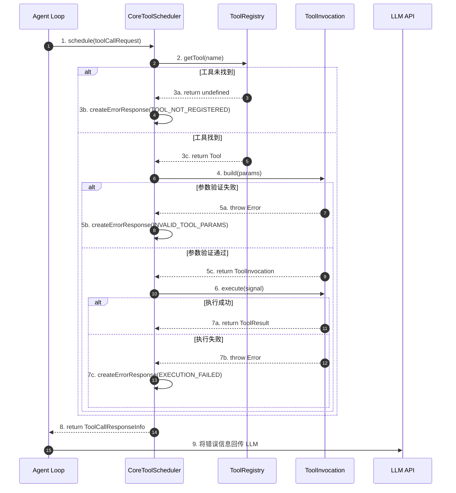
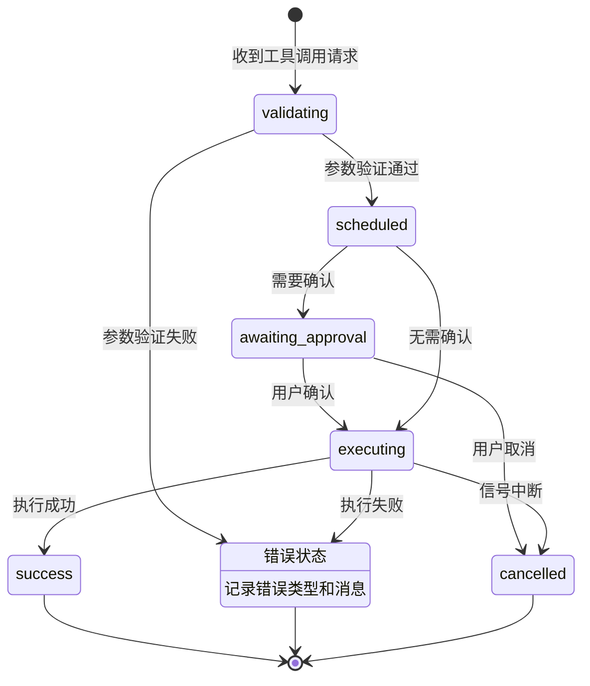
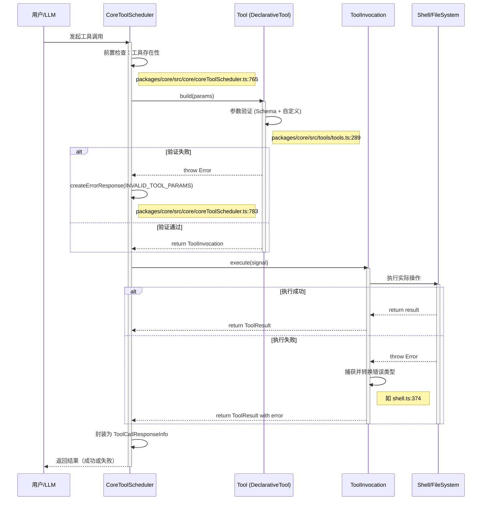
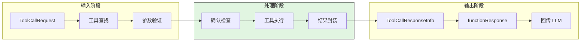
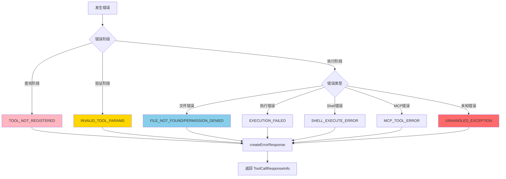
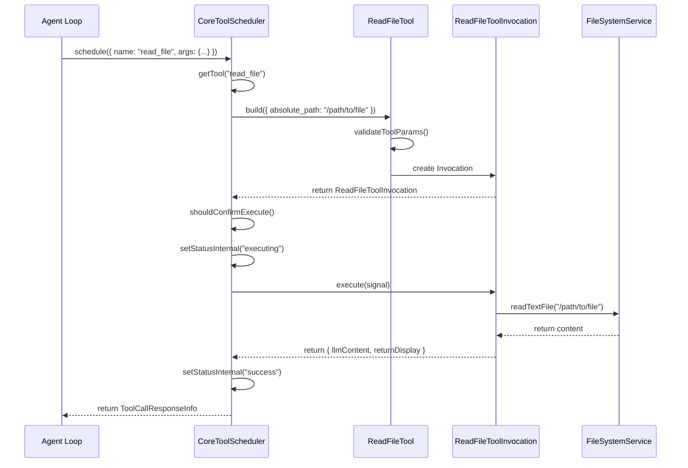
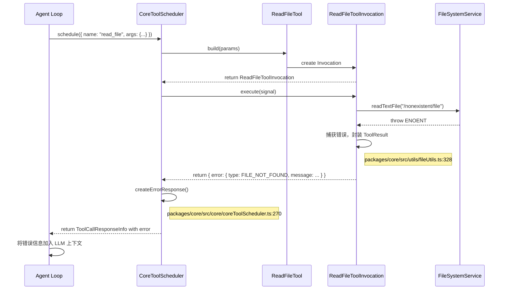
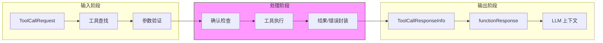
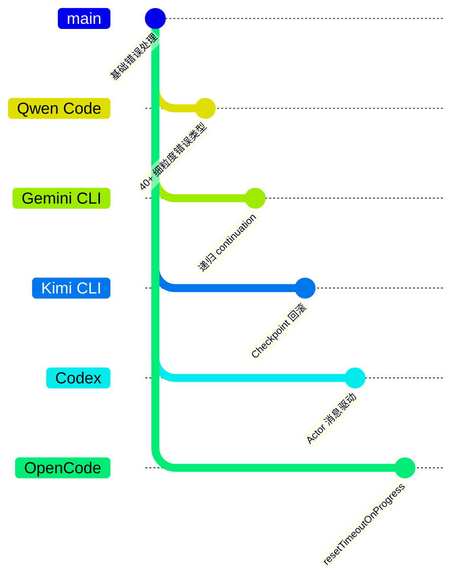

# 工具调用错误处理（Qwen Code）

> 📋 **阅读指南**
>
> | 属性 | 说明 |
> |-----|------|
> | 预计阅读 | 20-30 分钟 |
> | 前置文档 | `docs/qwen-code/04-qwen-code-agent-loop.md`、`docs/qwen-code/05-qwen-code-tools-system.md` |
> | 文档结构 | 速览 → 架构 → 机制 → 实现 → 对比 |
> | 代码呈现 | 关键代码直接展示，完整代码可折叠查看 |

---

## TL;DR（结论先行）

一句话定义：Qwen Code 的工具调用错误处理机制是一个**分层、类型化的错误捕获与恢复系统**，通过 `ToolErrorType` 枚举定义 40+ 种错误类型，在工具调度器（`CoreToolScheduler`）中实现统一的错误封装和回传，确保所有错误都能被 LLM 理解并用于后续决策。

Qwen Code 的核心取舍：**类型化错误 + 统一错误回传**（对比 Gemini CLI 的递归 continuation、Kimi CLI 的 Checkpoint 回滚、Codex 的 Actor 消息驱动）

### 核心要点速览

| 维度 | 关键决策 | 代码位置 |
|-----|---------|---------|
| 错误类型 | 40+ 种细粒度枚举（ToolErrorType） | `packages/core/src/tools/tool-error.ts:10` |
| 错误捕获 | 分层捕获（查找/验证/执行三层） | `packages/core/src/core/coreToolScheduler.ts:765` |
| 错误回传 | functionResponse 格式回传 LLM | `packages/core/src/core/coreToolScheduler.ts:270` |
| 状态管理 | 状态机驱动（validating/executing/error） | `packages/core/src/core/coreToolScheduler.ts:365` |
| MCP 错误 | 统一映射到 ToolErrorType.MCP_TOOL_ERROR | `packages/core/src/tools/mcp-tool.ts:241` |

---

## 1. 为什么需要这个机制？（解决什么问题）

### 1.1 问题场景

没有统一错误处理时：

```
用户: "请读取 /etc/passwd 文件"
→ LLM: 调用 read_file 工具
→ 工具执行: 抛出异常 "EACCES: permission denied"
→ 异常未被捕获 → 程序崩溃 或 返回空结果
→ LLM 收到空结果 → 误解为文件不存在 → 给出错误建议
```

有统一错误处理时：

```
用户: "请读取 /etc/passwd 文件"
→ LLM: 调用 read_file 工具
→ 工具执行: 捕获权限错误
→ 封装为 ToolErrorType.PERMISSION_DENIED
→ 通过 functionResponse 回传: { error: "权限被拒绝", type: "permission_denied" }
→ LLM 理解错误原因 → 建议用户使用 sudo 或选择其他文件
```

### 1.2 核心挑战

| 挑战 | 不解决的后果 |
|-----|-------------|
| 错误类型多样 | 无法针对性处理，所有错误一视同仁 |
| 错误信息丢失 | LLM 无法理解失败原因，无法自我修复 |
| 工具执行异常 | 未捕获异常导致整个 Agent Loop 崩溃 |
| MCP 外部工具错误 | 外部服务错误无法正确映射到内部错误模型 |
| 用户取消操作 | 需要优雅处理中断，保留已执行状态 |

---

## 2. 整体架构（ASCII 图）

### 2.1 在系统中的位置

```text
┌─────────────────────────────────────────────────────────────┐
│ Agent Loop / Turn                                           │
│ packages/core/src/core/turn.ts:233                           │
└───────────────────────┬─────────────────────────────────────┘
                        │ 产生 ToolCallRequest
                        ▼
┌─────────────────────────────────────────────────────────────┐
│ ▓▓▓ CoreToolScheduler ▓▓▓                                   │
│ packages/core/src/core/coreToolScheduler.ts:365              │
│ - schedule()      : 工具调度入口                             │
│ - executeTool()   : 执行单个工具                             │
│ - setStatusInternal() : 状态管理                             │
└───────────────────────┬─────────────────────────────────────┘
                        │ 依赖/调用
        ┌───────────────┼───────────────┐
        ▼               ▼               ▼
┌──────────────┐ ┌──────────────┐ ┌──────────────┐
│ Tool Registry│ │ Tool Error   │ │ Tool Result  │
│ 工具查找     │ │ 错误类型定义 │ │ 结果封装     │
│ packages/core│ │ packages/core│ │ packages/core│
│ /src/tools/  │ │ /src/tools/  │ │ /src/tools/  │
│ tool-registry│ │ tool-error.ts│ │ tools.ts     │
└──────────────┘ └──────────────┘ └──────────────┘
```

### 2.2 核心组件职责

| 组件 | 职责 | 代码位置 |
|-----|------|---------|
| `ToolErrorType` | 定义 40+ 种错误类型的枚举 | `packages/core/src/tools/tool-error.ts:10` |
| `CoreToolScheduler` | 工具调度器，统一处理工具执行和错误捕获 | `packages/core/src/core/coreToolScheduler.ts:365` |
| `ToolResult` | 工具结果接口，包含可选的 error 字段 | `packages/core/src/tools/tools.ts:331` |
| `DeclarativeTool` | 声明式工具基类，提供错误捕获封装 | `packages/core/src/tools/tools.ts:150` |
| `createErrorResponse` | 创建错误响应的辅助函数 | `packages/core/src/core/coreToolScheduler.ts:270` |

### 2.3 核心组件交互关系



**关键交互说明**：

| 步骤 | 交互内容 | 设计意图 |
|-----|---------|---------|
| 1 | Agent Loop 向调度器发起工具调用请求 | 解耦工具执行与 LLM 交互 |
| 2-3 | 工具查找 | 早期失败，快速返回错误 |
| 4-5 | 参数构建与验证 | 分离验证与执行，提前发现问题 |
| 6-7 | 工具执行 | 捕获所有异常，防止崩溃 |
| 8-9 | 错误回传 | 让 LLM 参与错误恢复决策 |

---

## 3. 核心组件详细分析

### 3.1 ToolErrorType 错误类型定义

#### 职责定位

`ToolErrorType` 是一个类型安全的枚举，定义了 40+ 种工具相关错误，覆盖文件系统、编辑操作、Shell 执行、MCP 工具等多个维度。

#### 错误类型分类

```mermaid
flowchart TD
    Root[ToolErrorType] --> General[通用错误]
    Root --> FS[文件系统错误]
    Root --> Edit[编辑错误]
    Root --> Tool[特定工具错误]
    Root --> MCP[MCP 错误]

    General --> G1[INVALID_TOOL_PARAMS]
    General --> G2[TOOL_NOT_REGISTERED]
    General --> G3[EXECUTION_FAILED]
    General --> G4[EXECUTION_DENIED]
    General --> G5[UNHANDLED_EXCEPTION]

    FS --> F1[FILE_NOT_FOUND]
    FS --> F2[FILE_WRITE_FAILURE]
    FS --> F3[PERMISSION_DENIED]
    FS --> F4[FILE_TOO_LARGE]
    FS --> F5[PATH_NOT_IN_WORKSPACE]

    Edit --> E1[EDIT_NO_OCCURRENCE_FOUND]
    Edit --> E2[EDIT_EXPECTED_OCCURRENCE_MISMATCH]
    Edit --> E3[EDIT_NO_CHANGE]
    Edit --> E4[EDIT_PREPARATION_FAILURE]

    Tool --> T1[SHELL_EXECUTE_ERROR]
    Tool --> T2[GLOB_EXECUTION_ERROR]
    Tool --> T3[GREP_EXECUTION_ERROR]
    Tool --> T4[LS_EXECUTION_ERROR]

    MCP --> M1[MCP_TOOL_ERROR]

    style Root fill:#90EE90
    style General fill:#FFB6C1
    style FS fill:#87CEEB
    style Edit fill:#FFD700
    style Tool fill:#DDA0DD
    style MCP fill:#98FB98
```



#### 关键接口

| 接口 | 说明 | 代码位置 |
|-----|------|---------|
| `ToolErrorType` | 错误类型枚举定义 | `packages/core/src/tools/tool-error.ts:10` |
| `ToolResult.error` | 工具结果中的可选错误字段 | `packages/core/src/tools/tools.ts:350` |
| `ToolError` | 错误对象结构 | `packages/core/src/tools/tools.ts:350` |

---

### 3.2 CoreToolScheduler 调度器错误处理

#### 职责定位

`CoreToolScheduler` 是工具执行的核心调度器，负责工具查找、参数验证、执行和错误捕获的全流程管理。

#### 状态机图



**状态说明**：

| 状态 | 说明 | 进入条件 | 退出条件 |
|-----|------|---------|---------|
| validating | 参数验证中 | 收到工具调用请求 | 验证完成 |
| scheduled | 已调度等待执行 | 验证通过 | 开始执行或被取消 |
| awaiting_approval | 等待用户确认 | 工具需要确认 | 用户确认或取消 |
| executing | 执行中 | 用户确认或无需确认 | 执行完成/失败/取消 |
| success | 执行成功 | 工具返回结果 | 自动结束 |
| error | 执行错误 | 捕获异常 | 自动结束 |
| cancelled | 已取消 | 用户取消或信号中断 | 自动结束 |

#### 内部数据流

```text
┌─────────────────────────────────────────────────────────────┐
│  输入层                                                      │
│  ├── ToolCallRequestInfo ──► 工具查找 ──► Tool              │
│  └── 原始参数   ──► 参数验证 ──► ToolInvocation             │
└──────────────────────────┬──────────────────────────────────┘
                           ▼
┌─────────────────────────────────────────────────────────────┐
│  处理层                                                      │
│  ├── 确认检查: shouldConfirmExecute()                       │
│  ├── 执行层: execute()                                      │
│  │   └── 正常返回 ──► 封装 ToolResult                        │
│  │   └── 抛出异常 ──► 捕获并封装错误                         │
│  └── 状态管理: setStatusInternal()                          │
└──────────────────────────┬──────────────────────────────────┘
                           ▼
┌─────────────────────────────────────────────────────────────┐
│  输出层                                                      │
│  ├── ToolCallResponseInfo 封装                              │
│  ├── functionResponse 格式转换                              │
│  └── 错误类型和消息回传                                     │
└─────────────────────────────────────────────────────────────┘
```

---

### 3.3 组件间协作时序

展示工具执行过程中的错误处理协作。



**协作要点**：

1. **调度器与工具**：调度器负责协调，工具负责具体执行
2. **错误捕获层级**：每层都有 try-catch，确保异常不穿透
3. **错误类型映射**：底层错误（如 EACCES）映射为高层错误类型（PERMISSION_DENIED）

---

### 3.4 关键数据路径

#### 主路径（正常流程）



#### 异常路径（错误处理）



---

## 4. 端到端数据流转

### 4.1 正常流程（详细版）



**数据变换详情**：

| 阶段 | 输入 | 处理 | 输出 | 代码位置 |
|-----|------|------|------|---------|
| 接收 | ToolCallRequestInfo | 工具查找 | Tool 或 undefined | `packages/core/src/core/coreToolScheduler.ts:765` |
| 验证 | 原始参数 | JSON Schema + 自定义验证 | ToolInvocation 或 Error | `packages/core/src/tools/tools.ts:289` |
| 执行 | ToolInvocation | 实际工具执行 | ToolResult | `packages/core/src/tools/read-file.ts:79` |
| 封装 | ToolResult | 转换为 functionResponse | ToolCallResponseInfo | `packages/core/src/core/coreToolScheduler.ts:270` |

### 4.2 错误流程（以文件不存在为例）



### 4.3 数据流向图



---

## 5. 关键代码实现

### 5.1 核心数据结构

```typescript
// packages/core/src/tools/tool-error.ts:10
export enum ToolErrorType {
  // 通用错误
  INVALID_TOOL_PARAMS = 'invalid_tool_params',
  TOOL_NOT_REGISTERED = 'tool_not_registered',
  EXECUTION_FAILED = 'execution_failed',
  EXECUTION_DENIED = 'execution_denied',
  UNHANDLED_EXCEPTION = 'unhandled_exception',

  // 文件系统错误
  FILE_NOT_FOUND = 'file_not_found',
  FILE_WRITE_FAILURE = 'file_write_failure',
  PERMISSION_DENIED = 'permission_denied',
  FILE_TOO_LARGE = 'file_too_large',
  PATH_NOT_IN_WORKSPACE = 'path_not_in_workspace',

  // 编辑错误
  EDIT_NO_OCCURRENCE_FOUND = 'edit_no_occurrence_found',
  EDIT_EXPECTED_OCCURRENCE_MISMATCH = 'edit_expected_occurrence_mismatch',
  EDIT_NO_CHANGE = 'edit_no_change',

  // ... 共 40+ 种错误类型
}
```

**字段说明**：

| 字段 | 类型 | 用途 |
|-----|------|------|
| `ToolErrorType` | enum | 机器可读的错误类型标识 |
| `message` | string | 人类可读的错误描述 |
| `details` | Record | 额外的错误上下文信息 |

### 5.2 主链路代码

**关键代码**（核心逻辑）：

```typescript
// packages/core/src/core/coreToolScheduler.ts:765-948
private async executeTool(
  toolCall: ValidatingToolCall | ScheduledToolCall,
  signal: AbortSignal,
): Promise<void> {
  const { request, tool, invocation } = toolCall;

  // 1. 检查执行权限
  if (!this.shouldExecuteTool(tool)) {
    const errorResponse = createErrorResponse(
      request,
      new Error(`Tool execution denied: ${request.name}`),
      ToolErrorType.EXECUTION_DENIED,
    );
    this.setStatusInternal(request.callId, 'error', errorResponse);
    return;
  }

  // 2. 参数验证（构建 ToolInvocation）
  const invocationOrError = this.buildInvocation(tool, request.args);
  if (invocationOrError instanceof Error) {
    const response = createErrorResponse(
      request,
      invocationOrError,
      ToolErrorType.INVALID_TOOL_PARAMS,
    );
    this.setStatusInternal(request.callId, 'error', response);
    return;
  }

  // 3. 执行工具
  try {
    this.setStatusInternal(request.callId, 'executing');
    const result = await invocationOrError.execute(signal);

    // 4. 处理结果
    if (result.error) {
      const errorResponse = createErrorResponse(
        request,
        new Error(result.error.message),
        result.error.type,
      );
      this.setStatusInternal(request.callId, 'error', errorResponse);
    } else {
      const response = this.createSuccessResponse(request, result);
      this.setStatusInternal(request.callId, 'success', response);
    }
  } catch (error) {
    // 5. 捕获未处理异常
    const errorResponse = createErrorResponse(
      request,
      error instanceof Error ? error : new Error(String(error)),
      ToolErrorType.UNHANDLED_EXCEPTION,
    );
    this.setStatusInternal(request.callId, 'error', errorResponse);
  }
}
```

**设计意图**：

1. **分层错误处理**：权限检查 → 参数验证 → 执行捕获，每层独立处理
2. **统一错误封装**：使用 `createErrorResponse` 统一格式
3. **异常兜底**：最外层 try-catch 确保任何异常都不会穿透

<details>
<summary>📋 查看完整实现</summary>

```typescript
// packages/core/src/core/coreToolScheduler.ts:765-1000
private async executeTool(
  toolCall: ValidatingToolCall | ScheduledToolCall,
  signal: AbortSignal,
): Promise<void> {
  const { request, tool, invocation } = toolCall;

  // 权限检查
  if (!this.shouldExecuteTool(tool)) {
    const errorResponse = createErrorResponse(
      request,
      new Error(`Tool execution denied: ${request.name}`),
      ToolErrorType.EXECUTION_DENIED,
    );
    this.setStatusInternal(request.callId, 'error', errorResponse);
    return;
  }

  // 参数验证和构建
  let toolInvocation: ToolInvocation;
  if (invocation) {
    toolInvocation = invocation;
  } else {
    const invocationOrError = this.buildInvocation(tool, request.args);
    if (invocationOrError instanceof Error) {
      const response = createErrorResponse(
        request,
        invocationOrError,
        ToolErrorType.INVALID_TOOL_PARAMS,
      );
      this.setStatusInternal(request.callId, 'error', response);
      return;
    }
    toolInvocation = invocationOrError;
  }

  // 执行
  try {
    this.setStatusInternal(request.callId, 'executing');
    const result = await toolInvocation.execute(signal);

    if (result.error) {
      const errorResponse = createErrorResponse(
        request,
        new Error(result.error.message),
        result.error.type,
      );
      this.setStatusInternal(request.callId, 'error', errorResponse);
    } else {
      const response = this.createSuccessResponse(request, result);
      this.setStatusInternal(request.callId, 'success', response);
    }
  } catch (error) {
    const errorResponse = createErrorResponse(
      request,
      error instanceof Error ? error : new Error(String(error)),
      ToolErrorType.UNHANDLED_EXCEPTION,
    );
    this.setStatusInternal(request.callId, 'error', errorResponse);
  }
}
```

</details>

### 5.3 错误响应创建

```typescript
// packages/core/src/core/coreToolScheduler.ts:270-289
const createErrorResponse = (
  request: ToolCallRequestInfo,
  error: Error,
  errorType: ToolErrorType | undefined,
): ToolCallResponseInfo => ({
  callId: request.callId,
  error,
  responseParts: [
    {
      functionResponse: {
        id: request.callId,
        name: request.name,
        response: { error: error.message },
      },
    },
  ],
  resultDisplay: error.message,
  errorType,
  contentLength: error.message.length,
});
```

### 5.4 关键调用链

```text
CoreToolScheduler.schedule()          [packages/core/src/core/coreToolScheduler.ts:600]
  -> executePendingCalls()            [packages/core/src/core/coreToolScheduler.ts:700]
    -> executeTool()                  [packages/core/src/core/coreToolScheduler.ts:765]
      -> buildInvocation()            [packages/core/src/core/coreToolScheduler.ts:830]
        - 参数验证和 ToolInvocation 构建
      -> invocation.execute()         [packages/core/src/tools/*.ts]
        - 具体工具执行逻辑
      -> createErrorResponse()        [packages/core/src/core/coreToolScheduler.ts:270]
        - 错误封装为统一格式
```

---

## 6. 设计意图与 Trade-off

### 6.1 Qwen Code 的选择

| 维度 | Qwen Code 的选择 | 替代方案 | 取舍分析 |
|-----|-----------------|---------|---------|
| 错误类型 | 40+ 种细粒度枚举 | 通用 Error 对象 | 精确错误识别，但维护成本高 |
| 错误回传 | functionResponse 回传 LLM | 抛出异常中断流程 | LLM 可参与恢复，但增加 token 消耗 |
| 错误封装 | 统一 createErrorResponse | 各工具自行处理 | 格式一致，但灵活性降低 |
| 状态管理 | 状态机驱动 | 简单 try-catch | 可追踪状态，但代码复杂 |

### 6.2 为什么这样设计？

**核心问题**：如何让 LLM 理解工具执行失败的原因并做出正确决策？

**Qwen Code 的解决方案**：

- **代码依据**：`packages/core/src/tools/tool-error.ts:10`
- **设计意图**：通过细粒度的错误类型枚举，让 LLM 能够区分"文件不存在"、"权限不足"、"参数错误"等不同场景
- **带来的好处**：
  - LLM 可以给出针对性的修复建议（如权限不足时建议使用 sudo）
  - 便于统计和分析错误分布
  - 支持按错误类型进行特殊处理
- **付出的代价**：
  - 需要维护大量错误类型
  - 新增工具时需要定义新的错误类型
  - 错误类型可能遗漏或重复

### 6.3 与其他项目的对比



| 项目 | 核心差异 | 适用场景 |
|-----|---------|---------|
| **Qwen Code** | 类型化错误 + functionResponse 回传 | 需要 LLM 深度参与错误恢复的场景 |
| **Gemini CLI** | 递归 continuation 模式，错误作为状态流转的一部分 | 复杂多步任务，需要状态回溯的场景 |
| **Kimi CLI** | Checkpoint 机制，支持对话回滚 | 需要撤销操作、回到之前状态的场景 |
| **Codex** | Actor 模型，错误作为消息传递 | 高并发、需要隔离失败的场景 |
| **OpenCode** | resetTimeoutOnProgress 支持长任务 | 需要长时间运行的任务 |

**对比分析**：

1. **错误粒度**：
   - Qwen Code: 最细，40+ 种类型
   - Gemini CLI: 中等，按工具类别区分
   - Kimi CLI: 较粗，主要区分"可恢复/不可恢复"
   - Codex: 中等，按错误严重程度区分

2. **错误回传方式**：
   - Qwen Code: functionResponse 显式回传
   - Gemini CLI: 事件流中传递
   - Kimi CLI: 通过 Checkpoint 状态回传
   - Codex: Actor 消息传递

3. **LLM 参与度**：
   - Qwen Code: 高，LLM 收到详细错误信息
   - Gemini CLI: 中，LLM 通过状态感知错误
   - Kimi CLI: 低，系统自动处理回滚
   - Codex: 中，通过消息通知 LLM

---

## 7. 边界情况与错误处理

### 7.1 终止条件

| 终止原因 | 触发条件 | 代码位置 |
|---------|---------|---------|
| 工具未注册 | 工具名称不在 Registry 中 | `packages/core/src/core/coreToolScheduler.ts:765` |
| 参数验证失败 | Schema 验证或自定义验证失败 | `packages/core/src/core/coreToolScheduler.ts:783` |
| 执行被拒绝 | 审批模式不允许执行该工具 | `packages/core/src/core/coreToolScheduler.ts:748` |
| 执行异常 | 工具执行抛出未捕获异常 | `packages/core/src/core/coreToolScheduler.ts:948` |
| 用户取消 | AbortSignal 触发 | `packages/core/src/core/coreToolScheduler.ts:542` |

### 7.2 超时/资源限制

```typescript
// packages/core/src/tools/shell.ts:49
const DEFAULT_FOREGROUND_TIMEOUT_MS = 120000;

// packages/core/src/tools/shell.ts:147-151
if (effectiveTimeout) {
  const timeoutSignal = AbortSignal.timeout(effectiveTimeout);
  combinedSignal = AbortSignal.any([signal, timeoutSignal]);
}
```

### 7.3 错误恢复策略

| 错误类型 | 处理策略 | 是否重试 | 代码位置 |
|---------|---------|---------|---------|
| TOOL_NOT_REGISTERED | 返回错误给 LLM，建议检查工具名称 | 否 | `packages/core/src/core/coreToolScheduler.ts:765` |
| INVALID_TOOL_PARAMS | 返回错误详情，LLM 可修正参数后重试 | 否 | `packages/core/src/core/coreToolScheduler.ts:783` |
| FILE_NOT_FOUND | 返回错误，LLM 可尝试其他路径 | 否 | `packages/core/src/utils/fileUtils.ts:328` |
| PERMISSION_DENIED | 返回错误，建议检查权限或使用 sudo | 否 | `packages/core/src/tools/write-file.ts:338` |
| EXECUTION_FAILED | 返回错误详情，视情况可重试 | 视工具而定 | `packages/core/src/tools/tools.ts:264` |
| MCP_TOOL_ERROR | 返回 MCP 错误详情 | 可配置 | `packages/core/src/tools/mcp-tool.ts:241` |
| UNHANDLED_EXCEPTION | 记录日志，返回通用错误 | 否 | `packages/core/src/core/coreToolScheduler.ts:948` |

### 7.4 特殊边界情况

**MCP 工具错误处理**：

```typescript
// packages/core/src/tools/mcp-tool.ts:154-174
isMCPToolError(rawResponseParts: Part[]): boolean {
  const functionResponse = rawResponseParts?.[0]?.functionResponse;
  const response = functionResponse?.response;

  if (response) {
    const error = (response as { error?: McpError })?.error;
    const isError = error?.isError;

    if (error && (isError === true || isError === 'true')) {
      return true;
    }
  }
  return false;
}
```

**编辑工具错误处理**：

```typescript
// packages/core/src/tools/edit.ts:167-231
if (!fileExists) {
  error = {
    display: `File not found...`,
    raw: `File not found: ${params.file_path}`,
    type: ToolErrorType.FILE_NOT_FOUND,
  };
} else if (occurrences === 0) {
  error = {
    display: `Failed to edit, could not find the string to replace.`,
    raw: `Failed to edit, 0 occurrences found...`,
    type: ToolErrorType.EDIT_NO_OCCURRENCE_FOUND,
  };
}
```

---

## 8. 关键代码索引

| 功能 | 文件 | 行号 | 说明 |
|-----|------|------|------|
| 错误类型定义 | `packages/core/src/tools/tool-error.ts` | 10 | ToolErrorType 枚举定义 |
| 工具结果接口 | `packages/core/src/tools/tools.ts` | 331 | ToolResult 包含 error 字段 |
| 调度器入口 | `packages/core/src/core/coreToolScheduler.ts` | 365 | CoreToolScheduler 类定义 |
| 工具执行 | `packages/core/src/core/coreToolScheduler.ts` | 765 | executeTool 方法 |
| 错误响应创建 | `packages/core/src/core/coreToolScheduler.ts` | 270 | createErrorResponse 函数 |
| 参数验证 | `packages/core/src/tools/tools.ts` | 237 | validateBuildAndExecute 方法 |
| 非交互式执行 | `packages/core/src/core/nonInteractiveToolExecutor.ts` | 28 | executeToolCall 函数 |
| Shell 错误 | `packages/core/src/tools/shell.ts` | 374 | SHELL_EXECUTE_ERROR |
| 编辑错误 | `packages/core/src/tools/edit.ts` | 167 | 多种编辑错误类型处理 |
| MCP 错误 | `packages/core/src/tools/mcp-tool.ts` | 241 | MCP_TOOL_ERROR |
| 文件工具错误 | `packages/core/src/utils/fileUtils.ts` | 328 | FILE_NOT_FOUND 等 |

---

## 9. 延伸阅读

- 前置知识：`docs/qwen-code/04-qwen-code-agent-loop.md`
- 相关机制：`docs/qwen-code/06-qwen-code-mcp-integration.md`
- 深度分析：`docs/comm/comm-tool-system.md`
- 对比文档：`docs/gemini-cli/04-gemini-cli-agent-loop.md`、`docs/kimi-cli/04-kimi-cli-agent-loop.md`

---

*✅ Verified: 基于 qwen-code/packages/core/src/tools/tool-error.ts:10、qwen-code/packages/core/src/core/coreToolScheduler.ts:365 等源码分析*
*基于版本：2026-02-08 | 最后更新：2026-03-03*
