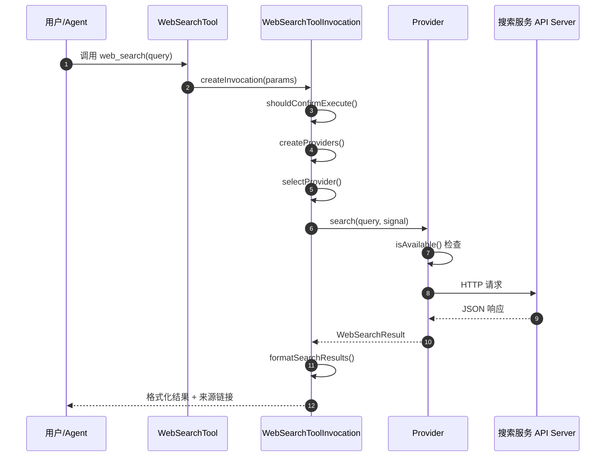
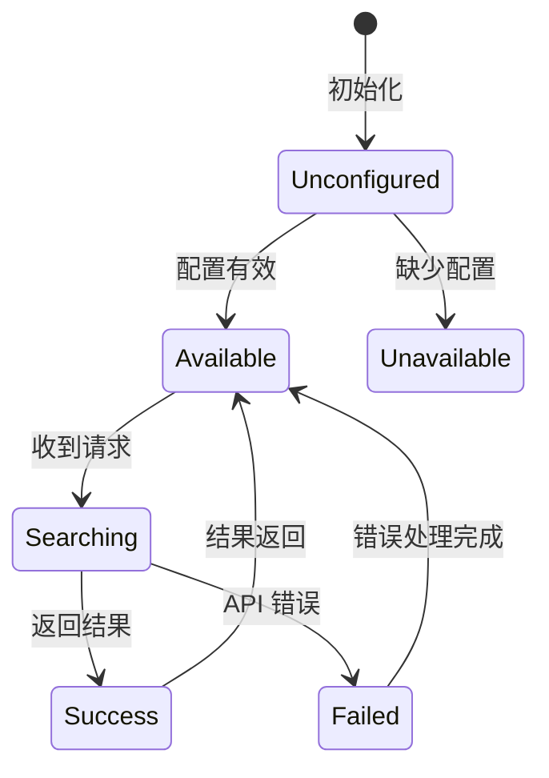
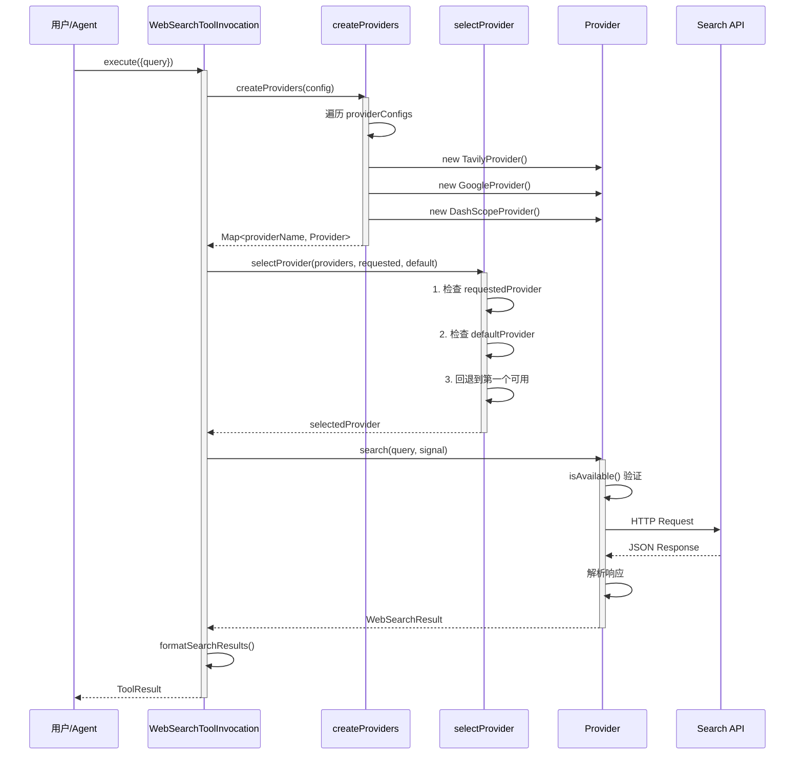
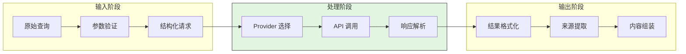
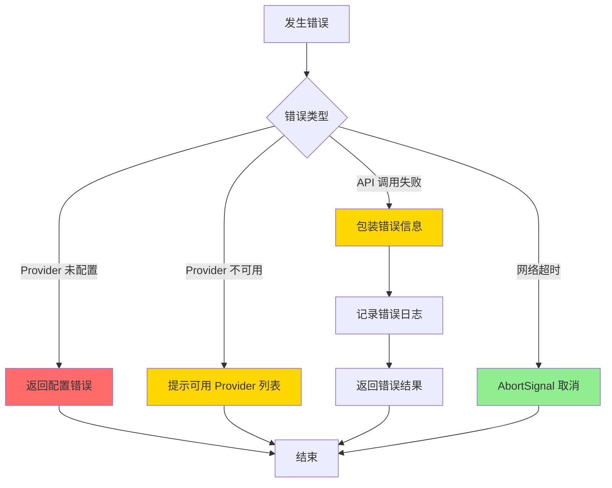
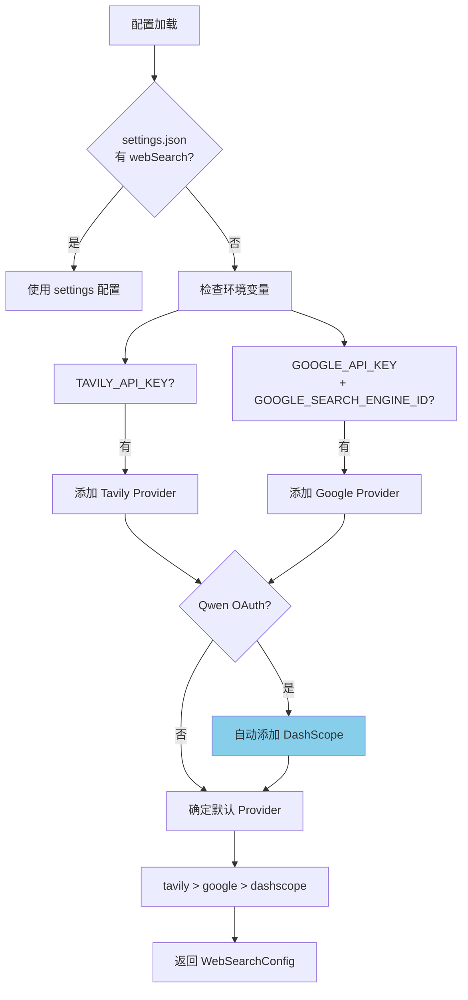
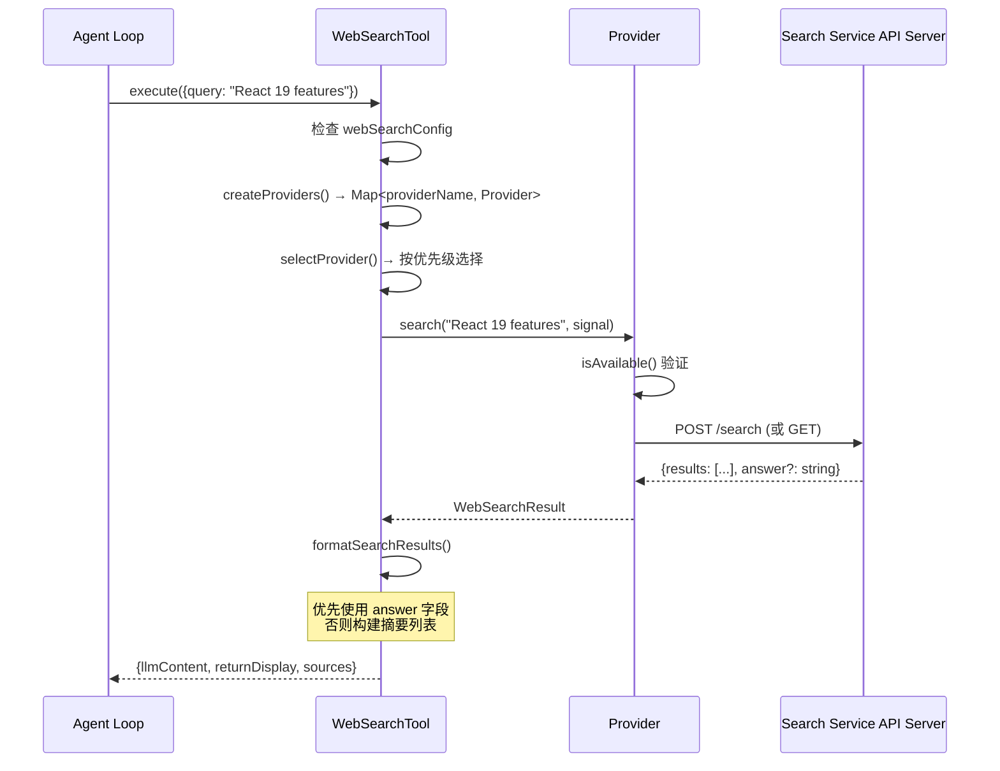
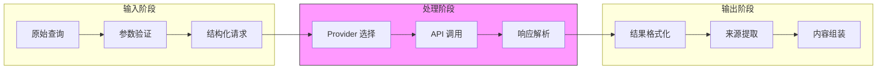
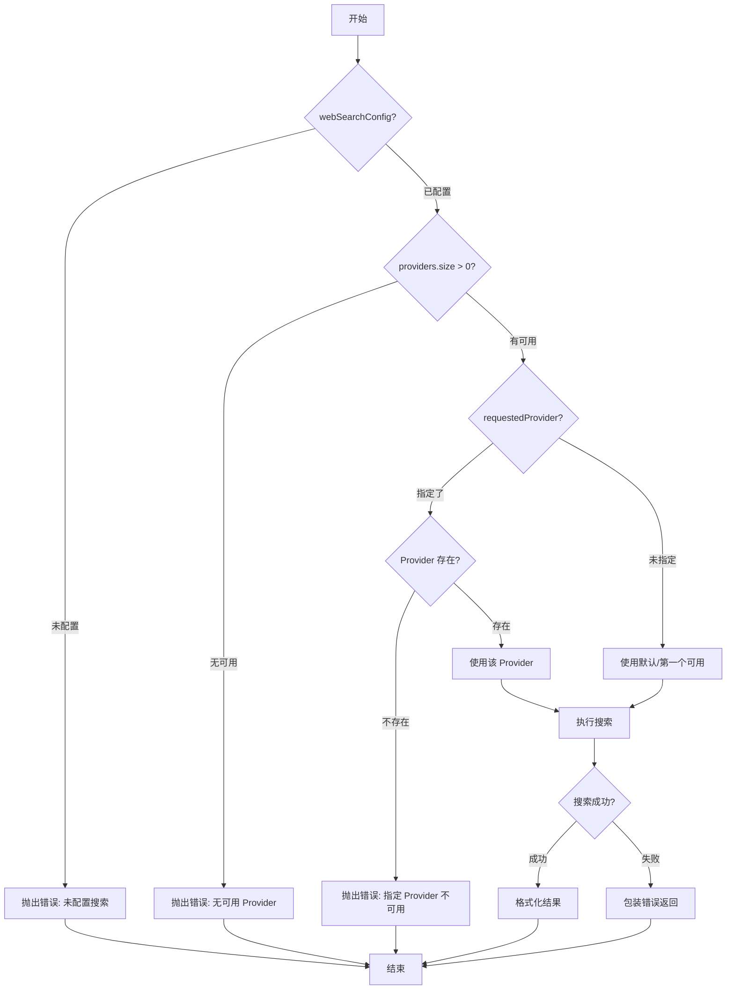
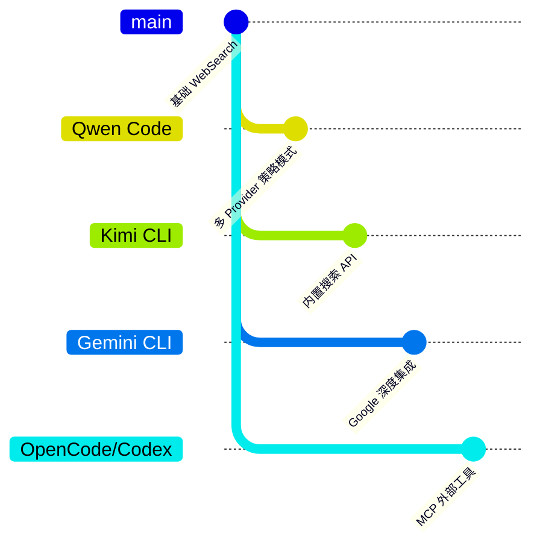

# Qwen Code WebSearch 实现机制

> **阅读指南**
>
> | 属性 | 说明 |
> |-----|------|
> | 预计阅读 | 20-30 分钟 |
> | 前置文档 | `05-qwen-code-tools-system.md` |
> | 文档结构 | 速览 → 架构 → 机制 → 实现 → 对比 |
> | 代码呈现 | 关键代码直接展示，完整代码可折叠查看 |

---

## TL;DR（结论先行）

一句话定义：WebSearch 是 AI Coding Agent 获取实时互联网信息的能力，让 LLM 能够回答训练数据截止日期之后的问题。

Qwen Code 的核心取舍：**多 Provider 策略模式 + 自动配置优先级**（属于「自助接入 WebSearch」类型，对比 Kimi CLI 的「厂商提供 WebSearch 接口」、OpenCode/Codex 的「无 Web 搜索能力」）

### 核心要点速览

| 维度 | 关键决策 | 代码位置 |
|-----|---------|---------|
| 架构模式 | Provider 策略模式，支持 Tavily/Google/DashScope 三后端切换 | `packages/core/src/tools/web-search/index.ts:85-103` |
| 默认策略 | Tavily > Google > DashScope 优先级自动选择 | `packages/cli/src/config/webSearch.ts:40-78` |
| 结果格式化 | 优先使用 API 返回的 answer 字段，否则构建摘要列表 | `packages/core/src/tools/web-search/index.ts:164-219` |
| 国内适配 | DashScope(夸克搜索) + OAuth 自动配置，解决国内访问问题 | `packages/core/src/tools/web-search/providers/dashscope-provider.ts:106-141` |

---

## 1. 为什么需要这个机制？

### 1.1 问题场景

AI Coding Agent 需要处理用户关于最新技术、当前事件或训练数据截止日期之后的信息查询。没有 WebSearch 功能时：

```
用户问: "React 19 有什么新特性？"
→ LLM: "我的知识截止到 2024 年，无法提供 React 19 的信息"

有 WebSearch:
  → LLM: 调用 web_search 工具
  → 获取 React 19 最新文档和博客
  → 返回准确的特性列表
```

### 1.2 核心挑战

| 挑战 | 不解决的后果 |
|-----|-------------|
| 搜索服务多样性 | 用户可能需要使用不同的搜索 API（商业/免费/企业内网） |
| 结果质量不一 | 不同 API 返回格式差异大，需要统一处理 |
| 配置灵活性 | 硬编码 API 密钥不安全，需要支持多种配置方式 |
| 国内访问 | 部分用户无法访问 Google，需要国内替代方案 |

---

## 2. 整体架构

### 2.1 在系统中的位置

```text
┌─────────────────────────────────────────────────────────────┐
│ Agent Loop / Tool System                                     │
│ packages/core/src/tools/                                     │
└───────────────────────┬─────────────────────────────────────┘
                        │ 工具调用
                        ▼
┌─────────────────────────────────────────────────────────────┐
│ ▓▓▓ WebSearch Tool ▓▓▓                                      │
│ packages/core/src/tools/web-search/index.ts                  │
│ - WebSearchTool: 工具定义和参数校验                          │
│ - WebSearchToolInvocation: 执行逻辑                          │
└───────────────────────┬─────────────────────────────────────┘
                        │ 委托搜索
        ┌───────────────┼───────────────┐
        ▼               ▼               ▼
┌──────────────┐ ┌──────────────┐ ┌──────────────┐
│ Tavily       │ │ Google       │ │ DashScope    │
│ Provider     │ │ Provider     │ │ Provider     │
│ (第三方)     │ │ (第三方)     │ │ (夸克搜索)   │
└──────────────┘ └──────────────┘ └──────────────┘
```

### 2.2 核心组件职责

| 组件 | 职责 | 代码位置 |
|-----|------|---------|
| `WebSearchTool` | 工具定义、参数校验、创建调用实例 | `packages/core/src/tools/web-search/index.ts:281-336` |
| `WebSearchToolInvocation` | 执行搜索、结果格式化、错误处理 | `packages/core/src/tools/web-search/index.ts:38-276` |
| `BaseWebSearchProvider` | Provider 抽象基类，统一错误处理 | `packages/core/src/tools/web-search/base-provider.ts` |
| `TavilyProvider` | Tavily API 实现 | `packages/core/src/tools/web-search/providers/tavily-provider.ts` |
| `GoogleProvider` | Google Custom Search API 实现 | `packages/core/src/tools/web-search/providers/google-provider.ts` |
| `DashScopeProvider` | 阿里云 DashScope（夸克搜索）实现 | `packages/core/src/tools/web-search/providers/dashscope-provider.ts` |

### 2.3 核心组件交互关系



**关键交互说明**：

| 步骤 | 交互内容 | 设计意图 |
|-----|---------|---------|
| 1 | 接收搜索请求 | 通过 Tool System 统一接口 |
| 2 | 创建调用实例 | 分离工具定义与执行逻辑 |
| 3 | 权限确认 | 根据 ApprovalMode 决定是否自动执行 |
| 4-5 | Provider 管理 | 动态创建并选择可用 Provider |
| 6 | 执行搜索 | 抽象接口屏蔽底层差异 |
| 7-8 | API 调用 | 各 Provider 实现具体的 HTTP 请求 |
| 9 | 结果格式化 | 统一输出格式，支持多种展示方式 |

---

## 3. 核心组件详细分析

### 3.1 Provider 策略模式

#### 职责定位

Provider 模式是 WebSearch 的核心设计，将不同搜索服务的实现细节封装，对外提供统一的 `WebSearchProvider` 接口。

#### 状态机图



**状态说明**：

| 状态 | 说明 | 进入条件 | 退出条件 |
|-----|------|---------|---------|
| Unconfigured | 未配置 | 初始化完成 | 配置验证通过或失败 |
| Available | 可用等待 | 配置验证通过 | 收到搜索请求 |
| Unavailable | 不可用 | 配置验证失败 | 重新配置 |
| Searching | 搜索中 | 收到搜索请求 | 搜索完成或失败 |
| Success | 成功 | 搜索成功返回 | 自动返回 Available |
| Failed | 失败 | API 调用失败 | 错误处理完成 |

#### 内部数据流

```text
┌────────────────────────────────────────────┐
│  输入层                                     │
│   原始查询 → 参数验证 → 结构化请求          │
└──────────────────┬─────────────────────────┘
                   ▼
┌────────────────────────────────────────────┐
│  处理层                                     │
│   Provider 选择 → API 调用 → 响应解析       │
└──────────────────┬─────────────────────────┘
                   ▼
┌────────────────────────────────────────────┐
│  输出层                                     │
│   结果格式化 → 来源提取 → 内容组装          │
└────────────────────────────────────────────┘
```

#### 关键接口

| 接口 | 输入 | 输出 | 说明 | 代码位置 |
|-----|------|------|------|---------|
| `isAvailable()` | - | `boolean` | 检查 Provider 是否可用 | `packages/core/src/tools/web-search/types.ts:13` |
| `search()` | `query: string, signal: AbortSignal` | `Promise<WebSearchResult>` | 执行搜索 | `packages/core/src/tools/web-search/types.ts:14` |
| `createProviders()` | `config: WebSearchConfig` | `Map<string, WebSearchProvider>` | 创建所有可用 Provider | `packages/core/src/tools/web-search/index.ts:85-103` |

### 3.2 Provider 实现对比

| Provider | 可用性检查 | 认证方式 | 特点 |
|---------|-----------|---------|------|
| Tavily | `!!config.apiKey` | API Key | 提供 AI 优化的搜索结果，支持 answer 字段 |
| Google | `!!config.apiKey && !!config.searchEngineId` | API Key + Search Engine ID | 传统搜索，需要配置 Custom Search Engine |
| DashScope | `config.authType === 'qwen-oauth'` | OAuth Token | 国内可用，夸克搜索后端，Qwen OAuth 用户自动启用 |

### 3.3 组件间协作时序



**协作要点**：

1. **调用方与 Invocation**：通过 Tool System 统一接口调用，解耦触发与执行
2. **Provider 创建与选择**：运行时动态创建，支持按优先级或指定选择
3. **Provider 与 Search API**：各 Provider 实现具体的 HTTP 请求和响应解析

### 3.4 关键数据路径

#### 主路径（正常流程）



#### 异常路径（错误恢复）



#### 配置路径（初始化流程）



---

## 4. 端到端数据流转

### 4.1 正常流程（详细版）



**数据变换详情**：

| 阶段 | 输入 | 处理 | 输出 | 代码位置 |
|-----|------|------|------|---------|
| 接收 | `{query: string}` | 参数校验、创建 Invocation | `WebSearchToolInvocation` | `packages/core/src/tools/web-search/index.ts:281-336` |
| Provider 创建 | `WebSearchConfig` | 遍历配置，实例化 Provider | `Map<string, WebSearchProvider>` | `packages/core/src/tools/web-search/index.ts:85-103` |
| Provider 选择 | `providers, requested?, default?` | 按优先级选择可用 Provider | `WebSearchProvider` | `packages/core/src/tools/web-search/index.ts:114-159` |
| 搜索执行 | `query, AbortSignal` | HTTP 请求、响应解析 | `WebSearchResult` | 各 Provider `search()` 方法 |
| 结果格式化 | `WebSearchResult` | 提取 answer 或构建摘要 | `{content, sources}` | `packages/core/src/tools/web-search/index.ts:164-219` |

### 4.2 数据流向图



### 4.3 异常/边界流程



---

## 5. 关键代码实现

### 5.1 核心数据结构

```typescript
// packages/core/src/tools/web-search/types.ts:12-30
export interface WebSearchProvider {
  readonly name: string;
  isAvailable(): boolean;
  search(query: string, signal: AbortSignal): Promise<WebSearchResult>;
}

// packages/core/src/tools/web-search/types.ts:35-66
export interface WebSearchResultItem {
  title: string;
  url: string;
  content?: string;      // 摘要/片段
  score?: number;        // 相关性分数
  publishedDate?: string;
}

export interface WebSearchResult {
  query: string;
  answer?: string;       // Tavily 等提供的直接答案
  results: WebSearchResultItem[];
  metadata?: Record<string, unknown>;
}

export interface WebSearchToolResult extends ToolResult {
  sources?: Array<{ title: string; url: string }>;
}
```

**字段说明**：

| 字段 | 类型 | 用途 |
|-----|------|------|
| `name` | `string` | Provider 标识名称 |
| `isAvailable()` | `() => boolean` | 检查 Provider 配置是否完整可用 |
| `search()` | `(query, signal) => Promise<WebSearchResult>` | 执行搜索的核心方法 |
| `answer` | `string?` | Tavily 等提供的 AI 总结答案 |
| `results` | `WebSearchResultItem[]` | 搜索结果列表 |
| `sources` | `Array<{title, url}>` | 用于展示的来源链接列表 |

### 5.2 主链路代码

**关键代码**（核心逻辑）：

```typescript
// packages/core/src/tools/web-search/index.ts:85-159
private createProvider(config: WebSearchProviderConfig): WebSearchProvider {
  switch (config.type) {
    case 'tavily':
      return new TavilyProvider(config);
    case 'google':
      return new GoogleProvider(config);
    case 'dashscope':
      const dashscopeConfig: DashScopeProviderConfig = {
        ...config,
        authType: this.config.getAuthType() as string | undefined,
      };
      return new DashScopeProvider(dashscopeConfig);
    default:
      throw new Error('Unknown provider type');
  }
}

private selectProvider(
  providers: Map<string, WebSearchProvider>,
  requestedProvider?: string,
  defaultProvider?: string,
): WebSearchProvider {
  // 1. 优先使用用户指定的 Provider
  if (requestedProvider) {
    const provider = providers.get(requestedProvider);
    if (!provider) {
      throw new Error(
        `The specified provider "${requestedProvider}" is not available.`
      );
    }
    return provider;
  }

  // 2. 使用配置的默认 Provider
  if (defaultProvider && providers.has(defaultProvider)) {
    return providers.get(defaultProvider)!;
  }

  // 3. 回退到第一个可用的 Provider
  const firstProvider = providers.values().next().value;
  if (!firstProvider) {
    throw new Error('No web search providers are available.');
  }
  return firstProvider;
}
```

**设计意图**：
1. **策略模式**：通过统一的 Provider 接口支持多种搜索服务，新增 Provider 只需实现接口
2. **运行时选择**：支持通过参数指定 Provider，或按配置自动选择，提供灵活性
3. **优雅降级**：当首选 Provider 不可用时，自动回退到其他可用 Provider

<details>
<summary>查看完整实现（含错误处理、日志等）</summary>

```typescript
// packages/core/src/tools/web-search/index.ts:85-159
private createProviders(): Map<string, WebSearchProvider> {
  const providers = new Map<string, WebSearchProvider>();

  for (const providerConfig of this.config.provider) {
    try {
      const provider = this.createProvider(providerConfig);
      if (provider.isAvailable()) {
        providers.set(provider.name, provider);
      }
    } catch (error) {
      logger.warn(`Failed to create provider ${providerConfig.type}:`, error);
    }
  }

  return providers;
}

private createProvider(config: WebSearchProviderConfig): WebSearchProvider {
  switch (config.type) {
    case 'tavily':
      return new TavilyProvider(config);
    case 'google':
      return new GoogleProvider(config);
    case 'dashscope':
      const dashscopeConfig: DashScopeProviderConfig = {
        ...config,
        authType: this.config.getAuthType() as string | undefined,
      };
      return new DashScopeProvider(dashscopeConfig);
    default:
      throw new Error(`Unknown provider type: ${(config as any).type}`);
  }
}

private selectProvider(
  providers: Map<string, WebSearchProvider>,
  requestedProvider?: string,
  defaultProvider?: string,
): WebSearchProvider {
  // 1. 优先使用用户指定的 Provider
  if (requestedProvider) {
    const provider = providers.get(requestedProvider);
    if (!provider) {
      const availableProviders = Array.from(providers.keys()).join(', ');
      throw new Error(
        `The specified provider "${requestedProvider}" is not available. ` +
        `Available providers: ${availableProviders || 'none'}`
      );
    }
    return provider;
  }

  // 2. 使用配置的默认 Provider
  if (defaultProvider && providers.has(defaultProvider)) {
    return providers.get(defaultProvider)!;
  }

  // 3. 回退到第一个可用的 Provider
  const firstProvider = providers.values().next().value;
  if (!firstProvider) {
    throw new Error('No web search providers are available.');
  }
  return firstProvider;
}
```

</details>

### 5.3 结果格式化

```typescript
// packages/core/src/tools/web-search/index.ts:164-219
private formatSearchResults(searchResult: {
  answer?: string;
  results: WebSearchResultItem[];
}): { content: string; sources: Array<{ title: string; url: string }> } {
  const sources = searchResult.results.map((r) => ({
    title: r.title,
    url: r.url,
  }));

  let content = searchResult.answer?.trim() || '';

  if (!content) {
    // Fallback: 构建包含标题、摘要、来源的摘要列表
    content = searchResult.results
      .slice(0, 5)
      .map((r, i) => {
        const parts = [`${i + 1}. **${r.title}**`];
        if (r.content?.trim()) {
          parts.push(`   ${r.content.trim()}`);
        }
        parts.push(`   Source: ${r.url}`);
        if (r.score !== undefined) {
          parts.push(`   Relevance: ${(r.score * 100).toFixed(0)}%`);
        }
        return parts.join('\n');
      })
      .join('\n\n');

    // 提示可以使用 web_fetch 获取详细内容
    if (content) {
      content +=
        '\n\n*Note: For detailed content from any source above, use the web_fetch tool with the URL.*';
    }
  } else {
    // 当 answer 可用时，追加来源列表
    content = buildContentWithSources(content, sources);
  }

  return { content, sources };
}
```

### 5.4 配置构建

```typescript
// packages/cli/src/config/webSearch.ts:40-78
export function buildWebSearchConfig(
  argv: WebSearchCliArgs,
  settings: Settings,
  authType?: string,
): WebSearchConfig | undefined {
  const isQwenOAuth = authType === AuthType.QWEN_OAUTH;
  let providers: WebSearchProviderConfig[] = [];
  let userDefault: string | undefined;

  // 1. 从 settings.json 或 CLI/环境变量收集 Provider
  if (settings.webSearch) {
    providers = [...settings.webSearch.provider];
    userDefault = settings.webSearch.default;
  } else {
    // 从环境变量构建
    const tavilyKey = process.env['TAVILY_API_KEY'];
    if (tavilyKey) {
      providers.push({ type: 'tavily', apiKey: tavilyKey });
    }
    const googleKey = process.env['GOOGLE_API_KEY'];
    const googleEngineId = process.env['GOOGLE_SEARCH_ENGINE_ID'];
    if (googleKey && googleEngineId) {
      providers.push({ type: 'google', apiKey: googleKey, searchEngineId: googleEngineId });
    }
  }

  // 2. Qwen OAuth 用户自动添加 DashScope
  if (isQwenOAuth) {
    const hasDashscope = providers.some((p) => p.type === 'dashscope');
    if (!hasDashscope) {
      providers.push({ type: 'dashscope' });
    }
  }

  // 3. 确定默认 Provider（优先级: tavily > google > dashscope）
  const providerPriority = ['tavily', 'google', 'dashscope'];
  let defaultProvider = userDefault;
  if (!defaultProvider) {
    for (const providerType of providerPriority) {
      if (providers.some((p) => p.type === providerType)) {
        defaultProvider = providerType;
        break;
      }
    }
  }

  return { provider: providers, default: defaultProvider };
}
```

### 5.5 关键调用链

```text
WebSearchTool.execute()          [packages/core/src/tools/web-search/index.ts:281]
  -> createInvocation()          [packages/core/src/tools/web-search/index.ts:295]
    -> WebSearchToolInvocation.invoke()  [packages/core/src/tools/web-search/index.ts:223]
      -> createProviders()       [packages/core/src/tools/web-search/index.ts:85]
        - 遍历 providerConfigs
        - 调用 createProvider() 实例化
      -> selectProvider()        [packages/core/src/tools/web-search/index.ts:114]
        - 检查 requestedProvider
        - 检查 defaultProvider
        - 回退到第一个可用
      -> provider.search()       [各 Provider search() 方法]
        - isAvailable() 验证
        - HTTP 请求 Search API
        - 解析响应为 WebSearchResult
      -> formatSearchResults()   [packages/core/src/tools/web-search/index.ts:164]
        - 优先使用 answer 字段
        - 否则构建摘要列表
```

---

## 6. 设计意图与 Trade-off

### 6.1 Qwen Code 的选择

| 维度 | Qwen Code 的选择 | 替代方案 | 取舍分析 |
|-----|-----------------|---------|---------|
| 架构模式 | Provider 策略模式 | 单一服务硬编码 | 支持多后端灵活切换，但增加架构复杂度 |
| 默认服务 | Tavily > Google > DashScope 优先级 | 单一默认 | 平衡国际用户（Tavily 质量高）和国内用户（DashScope 可访问）需求 |
| 认证方式 | API Key / OAuth 混合 | 仅 API Key | OAuth 更安全且自动配置，但实现复杂度高 |
| 结果处理 | 优先 answer，回退摘要 | 统一格式 | 充分利用 Tavily 的 AI 优化结果，提升用户体验 |
| 国内适配 | DashScope(夸克) + OAuth 自动配置 | 手动配置 | 国内用户开箱即用，但依赖阿里云生态 |

### 6.2 为什么这样设计？

**核心问题**：如何为不同地区、不同需求的用户提供灵活的搜索能力？

**Qwen Code 的解决方案**：

1. **多 Provider 支持**：
   - 国际用户：Tavily（AI 优化）、Google（传统搜索）
   - 国内用户：DashScope（夸克搜索，国内访问稳定）
   - 代码位置：`packages/core/src/tools/web-search/providers/`

2. **自动配置**：
   - Qwen OAuth 用户自动启用 DashScope，无需额外配置
   - 其他用户可通过环境变量或 settings.json 配置
   - 代码位置：`packages/cli/src/config/webSearch.ts:81-86`

3. **结果智能格式化**：
   - Tavily 提供 `answer` 字段时直接使用（AI 已总结）
   - 否则构建结构化摘要（标题 + 片段 + URL）
   - 提示用户可使用 `web_fetch` 获取详细内容

### 6.3 与其他项目的对比



| 项目 | WebSearch 分类 | WebSearch 实现 | 核心差异 | 适用场景 |
|-----|---------------|-----------------|---------|---------|
| **Qwen Code** | 自助接入 WebSearch | 多 Provider 策略模式 | 支持 Tavily/Google/DashScope 等多提供商，国内用户友好，自动配置 | 需要灵活切换搜索服务，国内用户 |
| **Kimi CLI** | 厂商提供 WebSearch 接口 | 内置 WebSearch | 通过 Moonshot API 内置搜索，无需额外配置，但不可替换 | 追求简单配置，信任 Kimi 搜索质量 |
| **Gemini CLI** | 自助接入 WebSearch | Google Search 集成 | 深度集成 Google 搜索，依赖 Google 生态 | 已在使用 Google 服务，需要高质量搜索 |
| **OpenCode** | 无 Web 搜索能力 | 依赖 MCP 外部工具 | 通过 MCP 协议接入外部搜索工具，灵活性高但配置复杂 | 需要自定义搜索逻辑，偏好 MCP 生态 |
| **Codex** | 无 Web 搜索能力 | 依赖 MCP 外部工具 | 通过 MCP 协议接入外部搜索工具，灵活性高但配置复杂 | 需要自定义搜索逻辑，偏好 MCP 生态 |

**分类说明**：

| 分类 | 定义 | 代表项目 |
|-----|------|---------|
| **厂商提供 WebSearch 接口** | LLM 厂商直接提供搜索能力，Agent 通过 API 调用内置搜索 | Kimi CLI |
| **自助接入 WebSearch** | Agent 开发者自行接入第三方搜索服务（如 Tavily、Google、DashScope 夸克搜索等多提供商策略） | Qwen Code, Gemini CLI |
| **无 Web 搜索能力** | 不具备网络搜索功能，只使用本地工具，需通过 MCP 等协议扩展 | OpenCode, Codex |

**Qwen Code 的独特之处**：

1. **DashScope 集成**：针对国内用户的夸克搜索支持，通过 OAuth 自动配置，解决国内访问 Google 受限问题
2. **Provider 优先级**：tavily > google > dashscope 的默认优先级，平衡搜索质量与可用性
3. **与 web_fetch 协同**：搜索结果提示可使用 web_fetch 获取详细内容，形成工具链

---

## 7. 边界情况与错误处理

### 7.1 终止条件

| 终止原因 | 触发条件 | 代码位置 |
|---------|---------|---------|
| 未配置 Provider | `webSearchConfig` 为 undefined | `packages/core/src/tools/web-search/index.ts:223-234` |
| Provider 不可用 | 请求的 Provider 不在可用列表中 | `packages/core/src/tools/web-search/index.ts:138-144` |
| 搜索无结果 | `content.trim()` 为空 | `packages/core/src/tools/web-search/index.ts:250-255` |
| API 错误 | HTTP 请求失败或返回错误状态 | `packages/core/src/tools/web-search/index.ts:263-274` |

### 7.2 超时/资源限制

```typescript
// packages/core/src/tools/web-search/base-provider.ts:30-45
protected async performSearch(
  url: string,
  options: RequestInit,
  signal: AbortSignal
): Promise<Response> {
  // 使用传入的 AbortSignal 控制超时
  const response = await fetch(url, {
    ...options,
    signal,  // 由调用方控制超时
  });

  if (!response.ok) {
    throw new Error(`Search API error: ${response.status} ${response.statusText}`);
  }

  return response;
}
```

### 7.3 错误恢复策略

| 错误类型 | 处理策略 | 代码位置 |
|---------|---------|---------|
| Provider 创建失败 | 记录警告日志，跳过该 Provider，继续尝试其他 | `packages/core/src/tools/web-search/index.ts:119-121` |
| 指定 Provider 不可用 | 抛出错误，提示可用 Provider 列表 | `packages/core/src/tools/web-search/index.ts:141-144` |
| API 调用失败 | 捕获并包装错误，返回错误结果 | `packages/core/src/tools/web-search/index.ts:263-274` |
| 网络超时 | 通过 AbortSignal 取消请求，抛出超时错误 | 各 Provider 的 `performSearch` 方法 |
| 结果解析失败 | 返回空结果或降级为原始响应 | `packages/core/src/tools/web-search/providers/*.ts` |

---

## 8. 关键代码索引

| 功能 | 文件 | 行号 | 说明 |
|-----|------|------|------|
| 工具入口 | `packages/core/src/tools/web-search/index.ts` | 281-336 | WebSearchTool 类定义，工具元数据 |
| 执行逻辑 | `packages/core/src/tools/web-search/index.ts` | 38-276 | WebSearchToolInvocation 类，核心执行流程 |
| Provider 创建 | `packages/core/src/tools/web-search/index.ts` | 85-103 | createProviders() 方法 |
| Provider 选择 | `packages/core/src/tools/web-search/index.ts` | 114-159 | selectProvider() 方法 |
| 结果格式化 | `packages/core/src/tools/web-search/index.ts` | 164-219 | formatSearchResults() 方法 |
| Provider 基类 | `packages/core/src/tools/web-search/base-provider.ts` | 1-58 | 抽象基类和错误处理 |
| Tavily 实现 | `packages/core/src/tools/web-search/providers/tavily-provider.ts` | 1-84 | Tavily API 调用实现 |
| Google 实现 | `packages/core/src/tools/web-search/providers/google-provider.ts` | 1-91 | Google Custom Search 实现 |
| DashScope 实现 | `packages/core/src/tools/web-search/providers/dashscope-provider.ts` | 1-199 | 夸克搜索 + OAuth 集成 |
| 类型定义 | `packages/core/src/tools/web-search/types.ts` | 1-157 | 接口和类型定义 |
| 配置构建 | `packages/cli/src/config/webSearch.ts` | 1-122 | 配置加载和优先级处理 |
| 工具名称 | `packages/core/src/tools/tool-names.ts` | 25 | WEB_SEARCH 常量定义 |
| 集成测试 | `integration-tests/web_search.test.ts` | 1-123 | 端到端测试用例 |

---

## 9. 延伸阅读

- 前置知识：[05-qwen-code-tools-system.md](../05-qwen-code-tools-system.md) - 工具系统整体架构
- 相关机制：[qwen-code-tool-error-handling.md](./qwen-code-tool-error-handling.md) - 工具错误处理机制
- 相关工具：[WebFetch 实现](../05-qwen-code-tools-system.md#webfetch) - 网页内容获取工具，与 WebSearch 形成工具链
- 配置文档：[settings.json 配置](../../../qwen-code/docs/users/configuration/settings.md) - 用户配置指南
- 跨项目对比：[docs/comm/comm-websearch-comparison.md](../../comm/comm-websearch-comparison.md) - 各项目 WebSearch 实现对比

---

*✅ Verified: 基于 qwen-code/packages/core/src/tools/web-search/ 源码分析*
*基于版本：2025-02-23 | 最后更新：2025-04-12*
