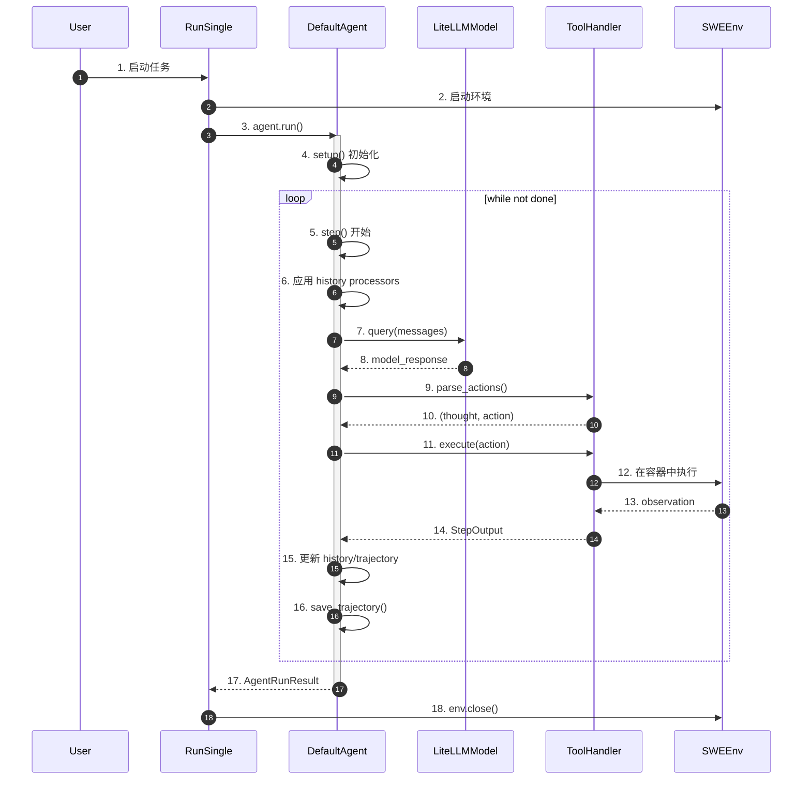
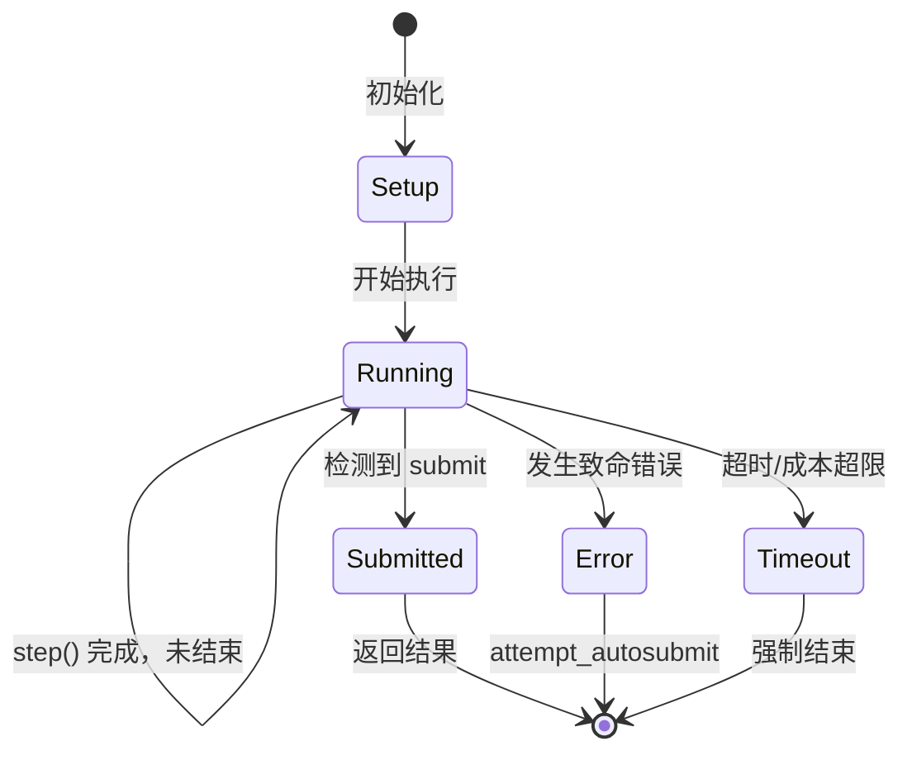
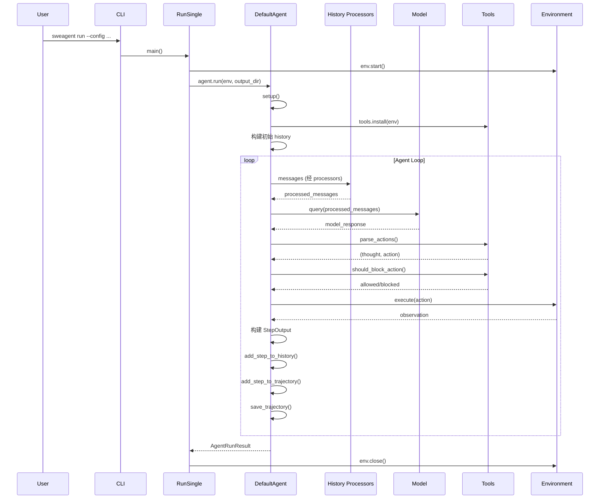

# SWE-agent 概述

## TL;DR（结论先行）

SWE-agent 是一个学术研究型 Python Agent，专注于软件工程任务（特别是自动化代码修复和 GitHub Issue 解决），采用"双层循环 + 轨迹持久化"架构：内层 step 级循环处理单轮模型调用与工具执行，外层 retry 级循环支持多次尝试与结果选优。

SWE-agent 的核心取舍：**轨迹为中心的 Session 管理 + 配置驱动的工具系统**（对比 Kimi CLI 的 Checkpoint 回滚、Codex 的 Actor 消息驱动）

---

## 1. 为什么需要这个架构？（解决什么问题）

### 1.1 问题场景

软件工程任务（如修复 bug、实现功能）通常需要：
- 理解复杂的代码库结构
- 执行多步骤操作（搜索、阅读、编辑、测试）
- 处理不确定性和错误恢复
- 生成可验证的修复结果

没有 Agent Loop：用户问"修复这个 bug" -> LLM 一次性回答 -> 结束（可能根本没看文件）

有 Agent Loop：
  -> LLM: "先搜索相关代码" -> 执行搜索 -> 得到结果
  -> LLM: "阅读文件内容" -> 打开文件 -> 得到内容
  -> LLM: "编辑第 42 行" -> 执行编辑 -> 成功
  -> LLM: "运行测试验证" -> 执行测试 -> 验证通过
  -> LLM: "提交修复" -> 生成 patch -> 任务完成

### 1.2 核心挑战

| 挑战 | 不解决的后果 |
|-----|-------------|
| 代码库规模大 | 上下文超限，无法有效处理 |
| 多步骤依赖 | 单轮调用无法完成复杂任务 |
| 错误恢复 | 一次失败导致整个任务中断 |
| 结果验证 | 无法确保修复正确性 |
| 可复现性 | 无法追踪和重放执行过程 |

---

## 2. 整体架构（ASCII 图）

### 2.1 在系统中的位置

```text
┌─────────────────────────────────────────────────────────────┐
│ CLI 入口                                                    │
│ sweagent/__main__.py                                        │
└───────────────────────┬─────────────────────────────────────┘
                        │ 调用
                        ▼
┌─────────────────────────────────────────────────────────────┐
│ ▓▓▓ Run Layer ▓▓▓                                           │
│ sweagent/run/                                               │
│ - run_single.py: 单实例运行                                 │
│ - run_batch.py:  批量运行                                   │
│ - run_replay.py: 轨迹重放                                   │
└───────────────────────┬─────────────────────────────────────┘
                        │ 依赖/调用
                        ▼
┌─────────────────────────────────────────────────────────────┐
│ ▓▓▓ Agent Layer ▓▓▓                                         │
│ sweagent/agent/agents.py                                    │
│ - DefaultAgent: 主 Agent 实现                               │
│ - RetryAgent:   重试机制封装                                │
│ - ShellAgent:   纯 Shell 模式                               │
└───────────────────────┬─────────────────────────────────────┘
                        │
        ┌───────────────┼───────────────┐
        ▼               ▼               ▼
┌──────────────┐ ┌──────────────┐ ┌──────────────┐
│ Tools Layer  │ │ Model Layer  │ │ Environment  │
│ 工具执行     │ │ 模型调用     │ │ 沙箱环境     │
└──────────────┘ └──────────────┘ └──────────────┘
```

### 2.2 核心组件职责

| 组件 | 职责 | 代码位置 |
|-----|------|---------|
| `DefaultAgent` | 主 Agent 实现，管理 Session 生命周期 | `sweagent/agent/agents.py:443` |
| `RetryAgent` | 外层重试循环，支持多次尝试与选优 | `sweagent/agent/agents.py:257` |
| `ToolHandler` | 工具注册、执行、过滤管理 | `sweagent/tools/tools.py:200+` |
| `SWEEnv` | 容器化执行环境管理 | `sweagent/environment/swe_env.py` |
| `LiteLLMModel` | 统一模型接口（多提供商支持） | `sweagent/agent/models.py` |

### 2.3 核心组件交互关系



**关键交互说明**：

| 步骤 | 交互内容 | 设计意图 |
|-----|---------|---------|
| 1-3 | 用户通过 CLI 启动，RunSingle 协调环境与 Agent | 解耦用户接口与核心逻辑 |
| 4 | Agent 初始化，安装工具，构建初始 history | 一次性设置，后续复用 |
| 5-16 | 核心 Agent Loop，每轮执行模型调用+工具执行 | 迭代式任务推进 |
| 11-14 | ToolHandler 统一处理工具执行 | 集中管控，便于过滤和安全控制 |
| 16 | 每步持久化 trajectory | 支持断点续传和事后分析 |

---

## 3. 核心组件详细分析

### 3.1 Agent Loop 内部结构

#### 职责定位

Agent Loop 是 SWE-agent 的控制核心，驱动多轮 LLM 调用与工具执行，直到任务完成或达到终止条件。

#### 状态机图



**状态说明**：

| 状态 | 说明 | 进入条件 | 退出条件 |
|-----|------|---------|---------|
| Setup | 初始化阶段 | agent.run() 被调用 | 工具安装完成，history 初始化完成 |
| Running | 执行中 | 初始化完成 | step_output.done = true |
| Submitted | 已提交 | 检测到 submit 命令 | 自动退出 |
| Error | 错误状态 | 发生致命错误 | autosubmit 后退出 |
| Timeout | 超时状态 | 达到时间/成本限制 | 强制退出 |

#### 内部数据流

```text
┌─────────────────────────────────────────────────────────────┐
│  输入层                                                      │
│  ├── history: list[HistoryItem] ──► processor 链处理        │
│  └── state: 环境状态（open_file, working_dir）               │
└──────────────────────────┬──────────────────────────────────┘
                           ▼
┌─────────────────────────────────────────────────────────────┐
│  处理层                                                      │
│  ├── 模型调用: model.query(processed_messages)              │
│  │   └── 返回 model_response                                 │
│  ├── 动作解析: parse_actions() ──► (thought, action)        │
│  ├── 命令过滤: should_block_action()                        │
│  └── 工具执行: execute() ──► observation                    │
└──────────────────────────┬──────────────────────────────────┘
                           ▼
┌─────────────────────────────────────────────────────────────┐
│  输出层                                                      │
│  ├── StepOutput: 单步完整输出                               │
│  ├── history 更新: add_step_to_history()                    │
│  ├── trajectory 更新: add_step_to_trajectory()              │
│  └── 持久化: save_trajectory()                              │
└─────────────────────────────────────────────────────────────┘
```

---

### 3.2 双层循环架构

SWE-agent 采用独特的双层循环设计：

```text
┌─────────────────────────────────────────────────────────────┐
│ 外层循环: RetryAgent.run()                                   │
│  ┌───────────────────────────────────────────────────────┐  │
│  │ while not done:                                       │  │
│  │   ├─► DefaultAgent.run()  // 内层循环                │  │
│  │   ├─► on_submit()  // 提交处理                       │  │
│  │   └─► retry() ?  // 是否重试                         │  │
│  │       ├─Yes─► hard_reset() + 继续                    │  │
│  │       └─No ─► 结束，返回最优结果                     │  │
│  └───────────────────────────────────────────────────────┘  │
└─────────────────────────────────────────────────────────────┘
                            │
                            ▼
┌─────────────────────────────────────────────────────────────┐
│ 内层循环: DefaultAgent.run()                                 │
│  ┌───────────────────────────────────────────────────────┐  │
│  │ setup()  // 初始化                                     │  │
│  │ while not step_output.done:                           │  │
│  │   └─► step()  // 单步执行                            │  │
│  │       ├─► forward_with_handling()  // 模型调用       │  │
│  │       ├─► handle_action()          // 工具执行       │  │
│  │       └─► save_trajectory()        // 持久化         │  │
│  └───────────────────────────────────────────────────────┘  │
└─────────────────────────────────────────────────────────────┘
```

**设计意图**：
- **内层循环**：解决"当前尝试如何推进"，处理单轮对话中的模型调用和工具执行
- **外层循环**：解决"多次尝试如何选优"，支持失败后重置环境重新尝试

---

## 4. 端到端数据流转

### 4.1 正常流程（详细版）



### 4.2 数据变换详情

| 阶段 | 输入 | 处理 | 输出 | 代码位置 |
|-----|------|------|------|---------|
| 配置加载 | CLI 参数 + YAML | pydantic 验证 | RunConfig | `sweagent/run/common.py:187` |
| Agent 初始化 | RunConfig | 构建 Agent 实例 | DefaultAgent | `sweagent/agent/agents.py:443` |
| History 处理 | 原始 history | Processors 链 | 处理后 messages | `sweagent/agent/agents.py:540` |
| 模型调用 | messages | LiteLLM 封装 | model_response | `sweagent/agent/models.py` |
| 动作解析 | model_response | ParseFunction | (thought, action) | `sweagent/tools/parsing.py` |
| 工具执行 | action | SWEEnv 执行 | observation | `sweagent/environment/swe_env.py` |
| 持久化 | trajectory | JSON 序列化 | .traj 文件 | `sweagent/agent/agents.py:save_trajectory` |

---

## 5. 关键代码实现

### 5.1 核心数据结构

```python
# sweagent/types.py:44-77
class HistoryItem(TypedDict):
    """对话历史项"""
    role: str                          # system/user/assistant/tool
    content: str | list[dict]
    message_type: Literal["thought", "action", "observation"]
    agent: str                         # 代理名称
    is_demo: bool                      # 是否为演示数据
    thought: str                       # 推理内容
    action: str | None                 # 执行动作
    tool_calls: list[dict] | None     # 工具调用

class StepOutput(BaseModel):
    """单步输出"""
    thought: str
    action: str
    observation: str
    output: str
    done: bool
    exit_status: int | str | None
    submission: str | None
    state: dict[str, str]
```

### 5.2 主链路代码

```python
# sweagent/agent/agents.py:800-850 (简化)
def step(self) -> StepOutput:
    """执行单步：模型调用 + 工具执行"""
    self._chook.on_step_start()

    # 1. 获取处理后的消息
    messages = self.messages

    # 2. 模型推理与错误处理
    step_output = self.forward_with_handling(messages)

    # 3. 更新 history 和 trajectory
    self.add_step_to_history(step_output)
    self.add_step_to_trajectory(step_output)

    # 4. 更新元数据
    self.info["submission"] = step_output.submission
    self.info["exit_status"] = step_output.exit_status

    return step_output
```

**代码要点**：
1. **Hook 系统**：通过 `_chook` 在关键节点触发回调，支持扩展
2. **错误处理**：`forward_with_handling` 封装重试逻辑
3. **双轨记录**：同时更新 history（对话）和 trajectory（执行）
4. **即时持久化**：每步保存 trajectory，支持断点续传

### 5.3 关键调用链

```text
RunSingle.run()                    [sweagent/run/run_single.py]
  -> agent.run()                   [sweagent/agent/agents.py:400]
    -> setup()                     [sweagent/agent/agents.py:561]
      -> tools.install(env)        [sweagent/tools/tools.py]
    -> while not done:
      -> step()                    [sweagent/agent/agents.py:800]
        -> forward_with_handling() [sweagent/agent/agents.py:700]
          -> model.query()         [sweagent/agent/models.py]
          -> parse_actions()       [sweagent/tools/parsing.py]
        -> handle_action()         [sweagent/agent/agents.py:750]
          -> tools.execute()       [sweagent/tools/tools.py]
            -> env.communicate()   [sweagent/environment/swe_env.py]
```

---

## 6. 设计意图与 Trade-off

### 6.1 SWE-agent 的选择

| 维度 | SWE-agent 的选择 | 替代方案 | 取舍分析 |
|-----|-----------------|---------|---------|
| 循环结构 | 双层循环（step + attempt） | 单层循环（Kimi CLI） | 支持失败后重试，但复杂度增加 |
| 状态持久化 | Trajectory 文件（JSON） | Checkpoint 回滚（Kimi） | 可人工检查，但无法自动恢复状态 |
| 工具系统 | Bundle + YAML 配置 | 代码注册（Codex） | 灵活配置，但运行时开销 |
| 环境隔离 | Docker 容器 | 本地沙箱（Codex） | 隔离性好，但启动慢 |
| 模型接口 | LiteLLM 统一封装 | 各提供商独立实现 | 支持多模型，但功能受限 |

### 6.2 为什么这样设计？

**核心问题**：如何在软件工程任务中实现可靠、可复现的自动化？

**SWE-agent 的解决方案**：
- 代码依据：`sweagent/agent/agents.py:400-434`
- 设计意图：通过双层循环分离"单次尝试推进"和"多次尝试选优"，配合详细的 trajectory 记录实现可复现性
- 带来的好处：
  - 支持失败后重试，提高成功率
  - 详细的执行记录便于分析和调试
  - 配置驱动的工具系统便于扩展
- 付出的代价：
  - 架构复杂度增加
  - Docker 启动开销
  - 状态无法自动回滚

### 6.3 与其他项目的对比

| 项目 | 核心差异 | 适用场景 |
|-----|---------|---------|
| SWE-agent | 双层循环 + Trajectory 持久化 | 学术研究、可复现实验 |
| Kimi CLI | Checkpoint 回滚 + D-Mail | 对话回滚、状态恢复 |
| Codex | Actor 消息驱动 + 原生沙箱 | 企业安全、高并发 |
| Gemini CLI | 递归 continuation + 分层内存 | 复杂任务、长上下文 |
| OpenCode | resetTimeoutOnProgress | 长运行任务、超时控制 |

---

## 7. 边界情况与错误处理

### 7.1 终止条件

| 终止原因 | 触发条件 | 代码位置 |
|---------|---------|---------|
| 正常提交 | 执行 submit 命令 | `sweagent/agent/agents.py:handle_submission` |
| 最大步数 | 达到 max_iterations | `sweagent/agent/agents.py:step` |
| 重试耗尽 | 超过 max_requeries | `sweagent/agent/agents.py:forward_with_handling` |
| 成本超限 | 达到 cost_limit | `sweagent/agent/models.py:377-381` |
| 超时 | 达到 total_execution_timeout | `sweagent/agent/agents.py:1018` |
| 环境错误 | runtime 崩溃 | `sweagent/environment/swe_env.py` |

### 7.2 超时/资源限制

SWE-agent 实现了多层级的资源限制机制：

**执行超时配置**（`sweagent/tools/tools.py:139-152`）：

```python
class ToolConfig(BaseModel):
    execution_timeout: int = 30
    """Timeout for executing commands in the environment"""

    install_timeout: int = 300
    """Timeout used for each of the installation commands"""

    total_execution_timeout: int = 1800
    """Timeout for executing all commands in the environment.
    Note: Does not interrupt running commands, but will stop the agent for the next step.
    """

    max_consecutive_execution_timeouts: int = 3
    """Maximum number of consecutive execution timeouts before the agent exits."""
```

**成本限制配置**（`sweagent/agent/models.py:73-78`）：

```python
class ModelConfig(BaseModel):
    per_instance_cost_limit: float = Field(
        default=3.0,
        description="Cost limit for every instance (task).",
    )
    total_cost_limit: float = Field(default=0.0, description="Total cost limit.")
    per_instance_call_limit: int = Field(default=0, description="Per instance call limit.")
```

**资源限制检查点**：

| 限制类型 | 默认值 | 检查位置 | 说明 |
|---------|-------|---------|------|
| 单命令执行超时 | 30s | `sweagent/agent/agents.py:965` | 单条命令最大执行时间 |
| 安装命令超时 | 300s | `sweagent/tools/tools.py:264` | 工具安装超时 |
| 总执行超时 | 1800s | `sweagent/agent/agents.py:1018` | 整个任务累计执行时间 |
| 连续超时次数 | 3次 | `sweagent/agent/agents.py:970` | 超过则强制退出 |
| 单实例成本限制 | $3.0 | `sweagent/agent/models.py:377` | 每个任务实例的成本上限 |
| 总成本限制 | 无限制 | `sweagent/agent/models.py:655` | 所有任务累计成本上限 |
| API 调用次数限制 | 无限制 | `sweagent/agent/models.py:667` | 单实例最大调用次数 |

### 7.3 错误恢复策略

| 错误类型 | 处理策略 | 代码位置 |
|---------|---------|---------|
| FormatError | requery（最多 max_requeries 次） | `sweagent/agent/agents.py` |
| BlockedAction | requery + 错误提示 | `sweagent/agent/agents.py` |
| BashSyntaxError | requery + 语法检查 | `sweagent/agent/agents.py` |
| Timeout | 标记并继续或退出 | `sweagent/tools/tools.py` |
| 环境崩溃 | attempt_autosubmit | `sweagent/agent/agents.py` |

---

## 8. 关键代码索引

| 功能 | 文件 | 行号 | 说明 |
|-----|------|------|------|
| 入口 | `sweagent/__main__.py` | 1 | 主入口 |
| Run 主逻辑 | `sweagent/run/run.py` | - | 命令解析与分发 |
| 单实例运行 | `sweagent/run/run_single.py` | - | RunSingle 类 |
| DefaultAgent | `sweagent/agent/agents.py` | 443 | 主 Agent |
| RetryAgent | `sweagent/agent/agents.py` | 257 | 重试包装 Agent |
| AgentConfig | `sweagent/agent/agents.py` | 149 | Agent 配置 |
| ToolConfig | `sweagent/tools/tools.py` | 75 | 工具配置 |
| ToolHandler | `sweagent/tools/tools.py` | 200+ | 工具处理器 |
| Command | `sweagent/tools/commands.py` | - | 命令定义 |
| Parsing | `sweagent/tools/parsing.py` | - | 输出解析 |
| SWEEnv | `sweagent/environment/swe_env.py` | - | 环境管理 |
| LiteLLMModel | `sweagent/agent/models.py` | - | 模型客户端 |
| StepOutput | `sweagent/types.py` | - | 单步输出 |
| Trajectory | `sweagent/types.py` | - | 轨迹类型 |
| History Processors | `sweagent/agent/history_processors.py` | - | History 处理链 |

---

## 9. 延伸阅读

- 前置知识：`docs/swe-agent/02-swe-agent-cli-entry.md`
- 相关机制：`docs/swe-agent/04-swe-agent-agent-loop.md`、`docs/swe-agent/05-swe-agent-tools-system.md`
- 深度分析：`docs/swe-agent/02-swe-agent-session-management.md`

---

*✅ Verified: 基于 sweagent/agent/agents.py、sweagent/agent/models.py、sweagent/tools/tools.py、sweagent/run/run_single.py 等源码分析*
*基于版本：2026-02-08 | 最后更新：2026-02-25*
