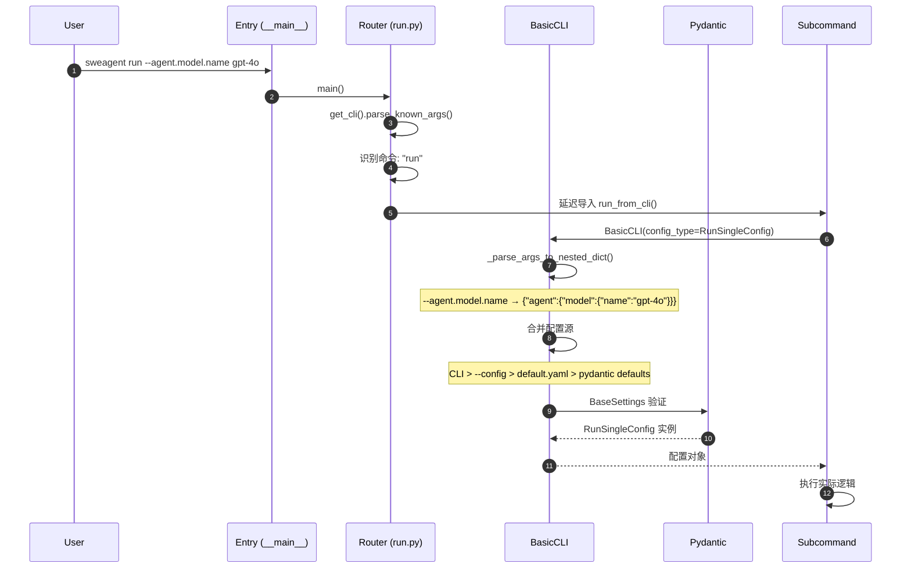
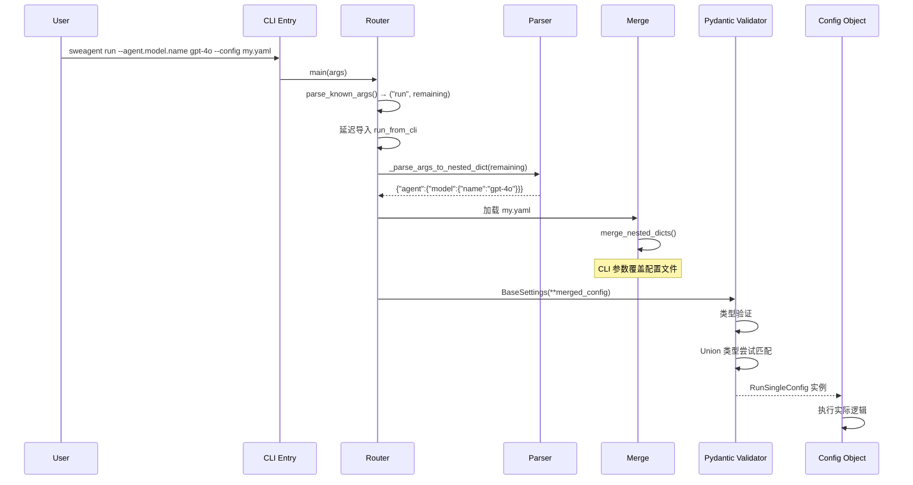

# CLI Entry（SWE-agent）

## TL;DR（结论先行）

SWE-agent 的 CLI Entry 采用"双层路由 + pydantic-settings 配置"设计：顶层使用 `argparse` 做命令分发，底层使用 `pydantic-settings` 做类型安全的配置解析，支持点号分隔的嵌套参数、多配置文件合并和环境变量覆盖。

SWE-agent 的核心取舍：**simple_parsing 库 + 嵌套字典配置**（对比 Codex 的 clap 派生、Kimi CLI 的 argparse 子命令）

---

## 1. 为什么需要这个机制？（解决什么问题）

### 1.1 问题场景

Code Agent 需要处理复杂的配置：
- 模型参数（名称、温度、token 限制）
- 工具配置（Bundle 路径、过滤规则）
- 环境配置（容器镜像、工作目录）
- 运行参数（输出目录、并行度）

没有统一配置管理：
- 参数分散在多个地方
- 类型不安全，容易出错
- 难以验证和提供有意义的错误提示

### 1.2 核心挑战

| 挑战 | 不解决的后果 |
|-----|-------------|
| 配置层级深 | 命令行参数冗长，难以使用 |
| 多配置文件 | 合并逻辑复杂，优先级混乱 |
| 类型验证 | 运行时错误，难以调试 |
| 环境变量 | 与命令行参数不一致 |
| 帮助信息 | 用户不知道有哪些选项 |

---

## 2. 整体架构（ASCII 图）

### 2.1 在系统中的位置

```text
┌─────────────────────────────────────────────────────────────┐
│ 用户命令行输入                                               │
│ sweagent run --agent.model.name gpt-4o ...                  │
└───────────────────────┬─────────────────────────────────────┘
                        │ 解析
                        ▼
┌─────────────────────────────────────────────────────────────┐
│ ▓▓▓ CLI Router ▓▓▓                                          │
│ sweagent/run/run.py                                         │
│ - get_cli(): 创建 ArgumentParser                            │
│ - main(): 命令分发                                          │
└───────────────────────┬─────────────────────────────────────┘
                        │ 分发
        ┌───────────────┼───────────────┐
        ▼               ▼               ▼
┌──────────────┐ ┌──────────────┐ ┌──────────────┐
│ run_single   │ │ run_batch    │ │ inspector    │
│ 单实例运行   │ │ 批量运行     │ │ 轨迹查看器   │
└──────────────┘ └──────────────┘ └──────────────┘
                        │
                        ▼
┌─────────────────────────────────────────────────────────────┐
│ ▓▓▓ Configuration Layer ▓▓▓                                 │
│ sweagent/run/common.py                                      │
│ - BasicCLI: 配置解析基类                                    │
│ - _parse_args_to_nested_dict(): 点号参数解析                │
│ - pydantic-settings: 类型验证                               │
└─────────────────────────────────────────────────────────────┘
```

### 2.2 核心组件职责

| 组件 | 职责 | 代码位置 |
|-----|------|---------|
| `get_cli()` | 创建 ArgumentParser，定义子命令 | `sweagent/run/run.py:37` |
| `main()` | 命令分发，延迟导入 | `sweagent/run/run.py:70` |
| `BasicCLI` | 配置解析基类 | `sweagent/run/common.py:187` |
| `_parse_args_to_nested_dict()` | 点号分隔参数解析 | `sweagent/run/common.py:149` |
| `RunSingleConfig` | 单运行配置 | `sweagent/run/run_single.py` |
| `RunBatchConfig` | 批量运行配置 | `sweagent/run/run_batch.py` |

### 2.3 核心组件交互关系



**关键交互说明**：

| 步骤 | 交互内容 | 设计意图 |
|-----|---------|---------|
| 1-3 | 用户输入，入口解析命令 | 快速识别子命令，延迟加载 |
| 4-5 | 点号参数解析为嵌套字典 | 支持直观的层级参数 |
| 6 | 多源配置合并 | 灵活的覆盖机制 |
| 7 | pydantic 类型验证 | 早期错误发现 |

---

## 3. 核心组件详细分析

### 3.1 命令路由层

#### 职责定位

命令路由层负责识别用户输入的子命令，并分发到对应的处理模块。

#### 命令列表

```python
# sweagent/run/run.py:37-67
def get_cli():
    parser = argparse.ArgumentParser(add_help=False)
    parser.add_argument(
        "command",
        choices=[
            "run", "r",              # 单实例运行
            "run-batch", "b",        # 批量运行
            "run-replay",            # 重放轨迹
            "traj-to-demo",          # 轨迹转演示
            "run-api",               # API 服务器
            "merge-preds",           # 合并预测
            "inspect", "i",          # TUI 查看器
            "inspector", "I",        # Web 查看器
            "extract-pred",          # 提取预测
            "compare-runs", "cr",    # 对比运行
            "remove-unfinished", "ru",  # 清理未完成
            "quick-stats", "qs",     # 快速统计
            "shell", "sh",           # 交互式 Shell
        ],
        nargs="?"
    )
```

**设计特点**：
- 支持命令别名（如 `r` = `run`）
- `nargs="?"` 允许无命令时显示帮助
- 延迟导入减少启动时间

---

### 3.2 配置解析层

#### 职责定位

配置解析层负责将多种配置源（命令行、配置文件、环境变量）合并为类型安全的配置对象。

#### 配置层级

```text
高优先级 ──────────────────────────────────────► 低优先级

命令行参数 ──► --config 文件 ──► default.yaml ──► pydantic 默认值
    │              │                │
    ▼              ▼                ▼
--agent.model   config.yaml    ~/.swe-agent/
   .name        (多个合并)     config/default.yaml
```

#### 点号参数解析

```python
# sweagent/run/common.py:149-183
def _parse_args_to_nested_dict(args):
    """Parse the command-line arguments into a nested dictionary."""
    result = _nested_dict()
    i = 0
    while i < len(args):
        arg = args[i]
        if not arg.startswith("--"):
            i += 1
            continue

        # 处理 --key=value 格式
        if "=" in arg:
            key, value = arg[2:].split("=", 1)
        # 处理 --key value 格式
        else:
            key = arg[2:]
            i += 1
            value = args[i]

        # 点号分隔转为嵌套结构
        keys = key.split(".")
        current = result
        for k in keys[:-1]:
            current = current[k]
        current[keys[-1]] = value
        i += 1
```

**解析示例**：

| 命令行输入 | 解析结果 |
|-----------|---------|
| `--agent.model.name gpt-4o` | `{"agent":{"model":{"name":"gpt-4o"}}}` |
| `--agent.model.temperature 0.0` | `{"agent":{"model":{"temperature":"0.0"}}}` |

---

### 3.3 pydantic-settings 集成

#### 内部数据流

```text
┌─────────────────────────────────────────────────────────────┐
│  输入层                                                      │
│  ├── 命令行参数 (点号格式)                                   │
│  ├── --config 文件 (YAML/JSON)                               │
│  ├── 环境变量 (SWE_AGENT_*)                                  │
│  └── pydantic 字段默认值                                     │
└──────────────────────────┬──────────────────────────────────┘
                           ▼
┌─────────────────────────────────────────────────────────────┐
│  合并层                                                      │
│  ├── _parse_args_to_nested_dict() 解析点号参数              │
│  ├── merge_nested_dicts() 合并多个配置源                    │
│  └── 环境变量解析 (pydantic-settings)                       │
└──────────────────────────┬──────────────────────────────────┘
                           ▼
┌─────────────────────────────────────────────────────────────┐
│  验证层                                                      │
│  ├── pydantic BaseSettings 类型验证                         │
│  ├── Union 类型尝试匹配                                     │
│  └── ValidationError 错误提示                               │
└──────────────────────────┬──────────────────────────────────┘
                           ▼
┌─────────────────────────────────────────────────────────────┐
│  输出层                                                      │
│  └── 类型安全的配置对象 (RunSingleConfig/RunBatchConfig)    │
└─────────────────────────────────────────────────────────────┘
```

---

## 4. 端到端数据流转

### 4.1 正常流程（详细版）



### 4.2 数据变换详情

| 阶段 | 输入 | 处理 | 输出 | 代码位置 |
|-----|------|------|------|---------|
| 命令解析 | 原始命令行 | argparse | (command, remaining_args) | `sweagent/run/run.py:70` |
| 参数解析 | remaining_args | _parse_args_to_nested_dict | 嵌套字典 | `sweagent/run/common.py:149` |
| 配置加载 | 配置文件路径 | yaml.safe_load | 配置字典 | `sweagent/run/common.py` |
| 配置合并 | 多个配置源 | merge_nested_dicts | 合并后字典 | `sweagent/run/common.py` |
| 类型验证 | 合并后字典 | pydantic BaseSettings | 配置对象 | `sweagent/run/common.py:187` |

---

## 5. 关键代码实现

### 5.1 核心数据结构

```python
# sweagent/run/common.py:187-200
class BasicCLI:
    def __init__(
        self,
        config_type: type[BaseSettings],
        *,
        default_settings: bool = True,
        help_text: str | None = None,
        default_config_file: Path = CONFIG_DIR / "default.yaml",
    ):
        self.config_type = config_type
        self.default_settings = default_settings
        self.help_text = help_text
        self.default_config_file = default_config_file
```

### 5.2 主链路代码

```python
# sweagent/run/run.py:70-147 (简化)
def main(args: list[str] | None = None):
    cli = get_cli()
    parsed_args, remaining_args = cli.parse_known_args(args)
    command = parsed_args.command

    # 延迟导入减少启动时间
    if command in ["run", "r"]:
        from sweagent.run.run_single import run_from_cli
        run_from_cli(remaining_args)
    elif command in ["run-batch", "b"]:
        from sweagent.run.run_batch import run_from_cli
        run_from_cli(remaining_args)
    # ... 其他命令
```

**代码要点**：
1. **延迟导入**：命令处理模块按需加载，减少启动时间
2. **剩余参数传递**：`remaining_args` 传给子命令解析器
3. **统一入口**：每个子命令提供 `run_from_cli` 函数

### 5.3 关键调用链

```text
__main__.py                      [sweagent/__main__.py:1]
  -> main()                      [sweagent/run/run.py:70]
    -> get_cli()                 [sweagent/run/run.py:37]
      -> parse_known_args()
    -> run_from_cli()            [sweagent/run/run_single.py]
      -> BasicCLI.__init__()     [sweagent/run/common.py:187]
        -> _parse_args_to_nested_dict() [sweagent/run/common.py:149]
        -> merge_nested_dicts()
        -> BaseSettings()        [pydantic]
```

---

## 6. 设计意图与 Trade-off

### 6.1 SWE-agent 的选择

| 维度 | SWE-agent 的选择 | 替代方案 | 取舍分析 |
|-----|-----------------|---------|---------|
| 解析库 | simple_parsing + pydantic | argparse 原生 | 类型安全，但依赖外部库 |
| 参数格式 | 点号分隔 | 连字符分隔 | 直观表达层级，但需自定义解析 |
| 配置合并 | 多源合并 | 单一配置 | 灵活，但优先级复杂 |
| 延迟加载 | 按需导入 | 全部导入 | 启动快，但首次命令慢 |
| 验证时机 | 启动时 | 运行时 | 早期错误发现，但启动慢 |

### 6.2 为什么这样设计？

**核心问题**：如何在 Python 中实现类型安全、用户友好的复杂配置管理？

**SWE-agent 的解决方案**：
- 代码依据：`sweagent/run/common.py:149-183`
- 设计意图：利用 pydantic 的类型验证能力，通过自定义解析器支持直观的点号参数
- 带来的好处：
  - 类型安全，配置错误早期发现
  - 用户友好的参数格式
  - 灵活的多源配置合并
- 付出的代价：
  - 依赖外部库（simple_parsing, pydantic-settings）
  - 点号解析需要自定义实现
  - 配置合并逻辑复杂

### 6.3 与其他项目的对比

| 项目 | 核心差异 | 适用场景 |
|-----|---------|---------|
| SWE-agent | simple_parsing + pydantic + 点号参数 | Python 项目，复杂配置 |
| Codex | Rust clap 派生宏 | Rust 项目，编译时验证 |
| Kimi CLI | argparse 子命令 | 简单配置，快速启动 |
| Gemini CLI | TypeScript yargs | Node.js 项目 |
| OpenCode | TypeScript commander | Node.js 项目 |

---

## 7. 边界情况与错误处理

### 7.1 终止条件

| 终止原因 | 触发条件 | 处理 |
|---------|---------|------|
| 无命令 | nargs="?" | 显示帮助信息 |
| 未知命令 | choices 不匹配 | argparse 错误提示 |
| 配置验证失败 | pydantic ValidationError | 显示详细错误信息 |
| Union 类型不匹配 | 所有类型尝试失败 | 显示所有尝试的错误 |

### 7.2 错误恢复策略

| 错误类型 | 处理策略 | 代码位置 |
|---------|---------|---------|
| 参数格式错误 | 友好提示，建议修正 | `sweagent/run/common.py` |
| 连字符 vs 下划线 | 自动检测并提示 | 错误处理逻辑 |
| 层级结构错误 | 显示正确路径 | 验证错误信息 |
| 配置文件不存在 | 使用默认值 | 配置加载逻辑 |

### 7.3 常见错误示例

```bash
# 错误：使用连字符
sweagent run --agent.model-name gpt-4o

# 正确：使用下划线和点号
sweagent run --agent.model.name gpt-4o

# 错误：层级缺失
sweagent run --model.name gpt-4o

# 正确：完整层级
sweagent run --agent.model.name gpt-4o
```

---

## 8. 关键代码索引

| 功能 | 文件 | 行号 | 说明 |
|-----|------|------|------|
| 入口 | `sweagent/__main__.py` | 1 | 主入口 |
| CLI 路由 | `sweagent/run/run.py` | 37 | get_cli() |
| 命令分发 | `sweagent/run/run.py` | 70 | main() |
| 配置基类 | `sweagent/run/common.py` | 187 | BasicCLI |
| 参数解析 | `sweagent/run/common.py` | 149 | _parse_args_to_nested_dict() |
| 单运行配置 | `sweagent/run/run_single.py` | - | RunSingleConfig |
| 批量运行配置 | `sweagent/run/run_batch.py` | - | RunBatchConfig |
| 默认配置 | `sweagent/config/default.yaml` | - | 默认配置 |

---

## 9. 延伸阅读

- 前置知识：`docs/swe-agent/01-swe-agent-overview.md`
- 相关机制：`docs/swe-agent/04-swe-agent-agent-loop.md`
- 深度分析：`docs/swe-agent/02-swe-agent-session-management.md`

---

*✅ Verified: 基于 sweagent/run/run.py、sweagent/run/common.py 等源码分析*
*基于版本：2026-02-08 | 最后更新：2026-02-24*
