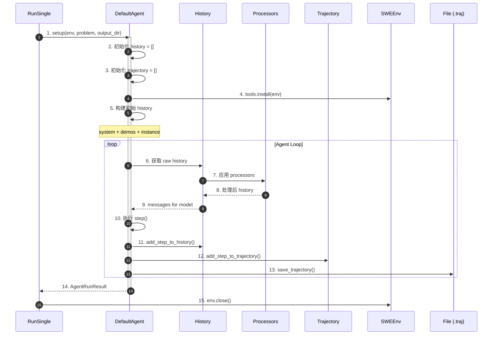
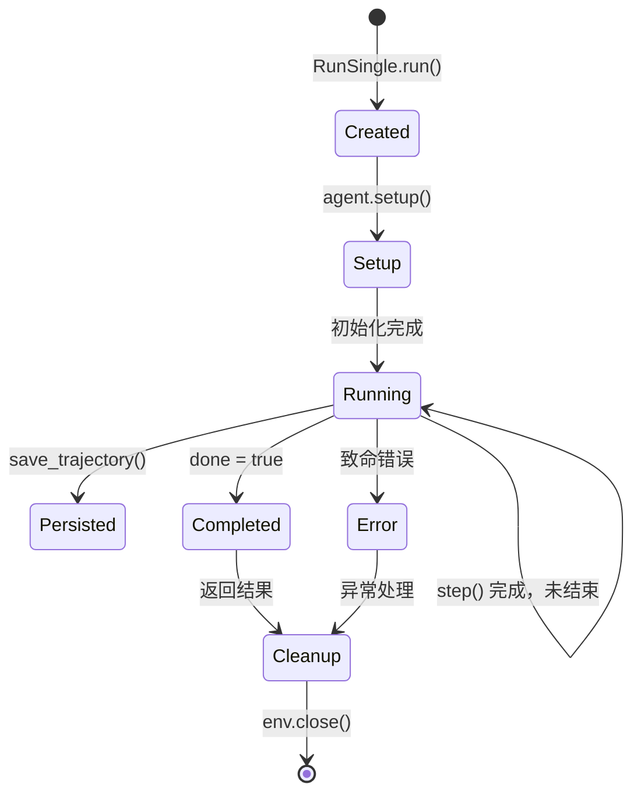
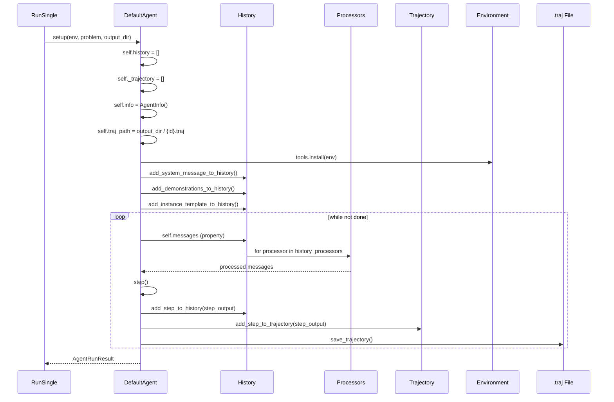
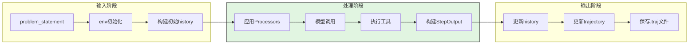
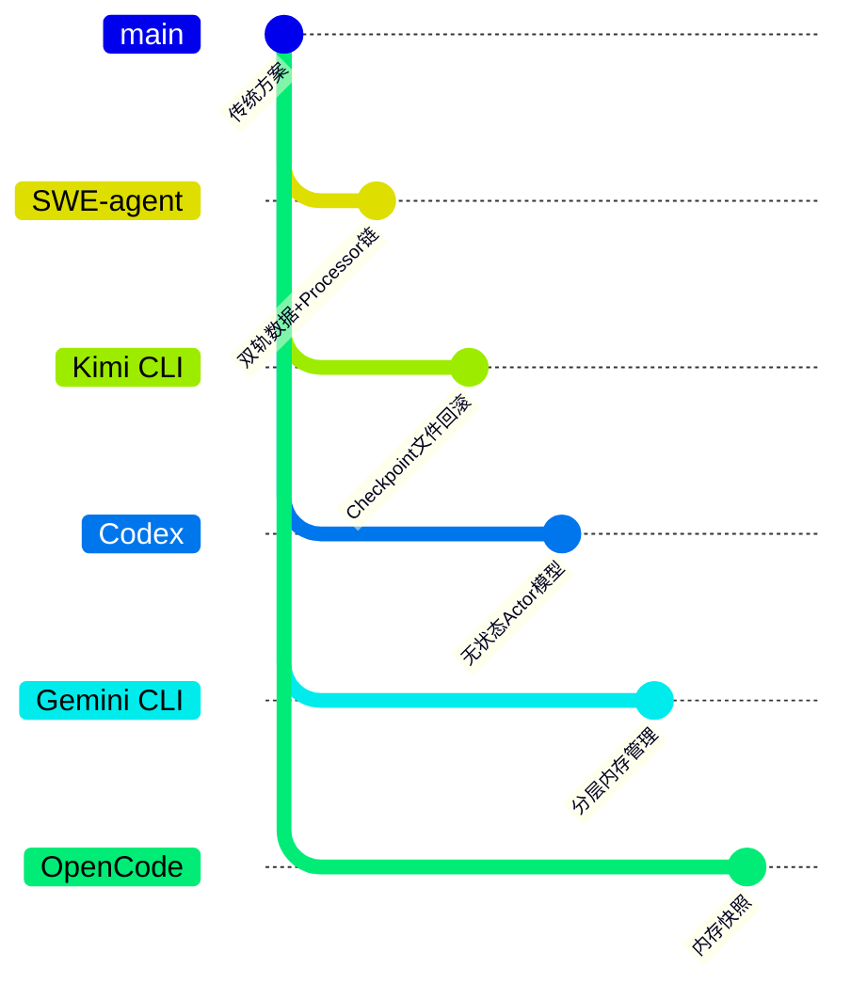

# Session Runtime（SWE-agent）

> **阅读指南**
>
> | 属性 | 说明 |
> |-----|------|
> | 预计阅读 | 15-20 分钟 |
> | 前置文档 | `docs/swe-agent/01-swe-agent-overview.md`、`docs/swe-agent/02-swe-agent-cli-entry.md` |
> | 文档结构 | 速览 → 架构 → 机制 → 实现 → 对比 |
> | 代码呈现 | 关键代码直接展示，完整代码可折叠查看 |

---

## TL;DR（结论先行）

SWE-agent 的 Session Runtime 采用"双轨数据结构 + Processor 链 + 频繁持久化"设计：Agent 同时维护 history（对话历史，用于模型输入）和 trajectory（执行轨迹，用于结构化持久化），通过可配置的 History Processor 链进行上下文压缩，每步执行后自动保存 checkpoint 到 `.traj` 文件。

SWE-agent 的核心取舍：**trajectory 为中心的有状态执行单元**（对比 Kimi CLI 的 Checkpoint 回滚、Codex 的无状态 Actor 模型）

### 核心要点速览

| 维度 | 关键决策 | 代码位置 |
|-----|---------|---------|
| 数据结构 | 双轨（history + trajectory） | `sweagent/agent/agents.py:481-483` |
| 上下文压缩 | Processor 链（可配置） | `sweagent/agent/history_processors.py` |
| 持久化策略 | 每步自动保存 | `sweagent/agent/agents.py:save_trajectory` |
| 状态恢复 | Trajectory 重放 | `sweagent/run/run_replay.py` |
| 批量隔离 | 独立进程 + 独立 output_dir | `sweagent/run/run_batch.py` |

---

## 1. 为什么需要这个机制？（解决什么问题）

### 1.1 问题场景

Code Agent 需要管理复杂的会话状态：
- 多轮对话历史（LLM 输入）
- 执行轨迹记录（用于分析和回放）
- 环境状态快照（文件、工作目录）
- 长时间运行的上下文管理

没有 Session 管理：
- 历史记录丢失，无法追溯
- 上下文超限导致模型调用失败
- 无法从断点恢复执行
- 无法复现和分析执行过程

### 1.2 核心挑战

| 挑战 | 不解决的后果 |
|-----|-------------|
| 上下文长度限制 | Token 超限，模型调用失败 |
| 历史记录管理 | 无法追溯执行过程 |
| 状态持久化 | 崩溃后丢失进度 |
| 环境状态同步 | 历史与环境实际状态不一致 |
| 批量执行隔离 | 多实例相互干扰 |

---

## 2. 整体架构（ASCII 图）

### 2.1 在系统中的位置

```text
┌─────────────────────────────────────────────────────────────┐
│ RunSingle / RunBatch                                        │
│ sweagent/run/run_single.py                                  │
└───────────────────────┬─────────────────────────────────────┘
                        │ 创建并管理
                        ▼
┌─────────────────────────────────────────────────────────────┐
│ ▓▓▓ Session ▓▓▓                                             │
│ sweagent/agent/agents.py:DefaultAgent                       │
│ - history: list[HistoryItem]                                │
│ - trajectory: list[TrajectoryStep]                          │
│ - info: AgentInfo                                           │
└───────────────────────┬─────────────────────────────────────┘
                        │ 依赖
        ┌───────────────┼───────────────┐
        ▼               ▼               ▼
┌──────────────┐ ┌──────────────┐ ┌──────────────┐
│ History      │ │ Trajectory   │ │ Environment  │
│ Processors   │ │ Persistence  │ │ State        │
└──────────────┘ └──────────────┘ └──────────────┘
```

### 2.2 核心组件职责

| 组件 | 职责 | 代码位置 |
|-----|------|---------|
| `DefaultAgent` | Session 主体，管理生命周期 | `sweagent/agent/agents.py:443` |
| `history` | 对话历史，用于模型输入 | `sweagent/agent/agents.py:481` |
| `trajectory` | 执行轨迹，用于持久化 | `sweagent/agent/agents.py:482` |
| `info` | Agent 元信息 | `sweagent/agent/agents.py:483` |
| `History Processors` | 历史记录变换链 | `sweagent/agent/history_processors.py` |
| `SWEEnv` | 环境状态管理 | `sweagent/environment/swe_env.py` |

### 2.3 核心组件交互关系



**关键交互说明**：

| 步骤 | 交互内容 | 设计意图 |
|-----|---------|---------|
| 1-5 | Session 初始化 | 一次性设置，后续复用 |
| 6-9 | History Processor 链 | 灵活压缩上下文 |
| 10-13 | 每步更新和持久化 | 支持断点续传 |
| 14-15 | 清理 | 资源释放 |

---

## 3. 核心组件详细分析

### 3.1 双轨数据结构

#### 职责定位

SWE-agent 同时维护两套数据结构：history 用于模型输入，trajectory 用于结构化持久化。

#### 数据结构对比

```text
┌────────────────────────────────────────────────────────────────────┐
│ [A] History - 对话历史（用于模型输入）                               │
└────────────────────────────────────────────────────────────────────┘

History = list[HistoryItem]

HistoryItem {
  role: "system" | "user" | "assistant" | "tool"
  content: str | list[dict]           # 消息内容
  message_type: "thought" | "action" | "observation"
  agent: str                          # 代理名称
  is_demo: bool                       # 是否为演示数据
  thought: str                       # 推理内容
  action: str | None                 # 执行动作
  tool_calls: list[dict] | None     # 工具调用
  tags: list[str]                    # 处理器标签
  cache_control: dict | None         # Anthropic 缓存控制
}

┌────────────────────────────────────────────────────────────────────┐
│ [B] Trajectory - 执行轨迹（用于持久化）                              │
└────────────────────────────────────────────────────────────────────┘

Trajectory = list[TrajectoryStep]

TrajectoryStep {
  action: str                        # 执行的动作
  observation: str                   # 观察结果
  response: str                      # 模型响应
  state: dict[str, str]             # 环境状态快照
  thought: str                       # 推理过程
  execution_time: float              # 执行时间
  query: list[dict[str, Any]]       # 查询内容
  extra_info: dict[str, Any]         # 额外信息
}
```

**设计意图**：
- **history**：符合 OpenAI/Anthropic API 格式，直接用于模型调用
- **trajectory**：包含完整执行信息，便于分析和回放

---

### 3.2 History Processor 链

#### 职责定位

通过可配置的 Processor 链对 history 进行变换，实现上下文压缩和优化。

#### 内部数据流

```text
Raw History          Processors              Model Input
    │                    │                        │
    ▼                    ▼                        ▼
┌─────────────┐    ┌─────────────────┐    ┌─────────────────┐
│ 完整历史    │───▶│ LastNObservations│───▶│ 处理后历史      │
│ (所有消息)  │    │ (保留最近N条)    │    │ (用于模型输入)  │
└─────────────┘    ├─────────────────┤    └─────────────────┘
                   │ CacheControl    │
                   │ (添加缓存标记)  │
                   ├─────────────────┤
                   │ RemoveRegex     │
                   │ (移除特定内容)  │
                   ├─────────────────┤
                   │ ClosedWindow    │
                   │ (替换文件窗口)  │
                   └─────────────────┘
```

#### 核心 Processor 实现

```python
# sweagent/agent/history_processors.py:86-120
class LastNObservations(BaseModel):
    """只保留最近的 N 个 observations，其余用摘要替代"""
    n: int                           # 保留的 observation 数量
    polling: int = 1                # 更新间隔
    always_remove_output_for_tags: set[str] = {"remove_output"}
    always_keep_output_for_tags: set[str] = {"keep_output"}

    def __call__(self, history: History) -> History:
        new_history = []
        omit_content_idxs = self._get_omit_indices(history)

        for idx, entry in enumerate(history):
            tags = set(entry.get("tags", []))

            if (idx not in omit_content_idxs or
                tags & self.always_keep_output_for_tags) and not (
                tags & self.always_remove_output_for_tags
            ):
                new_history.append(entry)
            else:
                # 替换为摘要
                num_text_lines, num_images = _get_content_stats(entry)
                entry["content"] = f"Old environment output: ({num_text_lines} lines omitted)"
                new_history.append(entry)

        return new_history
```

---

### 3.3 Session 生命周期

#### 状态机图



**状态说明**：

| 状态 | 说明 | 进入条件 | 退出条件 |
|-----|------|---------|---------|
| Created | 创建阶段 | RunSingle 创建 Agent | 调用 setup() |
| Setup | 初始化阶段 | setup() 开始 | 工具安装完成，初始 history 构建完成 |
| Running | 执行中 | 初始化完成 | step_output.done = true |
| Persisted | 已持久化 | 每步 save_trajectory() | 继续下一步 |
| Completed | 完成 | 任务完成 | 进入 Cleanup |
| Error | 错误 | 发生致命错误 | 进入 Cleanup |
| Cleanup | 清理 | 执行结束 | 资源释放完成 |

---

## 4. 端到端数据流转

### 4.1 正常流程（详细版）



### 4.2 数据变换详情

| 阶段 | 输入 | 处理 | 输出 | 代码位置 |
|-----|------|------|------|---------|
| Session 创建 | problem_statement, env, output_dir | 初始化数据结构 | Agent 实例 | `sweagent/agent/agents.py:561` |
| 初始 History | system + demos + instance | 构建消息列表 | history[] | `sweagent/agent/agents.py:561-580` |
| History 处理 | raw history | Processors 链 | processed messages | `sweagent/agent/agents.py:540` |
| Step 执行 | model response | 解析+执行 | StepOutput | `sweagent/agent/agents.py:800` |
| History 更新 | StepOutput | 添加到 history | 更新后 history | `sweagent/agent/agents.py:556` |
| Trajectory 更新 | StepOutput | 构建 TrajectoryStep | 更新后 trajectory | `sweagent/agent/agents.py:300` |
| 持久化 | trajectory + history + info | JSON 序列化 | .traj 文件 | `sweagent/agent/agents.py:save_trajectory` |

### 4.3 数据流向图



---

## 5. 关键代码实现

### 5.1 核心数据结构

```python
# sweagent/types.py:44-77
class HistoryItem(TypedDict):
    """对话历史项"""
    role: str                          # system/user/assistant/tool
    content: str | list[dict]
    message_type: Literal["thought", "action", "observation"]
    agent: str                         # 代理名称
    is_demo: bool                      # 是否为演示数据
    thought: str                       # 推理内容
    action: str | None                 # 执行动作
    tool_calls: list[dict] | None     # 工具调用
    tags: list[str]                    # 处理器标签
    cache_control: dict | None         # Anthropic 缓存控制

class TrajectoryStep(TypedDict):
    """轨迹步骤"""
    action: str                        # 执行的动作
    observation: str                   # 观察结果
    response: str                      # 模型响应
    state: dict[str, str]             # 环境状态
    thought: str                       # 推理过程
    execution_time: float              # 执行时间
    query: list[dict[str, Any]]       # 查询内容
    extra_info: dict[str, Any]         # 额外信息
```

### 5.2 主链路代码

**关键代码**（核心逻辑）：

```python
# sweagent/agent/agents.py:561-580
def setup(self, env: SWEEnv, problem_statement: ProblemStatement, output_dir: Path):
    """Session 初始化：双轨数据结构 + 环境准备"""
    self._problem_statement = problem_statement
    self._env = env
    self.traj_path = output_dir / (self._problem_statement.id + ".traj")

    # 1. 重置状态集合
    self.info = AgentInfo()
    self.history = []
    self._trajectory = []

    # 2. 初始化环境
    self.tools.install(self._env)

    # 3. 构建初始 history
    self.add_system_message_to_history()
    self.add_demonstrations_to_history()
    self.add_instance_template_to_history(state=self.tools.get_state(self._env))
```

**设计意图**：
1. **双轨初始化**：同时初始化 history 和 trajectory
2. **路径设置**：trajectory 文件路径基于 problem id
3. **环境准备**：工具安装和初始状态获取
4. **历史构建**：系统消息 + 演示 + 实例模板

<details>
<summary>查看完整实现（含异常处理）</summary>

```python
# sweagent/agent/agents.py:561-580
def setup(self, env: SWEEnv, problem_statement: ProblemStatement, output_dir: Path):
    """Initialize a new session"""
    self._problem_statement = problem_statement
    self._env = env
    self.traj_path = output_dir / (self._problem_statement.id + ".traj")

    # 重置状态集合
    self.info = AgentInfo()
    self.history = []
    self._trajectory = []

    # 初始化环境
    self.tools.install(self._env)

    # 构建初始 history
    self.add_system_message_to_history()
    self.add_demonstrations_to_history()
    self.add_instance_template_to_history(state=self.tools.get_state(self._env))
```

</details>

### 5.3 关键调用链

```text
RunSingle.run()                    [sweagent/run/run_single.py]
  -> agent.setup()                 [sweagent/agent/agents.py:561]
    -> 初始化 history/trajectory   [sweagent/agent/agents.py:572-574]
    -> tools.install(env)          [sweagent/tools/tools.py]
    -> add_system_message()        [sweagent/agent/agents.py]
    -> add_demonstrations()        [sweagent/agent/agents.py]
    -> add_instance_template()     [sweagent/agent/agents.py]
  -> while not done:
    -> step()                      [sweagent/agent/agents.py:800]
      -> self.messages (property)   [sweagent/agent/agents.py:540]
        -> apply history_processors [sweagent/agent/history_processors.py]
      -> add_step_to_history()      [sweagent/agent/agents.py:556]
      -> add_step_to_trajectory()   [sweagent/agent/agents.py:300]
      -> save_trajectory()          [sweagent/agent/agents.py]
```

---

## 6. 设计意图与 Trade-off

### 6.1 SWE-agent 的选择

| 维度 | SWE-agent 的选择 | 替代方案 | 取舍分析 |
|-----|-----------------|---------|---------|
| 数据结构 | 双轨（history + trajectory） | 单一结构 | 兼顾模型输入和持久化需求，但增加复杂度 |
| 上下文压缩 | Processor 链 | 固定截断 | 灵活可配置，但配置复杂 |
| 持久化频率 | 每步保存 | 结束时保存 | 支持断点续传，但 I/O 开销 |
| 状态恢复 | Trajectory 重放 | Checkpoint 回滚 | 可人工检查，但无法自动恢复 |
| 批量隔离 | 独立进程/容器 | 共享环境 | 完全隔离，但资源开销大 |

### 6.2 为什么这样设计？

**核心问题**：如何在长运行的 Code Agent 任务中管理状态、控制上下文长度、支持分析和回放？

**SWE-agent 的解决方案**：
- 代码依据：`sweagent/agent/agents.py:481-483`
- 设计意图：通过双轨数据结构分离模型输入和持久化需求，通过 Processor 链灵活压缩上下文，通过频繁持久化支持断点续传
- 带来的好处：
  - 灵活的上下文管理
  - 完整的执行记录
  - 支持断点续传和回放
- 付出的代价：
  - 数据结构复杂
  - I/O 开销
  - 状态无法自动回滚

### 6.3 与其他项目的对比



| 项目 | 核心差异 | 适用场景 |
|-----|---------|---------|
| SWE-agent | 双轨数据 + Processor 链 + 频繁持久化 | 学术研究、可复现实验 |
| Kimi CLI | Checkpoint 文件回滚 | 对话回滚、状态恢复 |
| Codex | 无状态 Actor 模型 | 高并发、无状态服务 |
| Gemini CLI | 分层内存管理 | 长上下文任务 |
| OpenCode | 内存快照 | 快速状态保存 |

---

## 7. 边界情况与错误处理

### 7.1 终止条件

| 终止原因 | 触发条件 | 代码位置 |
|---------|---------|---------|
| 任务完成 | 执行 submit 命令 | `sweagent/agent/agents.py:handle_submission` |
| 最大步数 | 达到 max_iterations | `sweagent/agent/agents.py:step` |
| 环境崩溃 | runtime 异常 | `sweagent/environment/swe_env.py` |
| 用户中断 | KeyboardInterrupt | RunSingle 处理 |

### 7.2 错误恢复策略

| 错误类型 | 处理策略 | 代码位置 |
|---------|---------|---------|
| History 过长 | Processor 压缩 | `sweagent/agent/history_processors.py` |
| Trajectory 未保存 | 检查 traj_path | `sweagent/agent/agents.py:save_trajectory` |
| Session 状态不一致 | 检查 history vs trajectory | 调试逻辑 |
| Environment 泄漏 | finally 块中 env.close() | `sweagent/run/run_single.py` |
| 多实例冲突 | 独立 output_dir | `sweagent/run/run_batch.py` |

### 7.3 资源限制

```python
# 上下文长度控制
class LastNObservations:
    n: int = 5  # 默认保留最近 5 个 observations

# 轨迹文件大小
# 每步 trajectory 约 1-10KB
# 100 步任务约 100KB-1MB
```

---

## 8. 关键代码索引

| 功能 | 文件 | 行号 | 说明 |
|-----|------|------|------|
| Session 初始化 | `sweagent/agent/agents.py` | 561 | setup() |
| History 定义 | `sweagent/types.py` | 44 | HistoryItem |
| Trajectory 定义 | `sweagent/types.py` | 120 | TrajectoryStep |
| History Processors | `sweagent/agent/history_processors.py` | - | 处理器链 |
| LastNObservations | `sweagent/agent/history_processors.py` | 86 | 上下文压缩 |
| CacheControl | `sweagent/agent/history_processors.py` | 200 | 缓存控制 |
| 添加 History | `sweagent/agent/agents.py` | 556 | add_step_to_history() |
| 添加 Trajectory | `sweagent/agent/agents.py` | 300 | add_step_to_trajectory() |
| 持久化 | `sweagent/agent/agents.py` | - | save_trajectory() |
| 批量 Session | `sweagent/run/run_batch.py` | - | RunBatch |
| Hook 系统 | `sweagent/agent/hooks/abstract.py` | - | AbstractAgentHook |

---

## 9. 延伸阅读

- 前置知识：`docs/swe-agent/01-swe-agent-overview.md`、`docs/swe-agent/02-swe-agent-cli-entry.md`
- 相关机制：`docs/swe-agent/04-swe-agent-agent-loop.md`、`docs/swe-agent/07-swe-agent-memory-context.md`
- 深度分析：`docs/swe-agent/questions/swe-agent-checkpoint-implementation.md`

---

*✅ Verified: 基于 sweagent/agent/agents.py、sweagent/agent/history_processors.py 等源码分析*
*基于版本：2026-02-08 | 最后更新：2026-03-03*
