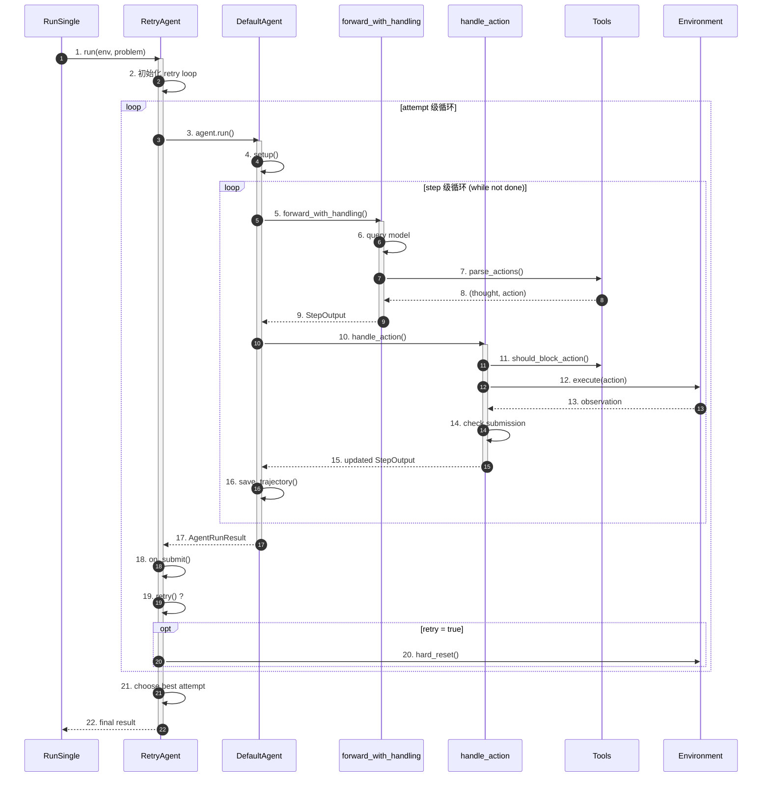
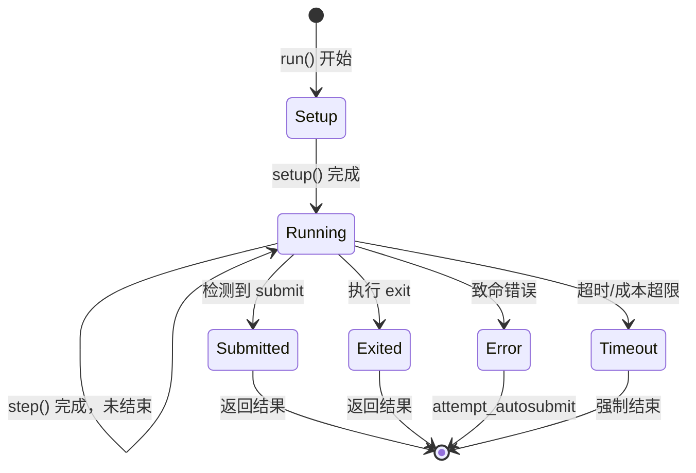
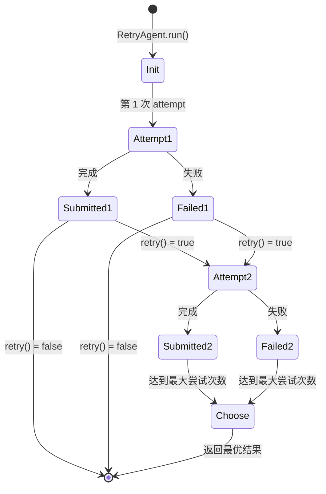
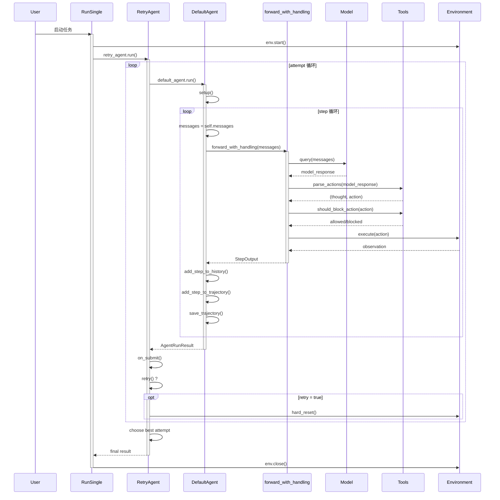
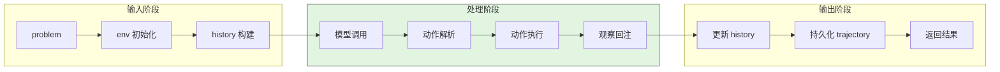
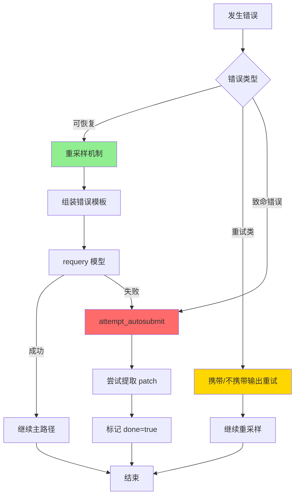
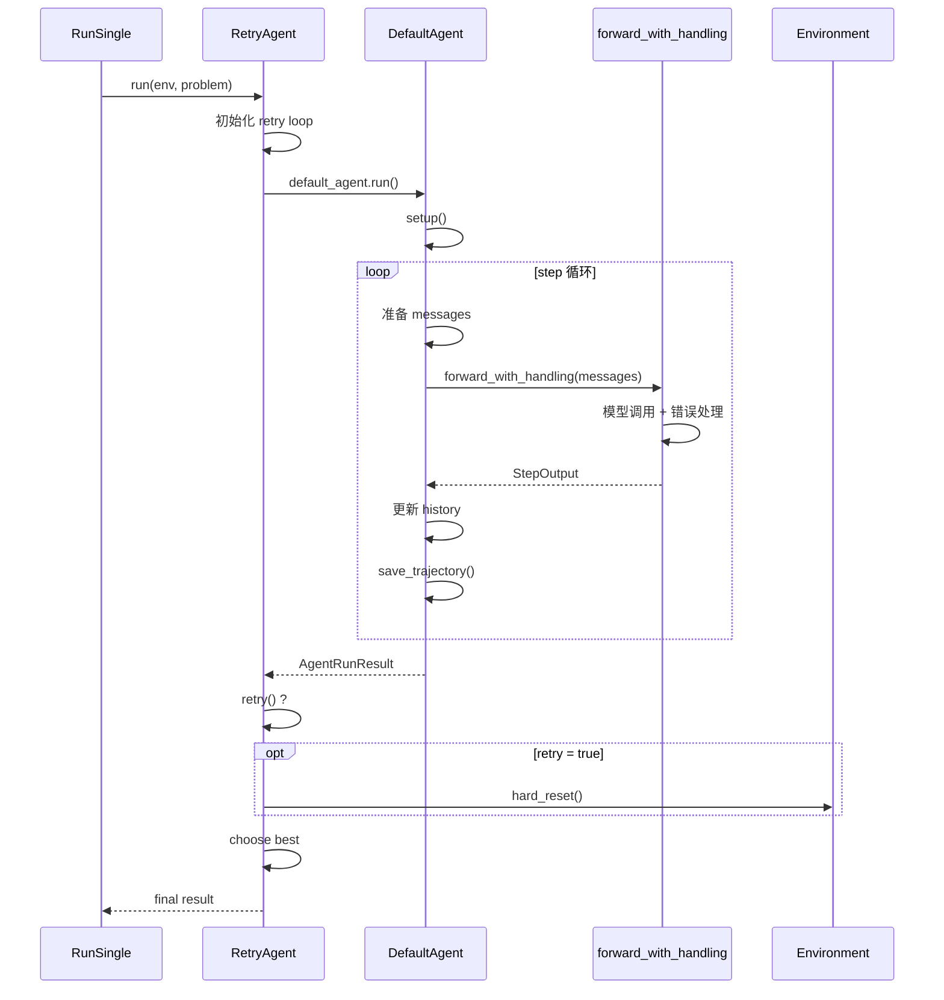
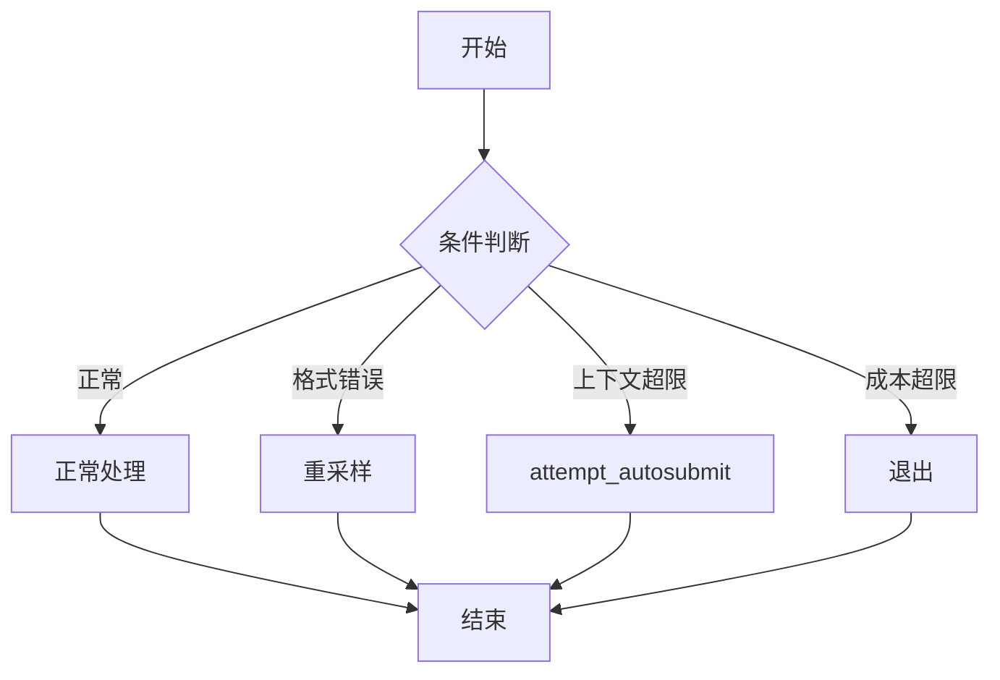
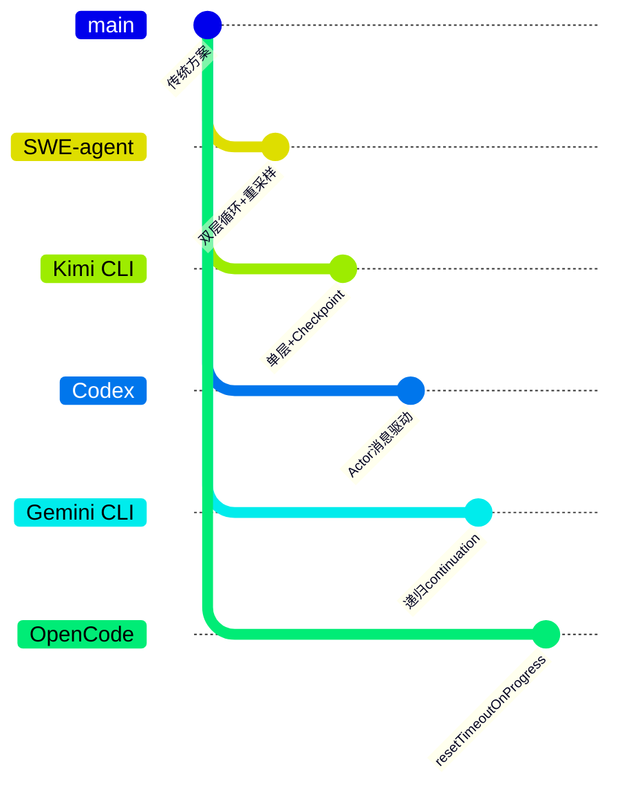

# Agent Loop（SWE-agent）

> **阅读指南**
>
> | 属性 | 说明 |
> |-----|------|
> | 预计阅读 | 20-25 分钟 |
> | 前置文档 | `docs/swe-agent/01-swe-agent-overview.md`、`docs/swe-agent/03-swe-agent-session-runtime.md` |
> | 文档结构 | 速览 → 架构 → 机制 → 实现 → 对比 |
> | 代码呈现 | 关键代码直接展示，完整代码可折叠查看 |

---

## TL;DR（结论先行）

一句话定义：Agent Loop 是 Code Agent 的控制核心，让 LLM 从"一次性回答"变成"多轮执行"。

SWE-agent 的核心取舍：**双层循环 + 错误重采样 + attempt 级重试**（对比 Kimi CLI 的单层 while 循环、Gemini CLI 的递归 continuation、Codex 的 Actor 消息驱动）

### 核心要点速览

| 维度 | 关键决策 | 代码位置 |
|-----|---------|---------|
| 循环结构 | 双层循环（外层 attempt + 内层 step） | `sweagent/agent/agents.py:257,400` |
| 错误恢复 | forward_with_handling 重采样机制 | `sweagent/agent/agents.py:700` |
| 重试策略 | attempt 级重试 + 结果选优 | `sweagent/agent/agents.py:257` |
| 环境重置 | hard_reset() 完全重置 | `sweagent/environment/swe_env.py` |
| 提交机制 | submit 命令显式检测 | `sweagent/agent/agents.py` |

---

## 1. 为什么需要这个机制？（解决什么问题）

### 1.1 问题场景

Code Agent 需要处理复杂的软件工程任务，面临以下挑战：
- 模型输出格式错误（无法解析为有效动作）
- 工具执行失败（命令语法错误、被拦截）
- 单次尝试无法完成任务（需要多次尝试）
- 环境状态污染（失败后需要重置）
- 结果质量不确定（无法保证最优输出）

没有完善的 Loop 机制：
- 一次格式错误导致整个任务失败
- 无法从错误中恢复
- 失败后无法重试
- 无法选择最优结果

### 1.2 核心挑战

| 挑战 | 不解决的后果 |
|-----|-------------|
| 模型输出格式错误 | 任务中断，无法继续 |
| 工具执行失败 | 无法完成操作 |
| 单次尝试失败 | 整体任务失败 |
| 环境状态污染 | 后续步骤基于错误状态 |
| 结果质量不确定 | 无法保证最优输出 |

---

## 2. 整体架构（ASCII 图）

### 2.1 在系统中的位置

```text
┌─────────────────────────────────────────────────────────────┐
│ RunSingle / RunBatch                                        │
│ sweagent/run/run_single.py                                  │
└───────────────────────┬─────────────────────────────────────┘
                        │ 调用
                        ▼
┌─────────────────────────────────────────────────────────────┐
│ ▓▓▓ Agent Loop (双层) ▓▓▓                                   │
│ sweagent/agent/agents.py                                    │
│                                                             │
│ ┌─────────────────────────────────────────────────────────┐ │
│ │ 外层: RetryAgent.run()                                  │ │
│ │ - attempt 级重试循环                                    │ │
│ │ - review/choose 最优结果                                │ │
│ └───────────────────────┬─────────────────────────────────┘ │
│                         │ 调用                              │
│                         ▼                                   │
│ ┌─────────────────────────────────────────────────────────┐ │
│ │ 内层: DefaultAgent.run()                                │ │
│ │ - step 级执行循环                                       │ │
│ │ - 模型调用 + 工具执行                                   │ │
│ └───────────────────────┬─────────────────────────────────┘ │
└───────────────────────┬─────────────────────────────────────┘
                        │ 依赖
        ┌───────────────┼───────────────┐
        ▼               ▼               ▼
┌──────────────┐ ┌──────────────┐ ┌──────────────┐
│ Model        │ │ Tools        │ │ Environment  │
│ 模型调用     │ │ 工具执行     │ │ 沙箱环境     │
└──────────────┘ └──────────────┘ └──────────────┘
```

### 2.2 核心组件职责

| 组件 | 职责 | 代码位置 |
|-----|------|---------|
| `RetryAgent` | 外层重试循环，管理多次 attempt | `sweagent/agent/agents.py:257` |
| `DefaultAgent` | 内层执行循环，单 attempt 管理 | `sweagent/agent/agents.py:443` |
| `step()` | 单步编排：模型调用+工具执行 | `sweagent/agent/agents.py:800` |
| `forward_with_handling()` | 模型调用+错误重采样 | `sweagent/agent/agents.py:700` |
| `handle_action()` | 动作执行+提交检测 | `sweagent/agent/agents.py:750` |

### 2.3 核心组件交互关系



**关键交互说明**：

| 步骤 | 交互内容 | 设计意图 |
|-----|---------|---------|
| 1-3 | 外层循环启动内层 Agent | 分离重试逻辑和执行逻辑 |
| 5-9 | 模型调用与错误重采样 | 自动恢复格式错误 |
| 10-15 | 动作执行与提交检测 | 统一执行入口，检测任务完成 |
| 16 | 每步持久化 | 支持断点续传 |
| 18-21 | 重试决策和选优 | 支持多次尝试，选择最优结果 |

---

## 3. 核心组件详细分析

### 3.1 内层循环：DefaultAgent

#### 职责定位

DefaultAgent 负责单个 attempt 的执行，管理 step 级的模型调用和工具执行。

#### 状态机图



**状态说明**：

| 状态 | 说明 | 进入条件 | 退出条件 |
|-----|------|---------|---------|
| Setup | 初始化 | run() 被调用 | 工具安装完成，history 初始化完成 |
| Running | 执行中 | 初始化完成 | step_output.done = true |
| Submitted | 已提交 | 检测到 submit 命令 | 自动退出 |
| Exited | 已退出 | 执行 exit 命令 | 自动退出 |
| Error | 错误状态 | 发生致命错误 | autosubmit 后退出 |
| Timeout | 超时状态 | 达到时间/成本限制 | 强制退出 |

#### 内部数据流

```text
┌─────────────────────────────────────────────────────────────┐
│  输入层                                                      │
│  ├── messages: 经 processors 处理后的 history                │
│  └── state: 环境状态快照                                     │
└──────────────────────────┬──────────────────────────────────┘
                           ▼
┌─────────────────────────────────────────────────────────────┐
│  处理层                                                      │
│  ├── forward_with_handling()                                │
│  │   ├── query model                                        │
│  │   ├── parse_actions() ──► (thought, action)             │
│  │   └── 错误处理 + 重采样                                  │
│  ├── handle_action()                                        │
│  │   ├── should_block_action() ──► 检查拦截                │
│  │   ├── env.execute() ──► observation                     │
│  │   └── check submission                                   │
│  └── 构建 StepOutput                                        │
└──────────────────────────┬──────────────────────────────────┘
                           ▼
┌─────────────────────────────────────────────────────────────┐
│  输出层                                                      │
│  ├── 更新 history                                           │
│  ├── 更新 trajectory                                        │
│  ├── save_trajectory()                                      │
│  └── 返回 StepOutput                                        │
└─────────────────────────────────────────────────────────────┘
```

---

### 3.2 错误重采样：forward_with_handling

#### 职责定位

`forward_with_handling()` 是 SWE-agent Loop 的"韧性核心"，在 `max_requeries` 范围内自动恢复可重采样错误。

#### 错误分类处理

```text
                       ┌─────────────────┐
                       │    forward()    │ ◄── 调用模型
                       └────────┬────────┘
                                │
              ┌─────────────────┼─────────────────┐
              ▼                 ▼                 ▼
    ┌─────────────────┐ ┌───────────────┐ ┌─────────────────────┐
    │   可重采样错误   │ │  重试类异常    │ │    致命错误          │
    ├─────────────────┤ ├───────────────┤ ├─────────────────────┤
    │ • FormatError   │ │ _RetryWithOutput│ │ • context overflow │
    │ • BlockedAction │ │ _RetryWithout   │ │ • cost limit       │
    │ • BashSyntax    │ │   Output        │ │ • runtime error    │
    │ • ContentPolicy │ │                 │ │ • env error        │
    └────────┬────────┘ └───────┬───────┘ └──────────┬──────────┘
             │                  │                    │
             ▼                  ▼                    ▼
    ┌─────────────────┐ ┌───────────────┐ ┌─────────────────────┐
    │ 组装错误模板    │ │ 携带/不携带   │ │ attempt_autosub()   │
    │ requery 模型    │ │ 上一步输出    │ │                     │
    │ (max_requeries) │ │               │ │ • 尝试提取 patch    │
    │                 │ │ 继续重采样    │ │ • done = true       │
    │ 仍失败?         │ │               │ │ • exit_status 标记  │
    │ exit_format +   │ │               │ │                     │
    │ autosubmit      │ │               │ │                     │
    └─────────────────┘ └───────────────┘ └─────────────────────┘
```

#### 关键算法逻辑

```python
# sweagent/agent/agents.py:700-750
def forward_with_handling(self, messages: list[dict]) -> StepOutput:
    """模型调用 + 错误重采样：在 max_requeries 范围内自动恢复"""
    for attempt in range(self.config.max_requeries):
        try:
            # 1. 调用模型
            model_response = self.model.query(messages)

            # 2. 解析动作
            thought, action = self.tools.parse_actions(model_response)

            # 3. 执行动作
            return self.handle_action(thought, action, model_response)

        except FormatError as e:
            # 4. 格式错误：组装错误模板，requery
            messages = self._add_error_template(messages, e)
            continue

        except BlockedActionError as e:
            # 5. 被拦截动作：requery
            messages = self._add_error_template(messages, e)
            continue

        except ContextWindowExceededError:
            # 6. 上下文超限：致命错误
            return self.attempt_autosubmit_after_error()

    # 7. 重采样耗尽：exit_format + autosubmit
    return self._exit_format_and_autosubmit()
```

**算法要点**：
1. **分层错误处理**：可重采样错误、重试类异常、致命错误
2. **错误模板注入**：将错误信息反馈给模型，请求修正
3. **上限控制**：`max_requeries` 防止无限循环
4. **兜底策略**：重采样耗尽后尝试 autosubmit

---

### 3.3 外层循环：RetryAgent

#### 职责定位

RetryAgent 在 DefaultAgent 外再套一层 attempt loop，支持失败后重置环境重新尝试，并选择最优结果。

#### 状态机图



**状态说明**：

| 状态 | 说明 | 进入条件 | 退出条件 |
|-----|------|---------|---------|
| Init | 初始化 | RetryAgent.run() 被调用 | 开始第 1 次 attempt |
| AttemptN | 第 N 次尝试 | 初始化完成或前一次结束 | 完成或失败 |
| SubmittedN | 第 N 次提交 | 检测到 submit | retry() 决策 |
| FailedN | 第 N 次失败 | 发生错误 | retry() 决策 |
| Choose | 选优 | 达到最大尝试次数或不再重试 | 返回最优结果 |

---

### 3.4 组件间协作时序

展示多个组件如何协作完成一个复杂操作。



**协作要点**：

1. **调用方与 RetryAgent**：RunSingle 调用 RetryAgent，分离任务调度与执行
2. **RetryAgent 与 DefaultAgent**：外层管理 attempt 生命周期，内层管理 step 执行
3. **DefaultAgent 与外部服务**：通过 forward_with_handling 统一处理模型调用和错误恢复

---

### 3.5 关键数据路径

#### 主路径（正常流程）



#### 异常路径（错误恢复）



---

## 4. 端到端数据流转

### 4.1 正常流程（详细版）

展示数据如何从输入到输出的完整变换过程。



### 4.2 数据变换详情

| 阶段 | 输入 | 处理 | 输出 | 代码位置 |
|-----|------|------|------|---------|
| 外层启动 | problem, env | RetryAgent 初始化 | RetryAgent 实例 | `sweagent/agent/agents.py:257` |
| 内层启动 | env, problem | DefaultAgent.setup() | 初始化完成 | `sweagent/agent/agents.py:561` |
| 模型调用 | messages | model.query() | model_response | `sweagent/agent/models.py` |
| 动作解析 | model_response | parse_actions() | (thought, action) | `sweagent/tools/parsing.py` |
| 错误处理 | 异常 | forward_with_handling() | StepOutput/重试 | `sweagent/agent/agents.py:700` |
| 动作执行 | action | handle_action() | observation | `sweagent/agent/agents.py:750` |
| 提交检测 | observation | check submission | done=true? | `sweagent/agent/agents.py` |
| 重试决策 | AgentRunResult | retry() | 是否重试 | `sweagent/agent/agents.py` |
| 选优 | 多次结果 | choose() | 最优结果 | `sweagent/agent/agents.py` |

### 4.3 异常/边界流程



---

## 5. 关键代码实现

### 5.1 核心数据结构

```python
# sweagent/types.py
class StepOutput(BaseModel):
    """单步输出"""
    thought: str
    action: str
    observation: str
    output: str
    done: bool
    exit_status: int | str | None
    submission: str | None
    state: dict[str, str]

class AgentInfo(BaseModel):
    """Agent 元信息"""
    exit_status: str | None = None
    submission: str | None = None
    model_stats: InstanceStats
```

**字段说明**：

| 字段 | 类型 | 用途 |
|-----|------|------|
| `thought` | `str` | 模型思考过程 |
| `action` | `str` | 模型生成的动作 |
| `observation` | `str` | 工具执行结果 |
| `done` | `bool` | 是否完成任务 |
| `exit_status` | `int \| str \| None` | 退出状态码 |
| `submission` | `str \| None` | 最终提交的答案 |

### 5.2 主链路代码

**关键代码**（核心逻辑）：

```python
# sweagent/agent/agents.py:400-434
def run(self, env: SWEEnv, problem_statement: ProblemStatement, output_dir: Path) -> AgentRunResult:
    """主循环入口：简洁的 while 循环驱动多轮执行"""
    # 1. 初始化 Session
    self.setup(env, problem_statement, output_dir)
    self._chook.on_run_start()

    # 2. 核心 Agent Loop
    step_output = None
    while not step_output or not step_output.done:
        step_output = self.step()           # 执行单步
        self.save_trajectory()              # 每步持久化

    # 3. 完成处理
    self._chook.on_run_done(trajectory=self.trajectory, info=self.info)
    return AgentRunResult(info=self.info, trajectory=self.trajectory)
```

**设计意图**：
1. **简洁的主循环**：setup -> while not done -> step -> save
2. **Hook 系统**：在关键节点触发回调
3. **即时持久化**：每步保存 trajectory
4. **结果封装**：返回完整的 AgentRunResult

<details>
<summary>查看完整实现（含异常处理、日志等）</summary>

```python
# sweagent/agent/agents.py:400-434
def run(self, env: SWEEnv, problem_statement: ProblemStatement, output_dir: Path) -> AgentRunResult:
    """Run the agent on a problem statement"""
    self.setup(env, problem_statement, output_dir)
    self._chook.on_run_start()

    step_output = None
    while not step_output or not step_output.done:
        step_output = self.step()
        self.save_trajectory()

    self._chook.on_run_done(trajectory=self.trajectory, info=self.info)
    return AgentRunResult(info=self.info, trajectory=self.trajectory)
```

</details>

### 5.3 关键调用链

```text
RunSingle.run()                    [sweagent/run/run_single.py]
  -> RetryAgent.run()              [sweagent/agent/agents.py:257]
    -> retry loop
      -> DefaultAgent.run()        [sweagent/agent/agents.py:400]
        -> setup()                 [sweagent/agent/agents.py:561]
        -> while not done:
          -> step()                [sweagent/agent/agents.py:800]
            -> forward_with_handling() [sweagent/agent/agents.py:700]
              -> model.query()     [sweagent/agent/models.py]
              -> parse_actions()   [sweagent/tools/parsing.py]
              -> handle_action()   [sweagent/agent/agents.py:750]
                -> tools.execute() [sweagent/tools/tools.py]
                  -> env.communicate() [sweagent/environment/swe_env.py]
            -> add_step_to_history()   [sweagent/agent/agents.py:556]
            -> add_step_to_trajectory() [sweagent/agent/agents.py:300]
            -> save_trajectory()   [sweagent/agent/agents.py]
      -> on_submit()
      -> retry() ?
        -> hard_reset()            [sweagent/environment/swe_env.py]
    -> choose best attempt
```

---

## 6. 设计意图与 Trade-off

### 6.1 SWE-agent 的选择

| 维度 | SWE-agent 的选择 | 替代方案 | 取舍分析 |
|-----|-----------------|---------|---------|
| 循环结构 | 双层循环（step + attempt） | 单层循环（Kimi CLI） | 支持失败后重试，但复杂度增加 |
| 错误恢复 | 重采样（requery） | 直接失败（Codex） | 自动恢复格式错误，但增加调用次数 |
| 重试策略 | attempt 级重试 + 选优 | 无重试 | 提高成功率，但成本增加 |
| 环境重置 | hard_reset() | 无重置 | 状态干净，但启动慢 |
| 提交机制 | submit 命令检测 | 自动检测 | 显式控制，但需要模型配合 |

### 6.2 为什么这样设计？

**核心问题**：如何在软件工程任务中实现可靠、可恢复的自动化执行？

**SWE-agent 的解决方案**：
- 代码依据：`sweagent/agent/agents.py:700-750`
- 设计意图：通过双层循环分离"单次尝试推进"和"多次尝试选优"，通过 `forward_with_handling` 实现自动错误恢复
- 带来的好处：
  - 自动恢复常见错误（格式错误、被拦截动作）
  - 支持失败后重试，提高成功率
  - 选择最优结果，提高输出质量
- 付出的代价：
  - 架构复杂度增加
  - 模型调用次数增加
  - Docker 重置开销

### 6.3 与其他项目的对比



| 项目 | 核心差异 | 适用场景 |
|-----|---------|---------|
| SWE-agent | 双层循环 + 错误重采样 + attempt 重试 | 软件工程任务、需要高可靠性 |
| Kimi CLI | 单层 while + Checkpoint 回滚 | 对话式交互、状态恢复 |
| Codex | Actor 消息驱动 + 无状态 | 高并发、企业级部署 |
| Gemini CLI | 递归 continuation + 分层内存 | 复杂任务、长上下文 |
| OpenCode | resetTimeoutOnProgress | 长运行任务、超时控制 |

---

## 7. 边界情况与错误处理

### 7.1 终止条件

| 终止原因 | 触发条件 | 代码位置 |
|---------|---------|---------|
| 正常提交 | 执行 submit 命令 | `sweagent/agent/agents.py:handle_submission` |
| 退出命令 | 执行 exit 命令 | `sweagent/agent/agents.py:handle_action` |
| 最大步数 | 达到 max_iterations | `sweagent/agent/agents.py:step` |
| 重采样耗尽 | 超过 max_requeries | `sweagent/agent/agents.py:forward_with_handling` |
| 成本超限 | 达到 cost_limit | `sweagent/agent/models.py` |
| 上下文超限 | 超过 token 限制 | `sweagent/agent/agents.py:forward_with_handling` |
| 超时 | 达到 total_execution_timeout | `sweagent/agent/agents.py` |
| 环境错误 | runtime 崩溃 | `sweagent/environment/swe_env.py` |

### 7.2 超时/资源限制

```python
# 关键配置参数
class AgentConfig:
    max_iterations: int = 100  # 单 attempt 最大步数
    max_requeries: int = 3     # 最大重采样次数
    total_execution_timeout: int = 3600  # 总执行超时（秒）

class ModelConfig:
    per_instance_cost_limit: float = 3.0  # 单次成本限制（美元）
```

### 7.3 错误恢复策略

| 错误类型 | 处理策略 | 代码位置 |
|---------|---------|---------|
| FormatError | requery（最多 max_requeries 次） | `sweagent/agent/agents.py:forward_with_handling` |
| BlockedActionError | requery + 错误提示 | `sweagent/agent/agents.py:forward_with_handling` |
| BashIncorrectSyntaxError | requery + 语法检查 | `sweagent/agent/agents.py:forward_with_handling` |
| ContentPolicyViolationError | requery | `sweagent/agent/agents.py:forward_with_handling` |
| ContextWindowExceededError | attempt_autosubmit | `sweagent/agent/agents.py:forward_with_handling` |
| CostLimitExceededError | 退出 | `sweagent/agent/models.py` |
| Timeout | 标记并继续或退出 | `sweagent/tools/tools.py` |
| 环境崩溃 | attempt_autosubmit | `sweagent/agent/agents.py` |

---

## 8. 关键代码索引

| 功能 | 文件 | 行号 | 说明 |
|-----|------|------|------|
| RetryAgent | `sweagent/agent/agents.py` | 257 | 外层重试循环 |
| DefaultAgent | `sweagent/agent/agents.py` | 443 | 内层执行循环 |
| Agent Loop | `sweagent/agent/agents.py` | 400-434 | run() 主循环 |
| Step | `sweagent/agent/agents.py` | 800 | 单步执行 |
| forward_with_handling | `sweagent/agent/agents.py` | 700 | 模型调用+错误处理 |
| handle_action | `sweagent/agent/agents.py` | 750 | 动作执行 |
| StepOutput | `sweagent/types.py` | - | 单步输出类型 |
| AgentInfo | `sweagent/types.py` | - | Agent 元信息 |
| ParseError | `sweagent/agent/agents.py` | - | 解析错误处理 |

---

## 9. 延伸阅读

- 前置知识：`docs/swe-agent/01-swe-agent-overview.md`、`docs/swe-agent/02-swe-agent-cli-entry.md`
- 相关机制：`docs/swe-agent/05-swe-agent-tools-system.md`、`docs/swe-agent/03-swe-agent-session-runtime.md`
- 深度分析：`docs/swe-agent/questions/swe-agent-error-handling.md`

---

*✅ Verified: 基于 sweagent/agent/agents.py 源码分析*
*基于版本：2026-02-08 | 最后更新：2026-03-03*
