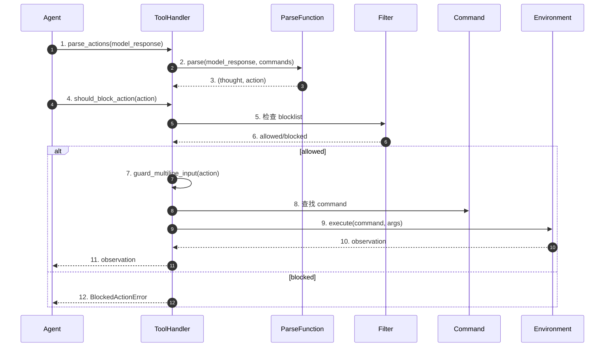
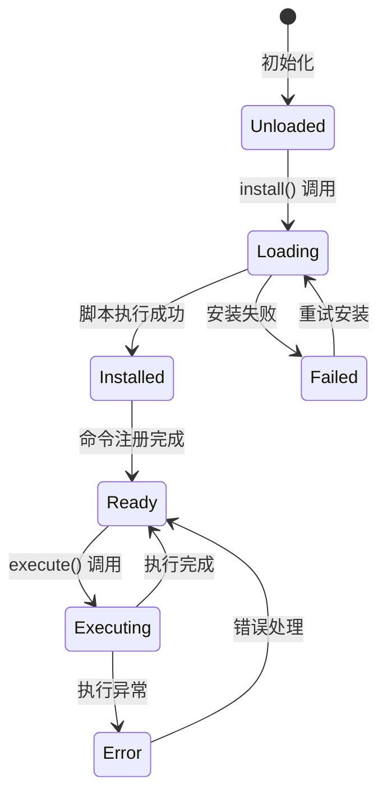
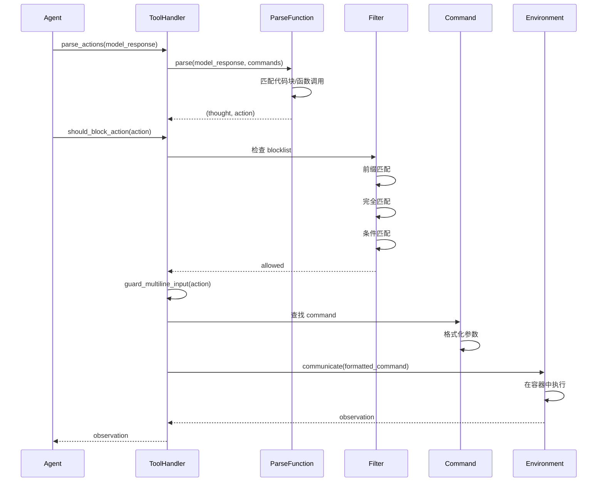
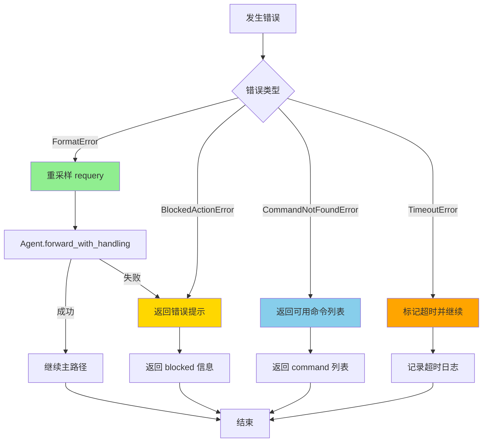
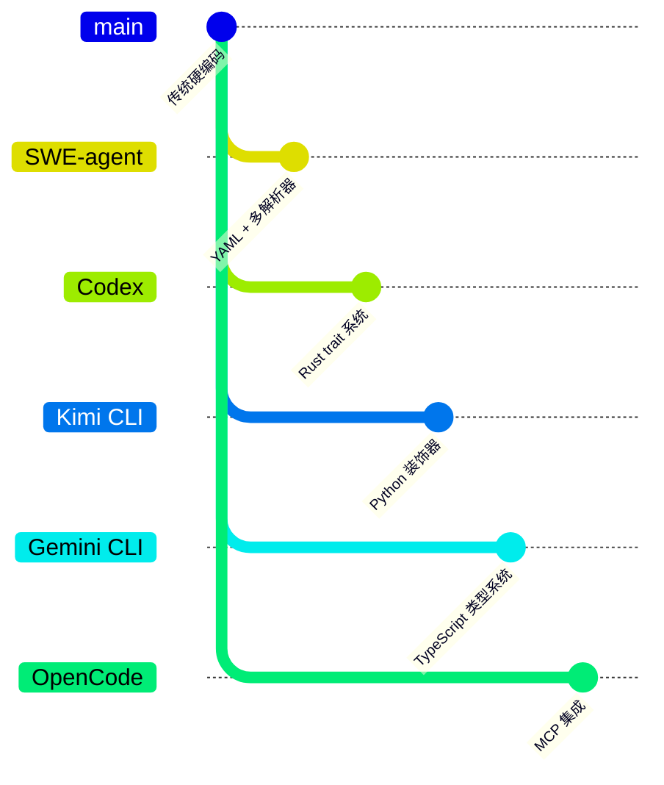

# Tool System（SWE-agent）

> 📋 **阅读指南**
>
> | 属性 | 说明 |
> |-----|------|
> | 预计阅读 | 20-25 分钟 |
> | 前置文档 | `01-swe-agent-overview.md`、`04-swe-agent-agent-loop.md` |
> | 文档结构 | 速览 → 架构 → 机制 → 实现 → 对比 |
> | 代码呈现 | 关键代码直接展示，完整代码可折叠查看 |

---

## TL;DR（结论先行）

SWE-agent 的工具系统采用"Bundle 配置驱动 + Command 抽象 + 多解析器适配"架构：工具按 Bundle 组织并通过 YAML 配置定义，Command 抽象统一描述命令签名和参数，多种 ParseFunction 适配不同模型的输出格式（Function Calling、Thought-Action、JSON 等）。

SWE-agent 的核心取舍：**YAML 配置 + 多解析器策略模式**（对比 Codex 的 Rust trait 系统、Kimi CLI 的 Python 装饰器注册、Gemini CLI 的 TypeScript 类型系统）

### 核心要点速览

| 维度 | 关键决策 | 代码位置 |
|-----|---------|---------|
| 工具定义 | YAML 配置驱动，Bundle 模块化组织 | `sweagent/tools/tools.py:75` |
| 命令抽象 | Command 类统一描述签名和参数 | `sweagent/tools/commands.py:100` |
| 解析策略 | 策略模式支持 7 种解析器 | `sweagent/tools/parsing.py:1` |
| 安全过滤 | 三层 blocklist 机制 | `sweagent/tools/tools.py:370` |
| 执行方式 | 本地函数调用 + Docker 隔离 | `sweagent/tools/tools.py:312` |

---

## 1. 为什么需要这个机制？（解决什么问题）

### 1.1 问题场景

Code Agent 需要执行各种操作来修改代码、运行测试、搜索文件等：
- 文件操作（打开、编辑、查看）
- 命令执行（bash、git）
- 搜索操作（文本搜索、文件查找）
- 环境交互（获取状态、重置）

没有统一的工具系统：
- 工具定义分散，难以管理
- 不同模型需要不同的输出格式
- 工具执行缺乏统一的安全控制
- 难以扩展新工具

### 1.2 核心挑战

| 挑战 | 不解决的后果 |
|-----|-------------|
| 工具定义分散 | 难以维护和版本控制 |
| 模型输出格式差异 | 无法适配不同模型 |
| 安全风险 | 危险命令被执行 |
| 扩展性 | 添加新工具困难 |
| 环境隔离 | 工具执行影响宿主系统 |

---

## 2. 整体架构（ASCII 图）

### 2.1 在系统中的位置

```text
┌─────────────────────────────────────────────────────────────┐
│ Agent Loop                                                  │
│ sweagent/agent/agents.py:800                                │
└───────────────────────┬─────────────────────────────────────┘
                        │ 调用
                        ▼
┌─────────────────────────────────────────────────────────────┐
│ ▓▓▓ Tool System ▓▓▓                                         │
│ sweagent/tools/                                             │
│                                                             │
│ ┌─────────────────────────────────────────────────────────┐ │
│ │ ToolHandler                                               │ │
│ │ - install(env): 安装工具到环境                           │ │
│ │ - parse_actions(): 解析模型输出                          │ │
│ │ - should_block_action(): 安全检查                        │ │
│ │ - execute(): 执行工具                                    │ │
│ └───────────────────────┬─────────────────────────────────┘ │
└───────────────────────┬─────────────────────────────────────┘
                        │ 依赖
        ┌───────────────┼───────────────┐
        ▼               ▼               ▼
┌──────────────┐ ┌──────────────┐ ┌──────────────┐
│ Bundle       │ │ ParseFunction│ │ Environment  │
│ 工具包       │ │ 输出解析器   │ │ 执行环境     │
│ config.yaml  │ │ 7种策略      │ │ SWEEnv       │
└──────────────┘ └──────────────┘ └──────────────┘
```

### 2.2 核心组件职责

| 组件 | 职责 | 代码位置 |
|-----|------|---------|
| `ToolHandler` | 工具生命周期管理 | `sweagent/tools/tools.py:200` |
| `Bundle` | 工具包组织 | `sweagent/tools/tools.py:150` |
| `Command` | 命令抽象定义 | `sweagent/tools/commands.py:100` |
| `ParseFunction` | 模型输出解析 | `sweagent/tools/parsing.py:50` |
| `ToolFilterConfig` | 安全过滤配置 | `sweagent/tools/tools.py:370` |

### 2.3 核心组件交互关系



**关键交互说明**：

| 步骤 | 交互内容 | 设计意图 |
|-----|---------|---------|
| 1-3 | 解析模型输出为动作 | 适配不同模型格式 |
| 4-6 | 安全检查 | 防止危险命令执行 |
| 7-11 | 执行工具 | 统一执行入口 |
| 12 | 阻止动作 | 安全控制 |

---

## 3. 核心组件详细分析

### 3.1 Bundle 系统

#### 职责定位

Bundle 是工具的模块化组织单位，通过 YAML 配置定义工具集，便于复用和版本控制。

#### 状态机图



**状态说明**：

| 状态 | 说明 | 进入条件 | 退出条件 |
|-----|------|---------|---------|
| Unloaded | 未加载 | 初始化 | 调用 install() |
| Loading | 安装中 | 开始安装 | 安装完成/失败 |
| Installed | 已安装 | 脚本执行成功 | 开始注册命令 |
| Ready | 就绪 | 命令注册完成 | 执行调用 |
| Executing | 执行中 | 收到执行请求 | 执行完成 |
| Failed | 失败 | 安装失败 | 重试或终止 |

#### 目录结构

```text
SWE-agent/tools/
├── registry/            # 注册表工具
├── windowed/            # 窗口化文件操作
│   ├── config.yaml      # 工具定义配置
│   ├── bin/             # 可执行脚本
│   │   ├── open
│   │   ├── view
│   │   └── goto
│   └── install.sh       # 安装脚本 (可选)
└── web_browser/         # Web 浏览器自动化
```

#### Bundle 配置示例

```yaml
# tools/windowed/config.yaml
tools:
  open:
    docstring: Open a file in the windowed editor
    signature: "open <path>"
    arguments:
      - name: path
        type: string
        description: Path to the file to open
        required: true

  view:
    docstring: View the current window content
    signature: "view"
    arguments: []

  goto:
    docstring: Go to a specific line
    signature: "goto <line_number>"
    arguments:
      - name: line_number
        type: integer
        description: Line number to navigate to
        required: true

state_command: "state"  # 获取环境状态的命令
```

---

### 3.2 Command 抽象

#### 职责定位

Command 是对工具的抽象定义，统一描述命令的签名、参数和文档。

#### 内部数据流

```text
┌─────────────────────────────────────────────────────────────┐
│  输入层                                                      │
│  ├── name: 命令名称                                          │
│  ├── docstring: 功能描述                                     │
│  ├── signature: 调用签名                                     │
│  └── arguments: 参数列表                                     │
└──────────────────────────┬──────────────────────────────────┘
                           ▼
┌─────────────────────────────────────────────────────────────┐
│  处理层                                                      │
│  ├── invoke_format: 生成调用格式字符串                       │
│  ├── get_function_calling_tool(): 转换为 OpenAI 格式        │
│  └── 参数验证和格式化                                        │
└──────────────────────────┬──────────────────────────────────┘
                           ▼
┌─────────────────────────────────────────────────────────────┐
│  输出层                                                      │
│  ├── 执行命令字符串                                          │
│  └── OpenAI Function Calling 格式                            │
└─────────────────────────────────────────────────────────────┘
```

#### 核心实现

```python
# sweagent/tools/commands.py:100-140
class Command(BaseModel):
    name: str                          # 命令名称
    docstring: str | None             # 功能描述
    signature: str | None             # 调用签名
    end_name: str | None              # 多行结束标记
    arguments: list[Argument] = []    # 参数定义

    @cached_property
    def invoke_format(self) -> str:
        """生成命令调用格式字符串"""
        if self.signature:
            return re.sub(rf"\[<?({ARGUMENT_NAME_PATTERN})>\]?", r"{\1}", self.signature)
        else:
            return f"{self.name} " + " ".join(f"{{{arg.name}}}" for arg in self.arguments)

    def get_function_calling_tool(self) -> dict:
        """转换为 OpenAI Function Calling 格式"""
        tool = {
            "type": "function",
            "function": {
                "name": self.name,
                "description": self.docstring or "",
            },
        }
        # ... 参数转换
        return tool
```

---

### 3.3 ParseFunction：多解析器支持

#### 职责定位

ParseFunction 负责将模型输出解析为可执行的动作，支持多种格式以适应不同模型能力。

#### 解析器类型

| 解析器 | 类型 | 适用场景 | 输出格式 |
|--------|------|----------|----------|
| `FunctionCallingParser` | function_calling | 支持工具的模型 | OpenAI function calling |
| `ThoughtActionParser` | thought_action | 通用模型 | 思考 + ```代码块 |
| `XMLThoughtActionParser` | xml_thought_action | XML 友好模型 | 思考 + <command> |
| `XMLFunctionCallingParser` | xml_function_calling | XML 工具调用 | <function> + <parameter> |
| `JsonParser` | json | JSON 友好模型 | {"thought": "...", "command": {...}} |
| `ActionParser` | action | 简单场景 | 单条命令 |
| `BashCodeBlockParser` | all_bash_code_blocks | Bash 专用 | ```bash 代码块 |

#### 解析器接口

```python
# sweagent/tools/parsing.py:50-80
class AbstractParseFunction(ABC):
    error_message: str

    @abstractmethod
    def __call__(self, model_response, commands: list[Command], strict=False) -> tuple[str, str]:
        """解析模型输出
        Returns: (thought, action)
        """
        raise NotImplementedError
```

#### ThoughtActionParser 实现

```python
# sweagent/tools/parsing.py:200-230
class ThoughtActionParser(AbstractParseFunction, BaseModel):
    type: Literal["thought_action"] = "thought_action"

    def __call__(self, model_response: dict, commands: list[Command], strict=False):
        """解析思考-行动格式
        Example:
            Let's look at the files.

            ```
            ls -l
            ```
        """
        code_block_pat = re.compile(r"^```(\S*)\s*\n|^```\s*$", re.MULTILINE)
        stack = []
        last_valid_block = None

        # 匹配代码块 (支持嵌套)
        for match in code_block_pat.finditer(model_response["message"]):
            if stack and not match.group(1):  # 结束代码块
                start = stack.pop()
                if not stack:  # 不在嵌套中
                    last_valid_block = (start, match)
            elif match.group(1) is not None:  # 开始代码块
                stack.append(match)

        if last_valid_block:
            start, end = last_valid_block
            thought = model_response["message"][:start.start()] + model_response["message"][end.end():]
            action = model_response["message"][start.end():end.start()]
            return thought.strip(), action.strip()

        raise FormatError("No action found in model response")
```

---

### 3.4 安全过滤

#### 职责定位

ToolFilterConfig 提供三层安全过滤机制，防止危险命令执行。

#### 过滤机制

```text
                    ┌─────────────────┐
                    │  action 输入    │
                    └────────┬────────┘
                             │
                             ▼
            ┌────────────────────────────────┐
            │      前缀匹配 blocklist        │
            │  vim, vi, emacs, nano, ...     │
            └───────────────┬────────────────┘
                            │
              ┌─────────────┴─────────────┐
              ▼                           ▼
         命中阻止                      未命中
              │                           │
              ▼                           ▼
    ┌─────────────────┐      ┌──────────────────────────┐
    │  返回 blocked   │      │   完全匹配 blocklist     │
    │                 │      │   python, bash, sh, ...  │
    └─────────────────┘      └───────────┬──────────────┘
                                         │
                           ┌─────────────┴─────────────┐
                           ▼                           ▼
                      命中阻止                      未命中
                           │                           │
                           ▼                           ▼
                 ┌─────────────────┐      ┌──────────────────────────┐
                 │  返回 blocked   │      │  条件阻止 block_unless   │
                 │                 │      │  正则匹配才允许          │
                 └─────────────────┘      └───────────┬──────────────┘
                                                      │
                                        ┌─────────────┴─────────────┐
                                        ▼                           ▼
                                   命中阻止                      未命中
                                        │                           │
                                        ▼                           ▼
                              ┌─────────────────┐      ┌─────────────────┐
                              │  返回 blocked   │      │  返回 allowed   │
                              └─────────────────┘      └─────────────────┘
```

#### 配置示例

```python
# sweagent/tools/tools.py:370-390
class ToolFilterConfig(BaseModel):
    blocklist: list[str] = [      # 前缀匹配阻止
        "vim", "vi", "emacs", "nano",  # 交互式编辑器
        "nohup", "gdb", "less",        # 交互式工具
        "tail -f",                     # 持续输出
        "python -m venv", "make",      # 环境管理
    ]

    blocklist_standalone: list[str] = [  # 完全匹配阻止
        "python", "python3", "ipython",
        "bash", "sh", "/bin/bash",
        "vi", "vim", "emacs", "nano",
    ]

    block_unless_regex: dict[str, str] = {  # 条件阻止
        "radare2": r"\b(?:radare2)\b.*\s+-c\s+.*",
        "r2": r"\b(?:radare2)\b.*\s+-c\s+.*",
    }
```

---

## 4. 端到端数据流转

### 4.1 正常流程（详细版）



### 4.2 数据变换详情

| 阶段 | 输入 | 处理 | 输出 | 代码位置 |
|-----|------|------|------|---------|
| 模型输出 | model_response | ParseFunction | (thought, action) | `sweagent/tools/parsing.py:200` |
| 安全检查 | action | ToolFilterConfig | allowed/blocked | `sweagent/tools/tools.py:475` |
| 多行处理 | action | guard_multiline_input | 格式化后 action | `sweagent/tools/tools.py:501` |
| 命令查找 | action | Command 匹配 | Command 实例 | `sweagent/tools/tools.py:312` |
| 参数格式化 | Command + args | invoke_format | 执行字符串 | `sweagent/tools/commands.py:167` |
| 环境执行 | 执行字符串 | SWEEnv.communicate | observation | `sweagent/environment/swe_env.py:150` |

### 4.3 异常流程（错误恢复）



---

## 5. 关键代码实现

### 5.1 核心数据结构

```python
# sweagent/tools/commands.py:50-90
class Command(BaseModel):
    name: str                          # 命令名称
    docstring: str | None             # 功能描述
    signature: str | None             # 调用签名
    end_name: str | None              # 多行结束标记
    arguments: list[Argument] = []    # 参数定义

class Argument(BaseModel):
    name: str                    # 参数名
    type: str                    # 参数类型
    description: str             # 参数描述
    required: bool               # 是否必需
    enum: list[str] | None      # 枚举值
    argument_format: str = "{{value}}"  # Jinja2 格式模板

# sweagent/tools/tools.py:75-95
class ToolConfig(BaseModel):
    bundles: list[Bundle] = Field(default_factory=list)
    enable_bash_tool: bool = True
    filter: ToolFilterConfig = ToolFilterConfig()
    parse_function: ParseFunction = Field(default_factory=FunctionCallingParser)
    env_variables: dict[str, Any] = {}
    submit_command: str = "submit"
    execution_timeout: int = 30
```

**字段说明**：

| 字段 | 类型 | 用途 |
|-----|------|------|
| `name` | `str` | 命令唯一标识 |
| `signature` | `str | None` | 调用签名模板 |
| `arguments` | `list[Argument]` | 参数定义列表 |
| `parse_function` | `ParseFunction` | 模型输出解析策略 |
| `filter` | `ToolFilterConfig` | 安全过滤配置 |

### 5.2 主链路代码

**关键代码**（核心逻辑）：

```python
# sweagent/tools/tools.py:475-505
class ToolHandler:
    def should_block_action(self, action: str) -> bool:
        """检查命令是否应该被阻止 - 三层过滤机制"""
        action = action.strip()
        if not action:
            return False

        # 1. 前缀匹配阻止
        if any(action.startswith(f) for f in self.config.filter.blocklist):
            return True

        # 2. 完全匹配阻止
        if action in self.config.filter.blocklist_standalone:
            return True

        # 3. 条件阻止 - 正则匹配才允许
        name = action.split()[0]
        if name in self.config.filter.block_unless_regex:
            if not re.search(self.config.filter.block_unless_regex[name], action):
                return True

        return False
```

**设计意图**：
1. **三层过滤**：前缀匹配、完全匹配、条件匹配，层层递进
2. **性能优先**：前缀匹配 O(1)，避免不必要的正则计算
3. **灵活配置**：通过 YAML 配置调整安全策略

<details>
<summary>📋 查看完整实现</summary>

```python
# sweagent/tools/tools.py:200-260
class ToolHandler:
    def __init__(self, config: ToolConfig):
        self.config = config.model_copy(deep=True)
        self._reset_commands = []
        self._command_patterns = self._get_command_patterns()

    def parse_actions(self, output: str) -> tuple[str, str]:
        """解析模型输出为 (thought, action)"""
        return self.config.parse_function.parse(output, self.commands)

    def should_block_action(self, action: str) -> bool:
        """检查命令是否应该被阻止"""
        action = action.strip()
        if not action:
            return False

        # 前缀匹配阻止
        if any(action.startswith(f) for f in self.config.filter.blocklist):
            return True

        # 完全匹配阻止
        if action in self.config.filter.blocklist_standalone:
            return True

        # 条件阻止
        name = action.split()[0]
        if name in self.config.filter.block_unless_regex:
            if not re.search(self.config.filter.block_unless_regex[name], action):
                return True

        return False

    def execute(self, action: str, env: SWEEnv) -> str:
        """执行动作，返回 observation"""
        command, args = self._parse_action(action)
        return self._run_command(command, args, env)
```

</details>

### 5.3 关键调用链

```text
Agent.step()                       [sweagent/agent/agents.py:800]
  -> tools.parse_actions()          [sweagent/tools/tools.py:220]
    -> parse_function.parse()       [sweagent/tools/parsing.py:50]
      -> FunctionCallingParser      [sweagent/tools/parsing.py:150]
      -> ThoughtActionParser        [sweagent/tools/parsing.py:200]
  -> tools.should_block_action()    [sweagent/tools/tools.py:475]
  -> tools.execute()                [sweagent/tools/tools.py:312]
    -> _parse_action()              [sweagent/tools/tools.py:280]
    -> _run_command()               [sweagent/tools/tools.py:300]
      -> env.communicate()          [sweagent/environment/swe_env.py:150]
```

---

## 6. 设计意图与 Trade-off

### 6.1 SWE-agent 的选择

| 维度 | SWE-agent 的选择 | 替代方案 | 取舍分析 |
|-----|-----------------|---------|---------|
| 工具定义 | YAML 配置 | 代码注册 | 灵活配置，但运行时开销 |
| 解析策略 | 多解析器策略模式 | 单一格式 | 适配多模型，但增加复杂度 |
| 安全过滤 | 配置驱动 blocklist | 硬编码 | 灵活调整，但可能遗漏 |
| 环境隔离 | Docker 容器 | 本地沙箱 | 隔离性好，但启动慢 |
| 参数格式 | Jinja2 模板 | 字符串拼接 | 灵活，但学习成本 |

### 6.2 为什么这样设计？

**核心问题**：如何在支持多模型、保证安全的前提下，实现灵活可扩展的工具系统？

**SWE-agent 的解决方案**：
- 代码依据：`sweagent/tools/tools.py:200`
- 设计意图：通过 YAML 配置实现工具的声明式定义，通过策略模式支持多种模型输出格式，通过三层过滤保证安全
- 带来的好处：
  - 工具定义与代码分离，便于维护
  - 支持多种模型，无需修改代码
  - 灵活的安全策略配置
- 付出的代价：
  - YAML 解析开销
  - 多解析器维护成本
  - 配置复杂度

### 6.3 与其他项目的对比



| 项目 | 核心差异 | 适用场景 |
|-----|---------|---------|
| SWE-agent | YAML 配置 + 多解析器 | 学术研究、多模型适配 |
| Codex | Rust trait + 原生实现 | 企业级、高性能 |
| Kimi CLI | Python 装饰器注册 | 快速开发、简单场景 |
| Gemini CLI | TypeScript 类型系统 | Node.js 生态 |
| OpenCode | MCP 协议集成 | 外部服务集成 |

---

## 7. 边界情况与错误处理

### 7.1 终止条件

| 终止原因 | 触发条件 | 代码位置 |
|---------|---------|---------|
| 解析失败 | 无法匹配任何格式 | `sweagent/tools/parsing.py:200` |
| 动作被阻止 | 命中 blocklist | `sweagent/tools/tools.py:475` |
| 命令未找到 | 未注册的命令 | `sweagent/tools/tools.py:312` |
| 参数错误 | 缺少必需参数 | `sweagent/tools/parsing.py:150` |
| 执行超时 | 超过 execution_timeout | `sweagent/tools/tools.py:30` |
| 环境错误 | runtime 崩溃 | `sweagent/environment/swe_env.py:150` |

### 7.2 超时/资源限制

```python
# sweagent/tools/tools.py:30
class ToolConfig:
    execution_timeout: int = 30  # 命令执行超时（秒）
    filter: ToolFilterConfig     # 安全过滤配置
```

### 7.3 错误恢复策略

| 错误类型 | 处理策略 | 代码位置 |
|---------|---------|---------|
| FormatError | 重采样（requery） | `sweagent/agent/agents.py:forward_with_handling` |
| BlockedActionError | 重采样 + 错误提示 | `sweagent/agent/agents.py:forward_with_handling` |
| CommandNotFoundError | 返回错误信息 | `sweagent/tools/tools.py:312` |
| TimeoutError | 标记并继续 | `sweagent/tools/tools.py:30` |

---

## 8. 关键代码索引

| 功能 | 文件 | 行号 | 说明 |
|-----|------|------|------|
| ToolHandler | `sweagent/tools/tools.py` | 200 | 工具生命周期管理 |
| ToolConfig | `sweagent/tools/tools.py` | 75 | 工具配置 |
| Command | `sweagent/tools/commands.py` | 100 | 命令抽象 |
| Argument | `sweagent/tools/commands.py` | 50 | 参数定义 |
| ParseFunction | `sweagent/tools/parsing.py` | 50 | 解析器基类 |
| FunctionCallingParser | `sweagent/tools/parsing.py` | 150 | 函数调用解析 |
| ThoughtActionParser | `sweagent/tools/parsing.py` | 200 | 思考-行动解析 |
| ToolFilterConfig | `sweagent/tools/tools.py` | 370 | 安全过滤配置 |
| should_block_action | `sweagent/tools/tools.py` | 475 | 安全检查 |
| Bundle | `sweagent/tools/tools.py` | 150 | 工具包 |

---

## 9. 延伸阅读

- 前置知识：`docs/swe-agent/01-swe-agent-overview.md`、`docs/swe-agent/04-swe-agent-agent-loop.md`
- 相关机制：`docs/swe-agent/06-swe-agent-mcp-integration.md`、`docs/swe-agent/10-swe-agent-safety-control.md`
- 深度分析：`docs/swe-agent/questions/swe-agent-tool-execution.md`

---

*✅ Verified: 基于 sweagent/tools/tools.py、sweagent/tools/parsing.py 等源码分析*
*基于版本：2026-02-08 | 最后更新：2026-03-03*
