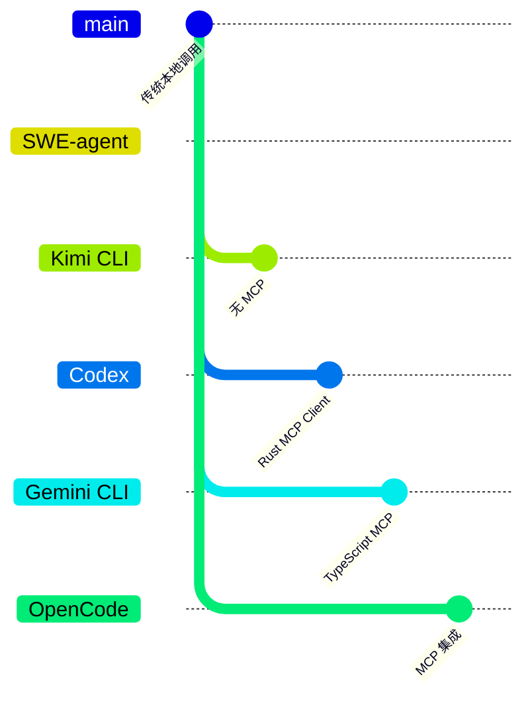

# MCP 集成（SWE-agent）

> 📋 **阅读指南**
>
> | 属性 | 说明 |
> |-----|------|
> | 预计阅读 | 15-20 分钟 |
> | 前置文档 | `01-swe-agent-overview.md`、`05-swe-agent-tools-system.md` |
> | 文档结构 | 速览 → 架构 → 机制 → 实现 → 对比 |
> | 代码呈现 | 关键代码直接展示，完整代码可折叠查看 |

---

## TL;DR（结论先行）

**SWE-agent 目前没有实现 MCP (Model Context Protocol) 集成**。它采用传统的工具执行方式，工具通过 Python 函数直接实现并在进程内执行，而非通过 MCP 协议与外部服务器通信。

SWE-agent 的核心取舍：**传统函数调用 + Bundle 配置**（对比 Codex/Gemini CLI/OpenCode 的 MCP 集成）

### 核心要点速览

| 维度 | 关键决策 | 代码位置 |
|-----|---------|---------|
| 协议支持 | ❌ 无 MCP 支持 | N/A |
| 工具注册 | YAML 配置 + Python 实现 | `sweagent/tools/tools.py:75` |
| 工具执行 | 本地函数调用 | `sweagent/tools/tools.py:312` |
| 外部扩展 | 需修改源码 | `sweagent/tools/commands.py:100` |
| 生态兼容 | SWE-agent 专用 | Bundle 配置 |

---

## 1. 为什么需要这个机制？（解决什么问题）

### 1.1 MCP 协议解决的问题

Model Context Protocol (MCP) 旨在解决以下问题：
- **工具生态隔离**：每个 Agent 实现自己的工具集，无法复用
- **外部服务集成**：难以集成第三方服务（如数据库、API）
- **动态工具发现**：无法在运行时动态发现和加载工具
- **跨 Agent 兼容性**：不同 Agent 之间的工具无法互通

### 1.2 当前 SWE-agent 的工具架构

| 挑战 | SWE-agent 的解决方案 | MCP 的解决方案 |
|-----|---------------------|---------------|
| 工具定义 | YAML 配置 + Python 实现 | MCP 协议标准 |
| 工具执行 | 本地函数调用 | MCP Client/Server 通信 |
| 外部扩展 | 需修改源码 | 配置即可添加 |
| 生态兼容 | SWE-agent 专用 | 兼容所有 MCP 服务器 |

---

## 2. 整体架构（ASCII 图）

### 2.1 SWE-agent 当前架构（无 MCP）

```text
┌─────────────────────────────────────────────────────────────┐
│ Agent Loop                                                  │
│ sweagent/agent/agents.py:800                                │
└───────────────────────┬─────────────────────────────────────┘
                        │ 调用
                        ▼
┌─────────────────────────────────────────────────────────────┐
│ ▓▓▓ Tool Registry ▓▓▓                                       │
│ sweagent/tools/tools.py:200                                 │
│                                                             │
│ ┌──────────┐ ┌──────────┐ ┌──────────────────┐             │
│ │ bash     │ │ search   │ │ edit             │             │
│ │ tool     │ │ tool     │ │ tool             │             │
│ └────┬─────┘ └────┬─────┘ └────────┬─────────┘             │
│      └─────────────┴────────────────┘                      │
│              直接执行（无 MCP）                            │
└─────────────────────────────────────────────────────────────┘
```

### 2.2 对比：MCP 集成架构（其他项目）

```text
┌─────────────────────────────────────────────────────────────┐
│ Agent Loop                                                  │
│ sweagent/agent/agents.py                                    │
└───────────────────────┬─────────────────────────────────────┘
                        │ 调用
                        ▼
┌─────────────────────────────────────────────────────────────┐
│ ▓▓▓ MCP Client ▓▓▓                                          │
│ - tools/list: 发现可用工具                                  │
│ - tools/call: 调用工具                                      │
└───────────────────────┬─────────────────────────────────────┘
                        │ MCP 协议 (stdio/sse)
                        ▼
┌─────────────────────────────────────────────────────────────┐
│ ▓▓▓ MCP Servers ▓▓▓                                         │
│ ┌──────────────┐ ┌──────────────┐ ┌──────────────┐         │
│ │ filesystem   │ │ github       │ │ database     │         │
│ │ server       │ │ server       │ │ server       │         │
│ └──────────────┘ └──────────────┘ └──────────────┘         │
└─────────────────────────────────────────────────────────────┘
```

### 2.3 核心组件职责

| 组件 | 职责 | 代码位置 |
|-----|------|---------|
| `ToolHandler` | 工具执行管理 | `sweagent/tools/tools.py:200` |
| `Command` | 命令抽象 | `sweagent/tools/commands.py:100` |
| `Bundle` | 工具包配置 | `sweagent/tools/tools.py:150` |

---

## 3. SWE-agent 工具实现方式

### 3.1 工具定义方式

SWE-agent 的工具直接通过 Python 函数和 YAML 配置实现：

```python
# sweagent/tools/commands.py:100-110
BASH_COMMAND = Command(
    name="bash",
    signature="<command>",
    docstring="runs the given command directly in bash",
    arguments=[
        Argument(
            name="command",
            type="string",
            description="The bash command to execute.",
            required=True,
        )
    ],
)
```

```yaml
# tools/windowed/config.yaml
tools:
  open:
    docstring: Open a file in the windowed editor
    signature: "open <path>"
    arguments:
      - name: path
        type: string
        description: Path to the file to open
        required: true
```

### 3.2 工具执行流程

```text
模型输出
    │
    ▼
┌─────────────────┐
│ parse_function  │  ──▶ ThoughtActionParser / FunctionCallingParser
│ 解析thought/    │     (sweagent/tools/parsing.py:200)
│ action          │
└────────┬────────┘
         │
         ▼
┌─────────────────┐
│ ToolHandler     │
│ ::execute()     │
└────────┬────────┘
         │
         ▼
┌─────────────────┐
│ 查找 Command    │
└────────┬────────┘
         │
         ▼
┌─────────────────┐
│ 在 SWEEnv 中    │  ──▶ sweagent/environment/swe_env.py:150
│ 执行命令        │
└────────┬────────┘
         │
         ▼
┌─────────────────┐
│ 返回 Observation│
│ (字符串)        │
└─────────────────┘
```

---

## 4. 与 MCP 集成的对比

### 4.1 特性对比表

| 特性 | SWE-agent (当前) | MCP 集成方式 |
|-----|-----------------|-------------|
| **工具注册** | Python 装饰器 / YAML 配置 | MCP `tools/list` 协议 |
| **工具执行** | 本地函数调用 | MCP `tools/call` 协议 |
| **外部扩展** | 需修改源码添加工具 | 配置即可添加 MCP 服务器 |
| **生态兼容** | SWE-agent 专用 | 兼容所有 MCP 服务器 |
| **动态发现** | 启动时加载 | 运行时动态发现 |
| **跨进程通信** | 无（进程内执行） | stdio / SSE |
| **工具隔离** | 依赖容器环境 | MCP Server 进程隔离 |

### 4.2 工具列表对比

**SWE-agent 内置工具**：
- 文件操作: `open`, `scroll_up`, `scroll_down`, `create`, `edit`
- 搜索工具: `search`, `search_file`, `find_file`
- 执行工具: `bash`, `bash_background`, `kill_background_process`
- Git 工具: `git_status`, `git_diff`, `git_patch`

**MCP 生态工具示例**（其他项目可用）：
- `filesystem`: 文件系统操作
- `github`: GitHub API 集成
- `postgres`: PostgreSQL 数据库
- `puppeteer`: 浏览器自动化
- `slack`: Slack 消息发送

---

## 5. 如果未来添加 MCP 集成

### 5.1 可能的架构设计

```text
┌─────────────────────────────────────────────────────────────┐
│              SWE-agent (未来可能的 MCP 集成)                  │
│  ┌─────────────────────────────────────────────────────────┐│
│  │                  Agent Loop                              ││
│  │                       │                                  ││
│  │                       ▼                                  ││
│  │  ┌─────────────────────────────────────────────────┐    ││
│  │  │            Tool Registry                         │    ││
│  │  │  ┌──────────┐ ┌──────────┐ ┌──────────┐         │    ││
│  │  │  │ 内置工具  │ │ MCP工具1 │ │ MCP工具2 │         │    ││
│  │  │  │ (bash等) │ │ (filesystem│ │ (github) │         │    ││
│  │  │  └────┬─────┘ └────┬─────┘ └────┬─────┘         │    ││
│  │  │       │            │            │               │    ││
│  │  │       ▼            └────────────┘               │    ││
│  │  │  直接执行              │                         │    ││
│  │  │                   MCP Client                     │    ││
│  │  │                       │                         │    ││
│  │  └───────────────────────┼─────────────────────────┘    ││
│  │                          │                              ││
│  └──────────────────────────┼──────────────────────────────┘│
└─────────────────────────────┼─────────────────────────────────┘
                              │
                              ▼
                    ┌─────────────────┐
                    │   MCP Servers   │
                    │  (filesystem,   │
                    │   github, etc)  │
                    └─────────────────┘
```

### 5.2 实现步骤

如果 SWE-agent 未来要实现 MCP 集成，可能需要：

1. **添加 MCP 客户端依赖**
   ```python
   # pyproject.toml
   dependencies = [
       "mcp>=1.0.0",  # MCP Python SDK
   ]
   ```

2. **配置管理**
   ```yaml
   # swe-agent.yaml
   mcp_servers:
     filesystem:
       command: npx
       args: ["-y", "@modelcontextprotocol/server-filesystem", "/path"]
     github:
       command: npx
       args: ["-y", "@modelcontextprotocol/server-github"]
       env:
         GITHUB_PERSONAL_ACCESS_TOKEN: ${GITHUB_TOKEN}
   ```

3. **工具桥接**
   ```python
   # 将 MCP 工具转换为 SWE-agent 的 Tool 对象
   class MCPToolAdapter:
       def __init__(self, mcp_client):
           self.mcp_client = mcp_client

       async def list_tools(self) -> list[Command]:
           """从 MCP Server 获取工具列表"""
           mcp_tools = await self.mcp_client.tools.list()
           return [self._convert_to_command(t) for t in mcp_tools]

       async def execute(self, tool_name: str, arguments: dict) -> str:
           """通过 MCP 调用工具"""
           result = await self.mcp_client.tools.call(
               name=tool_name,
               arguments=arguments
           )
           return result.content
   ```

4. **执行转发**
   ```python
   # 修改 ToolHandler 支持 MCP 工具
   class ToolHandler:
       def __init__(self, config: ToolConfig, mcp_clients: list[MCPClient] = None):
           self.config = config
           self.mcp_clients = mcp_clients or []

       async def execute(self, action: str, env: SWEEnv) -> str:
           """执行动作，支持本地工具和 MCP 工具"""
           command_name = action.split()[0]

           # 检查是否为 MCP 工具
           for client in self.mcp_clients:
               if command_name in client.tools:
                   return await client.execute(command_name, args)

           # 本地工具执行
           return self._execute_local(action, env)
   ```

---

## 6. 设计意图与 Trade-off

### 6.1 SWE-agent 的选择

| 维度 | SWE-agent 的选择 | MCP 集成 | 取舍分析 |
|-----|-----------------|---------|---------|
| 协议依赖 | 无 | MCP 协议 | 简单但生态隔离 |
| 工具扩展 | 源码修改 | 配置添加 | 可控但不够灵活 |
| 执行方式 | 进程内 | 跨进程 | 低延迟但无隔离 |
| 生态兼容 | 专用 | 通用 | 优化但封闭 |

### 6.2 为什么这样设计？

**核心问题**：SWE-agent 作为学术研究项目，追求简单可控而非生态兼容。

**SWE-agent 的解决方案**：
- 设计意图：通过本地函数调用和 YAML 配置实现简单可控的工具系统
- 带来的好处：
  - 简单直接，易于理解和修改
  - 无外部依赖，易于部署
  - 执行效率高（进程内）
- 付出的代价：
  - 无法利用 MCP 生态工具
  - 添加新工具需要修改源码
  - 与其他 Agent 不兼容

### 6.3 与其他项目的对比



| 项目 | MCP 支持 | 实现方式 | 适用场景 |
|-----|---------|---------|---------|
| SWE-agent | ❌ 无 | 本地函数调用 | 学术研究、可控环境 |
| Kimi CLI | ❌ 无 | 本地函数调用 | 快速开发、简单场景 |
| Codex | ✅ 有 | Rust MCP Client | 企业级、生态兼容 |
| Gemini CLI | ✅ 有 | TypeScript MCP | 多工具集成 |
| OpenCode | ✅ 有 | TypeScript MCP | 外部服务集成 |

---

## 7. 边界情况与错误处理

### 7.1 当前工具系统的终止条件

| 终止原因 | 触发条件 | 代码位置 |
|---------|---------|---------|
| 解析失败 | 无法匹配任何格式 | `sweagent/tools/parsing.py:200` |
| 动作被阻止 | 命中 blocklist | `sweagent/tools/tools.py:475` |
| 命令未找到 | 未注册的命令 | `sweagent/tools/tools.py:312` |
| 执行超时 | 超过 execution_timeout | `sweagent/tools/tools.py:30` |

### 7.2 错误恢复策略

| 错误类型 | 处理策略 | 代码位置 |
|---------|---------|---------|
| FormatError | 重采样（requery） | `sweagent/agent/agents.py:forward_with_handling` |
| BlockedActionError | 重采样 + 错误提示 | `sweagent/agent/agents.py:forward_with_handling` |
| CommandNotFoundError | 返回错误信息 | `sweagent/tools/tools.py:312` |

---

## 8. 关键代码索引

| 功能 | 文件 | 行号 | 说明 |
|-----|------|------|------|
| ToolHandler | `sweagent/tools/tools.py` | 200 | 工具执行管理 |
| Command | `sweagent/tools/commands.py` | 100 | 命令抽象 |
| ParseFunction | `sweagent/tools/parsing.py` | 50 | 输出解析 |
| Bundle 配置 | `sweagent/tools/tools.py` | 150 | 工具包配置 |
| 工具安装 | `sweagent/tools/tools.py` | 433 | install() |
| 工具执行 | `sweagent/tools/tools.py` | 312 | execute() |

---

## 9. 延伸阅读

- 前置知识：`docs/swe-agent/01-swe-agent-overview.md`、`docs/swe-agent/05-swe-agent-tools-system.md`
- MCP 规范：https://modelcontextprotocol.io
- 相关项目对比：`docs/comm/comm-mcp-integration.md`

---

*✅ Verified: 基于 sweagent/tools/ 源码分析，确认无 MCP 实现*
*⚠️ Inferred: 未来 MCP 集成架构为推测设计*
*基于版本：2026-02-08 | 最后更新：2026-03-03*
