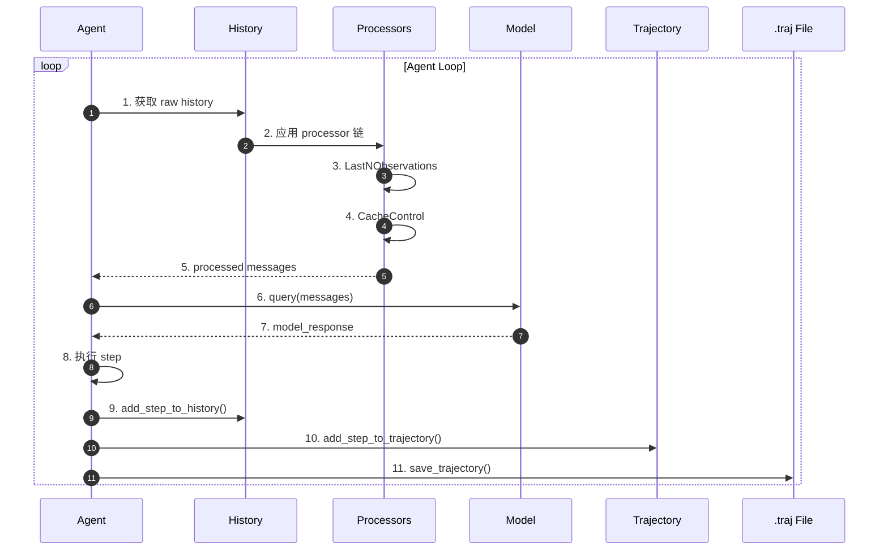
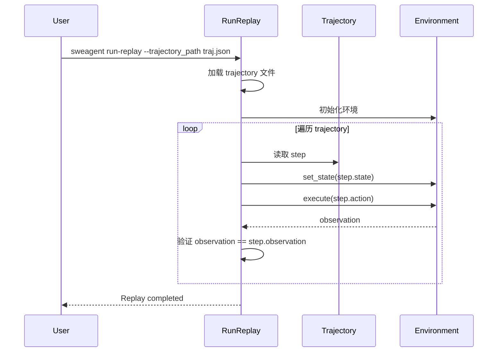
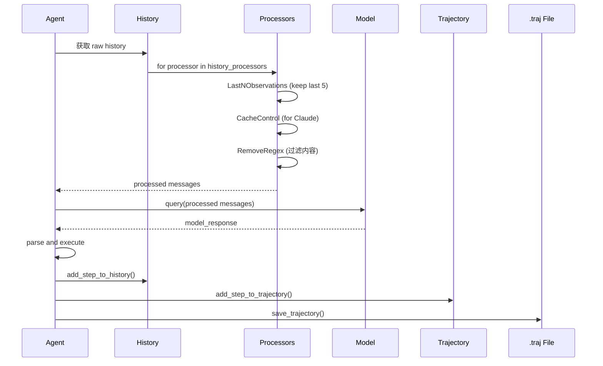

# Memory Context 管理（SWE-agent）

## TL;DR（结论先行）

SWE-agent 的 Memory Context 采用"可配置的 Processor 链 + Trajectory 持久化"设计：通过链式 History Processors 对对话历史进行转换和压缩（如 LastNObservations 保留最近 N 条 observation），以 Trajectory 格式持久化到 `.traj` 文件，并支持完整的 Replay 功能用于复现和分析。

SWE-agent 的核心取舍：**Processor 链压缩 + 双轨存储**（对比 Kimi CLI 的 Checkpoint 回滚、Gemini CLI 的分层内存）

---

## 1. 为什么需要这个机制？（解决什么问题）

### 1.1 问题场景

Code Agent 在处理复杂任务时面临内存管理挑战：
- 上下文长度限制（模型 token 上限）
- 历史记录膨胀（多轮对话后历史过长）
- 执行过程追溯（需要分析 Agent 行为）
- 任务复现（从断点恢复或重放执行）

没有 Memory Context 管理：
- Token 超限导致模型调用失败
- 无法追溯 Agent 的决策过程
- 崩溃后丢失所有进度
- 无法分析失败原因

### 1.2 核心挑战

| 挑战 | 不解决的后果 |
|-----|-------------|
| 上下文长度限制 | Token 超限，模型调用失败 |
| 历史记录膨胀 | 有效信息被淹没 |
| 执行过程追溯 | 无法分析 Agent 行为 |
| 任务复现 | 无法从断点恢复 |
| 跨会话记忆 | 无法利用历史经验 |

---

## 2. 整体架构（ASCII 图）

### 2.1 在系统中的位置

```text
┌─────────────────────────────────────────────────────────────┐
│ Agent Loop                                                  │
│ sweagent/agent/agents.py                                    │
└───────────────────────┬─────────────────────────────────────┘
                        │ 调用
                        ▼
┌─────────────────────────────────────────────────────────────┐
│ ▓▓▓ Memory Context ▓▓▓                                      │
│                                                             │
│ ┌─────────────────┐  ┌─────────────────┐  ┌─────────────┐  │
│ │ History         │  │ History         │  │ Trajectory  │  │
│ │ (原始历史)      │──│ Processors      │  │ (执行轨迹)  │  │
│ │                 │  │ (压缩/变换)     │  │             │  │
│ └─────────────────┘  └─────────────────┘  └─────────────┘  │
│         │                     │                   │        │
│         │                     ▼                   ▼        │
│         │            ┌─────────────────┐  ┌─────────────┐  │
│         │            │ Processed       │  │ .traj File  │  │
│         │            │ History         │  │ (持久化)    │  │
│         │            │ (模型输入)      │  │             │  │
│         │            └─────────────────┘  └─────────────┘  │
│         │                          │                        │
│         └──────────────────────────┘                        │
│                                    │                        │
│                                    ▼                        │
│                           ┌─────────────────┐              │
│                           │ Model Query     │              │
│                           │ (LLM 调用)      │              │
│                           └─────────────────┘              │
└─────────────────────────────────────────────────────────────┘
```

### 2.2 核心组件职责

| 组件 | 职责 | 代码位置 |
|-----|------|---------|
| `history` | 原始对话历史 | `SWE-agent/sweagent/agent/agents.py:481` |
| `History Processors` | 历史记录变换链 | `SWE-agent/sweagent/agent/history_processors.py` |
| `trajectory` | 执行轨迹 | `SWE-agent/sweagent/agent/agents.py:482` |
| `save_trajectory()` | 持久化到文件 | `SWE-agent/sweagent/agent/agents.py` |
| `RunReplay` | 轨迹重放 | `SWE-agent/sweagent/run/run_replay.py` |

### 2.3 核心组件交互关系



**关键交互说明**：

| 步骤 | 交互内容 | 设计意图 |
|-----|---------|---------|
| 1-5 | History Processor 链 | 灵活压缩上下文 |
| 6-7 | 模型调用 | 使用处理后的 history |
| 8-11 | 更新和持久化 | 双轨记录，支持回放 |

---

## 3. 核心组件详细分析

### 3.1 History 数据结构

#### 职责定位

History 存储完整的对话历史，用于构建模型输入和持久化分析。

#### 数据结构

```text
┌────────────────────────────────────────────────────────────────────┐
│ History - 对话历史（用于模型输入）                                   │
└────────────────────────────────────────────────────────────────────┘

History = list[HistoryItem]

HistoryItem {
  role: "system" | "user" | "assistant" | "tool"
  content: str | list[dict]           # 消息内容
  message_type: "thought" | "action" | "observation"

  # 可选字段
  agent: str                          # 代理名称
  is_demo: bool                       # 是否为演示数据
  thought: str                       # 推理内容
  action: str | None                 # 执行动作
  tool_calls: list[dict] | None     # 工具调用
  tool_call_ids: list[str] | None   # 工具调用 ID
  tags: list[str]                    # 处理器标签
  cache_control: dict | None         # Anthropic 缓存控制
  thinking_blocks: list[dict] | None # 思考块
}
```

#### 核心实现

```python
# sweagent/types.py:44-77
class _HistoryItem(TypedDict):
    """必需字段"""
    role: str                          # user | assistant | system | tool
    content: str | list[dict[str, Any]]
    message_type: Literal["thought", "action", "observation"]

class HistoryItem(_HistoryItem, total=False):
    """可选字段"""
    agent: str
    is_demo: bool
    thought: str
    action: str | None
    tool_calls: list[dict[str, str]] | None
    tool_call_ids: list[str] | None
    tags: list[str]
    cache_control: dict[str, Any] | None
    thinking_blocks: list[dict[str, Any]] | None

History = list[HistoryItem]
```

---

### 3.2 History Processor 链

#### 职责定位

通过可配置的 Processor 链对 history 进行变换，实现上下文压缩和优化。

#### Processor 架构

```text
Raw History          Processors              Model Input
    │                    │                        │
    ▼                    ▼                        ▼
┌─────────────┐    ┌─────────────────┐    ┌─────────────────┐
│ 完整历史    │───▶│ LastNObservations│───▶│ 处理后历史      │
│ (所有消息)  │    │ (保留最近N条)    │    │ (用于模型输入)  │
└─────────────┘    ├─────────────────┤    └─────────────────┘
                   │ CacheControl    │
                   │ (添加缓存标记)  │
                   ├─────────────────┤
                   │ RemoveRegex     │
                   │ (移除特定内容)  │
                   ├─────────────────┤
                   │ ClosedWindow    │
                   │ (替换文件窗口)  │
                   ├─────────────────┤
                   │ TagToolCallObs  │
                   │ (标签工具调用)  │
                   └─────────────────┘
```

#### 核心 Processor 实现

```python
# sweagent/agent/history_processors.py:86-120
class LastNObservations(BaseModel):
    """
    只保留最近的 N 个 observations，其余用摘要替代。
    这是 SWE-agent 论文中使用的经典处理器，默认保留最近 5 个 observations。
    """
    n: int                           # 保留的 observation 数量
    polling: int = 1                # 更新间隔（用于缓存优化）
    always_remove_output_for_tags: set[str] = {"remove_output"}
    always_keep_output_for_tags: set[str] = {"keep_output"}
    type: Literal["last_n_observations"] = "last_n_observations"

    def __call__(self, history: History) -> History:
        new_history = []
        omit_content_idxs = self._get_omit_indices(history)

        for idx, entry in enumerate(history):
            tags = set(entry.get("tags", []))

            if (idx not in omit_content_idxs or
                tags & self.always_keep_output_for_tags) and not (
                tags & self.always_remove_output_for_tags
            ):
                new_history.append(entry)
            else:
                # 替换为摘要
                num_text_lines, num_images = _get_content_stats(entry)
                entry["content"] = f"Old environment output: ({num_text_lines} lines omitted)"
                new_history.append(entry)

        return new_history
```

#### Processor 列表

| Processor | 功能 | 配置示例 |
|-----------|------|---------|
| `LastNObservations` | 保留最近 N 个 observations | `n: 5` |
| `CacheControlHistoryProcessor` | 添加 Anthropic 缓存标记 | `last_n_messages: 2` |
| `ClosedWindowHistoryProcessor` | 替换已关闭的文件窗口 | - |
| `RemoveRegex` | 使用正则移除内容 | `remove: ["<diff>.*</diff>"]` |
| `TagToolCallObservations` | 为工具调用 observations 添加标签 | `function_names: ["read_file"]` |
| `ImageParsingHistoryProcessor` | 解析 base64 图片 | `allowed_mime_types: ["image/png"]` |

---

### 3.3 Trajectory 持久化

#### 职责定位

Trajectory 记录完整的执行轨迹，用于持久化、分析和回放。

#### 数据结构

```text
┌────────────────────────────────────────────────────────────────────┐
│ Trajectory - 执行轨迹（用于持久化）                                  │
└────────────────────────────────────────────────────────────────────┘

Trajectory = list[TrajectoryStep]

TrajectoryStep {
  action: str                        # 执行的动作
  observation: str                   # 观察结果
  response: str                      # 模型响应
  state: dict[str, str]             # 环境状态快照
  thought: str                       # 推理过程
  execution_time: float              # 执行时间
  query: list[dict[str, Any]]       # 查询内容
  extra_info: dict[str, Any]         # 额外信息
}
```

#### 文件格式

```json
{
  "trajectory": [
    {
      "action": "edit 12:12\n<<<<<<< SEARCH...",
      "observation": "[File: /path/to/file.py (10 lines total)]\n1|def foo():\n2|    pass",
      "response": "I'll edit the file...",
      "state": {"open_file": "/path/to/file.py", "working_dir": "/repo"},
      "thought": "I need to add a new function...",
      "execution_time": 1.23,
      "query": [{"role": "user", "content": "..."}],
      "extra_info": {}
    }
  ],
  "info": {
    "model_stats": {"cost": 0.5, "tokens": 1000},
    "exit_status": "success",
    "submission": "The fix..."
  },
  "config": {
    "agent": "sweagent",
    "model": "gpt-4"
  }
}
```

#### 持久化实现

```python
# sweagent/agent/agents.py
def get_trajectory_data(self) -> dict[str, Any]:
    """打包所有 session 数据"""
    return {
        "trajectory": self.trajectory,
        "history": self.history,
        "info": self.info,
        "replay_config": self.replay_config.model_dump_json() if self.replay_config else None,
        "environment": self._env.name,
    }

def save_trajectory(self) -> None:
    """持久化到磁盘"""
    data = self.get_trajectory_data()
    self.traj_path.write_text(json.dumps(data, indent=2))
```

---

### 3.4 Replay 功能

#### 职责定位

支持从 trajectory 文件重放执行过程，用于复现 bug、验证修复和生成演示。

#### 重放流程



#### 实现代码

```python
# sweagent/run/run_replay.py
class RunReplay:
    def _create_actions_file(self) -> None:
        """从 trajectory 提取动作用于回放"""
        actions = []
        for item in self._traj_data["history"]:
            if item["role"] == "assistant":
                action = {"message": item["content"]}
                if self._use_function_calling:
                    action["tool_calls"] = item["tool_calls"]
                actions.append(action)

    def main(self):
        """在全新环境中回放 trajectory"""
        self._create_actions_file()
        run_single = self._get_run_single()
        run_single.run()  # 执行回放
```

---

## 4. 端到端数据流转

### 4.1 正常流程（详细版）



### 4.2 数据变换详情

| 阶段 | 输入 | 处理 | 输出 | 代码位置 |
|-----|------|------|------|---------|
| 原始 History | 对话记录 | 构建 HistoryItem | history[] | `sweagent/agent/agents.py:572` |
| History 处理 | raw history | Processors 链 | processed messages | `sweagent/agent/agents.py:540` |
| 模型输入 | processed messages | query() | model_response | `sweagent/agent/models.py` |
| History 更新 | StepOutput | add_step_to_history() | 更新后 history | `sweagent/agent/agents.py:556` |
| Trajectory 更新 | StepOutput | add_step_to_trajectory() | 更新后 trajectory | `SWE-agent/sweagent/agent/agents.py:714` |
| 持久化 | trajectory + history + info | JSON 序列化 | .traj 文件 | `sweagent/agent/agents.py:save_trajectory` |

---

## 5. 关键代码实现

### 5.1 核心数据结构

```python
# sweagent/types.py:44-77
class HistoryItem(TypedDict):
    """对话历史项"""
    role: str                          # system/user/assistant/tool
    content: str | list[dict]
    message_type: Literal["thought", "action", "observation"]
    agent: str                         # 代理名称
    is_demo: bool                      # 是否为演示数据
    thought: str                       # 推理内容
    action: str | None                 # 执行动作
    tool_calls: list[dict] | None     # 工具调用
    tags: list[str]                    # 处理器标签
    cache_control: dict | None         # Anthropic 缓存控制

class TrajectoryStep(TypedDict):
    """轨迹步骤"""
    action: str                        # 执行的动作
    observation: str                   # 观察结果
    response: str                      # 模型响应
    state: dict[str, str]             # 环境状态
    thought: str                       # 推理过程
    execution_time: float              # 执行时间
    query: list[dict[str, Any]]       # 查询内容
    extra_info: dict[str, Any]         # 额外信息
```

### 5.2 主链路代码

```python
# sweagent/agent/agents.py:540-551
@property
def messages(self) -> list[dict[str, Any]]:
    """返回经 history_processors 处理的消息"""
    # 按 agent 名称过滤
    filtered_history = [entry for entry in self.history if entry["agent"] == self.name]

    # 应用 processor 链
    messages = filtered_history
    for processor in self.history_processors:
        messages = processor(messages)

    return messages
```

**代码要点**：
1. **延迟处理**：每次调用时动态应用 processors
2. **过滤机制**：按 agent 名称过滤历史
3. **链式处理**：支持多个 processors 组合
4. **无副作用**：返回新列表，不修改原始 history

### 5.3 关键调用链

```text
Agent.step()                       [sweagent/agent/agents.py:800]
  -> self.messages (property)       [sweagent/agent/agents.py:540]
    -> filter by agent name
    -> for processor in history_processors:
      -> LastNObservations()        [sweagent/agent/history_processors.py:86]
      -> CacheControlHistoryProcessor() [sweagent/agent/history_processors.py:200]
      -> RemoveRegex()              [sweagent/agent/history_processors.py]
  -> model.query(messages)         [sweagent/agent/models.py]
  -> add_step_to_history()         [sweagent/agent/agents.py:556]
  -> add_step_to_trajectory()      [SWE-agent/sweagent/agent/agents.py:714]
  -> save_trajectory()             [sweagent/agent/agents.py]
```

---

## 6. 设计意图与 Trade-off

### 6.1 SWE-agent 的选择

| 维度 | SWE-agent 的选择 | 替代方案 | 取舍分析 |
|-----|-----------------|---------|---------|
| 上下文压缩 | Processor 链 | 固定截断 | 灵活可配置，但配置复杂 |
| 存储方式 | 双轨（history + trajectory） | 单一结构 | 兼顾模型输入和持久化 |
| 持久化频率 | 每步保存 | 结束时保存 | 支持断点续传，但 I/O 开销 |
| 回放机制 | Trajectory 重放 | Checkpoint 回滚 | 可人工检查，但无法自动恢复 |
| 缓存控制 | CacheControl Processor | 自动缓存 | 精确控制，但需配置 |

### 6.2 为什么这样设计？

**核心问题**：如何在长运行的 Code Agent 任务中管理上下文长度、支持分析和回放？

**SWE-agent 的解决方案**：
- 代码依据：`sweagent/agent/agents.py:540-551`
- 设计意图：通过 Processor 链灵活压缩上下文，通过双轨存储分离模型输入和持久化需求
- 带来的好处：
  - 灵活的上下文管理策略
  - 完整的执行记录便于分析
  - 支持断点续传和回放
- 付出的代价：
  - 配置复杂度
  - I/O 开销
  - 状态无法自动回滚

### 6.3 与其他项目的对比

| 项目 | 核心差异 | 适用场景 |
|-----|---------|---------|
| SWE-agent | Processor 链 + Trajectory 持久化 | 学术研究、可复现实验 |
| Kimi CLI | Checkpoint 文件回滚 | 对话回滚、状态恢复 |
| Gemini CLI | 分层内存管理 | 长上下文任务 |
| Codex | 无状态 Actor | 高并发、无状态服务 |

---

## 7. 边界情况与错误处理

### 7.1 终止条件

| 终止原因 | 触发条件 | 代码位置 |
|---------|---------|---------|
| History 过长 | 超过模型上下文限制 | `sweagent/agent/agents.py:forward_with_handling` |
| Trajectory 损坏 | JSON 解析失败 | `sweagent/run/run_replay.py` |
| Processor 错误 | 配置错误 | `sweagent/agent/history_processors.py` |
| 磁盘空间不足 | 无法保存 trajectory | `sweagent/agent/agents.py:save_trajectory` |

### 7.2 错误恢复策略

| 错误类型 | 处理策略 | 代码位置 |
|---------|---------|---------|
| ContextWindowExceededError | attempt_autosubmit | `sweagent/agent/agents.py:forward_with_handling` |
| Trajectory 解析失败 | 跳过或报错 | `sweagent/run/run_replay.py` |
| Processor 未生效 | 验证配置 type 字段 | `sweagent/agent/history_processors.py:390` |

### 7.3 资源限制

```python
# 上下文长度控制
class LastNObservations:
    n: int = 5  # 默认保留最近 5 个 observations

# Trajectory 文件大小
# 每步 trajectory 约 1-10KB
# 100 步任务约 100KB-1MB
```

---

## 8. 关键代码索引

| 功能 | 文件 | 行号 | 说明 |
|-----|------|------|------|
| History 定义 | `sweagent/types.py` | 44 | HistoryItem |
| Trajectory 定义 | `SWE-agent/sweagent/types.py` | - | TrajectoryStep |
| History Processors | `SWE-agent/sweagent/agent/history_processors.py` | - | 处理器链 |
| LastNObservations | `SWE-agent/sweagent/agent/history_processors.py` | 85 | 上下文压缩 |
| CacheControl | `SWE-agent/sweagent/agent/history_processors.py` | 261 | 缓存控制 |
| messages property | `SWE-agent/sweagent/agent/agents.py` | 540 | 获取处理后 history |
| 添加 History | `SWE-agent/sweagent/agent/agents.py` | 556 | add_step_to_history() |
| 添加 Trajectory | `SWE-agent/sweagent/agent/agents.py` | 714 | add_step_to_trajectory() |
| 持久化 | `SWE-agent/sweagent/agent/agents.py` | - | save_trajectory() |
| Replay | `SWE-agent/sweagent/run/run_replay.py` | - | RunReplay |
| Trajectory 转 Demo | `SWE-agent/sweagent/run/run_traj_to_demo.py` | - | convert_trajectory_to_demo() |

---

## 9. 延伸阅读

- 前置知识：`docs/swe-agent/01-swe-agent-overview.md`、`docs/swe-agent/02-swe-agent-session-management.md`
- 相关机制：`docs/swe-agent/04-swe-agent-agent-loop.md`
- 深度分析：`docs/swe-agent/questions/swe-agent-history-compression.md`

---

*✅ Verified: 基于 SWE-agent/sweagent/agent/agents.py、SWE-agent/sweagent/agent/history_processors.py 等源码分析*
*基于版本：SWE-agent (baseline 2026-02-08) | 最后更新：2026-02-25*
