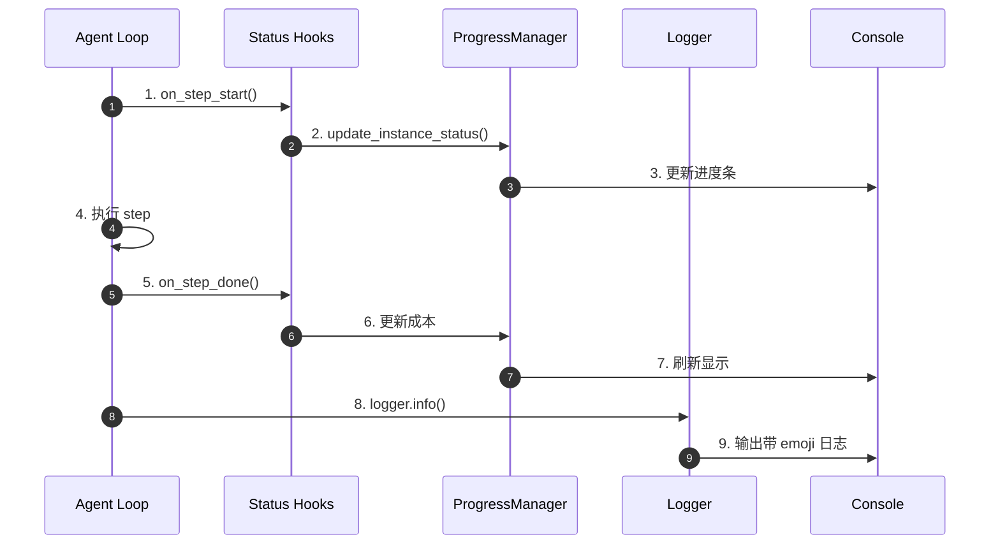
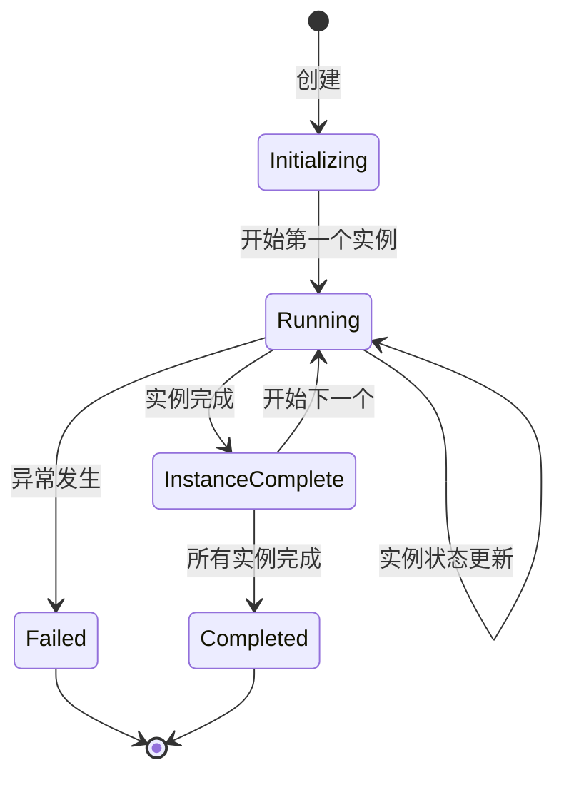
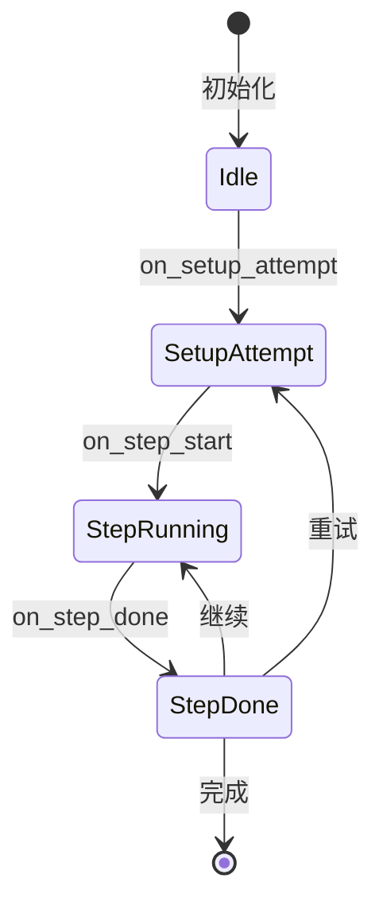
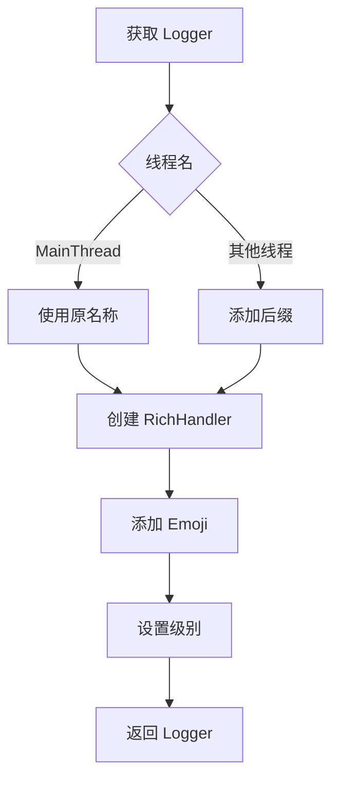
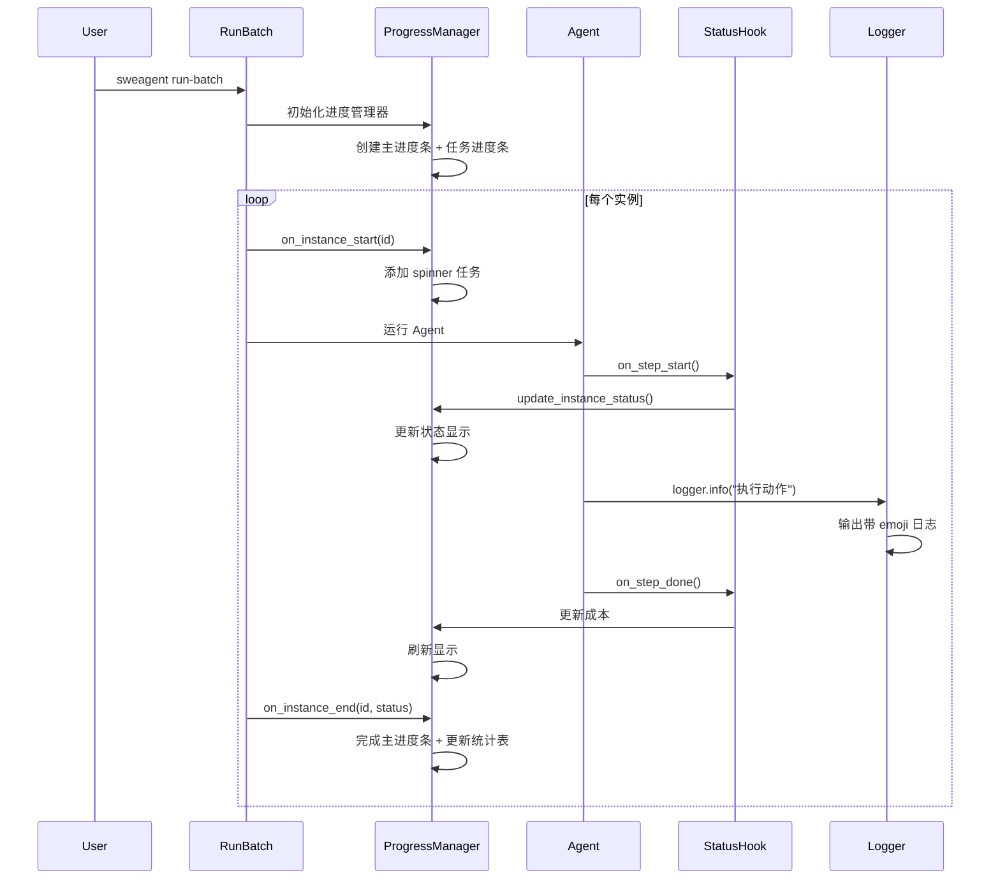
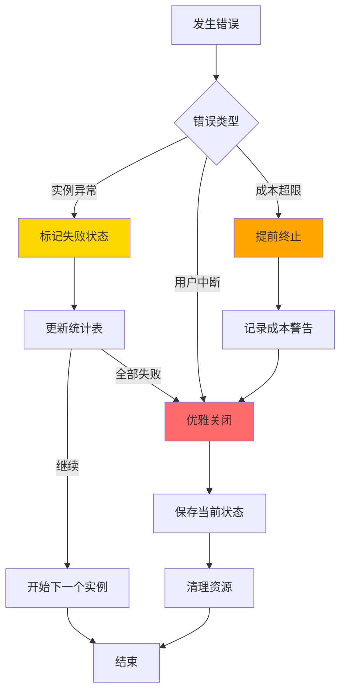
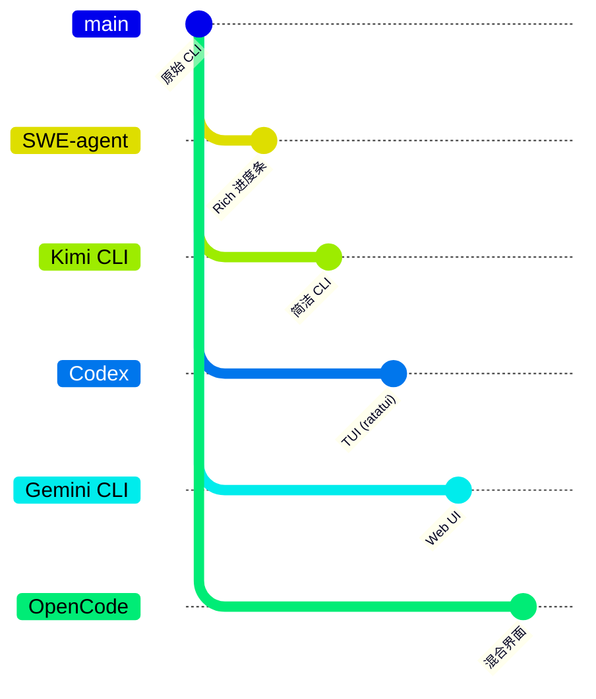

# UI Interaction（SWE-agent）

> 📋 **阅读指南**
>
> | 属性 | 说明 |
> |-----|------|
> | 预计阅读 | 15-20 分钟 |
> | 前置文档 | `01-swe-agent-overview.md`、`04-swe-agent-agent-loop.md` |
> | 文档结构 | 速览 → 架构 → 机制 → 实现 → 对比 |
> | 代码呈现 | 关键代码直接展示，完整代码可折叠查看 |

---

## TL;DR（结论先行）

SWE-agent 采用 **Rich 库驱动的命令行交互界面**，通过进度条、状态钩子和结构化日志提供实时反馈。核心取舍是**终端优先的轻量交互**（对比 Gemini CLI 的复杂 Web UI、Codex 的 TUI 界面、Kimi CLI 的简洁 CLI）。

### 核心要点速览

| 维度 | 关键决策 | 代码位置 |
|-----|---------|---------|
| 交互方式 | Rich 库命令行界面 | `sweagent/run/_progress.py:33` |
| 进度管理 | 双进度条（主进度 + 任务进度） | `sweagent/run/_progress.py:52` |
| 状态同步 | Hook 机制（Agent/Environment） | `sweagent/agent/hooks/status.py:7` |
| 日志样式 | Emoji + 彩色 RichHandler | `sweagent/utils/log.py:57` |
| 并发支持 | 多线程 + Lock | `sweagent/run/_progress.py:49` |

---

## 1. 为什么需要这个机制？（解决什么问题）

### 1.1 问题场景

没有 UI 交互机制时：
- 用户无法了解 Agent 执行进度
- 批量任务状态不透明
- 错误信息难以追踪
- 多实例并行执行难以监控

有了 Rich 驱动的交互界面：
- 实时显示执行步骤和成本
- 批量任务进度可视化
- 结构化日志便于调试
- 多线程状态同步展示

### 1.2 核心挑战

| 挑战 | 不解决的后果 |
|-----|-------------|
| 实时反馈 | 用户不知道任务是否在进行 |
| 成本控制 | 无法追踪 API 调用费用 |
| 批量监控 | 多实例执行状态混乱 |
| 错误定位 | 日志分散，难以排查问题 |
| 多线程安全 | 并发输出混乱 |

---

## 2. 整体架构（ASCII 图）

### 2.1 在系统中的位置

```text
┌─────────────────────────────────────────────────────────────┐
│ Agent Loop / Run Batch                                       │
│ sweagent/agent/agents.py:800 / run_batch.py:100             │
└───────────────────────┬─────────────────────────────────────┘
                        │ 触发状态更新
                        ▼
┌─────────────────────────────────────────────────────────────┐
│ ▓▓▓ UI Interaction ▓▓▓                                      │
│                                                              │
│ ┌─────────────────┐  ┌─────────────────┐  ┌─────────────┐   │
│ │ Rich Progress   │  │ Status Hooks    │  │ Logging     │   │
│ │ Bar             │──│ (Agent/Env)     │  │ (Emoji)     │   │
│ │                 │  │                 │  │             │   │
│ └─────────────────┘  └─────────────────┘  └─────────────┘   │
└───────────────────────┬─────────────────────────────────────┘
                        │ 输出
                        ▼
┌─────────────────────────────────────────────────────────────┐
│ Terminal / Console                                           │
│ - 进度条显示                                                 │
│ - 实时状态更新                                               │
│ - 结构化日志                                                 │
└─────────────────────────────────────────────────────────────┘
```

### 2.2 核心组件职责

| 组件 | 职责 | 代码位置 |
|-----|------|---------|
| `RunBatchProgressManager` | 批量任务进度管理 | `sweagent/run/_progress.py:33` |
| `SetStatusAgentHook` | Agent 状态更新钩子 | `sweagent/agent/hooks/status.py:7` |
| `SetStatusEnvironmentHook` | 环境状态更新钩子 | `sweagent/environment/hooks/status.py:7` |
| `get_logger` | 带 emoji 的日志记录器 | `sweagent/utils/log.py:57` |
| `_RichHandlerWithEmoji` | 富文本日志处理器 | `sweagent/utils/log.py:44` |

### 2.3 核心组件交互关系



**关键交互说明**：

| 步骤 | 交互内容 | 设计意图 |
|-----|---------|---------|
| 1-3 | Step 开始通知 | 实时反馈执行进度 |
| 4 | 执行实际工作 | 核心业务逻辑 |
| 5-7 | Step 完成通知 | 更新成本和状态 |
| 8-9 | 日志输出 | 结构化记录事件 |

---

## 3. 核心组件详细分析

### 3.1 RunBatchProgressManager

#### 职责定位

管理批量任务的进度显示，包括总进度条和各个实例的状态。

#### 状态机图



**状态说明**：

| 状态 | 说明 | 进入条件 | 退出条件 |
|-----|------|---------|---------|
| Initializing | 初始化 | 创建 ProgressManager | 开始第一个实例 |
| Running | 运行中 | 有实例在执行 | 所有实例完成 |
| InstanceComplete | 实例完成 | 单个实例结束 | 开始下一个或全部完成 |
| Completed | 全部完成 | 所有实例成功 | 自动结束 |
| Failed | 失败 | 发生异常 | 终止 |

#### 内部数据流

```text
┌─────────────────────────────────────────────────────────────┐
│  RunBatchProgressManager                                     │
│  ├── _main_progress_bar: 总体进度                            │
│  ├── _task_progress_bar: 各实例状态                          │
│  ├── _spinner_tasks: 实例 ID 映射                            │
│  └── _lock: 线程安全锁                                       │
│                                                              │
│  方法：                                                       │
│  ├── on_instance_start() → 添加任务                          │
│  ├── update_instance_status() → 更新状态                     │
│  ├── on_instance_end() → 完成任务                            │
│  └── update_exit_status_table() → 统计表                     │
└─────────────────────────────────────────────────────────────┘
```

#### 核心实现

```python
# sweagent/run/_progress.py:52-77
self._main_progress_bar = Progress(
    SpinnerColumn(spinner_name="dots2"),
    TextColumn("[progress.description]{task.description} (${task.fields[total_cost]})"),
    BarColumn(),
    MofNCompleteColumn(),
    TaskProgressColumn(),
    TimeElapsedColumn(),
    TextColumn("[cyan]eta:[/cyan]"),
    TimeRemainingColumn(),
    speed_estimate_period=60 * 5,  # 5 分钟后估计速度
)
self._task_progress_bar = Progress(
    SpinnerColumn(spinner_name="dots2"),
    TextColumn("{task.fields[instance_id]}"),
    TextColumn("{task.fields[status]}"),
    TimeElapsedColumn(),
)
```

---

### 3.2 Status Hooks

#### 职责定位

通过钩子机制将 Agent 和环境的状态变化同步到 UI。

#### Agent Hook 状态机



**状态说明**：

| 状态 | 说明 | 进入条件 | 退出条件 |
|-----|------|---------|---------|
| Idle | 空闲 | 初始化完成 | 开始 setup |
| SetupAttempt | 尝试设置 | setup 开始 | step 开始 |
| StepRunning | Step 运行中 | step 开始 | step 完成 |
| StepDone | Step 完成 | step 结束 | 继续或完成 |

#### 实现代码

```python
# sweagent/agent/hooks/status.py:25-31
class SetStatusAgentHook:
    def on_step_start(self):
        self._i_step += 1
        attempt_str = f"Attempt {self._i_attempt} " if self._i_attempt > 1 else ""
        self._update(f"{attempt_str}Step {self._i_step:>3} (${self._previous_cost + self._cost:.2f})")

    def on_step_done(self, *, step: StepOutput, info: AgentInfo):
        self._cost = info["model_stats"]["instance_cost"]
```

---

### 3.3 日志系统

#### 职责定位

提供带 emoji 的彩色日志输出，支持多线程和文件记录。

#### 关键算法逻辑



#### 实现代码

```python
# sweagent/utils/log.py:57-90
def get_logger(name: str, *, emoji: str = "") -> logging.Logger:
    """Get logger with RichHandler and emoji support."""
    thread_name = threading.current_thread().name
    if thread_name != "MainThread":
        name = name + "-" + _THREAD_NAME_TO_LOG_SUFFIX.get(thread_name, thread_name)

    logger = logging.getLogger(name)
    if logger.hasHandlers():
        return logger

    handler = _RichHandlerWithEmoji(
        emoji=emoji,
        show_time=bool(os.environ.get("SWE_AGENT_LOG_TIME", False)),
        show_path=False,
    )
    handler.setLevel(_STREAM_LEVEL)
    logger.setLevel(logging.TRACE)
    logger.addHandler(handler)
    logger.propagate = False
    return logger
```

---

## 4. 端到端数据流转

### 4.1 正常流程（详细版）



### 4.2 数据变换详情

| 阶段 | 输入 | 处理 | 输出 | 代码位置 |
|-----|------|------|------|---------|
| 初始化 | 实例数量 | 创建 Progress | 进度条对象 | `sweagent/run/_progress.py:74` |
| 实例开始 | 实例 ID | 添加任务 | Spinner 任务 | `sweagent/run/_progress.py:118` |
| 状态更新 | 状态消息 | 截断 + 格式化 | 显示文本 | `sweagent/run/_progress.py:107` |
| 日志输出 | 日志记录 | 添加 emoji + 样式 | 彩色文本 | `sweagent/utils/log.py:52` |
| 实例结束 | 退出状态 | 更新统计 | 完成计数 | `sweagent/run/_progress.py:127` |

### 4.3 异常流程（错误恢复）



---

## 5. 关键代码实现

### 5.1 核心数据结构

```python
# sweagent/run/_progress.py:33-79
class RunBatchProgressManager:
    def __init__(
        self,
        num_instances: int,
        yaml_report_path: Path | None = None,
    ):
        self._spinner_tasks: dict[str, TaskID] = {}
        self._lock = Lock()
        self._instances_by_exit_status = collections.defaultdict(list)
        self._main_progress_bar = Progress(...)  # 主进度条
        self._task_progress_bar = Progress(...)  # 任务进度条
        self.render_group = Group(Table(), self._task_progress_bar, self._main_progress_bar)
```

**字段说明**：

| 字段 | 类型 | 用途 |
|-----|------|------|
| `_spinner_tasks` | `dict[str, TaskID]` | 实例 ID 到任务 ID 的映射 |
| `_lock` | `Lock` | 线程安全锁 |
| `_instances_by_exit_status` | `defaultdict` | 按退出状态分组的实例 |
| `render_group` | `Group` | Rich 渲染组 |

### 5.2 主链路代码

**关键代码**（核心逻辑）：

```python
# sweagent/run/_progress.py:107-116
def update_instance_status(self, instance_id: str, message: str):
    """更新实例状态显示"""
    with self._lock:
        self._task_progress_bar.update(
            self._spinner_tasks[instance_id],
            status=_shorten_str(message, 30),
            instance_id=_shorten_str(instance_id, 25, shorten_left=True),
        )
    self._update_total_costs()
```

**设计意图**：
1. **线程安全**：使用锁保护共享状态
2. **字符串截断**：防止长消息破坏布局
3. **成本同步**：每次更新都刷新总成本

<details>
<summary>📋 查看完整实现</summary>

```python
# sweagent/run/_progress.py:100-130
class RunBatchProgressManager:
    def update_instance_status(self, instance_id: str, message: str):
        """更新实例状态显示

        线程安全地更新指定实例的状态显示，并同步总成本。
        """
        with self._lock:
            if instance_id not in self._spinner_tasks:
                return

            # 截断消息防止布局破坏
            short_message = _shorten_str(message, 30)
            short_id = _shorten_str(instance_id, 25, shorten_left=True)

            self._task_progress_bar.update(
                self._spinner_tasks[instance_id],
                status=short_message,
                instance_id=short_id,
            )

        # 在锁外更新成本（避免阻塞）
        self._update_total_costs()

    def _update_total_costs(self):
        """更新总成本显示"""
        total = sum(
            self._task_progress_bar.tasks[tid].fields.get("cost", 0.0)
            for tid in self._spinner_tasks.values()
        )
        self._main_progress_bar.update(
            self._main_task_id,
            total_cost=f"{total:.2f}"
        )
```

</details>

### 5.3 关键调用链

```text
RunBatch._run_instance()           [sweagent/run/run_batch.py:100]
  -> on_instance_start()            [sweagent/run/_progress.py:118]
  -> SetStatusAgentHook.on_step_start() [sweagent/agent/hooks/status.py:25]
    -> update_instance_status()     [sweagent/run/_progress.py:107]
  -> get_logger().info()            [sweagent/utils/log.py:57]
    -> _RichHandlerWithEmoji.emit() [sweagent/utils/log.py:44]
  -> on_instance_end()              [sweagent/run/_progress.py:127]
```

---

## 6. 设计意图与 Trade-off

### 6.1 SWE-agent 的选择

| 维度 | SWE-agent 的选择 | 替代方案 | 取舍分析 |
|-----|-----------------|---------|---------|
| 交互方式 | 命令行 + Rich | Web UI / TUI | 轻量、无额外依赖 |
| 实时机制 | 轮询 + 钩子 | WebSocket | 简单、足够实时 |
| 并发显示 | 多线程 + 锁 | 异步 | 与 Agent 架构一致 |
| 日志样式 | Emoji + 颜色 | 纯文本 | 视觉友好、易识别 |
| 批量监控 | 双进度条 | 单进度条 | 总览 + 详情兼顾 |

### 6.2 为什么这样设计？

**核心问题**：如何在保持轻量的同时提供有效的执行反馈？

**SWE-agent 的解决方案**：
- 代码依据：`sweagent/run/_progress.py:33`
- 设计意图：终端优先，使用 Rich 库提供现代化 CLI 体验
- 带来的好处：
  - 零 Web 依赖，易于部署
  - 与批量任务场景契合
  - 线程安全支持并发
- 付出的代价：
  - 无法远程监控
  - 功能不如 Web UI 丰富
  - 依赖终端支持

### 6.3 与其他项目的对比



| 项目 | 核心差异 | 适用场景 |
|-----|---------|---------|
| SWE-agent | Rich 命令行界面 | 批量任务、服务器环境 |
| Gemini CLI | 复杂 Web UI | 本地开发、可视化需求 |
| Codex | TUI (ratatui) | 终端环境、交互式任务 |
| Kimi CLI | 简洁 CLI | 轻量级使用 |
| OpenCode | 混合界面 | 多种使用场景 |

---

## 7. 边界情况与错误处理

### 7.1 终止条件

| 终止原因 | 触发条件 | 处理 |
|---------|---------|------|
| 实例完成 | Agent 返回结果 | 更新统计表，标记完成 |
| 异常退出 | 未捕获异常 | 标记为错误状态 |
| 用户中断 | Ctrl+C | 优雅关闭，保存状态 |
| 成本超限 | 达到 cost_limit | 提前终止 |

### 7.2 超时/资源限制

```python
# 线程安全
_lock = Lock()  # 保护共享状态

# 字符串长度限制
_shorten_str(s, max_len=30)  # 状态消息截断
_shorten_str(instance_id, 25, shorten_left=True)  # ID 截断
```

### 7.3 错误恢复策略

| 错误类型 | 处理策略 | 代码位置 |
|---------|---------|---------|
| 线程冲突 | 使用 Lock | `sweagent/run/_progress.py:49` |
| 长消息 | 字符串截断 | `_shorten_str()` |
| 日志级别 | 环境变量控制 | `SWE_AGENT_LOG_STREAM_LEVEL` |

---

## 8. 关键代码索引

| 功能 | 文件 | 行号 | 说明 |
|-----|------|------|------|
| 进度管理器 | `sweagent/run/_progress.py` | 33 | RunBatchProgressManager 类 |
| 主进度条 | `sweagent/run/_progress.py` | 52 | 总体进度显示 |
| 任务进度条 | `sweagent/run/_progress.py` | 64 | 各实例状态 |
| 实例开始 | `sweagent/run/_progress.py` | 118 | on_instance_start() |
| 状态更新 | `sweagent/run/_progress.py` | 107 | update_instance_status() |
| 实例结束 | `sweagent/run/_progress.py` | 127 | on_instance_end() |
| Agent 钩子 | `sweagent/agent/hooks/status.py` | 7 | SetStatusAgentHook |
| 环境钩子 | `sweagent/environment/hooks/status.py` | 7 | SetStatusEnvironmentHook |
| 日志记录器 | `sweagent/utils/log.py` | 57 | get_logger() |
| 富文本处理器 | `sweagent/utils/log.py` | 44 | _RichHandlerWithEmoji |

---

## 9. 延伸阅读

- 前置知识：`docs/swe-agent/02-swe-agent-cli-entry.md`（命令行入口）
- 相关机制：`docs/swe-agent/09-swe-agent-web-server.md`（Web 界面）
- 深度分析：`docs/swe-agent/04-swe-agent-agent-loop.md`（Agent 循环中的钩子调用点）

---

*✅ Verified: 基于 sweagent/run/_progress.py、sweagent/utils/log.py 等源码分析*
*基于版本：SWE-agent (baseline 2026-02-08) | 最后更新：2026-03-03*
