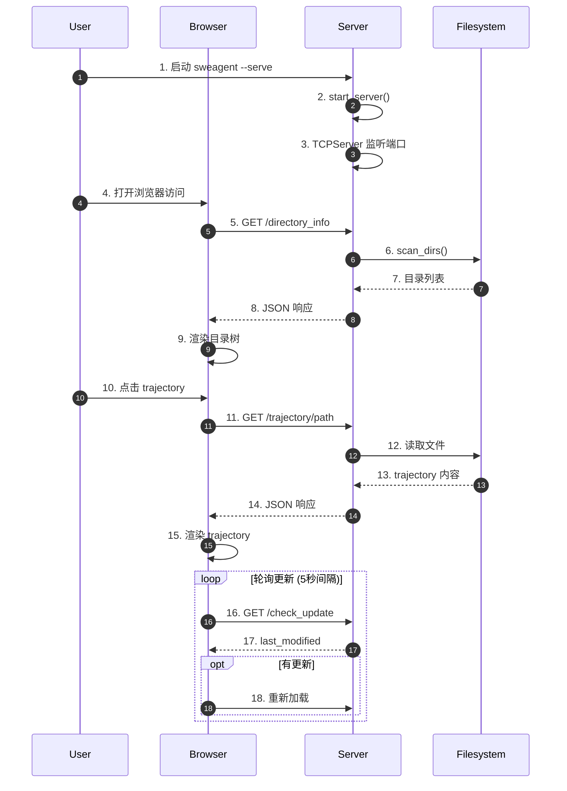
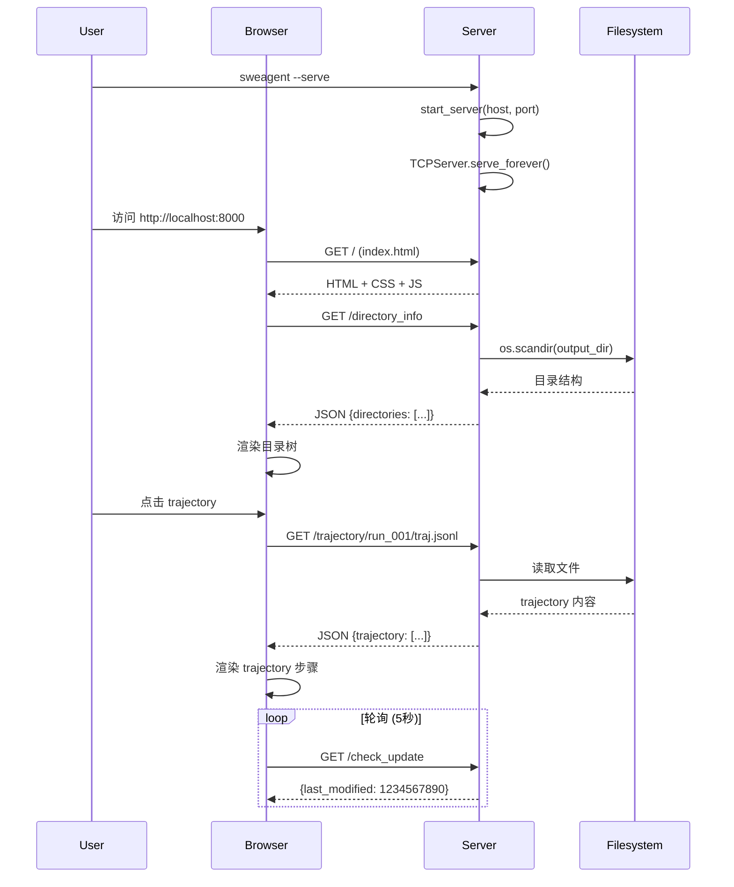

# Web Server（SWE-agent）

## TL;DR（结论先行）

SWE-agent 的 Web Server（Inspector）是一个基于 Python 标准库 `http.server` 的简单 HTTP 服务器，用于只读展示训练/推理过程中生成的 trajectory 文件。它采用轮询机制实现准实时更新，无需外部依赖，易于嵌入主程序。

SWE-agent 的核心取舍：**Python 标准库 + 简单轮询**（对比 Gemini CLI 的复杂 Web UI、Codex 的 TUI 界面）

---

## 1. 为什么需要这个机制？（解决什么问题）

### 1.1 问题场景

在训练和推理过程中，需要实时观察 Agent 的执行情况：
- 查看当前执行步骤和动作
- 分析历史 trajectory 文件
- 监控多实例并行执行状态
- 调试和排查问题

没有可视化工具：
- 只能通过日志文件查看，不直观
- 无法实时了解执行进度
- 难以分析 trajectory 结构
- 多实例管理困难

### 1.2 核心挑战

| 挑战 | 不解决的后果 |
|-----|-------------|
| 实时性 | 无法及时了解执行状态 |
| 可视化 | 难以理解复杂 trajectory |
| 多实例 | 难以管理并行执行 |
| 依赖性 | 引入重型 Web 框架增加负担 |
| 安全性 | Web 服务可能带来安全风险 |

---

## 2. 整体架构（ASCII 图）

### 2.1 在系统中的位置

```text
┌─────────────────────────────────────────────────────────────┐
│ swe-agent Training/Inference                                │
│ sweagent/run/run_single.py                                  │
└───────────────────────┬─────────────────────────────────────┘
                        │ 生成 trajectory
                        ▼
┌─────────────────────────────────────────────────────────────┐
│ ▓▓▓ Web Server (Inspector) ▓▓▓                              │
│ sweagent/inspector/                                         │
│                                                             │
│ ┌─────────────────┐  ┌─────────────────┐  ┌─────────────┐  │
│ │ HTTP Server     │  │ API Endpoints   │  │ Frontend    │  │
│ │ (TCPServer)     │  │ - /directory_   │  │ (HTML/JS)   │  │
│ │                 │  │   info          │  │             │  │
│ │                 │  │ - /files        │  │             │  │
│ │                 │  │ - /trajectory   │  │             │  │
│ │                 │  │ - /check_update │  │             │  │
│ └─────────────────┘  └─────────────────┘  └─────────────┘  │
└───────────────────────┬─────────────────────────────────────┘
                        │ HTTP
                        ▼
┌─────────────────────────────────────────────────────────────┐
│ Browser                                                     │
│ - 实时查看 trajectory                                       │
│ - 目录树导航                                                │
│ - 文件内容展示                                              │
└─────────────────────────────────────────────────────────────┘
```

### 2.2 核心组件职责

| 组件 | 职责 | 代码位置 |
|-----|------|---------|
| `start_server()` | 启动 HTTP 服务器 | `sweagent/inspector/server.py` |
| `CustomHTTPRequestHandler` | 请求处理 | `sweagent/inspector/server.py` |
| `/directory_info` | 返回目录结构 | `sweagent/inspector/server.py` |
| `/files` | 返回文件内容 | `sweagent/inspector/server.py` |
| `/trajectory` | 返回 trajectory 数据 | `sweagent/inspector/server.py` |
| `/check_update` | 检查更新 | `sweagent/inspector/server.py` |
| `fileViewer.js` | 前端逻辑 | `sweagent/inspector/fileViewer.js` |

### 2.3 核心组件交互关系



**关键交互说明**：

| 步骤 | 交互内容 | 设计意图 |
|-----|---------|---------|
| 1-3 | 服务器启动 | 简单嵌入主程序 |
| 5-9 | 目录列表 | 导航入口 |
| 11-15 | Trajectory 加载 | 核心功能 |
| 16-18 | 轮询更新 | 准实时同步 |

---

## 3. 核心组件详细分析

### 3.1 HTTP Server 基础架构

#### 职责定位

使用 Python 标准库实现，无外部 HTTP 框架依赖，简单易于嵌入。

#### 核心实现

```python
# sweagent/inspector/server.py
import socketserver
from http.server import SimpleHTTPRequestHandler

class CustomHTTPRequestHandler(SimpleHTTPRequestHandler):
    """自定义请求处理器，添加 CORS 和 JSON API 支持"""

    def end_headers(self):
        # 添加 CORS 头，允许跨域访问
        self.send_header('Access-Control-Allow-Origin', '*')
        super().end_headers()

    def do_GET(self):
        # 路由分发到对应的 API 端点
        if self.path == '/directory_info':
            self.handle_directory_info()
        elif self.path.startswith('/files'):
            self.handle_files()
        elif self.path.startswith('/trajectory'):
            self.handle_trajectory()
        elif self.path == '/check_update':
            self.handle_check_update()
        else:
            # 静态文件服务（前端资源）
            super().do_GET()
```

**关键设计决策**：
- 使用 `socketserver.TCPServer`：简单、无依赖、易于嵌入
- 单线程模型：足够应对只读场景，无需并发处理
- 内置 CORS 支持：允许前端独立开发部署

---

### 3.2 API 端点

#### 端点列表

| 方法 | 路径 | 功能 |
|------|------|------|
| `GET` | `/directory_info` | 扫描 output_dir，返回目录结构 |
| `GET` | `/files?path=xxx` | 读取指定文件内容 |
| `GET` | `/trajectory/<path>` | 解析并返回 trajectory JSON |
| `GET` | `/check_update` | 返回最后修改时间，用于轮询 |

#### `/directory_info` 实现

```python
# sweagent/inspector/server.py
def handle_directory_info(self):
    """扫描 output_dir 返回目录结构"""
    result = {"directories": []}
    output_dir = self.server.output_dir

    for entry in os.scandir(output_dir):
        if entry.is_dir():
            dir_info = {"name": entry.name, "path": entry.name, "trajectories": []}
            for subentry in os.scandir(entry.path):
                if subentry.name.endswith('.jsonl'):
                    stat = subentry.stat()
                    dir_info["trajectories"].append({
                        "name": subentry.name,
                        "path": f"{entry.name}/{subentry.name}",
                        "size": stat.st_size,
                        "modified": stat.st_mtime
                    })
            result["directories"].append(dir_info)

    self.send_json_response(result)
```

#### `/files` 实现

```python
# sweagent/inspector/server.py
def handle_files(self):
    """读取文件内容"""
    query = parse_qs(urlparse(self.path).query)
    file_path = query.get('path', [''])[0]

    # 安全检查：确保路径在 output_dir 内
    full_path = os.path.abspath(os.path.join(self.server.output_dir, file_path))
    if not full_path.startswith(os.path.abspath(self.server.output_dir)):
        self.send_error(403, "Access denied")
        return

    try:
        with open(full_path, 'r', encoding='utf-8') as f:
            content = f.read()
        self.send_text_response(content)
    except FileNotFoundError:
        self.send_error(404, "File not found")
```

---

### 3.3 前端轮询机制

#### 职责定位

由于服务器使用简单的 HTTP 协议，前端采用轮询实现准实时更新。

#### 轮询实现

```javascript
// sweagent/inspector/fileViewer.js (简化)
class TrajectoryViewer {
    constructor() {
        this.lastModified = 0;
        this.pollInterval = 5000; // 5 秒轮询间隔
    }

    startPolling() {
        setInterval(() => this.checkUpdate(), this.pollInterval);
    }

    async checkUpdate() {
        const response = await fetch('/check_update');
        const data = await response.json();

        if (data.last_modified > this.lastModified) {
            this.lastModified = data.last_modified;
            await this.reloadTrajectory(); // 有更新，重新加载
        }
    }
}
```

**轮询间隔**：默认 5 秒，平衡实时性与服务器负载。

---

## 4. 端到端数据流转

### 4.1 正常流程（详细版）



### 4.2 数据变换详情

| 阶段 | 输入 | 处理 | 输出 | 代码位置 |
|-----|------|------|------|---------|
| 服务器启动 | host, port, output_dir | TCPServer | 监听服务 | `sweagent/inspector/server.py` |
| 目录扫描 | output_dir | os.scandir | 目录结构 JSON | `sweagent/inspector/server.py` |
| 文件读取 | file_path | 安全检查 + 读取 | 文件内容 | `sweagent/inspector/server.py` |
| Trajectory 解析 | file_content | JSON 解析 | trajectory 数据 | `sweagent/inspector/server.py` |
| 更新检查 | output_dir | 获取最后修改时间 | 时间戳 | `sweagent/inspector/server.py` |

---

## 5. 关键代码实现

### 5.1 核心数据结构

```python
# sweagent/inspector/server.py
class CustomHTTPRequestHandler(SimpleHTTPRequestHandler):
    """自定义请求处理器"""

    def __init__(self, *args, output_dir: Path, **kwargs):
        self.output_dir = output_dir
        super().__init__(*args, **kwargs)

    def send_json_response(self, data: dict):
        """发送 JSON 响应"""
        self.send_response(200)
        self.send_header('Content-Type', 'application/json')
        self.end_headers()
        self.wfile.write(json.dumps(data).encode())
```

### 5.2 主链路代码

```python
# sweagent/inspector/server.py (简化)
def start_server(output_dir: Path, host: str = "0.0.0.0", port: int = 8000):
    """启动 Inspector HTTP 服务器"""

    class Handler(CustomHTTPRequestHandler):
        def __init__(self, *args, **kwargs):
            super().__init__(*args, output_dir=output_dir, **kwargs)

    with socketserver.TCPServer((host, port), Handler) as httpd:
        print(f"Serving at http://{host}:{port}")
        httpd.serve_forever()
```

**代码要点**：
1. **闭包传递配置**：通过闭包将 output_dir 传递给 Handler
2. **标准库实现**：无需外部依赖
3. **简单阻塞**：serve_forever() 阻塞运行

### 5.3 关键调用链

```text
RunSingle.run()                    [sweagent/run/run_single.py]
  -> start_server()                 [sweagent/inspector/server.py]
    -> socketserver.TCPServer()     [Python stdlib]
      -> serve_forever()            [Python stdlib]
        -> handle_request()         [Python stdlib]
          -> CustomHTTPRequestHandler.do_GET()
            -> handle_directory_info()
            -> handle_files()
            -> handle_trajectory()
            -> handle_check_update()
```

---

## 6. 设计意图与 Trade-off

### 6.1 SWE-agent 的选择

| 维度 | SWE-agent 的选择 | 替代方案 | 取舍分析 |
|-----|-----------------|---------|---------|
| 实现方式 | Python 标准库 | Flask/FastAPI | 零依赖，但功能有限 |
| 实时机制 | 轮询 (5秒) | WebSocket | 简单，但延迟高 |
| 并发模型 | 单线程 | 多线程/异步 | 简单，但性能有限 |
| 功能范围 | 只读展示 | 全功能 Web UI | 安全，但交互受限 |
| 部署方式 | 嵌入主程序 | 独立服务 | 方便，但耦合度高 |

### 6.2 为什么这样设计？

**核心问题**：如何在零依赖的前提下提供 trajectory 可视化功能？

**SWE-agent 的解决方案**：
- 代码依据：`sweagent/inspector/server.py`
- 设计意图：使用 Python 标准库实现最简单的 HTTP 服务器，满足只读展示需求
- 带来的好处：
  - 零外部依赖
  - 易于嵌入主程序
  - 只读设计，安全性高
- 付出的代价：
  - 功能有限
  - 实时性较差
  - 无并发处理

### 6.3 与其他项目的对比

| 项目 | 核心差异 | 适用场景 |
|-----|---------|---------|
| SWE-agent | 标准库 + 简单轮询 | 轻量级、零依赖 |
| Gemini CLI | 复杂 Web UI | 丰富的可视化需求 |
| Codex | TUI 界面 (ratatui) | 终端环境 |
| Kimi CLI | 无 Web UI | 纯命令行 |

---

## 7. 边界情况与错误处理

### 7.1 终止条件

| 终止原因 | 触发条件 | 处理 |
|---------|---------|------|
| 端口被占用 | 启动时 | 显示错误，建议更换端口 |
| 文件访问 403 | 路径安全检查 | 返回 403 错误 |
| 文件不存在 | 请求不存在的文件 | 返回 404 错误 |
| 中文乱码 | 文件编码问题 | 使用 UTF-8 编码读取 |
| 服务器关闭 | 主程序退出 | 自动关闭 |

### 7.2 错误恢复策略

| 错误类型 | 处理策略 | 代码位置 |
|---------|---------|---------|
| 端口占用 | 提示更换端口 | 启动逻辑 |
| 路径越界 | 返回 403 | `handle_files()` |
| 文件不存在 | 返回 404 | `handle_files()` |
| JSON 解析失败 | 返回错误信息 | `handle_trajectory()` |

### 7.3 安全配置

```python
# 路径安全检查
full_path = os.path.abspath(os.path.join(self.server.output_dir, file_path))
if not full_path.startswith(os.path.abspath(self.server.output_dir)):
    self.send_error(403, "Access denied")
    return
```

---

## 8. 关键代码索引

| 功能 | 文件 | 行号 | 说明 |
|-----|------|------|------|
| 服务器启动 | `sweagent/inspector/server.py` | - | start_server() |
| 请求处理器 | `sweagent/inspector/server.py` | - | CustomHTTPRequestHandler |
| 目录信息 | `sweagent/inspector/server.py` | - | handle_directory_info() |
| 文件读取 | `sweagent/inspector/server.py` | - | handle_files() |
| Trajectory | `sweagent/inspector/server.py` | - | handle_trajectory() |
| 更新检查 | `sweagent/inspector/server.py` | - | handle_check_update() |
| 前端 JS | `sweagent/inspector/fileViewer.js` | - | TrajectoryViewer |
| 前端 HTML | `sweagent/inspector/index.html` | - | 页面结构 |
| CLI 命令 | `sweagent/run/run.py` | - | inspector 命令 |

---

## 9. 延伸阅读

- 前置知识：`docs/swe-agent/01-swe-agent-overview.md`、`docs/swe-agent/02-swe-agent-cli-entry.md`
- 相关机制：`docs/swe-agent/02-swe-agent-session-management.md`
- 深度分析：`docs/swe-agent/questions/swe-agent-trajectory-visualization.md`

---

*✅ Verified: 基于 sweagent/inspector/server.py 源码分析*
*基于版本：2026-02-08 | 最后更新：2026-02-24*
