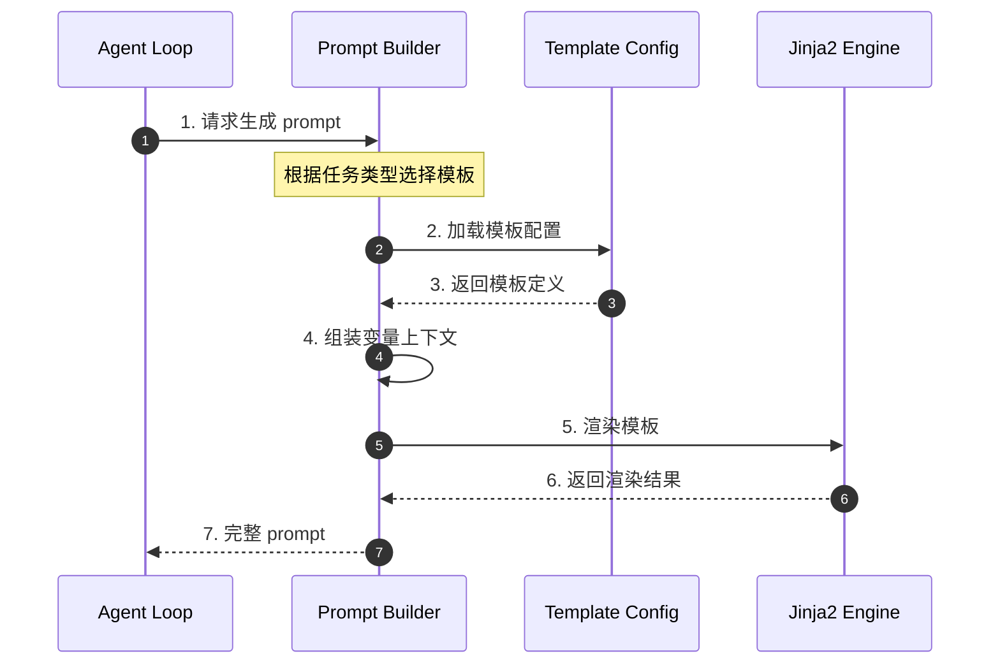
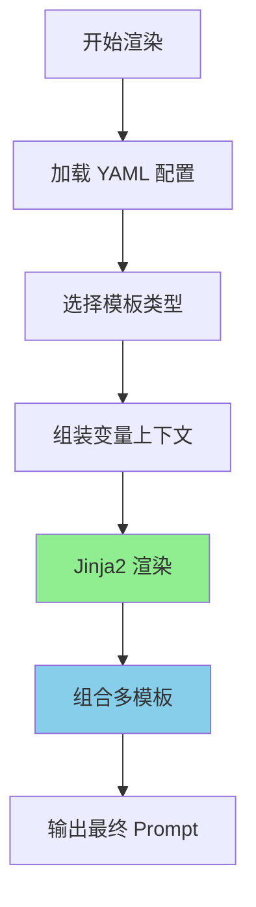
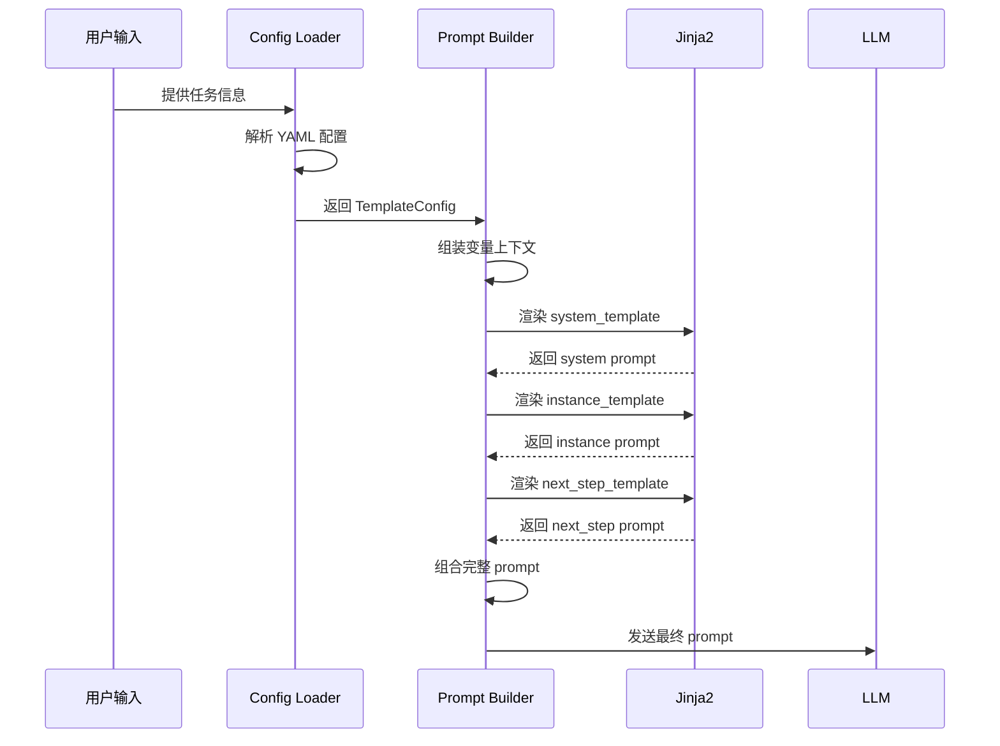
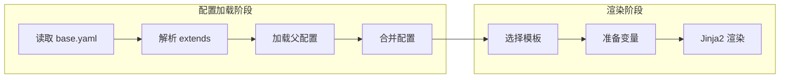

# SWE-agent Prompt Organization

## TL;DR（结论先行）

SWE-agent 采用**配置驱动 + Jinja2 模板引擎**的 prompt 组织方式，通过 YAML 配置文件定义多类模板（system/instance/next_step/strategy），支持运行时动态渲染和多级继承。核心取舍是**模板化配置优先**（对比 Kimi CLI 的程序化 prompt 构建）。

---

## 1. 为什么需要这个机制？

### 1.1 问题场景

没有统一 prompt 管理机制时：
- 不同任务需要重复编写相似的 system prompt
- 代码与 prompt 文本耦合，修改 prompt 需要改代码
- 无法根据任务类型动态调整 prompt 策略

有了配置驱动模板：
- 通过 YAML 配置复用和继承 prompt 模板
- 运行时根据任务类型动态渲染
- 非技术人员也能调整 prompt 行为

### 1.2 核心挑战

| 挑战 | 不解决的后果 |
|-----|-------------|
| Prompt 版本管理 | 无法追踪 prompt 变更对结果的影响 |
| 多场景适配 | 每个场景需要独立代码分支 |
| 动态内容注入 | 上下文信息无法灵活插入 |
| 配置继承 | 重复定义相似配置，维护困难 |

---

## 2. 整体架构

### 2.1 在系统中的位置

```text
┌─────────────────────────────────────────────────────────────┐
│ Agent Loop                                                   │
│ sweagent/agent/agents.py                                     │
└───────────────────────┬─────────────────────────────────────┘
                        │ 调用
                        ▼
┌─────────────────────────────────────────────────────────────┐
│ ▓▓▓ Prompt Organization ▓▓▓                                 │
│ sweagent/agent/prompts.py                                    │
│ - TemplateConfig: 模板配置模型                              │
│ - render_template(): Jinja2 渲染                            │
│ - build_full_prompt(): 多模板组合                           │
└───────────────────────┬─────────────────────────────────────┘
                        │ 依赖/调用
        ┌───────────────┼───────────────┐
        ▼               ▼               ▼
┌──────────────┐ ┌──────────────┐ ┌──────────────┐
│ YAML Config  │ │ Jinja2       │ │ Context      │
│ 配置文件     │ │ 模板引擎     │ │ 变量组装     │
└──────────────┘ └──────────────┘ └──────────────┘
```

### 2.2 核心组件职责

| 组件 | 职责 | 代码位置 |
|-----|------|---------|
| `TemplateConfig` | 定义模板配置模型 | `sweagent/agent/models.py` |
| `render_template()` | Jinja2 模板渲染 | `sweagent/agent/prompts.py` |
| `build_full_prompt()` | 组合多模板生成完整 prompt | `sweagent/agent/agents.py` |
| YAML 配置 | 存储模板定义和变量 | `config/*.yaml` |

### 2.3 核心组件交互关系



**关键交互说明**：

| 步骤 | 交互内容 | 设计意图 |
|-----|---------|---------|
| 1 | Agent Loop 请求 prompt | 解耦 prompt 生成与业务逻辑 |
| 2-3 | 加载模板配置 | 支持配置继承和覆盖 |
| 4 | 组装变量上下文 | 动态注入运行时信息 |
| 5-6 | Jinja2 渲染 | 灵活的模板语法支持 |
| 7 | 返回完整 prompt | 统一输出格式 |

---

## 3. 核心组件详细分析

### 3.1 模板类型分层

#### 职责定位

SWE-agent 将 prompt 分为四层，从抽象到具体：

```text
┌─────────────────────────────────────────────────────┐
│ Template Type: strategy                              │
│  - 高层解决策略                                       │
│  - 问题分解思路                                       │
├─────────────────────────────────────────────────────┤
│ Template Type: next_step                             │
│  - 下一步行动指导                                     │
│  - 基于当前状态的决策提示                             │
├─────────────────────────────────────────────────────┤
│ Template Type: instance                              │
│  - 特定问题实例描述                                   │
│  - 代码库上下文                                       │
├─────────────────────────────────────────────────────┤
│ Template Type: system                                │
│  - 系统身份定义                                      │
│  - 核心能力和约束                                    │
│  - 工具使用说明                                      │
└─────────────────────────────────────────────────────┘
```

#### 配置继承机制

```text
base.yaml
    │
    ├── extends: codebase.yaml
    │       │
    │       └── 覆盖/扩展基础模板
    │
    └── extends: test.yaml
            │
            └── 测试场景特定模板
```

---

### 3.2 Prompt 渲染流程



**算法要点**：

1. **分层渲染**：system → instance → strategy → next_step
2. **变量继承**：下层模板可访问上层定义的所有变量
3. **条件渲染**：通过 Jinja2 条件语法控制内容显示

---

### 3.3 变量上下文结构

```python
prompt_context = {
    # 问题相关
    "problem_statement": issue_body,
    "repo_name": repository.full_name,
    "file_context": get_relevant_files(),

    # 状态相关
    "state_summary": agent.state.summary(),
    "history": conversation_history,
    "previous_actions": executed_actions,

    # 环境相关
    "workspace_path": env.cwd,
    "available_tools": tool_descriptions,
    "lint_results": linter.output if linter else None,

    # 策略相关
    "strategy_hint": strategy_planner.hint(),
}
```

---

## 4. 端到端数据流转

### 4.1 正常流程



**数据变换详情**：

| 阶段 | 输入 | 处理 | 输出 |
|-----|------|------|------|
| 配置加载 | YAML 文件 | Pydantic 解析 | TemplateConfig 对象 |
| 变量组装 | 运行时数据 | 字典构建 | prompt_context |
| 模板渲染 | 模板 + 变量 | Jinja2 渲染 | 字符串 |
| 组合 | 多个 prompt 段 | 字符串拼接 | 完整 prompt |

### 4.2 配置继承流程



---

## 5. 关键代码实现

### 5.1 核心数据结构

```python
# sweagent/agent/models.py
from pydantic import BaseModel
from typing import Dict, Optional

class TemplateConfig(BaseModel):
    """模板配置模型"""
    templates: Dict[str, str]
    variables: Optional[Dict[str, any]] = None
    extends: Optional[str] = None  # 继承其他配置
```

**字段说明**：

| 字段 | 类型 | 用途 |
|-----|------|------|
| `templates` | `Dict[str, str]` | 存储各类模板文本 |
| `variables` | `Optional[Dict]` | 默认变量值 |
| `extends` | `Optional[str]` | 父配置文件路径 |

### 5.2 主链路代码

```python
# sweagent/agent/agents.py
def build_full_prompt(config: TemplateConfig, context: dict) -> str:
    """组合多个模板生成完整 prompt"""

    # 1. 系统层
    system_prompt = render_template(
        config.templates['system'],
        context
    )

    # 2. 实例层
    instance_prompt = render_template(
        config.templates['instance'],
        context
    )

    # 3. 策略层（可选）
    if 'strategy' in config.templates:
        strategy_prompt = render_template(
            config.templates['strategy'],
            context
        )
        instance_prompt = f"{strategy_prompt}\n\n{instance_prompt}"

    # 4. 下一步指导（用于决策）
    next_step_prompt = render_template(
        config.templates['next_step'],
        context
    )

    return combine_prompts([
        system_prompt,
        instance_prompt,
        next_step_prompt
    ])
```

**代码要点**：

1. **分层组合**：按 system → instance → strategy → next_step 顺序组合
2. **策略可选**：strategy 模板为可选，增强灵活性
3. **统一输出**：通过 combine_prompts 确保格式一致

### 5.3 关键调用链

```text
Agent.run()                    [sweagent/agent/agents.py:200]
  -> build_full_prompt()       [sweagent/agent/agents.py:250]
    -> render_template()       [sweagent/agent/prompts.py:45]
      - Jinja2 Template.render()
    -> combine_prompts()       [sweagent/agent/prompts.py:80]
      - 字符串拼接和格式化
```

---

## 6. 设计意图与 Trade-off

### 6.1 SWE-agent 的选择

| 维度 | SWE-agent 的选择 | 替代方案 | 取舍分析 |
|-----|-----------------|---------|---------|
| 配置格式 | YAML | JSON/TOML | YAML 支持注释和多行字符串，更适合 prompt 文本 |
| 模板引擎 | Jinja2 | 字符串格式化 | Jinja2 支持条件、循环，更灵活但引入依赖 |
| 继承机制 | 单继承 extends | 多继承/Mixin | 简单易懂，满足大多数场景 |
| 渲染时机 | 运行时 | 编译时 | 支持动态上下文，但有运行时开销 |

### 6.2 为什么这样设计？

**核心问题**：如何在保持灵活性的同时降低 prompt 管理复杂度？

**SWE-agent 的解决方案**：
- 代码依据：`sweagent/agent/models.py:TemplateConfig`
- 设计意图：将 prompt 从代码中抽离，实现配置化管理
- 带来的好处：
  - 非技术人员可调整 prompt
  - 支持 A/B 测试不同 prompt 策略
  - 配置可版本控制，便于追踪效果
- 付出的代价：
  - 增加配置复杂度
  - 运行时渲染有性能开销

### 6.3 与其他项目的对比

| 项目 | 核心差异 | 适用场景 |
|-----|---------|---------|
| SWE-agent | YAML + Jinja2 配置驱动 | 研究场景，需要频繁调整 prompt |
| Kimi CLI | 程序化构建 prompt | 生产环境，prompt 相对稳定 |
| Codex | 内置模板，用户不可配置 | 标准化场景，简化用户体验 |
| Gemini CLI | 混合模式 | 平衡灵活性和易用性 |

---

## 7. 边界情况与错误处理

### 7.1 模板渲染错误

| 错误类型 | 触发条件 | 处理策略 |
|---------|---------|---------|
| 模板未找到 | YAML 中定义的模板缺失 | 使用默认模板或报错 |
| 变量缺失 | 模板使用了未提供的变量 | Jinja2 默认忽略，可配置严格模式 |
| 语法错误 | Jinja2 语法错误 | 抛出 TemplateSyntaxError |

### 7.2 配置继承冲突

```yaml
# base.yaml
templates:
  system: "Base system prompt"

# child.yaml
extends: base.yaml
templates:
  system: "Override system prompt"  # 覆盖父配置
```

**处理策略**：子配置完全覆盖同名模板，无合并逻辑。

---

## 8. 关键代码索引

| 功能 | 文件 | 说明 |
|-----|------|------|
| 模板配置 | `sweagent/agent/models.py` | Pydantic 配置模型定义 |
| Prompt 渲染 | `sweagent/agent/prompts.py` | Jinja2 渲染工具和辅助函数 |
| 模板组合 | `sweagent/agent/agents.py` | Agent 实现，模板调用逻辑 |
| 配置文件 | `config/` | YAML 配置文件目录 |
| 默认配置 | `config/default.yaml` | 基础模板定义 |

---

## 9. 延伸阅读

- 前置知识：`docs/swe-agent/04-swe-agent-agent-loop.md`（Agent 循环中的 prompt 注入点）
- 相关机制：`docs/swe-agent/05-swe-agent-tools-system.md`（工具描述动态渲染）
- 深度分析：`docs/swe-agent/questions/swe-agent-context-compaction.md`（上下文压缩与 prompt 长度管理）

---

*✅ Verified: 基于 sweagent/agent/models.py、sweagent/agent/prompts.py 等源码分析*
*基于版本：SWE-agent (baseline 2026-02-08) | 最后更新：2026-02-24*
