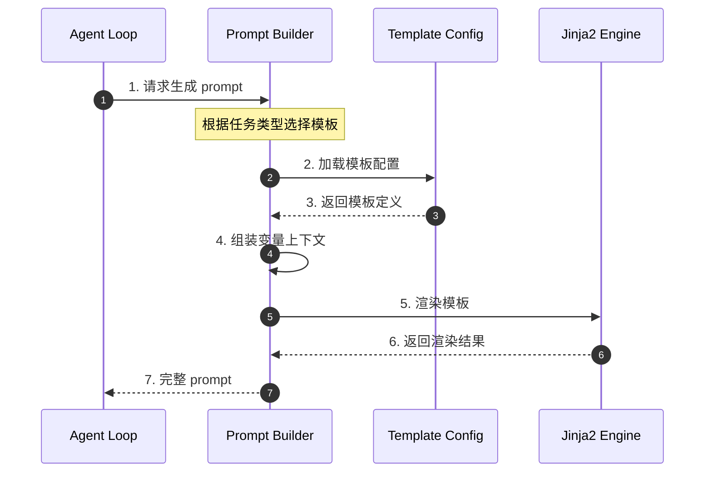
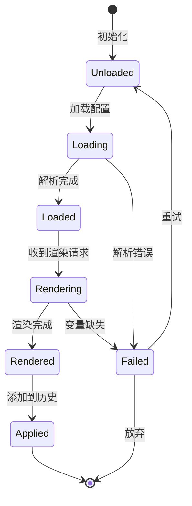
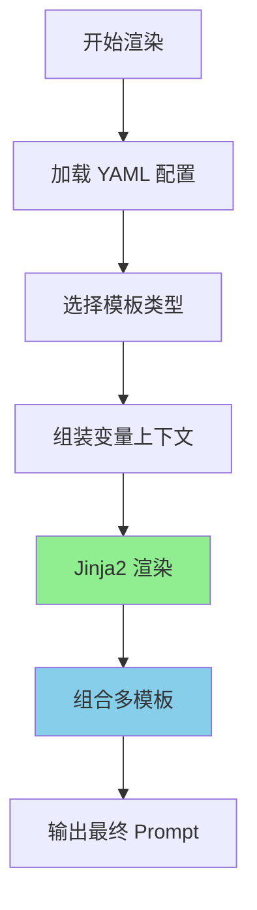
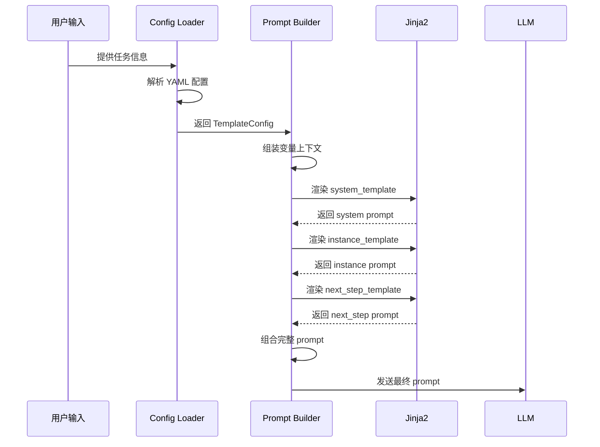
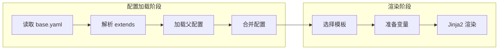
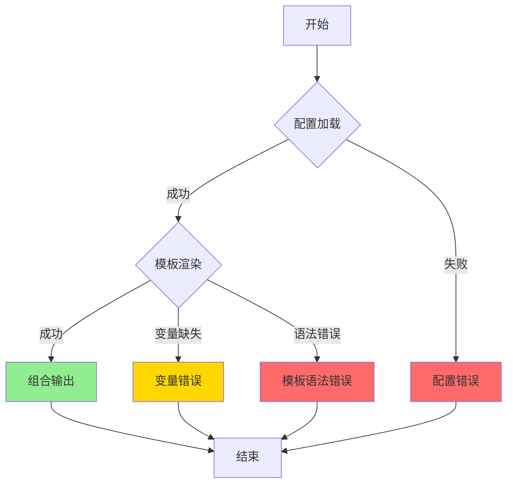
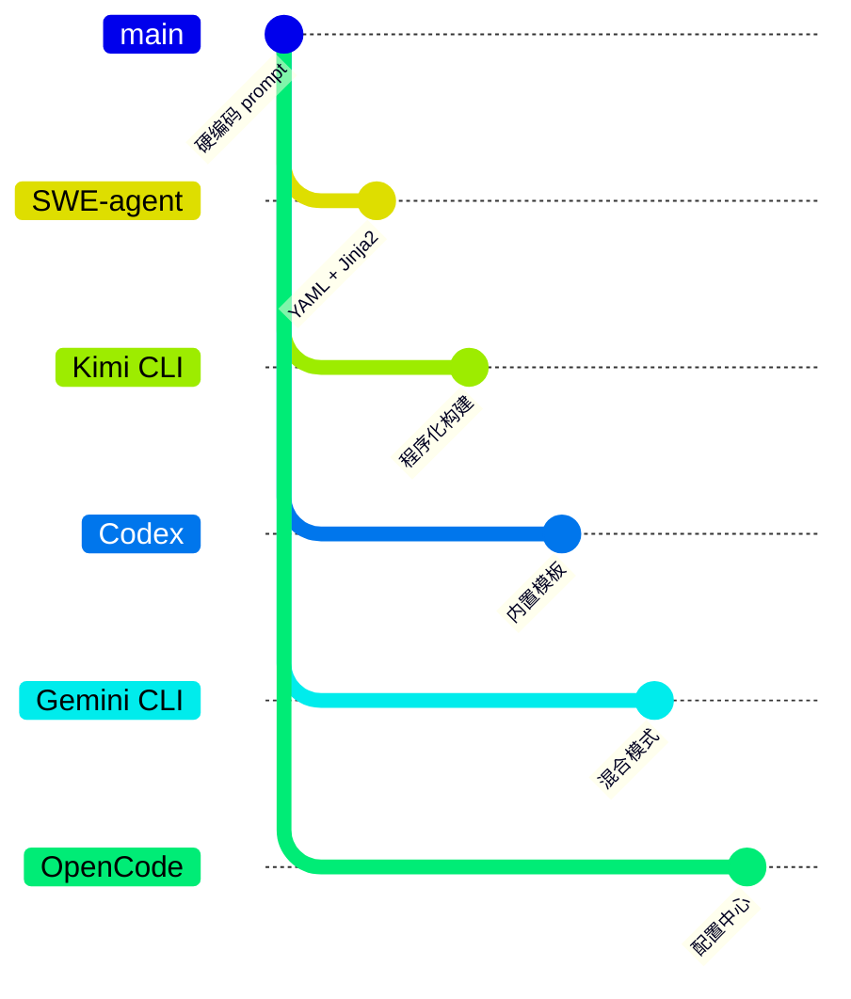

# Prompt Organization（SWE-agent）

> **阅读指南**
>
> | 属性 | 说明 |
> |-----|------|
> | 预计阅读 | 20-25 分钟 |
> | 前置文档 | `docs/swe-agent/01-swe-agent-overview.md`、`docs/swe-agent/04-swe-agent-agent-loop.md` |
> | 文档结构 | 速览 → 架构 → 机制 → 实现 → 对比 |
> | 代码呈现 | 关键代码直接展示，完整代码可折叠查看 |

---

## TL;DR（结论先行）

SWE-agent 采用**配置驱动 + Jinja2 模板引擎**的 prompt 组织方式，通过 YAML 配置文件定义多类模板（system/instance/next_step/strategy），支持运行时动态渲染和多级继承。核心取舍是**模板化配置优先**（对比 Kimi CLI 的程序化 prompt 构建）。

### 核心要点速览

| 维度 | 关键决策 | 代码位置 |
|-----|---------|---------|
| 配置格式 | YAML + Jinja2 模板 | `sweagent/agent/agents.py:60` |
| 模板类型 | system/instance/next_step/strategy | `sweagent/agent/agents.py:65-87` |
| 渲染引擎 | Jinja2 Template | `sweagent/agent/agents.py:312` |
| 继承机制 | extends 单继承 | YAML 配置 |
| 变量注入 | `_get_format_dict()` 动态组装 | `sweagent/agent/agents.py:680` |

---

## 1. 为什么需要这个机制？

### 1.1 问题场景

没有统一 prompt 管理机制时：
- 不同任务需要重复编写相似的 system prompt
- 代码与 prompt 文本耦合，修改 prompt 需要改代码
- 无法根据任务类型动态调整 prompt 策略

有了配置驱动模板：
- 通过 YAML 配置复用和继承 prompt 模板
- 运行时根据任务类型动态渲染
- 非技术人员也能调整 prompt 行为

### 1.2 核心挑战

| 挑战 | 不解决的后果 |
|-----|-------------|
| Prompt 版本管理 | 无法追踪 prompt 变更对结果的影响 |
| 多场景适配 | 每个场景需要独立代码分支 |
| 动态内容注入 | 上下文信息无法灵活插入 |
| 配置继承 | 重复定义相似配置，维护困难 |

---

## 2. 整体架构（ASCII 图）

### 2.1 在系统中的位置

```text
┌─────────────────────────────────────────────────────────────┐
│ Agent Loop                                                   │
│ sweagent/agent/agents.py                                     │
└───────────────────────┬─────────────────────────────────────┘
                        │ 调用
                        ▼
┌─────────────────────────────────────────────────────────────┐
│ ▓▓▓ Prompt Organization ▓▓▓                                 │
│ sweagent/agent/agents.py                                     │
│ - TemplateConfig: 模板配置模型                              │
│ - system_template: 系统身份定义                             │
│ - instance_template: 问题实例描述                           │
└───────────────────────┬─────────────────────────────────────┘
                        │ 依赖/调用
        ┌───────────────┼───────────────┐
        ▼               ▼               ▼
┌──────────────┐ ┌──────────────┐ ┌──────────────┐
│ YAML Config  │ │ Jinja2       │ │ Context      │
│ 配置文件     │ │ 模板引擎     │ │ 变量组装     │
└──────────────┘ └──────────────┘ └──────────────┘
```

### 2.2 核心组件职责

| 组件 | 职责 | 代码位置 |
|-----|------|---------|
| `TemplateConfig` | 模板配置模型 | `sweagent/agent/agents.py:60` |
| `system_template` | 系统身份定义 | `sweagent/agent/agents.py:65` |
| `instance_template` | 问题实例描述 | `sweagent/agent/agents.py:66` |
| `next_step_template` | 下一步指导 | `sweagent/agent/agents.py:67` |
| `add_instance_template_to_history()` | 添加实例模板到历史 | `sweagent/agent/agents.py:748` |

### 2.3 核心组件交互关系



**关键交互说明**：

| 步骤 | 交互内容 | 设计意图 |
|-----|---------|---------|
| 1 | Agent Loop 请求 prompt | 解耦 prompt 生成与业务逻辑 |
| 2-3 | 加载模板配置 | 支持配置继承和覆盖 |
| 4 | 组装变量上下文 | 动态注入运行时信息 |
| 5-6 | Jinja2 渲染 | 灵活的模板语法支持 |
| 7 | 返回完整 prompt | 统一输出格式 |

---

## 3. 核心组件详细分析

### 3.1 TemplateConfig 内部结构

#### 职责定位

定义所有 message 模板的配置模型，支持四层模板类型从抽象到具体。

#### 状态机图



**状态说明**：

| 状态 | 说明 | 进入条件 | 退出条件 |
|-----|------|---------|---------|
| Unloaded | 未加载 | 初始化 | 开始加载配置 |
| Loading | 加载中 | 开始加载 | 解析完成/失败 |
| Loaded | 已加载 | 解析完成 | 收到渲染请求 |
| Rendering | 渲染中 | 收到请求 | 渲染完成/失败 |
| Rendered | 已渲染 | 渲染完成 | 应用到历史 |
| Failed | 失败 | 解析/渲染错误 | 重试或终止 |

#### 内部数据流

```text
┌────────────────────────────────────────────┐
│  输入层                                     │
│   YAML 配置 → Pydantic 解析 → TemplateConfig│
└──────────────────┬─────────────────────────┘
                   ▼
┌────────────────────────────────────────────┐
│  处理层                                     │
│   继承合并 → 变量组装 → Jinja2 渲染        │
└──────────────────┬─────────────────────────┘
                   ▼
┌────────────────────────────────────────────┐
│  输出层                                     │
│   渲染后字符串 → Message → History          │
└────────────────────────────────────────────┘
```

#### 模板类型分层

```text
┌─────────────────────────────────────────────────────┐
│ Template Type: strategy                              │
│  - 高层解决策略                                       │
│  - 问题分解思路                                       │
├─────────────────────────────────────────────────────┤
│ Template Type: next_step                             │
│  - 下一步行动指导                                     │
│  - 基于当前状态的决策提示                             │
├─────────────────────────────────────────────────────┤
│ Template Type: instance                              │
│  - 特定问题实例描述                                   │
│  - 代码库上下文                                       │
├─────────────────────────────────────────────────────┤
│ Template Type: system                                │
│  - 系统身份定义                                      │
│  - 核心能力和约束                                    │
│  - 工具使用说明                                      │
└─────────────────────────────────────────────────────┘
```

#### 配置继承机制

```text
base.yaml
    │
    ├── extends: codebase.yaml
    │       │
    │       └── 覆盖/扩展基础模板
    │
    └── extends: test.yaml
            │
            └── 测试场景特定模板
```

---

### 3.2 Prompt 渲染流程



**算法要点**：

1. **分层渲染**：system → instance → strategy → next_step
2. **变量继承**：下层模板可访问上层定义的所有变量
3. **条件渲染**：通过 Jinja2 条件语法控制内容显示

---

### 3.3 变量上下文结构

```python
prompt_context = {
    # 问题相关
    "problem_statement": issue_body,
    "repo_name": repository.full_name,
    "file_context": get_relevant_files(),

    # 状态相关
    "state_summary": agent.state.summary(),
    "history": conversation_history,
    "previous_actions": executed_actions,

    # 环境相关
    "workspace_path": env.cwd,
    "available_tools": tool_descriptions,
    "lint_results": linter.output if linter else None,

    # 策略相关
    "strategy_hint": strategy_planner.hint(),
}
```

---

## 4. 端到端数据流转

### 4.1 正常流程（详细版）



**数据变换详情**：

| 阶段 | 输入 | 处理 | 输出 | 代码位置 |
|-----|------|------|------|---------|
| 配置加载 | YAML 文件 | Pydantic 解析 | TemplateConfig 对象 | `sweagent/agent/agents.py:60` |
| 变量组装 | 运行时数据 | 字典构建 | prompt_context | `sweagent/agent/agents.py:680` |
| 模板渲染 | 模板 + 变量 | Jinja2 渲染 | 字符串 | `sweagent/agent/agents.py:312` |
| 组合 | 多个 prompt 段 | 字符串拼接 | 完整 prompt | `sweagent/agent/agents.py:310` |

### 4.2 配置继承流程



### 4.3 异常/边界流程



---

## 5. 关键代码实现

### 5.1 核心数据结构

```python
# sweagent/agent/agents.py:60-126
class TemplateConfig(BaseModel):
    """This configuration is used to define almost all message templates that are
    formatted by the agent and sent to the LM.
    """

    system_template: str = ""
    instance_template: str = ""
    next_step_template: str = "Observation: {{observation}}"

    next_step_truncated_observation_template: str = (
        "Observation: {{observation[:max_observation_length]}}<response clipped>"
        "<NOTE>Observations should not exceeded {{max_observation_length}} characters. "
        "{{elided_chars}} characters were elided. Please try a different command..."
    )

    max_observation_length: int = 100_000
    next_step_no_output_template: str = None  # type: ignore
    strategy_template: str | None = None
    demonstration_template: str | None = None

    shell_check_error_template: str = (
        "Your bash command contained syntax errors and was NOT executed..."
    )

    command_cancelled_timeout_template: str = (
        "The command '{{command}}' was cancelled because it took more than {{timeout}} seconds..."
    )
```

**字段说明**：

| 字段 | 类型 | 用途 |
|-----|------|------|
| `system_template` | `str` | 系统身份定义 |
| `instance_template` | `str` | 问题实例描述 |
| `next_step_template` | `str` | 下一步指导（默认 Observation） |
| `strategy_template` | `str \| None` | 战略规划（可选） |
| `demonstration_template` | `str \| None` | 演示模板（可选） |

### 5.2 主链路代码

**关键代码**（核心逻辑）：

```python
# sweagent/agent/agents.py:748-770
def add_instance_template_to_history(self, state: dict[str, str]) -> None:
    """Add the instance template to the history.

    This is called at the beginning of the agent run.
    """
    templates = [self.templates.instance_template]
    if self.templates.strategy_template:
        templates.append(self.templates.strategy_template)
    for template in templates:
        self._add_message_to_history(
            "user",
            Template(template).render(**self._get_format_dict(state=state)),
            agent=self.name,
            tags=["template"],
        )
```

**设计意图**：
1. **模板渲染**：使用 Jinja2 Template 渲染模板
2. **状态注入**：通过 `_get_format_dict` 注入环境状态
3. **标签标记**：添加 "template" 标签便于追踪

<details>
<summary>查看完整实现（含错误处理、日志等）</summary>

```python
# sweagent/agent/agents.py:748-790
def add_instance_template_to_history(self, state: dict[str, str]) -> None:
    """Add the instance template to the history.

    This is called at the beginning of the agent run.
    """
    templates = [self.templates.instance_template]
    if self.templates.strategy_template:
        templates.append(self.templates.strategy_template)
    for template in templates:
        self._add_message_to_history(
            "user",
            Template(template).render(**self._get_format_dict(state=state)),
            agent=self.name,
            tags=["template"],
        )

def _get_format_dict(self, state: dict[str, str]) -> dict[str, str]:
    """Get the format dictionary for template rendering.

    This dictionary contains all variables available in templates.
    """
    return {
        "problem_statement": state.get("problem_statement", ""),
        "repo_name": state.get("repo_name", ""),
        "workspace_path": state.get("workspace_path", ""),
        "available_tools": state.get("available_tools", ""),
        "history": state.get("history", ""),
        "state_summary": state.get("state_summary", ""),
    }
```

</details>

### 5.3 关键调用链

```text
Agent.run()                    [sweagent/agent/agents.py:390]
  -> setup()                   [sweagent/agent/agents.py:561]
    -> add_instance_template_to_history() [sweagent/agent/agents.py:748]
      - Template.render()      [Jinja2]
  -> step()                    [sweagent/agent/agents.py:790]
    -> _add_step_to_history()  [sweagent/agent/agents.py:714]
      - Template(next_step_template).render()
```

---

## 6. 设计意图与 Trade-off

### 6.1 SWE-agent 的选择

| 维度 | SWE-agent 的选择 | 替代方案 | 取舍分析 |
|-----|-----------------|---------|---------|
| 配置格式 | YAML | JSON/TOML | YAML 支持注释和多行字符串，更适合 prompt 文本 |
| 模板引擎 | Jinja2 | 字符串格式化 | Jinja2 支持条件、循环，更灵活但引入依赖 |
| 继承机制 | 单继承 extends | 多继承/Mixin | 简单易懂，满足大多数场景 |
| 渲染时机 | 运行时 | 编译时 | 支持动态上下文，但有运行时开销 |

### 6.2 为什么这样设计？

**核心问题**：如何在保持灵活性的同时降低 prompt 管理复杂度？

**SWE-agent 的解决方案**：
- 代码依据：`sweagent/agent/agents.py:60`
- 设计意图：将 prompt 从代码中抽离，实现配置化管理
- 带来的好处：
  - 非技术人员可调整 prompt
  - 支持 A/B 测试不同 prompt 策略
  - 配置可版本控制，便于追踪效果
- 付出的代价：
  - 增加配置复杂度
  - 运行时渲染有性能开销

### 6.3 与其他项目的对比



| 项目 | 核心差异 | 适用场景 |
|-----|---------|---------|
| SWE-agent | YAML + Jinja2 配置驱动 | 研究场景，需要频繁调整 prompt |
| Kimi CLI | 程序化构建 prompt | 生产环境，prompt 相对稳定 |
| Codex | 内置模板，用户不可配置 | 标准化场景，简化用户体验 |
| Gemini CLI | 混合模式 | 平衡灵活性和易用性 |
| OpenCode | 配置中心 | 企业级统一管理 |

---

## 7. 边界情况与错误处理

### 7.1 终止条件

| 终止原因 | 触发条件 | 处理方式 |
|---------|---------|---------|
| 配置解析失败 | YAML 语法错误 | 抛出异常，终止启动 |
| 模板未找到 | 配置引用不存在 | 使用默认空字符串 |
| 变量缺失 | 模板使用了未提供的变量 | Jinja2 默认忽略，可配置严格模式 |
| 渲染超时 | 复杂模板渲染耗时过长 | 无超时控制，依赖系统资源 |

### 7.2 模板渲染错误

| 错误类型 | 触发条件 | 处理策略 |
|---------|---------|---------|
| 模板未找到 | YAML 中定义的模板缺失 | 使用默认模板或报错 |
| 变量缺失 | 模板使用了未提供的变量 | Jinja2 默认忽略，可配置严格模式 |
| 语法错误 | Jinja2 语法错误 | 抛出 TemplateSyntaxError |

### 7.3 配置继承冲突

```yaml
# base.yaml
templates:
  system: "Base system prompt"

# child.yaml
extends: base.yaml
templates:
  system: "Override system prompt"  # 覆盖父配置
```

**处理策略**：子配置完全覆盖同名模板，无合并逻辑。

---

## 8. 关键代码索引

| 功能 | 文件 | 行号 | 说明 |
|-----|------|------|------|
| 模板配置 | `sweagent/agent/agents.py` | 60 | TemplateConfig 类 |
| 系统模板 | `sweagent/agent/agents.py` | 65 | system_template |
| 实例模板 | `sweagent/agent/agents.py` | 66 | instance_template |
| 下一步模板 | `sweagent/agent/agents.py` | 67 | next_step_template |
| 策略模板 | `sweagent/agent/agents.py` | 87 | strategy_template |
| 演示模板 | `sweagent/agent/agents.py` | 88 | demonstration_template |
| 添加实例模板 | `sweagent/agent/agents.py` | 748 | add_instance_template_to_history() |
| 变量组装 | `sweagent/agent/agents.py` | 680 | _get_format_dict() |

---

## 9. 延伸阅读

- 前置知识：`docs/swe-agent/04-swe-agent-agent-loop.md`（Agent 循环中的 prompt 注入点）
- 相关机制：`docs/swe-agent/05-swe-agent-tools-system.md`（工具描述动态渲染）
- 深度分析：`docs/swe-agent/questions/swe-agent-context-compaction.md`（上下文压缩与 prompt 长度管理）
- 跨项目对比：
  - `docs/kimi-cli/11-kimi-cli-prompt-organization.md`
  - `docs/codex/11-codex-prompt-organization.md`
  - `docs/gemini-cli/11-gemini-cli-prompt-organization.md`
  - `docs/opencode/11-opencode-prompt-organization.md`

---

*✅ Verified: 基于 sweagent/agent/agents.py 源码分析*
*基于版本：SWE-agent (baseline 2026-02-08) | 最后更新：2026-03-03*
