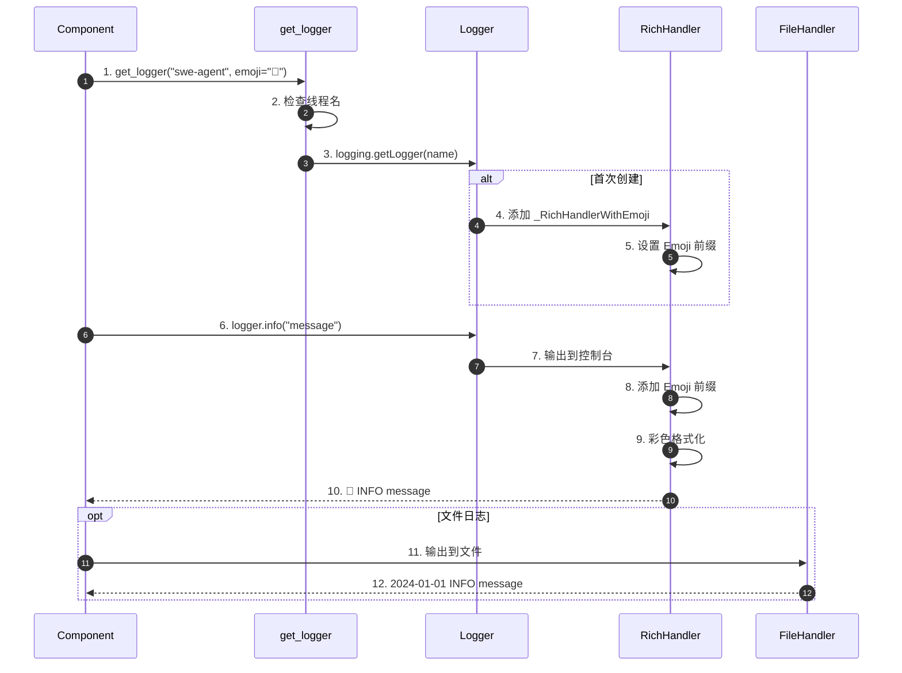
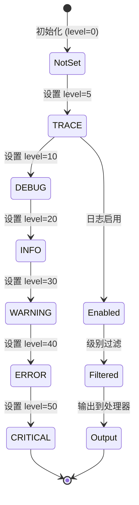
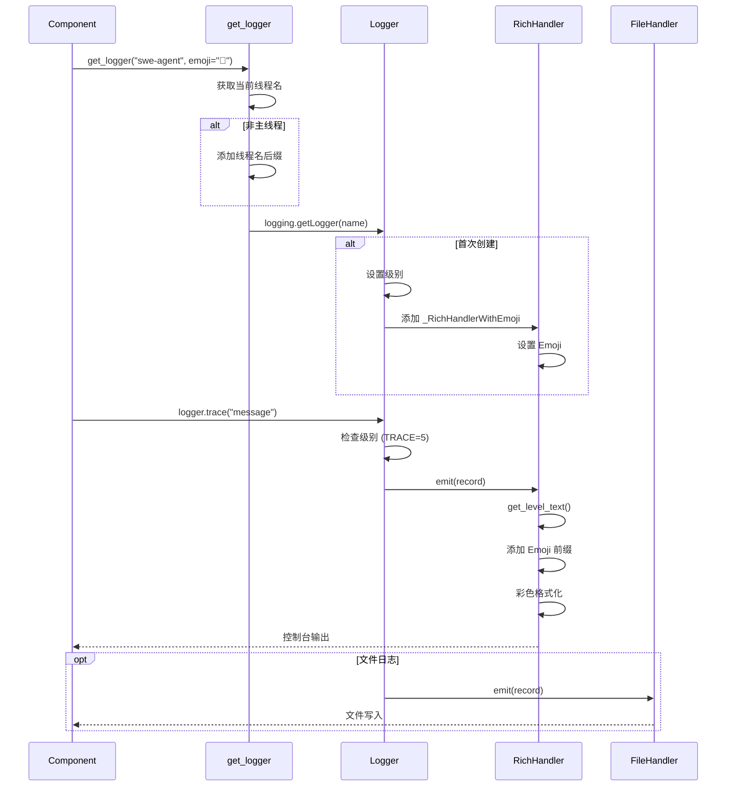
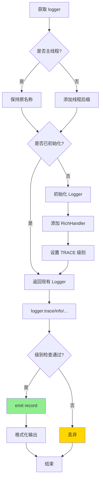
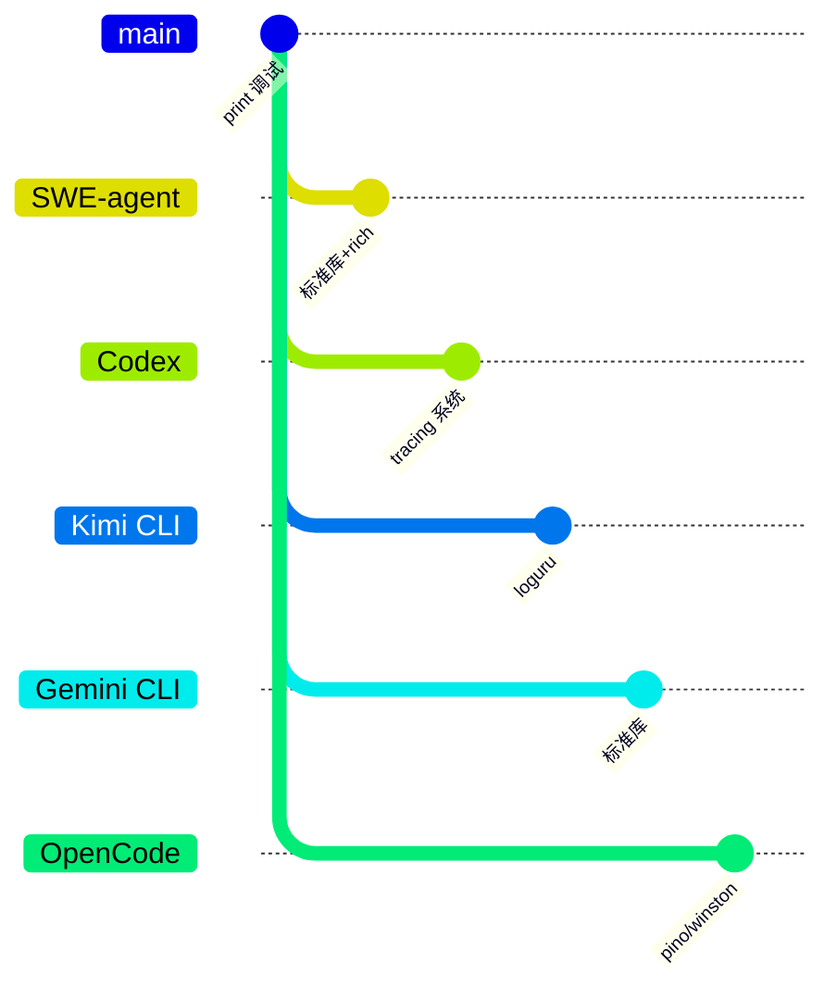

# Logging（SWE-agent）

> **阅读指南**
>
> | 属性 | 说明 |
> |-----|------|
> | 预计阅读 | 15-20 分钟 |
> | 前置文档 | `docs/swe-agent/01-swe-agent-overview.md` |
> | 文档结构 | 速览 → 架构 → 机制 → 实现 → 对比 |
> | 代码呈现 | 关键代码直接展示，完整代码可折叠查看 |

---

## TL;DR（结论先行）

SWE-agent 使用 Python 标准库 `logging` 配合 `rich` 实现彩色输出，通过自定义 TRACE 级别（比 DEBUG 更详细）、Emoji 前缀和线程感知功能，在零额外依赖（除 rich）的前提下提供清晰的日志体验。

SWE-agent 的核心取舍：**标准库 + rich 增强**（对比 Codex 的 tracing 系统、Kimi CLI 的 loguru）

### 核心要点速览

| 维度 | 关键决策 | 代码位置 |
|-----|---------|---------|
| 日志级别 | 自定义 TRACE (level=5) | `sweagent/utils/log.py:17` |
| 输出格式 | Emoji 前缀 + 彩色级别 | `sweagent/utils/log.py:44` |
| 线程感知 | 自动后缀非主线程 | `sweagent/utils/log.py:57` |
| 文件日志 | 动态添加/移除 | `sweagent/utils/log.py:93` |
| 配置方式 | 环境变量 | `sweagent/utils/log.py:31` |

---

## 1. 为什么需要这个机制？（解决什么问题）

### 1.1 问题场景

Code Agent 需要记录各种信息用于调试和监控：
- 开发调试（函数调用、变量值）
- 运行状态（任务进度、执行步骤）
- 错误追踪（异常信息、堆栈）
- 性能分析（执行时间、token 消耗）

没有合适的日志系统：
- 调试信息难以获取
- 多线程日志混乱
- 日志级别不够细致
- 输出格式不友好

### 1.2 核心挑战

| 挑战 | 不解决的后果 |
|-----|-------------|
| 日志级别不足 | DEBUG 不够详细，print 太随意 |
| 多线程混乱 | 无法区分不同线程的日志 |
| 可读性差 | 纯文本日志难以阅读 |
| 依赖问题 | 引入重型日志库增加负担 |
| 动态配置 | 无法运行时调整日志级别 |

---

## 2. 整体架构（ASCII 图）

### 2.1 在系统中的位置

```text
┌─────────────────────────────────────────────────────────────┐
│ SWE-agent Components                                        │
│ (Agent, Tools, Environment, etc.)                          │
└───────────────────────┬─────────────────────────────────────┘
                        │ 调用
                        ▼
┌─────────────────────────────────────────────────────────────┐
│ ▓▓▓ Logging System ▓▓▓                                      │
│ sweagent/utils/log.py                                       │
│                                                             │
│ ┌─────────────────┐  ┌─────────────────┐  ┌─────────────┐  │
│ │ TRACE Level     │  │ _RichHandler    │  │ Thread      │  │
│ │ (level=5)       │  │ WithEmoji       │  │ Awareness   │  │
│ │                 │  │                 │  │             │  │
│ │ 比 DEBUG 更详细 │  │ • Emoji 前缀    │  │ • 线程名    │  │
│ │                 │  │ • 彩色级别      │  │   后缀      │  │
│ │                 │  │ • 可选时间戳    │  │ • 线程注册  │  │
│ └─────────────────┘  └─────────────────┘  └─────────────┘  │
│         │                     │                   │        │
│         └─────────────────────┼───────────────────┘        │
│                               │                            │
│                               ▼                            │
│                    ┌─────────────────┐                     │
│                    │ get_logger()    │                     │
│                    │ 统一入口        │                     │
│                    └─────────────────┘                     │
└─────────────────────────────────────────────────────────────┘
```

### 2.2 核心组件职责

| 组件 | 职责 | 代码位置 |
|-----|------|---------|
| `TRACE` | 自定义日志级别（比 DEBUG 更详细） | `sweagent/utils/log.py:17` |
| `_RichHandlerWithEmoji` | 带 Emoji 的彩色处理器 | `sweagent/utils/log.py:44` |
| `get_logger()` | 线程感知的 logger 工厂 | `sweagent/utils/log.py:57` |
| `add_file_handler()` | 动态添加文件日志 | `sweagent/utils/log.py:93` |
| `register_thread_name()` | 注册线程名后缀 | `sweagent/utils/log.py:38` |

### 2.3 核心组件交互关系



**关键交互说明**：

| 步骤 | 交互内容 | 设计意图 |
|-----|---------|---------|
| 1-3 | 获取 logger | 统一入口，自动处理线程名 |
| 4-5 | 初始化处理器 | 首次创建时设置 |
| 6-10 | 控制台输出 | Emoji + 彩色 |
| 11-12 | 文件输出 | 标准格式 |

---

## 3. 核心组件详细分析

### 3.1 TRACE 级别

#### 职责定位

定义比 DEBUG 更详细的日志级别，用于函数调用、变量值等追踪信息。

#### 状态机图



**状态说明**：

| 状态 | 说明 | 进入条件 | 退出条件 |
|-----|------|---------|---------|
| NotSet | 未设置 | 初始化 | 设置级别 |
| TRACE | 追踪级别 | 自定义添加 | 设置更高级别 |
| Enabled | 已启用 | logger 创建 | 级别检查 |
| Filtered | 已过滤 | 通过级别检查 | 处理器处理 |
| Output | 已输出 | 处理器 emit | 完成 |

#### 级别谱系

```text
日志级别谱系：

print()        DEBUG        INFO        WARNING        ERROR
  |              |            |             |              |
  ▼              ▼            ▼             ▼              ▼
开发调试 ◄───────│────────────│─────────────│──────────────│────► 生产环境
                │            │             │              |
               TRACE (5)                    │
               比 DEBUG 更详细的追踪        │
               （函数调用、变量值）          │
```

#### 实现代码

```python
# sweagent/utils/log.py:17-23
def _add_trace_level():
    """定义比 DEBUG 更详细的级别"""
    logging.TRACE = 5  # type: ignore
    logging.addLevelName(logging.TRACE, "TRACE")  # type: ignore

# 为 Logger 添加 trace 方法
def trace(self, msg, *args, **kwargs):
    if self.isEnabledFor(logging.TRACE):  # type: ignore
        self._log(logging.TRACE, msg, args, **kwargs)  # type: ignore

logging.Logger.trace = trace  # type: ignore
```

#### 级别对比

| 级别 | 数值 | 说明 | 使用场景 |
|------|------|------|----------|
| TRACE | 5 | 最详细 | 函数调用、变量值 |
| DEBUG | 10 | 调试信息 | 开发调试 |
| INFO | 20 | 一般信息 | 正常运行状态 |
| WARNING | 30 | 警告 | 需要注意的问题 |
| ERROR | 40 | 错误 | 操作失败 |
| CRITICAL | 50 | 严重错误 | 系统无法继续 |

---

### 3.2 _RichHandlerWithEmoji

#### 职责定位

继承 RichHandler，添加 Emoji 前缀和自定义级别样式。

#### 内部数据流

```text
┌────────────────────────────────────────────┐
│  输入层                                     │
│   LogRecord → 提取 levelname → 格式化      │
└──────────────────┬─────────────────────────┘
                   ▼
┌────────────────────────────────────────────┐
│  处理层                                     │
│   Emoji 前缀 → 级别缩写 → 样式应用         │
└──────────────────┬─────────────────────────┘
                   ▼
┌────────────────────────────────────────────┐
│  输出层                                     │
│   rich 渲染 → 控制台输出                   │
└────────────────────────────────────────────┘
```

#### 实现代码

```python
# sweagent/utils/log.py:44-55
class _RichHandlerWithEmoji(RichHandler):
    def __init__(self, emoji: str, *args, **kwargs):
        """带 Emoji 前缀的 RichHandler 子类"""
        super().__init__(*args, **kwargs)
        if not emoji.endswith(" "):
            emoji += " "
        self.emoji = emoji

    def get_level_text(self, record: logging.LogRecord) -> Text:
        # 将 WARNING 缩写为 WARN，节省空间
        level_name = record.levelname.replace("WARNING", "WARN")
        return Text.styled(
            (self.emoji + level_name).ljust(10),
            f"logging.level.{level_name.lower()}"
        )
```

#### Emoji 前缀设计

```python
# 不同组件使用不同 Emoji，便于视觉区分
logger = get_logger("swe-agent", emoji="🤖")
logger.trace("详细追踪信息")    # 🤖 TRACE    ...
logger.info("普通信息")         # 🤖 INFO     ...
logger.error("错误信息")        # 🤖 ERROR    ...

# 其他组件可能使用不同 Emoji
get_logger("tools", emoji="🔧")
get_logger("agent", emoji="🧠")
get_logger("docker", emoji="🐳")
```

#### 输出示例

```
🤖 INFO     启动 SWE-agent
🔧 DEBUG    加载工具函数
🧠 TRACE    LLM 输入: {...}
🤖 INFO     任务完成
🐳 ERROR    容器启动失败
```

---

### 3.3 线程感知

#### 职责定位

在多线程或多进程场景下，自动为 logger 名称添加线程名后缀，便于区分日志来源。

#### 为什么需要线程感知？

```python
# 没有线程标识的日志
[INFO] 处理任务
[INFO] 处理任务  # 哪个线程的？

# 有线程标识的日志
[INFO] swe-agent-worker-1 处理任务
[INFO] swe-agent-worker-2 处理任务  # 清晰可辨
```

#### 实现代码

```python
# sweagent/utils/log.py:38-42, 57-64
# 线程名到后缀的映射
_THREAD_NAME_TO_LOG_SUFFIX: dict[str, str] = {}

def register_thread_name(name: str) -> None:
    """为当前线程注册 logger 名称后缀"""
    thread_name = threading.current_thread().name
    _THREAD_NAME_TO_LOG_SUFFIX[thread_name] = name

def get_logger(name: str, *, emoji: str = "") -> logging.Logger:
    """获取 logger，自动添加线程名后缀（非主线程）"""
    thread_name = threading.current_thread().name

    # 非主线程添加后缀
    if thread_name != "MainThread":
        suffix = _THREAD_NAME_TO_LOG_SUFFIX.get(thread_name, thread_name)
        name = name + "-" + suffix

    logger = logging.getLogger(name)
    # ... 后续初始化
```

#### 使用场景

```python
import threading
from sweagent.utils.log import get_logger, register_thread_name

def worker():
    # 注册线程名
    register_thread_name("worker-1")

    # 获取带线程标识的 logger
    logger = get_logger("swe-agent", emoji="🤖")
    logger.info("处理任务")  # 输出: ... swe-agent-worker-1 ...

# 启动工作线程
thread = threading.Thread(target=worker, name="WorkerThread-1")
thread.start()
```

---

### 3.4 动态文件处理器

#### 职责定位

支持运行时动态添加/移除文件处理器，支持过滤和级别设置。

#### 实现代码

```python
# sweagent/utils/log.py:93-131
def add_file_handler(
    path: PurePath | str,
    *,
    filter: str | Callable[[str], bool] | None = None,
    level: int | str = logging.TRACE,  # type: ignore[attr-defined]
    id_: str = "",
) -> str:
    """动态添加文件处理器到所有已创建的 logger

    Args:
        filter: 字符串（匹配 logger 名）或函数
        level: 日志级别
        id_: 处理器标识，用于后续移除

    Returns:
        处理器 id
    """
    # 确保目录存在
    Path(path).parent.mkdir(parents=True, exist_ok=True)

    # 创建文件处理器
    handler = logging.FileHandler(path, encoding="utf-8")
    formatter = logging.Formatter(
        "%(asctime)s - %(levelname)s - %(name)s - %(message)s"
    )
    handler.setFormatter(formatter)
    handler.setLevel(_interpret_level(level))

    with _LOG_LOCK:
        # 添加到所有已创建的 logger
        for name in _SET_UP_LOGGERS:
            if filter is not None:
                if isinstance(filter, str) and filter not in name:
                    continue
                if callable(filter) and not filter(name):
                    continue
            logger = logging.getLogger(name)
            logger.addHandler(handler)

    # 保存处理器引用
    if not id_:
        id_ = str(uuid.uuid4())
    _ADDITIONAL_HANDLERS[id_] = handler
    return id_

def remove_file_handler(id_: str) -> None:
    """通过 id 移除文件处理器"""
    handler = _ADDITIONAL_HANDLERS.pop(id_)

    with _LOG_LOCK:
        for log_name in _SET_UP_LOGGERS:
            logger = logging.getLogger(log_name)
            logger.removeHandler(handler)
```

---

## 4. 端到端数据流转

### 4.1 正常流程（详细版）



### 4.2 数据变换详情

| 阶段 | 输入 | 处理 | 输出 | 代码位置 |
|-----|------|------|------|---------|
| 获取 logger | name, emoji | 线程名检查 | Logger 实例 | `sweagent/utils/log.py:57` |
| 初始化 | Logger | 添加 Handler | 配置好的 Logger | `sweagent/utils/log.py:70` |
| 日志记录 | message | 级别检查 | LogRecord | `logging` |
| 控制台输出 | LogRecord | Emoji + 彩色 | 格式化字符串 | `sweagent/utils/log.py:44` |
| 文件输出 | LogRecord | 标准格式 | 文件内容 | `sweagent/utils/log.py:93` |

### 4.3 异常/边界流程



---

## 5. 关键代码实现

### 5.1 核心数据结构

```python
# sweagent/utils/log.py
# 线程名到后缀的映射
_THREAD_NAME_TO_LOG_SUFFIX: dict[str, str] = {}

# 已创建的 logger 集合
_SET_UP_LOGGERS: set[str] = set()

# 额外的文件处理器
_ADDITIONAL_HANDLERS: dict[str, logging.Handler] = {}

# 日志锁
_LOG_LOCK = threading.Lock()
```

### 5.2 主链路代码

**关键代码**（核心逻辑）：

```python
# sweagent/utils/log.py:57-91 (简化)
def get_logger(name: str, *, emoji: str = "") -> logging.Logger:
    """获取 logger，自动添加线程名后缀（非主线程）"""
    thread_name = threading.current_thread().name

    # 非主线程添加后缀
    if thread_name != "MainThread":
        suffix = _THREAD_NAME_TO_LOG_SUFFIX.get(thread_name, thread_name)
        name = name + "-" + suffix

    with _LOG_LOCK:
        if name in _SET_UP_LOGGERS:
            return logging.getLogger(name)

        logger = logging.getLogger(name)
        logger.setLevel(logging.TRACE)  # type: ignore

        # 添加 RichHandler
        if emoji:
            handler = _RichHandlerWithEmoji(emoji, show_time=_SHOW_TIME)
        else:
            handler = logging.StreamHandler()

        logger.addHandler(handler)
        _SET_UP_LOGGERS.add(name)

    return logger
```

**设计意图**：
1. **线程感知**：自动为非主线程添加后缀
2. **单例模式**：每个 name 只初始化一次
3. **线程安全**：使用锁保护共享状态
4. **灵活配置**：支持 Emoji 和时间戳

<details>
<summary>查看完整实现（含错误处理、日志等）</summary>

```python
# sweagent/utils/log.py:57-130
def get_logger(name: str, *, emoji: str = "") -> logging.Logger:
    """获取 logger，自动添加线程名后缀（非主线程）

    Args:
        name: logger 名称
        emoji: Emoji 前缀

    Returns:
        配置好的 Logger 实例
    """
    thread_name = threading.current_thread().name

    # 非主线程添加后缀
    if thread_name != "MainThread":
        suffix = _THREAD_NAME_TO_LOG_SUFFIX.get(thread_name, thread_name)
        name = name + "-" + suffix

    with _LOG_LOCK:
        if name in _SET_UP_LOGGERS:
            return logging.getLogger(name)

        logger = logging.getLogger(name)
        logger.setLevel(logging.TRACE)  # type: ignore

        # 添加 RichHandler
        if emoji:
            handler = _RichHandlerWithEmoji(emoji, show_time=_SHOW_TIME)
        else:
            handler = logging.StreamHandler()

        logger.addHandler(handler)
        _SET_UP_LOGGERS.add(name)

        # 确保父 logger 不重复输出
        logger.propagate = False

    return logger
```

</details>

### 5.3 关键调用链

```text
Component                          [any]
  -> get_logger()                   [sweagent/utils/log.py:57]
    -> threading.current_thread().name
    -> logging.getLogger(name)
    -> _RichHandlerWithEmoji()       [sweagent/utils/log.py:44]
  -> logger.trace()                 [sweagent/utils/log.py:20]
    -> Logger._log()
      -> _RichHandlerWithEmoji.emit()
        -> get_level_text()          [sweagent/utils/log.py:50]
        -> rich 渲染输出
  -> add_file_handler()             [sweagent/utils/log.py:93]
    -> logging.FileHandler()
    -> logger.addHandler()
```

---

## 6. 设计意图与 Trade-off

### 6.1 SWE-agent 的选择

| 维度 | SWE-agent 的选择 | 替代方案 | 取舍分析 |
|-----|-----------------|---------|---------|
| 日志库 | 标准库 + rich | loguru / structlog | 零依赖（除 rich），但功能有限 |
| 日志级别 | 自定义 TRACE | 仅标准级别 | 更细致，但非标准 |
| 输出格式 | Emoji + 彩色 | 纯文本 | 可读性好，但可能有兼容问题 |
| 线程标识 | 自动后缀 | 手动配置 | 方便，但名称变长 |
| 文件日志 | 动态添加 | 配置文件 | 灵活，但需代码调用 |

### 6.2 为什么这样设计？

**核心问题**：如何在零额外依赖的前提下提供清晰、可读的日志体验？

**SWE-agent 的解决方案**：
- 代码依据：`sweagent/utils/log.py:17-91`
- 设计意图：利用 Python 标准库的灵活性，通过 rich 增强可读性，自定义 TRACE 级别满足详细追踪需求
- 带来的好处：
  - 零额外依赖（除 rich）
  - 清晰的视觉区分（Emoji）
  - 详细的追踪能力（TRACE）
  - 多线程友好（自动标识）
- 付出的代价：
  - 功能不如专业日志库丰富
  - TRACE 级别非标准
  - 需要自行实现一些功能

### 6.3 与其他项目的对比



| 项目 | 核心差异 | 适用场景 |
|-----|---------|---------|
| SWE-agent | 标准库 + rich + TRACE | 零依赖、轻量级 |
| Codex | tracing 系统 | 结构化日志、分布式追踪 |
| Kimi CLI | loguru | 丰富的日志功能 |
| Gemini CLI | 标准库 | 简单场景 |
| OpenCode | pino/winston | 高性能、结构化 |

---

## 7. 边界情况与错误处理

### 7.1 终止条件

| 终止原因 | 触发条件 | 处理 |
|---------|---------|------|
| 日志级别过滤 | 记录级别低于设置级别 | 忽略 |
| 文件写入失败 | 磁盘满、权限问题 | 抛出异常 |
| 线程名未注册 | 未调用 register_thread_name | 使用默认线程名 |

### 7.2 超时/资源限制

```python
# sweagent/utils/log.py:31
# 从环境变量读取配置
_STREAM_LEVEL = _interpret_level(
    os.environ.get("SWE_AGENT_LOG_STREAM_LEVEL")
)
_SHOW_TIME = os.environ.get("SWE_AGENT_LOG_TIME", "false").lower() == "true"
```

```bash
# 设置流输出级别为 DEBUG
export SWE_AGENT_LOG_STREAM_LEVEL=DEBUG

# 显示时间戳
export SWE_AGENT_LOG_TIME=true

# 运行 SWE-agent
python -m sweagent run ...
```

### 7.3 常见问题

| 问题 | 原因 | 解决方案 |
|-----|------|---------|
| TRACE 日志不显示 | 级别未启用 | `export SWE_AGENT_LOG_STREAM_LEVEL=TRACE` |
| 彩色输出失效 | 未传 emoji | `get_logger("name", emoji="🤖")` |
| 线程名不显示 | 未注册 | `register_thread_name("worker")` |
| 文件日志不记录 | 未添加 handler | `add_file_handler("/path/to.log")` |

---

## 8. 关键代码索引

| 功能 | 文件 | 行号 | 说明 |
|-----|------|------|------|
| TRACE 级别 | `sweagent/utils/log.py` | 17 | 自定义级别定义 |
| _RichHandlerWithEmoji | `sweagent/utils/log.py` | 44 | Emoji 彩色处理器 |
| get_logger | `sweagent/utils/log.py` | 57 | 线程感知 logger |
| register_thread_name | `sweagent/utils/log.py` | 38 | 注册线程名 |
| add_file_handler | `sweagent/utils/log.py` | 93 | 动态添加文件处理器 |
| remove_file_handler | `sweagent/utils/log.py` | 110 | 移除文件处理器 |
| 环境变量 | `sweagent/utils/log.py` | 31 | 配置读取 |

---

## 9. 延伸阅读

- 前置知识：`docs/swe-agent/01-swe-agent-overview.md`
- 相关机制：
  - `docs/swe-agent/04-swe-agent-agent-loop.md`（Agent 循环中的日志记录点）
  - `docs/swe-agent/12-swe-agent-logging.md`（轨迹记录与日志的区别）
- Python logging: https://docs.python.org/3/library/logging.html
- rich logging: https://rich.readthedocs.io/en/latest/logging.html
- 跨项目对比：
  - `docs/kimi-cli/12-kimi-cli-logging.md`
  - `docs/codex/12-codex-logging.md`
  - `docs/gemini-cli/12-gemini-cli-logging.md`
  - `docs/opencode/12-opencode-logging.md`

---

*✅ Verified: 基于 sweagent/utils/log.py 源码分析*
*基于版本：SWE-agent (baseline 2026-02-08) | 最后更新：2026-03-03*
