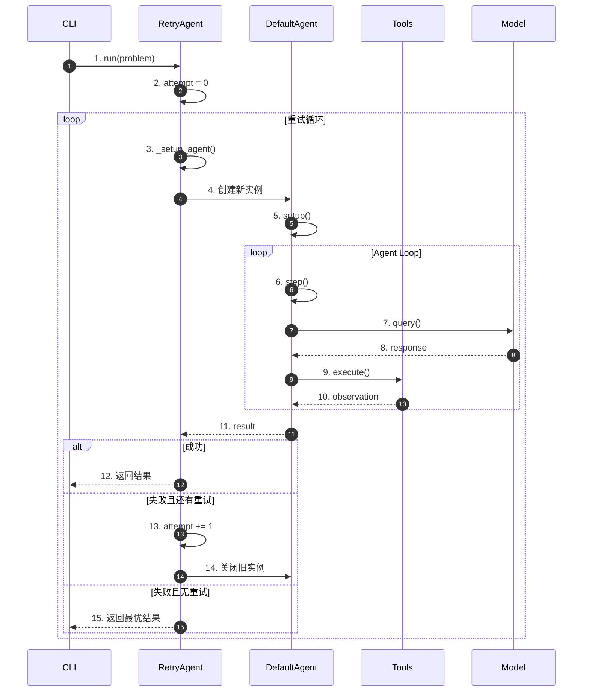
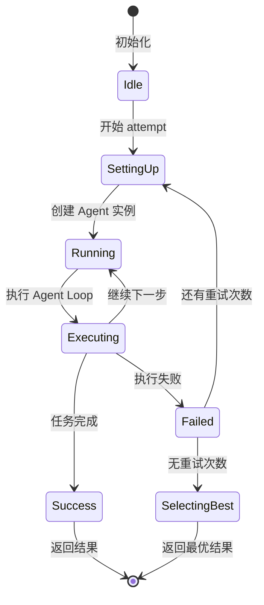
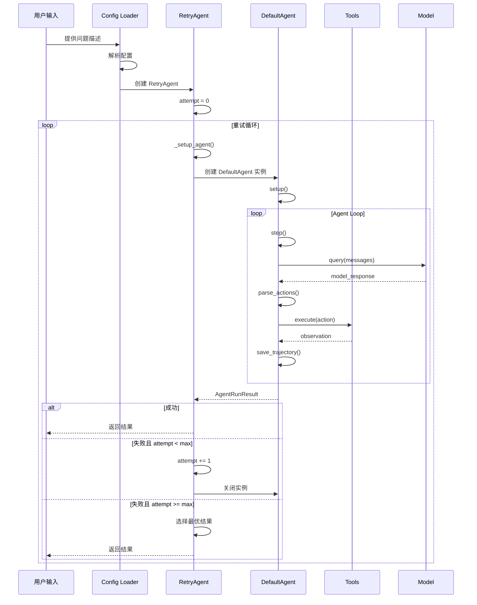
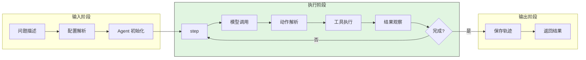
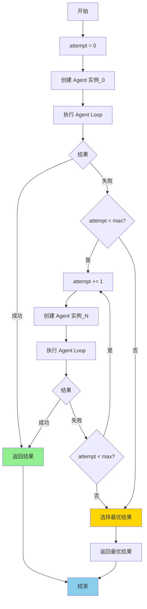
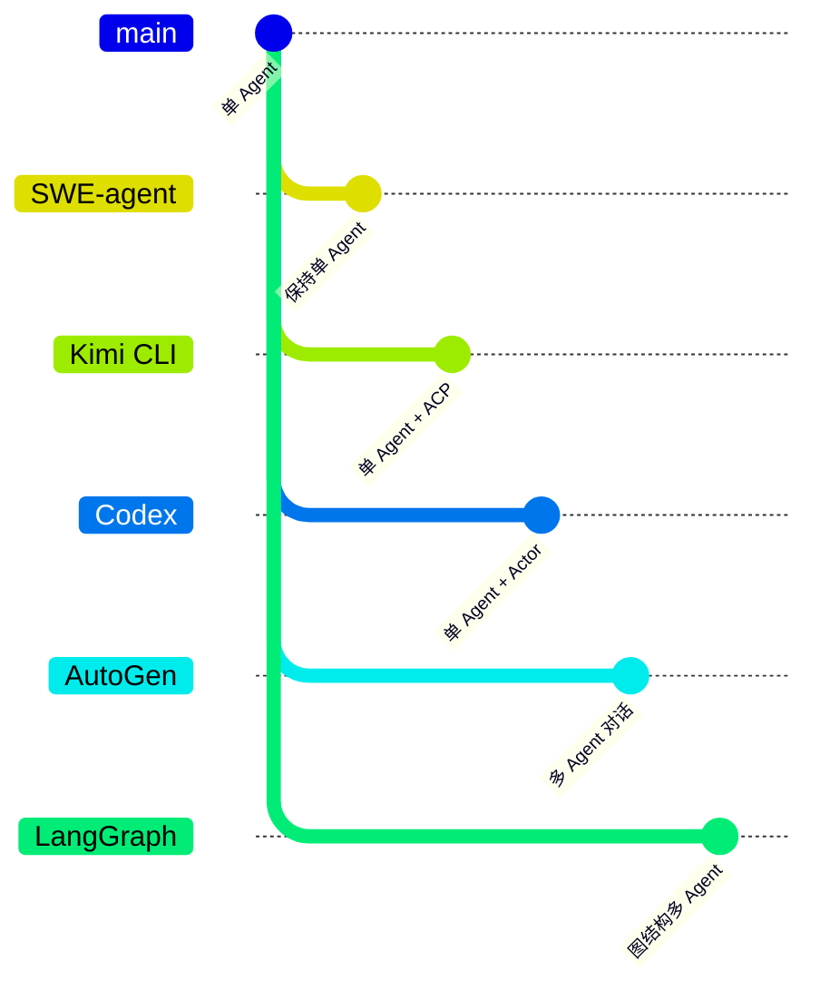
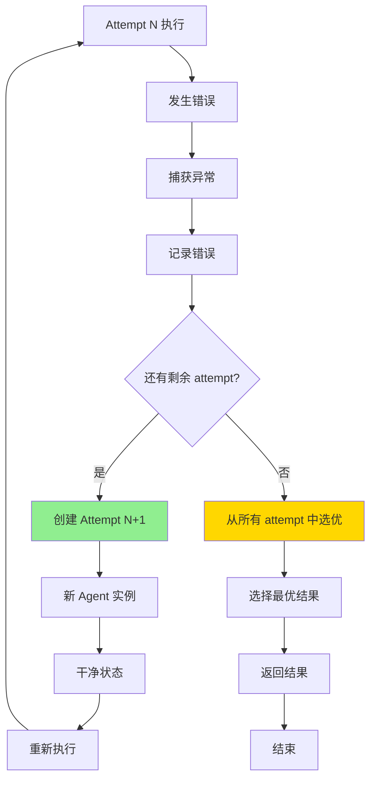

# ACP / 多 Agent 协作机制（SWE-agent）

> **阅读指南**
>
> | 属性 | 说明 |
> |-----|------|
> | 预计阅读 | 20-25 分钟 |
> | 前置文档 | `docs/swe-agent/01-swe-agent-overview.md`、`docs/swe-agent/04-swe-agent-agent-loop.md` |
> | 文档结构 | 速览 → 架构 → 机制 → 实现 → 对比 |
> | 代码呈现 | 关键代码直接展示，完整代码可折叠查看 |

---

## TL;DR（结论先行）

**SWE-agent 不支持 ACP (Agent Client Protocol)，采用严格的单 Agent 架构。** 代码库中不存在多 Agent 协作、子 Agent 创建、Agent 间通信或远程 Agent 调用的任何实现。`RetryAgent` 虽然包含"子 Agent"概念，但这只是同一 Agent 配置的多次实例化用于重试机制，而非真正的多 Agent 协作。

### 核心要点速览

| 维度 | 关键决策 | 代码位置 |
|-----|---------|---------|
| 架构模式 | 严格单 Agent | `sweagent/agent/agents.py:443` |
| 重试机制 | RetryAgent 顺序实例化 | `sweagent/agent/agents.py:257` |
| 人机协作 | ShellAgent 模式切换 | `sweagent/agent/extra/shell_agent.py:13` |
| ACP 支持 | 不支持 | 全局搜索无相关代码 |
| 设计哲学 | 可复现性优先 | 学术研究场景 |

---

## 1. 为什么需要这个机制

### 1.1 ACP 的定义与价值

ACP (Agent Client Protocol) 主要解决的是"客户端（IDE/TUI）如何与 Agent 标准化通信"，也可为多 Agent 系统提供统一会话与能力协商接口：

| 能力 | 说明 | 典型场景 |
|-----|------|---------|
| 多 Agent 协作 | 多个 Agent 分工完成复杂任务 | 代码审查 Agent + 编码 Agent |
| 子 Agent 委派 | 父 Agent 创建子 Agent 处理子任务 | 需求分析子任务 |
| 远程 Agent 调用 | 通过网络调用外部 Agent 服务 | 分布式 Agent 系统 |
| Agent 服务化 | 将 Agent 暴露为可调用的服务 | API 接口封装 |

### 1.2 SWE-agent 的设计选择

SWE-agent 专注于**单 Agent 解决软件工程任务**（特别是 GitHub Issue 修复），其设计哲学是：

- **单一职责**：一个 Agent 完成从问题理解到补丁生成的完整流程
- **确定性执行**：避免多 Agent 协作带来的不确定性
- **可复现性**：通过 trajectory 记录完整执行过程

---

## 2. 整体架构（ASCII 图）

### 2.1 在系统中的位置

```text
┌─────────────────────────────────────────────────────────────┐
│ CLI 入口                                                    │
│ sweagent/__main__.py                                        │
└───────────────────────┬─────────────────────────────────────┘
                        │
                        ▼
┌─────────────────────────────────────────────────────────────┐
│ ▓▓▓ Run Layer ▓▓▓                                           │
│ sweagent/run/                                               │
│ - run_single.py: 单实例运行（一个 Agent）                   │
│ - run_batch.py:  批量运行（多个独立 Agent 实例）            │
└───────────────────────┬─────────────────────────────────────┘
                        │
                        ▼
┌─────────────────────────────────────────────────────────────┐
│ ▓▓▓ Agent Layer（单层） ▓▓▓                                 │
│ sweagent/agent/agents.py                                    │
│                                                             │
│ ┌─────────────────────────────────────────────────────────┐ │
│ │ RetryAgent（包装器）                                    │ │
│ │ - 管理多次 attempt                                      │ │
│ │ - 每次 attempt 创建新的 DefaultAgent 实例               │ │
│ │ - ⚠️ 注意：这不是多 Agent 协作，而是同一配置的重试      │ │
│ └───────────────────────┬─────────────────────────────────┘ │
│                         │ 创建新实例（非并发）              │
│                         ▼                                   │
│ ┌─────────────────────────────────────────────────────────┐ │
│ │ DefaultAgent（核心）                                    │ │
│ │ - 单 Agent 执行循环                                     │ │
│ │ - 无子 Agent 能力                                       │ │
│ │ - 无远程调用能力                                        │ │
│ └─────────────────────────────────────────────────────────┘ │
└───────────────────────┬─────────────────────────────────────┘
                        │
        ┌───────────────┼───────────────┐
        ▼               ▼               ▼
┌──────────────┐ ┌──────────────┐ ┌──────────────┐
│ Tools Layer  │ │ Model Layer  │ │ Environment  │
│ 工具执行     │ │ 模型调用     │ │ 沙箱环境     │
└──────────────┘ └──────────────┘ └──────────────┘
```

### 2.2 核心组件职责

| 组件 | 职责 | 代码位置 | ACP 相关 |
|-----|------|---------|---------|
| `DefaultAgent` | 单 Agent 执行核心 | `sweagent/agent/agents.py:443` | 无多 Agent 能力 |
| `RetryAgent` | 重试包装器 | `sweagent/agent/agents.py:257` | 顺序实例化，非协作 |
| `ShellAgent` | 人机交互模式 | `sweagent/agent/extra/shell_agent.py:13` | 仅支持人机切换 |
| `AbstractAgent` | Agent 抽象基类 | `sweagent/agent/agents.py:224` | 无通信接口 |

### 2.3 核心组件交互关系



**关键交互说明**：

| 步骤 | 交互内容 | 设计意图 |
|-----|---------|---------|
| 1-2 | 启动重试循环 | 初始化 attempt 计数 |
| 3-5 | 创建新 Agent 实例 | 每次重试使用干净状态 |
| 6-10 | 单 Agent 执行循环 | 标准的 Agent Loop |
| 11-15 | 结果判断与重试 | 顺序执行，非并发 |

---

## 3. 核心组件详细分析

### 3.1 RetryAgent：重试机制而非多 Agent

#### 职责定位

管理多次 attempt，每次创建新的 DefaultAgent 实例用于重试，**不是多 Agent 协作**。

#### 状态机图



**状态说明**：

| 状态 | 说明 | 进入条件 | 退出条件 |
|-----|------|---------|---------|
| Idle | 空闲 | 初始化 | 开始运行 |
| SettingUp | 设置中 | 开始新 attempt | Agent 创建完成 |
| Running | 运行中 | Agent 就绪 | 开始执行 |
| Executing | 执行中 | Agent Loop 运行 | 完成/失败 |
| Success | 成功 | 任务完成 | 返回结果 |
| Failed | 失败 | 执行失败 | 重试或终止 |
| SelectingBest | 选优 | 所有 attempt 完成 | 返回最优 |

#### 内部数据流

```text
┌────────────────────────────────────────────┐
│  输入层                                     │
│   问题描述 → 配置选择 → attempt 计数       │
└──────────────────┬─────────────────────────┘
                   ▼
┌────────────────────────────────────────────┐
│  处理层                                     │
│   创建实例 → 执行循环 → 结果判断           │
└──────────────────┬─────────────────────────┘
                   ▼
┌────────────────────────────────────────────┐
│  输出层                                     │
│   成功结果 / 失败结果 / 最优选择           │
└────────────────────────────────────────────┘
```

#### 实现代码

```python
# sweagent/agent/agents.py:303-319
class RetryAgent(AbstractAgent):
    def _setup_agent(self) -> AbstractAgent:
        """Setup the agent for the current attempt."""
        # 从配置中选择 agent 配置（支持多配置轮换）
        agent_config = self.config.agent_configs[self._i_attempt % len(self.config.agent_configs)]

        # 创建新的 DefaultAgent 实例
        self._agent = DefaultAgent.from_config(agent_config)

        # 设置输出目录（按 attempt 分离）
        sub_agent_output_dir = self._output_dir / f"attempt_{self._i_attempt}"

        self._agent.setup(env=self._env, problem_statement=self._problem_statement, output_dir=sub_agent_output_dir)
        return self._agent
```

**关键特征**：

| 特征 | 说明 | 与多 Agent 的区别 |
|-----|------|------------------|
| 顺序执行 | 每次只有一个 Agent 实例运行 | 非并发协作 |
| 状态隔离 | 每次 attempt 创建新实例 | 无状态共享 |
| 相同配置 | 使用相同配置创建实例 | 非不同角色 Agent |
| 结果选优 | 从多次尝试中选择最优结果 | 非协作生成结果 |

---

### 3.2 DefaultAgent：严格单 Agent 实现

#### 职责定位

纯单 Agent 执行核心，无任何多 Agent 或远程调用能力。

#### 实现代码

```python
# sweagent/agent/agents.py:1265-1294
class DefaultAgent(AbstractAgent):
    def run(
        self,
        env: SWEEnv,
        problem_statement: ProblemStatement | ProblemStatementConfig,
        output_dir: Path = Path("."),
    ) -> AgentRunResult:
        """Run the agent on a problem instance."""
        self.setup(env=env, problem_statement=problem_statement, output_dir=output_dir)

        # Run action/observation loop
        self._chook.on_run_start()
        step_output = StepOutput()
        while not step_output.done:
            step_output = self.step()  # 单 Agent 执行单步
            self.save_trajectory()
        self._chook.on_run_done(trajectory=self.trajectory, info=self.info)

        return AgentRunResult(info=data["info"], trajectory=data["trajectory"])
```

**无以下任何 ACP 相关能力**：

- 无子 Agent 创建接口
- 无 Agent 间消息传递
- 无远程 Agent 调用
- 无 Agent 服务化封装

---

### 3.3 ShellAgent：人机交互而非 Agent 协作

#### 职责定位

仅支持人机模式切换，不是 Agent 间协作。

#### 实现代码

```python
# sweagent/agent/extra/shell_agent.py:31-56
class ShellAgent(DefaultAgent):
    def human_step_in(self) -> None:
        """Replace the current model with a HumanModel instance.
        This allows for human intervention during agent execution.
        """
        self._original_model = self.model
        self._original_parser = self.tools.config.parse_function

        human_config = HumanModelConfig(name="human", catch_eof=False)
        self.model = get_model(human_config, self.tools.config)
        self.tools.config.parse_function = ActionOnlyParser()

    def human_step_out(self) -> None:
        """Switch back to the original model from human mode."""
        self.model = self._original_model
        self.tools.config.parse_function = self._original_parser
```

**⚠️ Inferred**：这是人机协作（Human-in-the-loop），而非 Agent 间协作。

---

## 4. 端到端数据流转

### 4.1 正常流程（详细版）



**数据变换详情**：

| 阶段 | 输入 | 处理 | 输出 | 代码位置 |
|-----|------|------|------|---------|
| 配置解析 | YAML 配置 | Pydantic 解析 | AgentConfig | `sweagent/agent/agents.py:149` |
| 实例创建 | AgentConfig | from_config() | DefaultAgent | `sweagent/agent/agents.py:443` |
| 执行循环 | problem | step() | StepOutput | `sweagent/agent/agents.py:790` |
| 结果选择 | 多 attempt 结果 | 选优逻辑 | AgentRunResult | `sweagent/agent/agents.py:257` |

### 4.2 单 Agent 执行流程



### 4.3 RetryAgent 重试流程



---

## 5. 关键代码实现

### 5.1 全局搜索证据

**✅ Verified**：对 SWE-agent 代码库的全局搜索未发现任何 ACP 相关实现：

| 搜索关键词 | 结果 | 结论 |
|-----------|------|------|
| `acp` | 无相关文件/代码 | 无 ACP 协议实现 |
| `multi_agent` | 无相关文件/代码 | 无多 Agent 模块 |
| `agent_communication` | 无相关文件/代码 | 无通信机制 |
| `sub_agent` / `child_agent` | 无相关代码 | 无子 Agent 概念 |
| `delegate` / `spawn` | 无相关代码 | 无委派/创建能力 |
| `remote` + `agent` | 仅环境相关 | 无远程 Agent 调用 |
| `server` + `agent` | 仅 inspector/server.py | 只读展示，非服务化 |

### 5.2 CLI 参数证据

**✅ Verified**：CLI 入口无 ACP 相关参数：

```python
# sweagent/run/run.py:39-66
parser.add_argument(
    "command",
    choices=[
        "run",           # 单实例运行
        "run-batch",     # 批量运行（独立实例）
        "run-replay",    # 轨迹重放
        "run-api",       # ⚠️ 注意：这是 GUI 后端，非 ACP 服务
        "inspector",     # Web 查看器
        # ... 其他命令
    ],
)
```

**⚠️ Inferred**：`run-api` 命令用于 GUI 后端（`sweagent/api/server`），但代码库中该模块不存在，可能为预留接口或已移除。

### 5.3 Agent 配置证据

**✅ Verified**：Agent 配置无多 Agent 相关选项：

```python
# sweagent/agent/agents.py:149-187
class DefaultAgentConfig(BaseModel):
    """DefaultAgent 配置 - 纯单 Agent 参数"""
    type: Literal["default"] = "default"
    model: ModelConfig
    tools: ToolConfig
    templates: TemplateConfig
    history_processors: list[HistoryProcessorConfig] = Field(default_factory=list)
    max_requeries: int = 3  # 错误重试次数
    name: str = "main"      # Agent 名称（标识用）

class RetryAgentConfig(BaseModel):
    """RetryAgent 配置 - 重试相关参数"""
    type: Literal["retry"] = "retry"
    agent_configs: list[DefaultAgentConfig]  # 多配置轮换，非多 Agent
    retry_loop: RetryLoopConfig              # 重试策略配置
```

---

## 6. 设计意图与 Trade-off

### 6.1 为什么 SWE-agent 选择单 Agent 架构？

**核心原因**：SWE-agent 的设计目标是**学术研究中的可复现性和确定性**。

| 设计目标 | 单 Agent 优势 | 多 Agent 劣势 |
|---------|--------------|--------------|
| 可复现性 | 单一执行路径，易于重现 | 多 Agent 交互引入不确定性 |
| 调试分析 | 单一 trajectory 记录完整过程 | 多 Agent 间协调复杂 |
| 成本控制 | 单一 Agent 成本可精确追踪 | 多 Agent 成本分配复杂 |
| 基准测试 | 结果可对比 | 多 Agent 策略差异大 |

### 6.2 SWE-agent 的选择

| 维度 | SWE-agent 的选择 | 替代方案 | 取舍分析 |
|-----|-----------------|---------|---------|
| 架构模式 | 严格单 Agent | 多 Agent 协作 | 简单可控，但无法处理复杂分工 |
| 重试机制 | 顺序实例化 | 并发执行 | 状态隔离，但无法并行探索 |
| 人机协作 | 模式切换 | 独立 Agent | 实现简单，但功能有限 |
| 服务化 | 不支持 | ACP Server | 专注研究，但无法远程调用 |

### 6.3 与其他项目的对比



| 项目 | ACP 支持 | 架构特点 | 适用场景 |
|-----|---------|---------|---------|
| **SWE-agent** | 不支持 | 严格单 Agent | 学术研究、可复现实验 |
| **Kimi CLI** | 支持 | 单 Agent + ACP Server | 对话式交互、服务化 |
| **Codex** | 不支持 | 单 Agent + Actor 模型 | 企业级安全 |
| **AutoGen** | 支持 | 多 Agent 对话 | 复杂任务分解 |
| **LangGraph** | 支持 | 图结构多 Agent | 工作流编排 |
| **MetaGPT** | 支持 | 角色化多 Agent | 软件开发团队模拟 |

---

## 7. 边界情况与错误处理

### 7.1 终止条件

| 终止原因 | 触发条件 | 处理方式 |
|---------|---------|---------|
| 任务完成 | Agent 返回 `submit` 命令或达到解决状态 | 保存 trajectory，返回结果 |
| Step 超限 | 执行步数达到 `max_steps` 配置 | 强制终止，标记为未完成 |
| Token 超限 | 上下文超过模型限制 | 触发截断或错误处理 |
| 用户中断 | Ctrl+C 或取消请求 | 保存当前状态，优雅退出 |
| 环境错误 | Docker/Sandbox 连接失败 | 记录错误，尝试重连或终止 |
| 模型调用失败 | API 错误或超时 | 根据 `max_requeries` 重试 |

### 7.2 超时/资源限制

```python
# 典型资源限制配置（基于 sweagent 配置）
AGENT_CONFIG = {
    "max_steps": 100,               # 单任务最大步数
    "max_requeries": 3,             # 模型调用失败重试次数
    "model": {
        "max_tokens": 4096,         # 模型输出 token 上限
        "temperature": 0.0,         # 确定性输出
    },
    "env": {
        "timeout": 300,             # 命令执行超时（秒）
    }
}
```

### 7.3 错误恢复策略

| 错误类型 | 处理策略 | 说明 |
|---------|---------|------|
| 模型调用超时 | 指数退避重试，最多 `max_requeries` 次 | 在 `DefaultAgent.step()` 中实现 |
| 工具执行失败 | 返回错误信息给 LLM，让其决定下一步 | 错误信息包含在 observation 中 |
| 解析错误 | 使用 `parse_function` 重试，提示 LLM 修正格式 | `max_requeries` 控制重试次数 |
| 环境断开 | 尝试重新连接 Docker/Sandbox | 依赖外部编排器 |
| 严重错误 | 终止当前 attempt，RetryAgent 可创建新实例 | 状态隔离保证可恢复性 |

### 7.4 RetryAgent 错误处理



---

## 8. 关键代码索引

| 功能 | 文件 | 行号 | 说明 |
|-----|------|------|------|
| Agent 抽象基类 | `sweagent/agent/agents.py` | 224 | `AbstractAgent` 类 |
| RetryAgent | `sweagent/agent/agents.py` | 257 | 重试包装器 |
| DefaultAgent | `sweagent/agent/agents.py` | 443 | 主 Agent 实现 |
| Agent 配置 | `sweagent/agent/agents.py` | 149 | `DefaultAgentConfig` |
| ShellAgent | `sweagent/agent/extra/shell_agent.py` | 13 | 人机交互模式 |
| Agent 运行结果 | `sweagent/types.py` | 100 | `AgentRunResult` |
| CLI 入口 | `sweagent/run/run.py` | 39 | 命令解析 |

---

## 9. 延伸阅读

- 前置知识：`docs/swe-agent/01-swe-agent-overview.md`、`docs/swe-agent/04-swe-agent-agent-loop.md`
- 相关机制：`docs/swe-agent/05-swe-agent-tools-system.md`（工具系统对比 MCP）
- ACP 概念介绍：`docs/comm/comm-what-is-acp.md`
- 跨项目对比：
  - `docs/kimi-cli/13-kimi-cli-acp-integration.md`
  - `docs/codex/13-codex-acp-integration.md`
  - `docs/gemini-cli/13-gemini-cli-acp-integration.md`
  - `docs/opencode/13-opencode-acp-integration.md`

---

*✅ Verified: 基于 sweagent/agent/agents.py、sweagent/agent/extra/shell_agent.py、sweagent/run/run.py、sweagent/types.py 源码分析*
*⚠️ Inferred: 扩展方案为基于架构的理论分析*
*基于版本：SWE-agent (baseline 2026-02-08) | 最后更新：2026-03-03*
