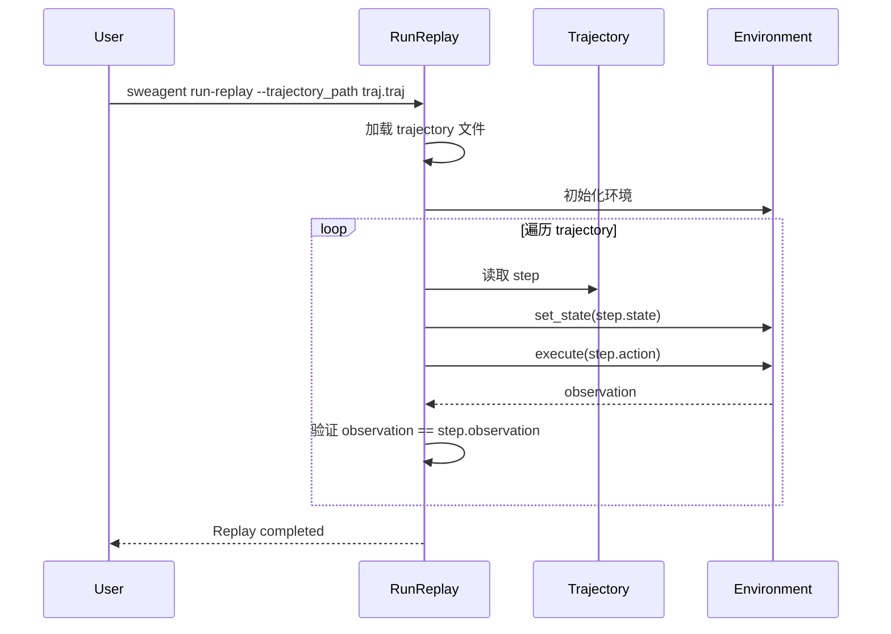
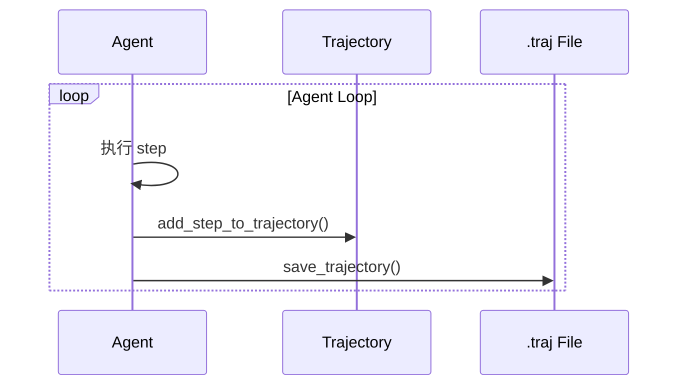
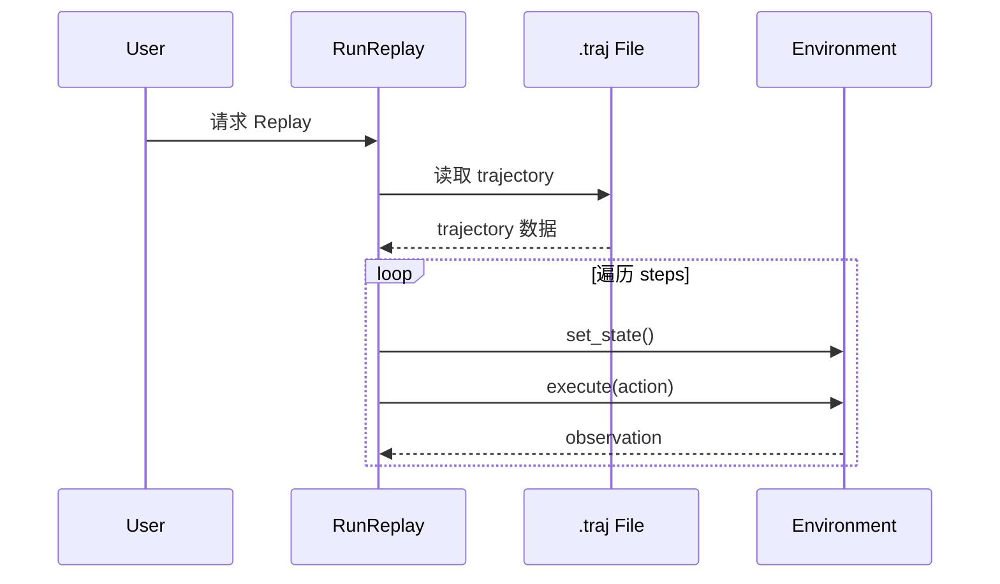

# SWE-agent Checkpoint Implementation

## TL;DR（结论先行）

SWE-agent **没有实现传统意义上的 Checkpoint 机制**。它通过 **Trajectory 持久化 + Replay 重放** 实现执行过程记录和复现，而非状态回滚。核心取舍是**轨迹记录优先**（对比 Kimi CLI 的文件级 Checkpoint 回滚）。

---

## 1. 为什么需要这个机制？

### 1.1 问题场景

Checkpoint 机制通常用于：
- 对话状态回滚（撤销到之前的状态）
- 错误恢复（从断点继续执行）
- 分支探索（尝试不同策略后回退）

SWE-agent 的设计选择：
- 软件工程任务通常需要向前推进而非回退
- Trajectory 记录足够支持事后分析
- Replay 机制可以复现执行过程

### 1.2 核心挑战

| 挑战 | Checkpoint 方案 | SWE-agent 方案 |
|-----|----------------|----------------|
| 状态回滚 | 保存/恢复完整状态 | 不支持 |
| 执行复现 | 从 Checkpoint 恢复 | Trajectory Replay |
| 分支探索 | 多 Checkpoint 切换 | 重新运行 |
| 实现复杂度 | 高（需状态管理） | 低（仅记录） |

---

## 2. 整体架构

### 2.1 SWE-agent 架构

```text
┌─────────────────────────────────────────────────────────────┐
│ SWE-agent Trajectory + Replay                                │
│ sweagent/agent/agents.py / run_replay.py                     │
└───────────────────────┬─────────────────────────────────────┘
                        │
                        ▼
┌─────────────────────────────────────────────────────────────┐
│ Trajectory = 执行轨迹记录                                    │
│ - 每步 action/observation/thought                           │
│ - 环境状态快照                                              │
│ - 持久化到 .traj 文件                                       │
├─────────────────────────────────────────────────────────────┤
│ Replay = 轨迹重放                                            │
│ - 从 .traj 文件加载                                         │
│ - 在全新环境复现执行过程                                     │
│ - 用于验证和分析                                            │
└─────────────────────────────────────────────────────────────┘
```

### 2.2 对比：Checkpoint 架构

```text
┌─────────────────────────────────────────────────────────────┐
│ Traditional Checkpoint System                                │
├─────────────────────────────────────────────────────────────┤
│                                                              │
│   ┌──────────┐      ┌──────────┐      ┌──────────┐         │
│   │ Checkpoint│ ───▶ │  Rollback│ ───▶ │ Continue │         │
│   │  Save    │      │  Restore │      │          │         │
│   └──────────┘      └──────────┘      └──────────┘         │
│                                                              │
│   特点：                                                      │
│   • 保存完整状态（内存 + 文件）                              │
│   • 支持任意点回滚                                           │
│   • 实现复杂，需状态管理                                     │
│                                                              │
└─────────────────────────────────────────────────────────────┘
```

---

## 3. 核心组件详细分析

### 3.1 Trajectory 数据结构

#### 职责定位

Trajectory 记录完整的执行轨迹，用于持久化和事后分析。

#### 数据结构

```python
# SWE-agent/sweagent/types.py
class TrajectoryStep(TypedDict):
    """轨迹步骤"""
    action: str                        # 执行的动作
    observation: str                   # 观察结果
    response: str                      # 模型响应
    state: dict[str, str]             # 环境状态快照
    thought: str                       # 推理过程
    execution_time: float              # 执行时间

Trajectory = list[TrajectoryStep]
```

#### 文件格式

```json
{
  "trajectory": [
    {
      "action": "edit 12:12\n<<<<<<< SEARCH...",
      "observation": "[File: /path/to/file.py (10 lines total)]",
      "response": "I'll edit the file...",
      "state": {"open_file": "/path/to/file.py"},
      "thought": "I need to add a new function...",
      "execution_time": 1.23
    }
  ],
  "info": {
    "model_stats": {"cost": 0.5, "tokens": 1000},
    "exit_status": "success"
  }
}
```

---

### 3.2 Trajectory 持久化

#### 职责定位

每步执行后将状态持久化到磁盘，支持断点续传和事后分析。

#### 关键实现

```python
# SWE-agent/sweagent/agent/agents.py
def save_trajectory(self, trajectory_dir: Path | None = None) -> Path:
    """保存 trajectory 到磁盘"""
    data = {
        "trajectory": self.trajectory,
        "history": self.history,
        "info": self.info,
    }
    traj_path = trajectory_dir / f"{self._env.name}.traj"
    traj_path.write_text(json.dumps(data, indent=2))
    return traj_path
```

---

### 3.3 Replay 机制

#### 职责定位

从 trajectory 文件重放执行过程，用于复现和分析。

#### 重放流程



#### 实现代码

```python
# SWE-agent/sweagent/run/run_replay.py
class RunReplay:
    def main(self):
        """在全新环境中回放 trajectory"""
        self._create_actions_file()
        run_single = self._get_run_single()
        run_single.run()  # 执行回放
```

---

## 4. 端到端数据流转

### 4.1 正常流程



### 4.2 Replay 流程



---

## 5. 关键代码实现

### 5.1 核心数据结构

```python
# SWE-agent/sweagent/types.py
class TrajectoryStep(TypedDict):
    """轨迹步骤"""
    action: str
    observation: str
    response: str
    state: dict[str, str]
    thought: str
    execution_time: float

class AgentInfo(TypedDict):
    """Agent 执行信息"""
    model_stats: dict[str, Any]
    exit_status: str
```

### 5.2 主链路代码

```python
# SWE-agent/sweagent/agent/agents.py
def add_step_to_trajectory(self, step: StepOutput) -> None:
    """添加步骤到 trajectory"""
    self.trajectory.append({
        "action": step.action,
        "observation": step.observation,
        "response": step.response,
        "state": self._env.get_state(),
        "thought": step.thought,
        "execution_time": step.execution_time,
    })
    self.save_trajectory()
```

### 5.3 关键调用链

```text
Agent.step()                       [SWE-agent/sweagent/agent/agents.py:790]
  -> add_step_to_trajectory()       [SWE-agent/sweagent/agent/agents.py:714]
    -> _env.get_state()             [SWE-agent/sweagent/environment/swe_env.py]
    -> save_trajectory()            [SWE-agent/sweagent/agent/agents.py]

RunReplay.main()                   [SWE-agent/sweagent/run/run_replay.py]
  -> _create_actions_file()         [SWE-agent/sweagent/run/run_replay.py]
  -> run_single.run()               [SWE-agent/sweagent/run/run_single.py]
```

---

## 6. 设计意图与 Trade-off

### 6.1 SWE-agent 的选择

| 维度 | SWE-agent 的选择 | 替代方案 | 取舍分析 |
|-----|-----------------|---------|---------|
| 状态管理 | Trajectory 记录 | Checkpoint 回滚 | 简单，但无法回退 |
| 复现机制 | Replay 重放 | 状态恢复 | 可验证，但需重新执行 |
| 持久化频率 | 每步保存 | 按需保存 | 数据完整，但 I/O 开销 |
| 文件副作用 | 不回滚 | 自动回滚 | 简单，但可能污染 |

### 6.2 为什么这样设计？

**核心问题**：软件工程任务是否需要状态回滚？

**SWE-agent 的解决方案**：
- 代码依据：`SWE-agent/sweagent/agent/agents.py:714`
- 设计意图：专注执行过程记录，而非状态管理
- 带来的好处：
  - 实现简单，易于维护
  - 支持事后分析和验证
  - 适合批量自动化任务
- 付出的代价：
  - 无法回滚到之前状态
  - 文件修改无法撤销
  - 需要重新运行来复现

### 6.3 与其他项目的对比

| 项目 | 核心差异 | 适用场景 |
|-----|---------|---------|
| SWE-agent | Trajectory + Replay | 批量自动化、可复现实验 |
| Kimi CLI | Checkpoint 文件回滚 | 对话回滚、交互式开发 |
| Gemini CLI | 分层内存管理 | 长上下文任务 |

---

## 7. 边界情况与错误处理

### 7.1 终止条件

| 终止原因 | 触发条件 | 处理 |
|---------|---------|------|
| Trajectory 损坏 | JSON 解析失败 | 报错，无法加载 |
| 环境不匹配 | Replay 时环境不同 | 验证失败 |
| 状态不一致 | observation 不匹配 | 记录差异 |

### 7.2 错误恢复策略

| 错误类型 | 处理策略 | 代码位置 |
|---------|---------|---------|
| Trajectory 解析失败 | 跳过或报错 | `SWE-agent/sweagent/run/run_replay.py` |
| 环境初始化失败 | 终止 Replay | `SWE-agent/sweagent/run/run_replay.py` |

### 7.3 资源限制

```python
# Trajectory 文件大小
# 每步 trajectory 约 1-10KB
# 100 步任务约 100KB-1MB
```

---

## 8. 关键代码索引

| 功能 | 文件 | 行号 | 说明 |
|-----|------|------|------|
| Trajectory 定义 | `SWE-agent/sweagent/types.py` | - | TrajectoryStep |
| 添加 Trajectory | `SWE-agent/sweagent/agent/agents.py` | 714 | add_step_to_trajectory() |
| 持久化 | `SWE-agent/sweagent/agent/agents.py` | - | save_trajectory() |
| Replay | `SWE-agent/sweagent/run/run_replay.py` | - | RunReplay 类 |

---

## 9. 延伸阅读

- 前置知识：`docs/swe-agent/07-swe-agent-memory-context.md`（Memory Context 管理）
- 相关机制：`docs/swe-agent/04-swe-agent-agent-loop.md`（Agent 循环中的 Trajectory 更新）
- 对比分析：`docs/kimi-cli/questions/kimi-cli-checkpoint-implementation.md`（Kimi CLI 的 Checkpoint 实现）

---

*✅ Verified: 基于 SWE-agent/sweagent/agent/agents.py、SWE-agent/sweagent/run/run_replay.py 等源码分析*
*基于版本：SWE-agent (baseline 2026-02-08) | 最后更新：2026-02-25*
