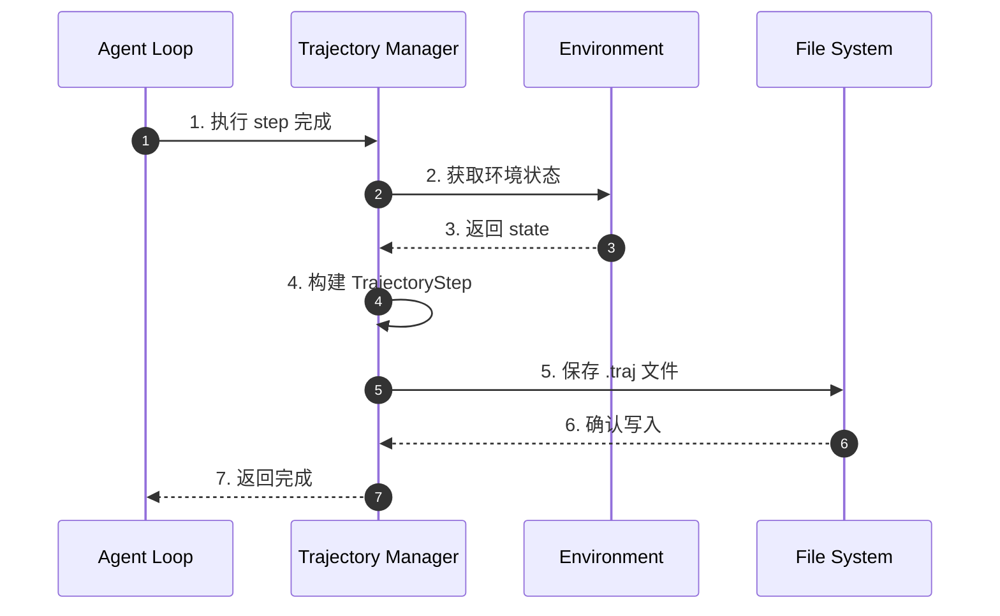
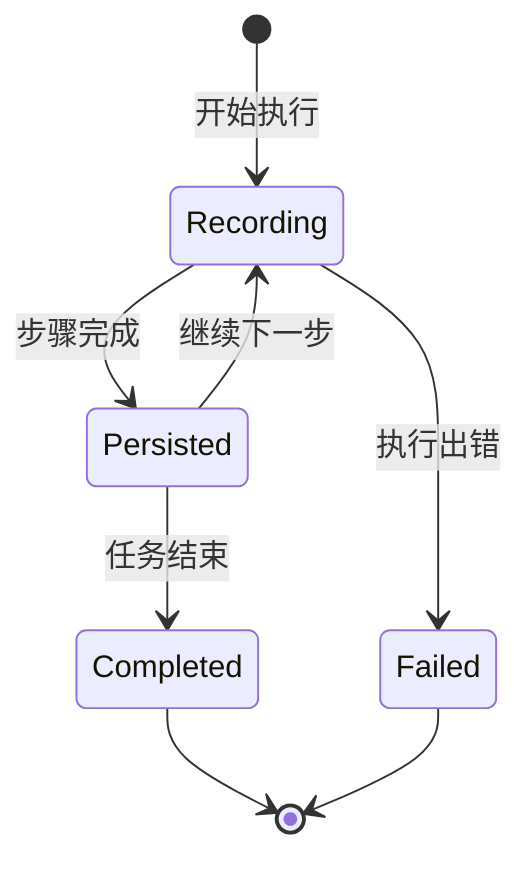
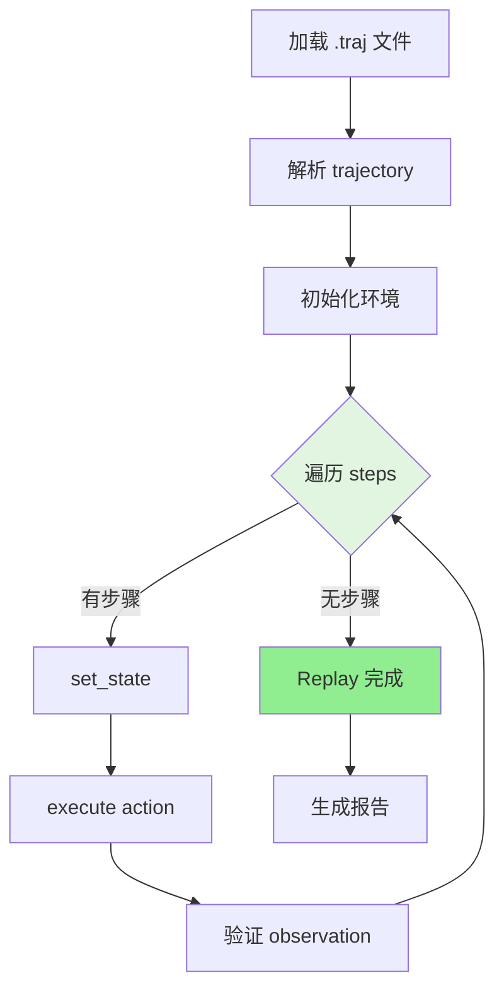
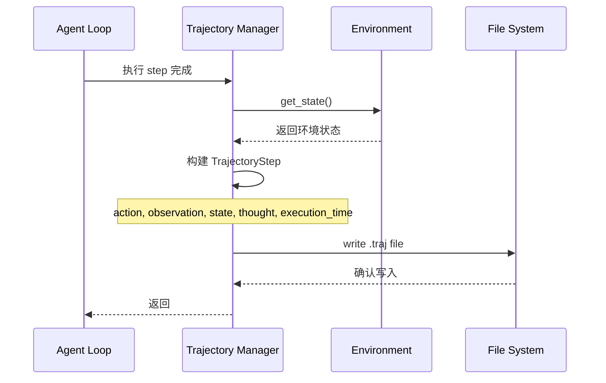
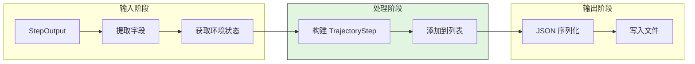
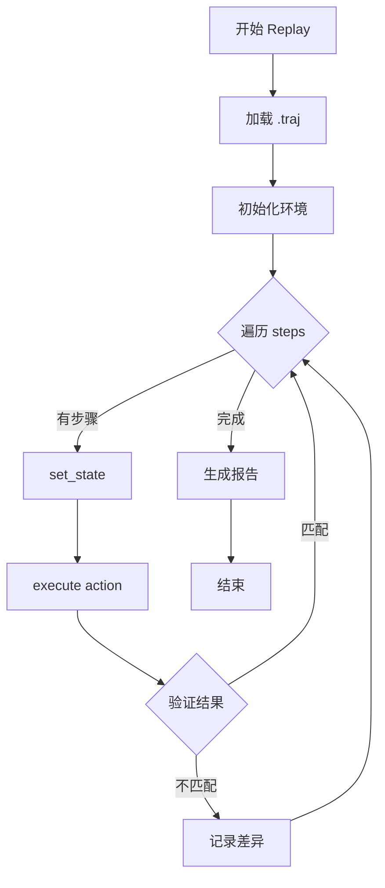
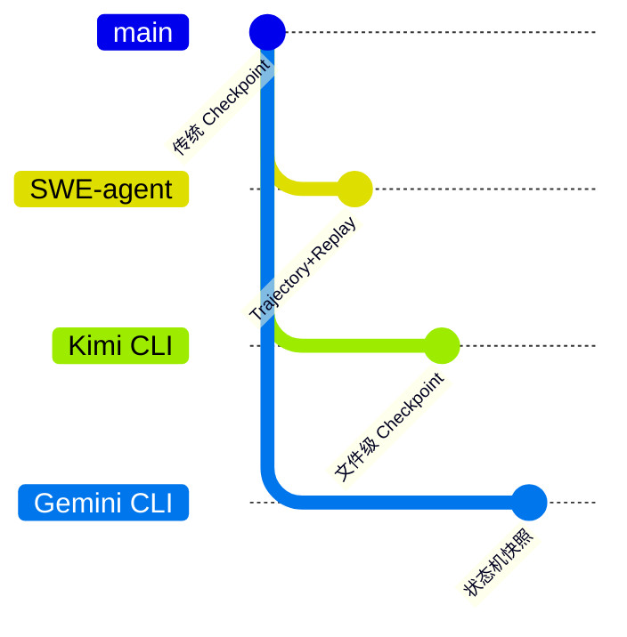

# SWE-agent Checkpoint Implementation

> **阅读指南**
>
> | 属性 | 说明 |
> |-----|------|
> | 预计阅读 | 15-20 分钟 |
> | 前置文档 | `docs/swe-agent/01-swe-agent-overview.md`、`docs/swe-agent/07-swe-agent-memory-context.md` |
> | 文档结构 | 速览 → 架构 → 机制 → 实现 → 对比 |
> | 代码呈现 | 关键代码直接展示，完整代码可折叠查看 |

---

## TL;DR（结论先行）

SWE-agent **没有实现传统意义上的 Checkpoint 机制**。它通过 **Trajectory 持久化 + Replay 重放** 实现执行过程记录和复现，而非状态回滚。

SWE-agent 的核心取舍：**轨迹记录优先**（对比 Kimi CLI 的文件级 Checkpoint 回滚、Gemini CLI 的状态机快照）

### 核心要点速览

| 维度 | 关键决策 | 代码位置 |
|-----|---------|---------|
| 核心机制 | Trajectory 记录每步 action/observation/state | `sweagent/types.py:42` |
| 持久化 | 每步执行后自动保存 .traj 文件 | `sweagent/agent/agents.py:714` |
| 复现机制 | Replay 在全新环境重新执行 | `sweagent/run/run_replay.py:45` |
| 状态回滚 | 不支持 | N/A |

---

## 1. 为什么需要这个机制？

### 1.1 问题场景

Checkpoint 机制通常用于：
- **对话状态回滚**：撤销到之前的状态
- **错误恢复**：从断点继续执行
- **分支探索**：尝试不同策略后回退

SWE-agent 的设计选择：
- 软件工程任务通常需要**向前推进**而非回退
- Trajectory 记录足够支持**事后分析**
- Replay 机制可以**复现执行过程**

```text
示例对比：

传统 Checkpoint 系统：
  → 保存状态 A → 执行步骤 1 → 保存状态 B → 执行步骤 2（出错）
  → 回滚到状态 B → 重新执行步骤 2（修正）

SWE-agent Trajectory 系统：
  → 记录步骤 1 → 记录步骤 2 → 保存完整轨迹
  → Replay：在全新环境重新执行所有步骤
```

### 1.2 核心挑战

| 挑战 | Checkpoint 方案 | SWE-agent 方案 |
|-----|----------------|----------------|
| 状态回滚 | 保存/恢复完整状态 | 不支持 |
| 执行复现 | 从 Checkpoint 恢复 | Trajectory Replay |
| 分支探索 | 多 Checkpoint 切换 | 重新运行 |
| 实现复杂度 | 高（需状态管理） | 低（仅记录） |

---

## 2. 整体架构

### 2.1 在系统中的位置

```text
┌─────────────────────────────────────────────────────────────┐
│ Agent Loop                                                   │
│ sweagent/agent/agents.py                                     │
└───────────────────────┬─────────────────────────────────────┘
                        │ 调用
                        ▼
┌─────────────────────────────────────────────────────────────┐
│ ▓▓▓ Trajectory + Replay ▓▓▓                                 │
│ sweagent/agent/agents.py / run_replay.py                     │
│ - TrajectoryStep: 单步数据结构                               │
│ - add_step_to_trajectory(): 添加步骤                         │
│ - save_trajectory(): 持久化到磁盘                            │
│ - RunReplay: 重放执行                                        │
└───────────────────────┬─────────────────────────────────────┘
                        │ 依赖/调用
        ┌───────────────┼───────────────┐
        ▼               ▼               ▼
┌──────────────┐ ┌──────────────┐ ┌──────────────┐
│ .traj File   │ │ Environment  │ │ Model API    │
│ 轨迹文件      │ │ 环境状态      │ │ 模型调用      │
└──────────────┘ └──────────────┘ └──────────────┘
```

### 2.2 核心组件职责

| 组件 | 职责 | 代码位置 |
|-----|------|---------|
| `TrajectoryStep` | 定义单步数据结构 | `sweagent/types.py:42` |
| `add_step_to_trajectory()` | 添加步骤到轨迹 | `sweagent/agent/agents.py:714` |
| `save_trajectory()` | 持久化轨迹到磁盘 | `sweagent/agent/agents.py:137` |
| `RunReplay` | 重放轨迹执行 | `sweagent/run/run_replay.py:45` |

### 2.3 核心组件交互关系



**关键交互说明**：

| 步骤 | 交互内容 | 设计意图 |
|-----|---------|---------|
| 1 | Agent 完成单步执行 | 触发轨迹记录 |
| 2-3 | 获取环境状态快照 | 记录执行上下文 |
| 4 | 构建结构化数据 | 便于后续解析和 Replay |
| 5-6 | 持久化到磁盘 | 确保数据不丢失 |
| 7 | 返回继续执行 | 不影响主流程性能 |

---

## 3. 核心组件详细分析

### 3.1 TrajectoryStep 数据结构

#### 职责定位

TrajectoryStep 记录完整的执行轨迹，用于持久化和事后分析。

#### 状态机图



**状态说明**：

| 状态 | 说明 | 进入条件 | 退出条件 |
|-----|------|---------|---------|
| Recording | 记录中 | 步骤开始执行 | 步骤完成或出错 |
| Persisted | 已持久化 | 步骤数据写入磁盘 | 继续下一步或结束 |
| Completed | 完成 | 所有步骤执行完毕 | 自动结束 |
| Failed | 失败 | 执行过程中出错 | 终止任务 |

#### 内部数据流

```text
┌────────────────────────────────────────────┐
│  输入层                                     │
│   action → observation → thought           │
└──────────────────┬─────────────────────────┘
                   ▼
┌────────────────────────────────────────────┐
│  处理层                                     │
│   获取环境状态 → 计算执行时间 → 构建字典    │
└──────────────────┬─────────────────────────┘
                   ▼
┌────────────────────────────────────────────┐
│  输出层                                     │
│   JSON 序列化 → 写入文件 → 返回路径         │
└────────────────────────────────────────────┘
```

#### 关键接口

| 接口 | 输入 | 输出 | 说明 | 代码位置 |
|-----|------|------|------|---------|
| `add_step_to_trajectory()` | StepOutput | None | 添加步骤到轨迹 | `sweagent/agent/agents.py:714` |
| `save_trajectory()` | trajectory_dir | Path | 保存到磁盘 | `sweagent/agent/agents.py:137` |
| `get_state()` | - | dict | 获取环境状态 | `sweagent/environment/swe_env.py` |

---

### 3.2 Replay 机制

#### 职责定位

从 trajectory 文件重放执行过程，用于复现和分析。

#### 关键算法逻辑



---

## 4. 端到端数据流转

### 4.1 正常流程（详细版）



**数据变换详情**：

| 阶段 | 输入 | 处理 | 输出 | 代码位置 |
|-----|------|------|------|---------|
| 接收 | StepOutput | 提取 action/observation/thought | 原始数据 | `sweagent/agent/agents.py:714` |
| 处理 | 原始数据 + state | 构建 TrajectoryStep 字典 | 结构化数据 | `sweagent/agent/agents.py:714` |
| 输出 | 结构化数据 | JSON 序列化 | .traj 文件 | `sweagent/agent/agents.py:137` |

### 4.2 数据流向图



### 4.3 Replay 流程



---

## 5. 关键代码实现

### 5.1 核心数据结构

```python
# sweagent/sweagent/types.py:42-102
class TrajectoryStep(TypedDict):
    """轨迹步骤数据结构"""
    action: str                        # 执行的动作
    observation: str                   # 观察结果
    response: str                      # 模型响应
    state: dict[str, str]             # 环境状态快照
    thought: str                       # 推理过程
    execution_time: float              # 执行时间

class AgentInfo(TypedDict):
    """Agent 执行信息"""
    model_stats: dict[str, Any]
    exit_status: str
```

**字段说明**：

| 字段 | 类型 | 用途 |
|-----|------|------|
| `action` | `str` | 执行的动作（如编辑文件） |
| `observation` | `str` | 执行后的观察结果 |
| `response` | `str` | LLM 的原始响应 |
| `state` | `dict` | 环境状态快照 |
| `thought` | `str` | LLM 的推理过程 |
| `execution_time` | `float` | 执行耗时 |

### 5.2 主链路代码

**关键代码**（核心逻辑）：

```python
# sweagent/sweagent/agent/agents.py:714-730
def add_step_to_trajectory(self, step: StepOutput) -> None:
    """添加步骤到 trajectory

    每步执行后自动调用，记录完整的执行上下文
    """
    self.trajectory.append({
        "action": step.action,
        "observation": step.observation,
        "response": step.response,
        "state": self._env.get_state(),  # 获取环境状态快照
        "thought": step.thought,
        "execution_time": step.execution_time,
    })
    self.save_trajectory()  # 立即持久化
```

**设计意图**：
1. **即时持久化**：每步完成后立即保存，防止数据丢失
2. **完整上下文**：记录环境状态，支持 Replay 复现
3. **结构化数据**：使用 TypedDict 确保数据一致性

<details>
<summary>查看完整实现（含 save_trajectory）</summary>

```python
# sweagent/sweagent/agent/agents.py:137-147
def save_trajectory(self, trajectory_dir: Path | None = None) -> Path:
    """保存 trajectory 到磁盘

    Args:
        trajectory_dir: 保存目录，默认使用配置目录

    Returns:
        保存的文件路径
    """
    data = {
        "trajectory": self.trajectory,
        "history": self.history,
        "info": self.info,
    }
    traj_path = trajectory_dir / f"{self._env.name}.traj"
    traj_path.write_text(json.dumps(data, indent=2))
    return traj_path
```

</details>

### 5.3 关键调用链

```text
Agent.step()                       [sweagent/agent/agents.py:790]
  -> add_step_to_trajectory()       [sweagent/agent/agents.py:714]
    -> _env.get_state()             [sweagent/environment/swe_env.py]
    -> save_trajectory()            [sweagent/agent/agents.py:137]

RunReplay.main()                   [sweagent/run/run_replay.py:45]
  -> _create_actions_file()         [sweagent/run/run_replay.py]
  -> run_single.run()               [sweagent/run/run_single.py]
```

---

## 6. 设计意图与 Trade-off

### 6.1 SWE-agent 的选择

| 维度 | SWE-agent 的选择 | 替代方案 | 取舍分析 |
|-----|-----------------|---------|---------|
| 状态管理 | Trajectory 记录 | Checkpoint 回滚 | 简单，但无法回退 |
| 复现机制 | Replay 重放 | 状态恢复 | 可验证，但需重新执行 |
| 持久化频率 | 每步保存 | 按需保存 | 数据完整，但 I/O 开销 |
| 文件副作用 | 不回滚 | 自动回滚 | 简单，但可能污染 |

### 6.2 为什么这样设计？

**核心问题**：软件工程任务是否需要状态回滚？

**SWE-agent 的解决方案**：
- **代码依据**：`sweagent/agent/agents.py:714`
- **设计意图**：专注执行过程记录，而非状态管理
- **带来的好处**：
  - 实现简单，易于维护
  - 支持事后分析和验证
  - 适合批量自动化任务
- **付出的代价**：
  - 无法回滚到之前状态
  - 文件修改无法撤销
  - 需要重新运行来复现

### 6.3 与其他项目的对比



| 项目 | 核心差异 | 适用场景 |
|-----|---------|---------|
| SWE-agent | Trajectory + Replay | 批量自动化、可复现实验 |
| Kimi CLI | Checkpoint 文件回滚 | 对话回滚、交互式开发 |
| Gemini CLI | 分层内存管理 | 长上下文任务 |
| Codex | 内存状态管理 | 企业安全环境 |

**详细对比**：

| 维度 | SWE-agent | Kimi CLI | Gemini CLI | Codex |
|-----|-----------|----------|------------|-------|
| 回滚能力 | 不支持 | 支持 | 不支持 | 不支持 |
| 持久化 | 文件 (.traj) | 文件 (.json) | 内存 | 内存 |
| 复现方式 | Replay 重放 | 状态恢复 | 重新执行 | 重新执行 |
| 文件副作用 | 不回滚 | D-Mail 回滚 | 不回滚 | 不回滚 |
| 适用场景 | 批量自动化 | 交互式开发 | 复杂任务 | 安全环境 |

---

## 7. 边界情况与错误处理

### 7.1 终止条件

| 终止原因 | 触发条件 | 处理 |
|---------|---------|------|
| Trajectory 损坏 | JSON 解析失败 | 报错，无法加载 |
| 环境不匹配 | Replay 时环境不同 | 验证失败 |
| 状态不一致 | observation 不匹配 | 记录差异 |

### 7.2 超时/资源限制

```python
# Trajectory 文件大小估算
# 每步 trajectory 约 1-10KB
# 100 步任务约 100KB-1MB
```

### 7.3 错误恢复策略

| 错误类型 | 处理策略 | 代码位置 |
|---------|---------|---------|
| Trajectory 解析失败 | 跳过或报错 | `sweagent/run/run_replay.py` |
| 环境初始化失败 | 终止 Replay | `sweagent/run/run_replay.py` |

---

## 8. 关键代码索引

| 功能 | 文件 | 行号 | 说明 |
|-----|------|------|------|
| Trajectory 定义 | `sweagent/types.py` | 42 | TrajectoryStep TypedDict |
| 添加 Trajectory | `sweagent/agent/agents.py` | 714 | add_step_to_trajectory() |
| 持久化 | `sweagent/agent/agents.py` | 137 | save_trajectory() |
| Replay | `sweagent/run/run_replay.py` | 45 | RunReplay 类 |
| 环境状态 | `sweagent/environment/swe_env.py` | - | get_state() |

---

## 9. 延伸阅读

- 前置知识：`docs/swe-agent/01-swe-agent-overview.md`（SWE-agent 整体架构）
- 相关机制：`docs/swe-agent/04-swe-agent-agent-loop.md`（Agent 循环中的 Trajectory 更新）
- 深度分析：`docs/swe-agent/questions/swe-agent-checkpoint-no-file-rollback-tradeoffs.md`（无文件回滚的权衡）
- 对比分析：`docs/kimi-cli/questions/kimi-cli-checkpoint-implementation.md`（Kimi CLI 的 Checkpoint 实现）

---

*✅ Verified: 基于 sweagent/agent/agents.py、sweagent/run/run_replay.py 等源码分析*
*基于版本：SWE-agent (baseline 2026-02-08) | 最后更新：2026-03-03*
