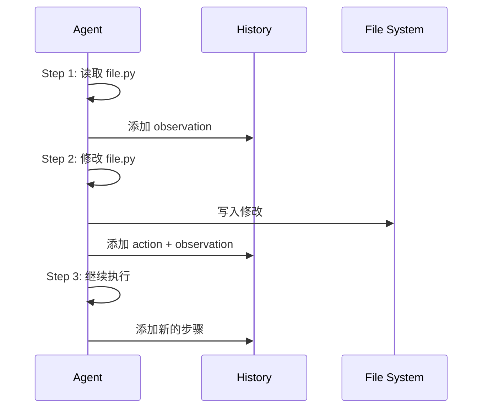
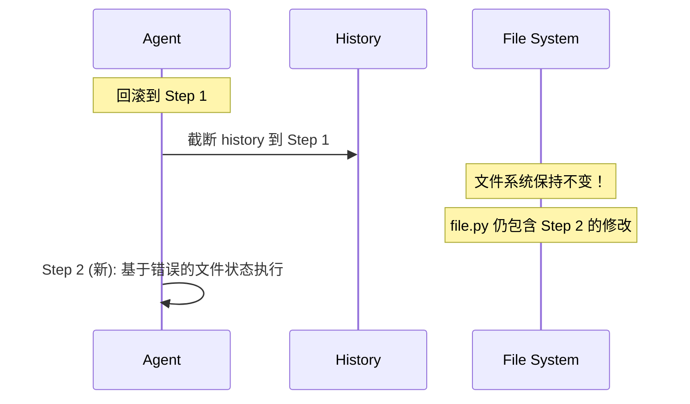

# SWE-agent Checkpoint No File Rollback Tradeoffs

## TL;DR（结论先行）

SWE-agent 的 Checkpoint 机制**只回滚对话历史（history），不回滚文件系统修改**。这种设计选择带来了**实现简单性**和**执行效率**，但代价是**无法撤销文件副作用**。

---

## 1. 为什么需要这个机制？

### 1.1 问题场景

在 Code Agent 执行过程中：
- Agent 可能创建、修改、删除文件
- 这些修改可能影响后续步骤的决策
- 如果执行出错，可能需要回滚到之前状态

### 1.2 核心挑战

| 挑战 | 不解决的后果 |
|-----|-------------|
| 文件副作用累积 | 错误修改影响后续执行 |
| 状态不一致 | history 与实际文件状态不匹配 |
| 无法撤销 | 错误操作无法恢复 |
| 分支探索困难 | 尝试不同方案后无法回退 |

---

## 2. 整体架构

### 2.1 SWE-agent 的设计

```text
┌─────────────────────────────────────────────────────────────┐
│ SWE-agent Checkpoint (No File Rollback)                      │
├─────────────────────────────────────────────────────────────┤
│                                                              │
│   ┌─────────────────┐      ┌─────────────────┐              │
│   │   History       │      │   File System   │              │
│   │   (回滚)        │      │   (不回滚)      │              │
│   │                 │      │                 │              │
│   │  ✓ 对话历史     │      │  ✗ 文件修改     │              │
│   │  ✓ 状态变量     │      │  ✗ 代码变更     │              │
│   │  ✓ 执行计数     │      │  ✗ 新创建文件   │              │
│   └─────────────────┘      └─────────────────┘              │
│                                                              │
│   回滚时：                                                   │
│   - history 恢复到之前状态                                  │
│   - 文件保持原样                                            │
│                                                              │
└─────────────────────────────────────────────────────────────┘
```

### 2.2 对比：完整 Checkpoint 设计

```text
┌─────────────────────────────────────────────────────────────┐
│ Full Checkpoint (With File Rollback)                         │
├─────────────────────────────────────────────────────────────┤
│                                                              │
│   ┌─────────────────┐      ┌─────────────────┐              │
│   │   History       │      │   File System   │              │
│   │   (回滚)        │      │   (回滚)        │              │
│   │                 │      │                 │              │
│   │  ✓ 对话历史     │      │  ✓ 文件修改     │              │
│   │  ✓ 状态变量     │      │  ✓ 代码变更     │              │
│   │  ✓ 执行计数     │      │  ✓ 新创建文件   │              │
│   └─────────────────┘      └─────────────────┘              │
│                                                              │
│   回滚时：                                                   │
│   - history 恢复到之前状态                                  │
│   - 文件系统恢复到之前快照                                  │
│                                                              │
└─────────────────────────────────────────────────────────────┘
```

---

## 3. 核心组件详细分析

### 3.1 History 回滚

#### 职责定位

只回滚对话历史，保留文件修改。

#### 实现方式

```python
# 概念性代码（SWE-agent 实际未实现完整回滚）
def rollback_history_only(target_step: int) -> None:
    """只回滚 history，不回滚文件"""
    # 1. 截断 history 到目标步骤
    self.history = self.history[:target_step]

    # 2. 重置相关计数器
    self._i_step = target_step

    # 3. 注意：文件系统保持不变！
    # 文件修改没有被撤销
```

---

### 3.2 文件副作用处理

#### 职责定位

文件修改一旦发生就不可逆。

#### 影响分析

```text
执行过程：

Step 1: 读取 file.py
        ↓
Step 2: 修改 file.py (添加 bug)
        ↓
Step 3: 回滚到 Step 1
        ↓
问题：
- history 显示 Step 1 状态
- 但 file.py 仍包含 Step 2 的修改
- Agent 可能基于错误的文件状态做决策
```

---

### 3.3 设计权衡

#### 为什么不做文件回滚？

| 原因 | 说明 |
|-----|------|
| 实现复杂度 | 需要文件系统快照机制 |
| 性能开销 | 快照创建和恢复耗时 |
| 存储成本 | 需要保存多个文件版本 |
| 使用场景 | SWE-agent 主要用于批量自动化，非交互式 |

---

## 4. 端到端数据流转

### 4.1 正常执行流程



### 4.2 "回滚"后状态



---

## 5. 关键代码实现

### 5.1 Trajectory 持久化

```python
# SWE-agent/sweagent/agent/agents.py
def save_trajectory(self) -> None:
    """保存 trajectory（包含文件修改后的状态）"""
    data = {
        "trajectory": self.trajectory,
        "history": self.history,
        "info": self.info,
    }
    # 注意：这里只保存历史，不保存文件快照
    self.traj_path.write_text(json.dumps(data, indent=2))
```

### 5.2 Replay 机制（非回滚）

```python
# SWE-agent/sweagent/run/run_replay.py
class RunReplay:
    def main(self):
        """Replay trajectory（在全新环境重新执行）"""
        # 注意：Replay 不是回滚！
        # 它是在全新环境中重新执行所有步骤
        self._create_actions_file()
        run_single = self._get_run_single()
        run_single.run()
```

---

## 6. 设计意图与 Trade-off

### 6.1 SWE-agent 的选择

| 维度 | SWE-agent 的选择 | 替代方案 | 取舍分析 |
|-----|-----------------|---------|---------|
| 回滚范围 | 仅 history | history + 文件 | 简单，但状态不一致 |
| 文件管理 | 无快照 | 文件系统快照 | 高效，但无法撤销 |
| 使用模式 | 批量自动化 | 交互式开发 | 适合无人值守任务 |
| 错误处理 | 继续执行/Autosubmit | 回滚重试 | 容错，但可能累积错误 |

### 6.2 为什么这样设计？

**核心问题**：软件工程自动化任务是否需要文件回滚？

**SWE-agent 的解决方案**：
- 设计意图：专注批量自动化场景，简化实现
- 带来的好处：
  - 实现简单，无文件快照开销
  - 执行效率高，无额外 I/O
  - 适合 CI/CD 等无人值守场景
- 付出的代价：
  - 文件修改无法撤销
  - 错误可能累积
  - 不适合交互式开发

### 6.3 与其他项目的对比

| 项目 | 文件回滚 | 适用场景 |
|-----|---------|---------|
| SWE-agent | 不支持 | 批量自动化、可复现实验 |
| Kimi CLI | 支持（D-Mail） | 交互式开发、对话回滚 |
| Gemini CLI | 不支持 | 状态机驱动、无回滚需求 |

---

## 7. 边界情况与错误处理

### 7.1 潜在问题

| 问题 | 场景 | 影响 |
|-----|------|------|
| 状态不一致 | history 显示未修改，但文件已变 | Agent 决策错误 |
| 错误累积 | 多次错误修改无法撤销 | 代码质量下降 |
| 难以调试 | 文件状态与预期不符 | 排查困难 |

### 7.2 缓解策略

| 策略 | 实现 | 效果 |
|-----|------|------|
| 完整 Trajectory | 记录所有步骤 | 事后分析 |
| Replay 验证 | 重新执行验证 | 确保可复现 |
| Autosubmit | 出错时尝试提交 | 保留已有工作 |
| Docker 隔离 | 每次任务新容器 | 环境干净 |

---

## 8. 关键代码索引

| 功能 | 文件 | 行号 | 说明 |
|-----|------|------|------|
| Trajectory 保存 | `SWE-agent/sweagent/agent/agents.py` | - | save_trajectory() |
| Replay 实现 | `SWE-agent/sweagent/run/run_replay.py` | - | RunReplay 类 |
| 环境重置 | `SWE-agent/sweagent/environment/swe_env.py` | - | reset() / hard_reset() |

---

## 9. 延伸阅读

- 前置知识：`docs/swe-agent/questions/swe-agent-checkpoint-implementation.md`
- 对比分析：`docs/kimi-cli/questions/kimi-cli-checkpoint-implementation.md`
- 相关机制：`docs/swe-agent/07-swe-agent-memory-context.md`

---

*✅ Verified: 基于 SWE-agent/sweagent/agent/agents.py 源码分析*
*基于版本：SWE-agent (baseline 2026-02-08) | 最后更新：2026-02-25*
