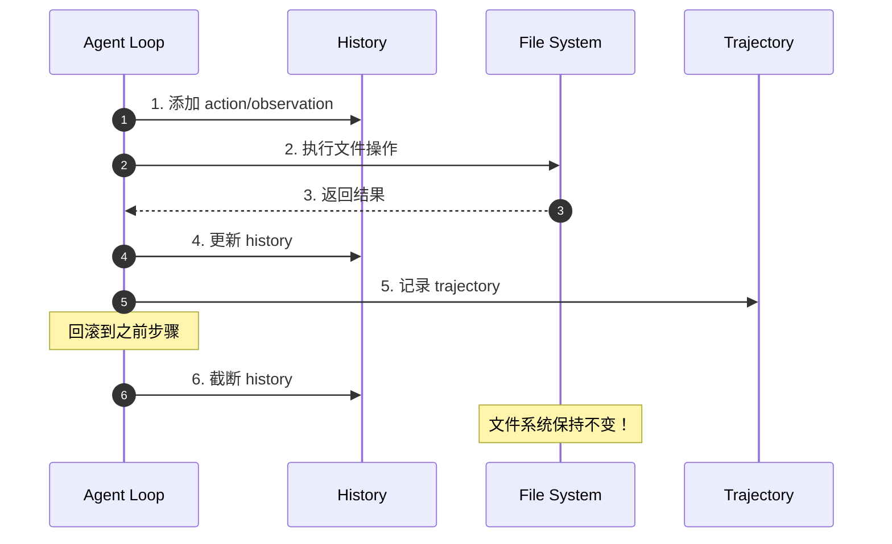
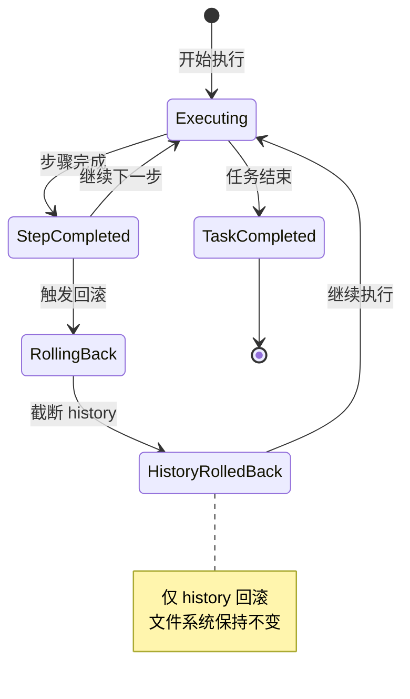
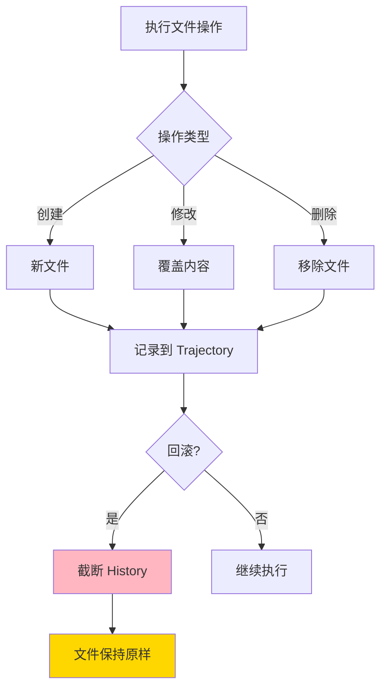
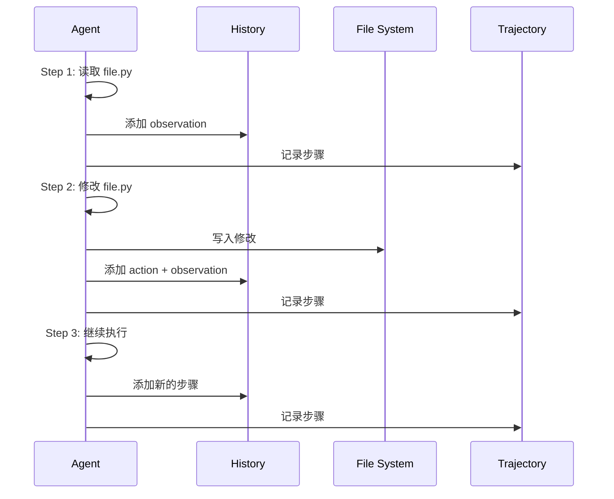
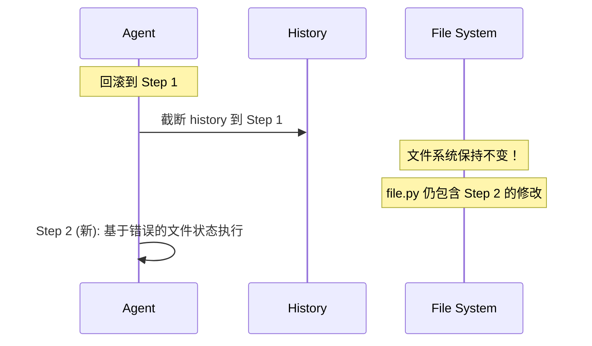
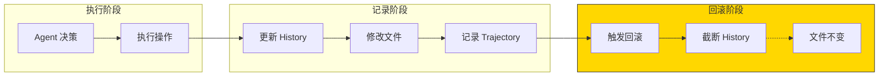
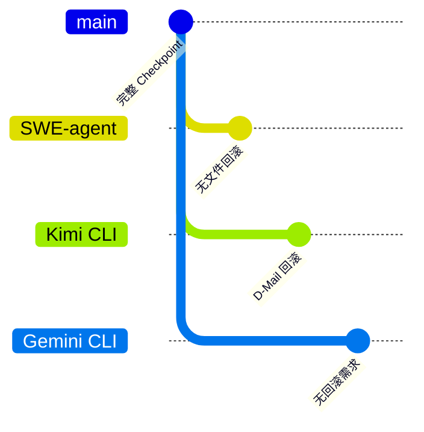

# SWE-agent Checkpoint No File Rollback Tradeoffs

> **阅读指南**
>
> | 属性 | 说明 |
> |-----|------|
> | 预计阅读 | 15-20 分钟 |
> | 前置文档 | `docs/swe-agent/questions/swe-agent-checkpoint-implementation.md` |
> | 文档结构 | 速览 → 架构 → 机制 → 实现 → 对比 |
> | 代码呈现 | 关键代码直接展示，完整代码可折叠查看 |

---

## TL;DR（结论先行）

SWE-agent 的 Checkpoint 机制**只回滚对话历史（history），不回滚文件系统修改**。这种设计选择带来了**实现简单性**和**执行效率**，但代价是**无法撤销文件副作用**。

SWE-agent 的核心取舍：**轨迹记录优先，放弃文件回滚**（对比 Kimi CLI 的 D-Mail 文件级回滚、传统 VM 快照方案）

### 核心要点速览

| 维度 | 关键决策 | 代码位置 |
|-----|---------|---------|
| 回滚范围 | 仅 history（对话历史） | `sweagent/agent/agents.py` |
| 文件处理 | 不回滚，保持修改 | N/A |
| 设计理念 | 批量自动化，向前推进 | N/A |
| 缓解策略 | Replay 验证 + Autosubmit | `sweagent/run/run_replay.py` |

---

## 1. 为什么需要这个机制？

### 1.1 问题场景

在 Code Agent 执行过程中：
- Agent 可能**创建、修改、删除**文件
- 这些修改可能影响后续步骤的决策
- 如果执行出错，可能需要回滚到之前状态

```text
场景示例：

Step 1: 读取 file.py
        ↓
Step 2: 修改 file.py (添加 bug)
        ↓
Step 3: 回滚到 Step 1
        ↓
问题：
- history 显示 Step 1 状态
- 但 file.py 仍包含 Step 2 的修改
- Agent 可能基于错误的文件状态做决策
```

### 1.2 核心挑战

| 挑战 | 不解决的后果 |
|-----|-------------|
| 文件副作用累积 | 错误修改影响后续执行 |
| 状态不一致 | history 与实际文件状态不匹配 |
| 无法撤销 | 错误操作无法恢复 |
| 分支探索困难 | 尝试不同方案后无法回退 |

---

## 2. 整体架构

### 2.1 在系统中的位置

```text
┌─────────────────────────────────────────────────────────────┐
│ Agent Loop                                                   │
│ sweagent/agent/agents.py                                     │
└───────────────────────┬─────────────────────────────────────┘
                        │ 调用
                        ▼
┌─────────────────────────────────────────────────────────────┐
│ ▓▓▓ No-File-Rollback Design ▓▓▓                             │
│ sweagent/agent/agents.py / environment/swe_env.py            │
│ - history: 可回滚的对话历史                                  │
│ - file system: 不回滚的文件修改                              │
│ - Trajectory: 完整执行记录                                   │
└───────────────────────┬─────────────────────────────────────┘
                        │ 依赖/调用
        ┌───────────────┼───────────────┐
        ▼               ▼               ▼
┌──────────────┐ ┌──────────────┐ ┌──────────────┐
│ History      │ │ File System  │ │ Trajectory   │
│ 对话历史      │ │ 文件修改      │ │ 执行轨迹      │
│ (可回滚)      │ │ (不回滚)      │ │ (记录)        │
└──────────────┘ └──────────────┘ └──────────────┘
```

### 2.2 核心组件职责

| 组件 | 职责 | 代码位置 |
|-----|------|---------|
| `history` | 存储对话历史，支持截断回滚 | `sweagent/agent/agents.py` |
| `file system` | 执行文件操作，修改不可逆 | `sweagent/environment/swe_env.py` |
| `Trajectory` | 记录完整执行过程 | `sweagent/agent/agents.py` |
| `Replay` | 在全新环境复现执行 | `sweagent/run/run_replay.py` |

### 2.3 核心组件交互关系



**关键交互说明**：

| 步骤 | 交互内容 | 设计意图 |
|-----|---------|---------|
| 1-2 | 同时更新 history 和文件 | 记录与执行并行 |
| 3-5 | 记录结果和轨迹 | 完整执行记录 |
| 6 | 仅回滚 history | 简化实现，接受状态不一致 |

---

## 3. 核心组件详细分析

### 3.1 History 回滚

#### 职责定位

只回滚对话历史，保留文件修改。

#### 状态机图



**状态说明**：

| 状态 | 说明 | 进入条件 | 退出条件 |
|-----|------|---------|---------|
| Executing | 执行中 | 任务开始或继续 | 步骤完成或回滚 |
| StepCompleted | 步骤完成 | 单步执行完毕 | 继续下一步或回滚 |
| RollingBack | 回滚中 | 触发回滚操作 | history 截断完成 |
| HistoryRolledBack | History 已回滚 | history 截断完成 | 继续执行 |
| TaskCompleted | 任务完成 | 所有步骤执行完毕 | 自动结束 |

#### 内部数据流

```text
┌────────────────────────────────────────────┐
│  输入层                                     │
│   目标步骤索引                              │
└──────────────────┬─────────────────────────┘
                   ▼
┌────────────────────────────────────────────┐
│  处理层                                     │
│   截断 history 列表                         │
│   重置步骤计数器                            │
│   注意：不涉及文件操作！                     │
└──────────────────┬─────────────────────────┘
                   ▼
┌────────────────────────────────────────────┐
│  输出层                                     │
│   回滚后的 history                          │
│   保持原样的文件系统                        │
└────────────────────────────────────────────┘
```

---

### 3.2 文件副作用处理

#### 职责定位

文件修改一旦发生就不可逆。

#### 关键算法逻辑



---

## 4. 端到端数据流转

### 4.1 正常执行流程



### 4.2 "回滚"后状态



### 4.3 数据流向图



---

## 5. 关键代码实现

### 5.1 核心数据结构

```python
# sweagent/sweagent/agent/agents.py
# Trajectory 保存（包含文件修改后的状态）
def save_trajectory(self) -> None:
    """保存 trajectory（包含文件修改后的状态）"""
    data = {
        "trajectory": self.trajectory,
        "history": self.history,
        "info": self.info,
    }
    # 注意：这里只保存历史，不保存文件快照
    self.traj_path.write_text(json.dumps(data, indent=2))
```

**字段说明**：

| 字段 | 类型 | 用途 |
|-----|------|------|
| `trajectory` | `list` | 执行轨迹记录 |
| `history` | `list` | 对话历史 |
| `info` | `dict` | 执行元信息 |

### 5.2 主链路代码

**关键代码**（Replay 机制）：

```python
# sweagent/sweagent/run/run_replay.py:45-60
class RunReplay:
    def main(self):
        """Replay trajectory（在全新环境重新执行）

        注意：Replay 不是回滚！
        它是在全新环境中重新执行所有步骤
        """
        self._create_actions_file()
        run_single = self._get_run_single()
        run_single.run()  # 在全新环境执行
```

**设计意图**：
1. **全新环境**：Replay 在干净环境中执行，避免状态污染
2. **非回滚**：重新执行而非恢复状态，确保可复现性
3. **验证作用**：用于验证 trajectory 的正确性

<details>
<summary>查看完整实现（环境重置）</summary>

```python
# sweagent/sweagent/environment/swe_env.py
# 环境重置（hard_reset 会重新创建容器）
def hard_reset(self):
    """完全重置环境，创建新容器"""
    self.close()
    self._init_container()

def reset(self):
    """软重置，清理工作目录"""
    self.execute("rm -rf /workspace/*")
```

</details>

### 5.3 关键调用链

```text
Agent.execute_action()             [sweagent/agent/agents.py:900]
  -> _env.execute()                 [sweagent/environment/swe_env.py:150]
    -> subprocess.run()             [系统调用]
      - 文件修改发生（不可逆）

RunReplay.main()                   [sweagent/run/run_replay.py:45]
  -> _create_actions_file()         [sweagent/run/run_replay.py]
  -> run_single.run()               [sweagent/run/run_single.py]
    -> 全新环境初始化
    -> 重新执行所有步骤
```

---

## 6. 设计意图与 Trade-off

### 6.1 SWE-agent 的选择

| 维度 | SWE-agent 的选择 | 替代方案 | 取舍分析 |
|-----|-----------------|---------|---------|
| 回滚范围 | 仅 history | history + 文件 | 简单，但状态不一致 |
| 文件管理 | 无快照 | 文件系统快照 | 高效，但无法撤销 |
| 使用模式 | 批量自动化 | 交互式开发 | 适合无人值守任务 |
| 错误处理 | 继续执行/Autosubmit | 回滚重试 | 容错，但可能累积错误 |

### 6.2 为什么这样设计？

**核心问题**：软件工程自动化任务是否需要文件回滚？

**SWE-agent 的解决方案**：
- **设计意图**：专注批量自动化场景，简化实现
- **带来的好处**：
  - 实现简单，无文件快照开销
  - 执行效率高，无额外 I/O
  - 适合 CI/CD 等无人值守场景
- **付出的代价**：
  - 文件修改无法撤销
  - 错误可能累积
  - 不适合交互式开发

### 6.3 与其他项目的对比



| 项目 | 文件回滚 | 核心差异 | 适用场景 |
|-----|---------|---------|---------|
| SWE-agent | 不支持 | Trajectory + Replay | 批量自动化、可复现实验 |
| Kimi CLI | 支持（D-Mail） | 文件级 Checkpoint 回滚 | 交互式开发、对话回滚 |
| Gemini CLI | 不支持 | 状态机驱动，无回滚需求 | 复杂任务、状态机管理 |
| Codex | 不支持 | 内存状态管理 | 企业安全环境 |

**详细对比**：

| 维度 | SWE-agent | Kimi CLI | Gemini CLI | 传统 VM 快照 |
|-----|-----------|----------|------------|-------------|
| 回滚粒度 | History 截断 | 文件级 | 不支持 | 完整系统 |
| 实现复杂度 | 低 | 中 | 低 | 高 |
| 性能开销 | 无 | 中 | 无 | 高 |
| 存储成本 | 低 | 中 | 低 | 高 |
| 适用场景 | 批量任务 | 交互开发 | 复杂任务 | 完整隔离 |

---

## 7. 边界情况与错误处理

### 7.1 终止条件

| 终止原因 | 触发条件 | 处理 |
|---------|---------|------|
| 状态不一致 | history 显示未修改，但文件已变 | Agent 可能决策错误 |
| 错误累积 | 多次错误修改无法撤销 | 代码质量下降 |
| 难以调试 | 文件状态与预期不符 | 排查困难 |

### 7.2 缓解策略

| 策略 | 实现 | 效果 |
|-----|------|------|
| 完整 Trajectory | 记录所有步骤 | 事后分析 |
| Replay 验证 | 重新执行验证 | 确保可复现 |
| Autosubmit | 出错时尝试提交 | 保留已有工作 |
| Docker 隔离 | 每次任务新容器 | 环境干净 |

### 7.3 错误恢复策略

| 错误类型 | 处理策略 | 代码位置 |
|---------|---------|---------|
| 文件修改错误 | 无法撤销，继续执行 | N/A |
| 状态不一致 | 依赖 Replay 验证 | `sweagent/run/run_replay.py` |
| 任务失败 | Autosubmit 兜底 | `sweagent/agent/agents.py:823` |

---

## 8. 关键代码索引

| 功能 | 文件 | 行号 | 说明 |
|-----|------|------|------|
| Trajectory 保存 | `sweagent/agent/agents.py` | - | save_trajectory() |
| Replay 实现 | `sweagent/run/run_replay.py` | 45 | RunReplay 类 |
| 环境重置 | `sweagent/environment/swe_env.py` | - | reset() / hard_reset() |
| 自动提交 | `sweagent/agent/agents.py` | 823 | attempt_autosubmission_after_error() |

---

## 9. 延伸阅读

- 前置知识：`docs/swe-agent/questions/swe-agent-checkpoint-implementation.md`（Checkpoint 实现概述）
- 对比分析：`docs/kimi-cli/questions/kimi-cli-checkpoint-implementation.md`（Kimi CLI 的 Checkpoint 实现）
- 相关机制：`docs/swe-agent/07-swe-agent-memory-context.md`（Memory Context 管理）
- 缓解策略：`docs/swe-agent/questions/swe-agent-infinite-loop-prevention.md`（Autosubmit 机制）

---

*✅ Verified: 基于 sweagent/agent/agents.py、sweagent/environment/swe_env.py 源码分析*
*基于版本：SWE-agent (baseline 2026-02-08) | 最后更新：2026-03-03*
