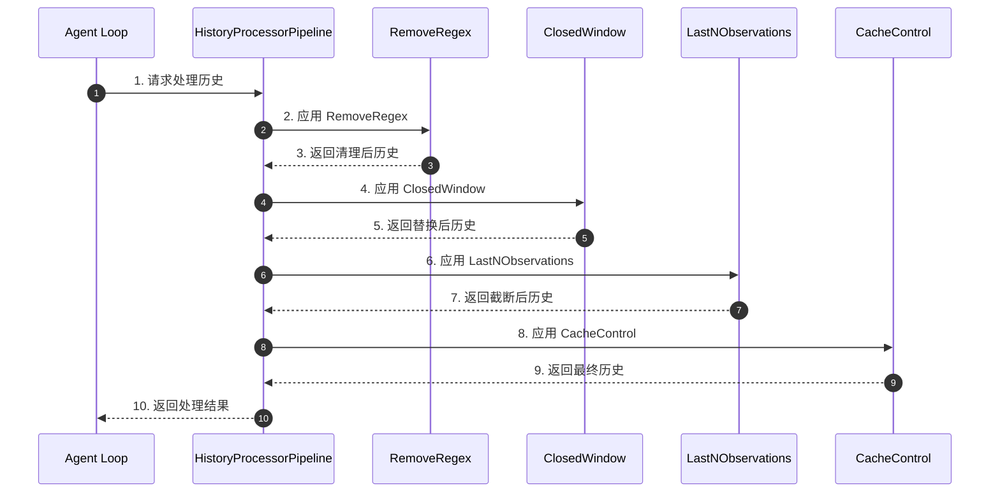
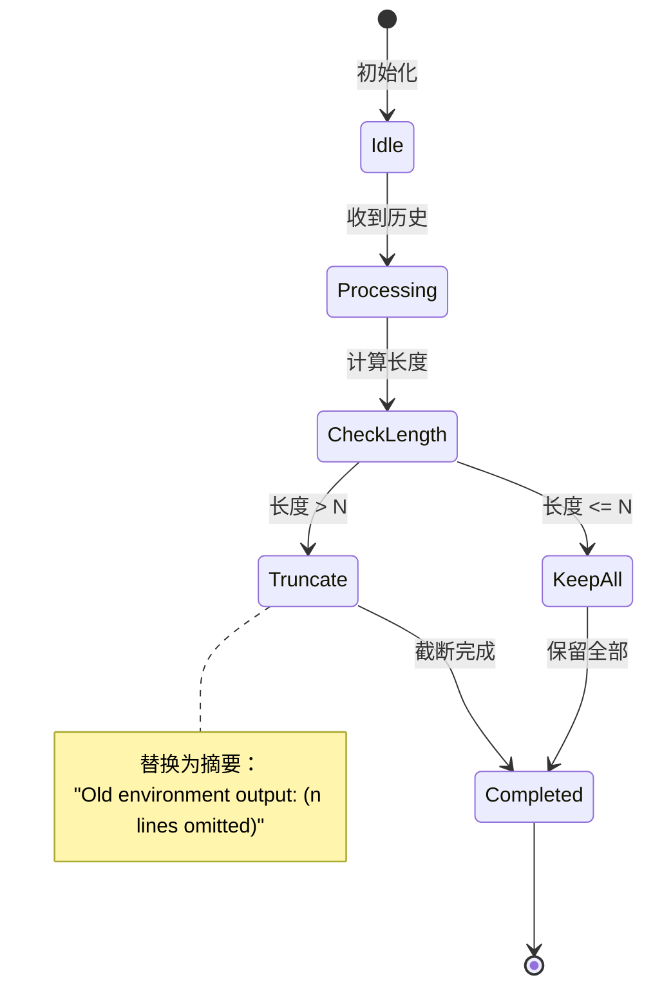
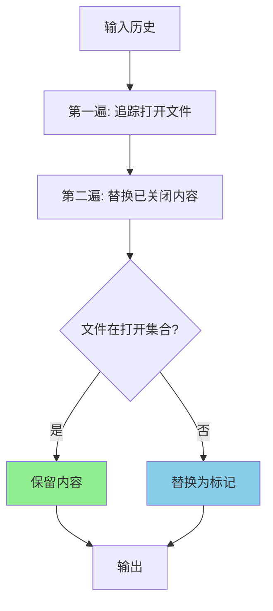
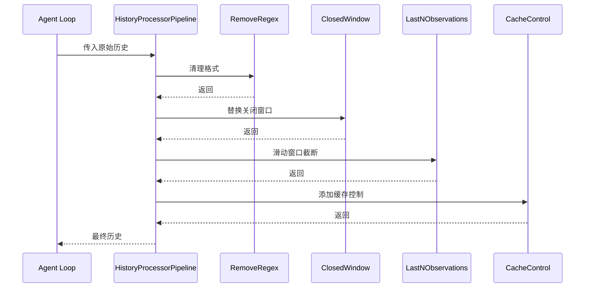
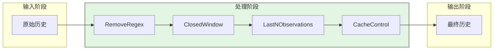
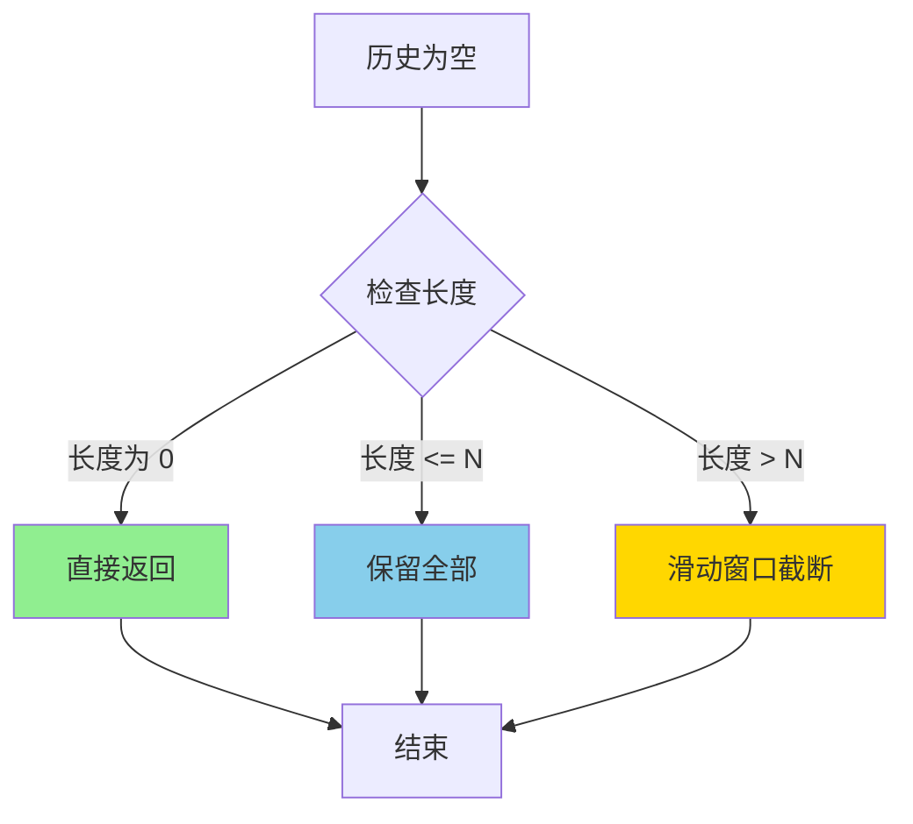
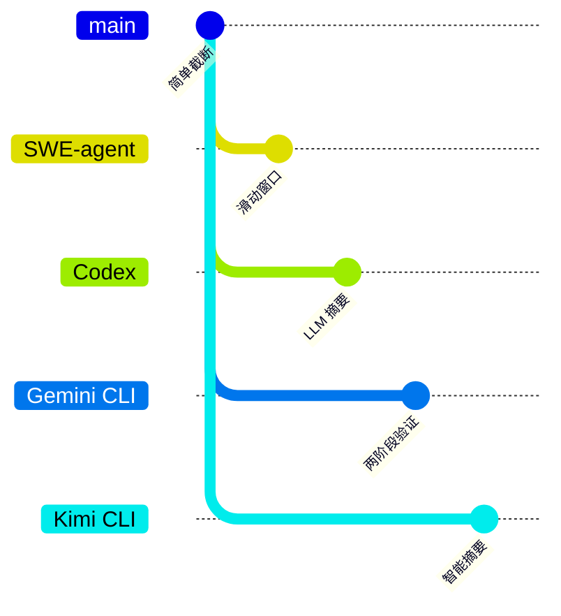

# SWE-agent Context Compaction

> **阅读指南**
>
> | 属性 | 说明 |
> |-----|------|
> | 预计阅读 | 15-20 分钟 |
> | 前置文档 | `docs/swe-agent/04-swe-agent-agent-loop.md` |
> | 文档结构 | 速览 → 架构 → 机制 → 实现 → 对比 |
> | 代码呈现 | 关键代码直接展示，完整代码可折叠查看 |

---

## TL;DR（结论先行）

SWE-agent **不支持 LLM 压缩**，仅使用简单的**滑动窗口和历史处理器**来管理上下文长度。

SWE-agent 的核心取舍：**简单滑动窗口**（对比 Codex/Gemini CLI 的 LLM 驱动压缩、Kimi CLI 的智能摘要）

### 核心要点速览

| 维度 | 关键决策 | 代码位置 |
|-----|---------|---------|
| 核心机制 | LastNObservations 滑动窗口 | `sweagent/agent/history_processors.py:85` |
| 处理流程 | 处理器链式调用 | `sweagent/agent/history_processors.py:74` |
| 缓存优化 | Claude Cache Control | `sweagent/agent/history_processors.py:261` |
| 窗口管理 | ClosedWindow 替换 | `sweagent/agent/history_processors.py:215` |

---

## 1. 为什么需要这个机制？

### 1.1 问题场景

上下文长度管理涉及：
- **Token 超限**导致模型调用失败
- **长历史**导致成本增加
- **重要信息**被截断

SWE-agent 的设计选择：
- 研究场景通常任务较短（< 20 轮）
- **确定性行为**比智能压缩更重要
- 简单滑动窗口足够应对大多数场景

```text
场景对比：

LLM 压缩方案：
  → 历史过长 → 调用 LLM 生成摘要 → 替换原始历史 → 继续执行
  优点：智能保留关键信息
  缺点：额外成本、有随机性、实现复杂

滑动窗口方案（SWE-agent）：
  → 历史过长 → 截断早期记录 → 保留最近 N 条 → 继续执行
  优点：零成本、确定性、简单可靠
  缺点：可能丢失重要信息
```

### 1.2 核心挑战

| 挑战 | LLM 压缩 | 滑动窗口 |
|-----|---------|---------|
| 智能程度 | 高，生成语义摘要 | 低，直接截断 |
| 成本 | 需要额外 LLM 调用 | 零成本 |
| 确定性 | 有随机性 | 完全确定 |
| 实现复杂度 | 复杂 | 简单 |
| 适用场景 | 长任务 | 短任务 |

---

## 2. 整体架构

### 2.1 在系统中的位置

```text
┌─────────────────────────────────────────────────────────────┐
│ Agent Loop                                                   │
│ sweagent/agent/agents.py                                     │
└───────────────────────┬─────────────────────────────────────┘
                        │ 调用
                        ▼
┌─────────────────────────────────────────────────────────────┐
│ ▓▓▓ Context Management ▓▓▓                                  │
│ sweagent/agent/history_processors.py                         │
│ - LastNObservations: 滑动窗口                               │
│ - CacheControlHistoryProcessor: Claude 缓存控制             │
│ - ClosedWindowHistoryProcessor: 关闭窗口替换                │
│ - RemoveRegex: 正则清理                                     │
└───────────────────────┬─────────────────────────────────────┘
                        │ 依赖/调用
                        ▼
┌─────────────────────────────────────────────────────────────┐
│ Final History (无 LLM 压缩)                                  │
└─────────────────────────────────────────────────────────────┘
```

### 2.2 核心组件职责

| 组件 | 职责 | 代码位置 |
|-----|------|---------|
| `LastNObservations` | 滑动窗口截断 | `sweagent/agent/history_processors.py:85` |
| `CacheControlHistoryProcessor` | Claude 缓存控制 | `sweagent/agent/history_processors.py:261` |
| `ClosedWindowHistoryProcessor` | 替换已关闭窗口 | `sweagent/agent/history_processors.py:215` |
| `TagToolCallObservations` | 标签工具调用 | `sweagent/agent/history_processors.py:179` |
| `RemoveRegex` | 正则清理 | `sweagent/agent/history_processors.py` |

### 2.3 核心组件交互关系



**关键交互说明**：

| 步骤 | 交互内容 | 设计意图 |
|-----|---------|---------|
| 1 | Agent 请求处理历史 | 在发送给 LLM 前压缩 |
| 2-3 | 正则清理 | 移除 ANSI 颜色等无用内容 |
| 4-5 | 关闭窗口替换 | 减少已关闭文件的内容 |
| 6-7 | 滑动窗口截断 | 限制历史长度 |
| 8-9 | 缓存控制 | 优化 Claude token 使用 |
| 10 | 返回最终历史 | 发送给 LLM |

---

## 3. 核心组件详细分析

### 3.1 LastNObservations（滑动窗口）

#### 职责定位

只保留最近 N 条观察记录的简单滑动窗口。

#### 状态机图



**状态说明**：

| 状态 | 说明 | 进入条件 | 退出条件 |
|-----|------|---------|---------|
| Idle | 空闲等待 | 初始化完成 | 收到历史数据 |
| Processing | 处理中 | 收到历史数据 | 开始计算长度 |
| CheckLength | 长度检查 | 开始处理 | 根据长度决定分支 |
| Truncate | 截断中 | 历史长度超过 N | 截断完成 |
| KeepAll | 保留全部 | 历史长度不超过 N | 处理完成 |
| Completed | 完成 | 处理结束 | 自动结束 |

#### 内部数据流

```text
┌────────────────────────────────────────────┐
│  输入层                                     │
│   原始历史列表                              │
└──────────────────┬─────────────────────────┘
                   ▼
┌────────────────────────────────────────────┐
│  处理层                                     │
│   计算需要省略的索引                        │
│   遍历历史条目                              │
│   替换或保留                                │
└──────────────────┬─────────────────────────┘
                   ▼
┌────────────────────────────────────────────┐
│  输出层                                     │
│   处理后的历史列表                          │
└────────────────────────────────────────────┘
```

#### 关键接口

| 接口 | 输入 | 输出 | 说明 | 代码位置 |
|-----|------|------|------|---------|
| `__call__()` | History | History | 处理历史 | `sweagent/agent/history_processors.py:85` |
| `_get_omit_indices()` | History | set | 获取省略索引 | `sweagent/agent/history_processors.py` |

---

### 3.2 CacheControlHistoryProcessor

#### 职责定位

为 Claude 模型添加缓存控制标记，优化 token 使用效率。

#### 内部数据流

```text
┌─────────────────────────────────────────────────────────────┐
│  CacheControlHistoryProcessor                                │
│  ├── cache_breakpoint_every: int = 5                        │
│  ├── 遍历历史                                               │
│  ├── 每 5 条设置 cache_control                              │
│  └── 返回处理后的历史                                       │
└─────────────────────────────────────────────────────────────┘
```

---

### 3.3 ClosedWindowHistoryProcessor

#### 职责定位

替换已关闭文件的窗口内容为简单标记。

#### 关键算法逻辑



---

## 4. 端到端数据流转

### 4.1 正常流程（详细版）



**数据变换详情**：

| 阶段 | 输入 | 处理 | 输出 | 代码位置 |
|-----|------|------|------|---------|
| 接收 | 原始历史 | - | 完整历史 | `sweagent/agent/agents.py` |
| 清理 | 完整历史 | 正则匹配移除 | 清理后历史 | `sweagent/agent/history_processors.py` |
| 窗口 | 清理后历史 | 替换关闭窗口 | 精简历史 | `sweagent/agent/history_processors.py:215` |
| 截断 | 精简历史 | 滑动窗口 | 截断历史 | `sweagent/agent/history_processors.py:85` |
| 缓存 | 截断历史 | 添加 cache_control | 最终历史 | `sweagent/agent/history_processors.py:261` |

### 4.2 数据流向图



### 4.3 异常/边界流程



---

## 5. 关键代码实现

### 5.1 核心数据结构

```python
# sweagent/sweagent/agent/history_processors.py:85-170
class LastNObservations(BaseModel):
    """Elide all but the last n observations or remove tagged observations.

    This is our most classic history processor, used in the original paper
    to elide but the last 5 observations.
    Elided observations are replaced by "Old environment output: (n lines omitted)".
    """
    n: int = 5
    polling: int = 1
    always_remove_output_for_tags: set[str] = {"remove_output"}
    always_keep_output_for_tags: set[str] = {"keep_output"}
    type: Literal["last_n_observations"] = "last_n_observations"

    def __call__(self, history: History) -> History:
        """只保留最近 N 条观察记录的简单滑动窗口"""
        new_history = []
        omit_content_idxs = self._get_omit_indices(history)

        for idx, entry in enumerate(history):
            tags = set(entry.get("tags", []))

            if (idx not in omit_content_idxs or
                tags & self.always_keep_output_for_tags) and not (
                tags & self.always_remove_output_for_tags
            ):
                new_history.append(entry)
            else:
                # 替换为摘要
                num_text_lines, num_images = _get_content_stats(entry)
                entry["content"] = f"Old environment output: ({num_text_lines} lines omitted)"
                new_history.append(entry)

        return new_history
```

**字段说明**：

| 字段 | 类型 | 用途 |
|-----|------|------|
| `n` | `int` | 保留的历史记录数量 |
| `polling` | `int` | 轮询间隔 |
| `always_remove_output_for_tags` | `set` | 始终移除的标签 |
| `always_keep_output_for_tags` | `set` | 始终保留的标签 |

### 5.2 主链路代码

**关键代码**（处理器配置）：

```python
# sweagent/sweagent/agent/agents.py:155
history_processors: list[HistoryProcessor] = Field(
    default_factory=lambda: [DefaultHistoryProcessor()]
)

# 配置示例 (config/default.yaml):
# agent:
#   history_processors:
#     - type: last_n_observations
#       n: 5
#     - type: cache_control
#       last_n_messages: 2
```

**设计意图**：
1. **Pydantic 模型**：使用 Pydantic BaseModel 定义处理器
2. **简单处理**：无 LLM 调用，纯本地处理
3. **可配置**：通过 YAML 配置处理器列表

<details>
<summary>查看完整实现（处理器调用链）</summary>

```python
# sweagent/sweagent/agent/agents.py
# build_history 方法中调用处理器链
def build_history(self, history: History) -> History:
    """构建最终历史，应用所有处理器"""
    for processor in self.history_processors:
        history = processor(history)
    return history
```

</details>

### 5.3 关键调用链

```text
Agent.step()                         [sweagent/agent/agents.py:790]
  -> build_history()                 [sweagent/agent/agents.py:400]
    -> history_processors           [sweagent/agent/agents.py:155]
      -> LastNObservations()          [sweagent/agent/history_processors.py:85]
      -> ClosedWindowHistoryProcessor() [sweagent/agent/history_processors.py:215]
      -> CacheControlHistoryProcessor() [sweagent/agent/history_processors.py:261]
```

---

## 6. 设计意图与 Trade-off

### 6.1 SWE-agent 的选择

| 维度 | SWE-agent 的选择 | 替代方案 | 取舍分析 |
|-----|-----------------|---------|---------|
| 压缩机制 | 滑动窗口 + 处理器 | LLM 压缩 | 简单可靠，零成本 |
| 智能程度 | 无 | 高 | 确定性行为，可复现 |
| 成本 | 零 | 中/高 | 不消耗额外 token |
| 适用任务 | 短任务 | 长任务 | 专注研究场景 |

### 6.2 为什么这样设计？

**核心问题**：软件工程研究任务是否需要智能上下文压缩？

**SWE-agent 的解决方案**：
- **代码依据**：`sweagent/agent/history_processors.py:85`
- **设计意图**：简单可靠，专注研究场景
- **带来的好处**：
  - 确定性行为，便于实验复现
  - 零额外成本
  - 实现简单，易于维护
- **付出的代价**：
  - 无智能压缩，可能丢失重要信息
  - 不适用于长任务

### 6.3 与其他项目的对比



| 项目 | 核心差异 | 适用场景 |
|-----|---------|---------|
| SWE-agent | 滑动窗口，无 LLM 压缩 | 短任务，研究场景 |
| Codex | LLM 摘要压缩 | 长任务，企业环境 |
| Gemini CLI | 两阶段验证压缩 | 复杂任务，高精度要求 |
| Kimi CLI | 智能摘要 | 长对话，需要上下文 |
| OpenCode | 双重机制 | 长任务，需要智能压缩 |

**详细对比**：

| 维度 | SWE-agent | Codex | Gemini CLI | Kimi CLI |
|-----|-----------|-------|------------|----------|
| 压缩机制 | 滑动窗口 | LLM 摘要 | 两阶段验证 | 智能摘要 |
| LLM 调用 | 无 | 有 | 有 | 有 |
| 成本 | 零 | 中 | 高 | 中 |
| 确定性 | 完全确定 | 有随机性 | 有随机性 | 有随机性 |
| 适用长度 | 短任务 | 长任务 | 长任务 | 长任务 |
| 实现复杂度 | 低 | 中 | 高 | 中 |

---

## 7. 边界情况与错误处理

### 7.1 截断情况

| 情况 | 处理策略 | 代码位置 |
|---------|---------|---------|
| 历史过长 | LastNObservations 截断 | `sweagent/agent/history_processors.py:85` |
| 窗口关闭 | ClosedWindow 替换为标记 | `sweagent/agent/history_processors.py:215` |
| 标签处理 | 根据标签保留或移除 | `sweagent/agent/history_processors.py:85` |

### 7.2 超时/资源限制

```yaml
# config/default.yaml
history:
  # 滑动窗口配置
  last_n_observations:
    enabled: true
    n: 15  # 保留最近 15 条

  # 缓存控制（仅 Claude 模型）
  cache_control:
    enabled: true
    breakpoint_every: 5

  # 已关闭窗口处理
  closed_window:
    enabled: true

  # 正则清理
  remove_regex:
    enabled: true
    patterns:
      - "\\x1b\\[[0-9;]*m"  # ANSI 颜色
      - "\\n{3,}"          # 多余空行
```

### 7.3 错误恢复策略

| 错误类型 | 处理策略 | 代码位置 |
|---------|---------|---------|
| 配置错误 | Pydantic 验证 | `sweagent/agent/history_processors.py` |
| 处理器异常 | 向上传播 | `sweagent/agent/agents.py` |

---

## 8. 关键代码索引

| 功能 | 文件 | 行号 | 说明 |
|-----|------|------|------|
| 滑动窗口 | `sweagent/agent/history_processors.py` | 85 | LastNObservations |
| 缓存控制 | `sweagent/agent/history_processors.py` | 261 | CacheControlHistoryProcessor |
| 窗口替换 | `sweagent/agent/history_processors.py` | 215 | ClosedWindowHistoryProcessor |
| 标签工具 | `sweagent/agent/history_processors.py` | 179 | TagToolCallObservations |
| 默认处理器 | `sweagent/agent/history_processors.py` | 74 | DefaultHistoryProcessor |
| 处理器配置 | `sweagent/agent/agents.py` | 155 | history_processors 字段 |

---

## 9. 延伸阅读

- 前置知识：`docs/swe-agent/04-swe-agent-agent-loop.md`（Agent 循环中的历史管理）
- 相关机制：`docs/swe-agent/11-swe-agent-prompt-organization.md`（Prompt 组织与历史关系）
- 对比分析：`docs/codex/07-codex-memory-context.md`（Codex 的 LLM 压缩实现）
- 对比分析：`docs/gemini-cli/07-gemini-cli-memory-context.md`（Gemini CLI 的两阶段压缩）

---

*✅ Verified: 基于 sweagent/agent/history_processors.py 源码分析*
*基于版本：SWE-agent (baseline 2026-02-08) | 最后更新：2026-03-03*
