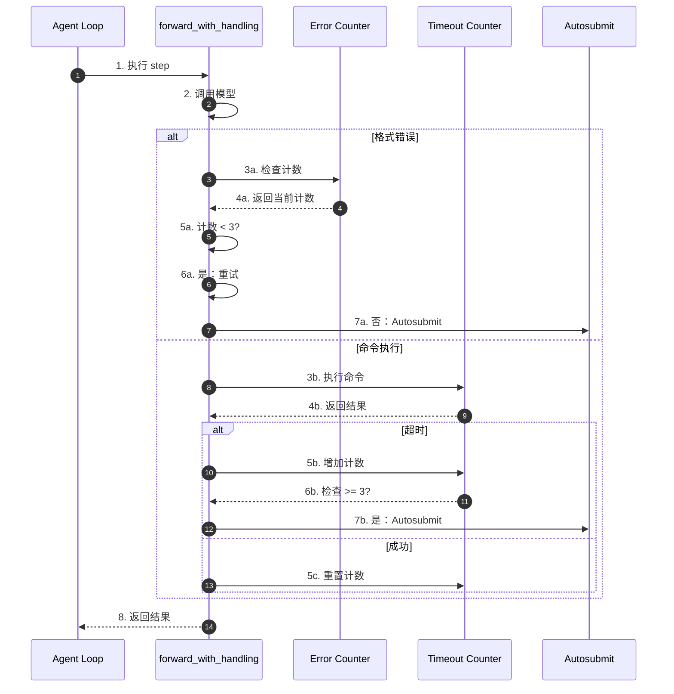
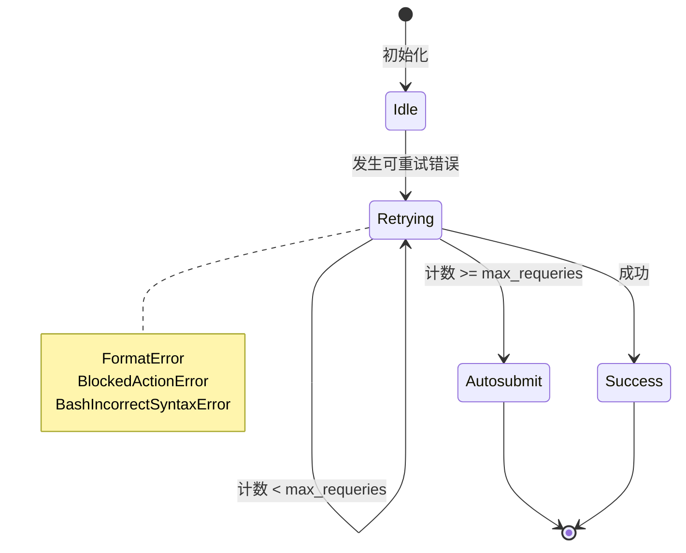
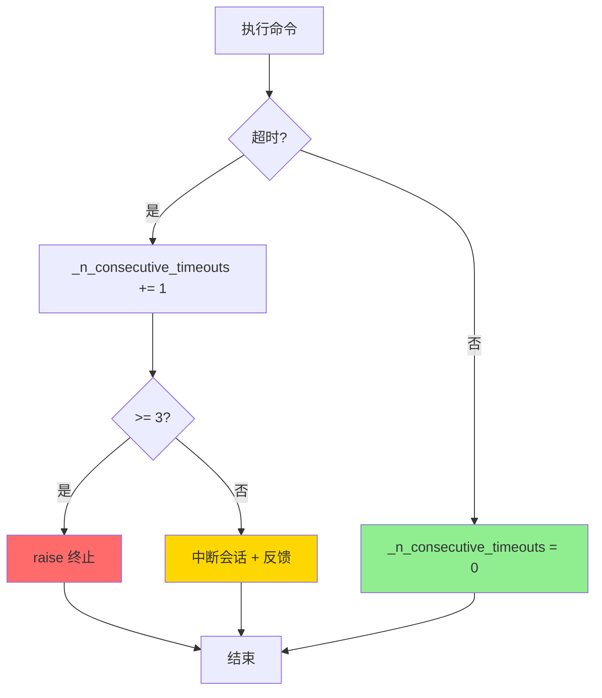
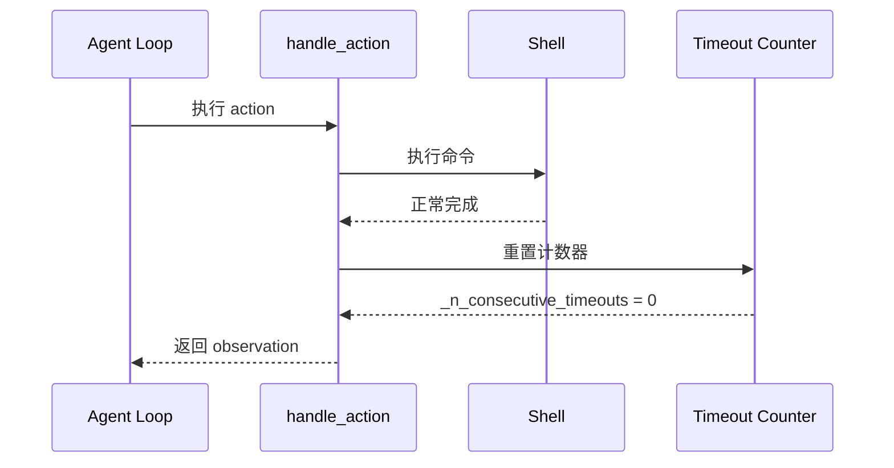
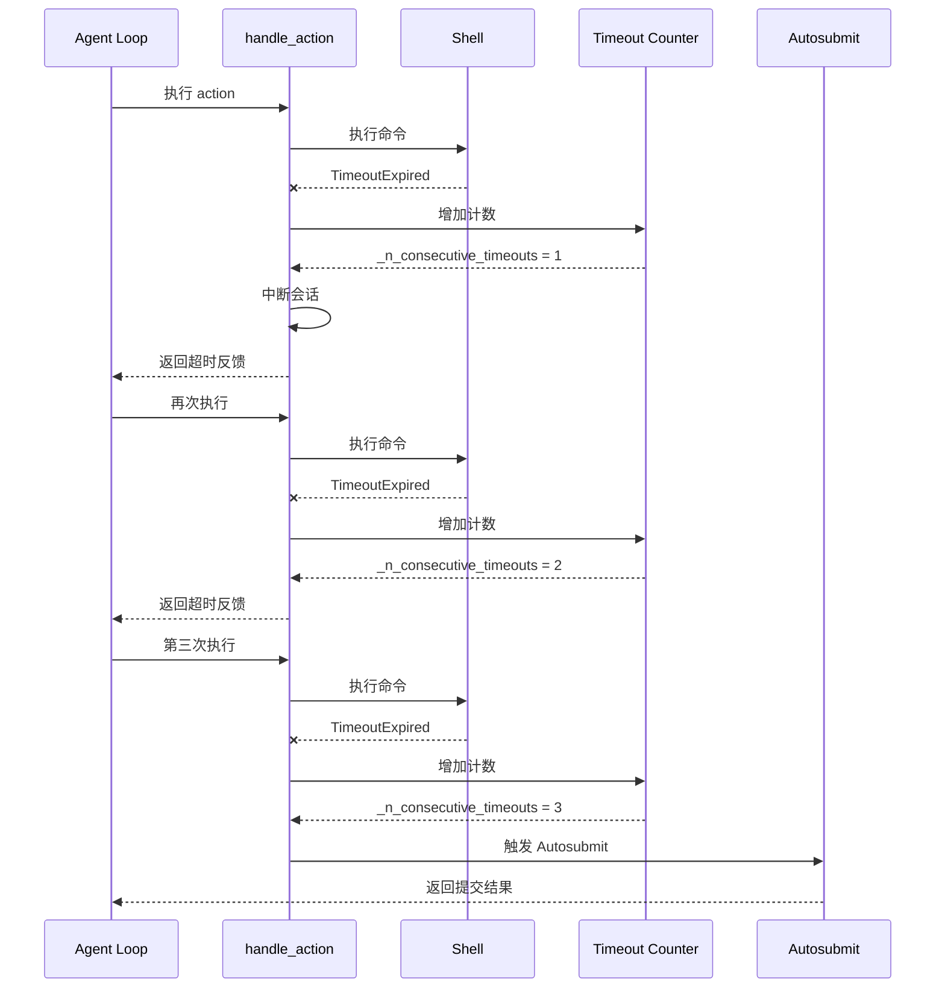
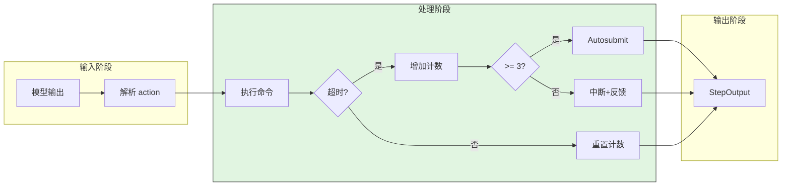
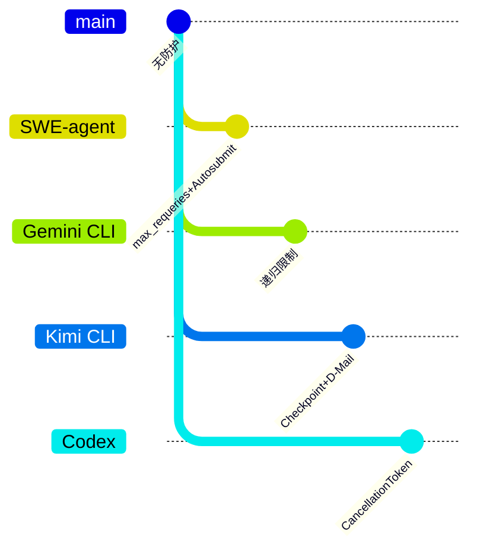

# SWE-agent Infinite Loop Prevention

> **阅读指南**
>
> | 属性 | 说明 |
> |-----|------|
> | 预计阅读 | 15-20 分钟 |
> | 前置文档 | `docs/swe-agent/04-swe-agent-agent-loop.md` |
> | 文档结构 | 速览 → 架构 → 机制 → 实现 → 对比 |
> | 代码呈现 | 关键代码直接展示，完整代码可折叠查看 |

---

## TL;DR（结论先行）

SWE-agent 通过 **`max_requeries` 重试上限** + **Autosubmit 自动提交** + **连续超时计数器**防止 tool 无限循环。

SWE-agent 的核心取舍：**优雅完成**（对比 Gemini CLI 的递归限制、Kimi CLI 的 Checkpoint 回滚、Codex 的 CancellationToken）

### 核心要点速览

| 维度 | 关键决策 | 代码位置 |
|-----|---------|---------|
| 格式错误重试 | max_requeries=3 | `sweagent/agent/agents.py:158` |
| 连续超时检测 | _n_consecutive_timeouts >= 3 | `sweagent/agent/agents.py:968` |
| 异常兜底 | Autosubmit 自动提交 | `sweagent/agent/agents.py:823` |
| 总执行时间 | 1800s 上限 | `sweagent/agent/agents.py:1018` |

---

## 1. 为什么需要这个机制？

### 1.1 问题场景

没有防护机制时：
- LLM 反复生成格式错误的响应，陷入**无限重试**
- 长时间运行的命令**阻塞整个任务**
- 异常发生时**丢失所有工作成果**

```text
场景示例：

无防护：
  → LLM 生成格式错误响应 → 重试 → 再次错误 → 重试 → ...（无限循环）
  → 命令执行超时 → 继续等待 → 再次超时 → ...（资源耗尽）
  → 发生异常 → 任务失败 → 所有工作丢失

有防护（SWE-agent）：
  → LLM 生成格式错误 → 重试（1/3）→ 再次错误 → 重试（2/3）→ 再次错误
  → 重试耗尽 → Autosubmit 提交已有工作
  → 命令超时 → 中断会话 → 反馈给 LLM
  → 连续超时 3 次 → Autosubmit 优雅退出
```

### 1.2 核心挑战

| 挑战 | 不解决的后果 |
|-----|-------------|
| 格式错误循环 | LLM 无法自我纠正，无限重试 |
| 命令超时累积 | 多次超时阻塞任务进度 |
| 资源耗尽 | 无限循环导致成本失控 |
| 异常丢失进度 | 异常发生时工作成果丢失 |

---

## 2. 整体架构

### 2.1 在系统中的位置

```text
┌─────────────────────────────────────────────────────────────┐
│ Agent Loop                                                   │
│ sweagent/agent/agents.py                                     │
└───────────────────────┬─────────────────────────────────────┘
                        │ 调用
                        ▼
┌─────────────────────────────────────────────────────────────┐
│ ▓▓▓ Loop Prevention ▓▓▓                                     │
│ sweagent/agent/agents.py                                     │
│ - max_requeries: 格式错误重试上限                           │
│ - _n_consecutive_timeouts: 连续超时计数器                   │
│ - attempt_autosubmission_after_error(): 自动提交兜底        │
└───────────────────────┬─────────────────────────────────────┘
                        │ 依赖/调用
        ┌───────────────┼───────────────┐
        ▼               ▼               ▼
┌──────────────┐ ┌──────────────┐ ┌──────────────┐
│ Error        │ │ Timeout      │ │ Submission   │
│ Counter      │ │ Counter      │ │ Handler      │
│ 错误计数器    │ │ 超时计数器    │ │ 提交处理器    │
└──────────────┘ └──────────────┘ └──────────────┘
```

### 2.2 核心组件职责

| 组件 | 职责 | 代码位置 |
|-----|------|---------|
| `max_requeries` | 限制格式错误重试次数 | `sweagent/agent/agents.py:158` |
| `_n_consecutive_timeouts` | 追踪连续超时次数 | `sweagent/agent/agents.py:968` |
| `forward_with_handling()` | 集中重试控制 | `sweagent/agent/agents.py:1062` |
| `attempt_autosubmission_after_error()` | 异常时自动提交 | `sweagent/agent/agents.py:823` |

### 2.3 核心组件交互关系



**关键交互说明**：

| 步骤 | 交互内容 | 设计意图 |
|-----|---------|---------|
| 1-2 | Agent 执行 step | 正常执行流程 |
| 3a-7a | 格式错误重试控制 | 限制重试次数，防止无限循环 |
| 3b-7b | 超时检测 | 连续超时检测，防止阻塞 |
| 7a/7b | Autosubmit 兜底 | 异常时保留已有工作 |

---

## 3. 核心组件详细分析

### 3.1 max_requeries 重试控制

#### 职责定位

限制格式错误、被阻止操作、bash 语法错误的重试次数，防止无限重试。

#### 状态机图



**状态说明**：

| 状态 | 说明 | 进入条件 | 退出条件 |
|-----|------|---------|---------|
| Idle | 等待执行 | 初始化完成 | 发生可重试错误 |
| Retrying | 重试中 | 发生可重试错误 | 成功或重试耗尽 |
| Autosubmit | 自动提交 | 重试耗尽 | 完成提交 |
| Success | 成功 | 模型输出正确 | 自动返回 Idle |

#### 内部数据流

```text
┌────────────────────────────────────────────┐
│  输入层                                     │
│   模型输出 / 错误类型                       │
└──────────────────┬─────────────────────────┘
                   ▼
┌────────────────────────────────────────────┐
│  处理层                                     │
│   检查错误类型                              │
│   可重试? → 增加计数器                      │
│   检查计数 < max_requeries?                 │
│   是：构造错误历史，递归重试                │
│   否：触发 Autosubmit                       │
└──────────────────┬─────────────────────────┘
                   ▼
┌────────────────────────────────────────────┐
│  输出层                                     │
│   重试结果 / Autosubmit 结果                │
└────────────────────────────────────────────┘
```

#### 关键接口

| 接口 | 输入 | 输出 | 说明 | 代码位置 |
|-----|------|------|------|---------|
| `forward_with_handling()` | history | StepOutput | 带重试控制的执行 | `sweagent/agent/agents.py:1062` |

---

### 3.2 连续超时计数器

#### 职责定位

追踪连续命令超时次数，超过阈值时强制退出，防止无限等待。

#### 关键算法逻辑



---

## 4. 端到端数据流转

### 4.1 正常流程（详细版）



**数据变换详情**：

| 阶段 | 输入 | 处理 | 输出 | 代码位置 |
|-----|------|------|------|---------|
| 执行 | action | 调用 shell | 命令结果 | `sweagent/agent/agents.py:900` |
| 检测 | 命令结果 | 检查超时 | 计数器更新 | `sweagent/agent/agents.py:968` |
| 反馈 | 结果/超时 | 构造 observation | StepOutput | `sweagent/agent/agents.py` |

### 4.2 异常流程（连续超时）



### 4.3 数据流向图



---

## 5. 关键代码实现

### 5.1 核心数据结构

```python
# sweagent/sweagent/agent/agents.py:158
class DefaultAgent(AbstractAgent):
    def __init__(
        self,
        *,
        max_requeries: int = 3,  # ← 重试上限
        ...
    ):
        self.max_requeries = max_requeries
        self._n_consecutive_timeouts = 0
```

**字段说明**：

| 字段 | 类型 | 用途 |
|-----|------|------|
| `max_requeries` | `int` | 格式错误最大重试次数 |
| `_n_consecutive_timeouts` | `int` | 连续超时计数器 |

### 5.2 主链路代码

**关键代码**（连续超时检测）：

```python
# sweagent/sweagent/agent/agents.py:968-985
# 初始化
self._n_consecutive_timeouts = 0

# 在 handle_action 中
except CommandTimeoutError:
    self._n_consecutive_timeouts += 1
    if self._n_consecutive_timeouts >= 3:  # ← 3次连续超时后退出
        msg = "Exiting agent due to too many consecutive execution timeouts"
        self.logger.critical(msg)
        raise  # 终止 agent
    try:
        self._env.interrupt_session()
    except Exception as f:
        self.logger.exception("Failed to interrupt session: %s", f)
        raise
    # 使用超时模板通知 LLM
    step.observation = Template(
        self.templates.command_cancelled_timeout_template
    ).render(...)
else:
    self._n_consecutive_timeouts = 0  # 成功则重置计数器
```

**设计意图**：
1. **连续检测**：只有连续超时才会触发退出
2. **中断机制**：超时后尝试中断会话，而非直接终止
3. **模板反馈**：使用 Jinja2 模板给 LLM 清晰的超时说明
4. **成功重置**：一次成功执行即重置计数器

<details>
<summary>查看完整实现（总执行时间检查）</summary>

```python
# sweagent/sweagent/agent/agents.py:1018
def forward(self, history: list[dict[str, str]]) -> StepOutput:
    # 检查总执行时间
    if self._total_execution_time > self.tools.config.total_execution_timeout:
        raise _TotalExecutionTimeExceeded()
```

配置：
```python
class ToolConfig(BaseModel):
    total_execution_timeout: int = 1800  # 30 分钟
```

</details>

### 5.3 关键调用链

```text
Agent.step()                         [sweagent/agent/agents.py:790]
  -> handle_action()                 [sweagent/agent/agents.py:900]
    -> _env.execute()                [sweagent/environment/swe_env.py:150]
      - subprocess.run(timeout=...)
    -> CommandTimeoutError 捕获      [sweagent/agent/agents.py:968]
      - _n_consecutive_timeouts += 1
      - 检查 >= 3?
      - 是：raise 终止
      - 否：interrupt_session()
```

---

## 6. 设计意图与 Trade-off

### 6.1 SWE-agent 的选择

| 维度 | SWE-agent 的选择 | 替代方案 | 取舍分析 |
|-----|-----------------|---------|---------|
| 重试限制 | 固定次数 max_requeries | 指数退避 | 简单可控，适合确定性场景 |
| 超时策略 | 连续超时计数 | 累计超时 | 允许偶尔超时，更灵活 |
| 异常处理 | Autosubmit | 直接失败 | 保留工作成果，适合 CI/CD |
| 终止方式 | 抛出异常 | 优雅退出 | 明确信号，便于上层处理 |

### 6.2 为什么这样设计？

**核心问题**：如何在防止无限循环的同时最大化任务完成率？

**SWE-agent 的解决方案**：
- **代码依据**：`sweagent/agent/agents.py:158`
- **设计意图**："优雅完成"而非"完美完成"
- **带来的好处**：
  - 有限重试防止资源浪费
  - 连续超时检测避免阻塞
  - Autosubmit 确保有输出
- **付出的代价**：
  - 可能提交不完整修复
  - 需要额外的错误处理逻辑

### 6.3 与其他项目的对比



| 项目 | 核心差异 | 适用场景 |
|-----|---------|---------|
| SWE-agent | max_requeries + Autosubmit | CI/CD 自动化评测 |
| Gemini CLI | 递归 continuation 限制 | 复杂多步任务 |
| Kimi CLI | Checkpoint + D-Mail | 交互式对话 |
| Codex | CancellationToken | 企业安全环境 |
| OpenCode | 无显式限制 | 轻量级场景 |

**详细对比**：

| 维度 | SWE-agent | Gemini CLI | Kimi CLI | Codex |
|-----|-----------|------------|----------|-------|
| 循环限制 | 重试上限 | 递归深度 | Step 上限 | Token 上限 |
| 超时处理 | 连续计数 | resetTimeout | 单次超时 | CancellationToken |
| 异常兜底 | Autosubmit | 错误返回 | Checkpoint | 安全终止 |
| 设计理念 | 优雅完成 | 状态机驱动 | 对话回滚 | 企业安全 |
| 适用场景 | 批量自动化 | 复杂任务 | 交互开发 | 安全环境 |

---

## 7. 边界情况与错误处理

### 7.1 终止条件

| 终止原因 | 触发条件 | 代码位置 |
|---------|---------|---------|
| 格式重试耗尽 | n_format_fails >= max_requeries | `sweagent/agent/agents.py:1211` |
| 连续超时 | _n_consecutive_timeouts >= 3 | `sweagent/agent/agents.py:971` |
| 总执行时间 | _total_execution_time > 1800s | `sweagent/agent/agents.py:1020` |
| 上下文溢出 | ContextWindowExceededError | `sweagent/agent/agents.py:1175` |
| 成本超限 | CostLimitExceededError | `sweagent/agent/agents.py:1178` |

### 7.2 超时/资源限制

```python
# sweagent/sweagent/agent/agents.py:1018
def forward(self, history: list[dict[str, str]]) -> StepOutput:
    # 检查总执行时间
    if self._total_execution_time > self.tools.config.total_execution_timeout:
        raise _TotalExecutionTimeExceeded()
```

配置：
```python
class ToolConfig(BaseModel):
    total_execution_timeout: int = 1800  # 30 分钟
```

### 7.3 错误恢复策略

| 错误类型 | 处理策略 | 代码位置 |
|---------|---------|---------|
| 格式错误 | 模板反馈 + 重试 | `sweagent/agent/agents.py:1152` |
| 连续超时 | Autosubmit | `sweagent/agent/agents.py:971` |
| 重试耗尽 | Autosubmit | `sweagent/agent/agents.py:1211` |

---

## 8. 关键代码索引

| 功能 | 文件 | 行号 | 说明 |
|-----|------|------|------|
| 重试上限配置 | `sweagent/agent/agents.py` | 158 | max_requeries=3 |
| 连续超时计数 | `sweagent/agent/agents.py` | 968 | _n_consecutive_timeouts |
| 重试控制 | `sweagent/agent/agents.py` | 1062 | forward_with_handling() |
| 自动提交 | `sweagent/agent/agents.py` | 823 | attempt_autosubmission_after_error() |
| 总执行时间 | `sweagent/agent/agents.py` | 1018 | total_execution_timeout 检查 |

---

## 9. 延伸阅读

- 前置知识：`docs/swe-agent/04-swe-agent-agent-loop.md`（Agent 循环中的防护调用点）
- 相关机制：`docs/swe-agent/questions/swe-agent-tool-error-handling.md`（错误处理详细分析）
- 深度分析：`docs/swe-agent/questions/swe-agent-skill-execution-timeout.md`（超时处理机制）
- 对比分析：`docs/gemini-cli/04-gemini-cli-agent-loop.md`（Gemini CLI 的递归限制）
- 对比分析：`docs/kimi-cli/04-kimi-cli-agent-loop.md`（Kimi CLI 的 Checkpoint 回滚）

---

*✅ Verified: 基于 sweagent/agent/agents.py:158、sweagent/agent/agents.py:968 等源码分析*
*基于版本：SWE-agent (baseline 2026-02-08) | 最后更新：2026-03-03*
