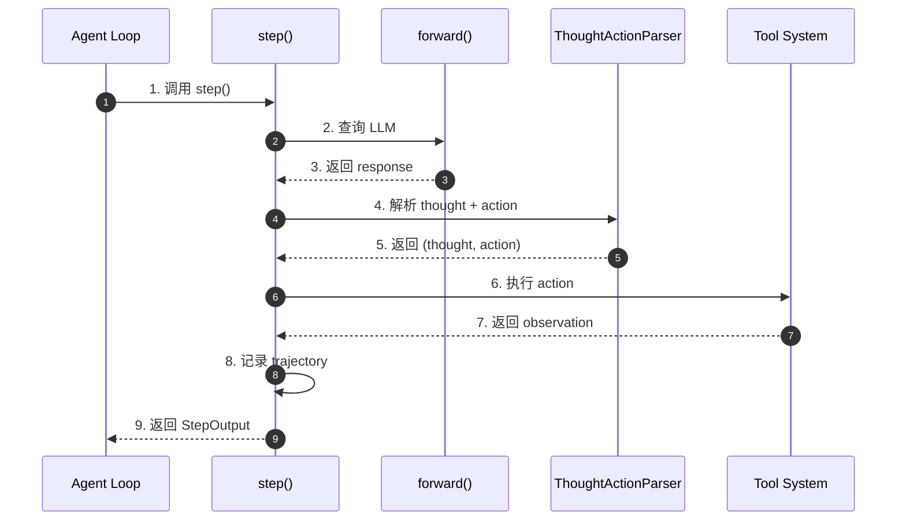
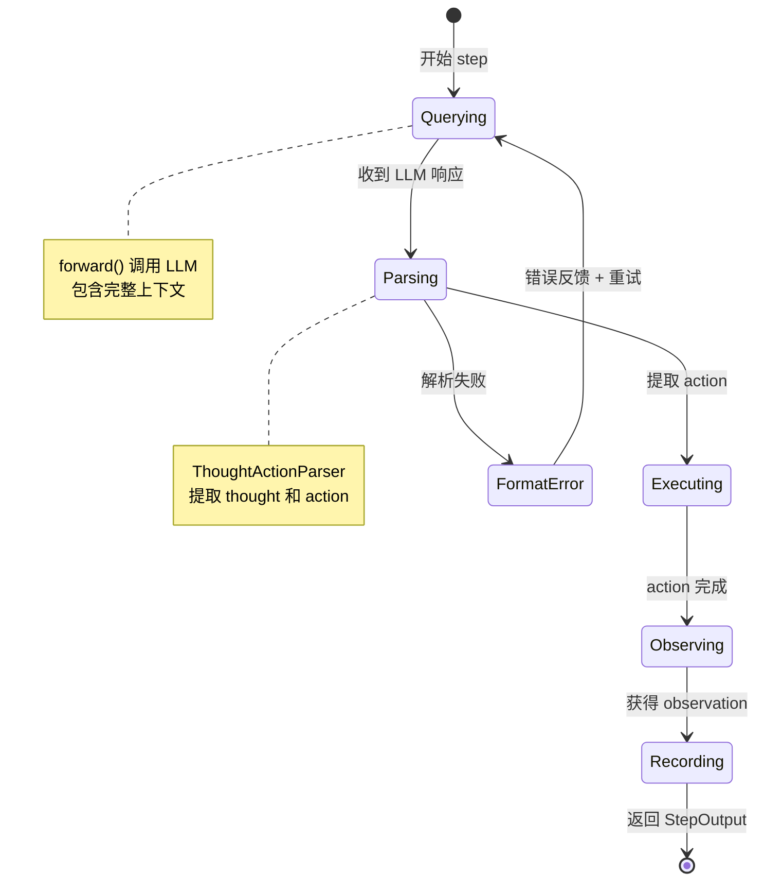
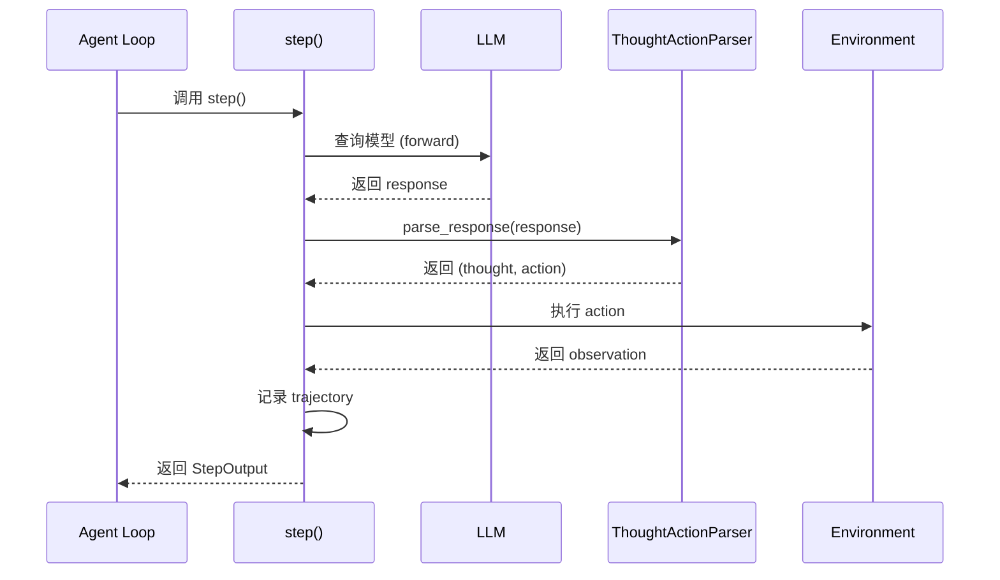
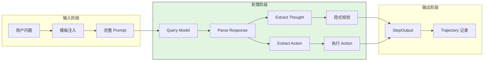
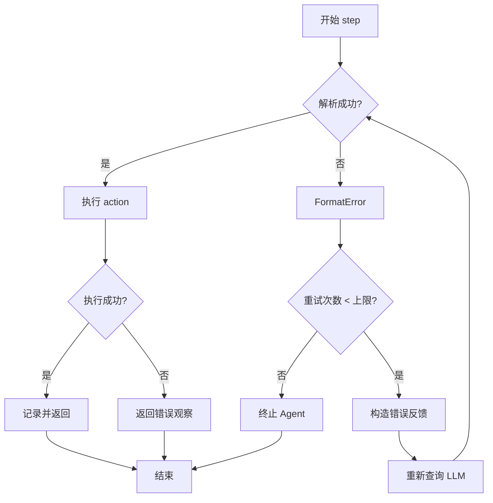
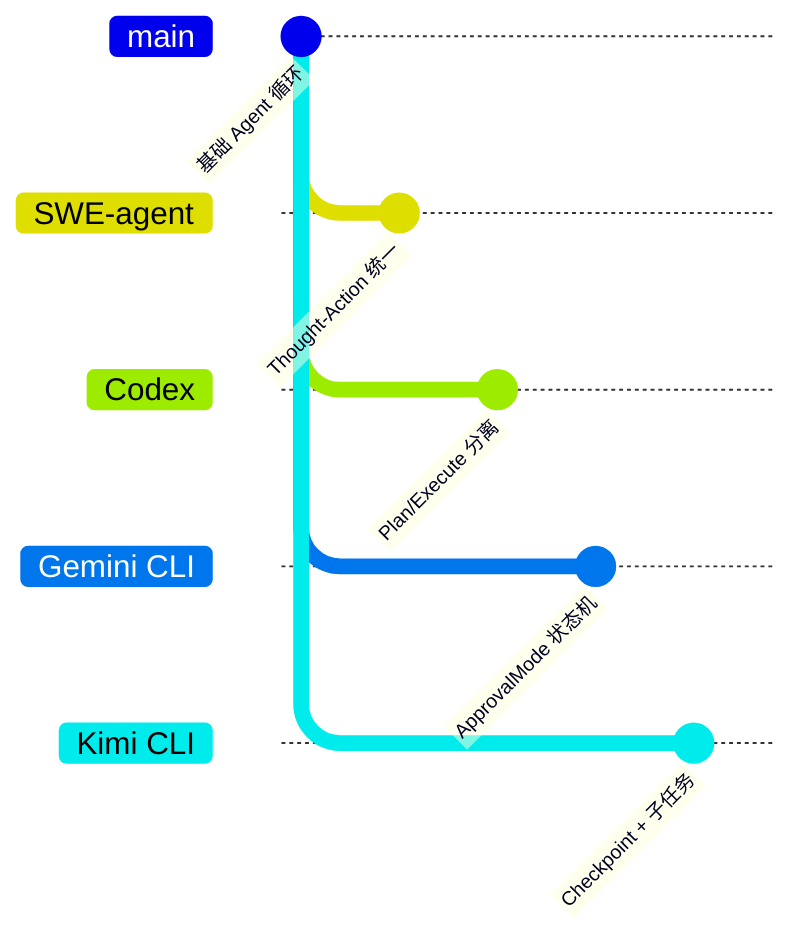

# SWE-agent Plan and Execute

> **阅读指南**
>
> | 属性 | 说明 |
> |-----|------|
> | 预计阅读 | 15-20 分钟 |
> | 前置文档 | `docs/swe-agent/04-swe-agent-agent-loop.md`、`docs/swe-agent/11-swe-agent-prompt-organization.md` |
> | 文档结构 | 结论 → 架构 → 组件分析 → 数据流 → 代码实现 → 对比 |
> | 代码呈现 | 关键代码直接展示，完整代码可折叠查看 |

---

## TL;DR（结论先行）

**SWE-agent 没有实现专门的 "plan and execute" 模式**，而是采用**统一的 thought-action 循环**架构，将规划和执行集成在单个步骤中。

SWE-agent 的核心取舍：**简化架构，隐式规划**（对比 Codex 的显式 Plan/Execute 模式切换、Gemini CLI 的 ApprovalMode 状态机）

### 核心要点速览

| 维度 | 关键决策 | 代码位置 |
|-----|---------|---------|
| 核心机制 | Thought-Action 统一循环，无显式阶段分离 | `sweagent/agent/agents.py:step()` |
| 规划方式 | 隐式规划：每 step 内部通过 thought 完成 | `sweagent/tools/parsing.py:ThoughtActionParser` |
| 模板引导 | system_template + instance_template 提供程序性指导 | `sweagent/agent/agents.py:TemplateConfig` |
| 错误处理 | FormatError 时通过错误模板反馈重试 | `sweagent/agent/agents.py:1153` |

---

## 1. 为什么需要这个机制？

### 1.1 问题场景

Plan-and-Execute 模式试图解决：
- 复杂任务需要预先规划
- 执行前需要用户确认计划
- 规划阶段需要限制工具使用

SWE-agent 的设计选择：
- 软件工程任务往往需要边探索边调整
- 预先制定完整计划困难且容易过时
- 每步都重新规划更灵活

```
传统 Plan-and-Execute 的问题：
  → Plan 阶段：制定完整计划（禁止执行工具）
  → 用户确认：等待用户审批
  → Execute 阶段：按计划执行
  问题：软件工程任务难以预先规划，环境变化快

SWE-agent 的 Thought-Action 模式：
  → Step 1: Thought(分析) → Action(执行) → Observation(观察)
  → Step 2: Thought(基于新信息重新分析) → Action → Observation
  → Step N: 持续迭代直到完成
  优势：每步都可根据最新观察调整策略
```

### 1.2 核心挑战

| 挑战 | Plan-and-Execute | Thought-Action |
|-----|------------------|----------------|
| 任务适应性 | 适合预定义流程 | 适合探索性任务 |
| 用户交互 | 需要确认环节 | 自主执行 |
| 架构复杂度 | 需要模式切换 | 简单统一 |
| 灵活性 | 计划变更成本高 | 每步可调整 |

---

## 2. 整体架构

### 2.1 在系统中的位置

```text
┌─────────────────────────────────────────────────────────────┐
│ CLI Entry / Batch Runner                                     │
│ sweagent/run/run_single.py                                   │
└───────────────────────┬─────────────────────────────────────┘
                        │ 调用
                        ▼
┌─────────────────────────────────────────────────────────────┐
│ ▓▓▓ Agent Loop (Thought-Action) ▓▓▓                        │
│ sweagent/agent/agents.py                                     │
│ - run()      : 主循环入口                                   │
│ - step()     : 单步 thought + action + observation          │
│ - forward()  : LLM 查询                                     │
│ - parse_response(): 提取 thought/action                     │
└───────────────────────┬─────────────────────────────────────┘
                        │ 依赖/调用
        ┌───────────────┼───────────────┐
        ▼               ▼               ▼
┌──────────────┐ ┌──────────────┐ ┌──────────────┐
│ LLM API      │ │ Tool System  │ │ Template     │
│ 模型调用      │ │ 工具执行      │ │ 模板渲染      │
└──────────────┘ └──────────────┘ └──────────────┘
```

### 2.2 核心组件职责

| 组件 | 职责 | 代码位置 |
|-----|------|---------|
| `Agent.run()` | 主循环入口，驱动多轮 step | `sweagent/agent/agents.py:1265` |
| `Agent.step()` | 单步执行：查询 → 解析 → 执行 → 记录 | `sweagent/agent/agents.py:1037` |
| `forward()` | 调用 LLM，处理上下文和响应 | `sweagent/agent/agents.py:1018` |
| `ThoughtActionParser` | 解析模型响应，提取 thought 和 action | `sweagent/tools/parsing.py` |
| `TemplateConfig` | 配置 system/instance/next_step 模板 | `sweagent/agent/agents.py:60` |

### 2.3 核心组件交互关系



**关键交互说明**：

| 步骤 | 交互内容 | 设计意图 |
|-----|---------|---------|
| 1 | Agent Loop 调用 step() | 统一入口，简化控制流 |
| 2-3 | 查询 LLM 获取响应 | 获取模型的 thought 和 action |
| 4-5 | 解析响应提取结构 | 将自由文本转为结构化数据 |
| 6-7 | 执行工具获取观察 | 实际影响环境，获取反馈 |
| 8 | 记录完整轨迹 | 支持断点续传和结果分析 |

---

## 3. 核心组件详细分析

### 3.1 Thought-Action 循环

#### 职责定位

每个步骤包含完整的 thought-action-observation 周期，规划发生在 thought 阶段，执行发生在 action 阶段，两者在同一个 step 内完成。

#### 状态机图



**状态说明**：

| 状态 | 说明 | 进入条件 | 退出条件 |
|-----|------|---------|---------|
| Querying | 查询 LLM | step() 开始 | 收到响应或出错 |
| Parsing | 解析响应 | 收到 LLM 响应 | 成功提取或格式错误 |
| Executing | 执行 action | 成功解析 action | action 完成 |
| Observing | 获取观察 | action 执行完成 | 获得 observation |
| Recording | 记录轨迹 | 获得 observation | 保存完成 |
| FormatError | 格式错误 | 解析失败 | 重试或终止 |

#### 内部数据流

```text
┌─────────────────────────────────────────────────────────────┐
│  Thought-Action 循环内部数据流                               │
├─────────────────────────────────────────────────────────────┤
│                                                              │
│  输入层                                                       │
│   ├── History (对话历史)                                     │
│   ├── System Template (系统身份定义)                         │
│   ├── Instance Template (问题描述)                           │
│   └── Next Step Template (下一步指导)                        │
│                         │                                    │
│                         ▼                                    │
│  处理层                                                       │
│   ├── forward(): 构造 prompt → 调用 LLM                      │
│   ├── parse_response(): 提取 thought + action               │
│   └── execute_action(): 执行工具调用                         │
│                         │                                    │
│                         ▼                                    │
│  输出层                                                       │
│   ├── StepOutput (thought, action, observation)             │
│   └── Trajectory (完整执行历史)                              │
│                                                              │
└─────────────────────────────────────────────────────────────┘
```

---

### 3.2 ThoughtActionParser

#### 职责定位

解析模型响应，提取 thought（自由文本）和 action（代码块格式）。

#### 关键接口

| 接口 | 输入 | 输出 | 说明 | 代码位置 |
|-----|------|------|------|---------|
| `parse()` | 模型响应文本 | `(thought, action)` | 主解析方法 | `sweagent/tools/parsing.py` |
| `extract_action()` | 响应文本 | action 字符串 | 提取代码块 | `sweagent/tools/parsing.py` |
| `extract_thought()` | 响应文本 | thought 字符串 | 提取自由文本 | `sweagent/tools/parsing.py` |

---

## 4. 端到端数据流转

### 4.1 正常流程（详细版）



**数据变换详情**：

| 阶段 | 输入 | 处理 | 输出 | 代码位置 |
|-----|------|------|------|---------|
| 查询 | History + Templates | 构造 prompt | LLM 请求 | `agents.py:1018` |
| 响应 | LLM 响应 | 接收响应文本 | raw_response | `agents.py:1040` |
| 解析 | raw_response | 提取 thought/action | (thought, action) | `agents.py:1045` |
| 执行 | action | 调用工具 | observation | `agents.py:1050` |
| 记录 | step 数据 | 序列化 JSON | trajectory 文件 | `agents.py:779` |

### 4.2 数据流向图



### 4.3 异常/边界流程



---

## 5. 关键代码实现

### 5.1 核心数据结构

```python
# sweagent/agent/agents.py:60-75
class TemplateConfig(BaseModel):
    """模板配置：定义 Agent 的行为模式"""
    system_template: str = ""
    """系统身份定义：告诉模型它是谁、能做什么"""

    instance_template: str = ""
    """问题实例描述：当前任务的具体信息"""

    next_step_template: str = "Observation: {{observation}}"
    """下一步指导：如何构造下一步的提示"""

    strategy_template: str | None = None
    """战略规划模板（可选）：额外的规划指导"""
```

**字段说明**：

| 字段 | 类型 | 用途 |
|-----|------|------|
| `system_template` | `str` | 系统身份定义，包含角色和能力说明 |
| `instance_template` | `str` | 问题实例描述，包含具体任务信息 |
| `next_step_template` | `str` | 下一步指导，控制 thought-action 格式 |
| `strategy_template` | `str | None` | 战略规划（可选），提供额外规划指导 |

### 5.2 主链路代码

**关键代码**（核心逻辑）：

```python
# sweagent/agent/agents.py:1037-1070
def step(self) -> StepOutput:
    """Single step: query model, extract thought/action, execute."""
    # 1. 查询 LLM，带错误处理和重试
    response = self.forward_with_handling()

    # 2. 解析响应，提取 thought 和 action
    thought, action = self.parse_response(response)

    # 3. 执行 action，获取 observation
    observation = self.execute_action(action)

    # 4. 记录到 trajectory
    self.trajectory.add_step(thought, action, observation)

    return StepOutput(
        thought=thought,
        action=action,
        observation=observation
    )

def run(self, env, problem_statement, output_dir) -> AgentRunResult:
    """Run the agent: thought-action loop until done."""
    self.setup(env=env, problem_statement=problem_statement, output_dir=output_dir)

    step_output = StepOutput()
    while not step_output.done:
        step_output = self.step()  # 单步 thought+action+observation
        self.save_trajectory()     # 每步保存
```

**设计意图**：

1. **统一循环**：无阶段分离，每个迭代执行完整周期，简化架构
2. **隐式规划**：规划发生在 thought 阶段，通过模板引导模型自我讨论
3. **每步持久化**：支持断点续传和结果分析

<details>
<summary>查看完整实现</summary>

```python
# sweagent/agent/agents.py:1037-1100
@traced
async def step(self) -> StepOutput:
    """Single step of the agent: query model, parse, execute."""
    self.logger.info("STEP %d", self._step_count)

    # 查询模型（带错误处理）
    response = await self.forward_with_handling()

    # 解析 thought 和 action
    try:
        thought, action = self.parse_response(response)
    except FormatError as e:
        # 格式错误时，构造错误反馈并重试
        self._handle_format_error(e)
        raise

    # 执行 action
    observation = await self.execute_action(action)

    # 组装输出
    step_output = StepOutput(
        thought=thought,
        action=action,
        observation=observation,
        done=self._check_done(action, observation)
    )

    # 更新状态
    self._step_count += 1
    self._add_step_to_trajectory(step_output)

    return step_output
```

</details>

### 5.3 关键调用链

```text
Agent.run()                          [sweagent/agent/agents.py:1265]
  -> step()                          [sweagent/agent/agents.py:1037]
    -> forward_with_handling()       [sweagent/agent/agents.py:1062]
      -> forward()                   [sweagent/agent/agents.py:1018]
        - 构造 prompt
        - 调用 LLM
    -> parse_response()              [sweagent/agent/agents.py:1045]
      -> ThoughtActionParser()       [sweagent/tools/parsing.py]
        - 提取 thought
        - 提取 action
    -> execute_action()              [sweagent/agent/agents.py:1050]
      - 执行工具
      - 返回 observation
    -> save_trajectory()             [sweagent/agent/agents.py:779]
      - 持久化到磁盘
```

---

## 6. 设计意图与 Trade-off

### 6.1 SWE-agent 的选择

| 维度 | SWE-agent 的选择 | 替代方案 | 取舍分析 |
|-----|-----------------|---------|---------|
| 架构模式 | Thought-Action 统一 | Plan-and-Execute 分离 | 简单灵活，适合探索；缺乏系统性规划 |
| 规划时机 | 每步隐式规划 | 预规划阶段 | 适应新信息，但可能重复思考 |
| 用户确认 | 无（自主执行） | 有（ApprovalMode） | 适合自动化，但需更多监督 |
| 工具权限 | 无限制 | Plan 阶段限制 | 灵活但需模型自律 |
| 错误恢复 | forward_with_handling 重试 | 阶段级回滚 | 实现简单，恢复粒度粗 |

### 6.2 为什么这样设计？

**核心问题**：软件工程任务是否需要显式的 Plan-and-Execute？

**SWE-agent 的解决方案**：
- 代码依据：`sweagent/agent/agents.py:step()`
- 设计意图：简化架构，专注探索性任务
- 带来的好处：
  - 架构简单，易于实现和维护
  - 每步都可调整策略，适应环境变化
  - 适合边探索边调整的软件工程任务
  - 无需复杂的模式切换逻辑
- 付出的代价：
  - 缺乏系统性规划，可能遗漏关键步骤
  - 无用户确认环节，不适合敏感操作
  - 依赖模型自律，可能产生不当操作

### 6.3 与其他项目的对比



| 项目 | 核心差异 | 适用场景 |
|-----|---------|---------|
| **SWE-agent** | Thought-Action 统一循环，隐式规划 | Bug 修复、探索性重构、自动化评测 |
| **Codex** | 显式 Plan/Execute 模式切换 | 需求明确的大型功能开发 |
| **Gemini CLI** | ApprovalMode 状态机，用户确认 | 需要用户审批的敏感操作 |
| **Kimi CLI** | Checkpoint 支持完整状态回滚 | 交互式对话开发 |
| **OpenCode** | resetTimeoutOnProgress 长任务支持 | 长时间运行的复杂任务 |

---

## 7. 边界情况与错误处理

### 7.1 终止条件

| 终止原因 | 触发条件 | 代码位置 |
|---------|---------|---------|
| 任务完成 | step_output.done = True | `sweagent/agent/agents.py:1284` |
| 重试耗尽 | n_format_fails >= max_requeries | `sweagent/agent/agents.py:1211` |
| 上下文溢出 | ContextWindowExceededError | `sweagent/agent/agents.py:1176` |
| 最大步数 | step_count >= max_steps | Agent 配置 |

### 7.2 错误恢复策略

| 错误类型 | 处理策略 | 代码位置 |
|---------|---------|---------|
| FormatError | 模板反馈 + 重试（最多 3 次） | `sweagent/agent/agents.py:1153` |
| 解析失败 | 错误模板提示模型修正格式 | `sweagent/tools/parsing.py` |
| 工具执行失败 | 返回错误 observation 给 LLM | `sweagent/agent/agents.py:1050` |
| LLM API 错误 | 指数退避重试 | `sweagent/agent/models.py` |

---

## 8. 关键代码索引

| 功能 | 文件 | 行号 | 说明 |
|-----|------|------|------|
| Agent Loop 入口 | `sweagent/agent/agents.py` | 1265 | run() 主循环 |
| Step 实现 | `sweagent/agent/agents.py` | 1037 | step() thought-action |
| 模板配置 | `sweagent/agent/agents.py` | 60 | TemplateConfig 类 |
| 响应解析 | `sweagent/tools/parsing.py` | - | ThoughtActionParser |
| 错误处理 | `sweagent/agent/agents.py` | 1062 | forward_with_handling |
| Trajectory 保存 | `sweagent/agent/agents.py` | 779 | save_trajectory |

---

## 9. 延伸阅读

- 前置知识：`docs/swe-agent/04-swe-agent-agent-loop.md`（Agent 循环详细分析）
- 相关机制：`docs/swe-agent/11-swe-agent-prompt-organization.md`（模板系统）
- 对比分析：`docs/codex/04-codex-agent-loop.md`（Codex 的 Plan-and-Execute 实现）
- 对比分析：`docs/gemini-cli/04-gemini-cli-agent-loop.md`（Gemini CLI 的 ApprovalMode）

---

*✅ Verified: 基于 sweagent/agent/agents.py、sweagent/tools/parsing.py 等源码分析*
*基于版本：SWE-agent (baseline 2026-02-08) | 最后更新：2026-03-03*
